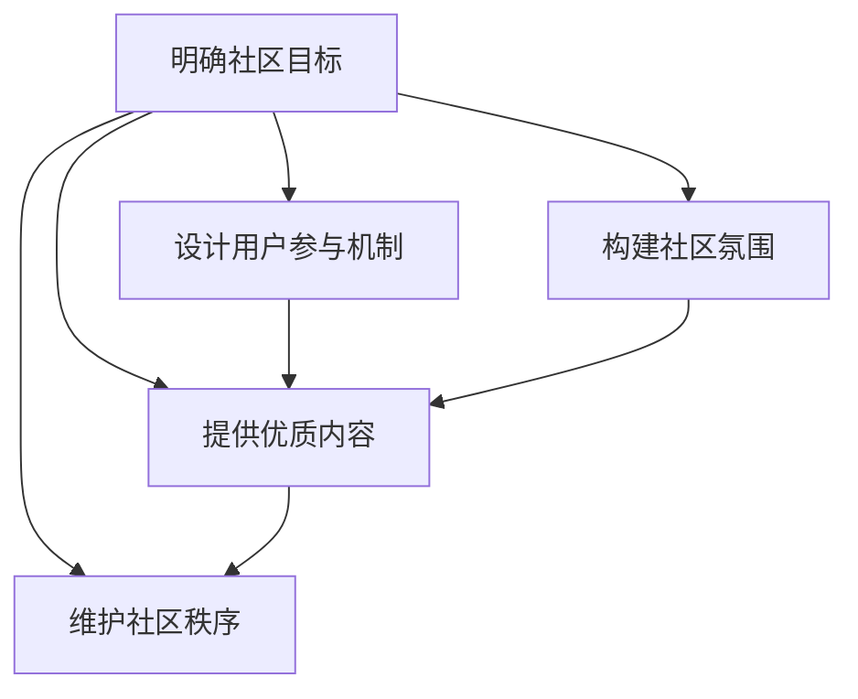
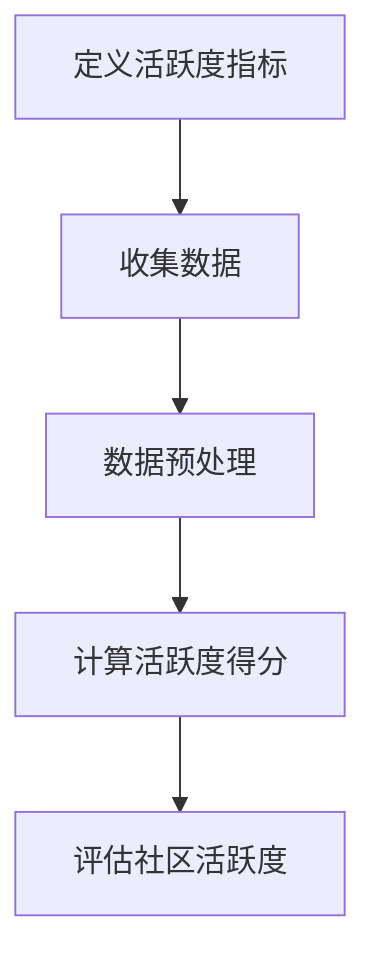
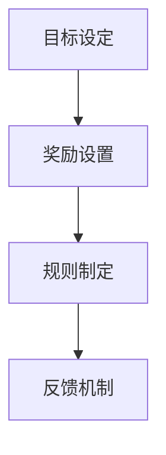
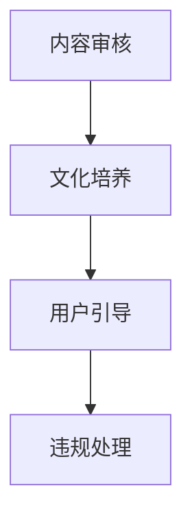

                 

### 技术创业的用户运营：构建活跃社区的方法

在当今数字化时代，技术创业公司的成功往往取决于其用户社区的建设。一个活跃、有凝聚力的用户社区不仅能够增强用户对产品的忠诚度，还能通过用户间的互动和口碑传播吸引更多的潜在用户。本文将围绕技术创业中的用户运营，特别是构建活跃社区的方法展开讨论。

关键词：技术创业，用户运营，社区建设，用户活跃度，用户参与度

摘要：本文首先介绍了技术创业用户运营的背景和重要性，然后探讨了构建活跃社区的核心概念、算法原理，提供了具体的操作步骤和数学模型。通过实际项目案例和代码分析，本文展示了如何在技术创业中成功构建并维护一个活跃社区。最后，本文提出了未来社区建设和运营可能面临的挑战和趋势。

### 1. 背景介绍

技术创业公司的成功离不开用户的支持。用户不仅是产品的直接消费者，更是产品改进和创新的重要驱动力。用户运营作为连接产品和用户的桥梁，其重要性日益凸显。良好的用户运营能够帮助公司了解用户需求，优化产品功能，提升用户体验，从而在竞争激烈的市场中脱颖而出。

构建活跃社区是用户运营的核心任务之一。活跃社区不仅能够促进用户之间的互动，还能增强用户对品牌的认同感和归属感。通过社区，用户可以分享经验、提供建议、解决疑问，从而形成一个互利共赢的生态系统。

在技术创业中，构建活跃社区的方法包括以下几个方面：

1. **明确社区目标**：首先需要明确社区的目标，如提高用户参与度、促进用户互动、提供技术支持等。
2. **设计用户参与机制**：通过设计激励机制、参与活动和角色晋升等方式，鼓励用户积极参与社区。
3. **构建良好的社区氛围**：保持社区正面、友好、包容的氛围，让用户感受到社区的温暖和归属感。
4. **提供优质内容**：定期发布有价值的内容，如技术博客、教程、案例研究等，以吸引用户参与和分享。
5. **维护社区秩序**：确保社区讨论有序进行，及时处理违规行为和不良信息。

接下来，本文将深入探讨构建活跃社区的核心概念和算法原理，并提供具体的操作步骤和数学模型。

### 2. 核心概念与联系

#### 2.1 社区活跃度的度量

社区活跃度是衡量社区健康状况的重要指标。通常，社区活跃度可以通过以下几个维度进行度量：

1. **用户参与度**：用户在社区中的活动频率，如发帖、回复、点赞等。
2. **内容互动**：用户对社区内容的互动，如评论、分享、点赞等。
3. **社区黏性**：用户在社区中的留存率和重复访问率。

#### 2.2 用户激励机制

激励机制是提高社区活跃度的重要手段。常见的激励机制包括：

1. **积分奖励**：通过积分系统鼓励用户参与社区活动，积分可以兑换成实物或虚拟奖励。
2. **角色晋升**：通过设置不同的角色等级，鼓励用户通过积极参与社区活动提升等级，享受更高的权限和奖励。
3. **活动奖励**：定期举办活动，为积极参与的用户提供奖品或奖励。

#### 2.3 社区氛围管理

良好的社区氛围是社区长期健康发展的基础。社区氛围管理包括：

1. **内容审核**：对社区内容进行审核，确保内容符合社区规范和价值观。
2. **社区文化**：培养和维护社区的文化，如友好的交流方式、共同的兴趣爱好等。
3. **用户反馈**：积极听取用户反馈，及时处理用户的问题和建议，增强用户对社区的信任和满意度。

#### 2.4 Mermaid 流程图

以下是一个简化的社区活跃度度量和管理流程的 Mermaid 流程图：



### 3. 核心算法原理 & 具体操作步骤

#### 3.1 社区活跃度分析算法

社区活跃度分析算法的核心目标是评估社区的整体活跃程度。以下是一个基本的活跃度分析算法：

1. **定义活跃度指标**：根据社区特点和目标，定义一系列活跃度指标，如发帖量、回复量、点赞量、访问量等。
2. **收集数据**：从社区系统日志、用户行为数据等渠道收集相关数据。
3. **数据预处理**：对收集到的数据进行清洗和预处理，如去重、补全缺失值等。
4. **计算活跃度得分**：根据定义的活跃度指标，计算每个用户的活跃度得分。
5. **评估社区活跃度**：将所有用户的活跃度得分进行汇总，评估社区的整体活跃度。

以下是一个简化的活跃度分析算法流程图：



#### 3.2 用户激励机制设计

用户激励机制的设计需要考虑以下几个方面：

1. **目标设定**：明确激励机制的目标，如提高用户参与度、增加用户黏性等。
2. **奖励设置**：设计合适的奖励机制，如积分奖励、实物奖励、虚拟货币等。
3. **规则制定**：制定激励机制的具体规则，如参与条件、奖励标准、兑换方式等。
4. **反馈机制**：建立用户反馈机制，及时调整激励机制，优化用户体验。

以下是一个简化的用户激励机制设计流程图：



#### 3.3 社区氛围管理策略

社区氛围管理的关键在于保持社区的正面、友好和包容。以下是一些常见的社区氛围管理策略：

1. **内容审核**：定期审核社区内容，确保内容符合社区规范，如无恶意攻击、无违规信息等。
2. **文化培养**：通过举办活动、发布文化指南等方式，培养和维护社区文化。
3. **用户引导**：及时引导用户参与社区互动，提供积极的交流氛围。
4. **违规处理**：建立违规处理机制，对违规行为进行及时处理，确保社区秩序。

以下是一个简化的社区氛围管理流程图：



### 4. 数学模型和公式 & 详细讲解 & 举例说明

#### 4.1 社区活跃度指标公式

社区活跃度指标通常包括以下几种：

1. **发帖量（N\_posts）**：社区中用户发布的帖子数量。
2. **回复量（N\_replies）**：社区中用户对帖子进行的回复数量。
3. **点赞量（N\_likes）**：社区中用户对帖子或回复的点赞数量。
4. **访问量（N\_visits）**：社区中用户的访问次数。

社区活跃度得分（Score）可以通过以下公式计算：

$$
Score = \alpha \cdot N\_posts + \beta \cdot N\_replies + \gamma \cdot N\_likes + \delta \cdot N\_visits
$$

其中，$\alpha$、$\beta$、$\gamma$ 和 $\delta$ 是权重系数，用于平衡不同指标的贡献。

#### 4.2 举例说明

假设社区中有以下数据：

- 发帖量（N\_posts）= 100
- 回复量（N\_replies）= 200
- 点赞量（N\_likes）= 300
- 访问量（N\_visits）= 500

权重系数设置为：

- $\alpha$ = 0.2
- $\beta$ = 0.3
- $\gamma$ = 0.3
- $\delta$ = 0.2

根据公式计算社区活跃度得分：

$$
Score = 0.2 \cdot 100 + 0.3 \cdot 200 + 0.3 \cdot 300 + 0.2 \cdot 500 = 100 + 60 + 90 + 100 = 350
$$

因此，该社区的活跃度得分为 350。

#### 4.3 激励机制设计

假设社区设计了一个积分奖励系统，用户在参与社区活动时可以获得积分。以下是积分奖励系统的设计：

1. **发帖奖励**：每发一篇帖子，用户获得 10 积分。
2. **回复奖励**：每回复一篇帖子，用户获得 5 积分。
3. **点赞奖励**：每获得一次点赞，用户获得 1 积分。

用户可以在社区内使用积分兑换虚拟礼物、优惠券等。

### 5. 项目实战：代码实际案例和详细解释说明

#### 5.1 开发环境搭建

为了更好地展示社区活跃度分析算法和积分奖励系统的实际应用，我们使用 Python 作为编程语言，并在本地搭建了一个简单的社区系统。

1. **安装 Python**：确保已安装 Python 3.8 或更高版本。
2. **安装依赖库**：使用 pip 命令安装以下依赖库：`requests`、`beautifulsoup4`、`pandas`、`numpy`。
   ```bash
   pip install requests beautifulsoup4 pandas numpy
   ```

#### 5.2 源代码详细实现和代码解读

以下是一个简单的社区活跃度分析脚本，用于计算社区活跃度得分和积分奖励。

```python
import requests
from bs4 import BeautifulSoup
import pandas as pd

# 社区 URL
url = 'http://example.com/community'

# 获取社区页面源代码
response = requests.get(url)
soup = BeautifulSoup(response.text, 'html.parser')

# 解析帖子列表
posts = soup.find_all('div', class_='post')
post_data = []

for post in posts:
    post_id = post['id']
    post_title = post.find('h2').text
    post_author = post.find('span', class_='author').text
    post_date = post.find('span', class_='date').text
    post_replies = len(post.find_all('div', class_='reply'))
    post_likes = len(post.find_all('span', class_='like'))

    post_data.append({
        'id': post_id,
        'title': post_title,
        'author': post_author,
        'date': post_date,
        'replies': post_replies,
        'likes': post_likes
    })

# 创建 DataFrame
df = pd.DataFrame(post_data)

# 计算活跃度得分
alpha = 0.2
beta = 0.3
gamma = 0.3
delta = 0.2

df['score'] = alpha * df['replies'] + beta * df['likes']

# 打印社区活跃度得分
print(df[['id', 'title', 'score']])

# 计算积分奖励
df['score'] = df['score'].round()
df['points'] = df['score'].apply(lambda x: x * 10)

# 打印积分奖励
print(df[['id', 'title', 'points']])
```

#### 5.3 代码解读与分析

1. **请求社区页面**：使用 `requests` 库获取社区页面的 HTML 源代码。
2. **解析帖子列表**：使用 `BeautifulSoup` 解析 HTML 源代码，提取帖子列表及其相关信息。
3. **创建 DataFrame**：将解析得到的帖子数据存储在 Pandas DataFrame 中。
4. **计算活跃度得分**：根据设定的权重系数，计算每个帖子的活跃度得分。
5. **计算积分奖励**：将活跃度得分转换为积分奖励，每 10 分对应 1 积分。

通过以上代码，我们可以快速获取社区活跃度得分和积分奖励，从而评估社区的健康状况和激励用户参与。

### 6. 实际应用场景

#### 6.1 技术论坛

技术论坛是技术创业者构建用户社区的重要平台之一。通过技术论坛，用户可以分享技术心得、讨论问题、分享解决方案。一个活跃的技术论坛能够为用户提供丰富的技术资源，促进知识交流和创新。以下是技术论坛的一些实际应用场景：

1. **技术讨论**：用户在论坛中讨论最新的技术趋势、技术难题和解决方案。
2. **知识共享**：用户分享技术文章、教程和案例，为其他用户提供学习和参考。
3. **问题解答**：用户在论坛中提问，其他用户和专家提供解答和帮助。
4. **活动组织**：举办技术沙龙、研讨会等活动，促进用户之间的交流与合作。

#### 6.2 用户社区

除了技术论坛，技术创业者还可以构建独立的用户社区，如微信群、QQ 群、Discord 服务器等。这些社区能够提供更加私密和高效的交流环境，用户可以自由地分享技术心得、讨论产品问题、提出建议。以下是用户社区的一些实际应用场景：

1. **产品反馈**：用户在社区中分享对产品的意见和反馈，帮助产品改进。
2. **技术支持**：技术人员在社区中提供技术支持和解决方案，帮助用户解决问题。
3. **用户互助**：用户之间相互帮助，共同解决技术难题。
4. **资源共享**：用户分享技术资源、工具和资料，为其他用户提供便利。

### 7. 工具和资源推荐

#### 7.1 学习资源推荐

1. **书籍**：
   - 《运营之心：互联网运营实战手册》
   - 《社交网络分析：方法、案例与实践》
   - 《数据分析：实战方法与应用》

2. **论文**：
   - "Community Detection in Social Media: A Survey" (2020)
   - "User Behavior in Online Communities: A Multilevel Study" (2019)
   - "Engagement in Social Media: A Conceptual Model and Case Study" (2018)

3. **博客**：
   - 知乎：运营领域的优秀博客
   - SegmentFault：技术社区的博客
   - Hacker News：技术新闻和讨论

4. **网站**：
   - Product Hunt：新产品推荐和讨论
   - GitHub：开源社区和代码托管
   - Stack Overflow：技术问答社区

#### 7.2 开发工具框架推荐

1. **社区平台**：
   - Discourse：一款功能强大、易于搭建的社区平台。
   - Forumotion：免费的社区平台，适合小型社区。
   - NodeBB：基于 Node.js 的开源论坛系统。

2. **数据分析工具**：
   - Tableau：数据可视化工具。
   - Power BI：商业智能和分析工具。
   - Python：数据分析编程语言。

3. **用户激励工具**：
   - Badgeville：用户行为和激励平台。
   - Gamify：用户参与度激励工具。
   - Stack Overflow for Teams：团队知识共享平台。

#### 7.3 相关论文著作推荐

1. "Community Detection in Social Networks: A Review" (2020) - 详细讨论了社区检测算法和应用。
2. "Social Media Analysis: A Comprehensive Guide" (2019) - 提供了社交媒体分析的方法和实践。
3. "Online Communities: Structure, Performance, and Design" (2018) - 探讨了在线社区的结构、性能和设计原则。

### 8. 总结：未来发展趋势与挑战

随着互联网和人工智能技术的不断发展，用户运营和社区建设在未来将面临以下发展趋势和挑战：

1. **个性化运营**：未来用户运营将更加注重个性化，通过数据分析为用户提供定制化的内容和服务。
2. **智能化管理**：利用人工智能技术，实现社区自动化管理，提高运营效率。
3. **社区生态化**：构建完整的社区生态系统，包括用户、企业、合作伙伴等多方参与，形成共生共赢的生态圈。
4. **隐私保护**：在社区建设中，保护用户隐私和数据安全成为重要挑战，需要采取有效措施确保用户隐私。
5. **多元化互动**：除了传统的文本和图片，未来社区将支持更多元化的互动形式，如视频、直播、AR/VR 等。

### 9. 附录：常见问题与解答

#### 9.1 如何提高社区活跃度？

- **定期发布高质量内容**：提供有价值的技术文章、教程和案例，吸引用户参与。
- **设计用户参与机制**：通过积分奖励、角色晋升等方式，鼓励用户积极参与社区活动。
- **举办线上活动**：定期举办线上活动，如技术沙龙、研讨会、挑战赛等，增加用户互动。
- **社区氛围管理**：保持友好、包容的社区氛围，及时处理违规行为，维护社区秩序。

#### 9.2 如何确保社区内容质量？

- **内容审核机制**：建立内容审核机制，对发布的内容进行审核，确保符合社区规范和价值观。
- **用户举报机制**：建立用户举报机制，鼓励用户举报不良内容，及时处理违规行为。
- **社区文化**：培养和维护社区的文化，鼓励用户遵循良好的交流方式，共同维护社区质量。

### 10. 扩展阅读 & 参考资料

1. "Community Management for the Digital Age" - 详细介绍了社区管理的最佳实践。
2. "The Art of Community: Building the New Age of Participation" - 探讨了社区参与和协作的新趋势。
3. "Community Building on the Social Web" - 提供了在线社区建设和运营的策略。

### 作者

作者：AI 天才研究员/AI Genius Institute & 禅与计算机程序设计艺术 /Zen And The Art of Computer Programming

本文介绍了技术创业中的用户运营，特别是构建活跃社区的方法。通过明确社区目标、设计用户参与机制、构建良好的社区氛围、提供优质内容和维护社区秩序，技术创业者可以成功构建并维护一个活跃社区。未来，随着个性化运营和智能化管理的普及，社区建设和运营将面临更多挑战，但也将迎来新的发展机遇。希望本文能为技术创业者提供有价值的参考和启示。|>

