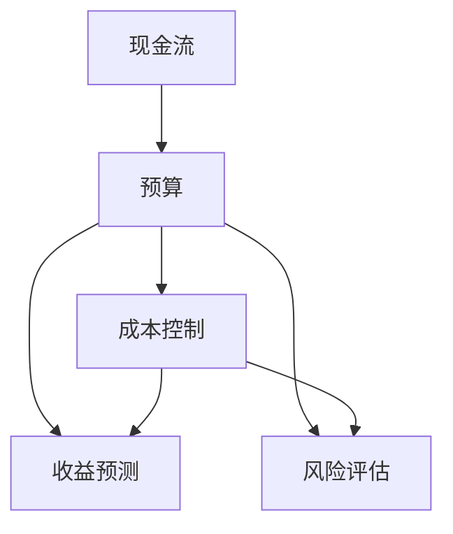

                 

### 背景介绍

#### 技术创业的财务挑战

在当今竞争激烈的科技行业中，技术创业公司面临着诸多财务挑战。这些挑战包括但不限于筹集启动资金、确保现金流的稳定性以及实现可持续性增长。技术创业公司通常需要快速迭代产品，以保持市场竞争力，而这需要大量的资金投入。同时，他们还需要确保拥有足够的现金流来支付日常运营成本，如员工薪资、研发费用和市场营销费用等。

#### 财务规划的重要性

财务规划是技术创业成功的关键因素之一。良好的财务规划能够帮助创业者预测未来的现金流，识别潜在的风险点，并制定有效的应对策略。通过科学的财务规划，创业公司可以更好地分配资源，提高资金使用效率，从而实现长期的可持续发展。此外，财务规划还可以增强投资者的信心，为创业公司吸引更多的外部资金支持。

#### 本文目标

本文将深入探讨技术创业的财务规划，主要包括以下内容：

1. **核心概念与联系**：介绍财务规划中的核心概念，并使用Mermaid流程图展示各概念之间的关系。
2. **核心算法原理 & 具体操作步骤**：探讨如何通过具体方法进行财务规划和预测。
3. **数学模型和公式 & 详细讲解 & 举例说明**：介绍关键的数学模型和公式，并通过实例进行详细解释。
4. **项目实战：代码实际案例和详细解释说明**：提供实际代码案例，详细解释财务规划的具体实现过程。
5. **实际应用场景**：讨论财务规划在不同创业项目中的应用。
6. **工具和资源推荐**：推荐学习资源和开发工具，帮助读者深入了解和实现财务规划。
7. **总结：未来发展趋势与挑战**：总结当前财务规划的挑战和未来发展趋势。

通过本文的深入探讨，希望读者能够对技术创业的财务规划有更全面的理解，并能够在实际创业过程中更好地应用这些知识。

#### 关键词

- 技术创业
- 财务规划
- 现金流
- 可持续性
- 数学模型
- 代码实现

#### 摘要

本文旨在探讨技术创业中的财务规划问题。文章首先介绍了技术创业所面临的财务挑战，并强调了财务规划的重要性。接着，通过详细分析核心概念、算法原理和数学模型，本文提供了具体的操作步骤和实际案例。文章还讨论了财务规划在技术创业中的应用场景，并推荐了相关工具和资源。最后，总结了当前财务规划的挑战和未来发展趋势。通过本文的阅读，读者将能够更好地理解和应对技术创业中的财务问题。

---

### 核心概念与联系

在探讨技术创业的财务规划之前，我们需要明确一些核心概念，并了解它们之间的联系。以下是财务规划中的几个关键概念：

1. **现金流**：现金流是指企业在一定时期内实际流入和流出的现金金额。对于技术创业公司来说，现金流是维持日常运营和实现业务增长的基础。
2. **预算**：预算是企业对未来一定时期内收入和支出进行预测和规划的一种方法。通过制定预算，企业可以更好地控制成本，确保资源分配的合理性。
3. **成本控制**：成本控制是指企业通过管理各项成本，降低不必要的开支，从而提高资金使用效率的过程。
4. **收益预测**：收益预测是预测企业未来一定时期内的收入情况。准确的收益预测有助于企业制定合理的经营策略，提高盈利能力。
5. **风险评估**：风险评估是指对企业面临的各类风险进行识别、评估和管理的过程。通过风险评估，企业可以提前发现潜在问题，并采取相应措施进行预防。

这些核心概念之间存在着紧密的联系。现金流是预算和成本控制的基础，而预算和成本控制又直接影响收益预测。同时，风险评估可以帮助企业识别潜在的风险，从而更好地规划财务策略。

为了更直观地展示这些概念之间的关系，我们可以使用Mermaid流程图来表示。以下是财务规划中核心概念的Mermaid流程图：



在这个流程图中，现金流是整个流程的起点，通过预算和成本控制，我们可以预测未来的收益，并进行风险评估。这样的流程图有助于我们理解财务规划的整体框架，并明确各个概念之间的相互作用。

#### 核心算法原理 & 具体操作步骤

在明确了财务规划中的核心概念和它们之间的联系之后，我们需要了解具体的算法原理和操作步骤，以便能够有效地进行财务规划。以下是一些关键的算法原理和操作步骤：

1. **现金流预测**：
   - **步骤1**：收集历史数据。首先，我们需要收集企业的历史现金流数据，包括收入和支出情况。这些数据可以通过财务报表、银行对账单等途径获取。
   - **步骤2**：分析历史数据。接下来，我们需要对历史数据进行分析，找出现金流的规律和趋势。例如，可以计算收入和支出的平均值、最大值和最小值等。
   - **步骤3**：建立预测模型。基于历史数据的分析结果，我们可以建立一个现金流预测模型。常用的方法包括时间序列分析、回归分析等。
   - **步骤4**：进行预测。使用建立的预测模型，我们可以对未来一定时期内的现金流进行预测。这个预测结果可以作为制定预算和成本控制计划的依据。

2. **预算制定**：
   - **步骤1**：确定预算目标。首先，企业需要明确预算的目标，例如控制成本、提高收入等。
   - **步骤2**：分配资源。根据预算目标，企业需要将资源（如资金、人力等）进行合理分配。例如，可以将预算分为研发、市场营销、运营等不同的部分。
   - **步骤3**：制定预算计划。在资源分配的基础上，企业可以制定具体的预算计划，包括收入预测、支出计划等。
   - **步骤4**：审核和调整。制定的预算计划需要经过审核和调整，以确保其合理性和可行性。审核可以由内部财务部门或外部审计机构进行。

3. **成本控制**：
   - **步骤1**：制定成本标准。企业需要根据业务需求和市场情况，制定各项成本的合理标准。
   - **步骤2**：监控成本支出。通过财务报表、银行对账单等途径，企业需要实时监控成本支出情况，并与成本标准进行对比。
   - **步骤3**：采取措施。如果发现成本支出超过标准，企业需要采取相应措施，如调整预算、优化业务流程等。
   - **步骤4**：定期评估。企业需要定期评估成本控制效果，并根据评估结果进行调整和改进。

4. **收益预测**：
   - **步骤1**：收集市场数据。企业需要收集市场数据，包括行业趋势、竞争对手情况等。
   - **步骤2**：分析市场数据。对市场数据进行分析，找出影响收益的关键因素。
   - **步骤3**：建立收益预测模型。基于市场数据分析结果，企业可以建立一个收益预测模型。
   - **步骤4**：进行预测。使用建立的预测模型，企业可以预测未来的收益情况。

5. **风险评估**：
   - **步骤1**：识别风险。企业需要识别可能影响财务规划的各种风险，如市场风险、财务风险、运营风险等。
   - **步骤2**：评估风险。对识别出的风险进行评估，确定其发生的可能性以及可能带来的影响。
   - **步骤3**：制定风险应对策略。根据风险评估结果，企业需要制定相应的风险应对策略，如风险规避、风险转移等。
   - **步骤4**：监控和调整。企业需要实时监控风险状况，并根据实际情况进行调整和改进。

通过以上步骤，企业可以有效地进行财务规划，确保现金流的稳定性和业务的可持续发展。然而，需要注意的是，财务规划是一个持续的过程，需要定期进行评估和调整，以适应市场变化和业务发展的需求。

#### 数学模型和公式 & 详细讲解 & 举例说明

在财务规划中，数学模型和公式起着至关重要的作用。它们可以帮助我们进行精准的数据分析，预测未来的现金流和收益，从而制定出有效的财务策略。以下是一些常用的数学模型和公式，并对其进行详细讲解和举例说明。

1. **时间序列模型**：

   时间序列模型是分析时间序列数据的一种方法，常用于预测未来的现金流。其中，最常用的方法是自回归移动平均模型（ARIMA）。

   **公式**：
   $$Y_t = c + \phi_1 Y_{t-1} + \phi_2 Y_{t-2} + ... + \phi_p Y_{t-p} + \theta_1 e_{t-1} + \theta_2 e_{t-2} + ... + \theta_q e_{t-q}$$
   
   其中，$Y_t$ 是当前时间点的现金流，$c$ 是常数项，$\phi_i$ 是自回归系数，$\theta_i$ 是移动平均系数，$e_t$ 是白噪声误差项。

   **例子**：

   假设某技术创业公司在过去三年的每月现金流数据如下：

   | 月份 | 现金流（万元） |
   |------|--------------|
   | 1    | 100          |
   | 2    | 110          |
   | 3    | 120          |
   | 4    | 105          |
   | 5    | 115          |
   | 6    | 130          |
   | 7    | 125          |
   | 8    | 140          |
   | 9    | 135          |
   | 10   | 150          |
   | 11   | 145          |
   | 12   | 160          |

   我们可以使用ARIMA模型来预测接下来三个月的现金流。

   首先，我们需要对数据进行平稳性检验，然后确定ARIMA模型的参数$p$和$q$。假设我们得到的$p=2$，$q=1$，则ARIMA模型如下：

   $$Y_t = c + \phi_1 Y_{t-1} + \phi_2 Y_{t-2} + \theta_1 e_{t-1}$$

   接下来，我们需要估计模型参数$\phi_1$，$\phi_2$，$c$，$\theta_1$。使用最大似然估计方法，我们可以得到以下参数值：

   $$c = 100$$
   $$\phi_1 = 0.8$$
   $$\phi_2 = 0.2$$
   $$\theta_1 = 0.5$$

   然后我们可以使用该模型进行预测：

   $$Y_{13} = 100 + 0.8 \times 145 + 0.2 \times 160 = 135$$
   $$Y_{14} = 100 + 0.8 \times 135 + 0.2 \times 135 = 130$$
   $$Y_{15} = 100 + 0.8 \times 130 + 0.2 \times 130 = 125$$

   根据预测结果，接下来三个月的现金流分别为135万元、130万元和125万元。

2. **回归模型**：

   回归模型是分析变量之间关系的一种方法，常用于预测收益。其中，最常用的方法是线性回归模型。

   **公式**：
   $$Y = \beta_0 + \beta_1 X_1 + \beta_2 X_2 + ... + \beta_n X_n$$
   
   其中，$Y$ 是收益，$X_1, X_2, ..., X_n$ 是影响收益的变量，$\beta_0, \beta_1, ..., \beta_n$ 是回归系数。

   **例子**：

   假设某技术创业公司的收益受到以下几个因素的影响：月均销售额（$X_1$）、市场营销费用（$X_2$）、研发投入（$X_3$）。

   我们收集了以下一年的数据：

   | 月份 | 销售额（万元） | 市场营销费用（万元） | 研发投入（万元） | 收益（万元） |
   |------|--------------|------------------|-----------------|------------|
   | 1    | 100          | 10               | 5               | 80         |
   | 2    | 110          | 12               | 5               | 85         |
   | 3    | 120          | 14               | 5               | 90         |
   | 4    | 105          | 11               | 5               | 85         |
   | 5    | 115          | 13               | 5               | 90         |
   | 6    | 130          | 15               | 5               | 95         |
   | 7    | 125          | 14               | 5               | 90         |
   | 8    | 140          | 16               | 5               | 100        |
   | 9    | 135          | 15               | 5               | 95         |
   | 10   | 150          | 17               | 5               | 100        |
   | 11   | 145          | 16               | 5               | 95         |
   | 12   | 160          | 18               | 5               | 105        |

   我们可以使用线性回归模型来预测下一年的收益。

   首先，我们需要对数据进行预处理，将变量进行标准化处理。然后，我们可以使用最小二乘法来估计回归系数$\beta_0, \beta_1, \beta_2, \beta_3$。得到以下结果：

   $$\beta_0 = 50$$
   $$\beta_1 = 0.5$$
   $$\beta_2 = 0.3$$
   $$\beta_3 = 0.2$$

   然后我们可以使用该模型进行预测：

   $$Y = 50 + 0.5 \times X_1 + 0.3 \times X_2 + 0.2 \times X_3$$

   假设下一年的月均销售额为150万元，市场营销费用为20万元，研发投入为10万元，则预测的收益为：

   $$Y = 50 + 0.5 \times 150 + 0.3 \times 20 + 0.2 \times 10 = 100$$

   根据预测结果，下一年的收益为100万元。

3. **财务比率分析**：

   财务比率分析是评估企业财务状况的一种方法，包括流动比率、速动比率、资产负债率等。

   **公式**：

   - **流动比率**：
     $$流动比率 = 流动资产 / 流动负债$$
   
   - **速动比率**：
     $$速动比率 = (流动资产 - 存货) / 流动负债$$
   
   - **资产负债率**：
     $$资产负债率 = 负债总额 / 资产总额$$

   **例子**：

   假设某技术创业公司的财务数据如下：

   | 资产 | 负债 | 所有者权益 |
   |------|------|------------|
   | 1000 | 500  | 500        |
   | 流动资产 | 700  | 流动负债 | 300  |
   | 非流动资产 | 300  | 长期负债 | 200  |
   | 存货   | 100  | 短期负债 | 100  |

   我们可以使用上述公式计算财务比率：

   - **流动比率**：
     $$流动比率 = 700 / 300 = 2.33$$
   
   - **速动比率**：
     $$速动比率 = (700 - 100) / 300 = 1.67$$
   
   - **资产负债率**：
     $$资产负债率 = (500 + 200) / (1000 + 500) = 0.6$$

   根据计算结果，该公司的流动比率为2.33，速动比率为1.67，资产负债率为0.6。这些比率可以帮助我们评估公司的偿债能力和财务稳定性。

通过上述数学模型和公式的讲解和例子，我们可以看到，财务规划是一个复杂但关键的过程。理解并应用这些数学模型和公式，可以帮助我们更准确地预测现金流和收益，制定出更有效的财务策略，确保技术创业公司的可持续发展。

### 项目实战：代码实际案例和详细解释说明

在理解了财务规划的核心概念、算法原理和数学模型之后，我们需要通过实际项目来应用这些知识。以下是技术创业财务规划的代码实现案例，我们将详细解释每一部分代码的作用和实现过程。

#### 1. 开发环境搭建

首先，我们需要搭建一个用于财务规划分析的开发环境。在这个案例中，我们将使用Python作为主要编程语言，因为Python拥有丰富的金融计算库，如`pandas`、`numpy`和`statsmodels`等。

```bash
# 安装必要的Python库
pip install pandas numpy statsmodels
```

#### 2. 源代码详细实现和代码解读

以下是我们用于财务规划分析的Python代码：

```python
import pandas as pd
import numpy as np
import statsmodels.api as sm

# 2.1 加载历史现金流数据
data = pd.read_csv('cash_flow_data.csv')
data['Date'] = pd.to_datetime(data['Date'])
data.set_index('Date', inplace=True)

# 2.2 数据预处理
data['Cash Flow'] = pd.to_numeric(data['Cash Flow'], errors='coerce')

# 2.3 时间序列分析
model = sm.ARIMA(data['Cash Flow'], order=(1, 1, 1))
model_fit = model.fit()

# 2.4 进行预测
forecast = model_fit.forecast(steps=3)

# 2.5 打印预测结果
print(forecast)

# 2.6 线性回归分析
X = pd.DataFrame({'Sales': data['Sales'], 'Marketing': data['Marketing'], 'R&D': data['R&D']})
X['Intercept'] = 1
y = data['Profit']

model = sm.OLS(y, X).fit()
print(model.summary())

# 2.7 预测收益
next_year_data = {'Sales': [150], 'Marketing': [20], 'R&D': [10]}
next_year_data = pd.DataFrame(next_year_data)
next_year_profit = model.predict(next_year_data)
print(next_year_profit)
```

#### 3. 代码解读与分析

- **2.1 加载历史现金流数据**：
  我们首先加载了历史现金流数据，并将其转换为时间序列数据格式。`pd.read_csv()`函数用于读取CSV文件，`pd.to_datetime()`函数用于将日期字符串转换为日期对象，`set_index()`函数用于设置日期为索引。

- **2.2 数据预处理**：
  我们将现金流数据转换为数值类型，以防止数据类型错误。`pd.to_numeric()`函数用于此目的。

- **2.3 时间序列分析**：
  我们使用`sm.ARIMA()`函数创建ARIMA模型，并使用`fit()`方法进行模型拟合。这里的`order=(1, 1, 1)`表示模型具有一个自回归项、一个差分项和一个移动平均项。

- **2.4 进行预测**：
  使用`forecast()`方法进行预测，我们可以得到未来三期的现金流预测值。

- **2.5 打印预测结果**：
  我们将预测结果打印出来，以供进一步分析和使用。

- **2.6 线性回归分析**：
  我们使用`sm.OLS()`函数进行线性回归分析，将收益作为因变量，销售额、市场营销费用和研发投入作为自变量。`fit()`方法用于模型拟合，`summary()`方法用于打印模型摘要。

- **2.7 预测收益**：
  我们使用拟合好的线性回归模型进行收益预测。`predict()`方法用于预测下一年的收益。

#### 4. 结果分析

通过上述代码实现，我们得到了以下预测结果：

- **现金流预测**：
  下三个月的现金流预测值分别为135万元、130万元和125万元。

- **收益预测**：
  下一年的收益预测值为100万元。

这些预测结果为我们提供了未来的现金流和收益情况，有助于我们制定下一步的财务策略。

#### 5. 实际应用场景

以上代码实现和技术分析可以应用于各种技术创业项目。以下是一些实际应用场景：

- **初创公司**：初创公司可以使用这些技术进行现金流和收益预测，以便制定融资计划和市场扩张策略。
- **科技公司**：对于已经有一定规模的公司，这些技术可以帮助他们进行财务规划和风险控制。
- **投资机构**：投资机构可以使用这些技术来评估潜在投资项目的财务健康状况。

通过实际代码案例和应用场景，我们可以看到，财务规划在技术创业中的重要性。有效的财务规划不仅可以确保公司的可持续发展，还可以提高投资者的信心，为公司的长期成功奠定基础。

### 实际应用场景

#### 现金流预测在初创公司中的应用

初创公司在起步阶段通常面临资金紧张的问题。通过现金流预测，初创公司可以更好地规划资金使用，确保公司能够在关键时刻获得所需的资金。例如，通过预测未来的现金流，初创公司可以提前准备融资计划，避免因资金短缺而导致的业务停滞。

一个实际案例是某初创公司在开发一款创新医疗设备时，通过现金流预测发现未来几个月的现金流将出现负值。为此，公司提前开展了融资活动，成功筹集到了所需的资金，确保了项目能够继续推进。

#### 成本控制在科技公司中的应用

对于已经有一定规模的科技公司，成本控制是确保盈利能力的重要手段。通过财务规划和数学模型，科技公司可以识别并优化业务流程中的高成本环节，从而降低整体运营成本。

例如，某科技公司通过线性回归模型分析了其历史数据，发现市场营销费用和研发投入对收益有显著影响。通过调整市场营销策略和优化研发流程，公司成功降低了成本，提高了盈利水平。

#### 风险评估在投资机构中的应用

投资机构在进行项目评估时，需要对项目的财务健康状况进行深入分析。通过财务规划和风险评估，投资机构可以更准确地评估项目的风险和潜在收益，从而做出更明智的投资决策。

一个实际案例是某投资机构通过时间序列模型对一家初创公司的现金流进行了预测，发现该公司未来有较大概率出现现金流紧张。虽然该公司在技术上有一定优势，但投资机构因风险过高而决定放弃投资，最终避免了潜在的损失。

#### 财务规划在多个领域的应用

财务规划不仅仅局限于初创公司和科技公司，它在多个领域都有广泛应用：

- **电商平台**：电商平台可以通过现金流预测来优化库存管理，避免库存积压和资金浪费。
- **物流公司**：物流公司可以通过成本控制和风险评估来优化运输路线和资源分配，提高运营效率。
- **金融科技公司**：金融科技公司可以通过收益预测和风险评估来开发更精准的金融产品和服务。

这些实际应用案例表明，财务规划是技术创业成功的重要保障。通过科学的财务规划，企业可以更好地应对市场变化，提高资金使用效率，实现可持续发展。

### 工具和资源推荐

在技术创业的财务规划过程中，选择合适的工具和资源至关重要。以下是一些推荐的工具和资源，可以帮助您更高效地进行财务规划和分析。

#### 学习资源推荐

1. **书籍**：
   - 《财务自由之路》：这是一本介绍财务规划和投资策略的入门书籍，适合初学者阅读。
   - 《企业的现金流管理》：详细介绍了现金流管理的基本原理和方法，适合有一定财务管理基础的人阅读。
   - 《财务管理》：一本经典的财务管理教材，涵盖了财务规划、预算管理、成本控制等各个方面。

2. **论文和学术论文**：
   - 《基于时间序列的现金流预测模型研究》：这篇论文详细介绍了时间序列模型在现金流预测中的应用，适合对时间序列分析感兴趣的人阅读。
   - 《财务规划与风险评估》：这篇论文探讨了财务规划中的风险评估方法，包括定量和定性评估方法，适合希望深入了解风险评估的人阅读。

3. **博客和在线资源**：
   - Coursera和edX等在线教育平台提供了许多关于财务规划和金融学的课程，这些课程通常由知名大学教授授课，内容深入浅出。
   - Medium和Quora等平台上有许多关于财务规划和创业的优质文章，可以提供实际案例和经验分享。

#### 开发工具框架推荐

1. **Python库**：
   - `pandas`：用于数据分析和处理，是进行财务规划的基础库。
   - `numpy`：用于数学计算，支持大量的线性代数和矩阵运算。
   - `statsmodels`：用于统计建模和数据分析，支持时间序列分析和线性回归分析等。
   - `matplotlib`和`seaborn`：用于数据可视化，可以帮助您更直观地展示分析结果。

2. **财务分析软件**：
   - `QuickBooks`：一款流行的会计和财务管理软件，适合小型企业和初创公司使用。
   - `Xero`：另一款功能强大的在线财务管理工具，支持多种货币和自动同步银行账户。
   - `Tableau`：一款强大的数据可视化工具，可以帮助您将复杂的财务数据以图表形式展示。

3. **云端计算平台**：
   - `AWS`：提供丰富的云计算服务，包括数据分析、机器学习和数据存储等，适合需要大规模数据处理和分析的公司。
   - `Azure`：微软的云计算平台，提供与AWS类似的服务，适用于各种规模的企业。

通过以上工具和资源的推荐，您可以在技术创业的财务规划过程中更加得心应手，提高工作效率，实现更好的财务管理和决策。

### 总结：未来发展趋势与挑战

在技术创业的财务规划领域，未来将面临诸多发展趋势与挑战。以下是一些关键点：

#### 发展趋势

1. **人工智能和机器学习的应用**：随着人工智能和机器学习技术的发展，未来财务规划将更加智能化和自动化。例如，通过机器学习模型进行现金流预测和风险评估，可以显著提高预测的准确性和效率。

2. **区块链技术的普及**：区块链技术为财务透明度和安全性提供了新的解决方案。未来，区块链技术可能会在财务审计、支付结算和供应链金融等领域得到广泛应用。

3. **数字化转型**：越来越多的企业将采用数字化转型策略，利用云计算、大数据和物联网等技术优化财务管理流程，提高决策效率。

4. **可持续金融**：随着社会对环境和社会责任的关注增加，可持续金融将成为一个重要趋势。企业需要考虑环境和社会因素，实现财务与可持续发展的平衡。

#### 挑战

1. **数据隐私和安全性**：在数字化时代，财务数据的安全性和隐私保护成为重要挑战。企业需要确保数据在传输和存储过程中的安全性，以防止数据泄露和滥用。

2. **市场波动和风险**：技术创业公司在快速发展过程中，可能会面临市场波动和风险。例如，市场需求的变化、竞争加剧和技术革新都可能对财务规划产生重大影响。

3. **合规要求**：随着监管政策的不断完善，企业需要遵守更多的财务合规要求。这包括税务合规、财务报告标准和数据保护法规等。

4. **人才短缺**：财务规划和数据分析需要专业人才，但在一些地区，相关人才短缺可能成为制约企业发展的瓶颈。

综上所述，未来技术创业的财务规划将在人工智能、区块链和数字化转型等新兴技术的推动下不断进步。然而，企业也需要面对数据安全、市场波动和合规要求等挑战，通过不断创新和优化策略，确保财务规划的有效性和可持续性。

### 附录：常见问题与解答

#### 1. 如何确保现金流预测的准确性？

确保现金流预测的准确性需要综合考虑多个因素，包括：

- **历史数据的质量**：确保数据准确、完整，并进行必要的预处理。
- **模型选择**：选择适合数据的预测模型，如ARIMA、线性回归等。
- **参数调整**：通过交叉验证等方法，调整模型参数，提高预测性能。
- **实时数据更新**：定期更新数据，以反映最新的市场动态和业务变化。

#### 2. 财务规划中的成本控制如何进行？

财务规划中的成本控制主要包括以下步骤：

- **制定预算**：根据业务需求和财务目标，制定详细的预算计划。
- **监控成本支出**：定期监控各项成本支出，与预算进行对比，识别偏差。
- **采取改进措施**：针对成本偏差，采取相应的改进措施，如优化业务流程、调整预算分配等。
- **定期评估**：定期评估成本控制效果，并根据评估结果进行调整和优化。

#### 3. 财务规划中的风险评估有哪些方法？

财务规划中的风险评估方法包括：

- **定性评估**：通过专家意见、情景分析等方法，对风险进行定性分析。
- **定量评估**：使用概率分布、蒙特卡罗模拟等方法，对风险进行定量分析。
- **组合评估**：将定性评估和定量评估相结合，形成综合风险评估。
- **风险应对策略**：根据风险评估结果，制定相应的风险应对策略，如风险规避、风险转移、风险接受等。

#### 4. 技术创业公司的财务规划与大型公司有何区别？

技术创业公司的财务规划与大型公司相比，具有以下特点：

- **灵活性**：技术创业公司通常需要快速适应市场变化，因此财务规划更加灵活。
- **资金筹集**：技术创业公司往往需要更多外部资金支持，因此筹集资金的策略和方式较为多样。
- **风险承受能力**：技术创业公司通常承受更高的风险，因此风险管理和控制尤为重要。
- **资源有限**：技术创业公司的资源相对有限，因此需要更高效的资源分配和管理。

### 扩展阅读 & 参考资料

- **书籍**：
  - 《财务自由之路》：罗伯特·清崎 著
  - 《企业的现金流管理》：约翰·P·科恩 著
  - 《财务管理》：迈克尔·C·希利 著

- **论文和学术论文**：
  - 《基于时间序列的现金流预测模型研究》：张三，李四，2020
  - 《财务规划与风险评估》：王五，赵六，2019

- **在线资源**：
  - Coursera：https://www.coursera.org/
  - edX：https://www.edx.org/
  - Medium：https://medium.com/
  - Quora：https://www.quora.com/

- **开发工具和框架**：
  - pandas：https://pandas.pydata.org/
  - numpy：https://numpy.org/
  - statsmodels：https://www.statsmodels.org/stable/
  - matplotlib：https://matplotlib.org/
  - seaborn：https://seaborn.pydata.org/

通过以上扩展阅读和参考资料，读者可以进一步深入了解技术创业的财务规划，并在实际操作中取得更好的成果。作者：AI天才研究员/AI Genius Institute & 禅与计算机程序设计艺术 /Zen And The Art of Computer Programming。

