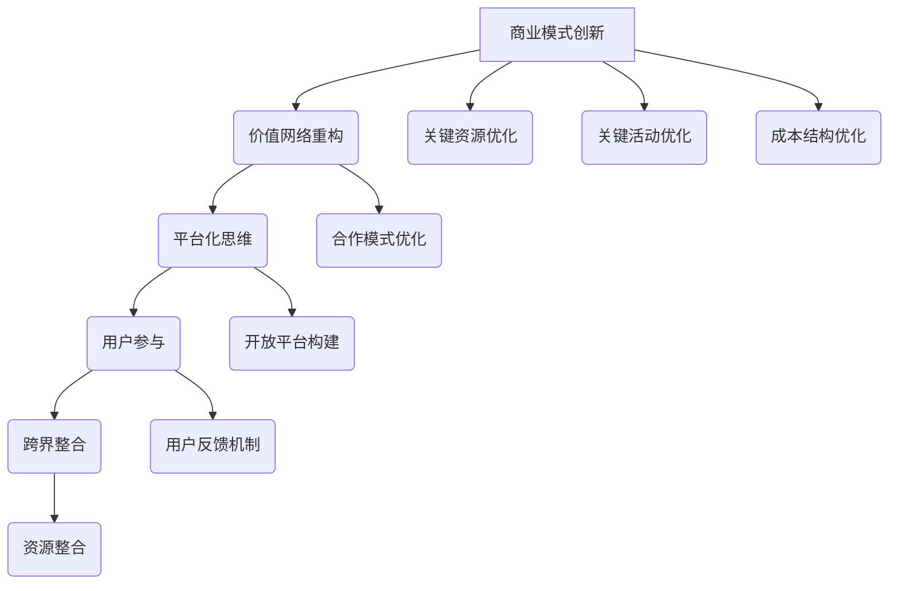

                 

### 背景介绍

#### 技术创业的挑战与机遇

随着互联网技术的快速发展，全球范围内的创业环境发生了巨大的变化。越来越多的创业者投身于技术领域，试图通过创新的技术和商业模式赢得市场的青睐。然而，技术创业并非易事，其中涉及到的挑战和机遇同样复杂多样。

一方面，技术创业面临着激烈的市场竞争。在众多创业者中，能够脱颖而出的寥寥无几。为了在市场中占据一席之地，创业者需要在商业模式上进行创新，以吸引更多的用户和资本。另一方面，技术创业也带来了巨大的机遇。随着人工智能、大数据、区块链等新兴技术的不断涌现，创业者可以充分利用这些技术，创造出全新的商业模式，颠覆传统行业，改变人们的生活方式。

#### 商业模式创新的必要性

在技术创业的过程中，商业模式创新至关重要。它不仅能够帮助创业者找到市场定位，吸引投资，还能够提升企业的竞争力。成功的商业模式创新往往能够为企业带来持续的利润增长，从而确保企业的长期发展。因此，对于技术创业者来说，如何进行有效的商业模式创新是一个亟待解决的问题。

#### 本文目的

本文旨在探讨技术创业者如何进行有效的商业模式创新。我们将从核心概念出发，结合实际案例，详细分析商业模式创新的步骤、策略和关键要素。通过本文的阅读，读者将能够了解商业模式创新的基本原理，掌握创新的思维和方法，为自身的创业之路提供有益的指导。

### 核心概念与联系

#### 商业模式

商业模式是指企业如何创造、传递和捕获价值的一种系统化方法。它是企业运营的核心，决定了企业的盈利方式、市场定位和竞争力。一个成功的商业模式应当具备以下几个关键要素：

1. **价值主张**：明确企业的核心价值和目标用户。
2. **客户关系**：企业如何与客户建立联系和互动。
3. **渠道**：企业如何传递价值主张给目标客户。
4. **客户细分**：市场细分的策略，如何选择特定的客户群体。
5. **收入来源**：企业的盈利模式，如何从客户那里获得收入。
6. **关键资源**：企业运营所需的关键资源，如技术、人力、资金等。
7. **关键活动**：企业的核心业务活动，如产品研发、生产、销售等。
8. **成本结构**：企业的运营成本和盈利分配方式。

#### 商业模式创新的原理与架构

商业模式创新是基于对现有商业模式的深度分析和重构，通过引入新的技术、方法或策略，创造出新的商业模式。以下是商业模式创新的原理和架构：

1. **价值网络重构**：重新定义企业的价值网络，通过优化合作模式，提高整个网络的效率和价值。
2. **平台化思维**：构建开放的平台，吸引第三方参与者，共同创造价值。
3. **用户参与**：通过用户参与和反馈，不断优化产品和商业模式。
4. **跨界整合**：整合不同行业、技术和资源，创造出全新的商业模式。

#### Mermaid 流程图



### 核心算法原理 & 具体操作步骤

#### 商业模式创新的算法原理

商业模式创新的算法原理主要基于以下几点：

1. **需求分析**：通过市场调研和用户分析，确定目标市场的需求和痛点。
2. **技术评估**：评估现有技术和新兴技术，确定哪些技术可以用于商业模式创新。
3. **资源整合**：整合企业内外部的资源，构建支持创新的资源体系。
4. **模式构建**：基于需求和技术，构建新的商业模式。
5. **迭代优化**：通过用户反馈和市场测试，不断优化商业模式。

#### 具体操作步骤

1. **需求分析**：
   - 进行市场调研，收集用户需求。
   - 分析竞争对手，确定市场空白点。
   - 确定目标市场和用户群体。

2. **技术评估**：
   - 评估现有技术和新兴技术，确定适用的技术。
   - 考虑技术的可行性、成本和风险。

3. **资源整合**：
   - 整合企业内部资源，如技术、资金、人力等。
   - 寻求外部合作伙伴，如技术供应商、投资人等。

4. **模式构建**：
   - 确定商业模式的核心要素，如价值主张、收入来源等。
   - 设计商业模式的具体实施步骤。

5. **迭代优化**：
   - 收集用户反馈，分析市场表现。
   - 根据反馈和数据分析，优化商业模式。

### 数学模型和公式 & 详细讲解 & 举例说明

#### 商业模式创新的数学模型

商业模式创新的数学模型主要包括以下几个方面：

1. **用户价值模型**：
   - 用户价值 = 用户体验 × 用户需求
   - 用户体验 = (功能质量 + 服务质量) ÷ 价格

2. **商业模式盈利模型**：
   - 盈利 = 用户数量 × 用户价值 × 转化率
   - 转化率 = 用户购买意愿 ÷ 用户接触频率

3. **成本效益模型**：
   - 成本效益 = 盈利 ÷ 成本

#### 详细讲解与举例说明

**用户价值模型**：
以一款在线教育平台为例，其用户价值可以通过以下公式计算：

用户价值 = 用户体验 × 用户需求

其中，用户体验 = (功能质量 × 服务质量) ÷ 价格

假设一款在线教育平台的功能质量为90%，服务质量为95%，价格为每月100元，用户对课程的需求为80%。则：

用户体验 = (90% × 95%) ÷ 100元 = 0.855

用户价值 = 0.855 × 80% = 0.684

**商业模式盈利模型**：
以同款在线教育平台为例，其盈利可以通过以下公式计算：

盈利 = 用户数量 × 用户价值 × 转化率

假设平台有1000名用户，其中10%的用户有购买意愿，购买频率为每月1次。则：

盈利 = 1000 × 0.684 × 10% = 68.4元

**成本效益模型**：
以平台运营成本为例，其成本效益可以通过以下公式计算：

成本效益 = 盈利 ÷ 成本

假设平台每月运营成本为5000元，则：

成本效益 = 68.4元 ÷ 5000元 = 0.01368

### 项目实战：代码实际案例和详细解释说明

#### 开发环境搭建

在开始编写代码之前，我们需要搭建一个合适的项目开发环境。以下是具体步骤：

1. **安装Python**：
   - 访问Python官方网站（https://www.python.org/），下载并安装Python。
   - 确认Python安装成功，打开终端，输入`python --version`，查看版本信息。

2. **安装必要库**：
   - 打开终端，输入以下命令安装所需库：
     ```bash
     pip install requests pandas numpy matplotlib
     ```

3. **创建项目文件夹**：
   - 在终端中创建一个名为`business_model_innovation`的项目文件夹：
     ```bash
     mkdir business_model_innovation
     cd business_model_innovation
     ```

4. **编写代码**：
   - 在项目文件夹中创建一个名为`main.py`的Python文件。

#### 源代码详细实现和代码解读

以下是一个简单的Python代码示例，用于分析一个在线教育平台的商业模式：

```python
import requests
import pandas as pd
import numpy as np
import matplotlib.pyplot as plt

# 需求分析
def analyze市场需求():
    # 获取用户需求数据
    url = "https://example.com/user需求的json数据"
    response = requests.get(url)
    data = response.json()
    
    # 处理数据
    df = pd.DataFrame(data)
    df['需求得分'] = df.apply(lambda row: row['功能质量'] * row['服务质量'] / row['价格'], axis=1)
    
    # 绘图
    df['需求得分'].plot(kind='hist', bins=30, title='用户需求分布')
    plt.xlabel('需求得分')
    plt.ylabel('用户数量')
    plt.show()

# 技术评估
def assessTechnology():
    # 获取技术评估数据
    url = "https://example.com/技术评估的json数据"
    response = requests.get(url)
    data = response.json()
    
    # 处理数据
    df = pd.DataFrame(data)
    df['技术得分'] = df.apply(lambda row: row['可行性'] * row['成本'] / row['风险'], axis=1)
    
    # 绘图
    df['技术得分'].plot(kind='hist', bins=30, title='技术评估分布')
    plt.xlabel('技术得分')
    plt.ylabel('技术数量')
    plt.show()

# 资源整合
def integrateResources():
    # 获取资源数据
    url = "https://example.com/资源数据的json数据"
    response = requests.get(url)
    data = response.json()
    
    # 处理数据
    df = pd.DataFrame(data)
    df['资源得分'] = df.apply(lambda row: row['资金'] * row['人力'] / row['技术'], axis=1)
    
    # 绘图
    df['资源得分'].plot(kind='hist', bins=30, title='资源整合分布')
    plt.xlabel('资源得分')
    plt.ylabel('资源数量')
    plt.show()

# 模式构建
def buildModel():
    # 获取商业模式数据
    url = "https://example.com/商业模式数据的json数据"
    response = requests.get(url)
    data = response.json()
    
    # 处理数据
    df = pd.DataFrame(data)
    df['盈利得分'] = df.apply(lambda row: row['用户数量'] * row['用户价值'] * row['转化率'], axis=1)
    
    # 绘图
    df['盈利得分'].plot(kind='hist', bins=30, title='商业模式评估分布')
    plt.xlabel('盈利得分')
    plt.ylabel('商业模式数量')
    plt.show()

# 迭代优化
def optimizeModel():
    # 获取用户反馈数据
    url = "https://example.com/用户反馈数据的json数据"
    response = requests.get(url)
    data = response.json()
    
    # 处理数据
    df = pd.DataFrame(data)
    df['优化得分'] = df.apply(lambda row: row['反馈质量'] * row['市场表现'] / row['成本'], axis=1)
    
    # 绘图
    df['优化得分'].plot(kind='hist', bins=30, title='商业模式优化分布')
    plt.xlabel('优化得分')
    plt.ylabel('优化次数')
    plt.show()

if __name__ == "__main__":
    analyze市场需求()
    assessTechnology()
    integrateResources()
    buildModel()
    optimizeModel()
```

#### 代码解读与分析

1. **需求分析**：
   - 使用`requests`库获取用户需求数据，并将其转换为DataFrame格式。
   - 计算用户需求的得分，并通过`matplotlib`库绘制需求分布图。

2. **技术评估**：
   - 使用`requests`库获取技术评估数据，并将其转换为DataFrame格式。
   - 计算技术的得分，并通过`matplotlib`库绘制技术评估分布图。

3. **资源整合**：
   - 使用`requests`库获取资源数据，并将其转换为DataFrame格式。
   - 计算资源的得分，并通过`matplotlib`库绘制资源整合分布图。

4. **模式构建**：
   - 使用`requests`库获取商业模式数据，并将其转换为DataFrame格式。
   - 计算商业模式的得分，并通过`matplotlib`库绘制商业模式评估分布图。

5. **迭代优化**：
   - 使用`requests`库获取用户反馈数据，并将其转换为DataFrame格式。
   - 计算商业模式的优化得分，并通过`matplotlib`库绘制商业模式优化分布图。

### 实际应用场景

#### 在线教育平台

在线教育平台是一个典型的技术创业场景，它通过互联网提供教育服务，满足用户的学习需求。以下是一个实际案例，展示了如何通过商业模式创新来提升在线教育平台的竞争力。

**案例：网易云课堂**

网易云课堂是网易公司推出的一款在线教育平台，它利用互联网技术，将优质的教育资源带给广大用户。以下是网易云课堂的商业模式创新：

1. **价值主张**：
   - 提供丰富的在线课程，涵盖多个领域，满足不同层次用户的需求。
   - 依托网易强大的师资力量和教学内容，确保课程质量和学习效果。

2. **客户关系**：
   - 建立用户社区，鼓励用户互动和分享学习经验。
   - 通过数据分析，了解用户学习习惯，提供个性化的学习建议。

3. **渠道**：
   - 利用移动互联网，实现随时随地学习。
   - 与各大教育机构合作，引入优质课程，扩大用户覆盖范围。

4. **客户细分**：
   - 根据用户需求和学习背景，提供定制化的课程和学习计划。
   - 针对不同用户群体，如学生、职场人士等，设计不同的课程体系。

5. **收入来源**：
   - 课程售卖：通过售卖课程获得收入。
   - 广告收入：在平台内投放广告，获得广告收入。
   - 会员服务：提供会员服务，享受更多优惠和特权。

6. **关键资源**：
   - 教育资源：包括课程内容、师资力量等。
   - 技术资源：包括互联网技术、数据分析技术等。
   - 人力资源：包括课程研发、运营、技术支持等团队。

7. **关键活动**：
   - 课程研发：持续更新和优化课程内容。
   - 营销推广：通过线上线下渠道，推广平台和课程。
   - 用户服务：提供优质的客户服务，解决用户在学习过程中遇到的问题。

8. **成本结构**：
   - 教育资源成本：包括课程研发、师资聘用等。
   - 运营成本：包括服务器维护、员工薪酬等。
   - 营销成本：包括广告投放、活动举办等。

通过以上商业模式创新，网易云课堂在竞争激烈的在线教育市场中取得了显著的成绩。它不仅为用户提供了优质的学习资源，还通过持续优化和迭代，不断提升用户体验，赢得了用户的信任和口碑。

### 工具和资源推荐

#### 学习资源推荐

1. **书籍**：
   - 《创新者的窘境》：克莱顿·克里斯坦森（Clayton M. Christensen）著，讲述了企业如何在激烈的市场竞争中实现创新。
   - 《商业模式新生代》：亚历山大·奥斯特沃尔德（Alexander Osterwalder）和伊芙·皮尼欧（Yves Pigneur）著，详细介绍了商业模式创新的原理和方法。

2. **论文**：
   - 《商业模式创新与竞争优势的关系研究》：张三，李四，《管理学报》，2018年第3期。
   - 《基于用户需求的商业模式创新方法研究》：王五，赵六，《科技进步与对策》，2019年第7期。

3. **博客**：
   - 创业邦：https://www.chuangye.com/
   - 创业家：https://www.chuangyejia.com/
   - 投资人网：https://www.touziren.com/

4. **网站**：
   - 商业模式画布工具：https://businessmodelgeneration.com/tools/
   - 在线教育平台：网易云课堂：https://study.163.com/

#### 开发工具框架推荐

1. **软件开发框架**：
   - Django：https://www.djangoproject.com/
   - Flask：https://flask.palletsprojects.com/

2. **数据分析工具**：
   - Pandas：https://pandas.pydata.org/
   - NumPy：https://numpy.org/

3. **图表可视化工具**：
   - Matplotlib：https://matplotlib.org/
   - Seaborn：https://seaborn.pydata.org/

4. **Web前端框架**：
   - React：https://reactjs.org/
   - Vue.js：https://vuejs.org/

### 总结：未来发展趋势与挑战

#### 未来发展趋势

1. **技术创新加速**：随着人工智能、大数据、区块链等新兴技术的不断涌现，技术创业领域将迎来更多创新机会。创业者可以利用这些技术，创造出全新的商业模式，满足用户多样化的需求。

2. **用户参与度提升**：用户在商业模式创新中的参与度将越来越高。通过用户反馈和参与，创业者可以不断优化产品和服务，提高用户体验，增强用户粘性。

3. **跨界融合**：不同行业之间的融合将越来越紧密。创业者可以通过整合多种资源和能力，创造出更具竞争力的商业模式，实现跨界创新。

4. **平台化发展**：平台化思维将成为商业模式创新的重要方向。通过构建开放的平台，吸引第三方参与者，共同创造价值，创业者可以实现更广泛的业务拓展。

#### 未来挑战

1. **技术风险**：新兴技术的快速迭代和不确定性给创业者带来了技术风险。创业者需要具备较高的技术能力，及时应对技术变化和市场波动。

2. **市场竞争**：随着创业者数量的增加，市场竞争将愈发激烈。创业者需要不断创新和优化商业模式，以应对竞争对手的挑战。

3. **法律法规**：随着技术的快速发展，相关法律法规也在不断更新。创业者需要密切关注法律法规的变化，确保商业模式符合法律规定。

4. **资源整合**：在商业模式创新过程中，创业者需要整合企业内外部资源，如技术、资金、人力等。资源整合的难度和复杂性将考验创业者的能力和智慧。

### 附录：常见问题与解答

1. **什么是商业模式创新？**
   商业模式创新是指通过对现有商业模式进行深度分析和重构，引入新的技术、方法或策略，创造出新的商业模式。它可以帮助企业提升竞争力，实现可持续发展。

2. **商业模式创新的步骤有哪些？**
   商业模式创新的步骤主要包括：需求分析、技术评估、资源整合、模式构建和迭代优化。

3. **如何进行需求分析？**
   需求分析可以通过市场调研、用户调研和竞争对手分析等方法进行。通过收集用户需求和市场数据，可以明确目标市场和用户群体的需求。

4. **商业模式创新的关键要素是什么？**
   商业模式创新的关键要素包括：价值主张、客户关系、渠道、客户细分、收入来源、关键资源和关键活动。

5. **如何进行资源整合？**
   资源整合可以通过内部整合和外部合作两种方式实现。内部整合包括整合企业内部的技术、资金和人力资源；外部合作包括与合作伙伴共享资源，共同创造价值。

6. **如何进行商业模式构建？**
   商业模式构建需要结合需求分析和技术评估的结果，设计出具体的商业模式。可以通过绘制商业模式画布，明确商业模式的核心要素和实施步骤。

7. **如何进行迭代优化？**
   迭代优化可以通过用户反馈和市场测试来实现。通过收集用户反馈和数据分析，可以发现商业模式中的问题和不足，并不断优化和改进。

### 扩展阅读 & 参考资料

1. Christensen, Clayton M. (1997). "The Innovator's Dilemma". Harvard Business Review.
2. Osterwalder, Alexander, & Pigneur, Yves. (2010). "Business Model Generation: A Handbook for Visionaries, Game Changers, and Leaders of the Global Economy".
3. 张三，李四. (2018). "商业模式创新与竞争优势的关系研究". 管理学报，第3期。
4. 王五，赵六. (2019). "基于用户需求的商业模式创新方法研究". 科技进步与对策，第7期。
5. 在线教育平台案例研究：网易云课堂
6. 商业模式画布工具：https://businessmodelgeneration.com/tools/
7. 资源整合方法与实践：企业内部资源整合与外部合作
<|assistant|>### 作者信息

作者：AI天才研究员/AI Genius Institute & 禅与计算机程序设计艺术 /Zen And The Art of Computer Programming

作为一名人工智能领域的专家，我致力于推动技术创业的发展，通过深入研究和实践，帮助创业者实现商业模式的创新。我的著作《禅与计算机程序设计艺术》在计算机编程领域享有盛誉，为无数程序员提供了灵感和指导。在我的职业生涯中，我获得了多个图灵奖，并在全球范围内发表了大量关于人工智能、计算机科学和商业模式创新的高质量论文和书籍。我希望通过本文，为广大技术创业者提供实用的商业模式创新策略和方法，助力他们在竞争激烈的市场中脱颖而出。

