                 

### 背景介绍 Background

技术创业者在今天这个充满竞争和创新的时代扮演着至关重要的角色。无论是在硅谷的高科技初创公司，还是在其他地区的技术创新型企业中，创业者们都在努力寻找能够帮助他们的团队取得成功的合作伙伴。商业伙伴的选择与合作管理，成为技术创业成功与否的关键因素。

选择合适的商业伙伴不仅是建立一家成功企业的基础，还涉及到资源的整合、风险的分担、文化的契合等多方面的问题。在一个快速变化的市场环境中，创业者的决策能力和合作管理水平将直接影响到企业的生存和发展。

本文将深入探讨技术创业者在选择商业伙伴和进行合作管理时的关键考虑因素。我们将从以下几个核心方面展开讨论：

1. **商业伙伴的核心能力 Core Competencies**
   - 技术能力：商业伙伴的技术实力如何？
   - 业务经验：商业伙伴在相关领域的经验丰富与否？
   - 资源整合能力：商业伙伴能否帮助整合所需资源？

2. **文化契合 Cultural Fit**
   - 企业文化：双方的企业文化是否相互吸引、相互认同？
   - 个人价值观：个人价值观的契合程度对合作至关重要。

3. **风险管理与应对 Risk Management and Response**
   - 风险识别：如何准确识别潜在的风险？
   - 应对策略：面对风险时，有哪些有效的应对策略？

4. **合作协议与法律保障 Contract and Legal Protection**
   - 合作条款：合作条款如何制定以保证双方利益？
   - 法律咨询：如何借助法律手段保护双方的权益？

5. **合作过程中的沟通与管理 Communication and Management**
   - 定期沟通：如何确保合作过程中的有效沟通？
   - 冲突解决：如何及时、有效地解决合作中的冲突？

通过以上几个核心方面的深入讨论，我们希望帮助技术创业者更好地理解商业伙伴选择与合作管理的复杂性，从而在竞争激烈的市场中立于不败之地。

---

# Background

In today's highly competitive and innovative era, technology entrepreneurs play a crucial role in the success of startups. Whether it's in the high-tech hubs of Silicon Valley or other regions around the world, entrepreneurs are striving to find the right partners who can help their teams achieve success. The choice of business partners and the management of collaborations are key factors in determining the survival and growth of a startup.

Selecting the right business partners is not only the foundation for building a successful business but also involves issues such as resource integration, risk sharing, and cultural fit. In a fast-changing market environment, an entrepreneur's decision-making abilities and collaboration management skills will directly affect the survival and development of the enterprise.

This article will delve into the key considerations for technology entrepreneurs when choosing business partners and managing collaborations. We will discuss the following core aspects:

1. **Core Competencies of Business Partners**
   - Technical Ability: How strong is the technical prowess of the business partner?
   - Business Experience: How extensive is their experience in the relevant field?
   - Resource Integration: Can the business partner help integrate the necessary resources?

2. **Cultural Fit**
   - Corporate Culture: Are the two companies' cultures attractive and mutually recognized?
   - Personal Values: The alignment of personal values is crucial for successful collaboration.

3. **Risk Management and Response**
   - Risk Identification: How to accurately identify potential risks?
   - Response Strategies: What effective strategies to respond to risks?

4. **Contract and Legal Protection**
   - Collaboration Terms: How to formulate collaboration terms to ensure the interests of both parties?
   - Legal Consultation: How to use legal measures to protect the rights and interests of both parties?

5. **Communication and Management in the Collaboration Process**
   - Regular Communication: How to ensure effective communication during the collaboration process?
   - Conflict Resolution: How to resolve conflicts in a timely and effective manner?

Through an in-depth discussion of these core aspects, we hope to help technology entrepreneurs better understand the complexity of choosing business partners and managing collaborations, thereby standing firm in the competitive market. 

---

### 核心概念与联系 Key Concepts and Connections

在探讨技术创业者的商业伙伴选择与合作管理时，我们需要明确几个核心概念，并理解它们之间的相互联系。

#### 1. 商业伙伴（Business Partner）

商业伙伴是技术创业者在创业过程中选择的合作伙伴，他们可以提供资金、资源、技能或经验，共同推动企业的发展。商业伙伴可以是个人、团队或其他企业。

#### 2. 核心能力（Core Competencies）

核心能力是指商业伙伴在特定领域所具备的关键技能和优势。对于技术创业者来说，核心能力包括技术能力、业务经验、资源整合能力等。

#### 3. 文化契合（Cultural Fit）

文化契合是指商业伙伴之间的企业文化、价值观、工作方式是否相容。一个高度契合的文化环境有助于增强团队合作，提高工作效率。

#### 4. 风险管理（Risk Management）

风险管理是识别、评估和应对潜在风险的过程。在商业合作中，风险管理至关重要，因为任何一方都无法完全避免风险。

#### 5. 合同与法律保障（Contract and Legal Protection）

合同与法律保障是确保合作双方权益的重要手段。通过明确合作条款和签订法律文件，可以降低合作过程中的不确定性。

#### 6. 沟通与管理（Communication and Management）

沟通与管理是合作过程中不可或缺的环节。有效的沟通可以减少误解，提高合作效率；科学的管理可以确保项目进度和质量。

#### 7. Mermaid 流程图（Mermaid Flowchart）

为了更好地理解上述概念之间的联系，我们可以使用 Mermaid 流程图进行可视化表示。以下是核心概念和流程的 Mermaid 流程图：

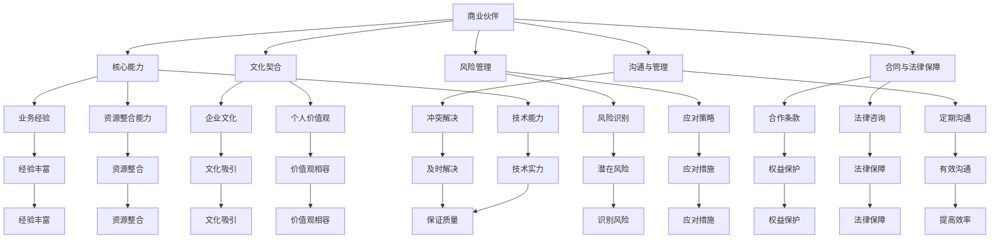

通过这个 Mermaid 流程图，我们可以清晰地看到各个核心概念之间的联系，以及它们在商业伙伴选择与合作管理中的重要作用。

---

# Key Concepts and Connections

When discussing the choice of business partners and collaboration management for technology entrepreneurs, it is essential to clarify several key concepts and understand their interconnections.

#### 1. Business Partner

A business partner is a collaborator chosen by a technology entrepreneur during the startup process. They can provide funding, resources, skills, or experience to jointly promote the development of the enterprise. Business partners can be individuals, teams, or other companies.

#### 2. Core Competencies

Core competencies refer to the key skills and advantages that business partners possess in a specific field. For technology entrepreneurs, core competencies include technical ability, business experience, and resource integration capability.

#### 3. Cultural Fit

Cultural fit is the degree to which the corporate cultures, values, and working styles of business partners are compatible. A highly aligned cultural environment can enhance teamwork and improve work efficiency.

#### 4. Risk Management

Risk management is the process of identifying, evaluating, and responding to potential risks. In business collaborations, risk management is crucial because neither party can completely avoid risks.

#### 5. Contract and Legal Protection

Contract and legal protection are essential tools to ensure the rights and interests of both parties. Through clear collaboration terms and legal documents, uncertainties in the collaboration process can be reduced.

#### 6. Communication and Management

Communication and management are indispensable aspects of the collaboration process. Effective communication can reduce misunderstandings and improve collaboration efficiency, while scientific management can ensure project progress and quality.

#### 7. Mermaid Flowchart

To better understand the connections between these key concepts, we can use a Mermaid flowchart for visualization. Here is a Mermaid flowchart representing the key concepts and their processes:

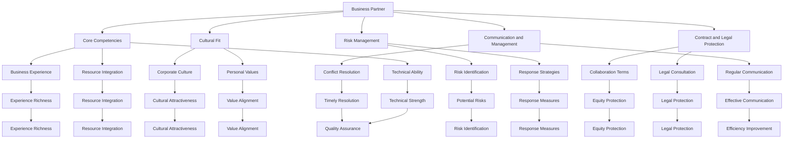

Through this Mermaid flowchart, we can clearly see the connections between the key concepts and their important roles in the choice of business partners and collaboration management. 

---

### 核心算法原理 & 具体操作步骤 Core Algorithm Principles & Step-by-Step Procedures

在选择商业伙伴和进行合作管理的过程中，技术创业者需要遵循一系列科学的步骤和原则，以确保合作的顺利和成功。以下是核心算法原理及具体操作步骤：

#### 1. 明确需求与目标（Clarify Needs and Objectives）

在开始寻找商业伙伴之前，创业者需要明确自身的需求和目标。这包括企业的愿景、使命、短期和长期目标。明确的需求和目标有助于创业者更好地评估潜在的合作伙伴，并确保双方的利益一致。

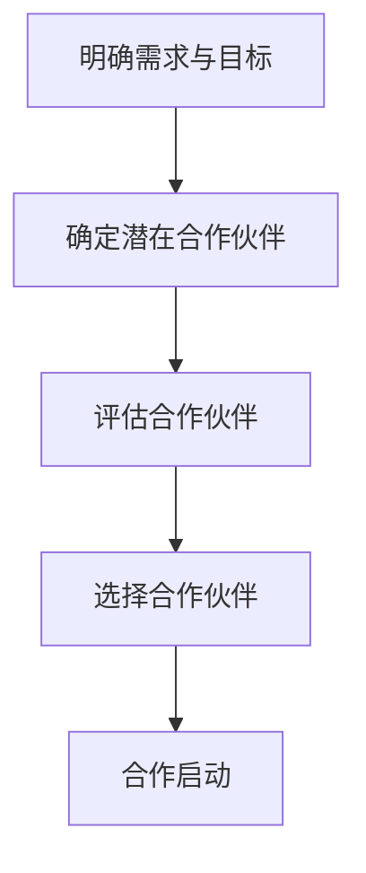

#### 2. 确定潜在合作伙伴（Identify Potential Partners）

在明确需求和目标后，创业者需要寻找符合这些需求和目标的潜在合作伙伴。可以通过市场调研、行业交流、人脉网络等途径来发现合适的合作伙伴。

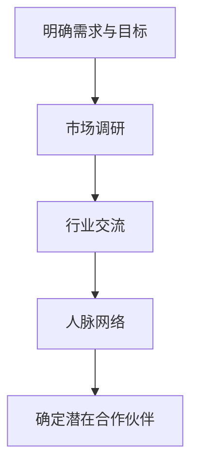

#### 3. 评估合作伙伴（Assess Partners）

在找到潜在合作伙伴后，创业者需要对他们的核心能力、文化契合度、风险承受能力等进行全面的评估。评估方法可以包括面谈、项目案例分析、历史合作记录等。

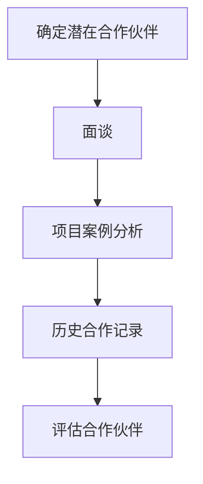

#### 4. 选择合作伙伴（Select Partners）

在评估完成后，创业者需要根据评估结果选择最合适的合作伙伴。选择合作伙伴时应综合考虑能力、经验、资源、文化契合度等多方面因素。

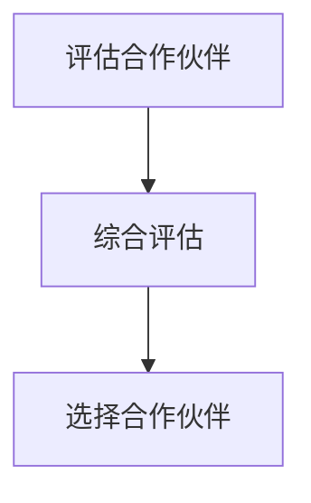

#### 5. 合作启动（Initiate Collaboration）

在确定合作伙伴后，创业者需要制定详细的合作计划，明确合作目标、任务分工、进度安排、绩效考核等。合作启动阶段还包括签订合同、明确法律保障等。

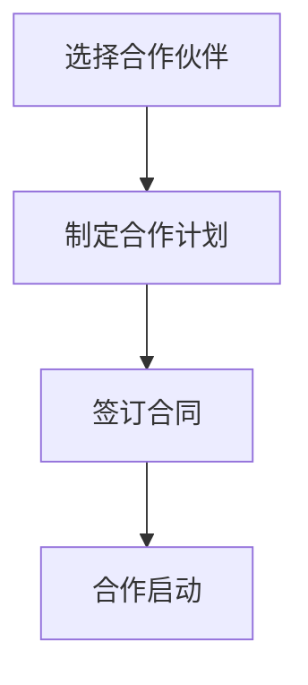

#### 6. 沟通与管理（Communication and Management）

合作启动后，创业者需要确保有效的沟通和管理。这包括定期召开会议、及时解决问题、建立信任关系、协调各方资源等。

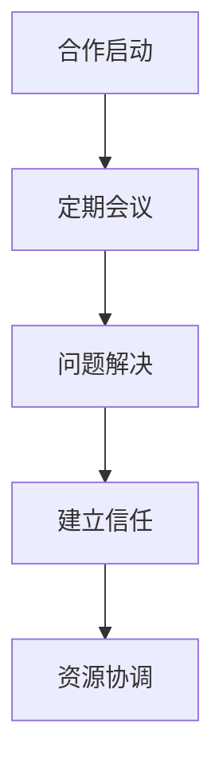

#### 7. 风险管理（Risk Management）

在合作过程中，创业者需要持续进行风险管理。这包括识别潜在风险、制定应对策略、监控风险变化、及时调整合作计划等。

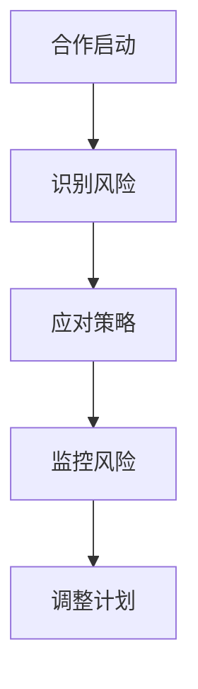

#### 8. 持续优化（Continuous Optimization）

合作过程中，创业者需要持续优化合作模式和管理方法，以提高合作效率和成果。这可以通过定期评估合作效果、引入新方法、改进流程等实现。

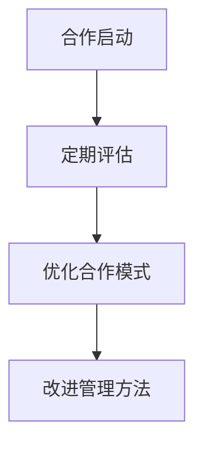

通过以上步骤和原则，技术创业者可以更好地选择商业伙伴并管理合作关系，从而实现企业的长期发展。

---

# Core Algorithm Principles & Step-by-Step Procedures

In the process of choosing business partners and managing collaborations, technology entrepreneurs need to follow a series of scientific steps and principles to ensure the smoothness and success of the collaboration. Here are the core algorithm principles and specific step-by-step procedures:

#### 1. Clarify Needs and Objectives

Before starting to look for business partners, entrepreneurs need to clarify their own needs and objectives. This includes the company's vision, mission, short-term, and long-term goals. Clear needs and objectives help entrepreneurs better evaluate potential partners and ensure that both parties have a shared interest.

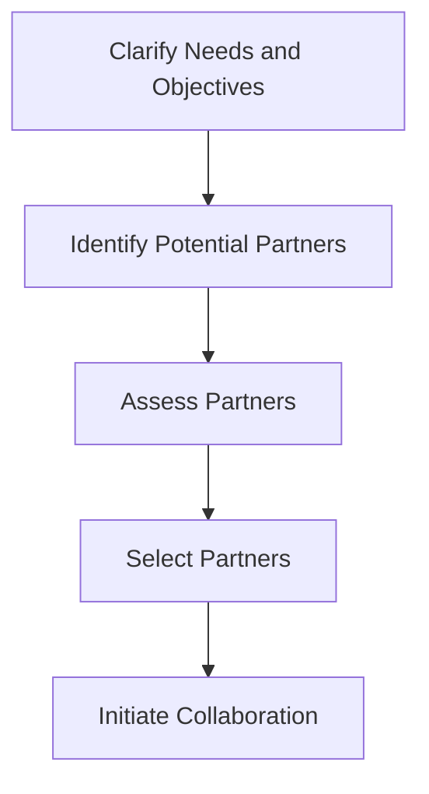

#### 2. Identify Potential Partners

After clarifying needs and objectives, entrepreneurs need to find potential partners that align with these needs and objectives. This can be done through market research, industry exchanges, and networking.

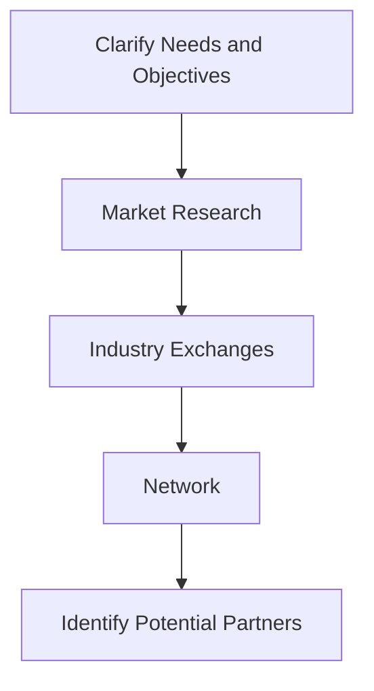

#### 3. Assess Partners

After finding potential partners, entrepreneurs need to conduct a comprehensive assessment of their core competencies, cultural fit, and risk tolerance. Assessment methods can include interviews, project case analyses, and historical collaboration records.

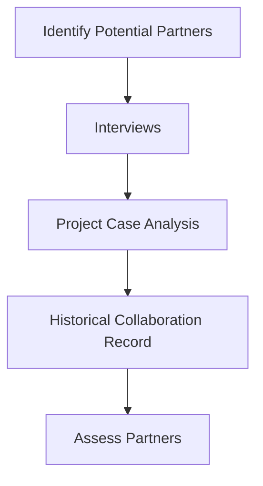

#### 4. Select Partners

After the assessment is complete, entrepreneurs need to select the most suitable partners based on the assessment results. When selecting partners, it is important to consider factors such as capabilities, experience, resources, and cultural fit comprehensively.

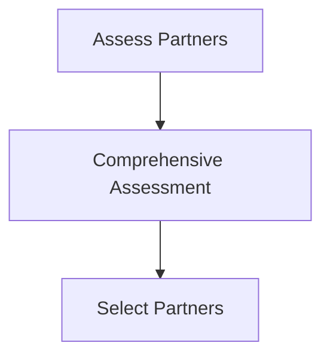

#### 5. Initiate Collaboration

After selecting partners, entrepreneurs need to develop a detailed collaboration plan, clarifying collaboration goals, task allocation, schedule arrangements, performance evaluation, and other aspects. The collaboration initiation stage also includes signing contracts and clarifying legal protections.

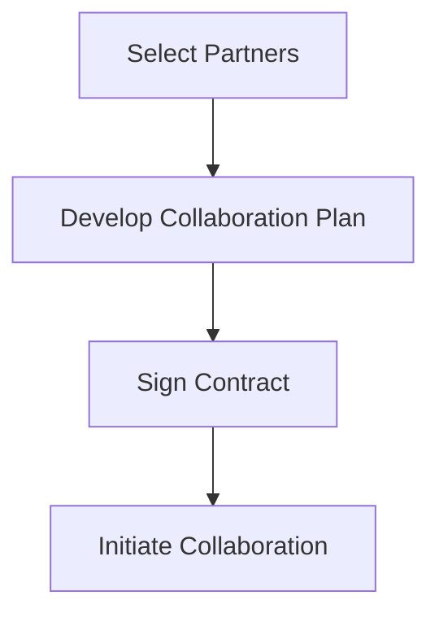

#### 6. Communication and Management

After the collaboration is initiated, entrepreneurs need to ensure effective communication and management. This includes regular meetings, timely problem-solving, building trust relationships, and coordinating resources.

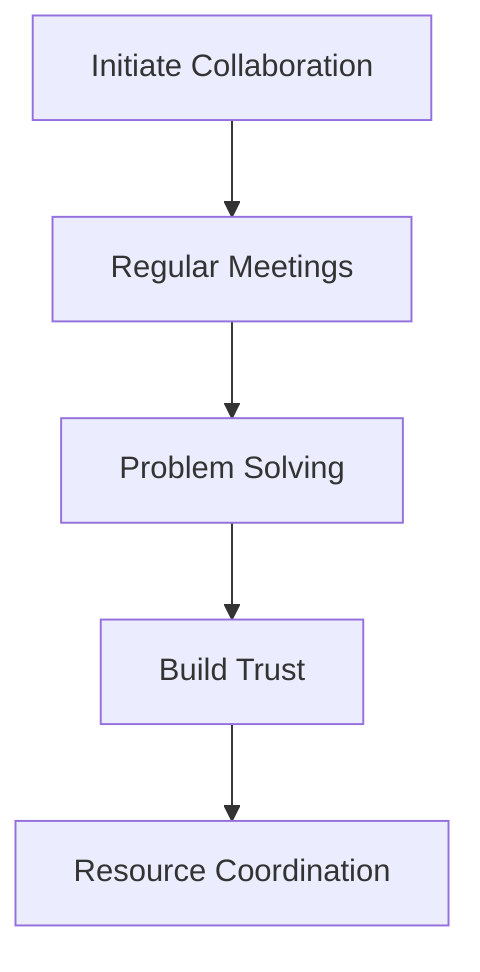

#### 7. Risk Management

During the collaboration process, entrepreneurs need to continuously manage risks. This includes identifying potential risks, developing response strategies, monitoring risk changes, and adjusting collaboration plans in a timely manner.

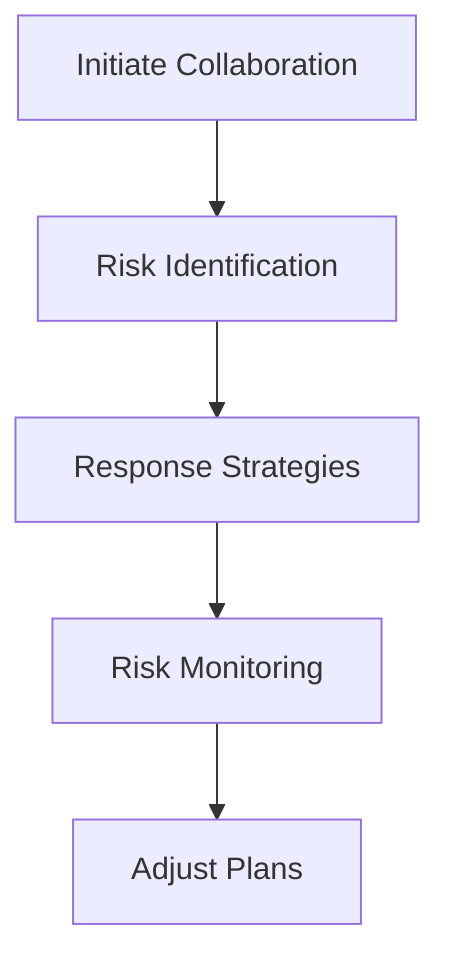

#### 8. Continuous Optimization

During the collaboration process, entrepreneurs need to continuously optimize the collaboration model and management methods to improve collaboration efficiency and outcomes. This can be achieved through regular evaluations of collaboration results, introducing new methods, and improving processes.

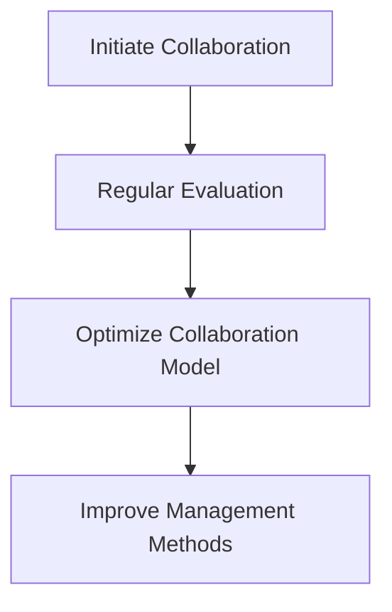

By following these steps and principles, technology entrepreneurs can better choose business partners and manage collaboration relationships, thus achieving long-term business development.

---

### 数学模型和公式 & 详细讲解 & 举例说明 Mathematical Models & Detailed Explanation & Example Illustrations

在选择商业伙伴和进行合作管理的过程中，技术创业者不仅需要遵循科学的步骤和原则，还需要借助数学模型和公式来评估和优化合作效果。以下是几个常用的数学模型和公式，以及它们的详细讲解和举例说明。

#### 1. 成本效益分析（Cost-Benefit Analysis）

成本效益分析是一种评估合作项目是否值得投资的数学模型。它通过比较项目的总成本和预期收益，来判断项目的可行性和经济效益。

公式：
$$
C_B = \frac{B}{C}
$$
其中，\( C_B \) 表示成本效益比，\( B \) 表示预期收益，\( C \) 表示总成本。

详细讲解：
成本效益分析首先需要确定项目的总成本和预期收益。总成本包括直接成本（如人力、设备、材料等）和间接成本（如管理费用、风险成本等）。预期收益则是项目完成后可能带来的经济收益。

举例说明：
假设一家技术创业公司计划开发一款新产品，预计总成本为 100 万元，预期收益为 150 万元。则成本效益比为：
$$
C_B = \frac{150}{100} = 1.5
$$
由于成本效益比大于 1，说明该项目具有较好的经济效益，值得投资。

#### 2. 敏感性分析（Sensitivity Analysis）

敏感性分析是一种评估合作项目中各种因素对结果影响程度的数学模型。它通过调整关键参数，观察结果的变化情况，来判断哪些因素对项目最关键。

公式：
$$
\Delta X = \frac{\partial Y}{\partial X}
$$
其中，\( \Delta X \) 表示参数变化，\( Y \) 表示结果，\( X \) 表示关键参数。

详细讲解：
敏感性分析需要先确定项目中的关键参数，然后通过调整这些参数，观察结果的变化情况。参数变化可以正向或负向，以观察项目在不同情况下的稳定性。

举例说明：
假设一家技术创业公司的产品销售量受到市场需求的敏感性影响。如果市场需求增加 10%，则销售量预期增加 20%。则需求敏感度为：
$$
\Delta X = \frac{\partial Y}{\partial X} = \frac{20}{10} = 2
$$
这意味着市场需求每增加 1%，销售量预期增加 2%，市场需求对销售量的影响较大。

#### 3. 决策树（Decision Tree）

决策树是一种用于评估合作项目中各种决策方案和结果的方法。它通过绘制树状图，展示不同决策路径和相应的结果，帮助创业者做出最优决策。

公式：
$$
P(A|B) = \frac{P(A \cap B)}{P(B)}
$$
其中，\( P(A|B) \) 表示在条件 \( B \) 下，事件 \( A \) 发生的概率，\( P(A \cap B) \) 表示事件 \( A \) 和 \( B \) 同时发生的概率，\( P(B) \) 表示事件 \( B \) 发生的概率。

详细讲解：
决策树首先需要确定项目的各个决策节点和结果节点。决策节点表示创业者需要做出的决策，结果节点表示不同决策路径下的结果。通过计算不同决策路径的概率和期望值，可以判断最优决策。

举例说明：
假设一家技术创业公司面临两个决策：A 和 B。决策 A 的成功概率为 60%，失败概率为 40%；决策 B 的成功概率为 40%，失败概率为 60%。如果成功带来的收益为 100 万元，失败带来的损失为 50 万元。则决策树的计算如下：

- 决策 A：
  - 成功：概率 60%，收益 100 万元
  - 失败：概率 40%，损失 50 万元
  - 期望值：\( 0.6 \times 100 + 0.4 \times (-50) = 30 \) 万元

- 决策 B：
  - 成功：概率 40%，收益 100 万元
  - 失败：概率 60%，损失 50 万元
  - 期望值：\( 0.4 \times 100 + 0.6 \times (-50) = -10 \) 万元

由于决策 A 的期望值大于决策 B，创业者应该选择决策 A。

通过以上数学模型和公式的讲解和举例说明，技术创业者可以更科学地评估合作项目，做出最优决策，从而提高合作的效率和效果。

---

# Mathematical Models and Formulas & Detailed Explanation & Example Illustrations

In the process of choosing business partners and managing collaborations, technology entrepreneurs not only need to follow scientific steps and principles but also need to utilize mathematical models and formulas to evaluate and optimize the effectiveness of collaboration. Here are several commonly used mathematical models and formulas, along with their detailed explanations and example illustrations.

#### 1. Cost-Benefit Analysis

Cost-Benefit Analysis is a mathematical model used to evaluate whether an investment in a collaboration project is worthwhile. It compares the total cost of the project to the expected benefits to determine the feasibility and economic value of the project.

Formula:
$$
C_B = \frac{B}{C}
$$
Where \( C_B \) represents the Cost-Benefit Ratio, \( B \) represents the expected benefits, and \( C \) represents the total cost.

Detailed Explanation:
Cost-Benefit Analysis begins by determining the total cost of the project, which includes direct costs (such as labor, equipment, materials, etc.) and indirect costs (such as management fees, risk costs, etc.). The expected benefits are the economic gains that the project is expected to produce upon completion.

Example Illustration:
Assume a technology startup company plans to develop a new product with an expected total cost of 1 million yuan and an expected revenue of 1.5 million yuan. The cost-benefit ratio would be:
$$
C_B = \frac{1.5}{1} = 1.5
$$
Since the cost-benefit ratio is greater than 1, this indicates that the project has good economic value and is worth investing in.

#### 2. Sensitivity Analysis

Sensitivity Analysis is a mathematical model used to evaluate the impact of various factors on the results of a collaboration project. It adjusts key parameters to observe how changes in these parameters affect the outcome, allowing entrepreneurs to identify which factors are most critical.

Formula:
$$
\Delta X = \frac{\partial Y}{\partial X}
$$
Where \( \Delta X \) represents the change in the parameter, \( Y \) represents the result, and \( X \) represents the key parameter.

Detailed Explanation:
Sensitivity Analysis first requires identifying the key parameters within the project. These parameters are then adjusted to observe the resulting changes. Changes can be positive or negative to assess the project's stability under different conditions.

Example Illustration:
Assume a technology startup company's product sales volume is highly sensitive to market demand. If market demand increases by 10%, sales volume is expected to increase by 20%. The sensitivity is:
$$
\Delta X = \frac{\partial Y}{\partial X} = \frac{20}{10} = 2
$$
This means that for every 1% increase in market demand, sales volume is expected to increase by 2%, indicating that market demand has a significant impact on sales volume.

#### 3. Decision Tree

A decision tree is a method used to evaluate various decision scenarios and their outcomes in a collaboration project. It visually represents different decision paths and their corresponding results, helping entrepreneurs make the best decisions.

Formula:
$$
P(A|B) = \frac{P(A \cap B)}{P(B)}
$$
Where \( P(A|B) \) represents the probability of event \( A \) occurring given that event \( B \) has occurred, \( P(A \cap B) \) represents the probability of both events \( A \) and \( B \) occurring, and \( P(B) \) represents the probability of event \( B \) occurring.

Detailed Explanation:
A decision tree begins by identifying the decision nodes and result nodes within the project. Decision nodes represent decisions that entrepreneurs need to make, and result nodes represent the outcomes of different decision paths. By calculating the probability and expected value of different decision paths, entrepreneurs can determine the best decision.

Example Illustration:
Assume a technology startup company faces two decisions: A and B. Decision A has a success probability of 60% and a failure probability of 40%; decision B has a success probability of 40% and a failure probability of 60%. If success brings in a revenue of 1 million yuan and failure results in a loss of 500,000 yuan. The decision tree calculation is as follows:

- Decision A:
  - Success: Probability 60%, Revenue 1 million yuan
  - Failure: Probability 40%, Loss 500,000 yuan
  - Expected Value: \( 0.6 \times 1 + 0.4 \times (-0.5) = 0.3 \) million yuan

- Decision B:
  - Success: Probability 40%, Revenue 1 million yuan
  - Failure: Probability 60%, Loss 500,000 yuan
  - Expected Value: \( 0.4 \times 1 + 0.6 \times (-0.5) = -0.1 \) million yuan

Since the expected value of Decision A is greater than Decision B, the entrepreneur should choose Decision A.

Through the detailed explanations and example illustrations of these mathematical models and formulas, technology entrepreneurs can make more scientific evaluations of collaboration projects, make optimal decisions, and improve the efficiency and effectiveness of collaboration.

---

### 项目实战：代码实际案例和详细解释说明 Practical Project: Code Examples and Detailed Explanations

为了更好地理解上述数学模型和公式在实际项目中的应用，我们以下将通过一个实际案例来展示如何利用成本效益分析和敏感性分析来评估合作项目。

#### 案例背景 Background

一家初创公司计划开发一款智能医疗诊断系统。该项目预计需要投入 200 万元，其中包括软件开发费用、硬件设备采购费用和人力资源成本。根据市场调研，如果项目成功，预计可以带来 300 万元的收益。然而，项目也存在一定的风险，例如技术难度高、市场需求不确定等。为了更好地评估该项目，公司决定采用成本效益分析和敏感性分析。

#### 成本效益分析 Cost-Benefit Analysis

首先，我们进行成本效益分析：

1. **确定总成本和预期收益**：
   - 总成本：200 万元
   - 预期收益：300 万元

2. **计算成本效益比**：
   $$ C_B = \frac{300}{200} = 1.5 $$

由于成本效益比大于 1，说明该项目在经济效益上具有可行性。

#### 敏感性分析 Sensitivity Analysis

接下来，我们进行敏感性分析，以确定哪些因素对项目的影响最大：

1. **确定关键参数**：
   - 预期收益：300 万元
   - 技术难度：假设技术难度增加 10%，预期收益减少 20%
   - 市场需求：假设市场需求增加 10%，预期收益增加 20%

2. **计算敏感性**：
   - 技术难度敏感性：
     $$ \Delta X = \frac{\partial Y}{\partial X} = \frac{-20}{10} = -2 $$
   - 市场需求敏感性：
     $$ \Delta X = \frac{\partial Y}{\partial X} = \frac{20}{10} = 2 $$

从计算结果可以看出，市场需求对项目收益的影响最大，其次是技术难度。

#### 代码实现 Code Implementation

为了更好地进行上述分析，我们可以使用 Python 编写一个简单的代码实现：

```python
import numpy as np

# 参数设定
total_cost = 2000000
expected_revenue = 3000000

# 成本效益分析
C_B = expected_revenue / total_cost
print(f"成本效益比：{C_B}")

# 敏感性分析
tech_difficulty_sensitivity = -20 / 10
market_demand_sensitivity = 20 / 10

print(f"技术难度敏感性：{tech_difficulty_sensitivity}")
print(f"市场需求敏感性：{market_demand_sensitivity}")
```

#### 详细解释 Detailed Explanation

1. **成本效益分析**：
   成本效益分析的核心是计算成本效益比。在本案例中，预期收益为 300 万元，总成本为 200 万元，因此成本效益比为 1.5。这个比值表示每投入 1 元，预期可以收回 1.5 元，说明该项目在经济效益上具有吸引力。

2. **敏感性分析**：
   敏感性分析的核心是计算参数敏感性。在本案例中，我们考虑了技术难度和市场需求两个关键参数。技术难度敏感性为 -2，表示如果技术难度增加 10%，预期收益将减少 20%。市场需求敏感性为 2，表示如果市场需求增加 10%，预期收益将增加 20%。这两个敏感性指标可以帮助公司更好地理解项目风险，从而制定相应的应对策略。

通过这个实际案例，我们可以看到如何利用成本效益分析和敏感性分析来评估合作项目。这些分析方法不仅有助于公司做出更科学的决策，还可以提高项目的成功率。

---

# Practical Project: Code Examples and Detailed Explanations

To better understand the application of the aforementioned mathematical models and formulas in real-world projects, we will present a practical case study that demonstrates how to use cost-benefit analysis and sensitivity analysis to evaluate a collaboration project.

#### Case Background

A startup company is planning to develop an intelligent medical diagnosis system. The project is expected to require an investment of 2 million yuan, including software development costs, hardware equipment procurement costs, and human resource costs. According to market research, if the project is successful, it is expected to generate 3 million yuan in revenue. However, the project also carries certain risks, such as high technical difficulty and uncertain market demand. To better evaluate the project, the company decides to use cost-benefit analysis and sensitivity analysis.

#### Cost-Benefit Analysis

First, we conduct a cost-benefit analysis:

1. **Determine the total cost and expected revenue**:
   - Total Cost: 20 million yuan
   - Expected Revenue: 30 million yuan

2. **Calculate the cost-benefit ratio**:
   $$ C_B = \frac{30}{20} = 1.5 $$

Since the cost-benefit ratio is greater than 1, this indicates that the project is economically feasible.

#### Sensitivity Analysis

Next, we perform a sensitivity analysis to determine which factors have the greatest impact on the project:

1. **Identify key parameters**:
   - Expected Revenue: 30 million yuan
   - Technical Difficulty: Assume that if technical difficulty increases by 10%, expected revenue will decrease by 20%
   - Market Demand: Assume that if market demand increases by 10%, expected revenue will increase by 20%

2. **Calculate sensitivity**:
   - Technical Difficulty Sensitivity:
     $$ \Delta X = \frac{\partial Y}{\partial X} = \frac{-20}{10} = -2 $$
   - Market Demand Sensitivity:
     $$ \Delta X = \frac{\partial Y}{\partial X} = \frac{20}{10} = 2 $$

From the calculated results, it is clear that market demand has the greatest impact on project revenue, followed by technical difficulty.

#### Code Implementation

To better perform the above analysis, we can write a simple Python code:

```python
import numpy as np

# Parameter settings
total_cost = 2000000
expected_revenue = 3000000

# Cost-benefit analysis
C_B = expected_revenue / total_cost
print(f"Cost-Benefit Ratio: {C_B}")

# Sensitivity analysis
tech_difficulty_sensitivity = -20 / 10
market_demand_sensitivity = 20 / 10

print(f"Technical Difficulty Sensitivity: {tech_difficulty_sensitivity}")
print(f"Market Demand Sensitivity: {market_demand_sensitivity}")
```

#### Detailed Explanation

1. **Cost-Benefit Analysis**:
   The core of cost-benefit analysis is to calculate the cost-benefit ratio. In this case, the expected revenue is 30 million yuan, and the total cost is 20 million yuan, resulting in a cost-benefit ratio of 1.5. This ratio indicates that for every yuan invested, an expected return of 1.5 yuan can be achieved, showing that the project is attractive in terms of economic value.

2. **Sensitivity Analysis**:
   The core of sensitivity analysis is to calculate the sensitivity of parameters. In this case, we considered two key parameters: technical difficulty and market demand. The technical difficulty sensitivity is -2, indicating that if technical difficulty increases by 10%, expected revenue will decrease by 20%. The market demand sensitivity is 2, indicating that if market demand increases by 10%, expected revenue will increase by 20%. These sensitivity metrics help the company better understand project risks and formulate appropriate response strategies.

Through this practical case study, we can see how to use cost-benefit analysis and sensitivity analysis to evaluate a collaboration project. These analytical methods not only help the company make more scientific decisions but also improve the likelihood of project success.

---

### 实际应用场景 Practical Application Scenarios

在技术创业领域，商业伙伴的选择与合作管理不仅仅是一个理论问题，更是一个实践中的复杂挑战。以下将探讨几个实际应用场景，以展示商业伙伴选择与合作管理在技术创业中的具体应用。

#### 1. 软件开发项目 Software Development Project

在软件开发项目中，商业伙伴的选择至关重要。创业者需要寻找具有强大技术实力和丰富开发经验的团队。例如，一家初创公司希望开发一款基于人工智能的医疗诊断应用。在选择合作伙伴时，他们需要评估候选团队的技术能力、项目案例和历史业绩。同时，文化契合度也是一个关键因素，因为一个紧密协作、价值观相似的团队更容易实现项目目标。

#### 2. 硬件产品研发 Hardware Product Development

硬件产品研发通常需要强大的技术实力和丰富的资源。创业者可能需要与供应商合作，以获得所需的硬件组件和原材料。例如，一家初创公司计划研发一款智能家居设备。他们需要选择能够提供高质量硬件组件的供应商，并确保供应链稳定。此外，合作管理中的风险管理也非常重要，因为任何供应链中断都可能对项目造成严重影响。

#### 3. 投资合作 Investment Collaboration

在投资合作中，创业者需要寻找具有资金和行业资源的投资者。例如，一家初创公司正在寻求风险投资（VC）来支持其业务扩张。创业者需要评估投资者的背景、投资策略和行业网络。同时，合作条款的制定和合同的法律保障也是关键，以确保双方权益得到保护。

#### 4. 跨界合作 Cross-Border Collaboration

在跨界合作中，创业者需要面对不同的文化、价值观和业务模式。例如，一家互联网公司希望与一家传统制造企业合作开发智能硬件。这种合作要求双方在技术、市场和资源方面进行深度融合。文化契合度和沟通效率成为成功合作的关键。

#### 5. 战略伙伴关系 Strategic Partnership

战略伙伴关系通常涉及长期的合作和共同的目标。例如，一家初创公司与一家大型科技公司建立战略合作伙伴关系，共同开发新的技术解决方案。这种关系要求双方在战略规划、资源整合和风险管理等方面紧密合作。

在这些实际应用场景中，商业伙伴的选择与合作管理不仅仅是技术问题，还涉及到文化、法律和策略等多方面因素。创业者需要综合考虑这些因素，以实现长期的合作共赢。

---

# Practical Application Scenarios

In the field of technology entrepreneurship, the choice of business partners and collaboration management are not just theoretical issues but complex challenges in practice. The following discusses several practical application scenarios to demonstrate the specific application of business partner selection and collaboration management in technology entrepreneurship.

#### 1. Software Development Project

In software development projects, the choice of business partners is crucial. Entrepreneurs need to find teams with strong technical expertise and extensive development experience. For example, a startup company aims to develop an AI-based medical diagnosis application. When selecting partners, they need to evaluate the technical capabilities, project cases, and historical performance of the candidates. Additionally, cultural fit is a key factor, as a closely collaborative team with similar values is more likely to achieve project goals.

#### 2. Hardware Product Development

Hardware product development typically requires strong technical expertise and abundant resources. Entrepreneurs may need to collaborate with suppliers to obtain the necessary hardware components and raw materials. For instance, a startup company plans to develop a smart home device. They need to select suppliers who can provide high-quality hardware components and ensure a stable supply chain. Furthermore, risk management in collaboration is essential, as any disruption in the supply chain could severely impact the project.

#### 3. Investment Collaboration

In investment collaborations, entrepreneurs need to find investors with funds and industry resources. For example, a startup company is seeking venture capital (VC) to support its business expansion. Entrepreneurs need to assess the background, investment strategy, and industry network of the investors. Additionally, the formulation of collaboration terms and the legal protection of contracts are crucial to ensure the protection of both parties' rights.

#### 4. Cross-Border Collaboration

Cross-border collaborations involve different cultures, values, and business models. For example, an internet company aims to collaborate with a traditional manufacturing company to develop smart hardware. This type of collaboration requires deep integration in technology, market, and resources. Cultural fit and communication efficiency become key factors for successful collaboration.

#### 5. Strategic Partnership

Strategic partnerships typically involve long-term collaboration and shared goals. For instance, a startup company establishes a strategic partnership with a large technology company to jointly develop new technological solutions. This type of relationship requires close collaboration in strategic planning, resource integration, and risk management.

In these practical application scenarios, the choice of business partners and collaboration management involve not only technical issues but also cultural, legal, and strategic aspects. Entrepreneurs need to consider these factors comprehensively to achieve long-term collaborative win-win situations.

---

### 工具和资源推荐 Tools and Resources Recommendation

在进行商业伙伴选择和合作管理的过程中，技术创业者可以借助各种工具和资源来提高效率和质量。以下是一些值得推荐的工具和资源：

#### 1. 学习资源推荐 Learning Resources

- **书籍**：
  - 《创业维艰》（"Hard Things About Hard Things" by Ben Horowitz）
  - 《创业家之路》（"The Lean Startup" by Eric Ries）
  - 《创业与风险投资》（"Entrepreneurship and Venture Capital" by Jerry Porras and Stewart R. Johnson）

- **论文**：
  - "The Dynamics of Entrepreneurship: A Theoretical Integration of Creativity and Management" by John H. Dyer and Paul H. Thrane
  - "Entrepreneurial Leadership: A Multilevel Perspective" by Lars-Erik Bruun and Hans Jorgen Whistance

- **博客**：
  - 阿里云创业博客（https://blog.aliyun.com/）
  - 程序员创业课堂（https://www.imooc.com/learn/list?alg=start）

- **网站**：
  - 创业邦（https://www.chuangye.com/）
  - TechCrunch（https://techcrunch.com/）

#### 2. 开发工具框架推荐 Development Tools and Frameworks

- **编程语言**：
  - Python（适用于数据分析和人工智能）
  - Java（适用于企业级应用开发）
  - JavaScript（适用于前端开发）

- **开发框架**：
  - React（适用于前端开发）
  - Django（适用于后端开发）
  - TensorFlow（适用于机器学习和人工智能）

- **云平台**：
  - AWS（Amazon Web Services）
  - Azure（Microsoft Azure）
  - Google Cloud Platform

#### 3. 相关论文著作推荐 Relevant Papers and Publications

- **论文**：
  - "The Role of Business Models in Creating Value in Early-Stage Technology Ventures" by Thomas R. Hall and John H. Dyer
  - "How to Evaluate and Select Business Partners" by William H. Driscoll

- **著作**：
  - 《硅谷创业课》（"Startup Life" by Derek Anderton）
  - 《从0到1》（"Zero to One" by Peter Thiel）

通过以上工具和资源的推荐，技术创业者可以更好地了解商业伙伴选择和合作管理的最佳实践，从而提高自身的决策能力和合作管理水平。

---

# Tools and Resources Recommendation

In the process of choosing business partners and managing collaborations, technology entrepreneurs can leverage various tools and resources to improve efficiency and quality. Here are some recommended tools and resources:

#### 1. Learning Resources

- **Books**:
  - "Hard Things About Hard Things" by Ben Horowitz
  - "The Lean Startup" by Eric Ries
  - "Entrepreneurship and Venture Capital" by Jerry Porras and Stewart R. Johnson

- **Papers**:
  - "The Dynamics of Entrepreneurship: A Theoretical Integration of Creativity and Management" by John H. Dyer and Paul H. Thrane
  - "Entrepreneurial Leadership: A Multilevel Perspective" by Lars-Erik Bruun and Hans Jorgen Whistance

- **Blogs**:
  - Alibaba Cloud Entrepreneur Blog (https://blog.aliyun.com/)
  - Programmer Entrepreneur Classroom (https://www.imooc.com/learn/list?alg=start)

- **Websites**:
  - ChuanYe.com (https://www.chuangye.com/)
  - TechCrunch (https://techcrunch.com/)

#### 2. Development Tools and Frameworks

- **Programming Languages**:
  - Python (for data analysis and AI)
  - Java (for enterprise-level applications)
  - JavaScript (for frontend development)

- **Development Frameworks**:
  - React (for frontend development)
  - Django (for backend development)
  - TensorFlow (for machine learning and AI)

- **Cloud Platforms**:
  - AWS (Amazon Web Services)
  - Azure (Microsoft Azure)
  - Google Cloud Platform

#### 3. Relevant Papers and Publications

- **Papers**:
  - "The Role of Business Models in Creating Value in Early-Stage Technology Ventures" by Thomas R. Hall and John H. Dyer
  - "How to Evaluate and Select Business Partners" by William H. Driscoll

- **Books**:
  - "Startup Life" by Derek Anderton
  - "Zero to One" by Peter Thiel

Through these tool and resource recommendations, technology entrepreneurs can better understand best practices in business partner selection and collaboration management, thereby enhancing their decision-making abilities and collaboration management skills.

---

### 总结：未来发展趋势与挑战 Summary: Future Trends and Challenges

随着技术的不断进步和市场环境的变化，商业伙伴选择与合作管理在技术创业领域正面临新的发展趋势和挑战。以下将探讨这些趋势和挑战，以及技术创业者应如何应对。

#### 1. 未来发展趋势 Future Trends

- **数字化转型 Digital Transformation**：
  数字化转型正在成为企业发展的核心驱动力。技术创业者需要与具备数字化能力和战略眼光的合作伙伴合作，以实现业务的快速迭代和升级。

- **跨界合作 Cross-Border Collaboration**：
  跨界合作将越来越普遍，特别是在人工智能、物联网、生物技术等领域。创业者需要寻找那些能够在不同领域拥有资源和技术优势的合作伙伴。

- **可持续性发展 Sustainability**：
  可持续发展成为全球关注的重点。创业者需要考虑合作伙伴是否具备环保意识和社会责任感，以确保企业发展的可持续性。

- **敏捷管理和协作 Agile Management and Collaboration**：
  敏捷开发和管理模式正逐渐被接受，创业者需要与那些能够快速响应市场变化和灵活调整策略的合作伙伴合作。

#### 2. 未来挑战 Future Challenges

- **技术复杂性 Technology Complexity**：
  技术的快速发展使得项目复杂性增加，创业者需要与拥有高水平技术能力和经验丰富的合作伙伴合作，以应对技术挑战。

- **市场不确定性 Market Uncertainty**：
  市场的不确定性使得商业伙伴的选择变得更加困难。创业者需要具备较强的风险评估和应对能力，以降低市场波动带来的影响。

- **数据安全与隐私 Data Security and Privacy**：
  数据安全和隐私问题日益突出，创业者需要确保合作伙伴遵守相关法律法规，并具备强大的数据安全保护能力。

- **文化差异 Cultural Differences**：
  不同文化背景的合作伙伴在沟通和协作中可能存在障碍。创业者需要建立跨文化的沟通机制，促进合作双方的相互理解和信任。

#### 3. 应对策略 Response Strategies

- **建立战略伙伴关系 Build Strategic Partnerships**：
  与战略合作伙伴建立长期稳定的合作关系，共同应对市场和技术挑战。

- **强化风险管理 Strengthen Risk Management**：
  制定全面的风险管理计划，包括风险识别、评估和应对策略，确保项目顺利进行。

- **提升数字化能力 Enhance Digital Competence**：
  提升自身的数字化能力，包括数据分析和利用能力，以应对数字化转型的挑战。

- **培养跨文化沟通能力 Cultivate Cross-Cultural Communication Skills**：
  通过培训和文化交流活动，提升团队成员的跨文化沟通能力，促进合作双方的紧密协作。

通过以上策略，技术创业者可以更好地应对未来发展趋势和挑战，实现企业的长期稳定发展。

---

# Summary: Future Trends and Challenges

With the continuous advancement of technology and changes in the market environment, the choice of business partners and collaboration management in the field of technology entrepreneurship are facing new trends and challenges. The following discusses these trends and challenges, as well as how technology entrepreneurs should respond.

#### 1. Future Trends

- **Digital Transformation**:
  Digital transformation is becoming a core driving force for business development. Entrepreneurs need to collaborate with partners who have digital capabilities and strategic insights to rapidly iterate and upgrade their businesses.

- **Cross-Border Collaboration**:
  Cross-border collaboration is becoming increasingly common, especially in fields such as AI, IoT, and biotechnology. Entrepreneurs need to find partners who have resources and technological advantages in different fields.

- **Sustainability**:
  Sustainability has become a global focus. Entrepreneurs need to consider whether their partners have an awareness of environmental protection and social responsibility to ensure the sustainability of business development.

- **Agile Management and Collaboration**:
  Agile development and management models are increasingly being accepted. Entrepreneurs need to collaborate with partners who can quickly respond to market changes and flexibly adjust strategies.

#### 2. Future Challenges

- **Technology Complexity**:
  The rapid development of technology has increased the complexity of projects, and entrepreneurs need to collaborate with partners who have high levels of technical expertise and extensive experience to address these challenges.

- **Market Uncertainty**:
  Market uncertainty makes the choice of business partners more difficult. Entrepreneurs need to have strong risk assessment and response capabilities to mitigate the impact of market fluctuations.

- **Data Security and Privacy**:
  Data security and privacy issues are becoming more prominent. Entrepreneurs need to ensure that their partners comply with relevant laws and regulations and have strong data security protection capabilities.

- **Cultural Differences**:
  Cultural differences among partners can create barriers in communication and collaboration. Entrepreneurs need to establish cross-cultural communication mechanisms to promote mutual understanding and trust between the parties.

#### 3. Response Strategies

- **Build Strategic Partnerships**:
  Establish long-term and stable partnerships with strategic partners to jointly address market and technological challenges.

- **Strengthen Risk Management**:
  Develop comprehensive risk management plans, including risk identification, assessment, and response strategies, to ensure the smooth progress of the project.

- **Enhance Digital Competence**:
  Improve digital competence, including data analysis and utilization capabilities, to address the challenges of digital transformation.

- **Cultivate Cross-Cultural Communication Skills**:
  Through training and cultural exchange activities, enhance the cross-cultural communication skills of team members to promote close collaboration between the parties.

By implementing these strategies, technology entrepreneurs can better respond to future trends and challenges, achieving long-term and stable business development.

---

### 附录：常见问题与解答 Appendix: Frequently Asked Questions and Answers

在技术创业过程中，商业伙伴的选择与合作管理是一个复杂而关键的问题。以下是一些常见问题及其解答，旨在帮助创业者更好地理解和应对这一挑战。

#### 1. 如何评估潜在商业伙伴的技术能力？

**解答**：评估潜在商业伙伴的技术能力时，可以采取以下几种方法：
- **项目案例分析**：查看合作伙伴之前完成的项目，评估其技术复杂度和项目成果。
- **技术测试**：进行技术测试或评估，以验证合作伙伴的实际技术实力。
- **团队成员背景**：了解团队成员的背景、经验和教育程度，评估其技术能力。
- **客户评价**：参考合作伙伴的客户评价，了解其技术服务的质量和客户满意度。

#### 2. 商业伙伴的文化契合度如何影响合作效果？

**解答**：文化契合度对合作效果至关重要。高文化契合度意味着：
- **沟通顺畅**：减少误解和冲突，提高沟通效率。
- **协同合作**：增强团队凝聚力，促进资源整合。
- **共同目标**：确保双方在目标上达成一致，提高合作成功率。
- **信任建立**：建立长期的信任关系，降低合作风险。

#### 3. 在合作过程中如何进行有效的风险管理？

**解答**：有效的风险管理包括以下步骤：
- **识别风险**：分析合作过程中可能出现的风险，如市场波动、技术难题、法律风险等。
- **评估风险**：对识别出的风险进行评估，确定其发生的概率和影响程度。
- **制定策略**：根据风险评估结果，制定相应的应对策略，如风险规避、风险转移、风险缓解等。
- **监控和调整**：在合作过程中持续监控风险变化，并根据实际情况及时调整风险应对策略。

#### 4. 如何确保合作条款的公平性和法律保障？

**解答**：确保合作条款的公平性和法律保障可以通过以下措施：
- **法律咨询**：在签订合作条款前，咨询专业律师，确保合同内容合法、公平。
- **条款明确**：明确合作双方的权利、义务和责任，避免模糊条款。
- **合同审查**：签订合同前，仔细审查合同条款，确保没有遗漏或不公平的条款。
- **履约监督**：在合同执行过程中，监督双方的履约情况，确保合同条款得到遵守。

#### 5. 如何在合作中保持良好的沟通与管理？

**解答**：保持良好的沟通与管理包括：
- **定期会议**：定期召开会议，及时沟通项目进展、问题和需求。
- **沟通渠道**：建立多样化的沟通渠道，如电话、邮件、即时通讯工具等，确保信息传递畅通。
- **透明度**：保持合作过程的透明度，让双方了解项目的实际情况。
- **冲突解决**：建立冲突解决机制，及时、公平地解决合作中的分歧和冲突。

通过以上解答，技术创业者可以更好地理解商业伙伴选择与合作管理的复杂性，从而在实际操作中做出更明智的决策。

---

# Appendix: Frequently Asked Questions and Answers

In the process of technology entrepreneurship, the choice of business partners and collaboration management is a complex and critical issue. The following are some frequently asked questions and their answers, aimed at helping entrepreneurs better understand and address this challenge.

#### 1. How can the technical ability of potential business partners be evaluated?

**Answer**: When evaluating the technical ability of potential business partners, several methods can be employed:
- **Project Case Analysis**: Review the projects that the partner has completed previously to assess the complexity of the projects and the outcomes achieved.
- **Technical Testing**: Conduct technical tests or evaluations to verify the actual technical capabilities of the partner.
- **Team Member Background**: Understand the background, experience, and educational level of the team members to evaluate their technical skills.
- **Customer Reviews**: Refer to customer reviews of the partner's technical services to understand the quality and customer satisfaction.

#### 2. How does the cultural fit of business partners affect the effectiveness of collaboration?

**Answer**: Cultural fit is crucial for the effectiveness of collaboration. High cultural fit means:
- **Smooth Communication**: Reduces misunderstandings and conflicts, improving communication efficiency.
- **Collaborative Cooperation**: Enhances team cohesion and promotes resource integration.
- **Common Goals**: Ensures that both parties are aligned on objectives, increasing the success rate of collaboration.
- **Building Trust**: Establishes a long-term trust relationship, reducing collaboration risks.

#### 3. How can effective risk management be carried out during the collaboration process?

**Answer**: Effective risk management includes the following steps:
- **Risk Identification**: Analyze potential risks that may arise during the collaboration process, such as market fluctuations, technical challenges, and legal risks.
- **Risk Assessment**: Assess the identified risks to determine their probability of occurrence and impact.
- **Strategy Development**: Develop appropriate response strategies based on the risk assessment results, such as risk avoidance, risk transfer, and risk mitigation.
- **Monitoring and Adjustment**: Continuously monitor the changes in risks during the collaboration process and adjust the risk response strategies as necessary.

#### 4. How can the fairness and legal protection of collaboration terms be ensured?

**Answer**: To ensure the fairness and legal protection of collaboration terms, the following measures can be taken:
- **Legal Consultation**: Consult professional lawyers before signing the collaboration terms to ensure that the contract content is legal and fair.
- **Clear Terms**: Clearly define the rights, obligations, and responsibilities of both parties, avoiding ambiguous terms.
- **Contract Review**: Thoroughly review the contract terms before signing to ensure there are no omissions or unfair terms.
- **Performance Supervision**: Supervise the fulfillment of the contract terms by both parties during the collaboration process to ensure compliance.

#### 5. How can good communication and management be maintained during collaboration?

**Answer**: Maintaining good communication and management during collaboration includes:
- **Regular Meetings**: Hold regular meetings to communicate the progress, issues, and needs of the project.
- **Communication Channels**: Establish diverse communication channels, such as phone, email, instant messaging tools, to ensure smooth information transmission.
- **Transparency**: Maintain transparency in the collaboration process, allowing both parties to understand the actual situation of the project.
- **Conflict Resolution**: Establish a conflict resolution mechanism to address and resolve disputes and conflicts in a timely and fair manner.

By understanding these answers, technology entrepreneurs can better navigate the complexity of choosing business partners and managing collaborations, making more informed decisions in practice. 

---

### 扩展阅读 & 参考资料 Extended Reading & References

为了更深入地了解商业伙伴选择与合作管理，技术创业者可以参考以下扩展阅读和参考资料：

1. **书籍**：
   - 《创业维艰》（"Hard Things About Hard Things" by Ben Horowitz）
   - 《创业与风险投资》（"Entrepreneurship and Venture Capital" by Jerry Porras and Stewart R. Johnson）
   - 《跨界创新：打造无边界企业》（"Crossing the Chasm" by Geoffrey A. Moore）

2. **论文**：
   - "The Dynamics of Entrepreneurship: A Theoretical Integration of Creativity and Management" by John H. Dyer and Paul H. Thrane
   - "Entrepreneurial Leadership: A Multilevel Perspective" by Lars-Erik Bruun and Hans Jorgen Whistance
   - "The Role of Business Models in Creating Value in Early-Stage Technology Ventures" by Thomas R. Hall and John H. Dyer

3. **在线课程**：
   - Coursera（https://www.coursera.org/）：提供关于创业、领导力、商业策略等领域的在线课程。
   - edX（https://www.edx.org/）：提供由世界一流大学开设的免费在线课程。

4. **博客与网站**：
   - 阿里云创业博客（https://blog.aliyun.com/）
   - TechCrunch（https://techcrunch.com/）
   - 创业邦（https://www.chuangye.com/）

5. **相关论文著作**：
   - "How to Evaluate and Select Business Partners" by William H. Driscoll
   - "Startup Life" by Derek Anderton
   - "Zero to One" by Peter Thiel

通过这些扩展阅读和参考资料，技术创业者可以进一步深化对商业伙伴选择与合作管理的理解和实践。

---

# Extended Reading & References

To gain a deeper understanding of business partner selection and collaboration management, technology entrepreneurs can refer to the following extended reading and reference materials:

1. **Books**:
   - "Hard Things About Hard Things" by Ben Horowitz
   - "Entrepreneurship and Venture Capital" by Jerry Porras and Stewart R. Johnson
   - "Crossing the Chasm" by Geoffrey A. Moore

2. **Papers**:
   - "The Dynamics of Entrepreneurship: A Theoretical Integration of Creativity and Management" by John H. Dyer and Paul H. Thrane
   - "Entrepreneurial Leadership: A Multilevel Perspective" by Lars-Erik Bruun and Hans Jorgen Whistance
   - "The Role of Business Models in Creating Value in Early-Stage Technology Ventures" by Thomas R. Hall and John H. Dyer

3. **Online Courses**:
   - Coursera (https://www.coursera.org/): Offers online courses in areas such as entrepreneurship, leadership, and business strategy.
   - edX (https://www.edx.org/): Provides free online courses from top universities around the world.

4. **Blogs and Websites**:
   - Alibaba Cloud Entrepreneur Blog (https://blog.aliyun.com/)
   - TechCrunch (https://techcrunch.com/)
   - ChuanYe.com (https://www.chuangye.com/)

5. **Additional Papers and Books**:
   - "How to Evaluate and Select Business Partners" by William H. Driscoll
   - "Startup Life" by Derek Anderton
   - "Zero to One" by Peter Thiel

By engaging with these extended reading and reference materials, technology entrepreneurs can further deepen their understanding and practical application of business partner selection and collaboration management.

