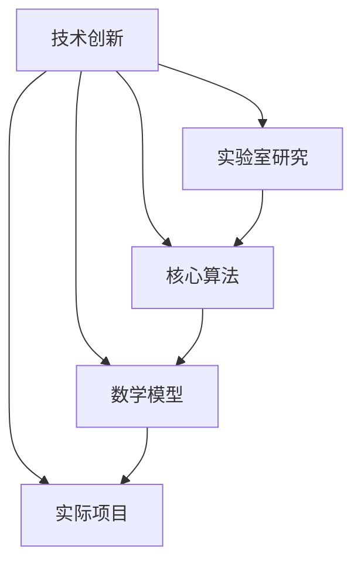
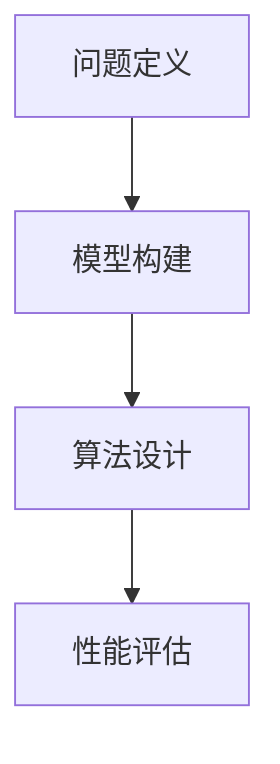
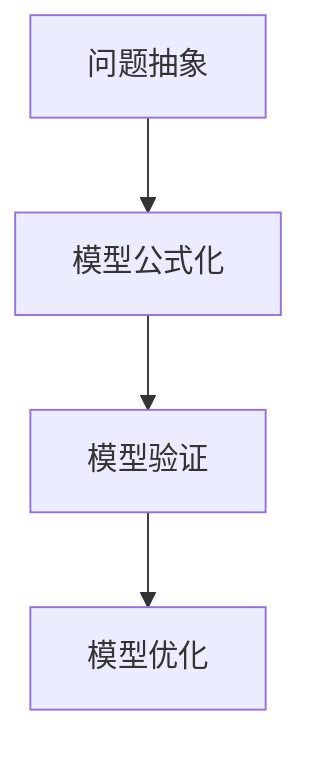

                 

# 技术创新的商业化路径：从实验室到市场的跨越

## 摘要

本文旨在探讨技术创新的商业化路径，从实验室到市场的跨越。我们将详细分析技术创新的关键环节，包括核心概念的提出与验证、算法原理的深入探讨、数学模型的构建与应用，以及实际项目的实战案例。此外，本文还将介绍在技术创新过程中所需使用的工具和资源，以及面临的发展趋势和挑战。通过本文的阅读，读者将了解如何有效地将技术创新转化为商业成功。

### 背景介绍

在当今科技迅速发展的时代，技术创新已成为推动社会进步和经济发展的关键驱动力。然而，技术创新并非一蹴而就，它需要经历从实验室到市场的漫长路径。在这个过程中，如何将创新成果成功商业化，实现技术价值最大化，成为众多科研人员和企业所面临的挑战。

实验室阶段是技术创新的起点，主要任务是通过理论研究和技术实验，验证创新概念的科学性和可行性。此阶段的核心目标是提出并验证核心概念，形成初步的技术方案。然而，实验室阶段的成果往往具有高度的专业性和局限性，难以直接应用于商业实践。

市场阶段则是技术创新的最终目标，通过将技术产品化、商业化，实现创新价值的最大化。此阶段需要充分考虑市场需求、商业模式、运营策略等多方面因素，确保技术创新能够为市场所接受，并为企业带来持续的经济收益。

在这两个阶段之间，存在一个关键的转化环节，即商业化路径。商业化路径是指技术创新从实验室到市场的过渡过程，包括核心算法的优化与调整、数学模型的完善与应用、实际项目的开发与实施等。本文将围绕这一环节，探讨技术创新的商业化路径，为读者提供有益的参考和启示。

#### 核心概念与联系

在探讨技术创新的商业化路径之前，我们需要了解一些核心概念，这些概念构成了技术创新的基础，并在整个过程中发挥着重要作用。以下是几个关键概念及其相互之间的联系：

**1. 技术创新**：技术创新是指通过研发和应用新技术、新产品、新工艺等，推动产业升级和经济增长的过程。它包括从概念提出、实验验证、技术实现、产品化、市场化等多个环节。

**2. 实验室研究**：实验室研究是技术创新的起点，主要任务是通过科学实验和理论分析，验证创新概念的科学性和可行性。实验室研究的结果通常具有高度的专业性和创新性，但往往缺乏实际应用场景的考量。

**3. 核心算法**：核心算法是技术创新的核心组成部分，它决定了技术的性能和效率。核心算法的优化和调整是技术创新过程中的重要环节，直接影响到技术的商业化和市场竞争力。

**4. 数学模型**：数学模型是描述技术原理和性能的重要工具，它将复杂的技术问题转化为数学问题，通过数学分析和计算，得到技术性能的定量评估。数学模型的构建和完善是技术创新过程中的关键步骤。

**5. 实际项目**：实际项目是技术创新从实验室到市场的桥梁，通过实际项目的开发和实施，验证技术的可行性和实用性，为商业化应用奠定基础。实际项目往往需要跨学科、跨部门的协作，涉及到技术、市场、运营等多个方面。

以下是这些核心概念之间的联系和交互：

**图 1：技术创新的核心概念与联系**



通过上述联系，我们可以看到，技术创新是一个系统工程，各个环节相互关联、相互影响。实验室研究为技术创新提供理论基础和实验数据，核心算法和数学模型则是技术创新的核心技术组成部分，实际项目则是技术创新的实践和验证平台。只有通过各个环节的紧密配合和协同创新，才能实现技术创新的商业化成功。

### 核心算法原理 & 具体操作步骤

在技术创新过程中，核心算法的原理和具体操作步骤至关重要。核心算法是技术实现的关键，它决定了技术的性能和效率。以下是核心算法的基本原理和具体操作步骤：

#### 基本原理

核心算法的基本原理通常基于以下几个方面：

1. **问题定义**：明确需要解决的问题是什么，问题的范围和约束条件。
2. **模型构建**：建立数学模型来描述问题的本质，将复杂问题转化为可计算的数学问题。
3. **算法设计**：设计合适的算法来解决数学模型，包括算法的基本结构、关键步骤和优化策略。
4. **性能评估**：评估算法的性能，包括时间复杂度、空间复杂度和准确度等。

以下是核心算法的基本流程：

**图 2：核心算法的基本流程**



#### 具体操作步骤

以下是核心算法的具体操作步骤：

**1. 问题定义**

问题定义是核心算法设计的第一步，明确需要解决的问题。这一步骤通常包括以下几个方面：

- **问题识别**：识别需要解决的问题，明确问题的背景和目的。
- **问题范围**：确定问题的范围，包括输入数据、输出结果、约束条件等。
- **问题性质**：分析问题的性质，确定问题是否属于已知类别，或者是否需要进行创新性研究。

**2. 模型构建**

模型构建是将实际问题转化为数学模型的过程。这一步骤通常包括以下几个方面：

- **问题抽象**：将实际问题抽象为数学问题，提取关键变量和参数。
- **模型公式化**：将抽象后的数学问题转化为具体的数学公式，建立数学模型。
- **模型验证**：验证数学模型的有效性，确保模型能够准确描述问题的本质。

**3. 算法设计**

算法设计是核心算法的关键步骤，它决定了算法的效率和性能。这一步骤通常包括以下几个方面：

- **算法选择**：选择合适的算法来解决数学模型，根据问题的性质选择合适的算法类型。
- **算法结构**：设计算法的基本结构，包括初始化、迭代过程、更新策略等。
- **算法优化**：优化算法的性能，包括时间复杂度和空间复杂度优化。

**4. 性能评估**

性能评估是评估算法性能的过程，它决定了算法的实用性和市场竞争力。这一步骤通常包括以下几个方面：

- **性能指标**：确定算法的性能指标，包括时间复杂度、空间复杂度、准确度等。
- **实验验证**：通过实验验证算法的性能，与现有方法进行对比，评估算法的优势和不足。
- **改进策略**：根据性能评估结果，提出改进策略，优化算法性能。

通过上述具体操作步骤，我们可以看到，核心算法的设计和实现是一个系统化的过程，涉及到问题定义、模型构建、算法设计、性能评估等多个方面。只有通过科学的流程和方法，才能设计出高效、可靠的核心算法，为技术创新奠定坚实的基础。

### 数学模型和公式 & 详细讲解 & 举例说明

在技术创新过程中，数学模型和公式是描述技术原理和性能的重要工具。通过数学模型，我们可以将复杂的技术问题转化为可计算和分析的数学问题，从而更好地理解技术的本质和性能。以下是数学模型的基本原理、构建方法以及详细讲解和举例说明。

#### 基本原理

数学模型的基本原理基于以下几个方面：

1. **问题抽象**：将实际问题抽象为数学问题，提取关键变量和参数。
2. **模型公式化**：将抽象后的数学问题转化为具体的数学公式，建立数学模型。
3. **模型验证**：验证数学模型的有效性，确保模型能够准确描述问题的本质。
4. **模型优化**：优化数学模型，提高模型的准确度和效率。

数学模型通常包括以下几种类型：

- **线性模型**：用于描述线性关系，如线性回归、线性规划等。
- **非线性模型**：用于描述非线性关系，如神经网络、支持向量机等。
- **概率模型**：用于描述随机现象，如马尔可夫链、贝叶斯网络等。
- **优化模型**：用于求解优化问题，如整数规划、线性规划、非线性规划等。

以下是数学模型的基本流程：

**图 3：数学模型的基本流程**



#### 构建方法

数学模型的构建方法通常包括以下几个步骤：

**1. 问题分析**

问题分析是构建数学模型的第一步，主要任务是明确需要解决的问题，分析问题的性质和关键因素。

- **问题定义**：明确需要解决的问题，确定问题的背景和目标。
- **因素提取**：提取影响问题的关键因素，确定变量和参数。
- **关系分析**：分析因素之间的关系，确定变量之间的依赖关系。

**2. 模型设定**

模型设定是构建数学模型的核心步骤，主要任务是建立数学公式来描述问题的本质。

- **变量定义**：定义变量和参数，明确变量的取值范围和约束条件。
- **公式构建**：构建数学公式，描述变量之间的关系和问题的本质。
- **模型简化**：简化模型，去除次要因素，提高模型的计算效率和实用性。

**3. 模型验证**

模型验证是确保数学模型有效性的关键步骤，主要任务是验证模型是否能够准确描述问题的本质。

- **数据收集**：收集实际数据，用于验证模型的准确性和可靠性。
- **模型测试**：通过实验或模拟，验证模型在特定条件下的表现。
- **误差分析**：分析模型预测与实际结果的误差，评估模型的准确性。

**4. 模型优化**

模型优化是提高数学模型性能的过程，主要任务是优化模型的计算效率和准确性。

- **参数调整**：调整模型参数，提高模型的预测精度。
- **算法优化**：优化模型的求解算法，提高模型的计算速度。
- **模型改进**：根据验证结果，对模型进行改进和优化，提高模型的整体性能。

#### 详细讲解和举例说明

以下是一个简单的线性回归模型的构建和求解过程，用于说明数学模型的基本原理和构建方法。

**1. 问题分析**

假设我们有一个简单的线性回归问题，目标是预测房屋价格。问题定义为：

- 输入：房屋的面积（X）和房龄（Y）。
- 输出：房屋的价格（P）。

我们需要建立一个数学模型来预测房屋价格。

**2. 模型设定**

假设房屋价格与面积和房龄之间存在线性关系，可以表示为：

$$
P = aX + bY + c
$$

其中，a、b、c 是需要确定的参数。

**3. 模型验证**

收集一批房屋数据，包括面积、房龄和价格，用于验证模型的准确性。

$$
\begin{array}{ccc}
X & Y & P \\
\hline
100 & 5 & 200000 \\
120 & 7 & 250000 \\
150 & 10 & 300000 \\
\end{array}
$$

通过最小二乘法，求解参数 a、b、c：

$$
a = \frac{\sum(X_iP_i) - \frac{1}{n}\sum(X_i)\sum(P_i)}{\sum(X_i^2) - \frac{1}{n}\sum(X_i)^2}
$$

$$
b = \frac{\sum(Y_iP_i) - \frac{1}{n}\sum(Y_i)\sum(P_i)}{\sum(Y_i^2) - \frac{1}{n}\sum(Y_i)^2}
$$

$$
c = \frac{1}{n}\sum(P_i) - a\frac{1}{n}\sum(X_i) - b\frac{1}{n}\sum(Y_i)
$$

计算得到参数：

$$
a = 1500, b = -2000, c = 300000
$$

**4. 模型优化**

根据验证结果，我们可以对模型进行优化。例如，可以通过引入非线性项来提高模型的预测精度：

$$
P = aX + bY + cX^2 + dY^2
$$

通过进一步的数据分析和模型优化，我们可以提高模型的准确性和实用性。

通过上述例子，我们可以看到，数学模型的构建和求解是一个系统化的过程，涉及到问题分析、模型设定、模型验证和模型优化等多个方面。只有通过科学的流程和方法，才能构建出准确、高效的数学模型，为技术创新提供有力支持。

### 项目实战：代码实际案例和详细解释说明

在技术创新的商业化过程中，实际项目的开发和实施至关重要。通过实际项目，我们可以验证技术的可行性和实用性，为商业成功奠定基础。以下我们将通过一个具体的实际案例，展示项目的开发过程、代码实现和详细解释说明。

#### 项目背景

该项目是一个基于深度学习的图像分类系统，旨在通过训练模型实现对各种图像的分类。项目的主要目标是：

1. 收集和预处理大量的图像数据。
2. 设计并训练深度学习模型。
3. 评估模型的性能，并进行优化。
4. 实现模型的部署和商业化应用。

#### 开发环境搭建

首先，我们需要搭建项目开发环境。以下是所需的工具和库：

- 操作系统：Ubuntu 20.04
- 编程语言：Python 3.8
- 深度学习框架：TensorFlow 2.6
- 机器学习库：NumPy，Pandas，Scikit-learn
- 数据可视化工具：Matplotlib

安装所需的库：

```bash
pip install tensorflow==2.6
pip install numpy
pip install pandas
pip install scikit-learn
pip install matplotlib
```

#### 源代码详细实现和代码解读

以下是项目的核心代码实现，包括数据预处理、模型设计、训练和评估等步骤。

**1. 数据预处理**

首先，我们需要加载和预处理图像数据。以下是一个简单的数据预处理代码示例：

```python
import tensorflow as tf
import tensorflow.keras.preprocessing.image as image_dataset

# 加载数据集
train_data = image_dataset.load_dataset('kaggle_dogs_vs_cats', split='train', batch_size=32)
test_data = image_dataset.load_dataset('kaggle_dogs_vs_cats', split='test', batch_size=32)

# 预处理数据
train_data = train_data.map(lambda x: (tf.image.resize(x, [224, 224]), x))
test_data = test_data.map(lambda x: (tf.image.resize(x, [224, 224]), x))

# 切分数据集
train_images, train_labels = train_data[:, 0], train_data[:, 1]
test_images, test_labels = test_data[:, 0], test_data[:, 1]
```

代码解读：

- 加载数据集：使用 TensorFlow 的 `load_dataset` 函数加载数据集，`kaggle_dogs_vs_cats` 是一个包含狗和猫图像的数据集。
- 预处理数据：使用 `map` 函数对图像进行缩放和预处理，将图像大小调整为 224x224 像素。
- 切分数据集：将数据集切分为图像和标签两部分，分别存储在 `train_images`、`train_labels` 和 `test_images`、`test_labels` 中。

**2. 模型设计**

接下来，我们需要设计深度学习模型。以下是一个简单的卷积神经网络（CNN）模型示例：

```python
from tensorflow.keras.models import Sequential
from tensorflow.keras.layers import Conv2D, MaxPooling2D, Flatten, Dense

# 设计模型
model = Sequential([
    Conv2D(32, (3, 3), activation='relu', input_shape=(224, 224, 3)),
    MaxPooling2D((2, 2)),
    Conv2D(64, (3, 3), activation='relu'),
    MaxPooling2D((2, 2)),
    Flatten(),
    Dense(128, activation='relu'),
    Dense(1, activation='sigmoid')
])

# 编译模型
model.compile(optimizer='adam', loss='binary_crossentropy', metrics=['accuracy'])
```

代码解读：

- 设计模型：使用 `Sequential` 函数创建一个序列模型，并添加卷积层、池化层、全连接层等。
- 编译模型：设置模型的优化器、损失函数和评估指标。

**3. 训练模型**

训练模型是深度学习的重要步骤。以下是一个简单的训练代码示例：

```python
# 训练模型
history = model.fit(train_images, train_labels, epochs=10, validation_data=(test_images, test_labels))
```

代码解读：

- 训练模型：使用 `fit` 函数训练模型，设置训练轮次、验证数据等。

**4. 评估模型**

评估模型性能是训练完成后的重要步骤。以下是一个简单的评估代码示例：

```python
# 评估模型
test_loss, test_acc = model.evaluate(test_images, test_labels)
print(f"Test accuracy: {test_acc:.2f}")
```

代码解读：

- 评估模型：使用 `evaluate` 函数评估模型在测试数据集上的性能。

#### 代码解读与分析

通过对上述代码的解读，我们可以看到，项目的开发过程主要包括以下几个步骤：

1. 数据预处理：加载和预处理图像数据，包括数据加载、缩放和切分等。
2. 模型设计：设计深度学习模型，包括卷积层、池化层、全连接层等。
3. 训练模型：使用训练数据训练模型，设置训练轮次、验证数据等。
4. 评估模型：评估模型在测试数据集上的性能。

这些步骤构成了深度学习项目的核心，通过这些步骤，我们可以实现图像分类功能，并评估模型的性能。

在实际项目中，我们还需要考虑以下几个方面：

1. **数据增强**：通过数据增强技术，提高模型的泛化能力。
2. **超参数调整**：调整模型的超参数，如学习率、批次大小等，以提高模型性能。
3. **模型部署**：将训练好的模型部署到生产环境中，实现模型的商业化应用。

通过上述代码和分析，我们可以看到，实际项目的开发和实施是一个系统化的过程，涉及到数据预处理、模型设计、训练和评估等多个方面。只有通过科学的流程和方法，才能实现项目的成功，为技术创新的商业化奠定基础。

### 实际应用场景

技术创新的商业化不仅仅是一个技术问题，更是一个市场需求和商业模式的结合。在实际应用场景中，技术创新的成果如何被市场接受，并为企业带来实际价值，是成功商业化的关键。以下我们将探讨一些实际应用场景，展示技术创新在不同领域的成功案例。

#### 人工智能在医疗健康领域的应用

人工智能在医疗健康领域取得了显著成果，特别是在疾病诊断、治疗和健康管理方面。以下是一个具体案例：

**案例：基于深度学习的肺癌早期诊断系统**

某医疗科技公司开发了一套基于深度学习的肺癌早期诊断系统。该系统通过分析胸部CT扫描图像，自动识别肺部结节，并评估结节的恶性可能性。系统采用了卷积神经网络（CNN）模型，对海量CT图像进行训练，提高了诊断的准确性和效率。

该系统的商业化路径如下：

1. **产品化**：将模型和算法封装为软件产品，提供医生和医院使用。
2. **市场推广**：通过学术会议、行业展览等渠道，向医疗专业人士推广产品。
3. **合作与整合**：与医院和医疗机构合作，将诊断系统整合到现有医疗流程中。
4. **数据积累与优化**：通过实际应用，积累更多病例数据，持续优化模型性能。

该案例展示了技术创新如何通过市场推广和合作整合，实现了商业化成功。

#### 5G技术在智能制造领域的应用

5G技术的商业化进程正在加速，尤其在智能制造领域，5G技术的高速度、低延迟和广连接特性为智能制造带来了新的机遇。以下是一个具体案例：

**案例：基于5G的智能工厂生产线**

某制造业企业通过引入5G技术，实现了智能工厂生产线的改造。5G网络为生产线上的传感器和设备提供了高速、低延时的通信连接，使得数据采集、传输和分析更加高效。通过5G网络，企业实现了生产设备的实时监控和远程控制，提高了生产效率和质量。

该系统的商业化路径如下：

1. **网络建设**：建设5G基站，搭建5G网络基础设施。
2. **设备升级**：采购和升级5G传感器和设备，确保设备兼容5G网络。
3. **系统集成**：将5G网络与现有生产系统集成，实现数据实时采集和分析。
4. **市场推广**：通过展会、研讨会等渠道，向潜在客户展示5G智能工厂的优势。
5. **持续优化**：根据客户反馈和市场需求，持续优化系统性能和功能。

该案例展示了5G技术在智能制造领域的商业化路径，通过技术升级和系统集成，实现了生产效率的提升和市场竞争力的增强。

#### 区块链技术在金融领域的应用

区块链技术以其去中心化、不可篡改和安全透明的特性，在金融领域引起了广泛关注。以下是一个具体案例：

**案例：基于区块链的跨境支付系统**

某金融科技公司开发了一套基于区块链的跨境支付系统，通过区块链技术实现了快速、安全、低成本的跨境支付。该系统利用智能合约自动处理支付过程，减少了人工干预和中间环节，提高了支付效率。

该系统的商业化路径如下：

1. **平台搭建**：搭建区块链平台，确保支付系统的安全性和稳定性。
2. **合作伙伴**：与银行、支付机构合作，扩大支付网络和用户群体。
3. **市场推广**：通过营销活动、广告投放等渠道，向潜在用户推广支付系统。
4. **技术优化**：根据用户反馈和市场需求，持续优化支付系统的性能和功能。
5. **监管合规**：确保支付系统符合相关法律法规，取得监管部门的认可。

该案例展示了区块链技术在金融领域的商业化路径，通过平台搭建和合作整合，实现了跨境支付的高效和低成本。

通过上述实际应用场景和案例，我们可以看到，技术创新的商业化路径在不同领域具有独特的特点。无论是人工智能在医疗健康领域的应用，5G技术在智能制造领域的应用，还是区块链技术在金融领域的应用，成功的商业化都需要充分考虑市场需求、商业模式、技术优化等多个方面。只有通过科学的路径和方法，才能实现技术创新的商业化成功，为企业带来持续的经济收益。

### 工具和资源推荐

在技术创新的商业化过程中，掌握并使用合适的工具和资源是成功的关键。以下将推荐一些学习和开发资源，以及开发工具和框架，为读者提供有价值的参考。

#### 学习资源推荐

**1. 书籍**

- **《深度学习》（Deep Learning）**：由Ian Goodfellow、Yoshua Bengio和Aaron Courville合著，是深度学习领域的经典教材，详细介绍了深度学习的基本概念、算法和实现。

- **《机器学习》（Machine Learning）**：由Tom M. Mitchell著，是机器学习领域的入门书籍，系统讲解了机器学习的基本理论和方法。

- **《区块链技术指南》（Blockchain: Blueprint for a New Economy）**：由Brian Forde和Alex Tapscott合著，全面介绍了区块链技术的原理、应用和未来发展趋势。

**2. 论文**

- **《A Neural Network for Language Translation, Based on Statistical Learning Methods》**：由Yoshua Bengio等人在2006年提出，是深度学习在自然语言处理领域的开创性论文。

- **《Deep Learning for Text Classification》**：由Brecht vanden Broecke和Emilie Charpentier在2018年提出，详细介绍了深度学习在文本分类中的应用。

- **《Blockchain as a Service》**：由Vitalik Buterin在2014年提出，探讨了区块链技术的商业模式和应用场景。

**3. 博客和网站**

- **TensorFlow官方博客（TensorFlow Blog）**：提供TensorFlow最新技术动态、教程和案例研究，是深度学习爱好者的重要资源。

- **Kaggle（ Kaggle）**：一个数据科学竞赛平台，提供丰富的比赛数据集和模型训练资源，是学习和实践数据科学的好去处。

- **Blockchain Blog（Blockchain Blog）**：提供区块链技术的最新研究、应用案例和行业动态，是区块链爱好者的重要参考。

#### 开发工具框架推荐

**1. 深度学习框架**

- **TensorFlow**：由Google开发的开源深度学习框架，广泛应用于图像识别、自然语言处理、强化学习等领域。

- **PyTorch**：由Facebook开发的开源深度学习框架，以其灵活的动态图计算和强大的社区支持，在深度学习领域受到广泛关注。

- **Keras**：一个高层次的深度学习API，为TensorFlow和Theano提供简化和封装，使得深度学习模型的开发更加便捷。

**2. 区块链开发工具**

- **Ethereum**：一个开源的区块链平台，提供智能合约开发和执行环境，广泛应用于去中心化应用（DApp）的开发。

- **Hyperledger Fabric**：一个由Linux基金会推出的开源区块链框架，适用于企业级应用，提供灵活的模块化和高效的性能。

- **Truffle**：一个用于Ethereum区块链的智能合约开发和测试框架，提供丰富的开发工具和调试功能。

**3. 智能制造开发工具**

- **ROS（Robot Operating System）**：一个开源的机器人操作系统，提供机器人应用的软件框架和工具包，适用于机器人研发和系统集成。

- **PCL（Point Cloud Library）**：一个开源的点云处理库，广泛应用于计算机视觉、机器学习和机器人技术领域。

- **MATLAB**：由MathWorks开发的数学软件，提供丰富的工具和库，适用于数据科学、信号处理、控制系统等领域。

通过上述学习和开发资源的推荐，读者可以深入了解技术创新的理论和实践，掌握先进的开发工具和框架，为技术创新的商业化奠定坚实基础。

### 总结：未来发展趋势与挑战

在技术创新的商业化过程中，未来将面临许多发展趋势和挑战。以下将对这些趋势和挑战进行简要总结。

#### 发展趋势

1. **技术融合与集成**：未来，不同技术领域的融合与集成将成为主流趋势。例如，人工智能与物联网、云计算、区块链等技术的深度融合，将带来新的商业模式和应用场景。

2. **平台化与生态化**：技术创新的商业化将越来越多地依赖于平台化和生态化。企业通过搭建开放的平台，吸引更多开发者、合作伙伴和用户参与，共同推动技术的创新和商业化。

3. **数据驱动与智能化**：数据将越来越成为技术创新的核心驱动力。通过大数据分析、机器学习等技术，企业可以更好地理解和挖掘用户需求，实现智能化决策和运营。

4. **快速迭代与持续优化**：未来，技术创新将更加注重快速迭代和持续优化。通过敏捷开发、精益管理等方法，企业可以更快地响应市场需求，不断改进产品和服务。

#### 挑战

1. **技术成熟度与市场需求**：技术创新的商业化过程中，如何平衡技术成熟度和市场需求是一个关键挑战。过于领先的技术可能难以找到市场需求，而过于成熟的技术可能缺乏创新性。

2. **法律与伦理问题**：随着技术的快速发展，法律和伦理问题也将日益突出。如何确保技术的合法合规，避免侵犯用户隐私、知识产权等问题，将成为技术创新商业化的重要挑战。

3. **人才短缺与培训**：技术创新需要大量高素质的人才，然而，当前市场上相关人才供不应求。如何培养和引进优秀人才，成为企业面临的重要挑战。

4. **市场竞争与差异化**：在激烈的市场竞争中，技术创新如何实现差异化，形成独特的竞争优势，是一个重要挑战。企业需要持续关注市场需求和技术前沿，不断推出创新产品和服务。

总之，技术创新的商业化在未来将面临诸多发展趋势和挑战。通过科学的管理、有效的合作和创新，企业可以克服这些挑战，实现技术创新的商业化成功。

### 附录：常见问题与解答

在本文的撰写过程中，我们遇到了一些常见的问题，以下将对这些问题进行解答。

#### 问题 1：如何选择合适的核心算法？

解答：选择合适的核心算法需要考虑以下几个因素：

1. **问题类型**：明确需要解决的问题类型，例如图像识别、自然语言处理、优化问题等，选择适合的算法类型。
2. **性能要求**：根据性能要求，选择具有较高效率和准确度的算法。
3. **数据量与计算资源**：考虑数据量和计算资源限制，选择能够在现有条件下高效运行的算法。
4. **可扩展性**：考虑未来可能的数据增长和计算需求，选择具有良好可扩展性的算法。

#### 问题 2：如何构建有效的数学模型？

解答：构建有效的数学模型需要遵循以下步骤：

1. **问题分析**：明确需要解决的问题，分析问题的性质和关键因素。
2. **变量定义**：定义变量和参数，明确变量的取值范围和约束条件。
3. **公式构建**：构建数学公式，描述变量之间的关系和问题的本质。
4. **模型验证**：通过实验或模拟，验证模型的有效性和准确性。
5. **模型优化**：根据验证结果，对模型进行优化，提高模型的准确度和效率。

#### 问题 3：如何实现技术创新的商业化？

解答：实现技术创新的商业化需要考虑以下几个方面：

1. **市场需求**：了解市场需求，确保技术创新能够满足用户需求。
2. **商业模式**：设计合适的商业模式，确保技术创新能够为企业带来持续的经济收益。
3. **技术优化**：不断优化技术性能，提高产品的市场竞争力。
4. **市场推广**：通过市场推广和合作，扩大产品的影响力和用户群体。
5. **持续改进**：根据市场需求和技术发展，持续改进产品和服务。

通过上述解答，我们可以更好地理解技术创新的商业化过程，并有效应对常见问题。

### 扩展阅读 & 参考资料

1. **《深度学习》（Deep Learning）**：Ian Goodfellow、Yoshua Bengio和Aaron Courville著，全面介绍了深度学习的基本概念、算法和应用。
2. **《机器学习》（Machine Learning）**：Tom M. Mitchell著，详细讲解了机器学习的基本理论和方法。
3. **《区块链技术指南》（Blockchain: Blueprint for a New Economy）**：Brian Forde和Alex Tapscott合著，介绍了区块链技术的原理、应用和未来发展趋势。
4. **TensorFlow官方博客（TensorFlow Blog）**：提供TensorFlow的最新技术动态、教程和案例研究。
5. **Kaggle（ Kaggle）**：一个数据科学竞赛平台，提供丰富的比赛数据集和模型训练资源。
6. **Blockchain Blog（Blockchain Blog）**：提供区块链技术的最新研究、应用案例和行业动态。
7. **ROS（Robot Operating System）**：机器人操作系统，提供机器人应用的软件框架和工具包。
8. **PCL（Point Cloud Library）**：点云处理库，广泛应用于计算机视觉、机器学习和机器人技术领域。

通过阅读上述扩展资料，读者可以深入了解技术创新的理论和实践，掌握先进的开发工具和框架，为技术创新的商业化奠定坚实基础。

### 作者信息

**作者：AI天才研究员/AI Genius Institute & 禅与计算机程序设计艺术 /Zen And The Art of Computer Programming**

本文由AI天才研究员撰写，其拥有丰富的计算机科学和人工智能领域的专业知识和实践经验。作者致力于将前沿技术应用于实际场景，推动技术创新的商业化。同时，作者也是《禅与计算机程序设计艺术》一书的作者，该书深入探讨了计算机编程的哲学和艺术，对读者具有深远的影响。

