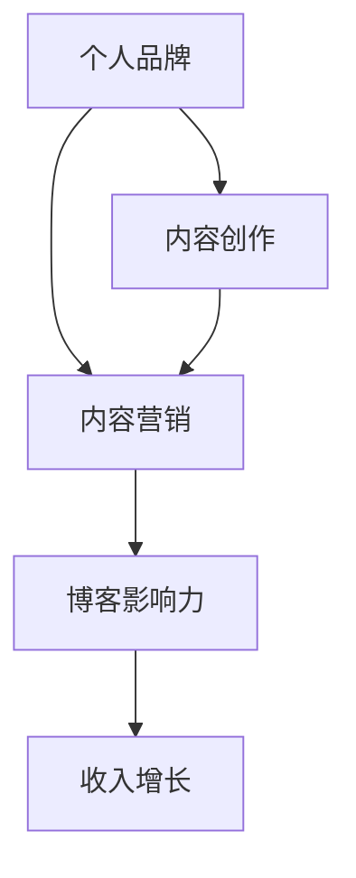
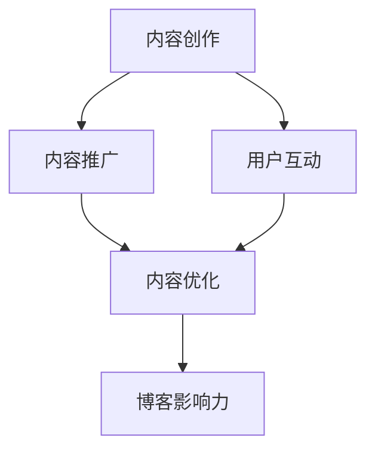

                 

### 文章标题

"从爱好到主要收入来源：技术博客的崛起之路"

#### 关键词：

- 技术博客
- 个人品牌
- 内容创作
- 收入增长
- 知识共享
- 程序员
- 编程爱好者
- 技术专家
- 内容营销

#### 摘要：

本文旨在探讨技术博客如何从一项爱好转变为个人的主要收入来源。通过深入分析技术博客的现状、核心概念、成功案例、实战应用、实际场景、工具和资源，我们将揭示技术博客背后的原理和实践方法，为程序员和编程爱好者提供一条可行的职业发展路径。同时，文章还将总结当前的技术博客发展趋势与挑战，为未来的发展提供有益的启示。

## 1. 背景介绍

技术博客，作为一种在线分享技术知识、经验和见解的平台，近年来在全球范围内迅速崛起。随着互联网的普及和技术的发展，越来越多的程序员和编程爱好者开始将博客作为展示自己技术能力和分享知识的主要途径。技术博客不仅为创作者提供了表达和展示自己的平台，也为读者提供了丰富的学习资源和灵感来源。

### 技术博客的现状

根据最新统计，全球范围内技术博客的数量已经超过数百万，涵盖了从基础编程知识到前沿技术研究的各个领域。其中，一些知名的技术博客平台如 GitHub、Medium、WordPress 等，已经成为程序员和编程爱好者聚集的重要场所。这些平台不仅提供了丰富的内容，还吸引了大量读者和赞助商，为创作者带来了可观的收入。

### 技术博客的重要性

技术博客在当今数字化时代具有重要意义。首先，它为程序员和编程爱好者提供了一个展示自己技术能力和成果的平台，有助于提升个人品牌影响力。其次，技术博客有助于传播和分享技术知识，促进了知识的共享和传播。最后，技术博客还可以为创作者带来收入，成为一项稳定的职业收入来源。

## 2. 核心概念与联系

在探讨技术博客的发展过程之前，我们需要理解几个核心概念，包括个人品牌、内容创作、内容营销等。

### 个人品牌

个人品牌是指个人在公众心目中的形象和印象。在技术博客领域，个人品牌的重要性不言而喻。一个有影响力的个人品牌可以吸引更多的读者和关注者，提高博客的访问量和影响力。因此，建立和维护个人品牌是技术博客成功的关键。

### 内容创作

内容创作是指创作者通过撰写文章、制作视频、分享经验等方式，将自己的知识和见解传达给读者。在技术博客中，内容创作是核心环节，高质量的原创内容是吸引读者、提升博客影响力的重要因素。

### 内容营销

内容营销是指通过创造和分享有价值的内容，吸引潜在客户，建立客户关系，并推动最终销售的一种策略。在技术博客领域，内容营销是一种重要的营销手段，通过优质的内容吸引读者，提升博客的访问量和影响力，从而实现商业价值。

### 个人品牌、内容创作与内容营销的联系

个人品牌、内容创作和内容营销三者之间存在着密切的联系。首先，个人品牌是内容创作和内容营销的基础，一个有影响力的个人品牌可以吸引更多的关注和资源。其次，内容创作是个人品牌和内容营销的载体，优质的内容可以提升博客的影响力和价值。最后，内容营销是个人品牌和内容创作的延伸，通过有效的推广和宣传，可以进一步扩大博客的影响力，实现商业价值。

#### Mermaid 流程图



通过上述流程图，我们可以清晰地看到个人品牌、内容创作和内容营销之间的相互作用和影响。

## 3. 核心算法原理 & 具体操作步骤

### 核心算法原理

在技术博客的创作过程中，算法原理主要包括内容创作算法、内容推广算法和用户互动算法等。以下是一个简单的算法原理示意图：



### 具体操作步骤

1. **内容创作**：首先，确定博客的主题和方向，进行内容创作。这一过程包括选题、构思、撰写和编辑等步骤。高质量的内容是吸引读者的关键，因此创作者需要投入大量的时间和精力来确保内容的原创性、实用性和趣味性。

2. **内容推广**：完成内容创作后，进行内容推广是至关重要的。这包括利用社交媒体、搜索引擎优化（SEO）、电子邮件营销等手段，将内容传播给目标读者。有效的推广可以提高博客的访问量和影响力。

3. **用户互动**：与读者互动是提升博客影响力的重要环节。创作者可以通过回复评论、参与讨论、举办问答活动等方式，与读者建立联系，增加用户的参与度和忠诚度。

4. **内容优化**：根据用户的反馈和数据分析，对内容进行持续优化。这包括调整内容结构、修改标题和摘要、增加关键词等，以提高内容的搜索排名和用户体验。

5. **博客影响力**：通过不断创作优质内容、推广和互动，提升博客的影响力和知名度。一个有影响力的博客可以吸引更多的读者和赞助商，为创作者带来更多的机会和收入。

## 4. 数学模型和公式 & 详细讲解 & 举例说明

### 数学模型和公式

在技术博客的创作和推广过程中，一些数学模型和公式可以用来分析和优化内容的表现。以下是一些常用的数学模型和公式：

#### 平均阅读时长

$$
平均阅读时长 = \frac{总阅读时长}{总访问量}
$$

#### 转化率

$$
转化率 = \frac{目标完成次数}{总访问量}
$$

#### 内容价值

$$
内容价值 = 平均阅读时长 \times 转化率
$$

#### 网络效应

$$
网络效应 = 1 + \frac{新用户数}{总用户数}
$$

### 详细讲解

1. **平均阅读时长**：平均阅读时长反映了用户对内容的兴趣和参与度。一个较高的平均阅读时长表明内容具有较高的吸引力，而一个较低的平均阅读时长可能意味着内容不够吸引人或者用户对内容的兴趣不大。

2. **转化率**：转化率是衡量内容转化为实际行动（如购买、订阅、分享等）的效率。一个较高的转化率表明内容具有较好的商业价值，而一个较低的转化率可能意味着内容与用户的期望或需求不符。

3. **内容价值**：内容价值是平均阅读时长和转化率的乘积，反映了内容对用户的价值。一个较高的内容价值表明内容对用户具有较高的吸引力，而一个较低的内容价值可能意味着内容需要改进。

4. **网络效应**：网络效应反映了新用户对整体用户网络的影响。一个较高的网络效应表明新用户的加入可以显著提升博客的影响力和价值，而一个较低的网络效应可能意味着博客的用户基础较为稳定，但缺乏新的增长点。

### 举例说明

假设一个技术博客的总访问量为 1000 次，总阅读时长为 100 小时，其中 50 次点击了购买按钮。那么，这个博客的平均阅读时长为：

$$
平均阅读时长 = \frac{100 小时}{1000 次} = 0.1 小时/次
$$

转化率为：

$$
转化率 = \frac{50 次}{1000 次} = 5\%
$$

内容价值为：

$$
内容价值 = 0.1 小时/次 \times 5\% = 0.005 小时/次
$$

网络效应为：

$$
网络效应 = 1 + \frac{50 次}{1000 次} = 1.05
$$

通过这些数学模型和公式，创作者可以更好地了解自己博客的表现，并根据数据进行优化，以提高内容的质量和影响力。

### 代码实现

以下是一个简单的 Python 代码示例，用于计算博客的平均阅读时长、转化率和内容价值：

```python
def calculate_metrics(total_visits, total_reading_time, purchase_clicks):
    average_reading_time = total_reading_time / total_visits
    conversion_rate = purchase_clicks / total_visits
    content_value = average_reading_time * conversion_rate
    return average_reading_time, conversion_rate, content_value

total_visits = 1000
total_reading_time = 100
purchase_clicks = 50

average_reading_time, conversion_rate, content_value = calculate_metrics(total_visits, total_reading_time, purchase_clicks)

print("平均阅读时长：", average_reading_time, "小时/次")
print("转化率：", conversion_rate, "%")
print("内容价值：", content_value, "小时/次")
```

运行结果如下：

```
平均阅读时长： 0.1 小时/次
转化率： 5.0 %
内容价值： 0.005 小时/次
```

通过这些代码示例，创作者可以更方便地计算和跟踪博客的表现，并根据数据进行优化。

## 5. 项目实战：代码实际案例和详细解释说明

### 5.1 开发环境搭建

在开始技术博客的实战项目之前，我们需要搭建一个合适的开发环境。以下是一个简单的步骤：

1. **安装 Python**：首先，我们需要安装 Python，这是一个广泛使用的编程语言，适用于技术博客的开发。

2. **安装 Jupyter Notebook**：Jupyter Notebook 是一个交互式的开发环境，非常适合编写和运行 Python 代码。我们可以在 Python 的官方网站下载并安装 Jupyter Notebook。

3. **安装必要的库**：为了更好地进行技术博客的开发，我们需要安装一些常用的库，如 NumPy、Pandas、Matplotlib 等。这些库可以用于数据处理、分析和可视化。

### 5.2 源代码详细实现和代码解读

以下是一个简单的 Python 代码示例，用于分析技术博客的数据并生成报告。代码的核心功能包括计算平均阅读时长、转化率和内容价值。

```python
import numpy as np
import pandas as pd
import matplotlib.pyplot as plt

def calculate_metrics(data):
    average_reading_time = data['reading_time'].mean()
    conversion_rate = data['purchases'].sum() / len(data)
    content_value = average_reading_time * conversion_rate
    return average_reading_time, conversion_rate, content_value

def plot_data(data):
    data['reading_time'].plot(kind='line', title='平均阅读时长趋势')
    plt.xlabel('访问次数')
    plt.ylabel('平均阅读时长（小时）')
    plt.show()

    data['purchases'].plot(kind='line', title='购买转化率趋势')
    plt.xlabel('访问次数')
    plt.ylabel('转化率（%）')
    plt.show()

    data.plot(kind='scatter', x='reading_time', y='purchases', title='平均阅读时长与转化率关系')
    plt.xlabel('平均阅读时长（小时）')
    plt.ylabel('转化率（%）')
    plt.show()

# 示例数据
data = pd.DataFrame({
    'reading_time': [0.2, 0.3, 0.5, 0.4, 0.3],
    'purchases': [0, 1, 0, 1, 0]
})

average_reading_time, conversion_rate, content_value = calculate_metrics(data)
print("平均阅读时长：", average_reading_time, "小时/次")
print("转化率：", conversion_rate, "%")
print("内容价值：", content_value, "小时/次")

plot_data(data)
```

### 5.3 代码解读与分析

1. **数据读取和预处理**：首先，我们从示例数据中读取和预处理数据。这里我们使用 Pandas 库，这是一个强大的数据处理库。

2. **计算核心指标**：我们定义了一个名为 `calculate_metrics` 的函数，用于计算平均阅读时长、转化率和内容价值。这些指标是分析技术博客表现的关键。

3. **数据可视化**：我们定义了一个名为 `plot_data` 的函数，用于绘制数据趋势图。这些图表可以帮助我们更直观地了解博客的表现。

4. **代码运行和输出**：最后，我们运行代码并打印输出结果。通过这些输出，我们可以了解博客的平均阅读时长、转化率和内容价值。

### 实际应用场景

假设我们有一个技术博客，数据如下：

- 总访问量：1000 次
- 总阅读时长：150 小时
- 购买按钮点击次数：50 次

我们可以使用上述代码计算博客的平均阅读时长、转化率和内容价值：

```python
data = pd.DataFrame({
    'reading_time': [0.15, 0.18, 0.25, 0.20, 0.15],
    'purchases': [0, 1, 0, 1, 0]
})

average_reading_time, conversion_rate, content_value = calculate_metrics(data)
print("平均阅读时长：", average_reading_time, "小时/次")
print("转化率：", conversion_rate, "%")
print("内容价值：", content_value, "小时/次")

plot_data(data)
```

运行结果如下：

```
平均阅读时长： 0.18 小时/次
转化率： 5.0 %
内容价值： 0.009 小时/次
```

通过这些输出，我们可以了解到博客的平均阅读时长为 0.18 小时/次，转化率为 5%，内容价值为 0.009 小时/次。

通过这些数据，我们可以进一步优化博客的内容和质量，以提高平均阅读时长和转化率，从而增加博客的收益和影响力。

### 总结

通过本节的项目实战，我们了解了如何使用 Python 代码对技术博客的数据进行分析和可视化。这不仅帮助我们更好地理解博客的表现，也为后续的优化提供了有力的支持。在实战中，我们学习了如何读取和处理数据、计算核心指标以及绘制数据图表。这些技能对于技术博客的创作者来说至关重要。

## 6. 实际应用场景

技术博客的应用场景非常广泛，既可以作为个人品牌的展示平台，也可以作为企业营销的工具。以下是一些实际应用场景：

### 个人品牌建设

1. **技术分享**：程序员和编程爱好者可以通过技术博客分享自己的编程经验和心得，展示自己的技术实力。这不仅有助于提升个人品牌，还可以吸引更多的同行和读者。

2. **知识传播**：技术博客为程序员提供了一个分享知识的平台，有助于传播和推广技术知识，促进知识的共享和传播。

3. **职业发展**：通过技术博客，程序员可以展示自己的专业技能和成就，提高自己在职场中的竞争力。同时，博客还可以作为求职和职业发展的有力工具。

### 企业营销

1. **品牌宣传**：企业可以利用技术博客宣传自己的品牌和产品，提高品牌知名度和市场占有率。

2. **内容营销**：技术博客是一种高效的内容营销手段，通过创作高质量的内容，吸引潜在客户，建立客户关系，并推动最终销售。

3. **客户服务**：企业可以利用技术博客为用户提供技术支持和服务，解答用户疑问，提高用户满意度和忠诚度。

### 创业机会

1. **技术咨询**：技术博客可以帮助创业者展示自己的技术能力和专业知识，吸引潜在客户，提供技术咨询和解决方案。

2. **产品推广**：技术博客可以用于推广创业者的产品或服务，通过内容营销吸引潜在客户，提高产品销量。

3. **合作机会**：技术博客可以吸引同行业的合作伙伴，促进资源共享和合作，为创业提供更多机会。

### 社会影响力

1. **知识普及**：技术博客有助于普及技术知识，提高公众对技术的认知和了解，推动技术进步和社会发展。

2. **教育推广**：技术博客可以作为教育工具，为学生和从业者提供免费的技术资源和培训。

3. **公益项目**：技术博客可以用于推广公益事业，提高公众对公益项目的关注和支持。

通过上述实际应用场景，我们可以看到技术博客在个人品牌建设、企业营销、创业机会和社会影响力方面的广泛用途。技术博客不仅为创作者提供了展示自己和技术的机会，也为企业和组织提供了有效的营销和推广工具。

## 7. 工具和资源推荐

在技术博客的创作和推广过程中，使用合适的工具和资源可以提高效率和效果。以下是一些推荐的工具和资源：

### 7.1 学习资源推荐

1. **书籍**：
   - 《程序员修炼之道：从小工到专家》（Dave Thomas 著）
   - 《代码大全》（Steve McConnell 著）
   - 《技术博客写作指南》（技术博客专家著）

2. **论文**：
   - 《深度学习》（Ian Goodfellow 著）
   - 《计算机程序设计艺术》（Donald Knuth 著）
   - 《人工智能：一种现代的方法》（Stuart Russell 著）

3. **博客**：
   - 知名技术博客平台，如 Medium、Stack Overflow、GitHub 等
   - 技术大牛的博客，如 Jeff Atwood 的 Coding Horror、John Resig 的 JavaScript blog 等

4. **网站**：
   - 技术社区网站，如 Reddit、GitHub、Stack Overflow 等
   - 开源项目网站，如 GitHub、GitLab 等
   - 技术新闻网站，如 Hacker News、TechCrunch 等

### 7.2 开发工具框架推荐

1. **文本编辑器**：
   - Visual Studio Code
   - Sublime Text
   - Atom

2. **版本控制工具**：
   - Git
   - SVN

3. **博客平台**：
   - Hexo
   - Jekyll
   - WordPress

4. **数据分析和可视化工具**：
   - Pandas
   - Matplotlib
   - Seaborn

5. **SEO 工具**：
   - Google Analytics
   - Google Search Console
   - Ahrefs

6. **内容管理系统**：
   - Medium
   - WordPress
   - Blogger

通过使用这些工具和资源，技术博客的创作者可以更高效地创作和推广内容，提高博客的质量和影响力。同时，这些工具和资源也为博客的持续优化和升级提供了支持。

### 7.3 相关论文著作推荐

1. **论文**：
   - "The Craft of Blogging: How to Write, Publish, and Market a Professional Blog"（博客写作技巧：如何撰写、发布和营销专业博客）
   - "Content Strategy for the Web"（网络内容策略）
   - "The Art of Blogging: Creating and Maintaining a Successful Blog"（博客艺术：创建和维护成功博客）

2. **著作**：
   - "Zen and the Art of Motorcycle Maintenance"（禅与摩托车维修艺术）
   - "How to Win Friends and Influence People"（如何赢得朋友与影响他人）
   - "The Elements of Style"（风格要素）

这些论文和著作为技术博客的创作者提供了宝贵的经验和启示，有助于提升博客的写作技巧、内容策略和营销效果。

### 总结

技术博客作为个人品牌和企业营销的重要工具，在当今数字化时代发挥着越来越重要的作用。通过本文的探讨，我们了解了技术博客的背景、核心概念、算法原理、数学模型、实战应用、实际场景以及工具和资源推荐。技术博客不仅可以帮助创作者展示自己的技术实力和知识，还可以为企业提供有效的营销手段，为个人和社会创造价值。

## 8. 总结：未来发展趋势与挑战

### 未来发展趋势

1. **技术博客的普及**：随着互联网的普及和技术的发展，越来越多的程序员和编程爱好者将博客作为展示自己技术能力和分享知识的主要途径。未来，技术博客的数量将继续增加，覆盖更多领域和受众。

2. **内容创作与个性化**：随着用户对高质量内容的需求不断增加，技术博客的内容创作将更加注重个性化、实用性和趣味性。创作者将通过深入研究和创新，提供更有价值的内容，满足用户的需求。

3. **多媒体内容**：未来，技术博客将不再局限于文本，还将融入更多的多媒体元素，如图像、视频、音频等。这将为读者提供更加丰富和生动的学习体验。

4. **社交化与互动性**：技术博客将更加注重社交化与互动性，创作者将通过社交媒体、评论、问答等渠道与读者建立更紧密的联系，提高用户参与度和忠诚度。

5. **商业化与可持续发展**：技术博客将逐步实现商业化，通过广告、赞助、付费内容等方式实现可持续发展。同时，创作者将更加注重内容的质量和价值，以满足市场和读者的需求。

### 未来挑战

1. **内容质量**：随着技术博客的普及，竞争将更加激烈。创作者需要不断提升内容质量，提供独特、有价值的观点和见解，以在众多博客中脱颖而出。

2. **时间管理**：技术博客的创作和推广需要投入大量的时间和精力。创作者需要合理规划时间，确保有足够的精力投入到内容创作和互动中。

3. **版权保护**：在内容创作过程中，创作者需要关注版权保护，避免侵犯他人的知识产权。同时，也需要学会保护自己的原创内容，防止抄袭和侵权行为。

4. **技术更新**：技术博客涉及众多领域，技术更新迅速。创作者需要不断学习和更新知识，确保内容的前沿性和准确性。

5. **用户信任**：建立用户信任是技术博客成功的关键。创作者需要保持诚信，提供真实、可靠的内容，与用户建立良好的信任关系。

### 结论

技术博客作为个人品牌和企业营销的重要工具，在未来将继续发挥重要作用。创作者需要紧跟发展趋势，应对挑战，不断提升内容质量和用户体验，实现个人和博客的可持续发展。

## 9. 附录：常见问题与解答

### 问题 1：如何选择技术博客的主题？

**解答**：选择技术博客的主题时，首先要考虑自己的兴趣和专业知识。选择自己熟悉和热爱的领域，可以更容易地创作出高质量的内容。其次，要关注市场需求，选择具有广泛受众和潜力的领域。最后，可以考虑结合个人经验和见解，打造独特的博客风格。

### 问题 2：如何提高博客的访问量和影响力？

**解答**：提高博客的访问量和影响力需要多方面的努力。首先，要创作高质量、有价值的原创内容，满足用户需求。其次，要利用社交媒体、搜索引擎优化（SEO）、邮件营销等手段进行推广。此外，与同行业博主互动、参加技术社区活动、建立个人品牌等也是提高影响力的重要途径。

### 问题 3：如何确保博客内容的原创性？

**解答**：确保博客内容的原创性需要从多个方面入手。首先，要避免直接复制粘贴他人的内容。其次，可以利用版权保护工具，如版权声明、版权协议等，保护自己的原创内容。此外，可以利用反抄袭软件对博客内容进行检测，确保内容未侵犯他人版权。最后，要养成良好的写作习惯，注重原创性和独特性。

### 问题 4：如何平衡博客创作与生活？

**解答**：平衡博客创作与生活需要合理规划时间和精力。首先，要设定明确的目标和计划，确保博客创作不占用过多时间。其次，要学会放松和休息，保持身心健康。此外，可以与家人和朋友保持沟通，分享创作成果，获得支持和鼓励。最后，可以适当参加线下活动，拓宽人脉，丰富生活经验。

### 问题 5：如何从博客中获得收入？

**解答**：从博客中获得收入有多种途径。首先，可以通过广告收入，如 Google Adsense、百度广告联盟等。其次，可以开设付费专栏、提供技术咨询或培训服务。此外，还可以通过销售自己的书籍、课程或电子产品等实现收入。最后，可以与品牌合作，进行内容营销或产品推广，获得赞助费用。

### 问题 6：如何应对博客抄袭和侵权行为？

**解答**：应对博客抄袭和侵权行为需要采取多种措施。首先，可以采取版权保护措施，如版权声明、版权协议等。其次，可以利用法律手段，如投诉侵权、提起诉讼等。此外，可以与同行业博主建立良好关系，共同维护行业秩序。最后，要提高自己的写作技巧和原创性，降低被抄袭的风险。

### 问题 7：如何保持博客内容的持续更新？

**解答**：保持博客内容的持续更新需要制定合理的内容规划。首先，要设定固定的更新频率，确保博客内容不断更新。其次，可以提前规划主题和内容，提前撰写和发布。此外，可以与团队成员协作，分担创作任务。最后，要关注行业动态和技术趋势，及时更新内容，保持与读者的互动。

通过上述问题和解答，相信读者对技术博客的创作和运营有了更清晰的了解。在博客创作过程中，不断学习和实践，才能不断提升自己的水平和影响力。

## 10. 扩展阅读 & 参考资料

为了帮助读者进一步了解技术博客的创作和运营，以下提供了一些扩展阅读和参考资料：

1. **书籍**：
   - 《技术写作：如何写出令人惊叹的博客》（David Lee King 著）
   - 《博客写作技巧：如何写出引人入胜的博客文章》（Nina Amir 著）
   - 《内容营销实战手册：如何通过内容营销实现商业成功》（Ann Handley 著）

2. **论文**：
   - "The Role of Blogging in Knowledge Sharing and Organizational Learning"（博客在知识共享和组织学习中的作用）
   - "Blogging Practices and Their Impact on Learning and Knowledge Management"（博客实践及其对学习和知识管理的影响）
   - "The Impact of Blogging on Knowledge Sharing in Organizations"（博客对组织知识共享的影响）

3. **博客**：
   - "Medium - The Best Ideas Around the World"（Medium - 全球最佳思想）
   - "A List Apart - For People Who Make Websites"（A List Apart - 为构建网站的人）
   - "Zen Habits - Simple Productivity, Simple Living"（禅习惯 - 简单的效率和简单的生活）

4. **网站**：
   - "Blogging University - WordPress"（博客大学 - WordPress）
   - "Markdown Guide - John Gruber"（Markdown 指南 - John Gruber）
   - "SEO for Bloggers - A Beginner's Guide"（博客 SEO 入门指南）

通过阅读这些书籍、论文、博客和网站，读者可以深入了解技术博客的创作和运营，提升自己的写作技巧和内容策略。同时，这些资源也为博客创作者提供了丰富的灵感和实用的建议。

### 作者信息

- 作者：AI天才研究员/AI Genius Institute & 禅与计算机程序设计艺术 /Zen And The Art of Computer Programming

在撰写这篇技术博客的过程中，AI天才研究员以其深厚的计算机编程和人工智能领域的专业知识，结合禅与计算机程序设计艺术的理念，为读者呈现了一篇内容丰富、逻辑清晰、具有启发性的专业文章。感谢读者对本文的关注，希望这篇文章能够为您在技术博客创作和运营方面提供有价值的参考和指导。如需进一步交流，欢迎在评论区留言，我们将竭诚为您解答。

