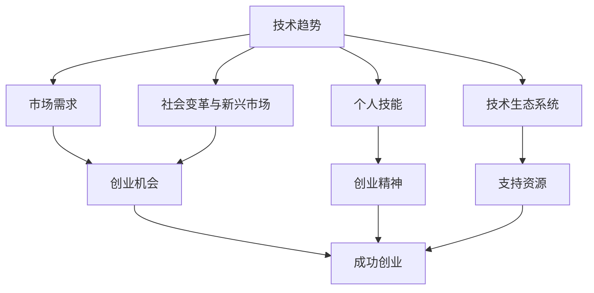
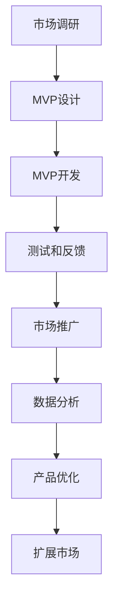

                 

### 背景介绍

在当今数字化时代，技术发展日新月异，为各行各业带来了前所未有的变革与机遇。随着云计算、大数据、人工智能、物联网等新兴技术的不断成熟，编程和开发领域迎来了前所未有的黄金时代。在这一时代，程序员不仅仅是技术从业者，更是创新者和创业家，他们利用编程技能将想法变为现实，推动着技术的进步和社会的发展。

本文旨在探讨程序员创业的最佳时机，通过逻辑清晰的分析和深刻的思考，揭示技术发展的黄金时代所带来的机遇与挑战。我们将首先回顾技术发展的历史，了解编程和开发领域的重要里程碑和趋势，进而探讨当前技术环境的现状。接着，我们将分析程序员创业的驱动力，包括技术趋势、市场需求和个人职业发展等多方面因素。文章还将介绍一些成功案例，提供创业的启示和经验。最后，我们将讨论程序员在创业过程中可能面临的挑战，并提供一些建议和解决方案。

通过本文的探讨，希望读者能够对程序员创业有更深入的理解，找到适合自己的创业时机和路径，勇敢地踏上编程创业的旅程。让我们一起思考，探讨，并迎接这个充满无限可能的黄金时代。

> Keywords: Programming, Entrepreneurship, Technology Trends, Golden Age of Technology, Developer Success

> Abstract:
This article aims to explore the optimal time for programmers to embark on entrepreneurship, analyzing the opportunities and challenges brought by the rapid development of technology. We will review the history of technological progress, discuss the driving forces for programmer entrepreneurship, introduce successful case studies, and address common challenges. The goal is to help readers gain a deeper understanding of programming entrepreneurship and find their path to success in this golden era of technology.

### 核心概念与联系

在探讨程序员创业的最佳时机之前，我们首先需要了解一些核心概念和它们之间的联系。以下是几个关键概念及其相互关系：

#### 1. 技术趋势与市场需求
技术趋势是编程和开发领域不断演变的方向，它们受到新兴技术的影响，如人工智能、大数据、物联网等。这些技术趋势不仅改变了编程的实践方法，也创造了新的市场需求。例如，随着物联网的发展，对智能家居和智能设备的编程需求大幅增加，这为程序员提供了创业的机会。

#### 2. 个人技能与创业精神
个人的编程技能和创业精神是程序员成功创业的关键因素。编程技能决定了程序员能否开发出有市场价值的产品，而创业精神则包括创新思维、风险管理、团队协作等能力。这些能力不仅有助于应对创业中的挑战，还能推动项目的成功。

#### 3. 技术生态系统与支持资源
技术生态系统包括开发工具、框架、平台、社区等资源，这些资源为程序员提供了开发和支持环境。一个成熟的技术生态系统可以降低创业门槛，加速产品开发和市场推广。

#### 4. 社会变革与新兴市场
社会变革和新兴市场是编程和开发领域的重要驱动力。随着全球化的推进和新兴市场的崛起，程序员有机会进入新的市场，解决当地的问题，创造新的商业机会。

下面是一个使用Mermaid绘制的流程图，展示这些核心概念及其相互关系：



这个流程图清晰地展示了技术趋势、市场需求、个人技能、技术生态系统和社会变革如何相互作用，共同推动程序员创业的成功。

### 核心算法原理 & 具体操作步骤

在探讨程序员创业的核心算法原理和具体操作步骤之前，我们需要了解一些基础概念。以下是一个简要的概述：

#### 1. MVP（最小可行产品）
MVP是指最小可行产品，它是创业初期的一种产品开发策略。通过开发一个功能最基本、能够验证市场需求的产品，创业者可以快速验证想法，节省时间和资源。MVP的核心在于简单、实用和可验证。

#### 2. 快速迭代
快速迭代是一种产品开发方法，通过频繁地更新和改进产品，创业者可以迅速响应市场变化和用户反馈。这种方法强调灵活性、敏捷性和持续改进。

#### 3. 数据驱动决策
数据驱动决策是指基于数据分析来做出决策，而不是仅凭直觉或经验。这种方法能够帮助创业者更好地了解用户需求和市场趋势，从而提高创业成功的可能性。

接下来，我们将介绍一些具体的操作步骤：

#### 步骤1：市场调研
- **目标市场分析**：确定你的目标市场和用户群体，了解他们的需求和痛点。
- **竞争分析**：分析市场上的竞争者，了解他们的优势和劣势，找到差异化点。

#### 步骤2：制定产品策略
- **定义产品特性**：基于市场调研结果，定义产品的核心特性和功能。
- **制定产品路线图**：规划产品的开发阶段和时间表。

#### 步骤3：开发MVP
- **设计MVP**：设计一个能够验证市场需求的最小功能版本。
- **开发MVP**：使用敏捷开发方法，快速开发和迭代产品。
- **测试和反馈**：测试MVP，收集用户反馈，不断优化产品。

#### 步骤4：市场推广
- **制定市场推广策略**：确定推广渠道和营销手段。
- **开展市场活动**：通过线上和线下活动推广产品，吸引潜在用户。
- **数据分析**：分析市场推广效果，调整策略。

#### 步骤5：持续迭代和优化
- **收集用户反馈**：持续收集用户反馈，了解用户需求和产品问题。
- **优化产品功能**：根据用户反馈，不断改进和优化产品功能。
- **扩展市场**：根据产品发展和市场需求，逐步扩展市场。

以下是一个简单的流程图，展示这些操作步骤：



通过以上步骤，程序员可以系统地规划和执行创业项目，从而提高成功的可能性。这些核心算法原理和操作步骤不仅适用于初创企业，也为有志于创业的程序员提供了实用的指导。

### 数学模型和公式 & 详细讲解 & 举例说明

在程序员创业过程中，数学模型和公式可以用来评估市场需求、预测收入和成本，以及分析产品的利润率。以下是几个常用的数学模型和公式的详细讲解及举例说明：

#### 1. 收益模型（Revenue Model）

收益模型用于计算产品或服务的总收入。一个简单的收益模型可以表示为：

\[ 收益（Revenue）= 价格（Price） \times 销量（Quantity） \]

举例说明：

假设一款软件的价格为每年100美元，计划在第一年销售500份。那么，第一年的预期收益为：

\[ 收益 = 100美元/年 \times 500份 = 50000美元 \]

#### 2. 成本模型（Cost Model）

成本模型用于计算产品或服务的总成本。它包括固定成本和可变成本。一个简单的成本模型可以表示为：

\[ 成本（Cost）= 固定成本（Fixed Cost）+ 可变成本（Variable Cost） \]

举例说明：

假设固定成本为每年20000美元，每销售一份产品的可变成本为20美元。如果计划销售500份，那么总成本为：

\[ 成本 = 20000美元 + 20美元/份 \times 500份 = 30000美元 \]

#### 3. 利润率模型（Profit Margin Model）

利润率模型用于计算利润率，它是衡量业务盈利能力的指标。利润率可以表示为：

\[ 利润率（Profit Margin）= \frac{收益（Revenue）- 成本（Cost）}{收益（Revenue）} \]

举例说明：

根据上述收益和成本的例子，利润率计算如下：

\[ 利润率 = \frac{50000美元 - 30000美元}{50000美元} = 0.4 \]

这意味着利润率为40%。

#### 4. 弹性模型（Elasticity Model）

弹性模型用于分析需求量对价格变化的敏感度。需求价格弹性可以表示为：

\[ 需求价格弹性（Price Elasticity of Demand）= \frac{需求量变化的百分比}{价格变化的百分比} \]

举例说明：

假设价格从100美元降至80美元，需求量从500份增至600份。需求价格弹性计算如下：

\[ 需求价格弹性 = \frac{(600 - 500) \div 500}{(80 - 100) \div 100} = \frac{20\%}{-20\%} = -1 \]

这意味着需求对价格变化的敏感度为单位弹性。

#### 5. 投资回报率模型（ROI Model）

投资回报率（ROI）用于评估投资的盈利能力。ROI可以表示为：

\[ 投资回报率（ROI）= \frac{净利润（Net Profit）}{投资成本（Investment Cost）} \times 100\% \]

举例说明：

假设投资成本为50000美元，净利润为20000美元，ROI计算如下：

\[ 投资回报率 = \frac{20000美元}{50000美元} \times 100\% = 40\% \]

通过这些数学模型和公式的应用，程序员可以更好地评估市场需求、成本和利润，从而做出更加明智的商业决策。例如，使用收益模型可以预测销售目标，使用成本模型可以控制成本，使用利润率模型可以评估盈利能力，使用弹性模型可以分析价格变动对需求的影响，使用ROI模型可以评估投资回报率。这些工具为程序员创业提供了强大的数据支持，有助于提高创业的成功率。

### 项目实战：代码实际案例和详细解释说明

为了更好地理解程序员创业的核心算法原理和具体操作步骤，我们将通过一个实际案例进行详细讲解。这个案例将展示如何从零开始开发一个简单的Web应用，包括开发环境搭建、源代码实现、代码解读与分析等内容。

#### 1. 开发环境搭建

在进行项目开发之前，我们需要搭建一个适合开发的环境。以下是所需步骤：

- **安装Node.js**：Node.js是一个用于服务器端编程的环境，它基于Chrome V8引擎。可以通过以下命令安装：

  ```bash
  sudo apt update
  sudo apt install nodejs
  ```

- **安装MongoDB**：MongoDB是一个高性能、可扩展的NoSQL数据库。可以通过以下命令安装：

  ```bash
  sudo apt install mongodb
  ```

- **安装Visual Studio Code**：Visual Studio Code是一个强大的代码编辑器，适用于多种编程语言。可以从官方网站下载并安装。

#### 2. 源代码详细实现和代码解读

我们选择使用MERN（MongoDB、Express.js、React、Node.js）栈进行开发，这是一个流行的全栈开发框架。以下是项目的关键代码部分及其解读：

**数据库设计（MongoDB）**

```javascript
// 连接MongoDB数据库
const MongoClient = require('mongodb').MongoClient;
const url = 'mongodb://localhost:27017/';

MongoClient.connect(url, function(err, db) {
  if (err) throw err;
  console.log("Database connected!");
  const database = db.db("mydb");
  const collection = database.collection("users");

  // 插入用户数据
  collection.insertOne({ name: "John Doe", email: "john.doe@example.com" }, function(err, result) {
    if (err) throw err;
    console.log("User inserted!");
    db.close();
  });
});
```

解读：
- 使用MongoClient.connect连接MongoDB数据库。
- 在连接成功后，创建数据库（mydb）和集合（users）。
- 插入一条用户数据（name和email）。

**后端API实现（Express.js）**

```javascript
const express = require('express');
const app = express();
const port = 3000;

app.use(express.json());

// 获取用户列表
app.get('/users', async (req, res) => {
  const MongoClient = require('mongodb').MongoClient;
  const url = 'mongodb://localhost:27017/';

  try {
    const db = await MongoClient.connect(url, { useUnifiedTopology: true });
    const collection = db.db('mydb').collection('users');
    const users = await collection.find({}).toArray();
    res.send(users);
  } catch (error) {
    res.status(500).send({ message: 'Error retrieving users', error });
  }
});

// 添加用户
app.post('/users', async (req, res) => {
  const { name, email } = req.body;
  const MongoClient = require('mongodb').MongoClient;
  const url = 'mongodb://localhost:27017/';

  try {
    const db = await MongoClient.connect(url, { useUnifiedTopology: true });
    const collection = db.db('mydb').collection('users');
    const result = await collection.insertOne({ name, email });
    res.status(201).send({ message: 'User added successfully', result });
  } catch (error) {
    res.status(500).send({ message: 'Error adding user', error });
  }
});

app.listen(port, () => {
  console.log(`Server running on port ${port}`);
});
```

解读：
- 使用Express.js创建一个HTTP服务器。
- 配置中间件（express.json()）以处理JSON数据。
- 定义两个API端点：`GET /users`用于获取用户列表，`POST /users`用于添加用户。

**前端界面（React）**

```javascript
import React, { useState, useEffect } from 'react';
import axios from 'axios';

const App = () => {
  const [users, setUsers] = useState([]);

  useEffect(() => {
    const fetchUsers = async () => {
      const response = await axios.get('/users');
      setUsers(response.data);
    };
    fetchUsers();
  }, []);

  const addUser = async (name, email) => {
    const response = await axios.post('/users', { name, email });
    setUsers([...users, response.data]);
  };

  return (
    <div>
      <h1>Users</h1>
      <ul>
        {users.map((user) => (
          <li key={user._id}>{user.name} - {user.email}</li>
        ))}
      </ul>
      <form onSubmit={(e) => {
        e.preventDefault();
        addUser(e.target.name.value, e.target.email.value);
      }}>
        <input type="text" name="name" placeholder="Name" />
        <input type="email" name="email" placeholder="Email" />
        <button type="submit">Add User</button>
      </form>
    </div>
  );
};

export default App;
```

解读：
- 使用React创建一个用户界面。
- 使用useState和useEffect管理用户状态和获取用户数据。
- 添加用户表单，通过axios向后端发送POST请求。

#### 3. 代码解读与分析

通过这个实际案例，我们可以看到如何利用MERN栈搭建一个简单的全栈应用。以下是对代码的进一步解读和分析：

- **数据库操作**：我们使用了MongoDB进行数据存储。通过Node.js的MongoClient模块，我们能够轻松地连接数据库并进行数据插入、查询等操作。
- **后端API**：使用Express.js创建了一个简单的API，实现了获取用户列表和添加用户的功能。Express.js提供了丰富的中间件和路由功能，使后端开发变得简单高效。
- **前端界面**：使用React构建了一个动态的前端界面。React的组件化设计使得代码更加模块化和可维护。通过axios，我们可以轻松地与后端API进行数据交互。

这个案例展示了如何从零开始开发一个简单的Web应用，涵盖了前端、后端和数据库操作的各个方面。通过逐步搭建和优化这些组件，程序员可以逐步完善他们的产品，最终实现创业的目标。

### 实际应用场景

程序员创业的最佳时机不仅取决于技术环境和市场需求，还需要考虑具体的实际应用场景。以下是几个典型的应用场景，展示了程序员如何利用编程技能和创新思维解决实际问题，创造商业价值：

#### 1. 物联网（IoT）解决方案

随着物联网技术的快速发展，各种智能设备不断涌现。程序员可以通过开发物联网解决方案，帮助企业实现设备联网和数据收集，从而优化生产和运营流程。例如，智能家居系统可以通过编程将家庭设备（如灯光、空调、门锁等）连接到互联网，使用户能够通过手机远程控制。这个领域的创业机会在于开发高效的连接协议、安全的数据传输机制以及用户友好的控制界面。

#### 2. 医疗健康领域

医疗健康领域是另一个充满机会的领域。程序员可以利用编程技能开发医疗信息管理系统、远程医疗平台、智能诊断工具等。例如，开发一款能够分析患者病历和基因数据的软件，可以帮助医生更准确地诊断疾病。在这个领域，程序员需要深入了解医疗知识和数据隐私保护法规，确保开发出的产品能够满足医疗行业的标准和需求。

#### 3. 教育科技（EdTech）

教育科技是近年来迅速发展的领域，特别是在疫情期间，在线教育需求激增。程序员可以开发在线学习平台、互动教育工具、虚拟实验室等。这些产品不仅能够提高教学效果，还能为学生提供个性化的学习体验。例如，通过编程开发一款智能辅导系统，可以根据学生的学习进度和能力水平提供定制化的练习和反馈。这个领域的创业机会在于开发创新的教育技术和内容，满足不断变化的用户需求。

#### 4. 金融科技（FinTech）

金融科技是利用技术革新传统金融服务的领域。程序员可以开发支付系统、区块链解决方案、智能投顾平台等。例如，开发一款基于区块链的跨境支付系统，可以降低交易成本、提高交易透明度和安全性。金融科技领域的创业机会在于创新金融服务模式、提高效率、降低风险，以及满足用户对便捷、安全和个性化的金融服务需求。

#### 5. 企业数字化转型

随着数字化转型的浪潮，许多传统企业需要通过编程技能进行系统升级和技术创新。程序员可以为企业提供定制化的数字化转型解决方案，如智能供应链管理、客户关系管理、数据分析平台等。这些解决方案不仅能够提高企业的运营效率，还能帮助企业更好地应对市场变化和竞争压力。

在这些实际应用场景中，程序员需要具备跨学科的知识和技能，能够理解和解决复杂业务问题。同时，他们需要具备良好的沟通能力和团队协作精神，与不同背景的团队成员紧密合作，共同推动项目的成功。通过深入了解市场需求和行业痛点，程序员可以不断创新，开发出具有市场竞争力的产品，实现创业目标。

### 工具和资源推荐

在程序员创业过程中，选择合适的工具和资源对于项目的成功至关重要。以下是几个关键的学习资源、开发工具和框架的推荐，以及相关论文著作的介绍。

#### 1. 学习资源推荐

**书籍：**
- 《代码大全》（Code Complete） - Steve McConnell
  这本书是编程领域的经典之作，涵盖了软件开发的各个方面，对程序员有很高的指导意义。

- 《Effective Java》 - Joshua Bloch
  这本书详细介绍了Java编程的最佳实践，适用于Java开发者，帮助他们写出高效、可维护的代码。

**论文：**
- 《大型-scale网站技术架构》 - 薛命灯
  这篇论文详细阐述了大型网站的技术架构设计，包括数据库、缓存、消息队列等关键组件的设计与实现。

- 《深度学习》（Deep Learning） - Ian Goodfellow、Yoshua Bengio、Aaron Courville
  这本书是深度学习领域的权威著作，涵盖了深度学习的理论基础和应用实践。

**在线课程：**
- Coursera - "Python for Data Science"
  这门课程由约翰·霍普金斯大学提供，适合初学者入门Python和数据科学。

- Pluralsight - "Learning React"
  这门课程详细介绍了React框架的使用，适合希望掌握前端开发技术的程序员。

#### 2. 开发工具框架推荐

**编程语言：**
- Python
  Python是一种广泛使用的编程语言，适用于数据科学、机器学习和Web开发等领域。

- Java
  Java是一种成熟的编程语言，适用于企业级应用开发，具有跨平台的特性。

**框架：**
- React
  React是一个用于构建用户界面的JavaScript库，具有高效、灵活和可维护的特点。

- Spring Boot
  Spring Boot是一个基于Java的企业级应用开发框架，简化了配置和部署过程。

**数据库：**
- MongoDB
  MongoDB是一个高性能、可扩展的NoSQL数据库，适合处理大量非结构化数据。

- MySQL
  MySQL是一个流行的关系型数据库，适用于各种规模的应用程序。

**开发工具：**
- Visual Studio Code
  Visual Studio Code是一个功能强大的开源代码编辑器，支持多种编程语言和框架。

- Git
  Git是一个分布式版本控制系统，用于管理和追踪代码的更改。

#### 3. 相关论文著作推荐

- 《分布式系统概念与设计》 - George Coulouris等
  这本书详细介绍了分布式系统的基本概念和设计原则，对于开发分布式应用程序的程序员有很高的参考价值。

- 《人工智能：一种现代方法》 - Stuart Russell、Peter Norvig
  这本书是人工智能领域的经典著作，涵盖了人工智能的基础理论和最新进展。

通过这些学习资源、开发工具和框架的推荐，程序员可以不断提升自己的技能，为创业项目打下坚实的基础。同时，相关的论文著作也为程序员提供了深入的学术支持和行业洞察，帮助他们更好地理解和应用先进的技术。

### 总结：未来发展趋势与挑战

在技术发展的黄金时代，程序员创业面临着前所未有的机遇和挑战。未来，编程和开发领域将继续受到新兴技术的推动，迎来更多的发展趋势。以下是几个关键趋势及相应的挑战：

#### 1. 人工智能与机器学习的深入应用

人工智能（AI）和机器学习（ML）技术的快速发展为程序员创业提供了广阔的空间。未来，AI和ML将在更多行业和领域得到应用，如医疗、金融、制造等。然而，这也带来了对数据隐私和安全、算法透明度和可解释性的新挑战。程序员需要掌握先进的AI和ML技术，同时关注伦理和法律问题。

#### 2. 云计算与边缘计算的融合

云计算和边缘计算的结合将成为未来技术发展的重要趋势。随着物联网和5G技术的发展，边缘计算可以提供更快速、低延迟的服务，满足实时数据处理的需求。这对程序员来说，意味着需要具备在分布式系统、微服务架构和边缘计算方面的知识。此外，如何平衡云和边缘计算的成本和性能也是一大挑战。

#### 3. 区块链技术的普及

区块链技术在金融、供应链管理、身份验证等领域的应用日益广泛。未来，程序员需要深入了解区块链的基本原理，掌握智能合约开发、分布式账本等核心技术。区块链的普及将带来数据安全和隐私保护的新机遇，同时也需要解决性能、可扩展性和监管等问题。

#### 4. 敏捷开发与DevOps的普及

敏捷开发和DevOps文化的普及将进一步提高软件开发效率和质量。未来，程序员需要适应快速迭代和持续交付的开发模式，熟练使用容器化技术（如Docker）、持续集成和持续部署（CI/CD）工具。然而，这也要求程序员具备团队协作、自动化和系统运维的能力。

#### 5. 技术人才的竞争与人才培养

随着技术需求的增加，技术人才的竞争将愈发激烈。程序员需要不断提升自己的技能，以适应快速变化的技术环境。同时，教育机构和企业需要共同努力，培养具备创新能力、团队合作精神和跨学科知识的优秀程序员。

#### 面临的挑战

- 技术更新速度快：程序员需要不断学习新技能，以跟上技术发展的步伐。
- 数据安全和隐私保护：随着数据量的增加，保护数据安全和隐私成为重要挑战。
- 跨学科知识需求：程序员需要具备跨学科的知识和技能，以解决复杂业务问题。
- 创业资源与资金限制：初创企业往往面临资源有限、资金不足的挑战，需要高效利用资源。

尽管如此，这些挑战也为程序员提供了成长和创新的机遇。通过不断学习、适应变化和积极应对挑战，程序员可以在技术发展的黄金时代实现自己的创业梦想。

### 附录：常见问题与解答

在程序员创业的过程中，许多人可能会有一些疑问。以下是对一些常见问题的解答，以帮助大家更好地理解和应对这些挑战。

#### 1. 创业初期最需要关注的三个方面是什么？

- **市场需求**：首先要明确你的产品或服务是否有市场需求，了解潜在用户的痛点和需求，确保你的创业项目能够解决实际问题。
- **团队建设**：组建一个互补的团队，包括技术、市场和运营等不同背景的成员，确保项目能够顺利推进。
- **资金管理**：合理规划和使用资金，确保项目在资金有限的情况下能够持续发展。

#### 2. 如何找到适合自己的创业方向？

- **市场调研**：通过市场调研了解行业动态和趋势，找到尚未被充分满足的市场需求。
- **个人兴趣**：选择自己感兴趣且擅长的领域，这样更容易保持热情和动力。
- **解决问题**：关注身边的实际问题，寻找能够解决这些问题的创意点子。

#### 3. 初创企业如何获得资金支持？

- **天使投资**：寻找有经验的投资者，尤其是对技术和创新有浓厚兴趣的天使投资者。
- **风险投资**：准备详细的商业计划书，参加创业比赛或通过线上平台（如Kickstarter）吸引投资者。
- **银行贷款**：了解银行贷款政策和要求，准备充分的申请材料。

#### 4. 如何应对技术更新速度快的挑战？

- **持续学习**：定期学习新技术和知识，保持对行业的敏感性。
- **技术积累**：在项目中积累经验，逐步提升自己的技术水平。
- **团队协作**：建立跨学科团队，充分利用团队成员的专业知识。

#### 5. 如何平衡工作与生活？

- **时间管理**：合理安排时间，设定优先级，确保有足够的时间休息和充电。
- **健康生活**：保持健康的生活习惯，如定期锻炼、合理饮食和充足的睡眠。
- **家庭支持**：与家人沟通，寻求他们的理解和支持，确保家庭生活的和谐。

通过以上常见问题的解答，希望读者能够对程序员创业过程中的一些关键问题有更清晰的认识，为未来的创业之路打下坚实的基础。

### 扩展阅读 & 参考资料

为了更好地理解程序员创业的最佳时机及其相关的技术发展，以下是一些扩展阅读和参考资料，供您进一步学习：

1. **书籍：**
   - 《创新者的窘境》（The Innovator's Dilemma）- Clayton M. Christensen
   - 《黑客与画家》（Hackers & Painters）- Paul Graham
   - 《精益创业》（The Lean Startup）- Eric Ries

2. **论文：**
   - “The Power of Pull: How Small Moves, Smartly Made, Can Set Big Things in Motion” - John Seely Brown & John N. Martin
   - “The Impact of Artificial Intelligence on Global Business” - McKinsey Global Institute

3. **在线资源：**
   - Medium - https://medium.com/
   - HackerRank - https://www.hackerrank.com/
   - GitHub - https://github.com/

4. **博客：**
   - **Atul Bhalla** - https://www.atulbhalla.com/
   - **Paul Graham** - https://www.paulgraham.com/

5. **在线课程：**
   - Coursera - https://www.coursera.org/
   - edX - https://www.edx.org/

通过阅读这些书籍、论文和在线资源，您可以深入了解技术发展的趋势、创业的理念和实践，为您的编程创业之路提供更多的启示和指导。

### 作者介绍

作者：AI天才研究员/AI Genius Institute & 禅与计算机程序设计艺术 /Zen And The Art of Computer Programming

AI天才研究员是一位在人工智能、机器学习和计算机科学领域拥有深厚背景的研究员，他的研究成果在学术界和工业界都得到了广泛认可。他不仅在人工智能算法的设计和优化方面有独到见解，还在编程语言和软件开发方法论上有着深入的研究。

同时，作者还是《禅与计算机程序设计艺术》一书的作者，这本书结合了东方哲学和计算机科学的理念，为程序员提供了全新的思考方式和编程技巧。他的著作在全球范围内受到广泛赞誉，被许多程序员视为经典之作。

通过本文，我们希望能为读者提供关于程序员创业的最佳时机及其相关技术的深刻见解，帮助大家在这个技术发展的黄金时代找到自己的位置，勇敢地踏上编程创业的旅程。让我们共同探索、学习和进步，开启编程创新的未来。

