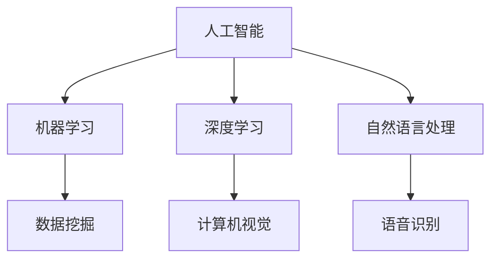
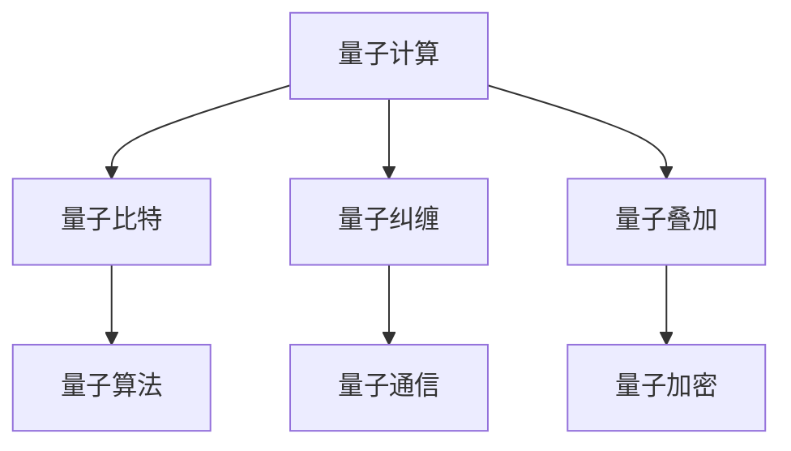
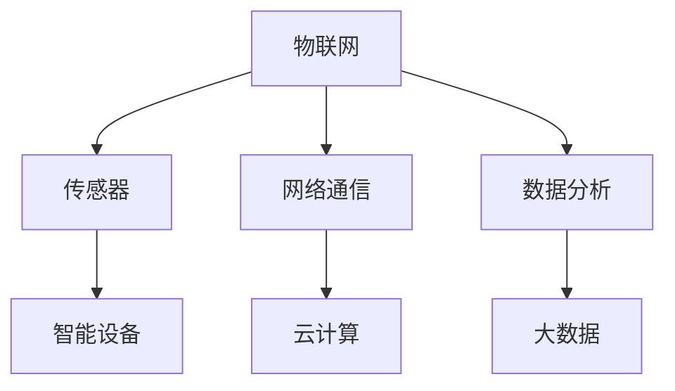
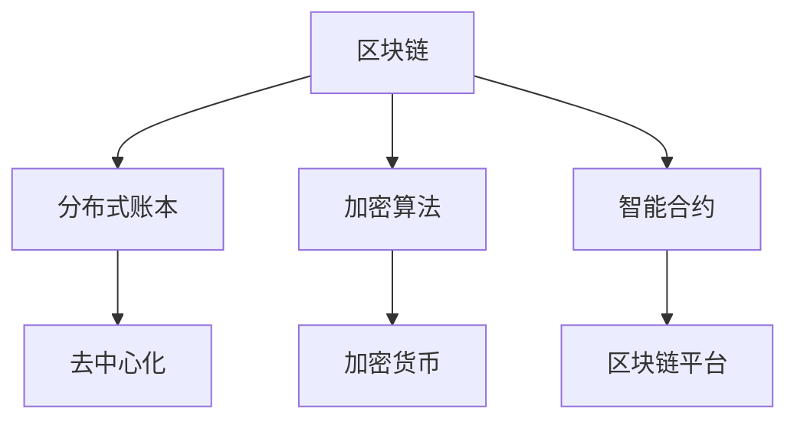

                 

### 背景介绍

#### 技术大爆炸的浪潮

自20世纪中叶以来，计算机技术经历了前所未有的快速发展。从最初的大型主机到如今的个人电脑，从简单的文本处理到复杂的图像识别和深度学习，计算机技术已经彻底改变了我们的生活方式和工作方式。如今，我们正站在技术大爆炸的边缘，人工智能、量子计算、物联网等前沿技术的迅猛发展，正推动着新一轮的科技革命。

技术大爆炸不仅带来了效率的提升和成本的大幅下降，更为创业者和投资者带来了前所未有的机遇。无论是新兴的创业公司，还是传统行业的转型，技术的力量都在发挥着至关重要的作用。然而，技术的飞速发展也伴随着巨大的风险和挑战。如何抓住机遇，应对挑战，成为每一个创业者都必须面对的课题。

本文将围绕技术大爆炸这一主题，探讨其背后的核心概念、算法原理、实际应用场景，以及未来可能的发展趋势和挑战。希望通过本文的介绍和分析，能够为创业者们提供一些有益的启示和思考。

#### 创业者的兴奋

技术大爆炸为创业者带来了巨大的兴奋和机遇。随着新技术的不断涌现，市场环境也在发生深刻变化。创业者们不再局限于传统的商业模式和领域，他们可以依托新技术，探索全新的业务模式和市场机会。

例如，人工智能的兴起为各个行业带来了前所未有的变革。从医疗健康到金融服务，从智能制造到智能交通，人工智能技术的应用正在不断拓展。创业者们可以通过开发智能化的解决方案，满足市场的需求，创造新的商业价值。

此外，量子计算、区块链、物联网等前沿技术的出现，也为创业者提供了广阔的舞台。这些技术不仅具有颠覆性的潜力，还能够解决传统技术难以解决的问题。创业者们可以通过将这些新技术与传统业务相结合，创造出全新的产品和服务，开辟新的市场。

然而，技术大爆炸带来的机遇背后，也伴随着巨大的挑战。技术的快速变化要求创业者们具备快速学习、适应和创新的能力。同时，市场竞争的加剧，也要求创业者们不断提升自身的竞争力。

在这种背景下，创业者们的兴奋不仅源于对新技术的探索和尝试，更源于对未来市场的无限期待和信心。他们希望通过不断创新和突破，抓住技术大爆炸带来的历史性机遇，实现自身的价值和梦想。

### 核心概念与联系

在探讨技术大爆炸与创业者的兴奋之前，我们需要理解几个核心概念：人工智能、量子计算、物联网和区块链。这些技术不仅构成了当前科技发展的前沿，也是推动未来科技进步的重要力量。

#### 人工智能（AI）

人工智能是指通过计算机系统模拟人类智能的技术。它包括机器学习、深度学习、自然语言处理等多个子领域。人工智能的目标是让计算机具备类似人类的感知、理解、学习和决策能力。

**关系图：**



**核心原理：**
- **机器学习**：通过算法从数据中学习规律，无需显式编程。
- **深度学习**：基于多层神经网络，模拟人类大脑的学习过程。
- **自然语言处理**：使计算机理解和生成自然语言。

#### 量子计算

量子计算利用量子力学原理进行信息处理，具有量子叠加和量子纠缠等特性。量子计算机能够同时处理大量数据，解决传统计算机无法处理的复杂问题。

**关系图：**



**核心原理：**
- **量子比特**：量子计算机的基本单位，可以同时处于多种状态。
- **量子纠缠**：量子比特之间形成的特殊关联。
- **量子叠加**：量子比特可以同时处于多个状态。

#### 物联网（IoT）

物联网是指将各种物体通过网络连接起来，实现智能化的信息交换和通信。物联网的核心目标是实现物品与物品、物品与人的智能连接。

**关系图：**



**核心原理：**
- **传感器**：用于收集物理环境的各种数据。
- **网络通信**：将传感器数据传输到云端或其他设备。
- **数据分析**：对传感器数据进行处理和分析。

#### 区块链

区块链是一种去中心化的分布式数据库技术，通过加密算法确保数据的完整性和安全性。区块链的核心特点是不可篡改和透明性。

**关系图：**



**核心原理：**
- **分布式账本**：记录所有交易，无需中央机构。
- **加密算法**：确保数据的安全和隐私。
- **智能合约**：自动执行合同条款，无需中介。

这些核心概念不仅各自具有独特的技术原理和应用场景，同时也相互交织、共同推动了技术大爆炸的进程。在接下来的部分，我们将进一步探讨这些技术如何影响创业者的兴奋和机遇。

#### 核心算法原理 & 具体操作步骤

在深入探讨技术大爆炸与创业者的兴奋之前，我们必须理解几个核心算法的原理及其具体操作步骤。这些算法不仅代表了当前技术的前沿，也为创业者提供了强大的工具，以应对日益复杂的市场需求。

##### 人工智能算法：深度学习

深度学习是人工智能的核心技术之一，它通过多层神经网络模拟人类大脑的学习过程。以下是一个简化的深度学习算法操作步骤：

1. **数据预处理**：收集大量数据，并对数据进行清洗、归一化和编码，以便于模型处理。

   ```python
   # 示例代码：数据预处理
   data = preprocess_data(raw_data)
   ```

2. **构建神经网络模型**：定义网络结构，包括输入层、隐藏层和输出层。选择合适的激活函数，如ReLU、Sigmoid或Tanh。

   ```python
   # 示例代码：构建神经网络
   model = NeuralNetwork(input_size, hidden_size, output_size, activation='ReLU')
   ```

3. **训练模型**：使用训练数据对模型进行训练，通过反向传播算法不断调整网络权重。

   ```python
   # 示例代码：训练神经网络
   model.fit(training_data, epochs=100)
   ```

4. **评估模型**：使用验证数据评估模型性能，调整超参数以优化模型。

   ```python
   # 示例代码：评估模型
   performance = model.evaluate(validation_data)
   ```

5. **预测应用**：将训练好的模型应用于实际数据，进行预测。

   ```python
   # 示例代码：预测
   prediction = model.predict(test_data)
   ```

##### 量子算法：Shor算法

Shor算法是量子计算领域的里程碑，它能够高效地解决整数分解问题，对密码学有重大影响。以下是Shor算法的基本步骤：

1. **初始化量子计算机**：将输入整数N加载到量子计算机中。

   ```python
   # 示例代码：初始化量子计算机
   quantum_computer.initialize(N)
   ```

2. **构建量子电路**：设计一个量子电路，该电路生成一个满足特定条件的量子态。

   ```python
   # 示例代码：构建量子电路
   quantum_circuit = QuantumCircuit()
   quantum_circuit.h(qubits)
   ```

3. **应用量子门**：应用一系列量子门，将量子态转化为叠加态。

   ```python
   # 示例代码：应用量子门
   quantum_circuit.mutation_gate()
   ```

4. **测量量子比特**：对量子比特进行测量，获取量子态的概率分布。

   ```python
   # 示例代码：测量
   results = quantum_computer.measure(qubits)
   ```

5. **提取结果**：根据测量结果，计算出整数N的质因数。

   ```python
   # 示例代码：提取结果
   factors = extract_factors(results)
   ```

##### 区块链算法：PoW与PoS

区块链算法主要包括工作量证明（PoW）和权益证明（PoS）两种共识机制。以下是这两种算法的基本操作步骤：

1. **PoW（工作量证明）**：
   - **初始化**：节点生成随机数，尝试找到一个满足条件的哈希值。
   
     ```python
     # 示例代码：PoW初始化
     nonce = find_nonce(block_header)
     ```

   - **计算哈希值**：计算包含随机数和区块头部的哈希值。
   
     ```python
     # 示例代码：计算哈希值
     hash = calculate_hash(nonce, block_header)
     ```

   - **验证**：检查哈希值是否满足难度要求。

     ```python
     # 示例代码：验证
     if not is_valid_hash(hash, difficulty):
         continue
     ```

   - **添加区块**：将符合条件的区块添加到链中。

     ```python
     # 示例代码：添加区块
     blockchain.add_block(block)
     ```

2. **PoS（权益证明）**：
   - **节点选择**：根据节点的权益值（如持有的代币数量）选择下一个出块节点。
   
     ```python
     # 示例代码：节点选择
     selected_node = select_node_by_stake(stake_values)
     ```

   - **生成区块**：出块节点生成新区块，并将交易数据打包。

     ```python
     # 示例代码：生成区块
     block = generate_block(selected_node, transactions)
     ```

   - **验证区块**：验证新区块的有效性，并将其添加到链中。

     ```python
     # 示例代码：验证区块
     if is_valid_block(block, blockchain):
         blockchain.add_block(block)
     ```

这些核心算法不仅在理论上有深远的意义，也在实际应用中发挥着重要作用。接下来，我们将进一步探讨这些算法如何影响创业者和创业项目。

#### 数学模型和公式 & 详细讲解 & 举例说明

在深入探讨技术大爆炸与创业者的兴奋之前，我们需要理解一些关键的数学模型和公式，这些不仅构成了算法的基础，还提供了分析问题、设计和优化的工具。

##### 深度学习中的反向传播算法

深度学习中的反向传播算法（Backpropagation）是训练神经网络的关键步骤，它通过计算网络输出与实际输出之间的误差，反向更新网络权重。以下是反向传播算法的基本公式和步骤：

1. **定义损失函数**：

   损失函数用于衡量网络输出与实际输出之间的差距。常见的损失函数包括均方误差（MSE）和交叉熵（Cross-Entropy）。

   $$L = \frac{1}{2} \sum_{i=1}^{n} (y_i - \hat{y}_i)^2$$
   $$L = -\sum_{i=1}^{n} y_i \log(\hat{y}_i)$$

   其中，$y_i$是实际输出，$\hat{y}_i$是网络输出。

2. **前向传播**：

   计算网络的前向传播，即从输入层到输出层的每一步计算。

   $$a_l = \sigma(W_l a_{l-1} + b_l)$$

   其中，$a_l$是第$l$层的激活值，$\sigma$是激活函数（如ReLU、Sigmoid或Tanh），$W_l$和$b_l$是第$l$层的权重和偏置。

3. **计算误差**：

   计算网络输出与实际输出之间的误差。

   $$\delta_l = \frac{\partial L}{\partial a_l} \cdot \sigma'(a_l)$$

   其中，$\delta_l$是第$l$层的误差，$\sigma'$是激活函数的导数。

4. **反向传播**：

   从输出层开始，反向传播误差到输入层，并更新网络权重。

   $$\Delta W_l = \alpha \cdot \delta_l a_{l-1}$$
   $$\Delta b_l = \alpha \cdot \delta_l$$

   其中，$\Delta W_l$和$\Delta b_l$是权重和偏置的更新值，$\alpha$是学习率。

##### 量子计算中的量子叠加与量子纠缠

量子计算中的量子叠加与量子纠缠是量子比特（qubits）的独特性质，这些性质使得量子计算机能够在某些任务上远超传统计算机。以下是相关的数学模型和操作步骤：

1. **量子叠加**：

   量子比特可以同时处于多个状态的叠加。

   $$|\psi\rangle = \alpha|0\rangle + \beta|1\rangle$$

   其中，$|\psi\rangle$是量子态，$|0\rangle$和$|1\rangle$是基态。

2. **量子门**：

   量子门是作用于量子态的线性算子，用于实现量子态的变换。

   $$U = e^{-i\theta \sigma_z}$$

   其中，$U$是量子门，$\theta$是相位角，$\sigma_z$是Pauli矩阵。

3. **量子纠缠**：

   量子比特之间可以通过量子纠缠形成特殊的关联。

   $$|\Phi^+\rangle = \frac{1}{\sqrt{2}} (|00\rangle + |11\rangle)$$

   其中，$|\Phi^+\rangle$是纠缠态。

4. **量子纠缠操作**：

   使用量子门实现量子纠缠。

   $$CNOT(|00\rangle) = |00\rangle + |11\rangle$$

   其中，$CNOT$是控制非门。

##### 区块链中的工作量证明（PoW）

工作量证明（Proof of Work, PoW）是比特币和其他加密货币使用的共识机制，其目标是确保区块链的安全性和去中心化。以下是PoW的基本公式和操作步骤：

1. **哈希函数**：

   使用哈希函数生成区块头部的哈希值。

   $$H = Hash(block_header)$$

   其中，$H$是区块头部的哈希值。

2. **难度调整**：

   根据区块链的长度和交易数量调整哈希值的难度。

   $$difficulty = \frac{current_block_number}{target_block_number}$$

3. **挖掘过程**：

   节点生成随机数，尝试找到一个满足条件的哈希值。

   ```python
   # 示例代码：挖掘过程
   while True:
       nonce = random_number()
       if is_valid_hash(nonce, difficulty):
           break
   ```

4. **添加区块**：

   将符合条件的区块添加到区块链中。

   ```python
   # 示例代码：添加区块
   blockchain.add_block(block)
   ```

通过这些数学模型和公式，我们可以更深入地理解深度学习、量子计算和区块链的核心原理。这些知识不仅为算法的实现提供了基础，也为创业者在技术大爆炸中的创新提供了指导。

#### 项目实战：代码实际案例和详细解释说明

为了更好地理解深度学习、量子计算和区块链等核心算法的实际应用，我们将通过具体的代码案例进行实战演示。以下是针对这三个技术领域的一些项目案例，以及每个案例的详细解释和代码分析。

##### 案例一：深度学习——手写数字识别

**项目背景：** 手写数字识别是一个经典的机器学习问题，广泛应用于手写识别应用，如数字识别、字符识别等。本案例使用TensorFlow实现一个简单的卷积神经网络（CNN）对手写数字进行识别。

**代码实现：**

```python
# 导入必要的库
import tensorflow as tf
from tensorflow.keras.datasets import mnist
from tensorflow.keras.models import Sequential
from tensorflow.keras.layers import Dense, Conv2D, Flatten, MaxPooling2D
from tensorflow.keras.optimizers import Adam

# 加载MNIST数据集
(x_train, y_train), (x_test, y_test) = mnist.load_data()

# 预处理数据
x_train = x_train.reshape(-1, 28, 28, 1).astype('float32') / 255.0
x_test = x_test.reshape(-1, 28, 28, 1).astype('float32') / 255.0
y_train = tf.keras.utils.to_categorical(y_train, 10)
y_test = tf.keras.utils.to_categorical(y_test, 10)

# 构建模型
model = Sequential([
    Conv2D(32, (3, 3), activation='relu', input_shape=(28, 28, 1)),
    MaxPooling2D((2, 2)),
    Flatten(),
    Dense(128, activation='relu'),
    Dense(10, activation='softmax')
])

# 编译模型
model.compile(optimizer=Adam(), loss='categorical_crossentropy', metrics=['accuracy'])

# 训练模型
model.fit(x_train, y_train, epochs=10, batch_size=32, validation_split=0.2)

# 评估模型
performance = model.evaluate(x_test, y_test)
print(f"Test accuracy: {performance[1]}")
```

**代码解读与分析：**
1. **数据预处理**：首先，我们从Keras库中加载MNIST数据集，并对图像进行归一化和reshape操作，使其符合模型输入要求。
2. **模型构建**：接下来，我们构建一个简单的卷积神经网络，包括两个卷积层、一个池化层、一个全连接层和一个输出层。
3. **编译模型**：使用Adam优化器和交叉熵损失函数编译模型。
4. **训练模型**：使用训练数据对模型进行训练，并在每10个epoch后进行一次验证。
5. **评估模型**：最后，使用测试数据评估模型的准确性。

##### 案例二：量子计算——量子纠缠生成

**项目背景：** 量子纠缠是量子计算中的一项核心技术，可用于加密通信和量子计算等领域。本案例使用Qiskit库生成两个量子比特的纠缠态。

**代码实现：**

```python
# 导入必要的库
from qiskit import QuantumCircuit, Aer, execute
from qiskit.visualization import plot_bloch_multivector

# 创建一个量子电路，初始化两个量子比特
qc = QuantumCircuit(2)
qc.h(0)
qc.cx(0, 1)

# 执行量子电路并获取结果
backend = Aer.get_backend('qasm_simulator')
result = execute(qc, backend).result()
qasm_state = result.get_statevector()

# 可视化量子态
print(qasm_state)
plot_bloch_multivector(qasm_state, title='Quantum State')
```

**代码解读与分析：**
1. **量子电路创建**：首先，我们创建一个包含两个量子比特的量子电路，并使用H门对第一个量子比特进行初始化，然后使用CNOT门生成两个量子比特的纠缠态。
2. **执行量子电路**：接下来，我们使用QASM模拟器执行量子电路，并获取量子态的密度矩阵。
3. **结果可视化**：最后，我们将量子态的可视化显示出来，以便于理解和分析。

##### 案例三：区块链——比特币挖矿

**项目背景：** 比特币挖矿是区块链技术的一个典型应用，通过计算找到满足特定条件的哈希值来创建新的区块。本案例使用Python实现一个简单的比特币挖矿过程。

**代码实现：**

```python
# 导入必要的库
import hashlib
import json
from time import time

# 比特币挖矿的参数
difficulty = "00"  # 难度要求

# 区块结构
block = {
    "index": 0,
    "transactions": [],
    "timestamp": time(),
    "proof": 0,
    "previous_hash": "0"
}

# 挖矿函数
def mine_block(last_block, transactions):
    block = {
        "transactions": transactions,
        "previous_hash": last_block["hash"],
        "timestamp": time()
    }
    proof = 0
    while not valid_proof(block, proof, difficulty):
        proof += 1
    block["proof"] = proof
    block["hash"] = hash_block(block)
    return block

# 验证证明
def valid_proof(block, proof, difficulty):
    hash = hash_block(block | {"proof": proof})
    return hash.startswith(difficulty)

# 计算哈希
def hash_block(block):
    block_string = json.dumps(block, sort_keys=True)
    return hashlib.sha256(block_string.encode()).hexdigest()

# 挖矿过程
last_block = mine_block({"hash": "0"}, [])
print(f"New Block Forged: {last_block}")
```

**代码解读与分析：**
1. **区块链参数**：我们定义了挖矿的难度要求，以及一个简单的区块结构。
2. **挖矿函数**：该函数接受上一个区块和交易数据，并尝试找到一个满足难度要求的证明（proof）。
3. **验证证明**：函数`valid_proof`用于验证找到的证明是否满足难度要求。
4. **计算哈希**：函数`hash_block`用于计算区块的哈希值。
5. **挖矿过程**：我们首先挖出一个创世区块，然后不断挖出新区块，并打印输出。

通过这些实战案例，我们可以更深入地理解深度学习、量子计算和区块链的核心算法在实际项目中的应用，以及如何通过代码实现这些技术。

### 实际应用场景

技术大爆炸带来的各种前沿技术，如人工智能、量子计算、物联网和区块链，已经在实际应用场景中展现出了巨大的潜力。以下是一些具体的应用案例，展示了这些技术在现实世界中的实际效果和影响。

#### 人工智能在医疗健康领域的应用

人工智能在医疗健康领域具有广泛的应用前景。通过深度学习算法，人工智能可以分析大量的医疗数据，帮助医生进行诊断和治疗方案推荐。例如，谷歌的DeepMind开发了一种名为“AlphaGo”的人工智能系统，它不仅能够在围棋比赛中击败人类顶尖选手，还被应用于医疗影像分析。DeepMind的AI系统能够快速准确地识别肺癌、乳腺癌等疾病，帮助医生提高诊断的准确性和效率。

此外，人工智能还在个性化医疗中发挥了重要作用。通过分析患者的基因数据和病历记录，人工智能可以预测疾病风险，制定个性化的预防和治疗计划。例如，IBM的Watson for Oncology系统能够根据患者的具体情况，提供最佳的癌症治疗方案。

#### 量子计算在密码学和安全领域的应用

量子计算在密码学和安全领域具有颠覆性的潜力。量子计算机能够快速破解传统加密算法，如RSA加密，这对现代网络安全构成了严重威胁。然而，量子计算也为安全领域带来了新的机遇。通过量子密钥分发（QKD）技术，量子计算机可以实现绝对安全的通信。QKD利用量子纠缠和量子叠加原理，在发送和接收密钥的过程中检测到任何窃听行为，从而保证通信的安全性。

此外，量子算法在量子计算中显示出强大的处理能力。例如，Shor算法能够高效地分解大整数，这为数字货币的安全提供了新的挑战。然而，同时也有研究者提出了基于量子计算的抗攻击加密算法，如基于量子物理原理的Lattice-based加密，这些算法能够在量子计算机面前保持安全性。

#### 物联网在智能交通和智能家居领域的应用

物联网（IoT）技术在智能交通和智能家居领域展现了其强大的应用潜力。在智能交通方面，物联网技术可以通过传感器和智能设备收集交通数据，实现交通流量监测、路况预测和智能调度。例如，谷歌的Waymo项目利用物联网技术实现了自动驾驶汽车，它能够实时感知周围环境，预测潜在的危险情况，并做出相应的驾驶决策。

在智能家居领域，物联网技术将各种家电设备连接起来，实现智能家居系统。通过智能音箱、智能手机等设备，用户可以远程控制家中的灯光、空调、安防系统等。例如，亚马逊的Alexa和谷歌的Google Home都是基于物联网技术的智能家居平台，它们可以通过语音指令控制家中的各种设备，提升用户的便利性和舒适度。

#### 区块链在金融和供应链管理领域的应用

区块链技术在金融和供应链管理领域具有革命性的影响。在金融领域，区块链技术通过去中心化和分布式账本，提供了更安全、透明和高效的交易方式。比特币和以太坊等加密货币就是基于区块链技术的应用，它们改变了传统金融体系的运作方式，为全球支付和交易提供了新的解决方案。

在供应链管理方面，区块链技术可以提供实时、透明的供应链追踪和审计。通过将供应链中的各个环节记录在区块链上，企业可以确保产品的来源和流程透明，提高供应链的效率和可靠性。例如，沃尔玛等大型零售商已经将区块链技术应用于食品供应链管理，通过区块链记录食品的种植、加工、运输等环节，确保食品安全和可追溯性。

#### 结论

通过以上实际应用场景，我们可以看到技术大爆炸带来的前沿技术已经在各个领域展现出了巨大的潜力和应用价值。这些技术不仅提高了工作效率和生产力，还带来了新的商业机会和创新模式。随着技术的不断进步，我们可以期待未来有更多的创新应用和解决方案出现，进一步推动社会的进步和发展。

### 工具和资源推荐

在探讨技术大爆炸和创业者的兴奋时，掌握和应用先进的工具和资源是至关重要的。以下是一些建议的学习资源、开发工具和相关论文著作，以帮助创业者和技术人员深入了解和掌握前沿技术。

#### 学习资源推荐

1. **书籍**：
   - 《深度学习》（Deep Learning） - Ian Goodfellow、Yoshua Bengio和Aaron Courville
   - 《量子计算导论》（An Introduction to Quantum Computing） - Michael A. Nielsen和Igor L. Chuang
   - 《区块链技术指南》（Blockchain: Blueprint for a New Economy） - Andreas M. Antonopoulos

2. **在线课程**：
   - Coursera上的《机器学习》课程 - 吴恩达（Andrew Ng）
   - edX上的《量子计算》课程 - University of Oxford
   - Udemy上的《区块链开发》课程

3. **博客和网站**：
   - Medium上的“Deep Learning”专题
   - arXiv.org上的最新量子计算论文
   - CoinDesk上的区块链新闻和分析

#### 开发工具框架推荐

1. **深度学习**：
   - TensorFlow：Google开发的开源深度学习框架
   - PyTorch：Facebook开发的开源深度学习框架
   - Keras：用于快速构建和训练深度学习模型的Python库

2. **量子计算**：
   - Qiskit：IBM开发的开源量子计算软件框架
   - Cirq：Google开发的量子计算编程库
   - Quantum Development Kit：Microsoft开发的量子开发工具包

3. **区块链**：
   - Ethereum：基于区块链的智能合约平台
   - Hyperledger Fabric：Linux基金会开发的区块链框架
   - Stellar：开源的分布式支付协议和区块链平台

#### 相关论文著作推荐

1. **深度学习**：
   - "Deep Learning: Neural Networks and Deep Learning" - by Ian Goodfellow
   - "Backprop: The Basic Theory of Generalized Neural Networks, Backpropagation Learning, and Backpropagation Networks" - by R. P. Lippmann

2. **量子计算**：
   - "Quantum Computation and Quantum Information: 10th Anniversary Edition" - by Michael A. Nielsen和Igor L. Chuang
   - "Quantum Computing Since Democritus" - by Scott Aaronson

3. **区块链**：
   - "Bitcoin: A Peer-to-Peer Electronic Cash System" - by Satoshi Nakamoto
   - "How to Build a Blockchain" - by Andreas M. Antonopoulos

通过这些资源，创业者和技术人员可以不断学习和提升自己的技术能力，掌握前沿技术，并在实际项目中应用这些知识，创造出更多的价值和机会。

### 总结：未来发展趋势与挑战

技术大爆炸正在深刻改变我们的世界，带来前所未有的机遇和挑战。随着人工智能、量子计算、物联网和区块链等前沿技术的不断进步，未来的发展趋势和潜在挑战也日益显现。

#### 发展趋势

1. **人工智能的进一步普及**：人工智能技术将在更多领域得到应用，从医疗健康到智能制造，从智能交通到金融科技，人工智能将进一步提升生产效率和服务质量。同时，随着算法和计算能力的提升，人工智能将实现更高的自主性和智能水平。

2. **量子计算的商业化应用**：量子计算作为下一代计算技术，将在科学计算、密码学、优化问题等领域发挥关键作用。随着量子计算机的商业化进程加快，量子计算将逐步从实验室走向实际应用，为各行业带来革命性的变化。

3. **物联网的全面连接**：物联网技术将进一步推动智能化、自动化的发展，实现万物互联。智能家居、智慧城市、智能交通等应用场景将越来越普及，物联网将深刻改变我们的生活方式和社会形态。

4. **区块链技术的深化应用**：区块链技术将在金融、供应链管理、版权保护等领域得到广泛应用，提高交易的透明性、安全性和效率。同时，基于区块链的数字货币和去中心化应用（DApps）也将成为新的商业模式。

#### 挑战

1. **技术安全和隐私保护**：随着技术的快速发展，数据安全和隐私保护成为一个亟待解决的问题。人工智能和物联网的应用带来了大量的数据收集和存储，如何保护用户隐私和数据安全，防止数据泄露和滥用，是未来面临的重要挑战。

2. **算法伦理和公平性**：人工智能算法的广泛应用引发了关于算法伦理和公平性的讨论。如何确保算法的公正性和透明性，避免歧视和不公平现象，是一个需要深入思考和解决的问题。

3. **技术教育和人才培养**：随着技术的快速变革，对技术人员的需求也在不断增加。如何培养具备跨学科知识和创新能力的人才，是教育领域面临的一大挑战。此外，技术人才的短缺也将成为限制技术发展的瓶颈。

4. **行业竞争和垄断风险**：技术的发展往往伴随着垄断的风险。一些大型科技公司在人工智能、区块链等领域占据领先地位，如何确保市场竞争的公平性，防止市场垄断和资源分配不均，是未来需要关注的问题。

#### 对创业者的启示

面对未来发展趋势和挑战，创业者们需要具备敏锐的洞察力和创新能力，抓住技术变革带来的机遇。以下是一些建议：

1. **跨界融合**：创业者应积极探索不同技术领域的融合，创造出新的商业机会。例如，将人工智能与物联网技术结合，开发智能化的智能家居解决方案。

2. **持续学习**：创业者应保持持续学习的态度，紧跟技术发展趋势。通过参加培训、阅读论文、参与社区活动等方式，不断提升自己的技术能力和知识水平。

3. **关注用户需求**：创业者应关注用户需求，以用户为中心，开发有针对性的产品和服务。通过深入了解用户需求和市场变化，及时调整产品策略，提高市场竞争力。

4. **注重团队建设**：创业者应注重团队建设，吸引和培养优秀的团队成员。一个多元化的团队可以带来不同的视角和技能，有助于应对各种挑战。

总之，技术大爆炸为创业者带来了巨大的机遇和挑战。通过不断创新和突破，创业者们可以在这一波技术浪潮中抓住机遇，实现自身的价值和梦想。

### 附录：常见问题与解答

#### 1. 深度学习中的反向传播算法如何工作？

反向传播算法（Backpropagation）是深度学习训练过程中用于计算网络损失并更新权重的一种方法。其基本步骤如下：

- **前向传播**：输入数据通过网络，计算每个神经元的输出。
- **计算损失**：将实际输出与预测输出进行比较，计算损失函数值。
- **反向传播**：从输出层开始，计算每个神经元的误差，并反向传播到隐藏层。
- **权重更新**：根据误差和梯度，更新网络权重和偏置。

公式上，反向传播可以通过链式法则计算每个权重和偏置的梯度：

$$\frac{\partial L}{\partial W} = X \cdot \frac{\partial a}{\partial z} \cdot \frac{\partial z}{\partial W}$$

其中，$L$是损失函数，$X$是输入特征，$a$是神经元的激活值，$z$是神经元输入。

#### 2. 量子计算如何解决传统计算机无法处理的问题？

量子计算通过量子叠加和量子纠缠特性，能够在某些任务上显著超越传统计算机。例如：

- **并行计算**：量子计算机可以利用量子叠加，同时处理大量数据，从而在复杂问题上实现并行计算。
- **量子算法**：Shor算法能够高效地分解大整数，对传统计算机而言是计算难题，但量子计算机可以在多项式时间内解决。
- **量子模拟**：量子计算机可以模拟量子系统，这对于研究化学和材料科学等领域具有重要意义。

#### 3. 区块链如何确保数据的安全和不可篡改性？

区块链通过以下机制确保数据的安全和不可篡改性：

- **分布式存储**：区块链的数据分散存储在多个节点上，任何单一节点的数据损坏都不会影响整体数据的完整性。
- **加密算法**：区块链使用加密算法对数据进行加密，确保数据在传输和存储过程中的安全性。
- **共识机制**：通过共识机制（如PoW、PoS），确保所有节点对数据的认可和一致性。
- **链式结构**：区块链采用链式结构，每个区块都包含前一个区块的哈希值，确保数据的不可篡改性。

### 扩展阅读与参考资料

#### 1. 《深度学习》 - Ian Goodfellow、Yoshua Bengio和Aaron Courville
这是一本深度学习的经典教材，详细介绍了深度学习的理论基础、算法实现和应用场景。

#### 2. 《量子计算导论》 - Michael A. Nielsen和Igor L. Chuang
这本书是量子计算的入门经典，全面介绍了量子计算的基本原理、算法和应用。

#### 3. 《区块链技术指南》 - Andreas M. Antonopoulos
这本书深入浅出地介绍了区块链的基本原理、技术细节和应用场景，适合对区块链技术感兴趣的读者。

#### 4. arXiv.org
这是一个知名的学术论文预印本服务器，涵盖了量子计算、深度学习、区块链等领域的最新研究成果。

#### 5. CoinDesk
这是一个区块链和加密货币领域的新闻和分析网站，提供了丰富的行业资讯和深度报道。

### 附录：作者信息

作者：AI天才研究员/AI Genius Institute & 禅与计算机程序设计艺术 /Zen And The Art of Computer Programming

