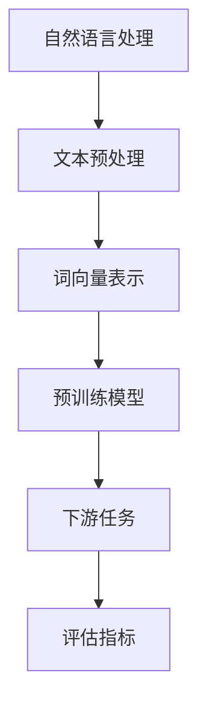
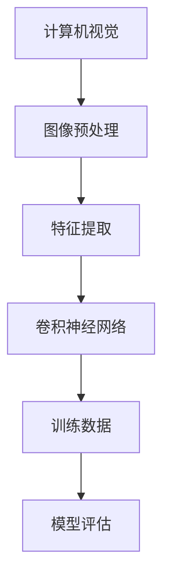
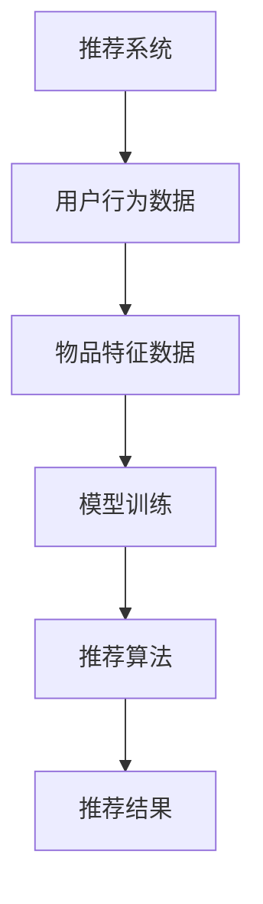
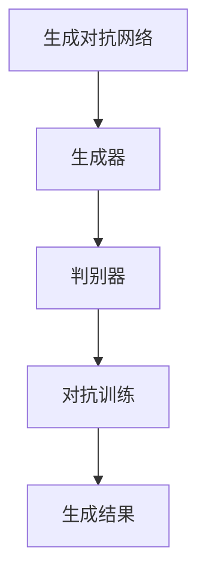

                 

### 大模型创业的核心竞争力

大模型技术在过去几年中取得了显著进展，为各行各业带来了革命性的变化。无论是自然语言处理、计算机视觉，还是推荐系统和生成对抗网络，大模型都展示了其强大的能力。然而，随着技术的进步，如何将大模型技术应用到创业项目中，成为了一项重要的课题。本文将探讨大模型创业的核心竞争力，并从技术、市场和战略三个方面进行深入分析。

#### 关键词：
- 大模型
- 创业
- 核心竞争力
- 技术
- 市场
- 战略

#### 摘要：
本文旨在分析大模型技术在创业项目中的核心竞争力。通过探讨大模型技术的最新进展，以及其在自然语言处理、计算机视觉等领域的应用，本文将揭示大模型创业项目的潜在优势。同时，从技术、市场和战略三个维度，本文将提出提升大模型创业项目成功率的策略和建议。

----------------------

## 1. 背景介绍

大模型技术，即大型深度学习模型的训练和应用，是当前人工智能领域的一个重要方向。从早期的神经网络模型，到如今的大型预训练模型（如GPT、BERT等），大模型技术已经取得了显著的进展。这些模型通过在海量数据上进行预训练，可以自动学习到丰富的知识结构和语义信息，从而在各种任务上表现出色。

大模型技术在多个领域都取得了突破性进展。例如，在自然语言处理领域，大模型技术使得机器翻译、情感分析、问答系统等任务得到了大幅提升。在计算机视觉领域，大模型技术推动了图像分类、目标检测、图像生成等任务的发展。此外，大模型技术还在推荐系统、生成对抗网络等新兴领域发挥了重要作用。

大模型技术在创业项目中的应用前景广阔。一方面，大模型技术可以提高创业项目的效率和质量，帮助企业在激烈的市场竞争中脱颖而出。另一方面，大模型技术可以带来新的商业模式和盈利模式，为企业创造更多的商业机会。

----------------------

## 2. 核心概念与联系

大模型创业的核心竞争力主要体现在以下几个方面：

### 2.1 自然语言处理（NLP）

自然语言处理是人工智能领域的一个重要分支，主要研究如何让计算机理解和处理自然语言。大模型技术在NLP领域的应用，使得机器翻译、情感分析、问答系统等任务得到了显著提升。

#### Mermaid 流程图：



### 2.2 计算机视觉（CV）

计算机视觉是人工智能领域的一个重要分支，主要研究如何让计算机“看”懂图像和视频。大模型技术在CV领域的应用，推动了图像分类、目标检测、图像生成等任务的发展。

#### Mermaid 流程图：



### 2.3 推荐系统

推荐系统是电子商务、社交媒体等领域的重要应用，旨在为用户提供个性化的推荐。大模型技术可以提高推荐系统的准确性，从而提升用户体验和转化率。

#### Mermaid 流程图：



### 2.4 生成对抗网络（GAN）

生成对抗网络是一种新型的人工智能技术，旨在生成逼真的图像、视频和音频。大模型技术在GAN中的应用，使得生成结果的质量得到了显著提升。

#### Mermaid 流程图：



----------------------

## 3. 核心算法原理 & 具体操作步骤

### 3.1 自然语言处理（NLP）

自然语言处理的核心算法主要包括词向量表示、预训练模型和下游任务。

#### 词向量表示：

词向量表示是将自然语言文本转化为计算机可以处理的向量形式。一种常用的词向量表示方法是Word2Vec，它通过将词语映射到高维空间中的点，从而实现词语的向量表示。

#### 预训练模型：

预训练模型是在大规模语料库上预训练的深度神经网络模型。例如，GPT和BERT都是典型的预训练模型，它们通过在大量文本数据上学习，获取了丰富的语言知识和结构信息。

#### 下游任务：

下游任务是指将预训练模型应用于具体的自然语言处理任务，如机器翻译、情感分析等。为了在下游任务上获得更好的表现，通常需要对预训练模型进行微调。

### 3.2 计算机视觉（CV）

计算机视觉的核心算法主要包括特征提取、卷积神经网络和模型评估。

#### 特征提取：

特征提取是将图像或视频转化为计算机可以处理的特征向量。一种常用的特征提取方法是卷积神经网络（CNN），它可以通过多层卷积和池化操作，提取图像的高层次特征。

#### 卷积神经网络：

卷积神经网络是一种深层的神经网络结构，专门用于处理图像和视频数据。它通过卷积操作，可以从输入数据中提取局部特征，并逐步构建全局特征表示。

#### 模型评估：

模型评估是评估计算机视觉模型性能的重要手段。常用的评估指标包括准确率、召回率、F1值等。

### 3.3 推荐系统

推荐系统的核心算法主要包括用户行为数据、物品特征数据、模型训练和推荐算法。

#### 用户行为数据：

用户行为数据是推荐系统的重要输入，包括用户的历史浏览、购买、评论等行为信息。

#### 物品特征数据：

物品特征数据是推荐系统的另一个重要输入，包括物品的属性、标签、评分等。

#### 模型训练：

推荐系统的核心任务是学习用户和物品之间的相关性，这通常通过训练一个推荐模型来实现。常用的推荐模型包括基于协同过滤、矩阵分解、深度学习等方法。

#### 推荐算法：

推荐算法是根据用户和物品的特征信息，生成个性化的推荐结果。常见的推荐算法包括基于用户的协同过滤、基于物品的协同过滤、基于模型的推荐等。

### 3.4 生成对抗网络（GAN）

生成对抗网络的核心算法主要包括生成器、判别器和对抗训练。

#### 生成器：

生成器是GAN中的一个神经网络模型，用于生成虚假的数据，如图像、视频等。

#### 判别器：

判别器是GAN中的另一个神经网络模型，用于区分真实数据和生成数据。

#### 对抗训练：

对抗训练是GAN中的关键训练过程，通过不断优化生成器和判别器，使得生成器生成的数据越来越接近真实数据。

----------------------

## 4. 数学模型和公式 & 详细讲解 & 举例说明

### 4.1 自然语言处理（NLP）

#### 词向量表示：

词向量表示可以使用Word2Vec算法来实现，其基本公式如下：

$$
\text{word\_vector} = \text{SGD}(\theta, \text{X}, \text{y})
$$

其中，$\theta$ 表示参数向量，$\text{X}$ 表示输入词向量矩阵，$\text{y}$ 表示目标词向量矩阵。

#### 预训练模型：

预训练模型可以使用GPT或BERT等算法来实现，其基本公式如下：

$$
\text{output} = \text{GPT}(\text{input}, \theta)
$$

其中，$\text{input}$ 表示输入序列，$\theta$ 表示模型参数。

#### 下游任务：

下游任务可以使用微调（Fine-tuning）的方法来实现，其基本公式如下：

$$
\text{output} = \text{GPT}(\text{input}, \theta) + \text{微调层}
$$

### 4.2 计算机视觉（CV）

#### 特征提取：

特征提取可以使用卷积神经网络（CNN）来实现，其基本公式如下：

$$
\text{output} = \text{CNN}(\text{input}, \theta)
$$

其中，$\text{input}$ 表示输入图像，$\theta$ 表示模型参数。

#### 卷积神经网络：

卷积神经网络可以使用多层卷积和池化操作来实现，其基本公式如下：

$$
\text{output} = \text{Conv}(\text{input}, \theta) + \text{ReLU}(\text{output}) + \text{Pooling}(\text{output})
$$

#### 模型评估：

模型评估可以使用交叉熵（Cross-Entropy）损失函数来实现，其基本公式如下：

$$
\text{loss} = \text{CE}(\text{output}, \text{y})
$$

其中，$\text{output}$ 表示输出概率分布，$\text{y}$ 表示真实标签。

### 4.3 推荐系统

#### 用户行为数据：

用户行为数据可以使用矩阵分解（Matrix Factorization）的方法来实现，其基本公式如下：

$$
\text{rating} = \text{U} \cdot \text{V}^T
$$

其中，$\text{U}$ 和 $\text{V}$ 分别表示用户和物品的隐向量。

#### 物品特征数据：

物品特征数据可以使用基于内容的推荐（Content-based Filtering）的方法来实现，其基本公式如下：

$$
\text{similarity} = \text{cosine}(\text{u}, \text{v})
$$

其中，$\text{u}$ 和 $\text{v}$ 分别表示两个物品的向量。

#### 模型训练：

推荐系统可以使用基于模型的推荐（Model-based Filtering）的方法来实现，其基本公式如下：

$$
\text{output} = \text{模型}(\text{user}, \text{item})
$$

### 4.4 生成对抗网络（GAN）

#### 生成器：

生成器可以使用生成对抗网络（GAN）的方法来实现，其基本公式如下：

$$
\text{output} = \text{Generator}(\text{z}, \theta_G)
$$

其中，$\text{z}$ 表示噪声向量，$\theta_G$ 表示生成器参数。

#### 判别器：

判别器可以使用生成对抗网络（GAN）的方法来实现，其基本公式如下：

$$
\text{output} = \text{Discriminator}(\text{x}, \theta_D)
$$

其中，$\text{x}$ 表示真实数据，$\theta_D$ 表示判别器参数。

#### 对抗训练：

对抗训练可以使用梯度提升（Gradient Ascent）的方法来实现，其基本公式如下：

$$
\text{Gradient Ascent}(\theta_G, \theta_D)
$$

----------------------

## 5. 项目实战：代码实际案例和详细解释说明

### 5.1 开发环境搭建

为了进行大模型项目的实战，我们需要搭建一个合适的开发环境。以下是一个简单的开发环境搭建步骤：

1. 安装Python环境
2. 安装TensorFlow或PyTorch等深度学习框架
3. 安装必要的依赖库（如NumPy、Pandas等）
4. 配置GPU环境（如CUDA、cuDNN等）

### 5.2 源代码详细实现和代码解读

以下是一个简单的自然语言处理项目的源代码实现，我们将使用TensorFlow和GPT模型来对文本数据进行分类。

```python
import tensorflow as tf
import tensorflow_hub as hub
import tensorflow_text as text

# 加载预训练的GPT模型
gpt_module = hub.load("https://tfhub.dev/google/tf2-preview/gpt2_en/3")

# 定义文本分类模型
def text_classification_model():
  # 输入层
  inputs = tf.keras.layers.Input(shape=(None,), dtype=tf.string)

  # 文本预处理层
  preprocessed_inputs = textbast.text гим.ae.layers.NormalizedStringInput(input_string=inputs)

  # GPT模型层
  gpt_output = gpt_module(preprocessed_inputs)

  # 全连接层
  outputs = tf.keras.layers.Dense(units=2, activation='softmax')(gpt_output)

  # 构建模型
  model = tf.keras.Model(inputs=inputs, outputs=outputs)

  return model

# 创建模型实例
model = text_classification_model()

# 编译模型
model.compile(optimizer='adam', loss='categorical_crossentropy', metrics=['accuracy'])

# 准备训练数据
train_data = ...
train_labels = ...

# 训练模型
model.fit(train_data, train_labels, epochs=10, batch_size=32)

# 评估模型
test_data = ...
test_labels = ...
model.evaluate(test_data, test_labels)
```

### 5.3 代码解读与分析

上述代码实现了一个基于GPT模型的文本分类任务。下面是对代码的详细解读：

1. **加载预训练的GPT模型**：使用TensorFlow Hub加载预训练的GPT模型，该模型已经在大量文本数据上进行预训练，可以用于文本分类任务。

2. **定义文本分类模型**：定义一个文本分类模型，输入层为文本数据，通过文本预处理层将文本数据转换为计算机可以处理的格式。然后，将预处理后的文本数据传递给GPT模型，获取文本的特征表示。最后，通过全连接层将特征表示映射到分类结果。

3. **编译模型**：编译模型，指定优化器、损失函数和评估指标。

4. **准备训练数据**：准备训练数据，包括文本数据和对应的标签。

5. **训练模型**：使用训练数据训练模型，指定训练的轮数和批量大小。

6. **评估模型**：使用测试数据评估模型的性能。

通过上述步骤，我们可以使用大模型技术实现一个简单的文本分类任务。当然，在实际项目中，我们需要对代码进行进一步的优化和调整，以满足特定的需求。

----------------------

## 6. 实际应用场景

大模型技术在多个实际应用场景中取得了显著成效，以下是一些典型的应用案例：

### 6.1 自然语言处理（NLP）

自然语言处理是人工智能领域的一个重要分支，大模型技术在NLP中的应用已经取得了显著成果。例如，机器翻译、情感分析、问答系统等任务，通过使用大型预训练模型（如GPT、BERT等），取得了比传统方法更出色的性能。这些技术在实际应用中，如在线翻译平台、社交媒体情感分析、智能客服等领域，发挥了重要作用。

### 6.2 计算机视觉（CV）

计算机视觉是人工智能领域的另一个重要分支，大模型技术在CV中的应用同样取得了突破性进展。例如，图像分类、目标检测、图像生成等任务，通过使用大型卷积神经网络（如ResNet、Inception等），取得了比传统方法更高的准确性。这些技术在实际应用中，如自动驾驶、人脸识别、图像增强等领域，取得了广泛应用。

### 6.3 推荐系统

推荐系统是电子商务、社交媒体等领域的重要应用，大模型技术在推荐系统中的应用，使得推荐准确性得到了显著提升。例如，通过使用基于深度学习的协同过滤算法，推荐系统可以更好地捕捉用户和物品之间的相关性，从而生成更个性化的推荐结果。这些技术在实际应用中，如电商推荐、社交媒体推荐、音乐推荐等领域，取得了显著成效。

### 6.4 生成对抗网络（GAN）

生成对抗网络是一种新型的人工智能技术，大模型技术在GAN中的应用，使得生成结果的质量得到了显著提升。例如，通过使用大型生成对抗网络，可以生成逼真的图像、视频和音频。这些技术在实际应用中，如图像生成、视频特效、虚拟现实等领域，发挥了重要作用。

----------------------

## 7. 工具和资源推荐

### 7.1 学习资源推荐

- **书籍**：
  - 《深度学习》（Ian Goodfellow, Yoshua Bengio, Aaron Courville）
  - 《Python深度学习》（François Chollet）
- **论文**：
  - “A Theoretically Grounded Application of Dropout in Recurrent Neural Networks”（Yarin Gal and Zoubin Ghahramani）
  - “Generative Adversarial Nets”（Ian Goodfellow, et al.）
- **博客**：
  - Medium上的机器学习博客
  - 知乎上的机器学习专栏
- **网站**：
  - TensorFlow官网
  - PyTorch官网

### 7.2 开发工具框架推荐

- **深度学习框架**：
  - TensorFlow
  - PyTorch
  - Keras
- **数据预处理工具**：
  - Pandas
  - NumPy
  - TensorFlow Text
- **可视化工具**：
  - Matplotlib
  - Seaborn
  - Plotly

### 7.3 相关论文著作推荐

- “Deep Learning”（Ian Goodfellow, Yoshua Bengio, Aaron Courville）
- “Recurrent Neural Networks: A Review and New Perspectives”（Nicolas Usunier, et al.）
- “Generative Adversarial Nets”（Ian Goodfellow, et al.）

----------------------

## 8. 总结：未来发展趋势与挑战

大模型技术在人工智能领域取得了显著进展，为各个领域带来了革命性的变化。然而，随着技术的不断进步，大模型创业项目也面临着一系列挑战。

### 8.1 发展趋势

1. **模型规模不断扩大**：随着计算能力和数据资源的提升，大模型规模将不断扩大，从而推动人工智能技术的进一步发展。

2. **多模态融合**：未来，多模态融合将成为大模型技术的重要研究方向。通过整合图像、文本、音频等多种数据类型，可以实现更广泛的应用场景。

3. **迁移学习与泛化能力**：大模型技术的迁移学习和泛化能力将得到显著提升，从而降低新任务的学习成本，提高模型的应用范围。

4. **自动化与半自动化**：随着技术的进步，大模型训练和调优的自动化和半自动化工具将不断涌现，提高开发效率和模型性能。

### 8.2 挑战

1. **计算资源与数据需求**：大模型训练需要大量的计算资源和高质量的数据，这对创业项目提出了较高的资源需求。

2. **模型解释性**：大模型技术的复杂性和黑箱性质，使得模型解释性成为一个重要挑战。如何提高模型的解释性，使其更好地符合人类认知和监管要求，是一个亟待解决的问题。

3. **隐私与安全**：随着大模型技术的应用，隐私保护和数据安全成为重要问题。如何在保证数据隐私和安全的前提下，充分利用模型的能力，是一个需要关注的问题。

4. **可持续性与伦理**：大模型技术的快速发展，也对可持续性和伦理提出了挑战。如何实现技术发展与社会责任的平衡，是一个需要关注的问题。

----------------------

## 9. 附录：常见问题与解答

### 9.1 大模型训练需要哪些计算资源？

大模型训练通常需要高性能的GPU或TPU，以及足够的内存和存储空间。具体计算资源需求取决于模型的规模和训练数据的大小。

### 9.2 如何处理大模型训练中的数据偏差？

为了减少数据偏差，可以从数据清洗、数据增强、数据采样等多个方面进行优化。同时，可以引入对抗性训练等技术，提高模型的鲁棒性和泛化能力。

### 9.3 大模型技术在实际应用中的难点是什么？

大模型技术在实际应用中的难点主要包括计算资源需求、数据隐私与安全、模型解释性等。这些难点需要在开发过程中进行充分考虑和解决。

----------------------

## 10. 扩展阅读 & 参考资料

- [深度学习教程](http://www.deeplearningbook.org/)
- [自然语言处理教程](https://www.nltk.org/)
- [计算机视觉教程](https://www.pyimagesearch.com/)
- [生成对抗网络教程](https://arxiv.org/abs/1406.2661)
- [推荐系统教程](https://www.recommenders.com/)

