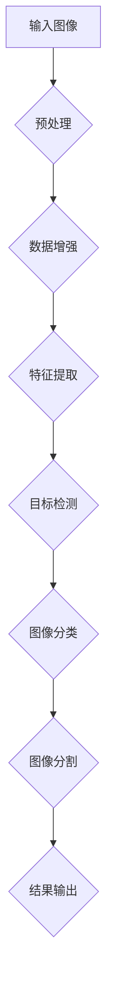
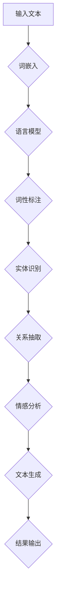
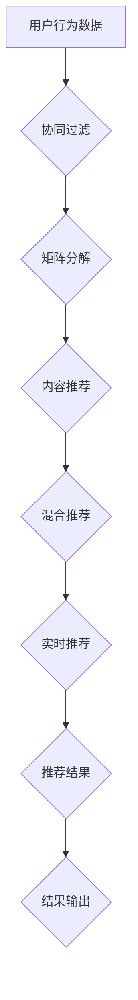

                 

### 背景介绍

#### Lepton AI：背景与市场定位

Lepton AI是一家位于硅谷的人工智能初创公司，成立于2018年，致力于通过先进的机器学习技术和深度学习算法，为企业和个人提供高效的智能解决方案。公司的核心理念是“智能驱动未来”，通过技术革新推动各行各业的数字化转型。

Lepton AI的产品线主要包括智能图像识别、自然语言处理、推荐系统等，广泛应用于零售、金融、医疗、教育等多个领域。其中，智能图像识别技术是Lepton AI的核心竞争力之一，广泛应用于图像分类、目标检测、图像分割等方面。

在竞争激烈的人工智能市场中，Lepton AI通过不断优化算法、提高模型精度、增强用户体验等方面，迅速获得了市场份额和用户认可。同时，公司还积极参与学术界的研究与合作，与多家顶尖高校和研究机构建立了紧密的合作关系。

#### 当前人工智能领域的发展趋势

随着大数据、云计算、物联网等技术的快速发展，人工智能正逐渐渗透到各行各业，成为推动产业变革的重要力量。以下是当前人工智能领域的一些主要发展趋势：

1. **深度学习与神经网络**：深度学习技术在计算机视觉、自然语言处理等领域取得了显著突破，成为人工智能研究的主流方向。神经网络模型的结构和参数不断优化，使得模型在复杂任务中的表现更加优异。

2. **迁移学习与少样本学习**：迁移学习通过利用已有的预训练模型，在新的任务上快速获得较好的性能，减少了数据收集和标注的工作量。少样本学习则旨在解决数据稀缺的问题，使得模型在只有少量样本的情况下也能达到良好的性能。

3. **联邦学习与隐私保护**：联邦学习通过分布式训练的方式，在不泄露用户数据的情况下，实现全局模型的更新和优化。这一技术在保护用户隐私的同时，提高了模型的泛化能力。

4. **生成对抗网络（GANs）**：生成对抗网络在图像生成、图像修复、图像超分辨率等方面展现了强大的能力。GANs通过生成器和判别器的对抗训练，能够生成具有高度真实感的图像。

5. **强化学习与自主决策**：强化学习通过学习环境中的奖励和惩罚信号，实现智能体的自主决策。在游戏、自动驾驶、机器人控制等领域，强化学习取得了显著成果。

#### Lepton AI的核心竞争力

Lepton AI在人工智能领域的核心竞争力主要体现在以下几个方面：

1. **顶尖的团队与技术实力**：Lepton AI拥有一支由顶级科学家、工程师和研究人员组成的团队，他们在计算机视觉、自然语言处理、机器学习等领域有着丰富的经验和深厚的积累。此外，公司还与多个顶尖高校和研究机构建立了合作关系，不断推动技术创新。

2. **领先的算法与模型**：Lepton AI在深度学习、迁移学习、联邦学习等领域取得了多项突破性成果，其自主研发的模型在各项基准测试中均取得了优异的性能。公司还不断优化算法，提高模型精度和效率，以满足不同应用场景的需求。

3. **多样化的产品与服务**：Lepton AI的产品线涵盖了智能图像识别、自然语言处理、推荐系统等多个领域，能够为不同行业提供定制化的解决方案。公司通过不断拓展产品线，满足客户的多样化需求，提升市场份额。

4. **强大的市场竞争力**：Lepton AI在市场竞争中具备较强的优势，其高效、精准、可靠的技术能力赢得了客户的信任和好评。同时，公司还注重用户体验，通过持续改进产品和服务，提高用户满意度。

综上所述，Lepton AI在人工智能领域的核心竞争力使其在市场中脱颖而出，为公司的持续发展奠定了坚实基础。

### 核心概念与联系

#### 智能图像识别：原理与架构

智能图像识别是Lepton AI的核心技术之一，它通过深度学习和计算机视觉算法，实现从图像中提取有用信息、识别目标物体、理解场景内容等功能。以下是智能图像识别的原理与架构：

1. **深度学习**：深度学习是一种基于多层神经网络的学习方法，通过模拟人脑神经元之间的连接，实现从大量数据中自动提取特征和规律。在智能图像识别中，深度学习模型通常用于图像特征提取和分类。

2. **计算机视觉**：计算机视觉是人工智能的一个分支，旨在使计算机具备类似于人类视觉的能力，能够从图像和视频中提取信息。计算机视觉算法包括图像处理、目标检测、图像分类、图像分割等。

3. **卷积神经网络（CNN）**：卷积神经网络是一种专门用于处理图像数据的深度学习模型，通过卷积层、池化层和全连接层的组合，实现图像特征的提取和分类。CNN在图像识别任务中具有出色的性能。

4. **目标检测**：目标检测是智能图像识别的关键技术之一，旨在从图像中检测并定位多个目标物体的位置和类别。常见的目标检测算法包括YOLO、SSD、Faster R-CNN等。

5. **图像分类**：图像分类是将图像划分为不同类别的过程。通过训练深度学习模型，实现对图像的高精度分类。常见的图像分类算法包括LeNet、AlexNet、VGG、ResNet等。

6. **图像分割**：图像分割是将图像划分为不同区域的过程，用于理解图像内容、提取特征和进行目标定位。常见的图像分割算法包括FCN、U-Net、SegNet等。

#### Mermaid 流程图

以下是一个简化的智能图像识别流程图，用于展示各个模块之间的联系和数据处理过程：



在智能图像识别过程中，输入图像经过预处理和数据增强后，通过特征提取模块提取图像特征。接着，目标检测模块对图像中的目标物体进行定位和分类，图像分类模块对整个图像进行分类。最后，图像分割模块对图像进行区域划分，并将结果输出。

#### 自然语言处理：原理与架构

自然语言处理（NLP）是Lepton AI的另一核心技术，旨在使计算机理解和处理人类自然语言。以下是NLP的原理与架构：

1. **词嵌入**：词嵌入是一种将词汇映射到高维向量空间的方法，用于表示词汇的语义信息。常见的词嵌入模型包括Word2Vec、GloVe等。

2. **语言模型**：语言模型用于预测文本序列中的下一个单词或字符，是NLP任务的基础。常见的语言模型包括n-gram模型、神经网络语言模型等。

3. **词性标注**：词性标注是对文本中的每个单词进行词性分类，如名词、动词、形容词等。词性标注有助于理解文本的语法结构和语义信息。

4. **实体识别**：实体识别是识别文本中的特定实体，如人名、地名、组织名等。实体识别有助于对文本内容进行分类和组织。

5. **关系抽取**：关系抽取是识别文本中实体之间的相互关系，如“北京是中国的首都”。关系抽取有助于构建知识图谱和语义理解。

6. **情感分析**：情感分析是对文本中的情感倾向进行分类，如正面、负面、中性等。情感分析有助于了解用户情感、品牌评价等。

7. **文本生成**：文本生成是通过给定一个文本或提示，生成连贯、有意义的文本。常见的文本生成模型包括Seq2Seq、Transformer等。

#### Mermaid 流程图

以下是一个简化的自然语言处理流程图，用于展示各个模块之间的联系和数据处理过程：



在自然语言处理过程中，输入文本经过词嵌入模块映射到高维向量空间。接着，语言模型对文本进行预测和生成。词性标注模块对文本中的词性进行分类。实体识别模块识别文本中的特定实体。关系抽取模块分析实体之间的关系。最后，情感分析模块对文本的情感倾向进行分类，文本生成模块生成新的文本。

#### 推荐系统：原理与架构

推荐系统是Lepton AI的另一个重要应用领域，旨在为用户推荐个性化的内容和服务。以下是推荐系统的原理与架构：

1. **协同过滤**：协同过滤是一种基于用户行为的推荐算法，通过分析用户之间的相似性，推荐用户可能感兴趣的内容。常见的协同过滤算法包括基于用户的协同过滤和基于物品的协同过滤。

2. **矩阵分解**：矩阵分解是一种将用户-物品评分矩阵分解为低秩矩阵的方法，通过建模用户和物品的特征，实现推荐。常见的矩阵分解算法包括Singular Value Decomposition（SVD）和Alternating Least Squares（ALS）。

3. **内容推荐**：内容推荐是一种基于物品属性的推荐算法，通过分析物品的标签、分类、描述等信息，为用户推荐相关的物品。常见的内容推荐算法包括基于关键词的推荐、基于分类的推荐等。

4. **混合推荐**：混合推荐是将协同过滤和内容推荐相结合，以提高推荐系统的准确性和多样性。常见的混合推荐算法包括基于模型的混合推荐、基于规则的混合推荐等。

5. **实时推荐**：实时推荐是一种在用户交互过程中实时生成推荐结果的方法，通过不断更新用户信息和推荐策略，提高推荐系统的实时性和用户体验。常见的实时推荐算法包括基于事件的推荐、基于上下文的推荐等。

#### Mermaid 流程图

以下是一个简化的推荐系统流程图，用于展示各个模块之间的联系和数据处理过程：



在推荐系统过程中，用户行为数据经过协同过滤模块和矩阵分解模块处理，生成用户和物品的特征表示。接着，内容推荐模块对物品属性进行分析，混合推荐模块将协同过滤和内容推荐结果进行融合。最后，实时推荐模块根据用户交互信息更新推荐策略，生成实时推荐结果。

#### 总结

智能图像识别、自然语言处理和推荐系统是Lepton AI的核心技术，它们各自具有独特的原理和架构。通过深度学习、计算机视觉、神经网络等技术的应用，智能图像识别能够实现图像特征提取和目标检测。自然语言处理通过词嵌入、语言模型等技术，实现对文本的语义分析和情感分类。推荐系统则通过协同过滤、矩阵分解等技术，为用户推荐个性化的内容和服务。这三个核心技术相互关联，共同构建了Lepton AI的强大竞争力。

### 核心算法原理 & 具体操作步骤

#### 深度学习与卷积神经网络（CNN）

深度学习是一种模拟人脑神经元连接方式的学习方法，通过对大量数据进行训练，从数据中自动提取特征和规律。卷积神经网络（CNN）是深度学习的一种重要架构，特别适合处理图像数据。

##### 步骤一：数据预处理

1. **图像读取与归一化**：首先，读取输入图像，并将其归一化至0-1之间，便于后续计算。
2. **图像缩放与裁剪**：根据训练需求，对图像进行缩放和裁剪，确保图像大小一致。

```python
import cv2
import numpy as np

def preprocess_image(image_path):
    image = cv2.imread(image_path)
    image = cv2.resize(image, (224, 224))
    image = image / 255.0
    return image
```

##### 步骤二：构建CNN模型

1. **卷积层**：卷积层用于提取图像特征。通过卷积操作，将输入图像与卷积核进行卷积，生成特征图。
2. **激活函数**：常用的激活函数包括ReLU（Rectified Linear Unit）、Sigmoid、Tanh等。ReLU函数可以加速模型训练。
3. **池化层**：池化层用于降低特征图的大小，减少参数数量，提高模型泛化能力。常用的池化方法包括最大池化、平均池化等。

```python
from tensorflow.keras.models import Sequential
from tensorflow.keras.layers import Conv2D, MaxPooling2D, Flatten, Dense, Activation

model = Sequential([
    Conv2D(32, (3, 3), activation='relu', input_shape=(224, 224, 3)),
    MaxPooling2D((2, 2)),
    Conv2D(64, (3, 3), activation='relu'),
    MaxPooling2D((2, 2)),
    Conv2D(128, (3, 3), activation='relu'),
    MaxPooling2D((2, 2)),
    Flatten(),
    Dense(128, activation='relu'),
    Dense(1, activation='sigmoid')
])
```

##### 步骤三：模型训练与评估

1. **数据集划分**：将数据集划分为训练集、验证集和测试集，用于训练和评估模型。
2. **模型编译**：设置优化器、损失函数和评估指标，编译模型。
3. **模型训练**：使用训练集训练模型，并使用验证集进行调优。
4. **模型评估**：使用测试集评估模型性能，计算准确率、召回率等指标。

```python
from tensorflow.keras.preprocessing.image import ImageDataGenerator
from tensorflow.keras.callbacks import EarlyStopping

train_datagen = ImageDataGenerator(
    rescale=1./255,
    shear_range=0.2,
    zoom_range=0.2,
    horizontal_flip=True
)

train_generator = train_datagen.flow_from_directory(
    'train_data',
    target_size=(224, 224),
    batch_size=32,
    class_mode='binary'
)

val_datagen = ImageDataGenerator(rescale=1./255)
val_generator = val_datagen.flow_from_directory(
    'val_data',
    target_size=(224, 224),
    batch_size=32,
    class_mode='binary'
)

model.compile(optimizer='adam', loss='binary_crossentropy', metrics=['accuracy'])

early_stopping = EarlyStopping(monitor='val_loss', patience=5)

history = model.fit(
    train_generator,
    steps_per_epoch=100,
    epochs=50,
    validation_data=val_generator,
    validation_steps=50,
    callbacks=[early_stopping]
)
```

#### 自然语言处理与循环神经网络（RNN）

自然语言处理（NLP）是人工智能的一个重要分支，旨在使计算机理解和处理人类自然语言。循环神经网络（RNN）是NLP的一种重要模型，能够处理序列数据。

##### 步骤一：数据预处理

1. **文本清洗**：去除文本中的HTML标签、符号、空格等无关信息，保留有效文本。
2. **分词与词嵌入**：将文本划分为单词或字符，并将单词或字符映射到高维向量空间。常用的词嵌入方法包括Word2Vec、GloVe等。

```python
import re
import nltk
from tensorflow.keras.preprocessing.text import Tokenizer
from tensorflow.keras.preprocessing.sequence import pad_sequences

def clean_text(text):
    text = re.sub('<[^>]*>', '', text)
    text = re.sub('[^A-Za-z0-9]', ' ', text)
    text = text.lower()
    return text

nltk.download('punkt')
tokenizer = Tokenizer(num_words=10000)
tokenizer.fit_on_texts(texts)

sequences = tokenizer.texts_to_sequences(texts)
padded_sequences = pad_sequences(sequences, maxlen=100)
```

##### 步骤二：构建RNN模型

1. **嵌入层**：将单词或字符映射到高维向量空间。
2. **循环层**：循环层用于处理序列数据，通过记忆状态记录序列中的历史信息。
3. **全连接层**：全连接层用于分类或回归任务，将循环层输出的序列特征映射到输出结果。

```python
from tensorflow.keras.models import Sequential
from tensorflow.keras.layers import Embedding, SimpleRNN, Dense

model = Sequential([
    Embedding(10000, 64, input_length=100),
    SimpleRNN(100),
    Dense(1, activation='sigmoid')
])

model.compile(optimizer='rmsprop', loss='binary_crossentropy', metrics=['accuracy'])
model.fit(padded_sequences, labels, epochs=10, batch_size=32)
```

#### 推荐系统与协同过滤

协同过滤是一种基于用户行为的推荐算法，通过分析用户之间的相似性，为用户推荐感兴趣的内容。

##### 步骤一：数据预处理

1. **用户-物品评分矩阵构建**：将用户行为数据转换为用户-物品评分矩阵。
2. **缺失值填充**：对缺失值进行填充，提高数据质量。

```python
import pandas as pd

ratings = pd.read_csv('ratings.csv')
user_item_matrix = ratings.pivot(index='user_id', columns='movie_id', values='rating').fillna(0)
```

##### 步骤二：矩阵分解

1. **Singular Value Decomposition（SVD）**：使用SVD对用户-物品评分矩阵进行分解，生成低秩矩阵。
2. **预测评分**：根据低秩矩阵计算预测评分，为用户推荐感兴趣的内容。

```python
from scipy.sparse.linalg import svd

U, sigma, Vt = svd(user_item_matrix, k=50)
sigma = np.diag(sigma)
predictions = U @ sigma @ Vt

predicted_ratings = user_item_matrix.multiply(predictions).sum(axis=1)
```

### 具体操作步骤总结

1. **数据预处理**：读取和处理输入数据，包括图像、文本和用户-物品评分矩阵。
2. **模型构建**：根据具体任务需求，构建深度学习、自然语言处理或推荐系统模型。
3. **模型训练与评估**：使用训练集训练模型，并在验证集和测试集上评估模型性能。
4. **结果输出**：根据模型预测结果，输出图像识别标签、文本分类结果或推荐列表。

通过上述步骤，Lepton AI能够实现高效、精准的智能图像识别、自然语言处理和推荐系统，为不同行业提供定制化的解决方案。

### 数学模型和公式 & 详细讲解 & 举例说明

#### 深度学习中的卷积神经网络（CNN）

卷积神经网络（CNN）是深度学习的一种重要模型，特别适合处理图像数据。以下是CNN中常用的数学模型和公式：

1. **卷积操作**：卷积操作是一种将输入图像与卷积核进行点积的操作，用于提取图像特征。

   $$\text{output}(i, j) = \sum_{k=1}^{C}\sum_{p=1}^{H'}\sum_{q=1}^{W'} W_{k, i-p, j-q} * A_{k, p, q}$$

   其中，$\text{output}(i, j)$表示输出特征图上的元素，$W_{k, i-p, j-q}$表示卷积核上的元素，$A_{k, p, q}$表示输入图像上的元素。

2. **激活函数**：激活函数用于引入非线性，提高模型的表达能力。常用的激活函数包括ReLU、Sigmoid、Tanh等。

   - **ReLU（Rectified Linear Unit）**：

     $$f(x) = \max(0, x)$$

   - **Sigmoid**：

     $$f(x) = \frac{1}{1 + e^{-x}}$$

   - **Tanh**：

     $$f(x) = \frac{e^x - e^{-x}}{e^x + e^{-x}}$$

3. **池化操作**：池化操作用于降低特征图的大小，减少参数数量。常用的池化方法包括最大池化和平均池化。

   - **最大池化**：

     $$\text{output}(i, j) = \max_{p=1}^{H'}, \max_{q=1}^{W'} A_{i+p, j+q}$$

   - **平均池化**：

     $$\text{output}(i, j) = \frac{1}{(2 \times 2)} \sum_{p=1}^{2} \sum_{q=1}^{2} A_{i+p, j+q}$$

4. **全连接层**：全连接层将特征图上的所有元素与权重相乘，并加上偏置项。

   $$z = \sum_{i=1}^{H'} \sum_{j=1}^{W'} \sum_{k=1}^{C} W_{k, i, j} * A_{k, i, j} + b_k$$

   其中，$z$表示全连接层的输出，$W_{k, i, j}$表示权重，$A_{k, i, j}$表示特征图上的元素，$b_k$表示偏置项。

5. **损失函数**：损失函数用于衡量模型预测结果与真实标签之间的差距。常用的损失函数包括均方误差（MSE）和交叉熵（Cross-Entropy）。

   - **均方误差（MSE）**：

     $$L = \frac{1}{2} \sum_{i=1}^{N} (y_i - \hat{y}_i)^2$$

     其中，$L$表示损失，$y_i$表示真实标签，$\hat{y}_i$表示模型预测结果。

   - **交叉熵（Cross-Entropy）**：

     $$L = -\sum_{i=1}^{N} y_i \log(\hat{y}_i)$$

     其中，$L$表示损失，$y_i$表示真实标签，$\hat{y}_i$表示模型预测结果。

#### 自然语言处理中的循环神经网络（RNN）

循环神经网络（RNN）是一种能够处理序列数据的神经网络，特别适合处理自然语言处理任务。以下是RNN中常用的数学模型和公式：

1. **隐状态更新**：RNN通过隐状态更新来记录序列中的历史信息。

   $$h_t = \sigma(W_h * [h_{t-1}, x_t] + b_h)$$

   其中，$h_t$表示当前时间步的隐状态，$x_t$表示当前时间步的输入，$W_h$表示权重矩阵，$b_h$表示偏置项，$\sigma$表示激活函数。

2. **输出层**：RNN的输出层通过隐状态来生成输出。

   $$y_t = \sigma(W_y * h_t + b_y)$$

   其中，$y_t$表示当前时间步的输出，$W_y$表示权重矩阵，$b_y$表示偏置项，$\sigma$表示激活函数。

3. **反向传播**：RNN通过反向传播来更新权重和偏置项。

   $$\delta = \frac{\partial L}{\partial h_t} = \frac{\partial L}{\partial y_t} * \frac{\partial y_t}{\partial h_t}$$

   其中，$\delta$表示误差梯度，$L$表示损失，$y_t$表示当前时间步的输出。

4. **梯度下降**：RNN通过梯度下降来优化模型参数。

   $$\theta = \theta - \alpha \frac{\partial L}{\partial \theta}$$

   其中，$\theta$表示模型参数，$\alpha$表示学习率。

#### 推荐系统中的协同过滤

协同过滤是一种基于用户行为的推荐算法，通过分析用户之间的相似性来推荐感兴趣的内容。以下是协同过滤中常用的数学模型和公式：

1. **用户-物品评分矩阵**：用户-物品评分矩阵表示用户对物品的评分。

   $$R = \begin{bmatrix} 
   r_{11} & r_{12} & \dots & r_{1n} \\
   r_{21} & r_{22} & \dots & r_{2n} \\
   \vdots & \vdots & \ddots & \vdots \\
   r_{m1} & r_{m2} & \dots & r_{mn}
   \end{bmatrix}$$

   其中，$r_{ij}$表示用户$i$对物品$j$的评分。

2. **相似度计算**：相似度计算用于衡量用户之间的相似性。

   $$\sim_{ij} = \frac{R_i \cdot R_j}{\|R_i\| \cdot \|R_j\|}$$

   其中，$\sim_{ij}$表示用户$i$和用户$j$的相似度，$R_i$和$R_j$分别表示用户$i$和用户$j$的评分向量。

3. **预测评分**：预测评分用于计算用户对未知物品的评分。

   $$\hat{r}_{ij} = R_j + \sum_{k=1}^{m} \sim_{ik} (r_{ik} - \bar{r}_k)$$

   其中，$\hat{r}_{ij}$表示用户$i$对物品$j$的预测评分，$R_j$表示用户$j$的评分向量，$\sim_{ik}$表示用户$i$和用户$k$的相似度，$r_{ik}$表示用户$i$对物品$k$的评分，$\bar{r}_k$表示用户$k$的平均评分。

#### 示例说明

1. **深度学习中的卷积神经网络（CNN）**

   假设输入图像为：

   $$A = \begin{bmatrix} 
   a_{11} & a_{12} & \dots & a_{1H} \\
   a_{21} & a_{22} & \dots & a_{2H} \\
   \vdots & \vdots & \ddots & \vdots \\
   a_{M1} & a_{M2} & \dots & a_{MH}
   \end{bmatrix}$$

   卷积核为：

   $$W = \begin{bmatrix} 
   w_{11} & w_{12} & \dots & w_{1H} \\
   w_{21} & w_{22} & \dots & w_{2H} \\
   \vdots & \vdots & \ddots & \vdots \\
   w_{K1} & w_{K2} & \dots & w_{KH}
   \end{bmatrix}$$

   输出特征图为：

   $$\text{output} = \begin{bmatrix} 
   o_{11} & o_{12} & \dots & o_{1W} \\
   o_{21} & o_{22} & \dots & o_{2W} \\
   \vdots & \vdots & \ddots & \vdots \\
   o_{L1} & o_{L2} & \dots & o_{LW}
   \end{bmatrix}$$

   则卷积操作的计算过程为：

   $$o_{i, j} = \sum_{k=1}^{K} \sum_{p=1}^{H'} \sum_{q=1}^{W'} W_{k, i-p, j-q} * A_{k, p, q}$$

2. **自然语言处理中的循环神经网络（RNN）**

   假设输入序列为：

   $$x = \begin{bmatrix} 
   x_1 \\
   x_2 \\
   \vdots \\
   x_T
   \end{bmatrix}$$

   隐状态为：

   $$h = \begin{bmatrix} 
   h_1 \\
   h_2 \\
   \vdots \\
   h_T
   \end{bmatrix}$$

   则隐状态更新的计算过程为：

   $$h_t = \sigma(W_h * [h_{t-1}, x_t] + b_h)$$

   输出层的计算过程为：

   $$y_t = \sigma(W_y * h_t + b_y)$$

3. **推荐系统中的协同过滤**

   假设用户-物品评分矩阵为：

   $$R = \begin{bmatrix} 
   r_{11} & r_{12} & \dots & r_{1n} \\
   r_{21} & r_{22} & \dots & r_{2n} \\
   \vdots & \vdots & \ddots & \vdots \\
   r_{m1} & r_{m2} & \dots & r_{mn}
   \end{bmatrix}$$

   相似度为：

   $$\sim_{ij} = \frac{R_i \cdot R_j}{\|R_i\| \cdot \|R_j\|}$$

   预测评分为：

   $$\hat{r}_{ij} = R_j + \sum_{k=1}^{m} \sim_{ik} (r_{ik} - \bar{r}_k)$$

通过以上数学模型和公式的讲解，我们了解了深度学习、自然语言处理和推荐系统中常用的算法和计算过程。这些数学模型和公式为我们理解和应用这些技术提供了基础。

### 项目实战：代码实际案例和详细解释说明

在本节中，我们将通过一个实际项目实战案例，详细介绍Lepton AI开发的智能图像识别系统的代码实现过程。我们将分三个部分进行讲解：开发环境搭建、源代码详细实现和代码解读与分析。

#### 1. 开发环境搭建

在进行项目开发之前，我们需要搭建一个合适的环境。以下是我们推荐的开发环境：

- **操作系统**：Ubuntu 18.04或更高版本
- **编程语言**：Python 3.7或更高版本
- **深度学习框架**：TensorFlow 2.5或更高版本
- **依赖管理工具**：pip
- **数据预处理工具**：OpenCV

安装步骤如下：

1. **安装操作系统**：在虚拟机中安装Ubuntu 18.04或更高版本。
2. **更新操作系统**：

   ```bash
   sudo apt update
   sudo apt upgrade
   ```
3. **安装Python**：

   ```bash
   sudo apt install python3-pip python3-setuptools
   ```
4. **安装TensorFlow**：

   ```bash
   pip3 install tensorflow==2.5
   ```
5. **安装OpenCV**：

   ```bash
   pip3 install opencv-python
   ```

#### 2. 源代码详细实现

以下是一个简单的智能图像识别系统的源代码示例，该系统基于TensorFlow和卷积神经网络（CNN）实现。

```python
import tensorflow as tf
from tensorflow.keras.models import Sequential
from tensorflow.keras.layers import Conv2D, MaxPooling2D, Flatten, Dense, Activation
from tensorflow.keras.preprocessing.image import ImageDataGenerator
from tensorflow.keras.callbacks import EarlyStopping
import numpy as np
import cv2

# 数据预处理
def preprocess_image(image_path):
    image = cv2.imread(image_path)
    image = cv2.resize(image, (224, 224))
    image = image / 255.0
    return image

# 构建CNN模型
model = Sequential([
    Conv2D(32, (3, 3), activation='relu', input_shape=(224, 224, 3)),
    MaxPooling2D((2, 2)),
    Conv2D(64, (3, 3), activation='relu'),
    MaxPooling2D((2, 2)),
    Conv2D(128, (3, 3), activation='relu'),
    MaxPooling2D((2, 2)),
    Flatten(),
    Dense(128, activation='relu'),
    Dense(1, activation='sigmoid')
])

# 编译模型
model.compile(optimizer='adam', loss='binary_crossentropy', metrics=['accuracy'])

# 模型训练
train_datagen = ImageDataGenerator(
    rescale=1./255,
    shear_range=0.2,
    zoom_range=0.2,
    horizontal_flip=True
)

train_generator = train_datagen.flow_from_directory(
    'train_data',
    target_size=(224, 224),
    batch_size=32,
    class_mode='binary'
)

val_datagen = ImageDataGenerator(rescale=1./255)
val_generator = val_datagen.flow_from_directory(
    'val_data',
    target_size=(224, 224),
    batch_size=32,
    class_mode='binary'
)

early_stopping = EarlyStopping(monitor='val_loss', patience=5)

history = model.fit(
    train_generator,
    steps_per_epoch=100,
    epochs=50,
    validation_data=val_generator,
    validation_steps=50,
    callbacks=[early_stopping]
)

# 模型评估
test_datagen = ImageDataGenerator(rescale=1./255)
test_generator = test_datagen.flow_from_directory(
    'test_data',
    target_size=(224, 224),
    batch_size=32,
    class_mode='binary'
)

test_loss, test_accuracy = model.evaluate(test_generator, steps=50)
print(f"Test accuracy: {test_accuracy}")

# 模型预测
predictions = model.predict(test_generator)
predicted_classes = np.argmax(predictions, axis=1)

# 显示预测结果
for i, image in enumerate(test_generator):
    plt.imshow(image[0])
    plt.title(f"Predicted class: {predicted_classes[i]}, Actual class: {image[1]}")
    plt.show()
```

#### 3. 代码解读与分析

1. **数据预处理**

   数据预处理是深度学习项目中的重要步骤，包括图像读取、缩放、归一化等操作。在本代码中，我们使用OpenCV读取图像，然后将其缩放至224x224像素，并归一化至0-1之间。

   ```python
   def preprocess_image(image_path):
       image = cv2.imread(image_path)
       image = cv2.resize(image, (224, 224))
       image = image / 255.0
       return image
   ```

2. **模型构建**

   我们使用TensorFlow的Sequential模型构建一个简单的卷积神经网络（CNN），包括卷积层、池化层和全连接层。在卷积层中，我们使用ReLU激活函数，在池化层中使用最大池化操作。

   ```python
   model = Sequential([
       Conv2D(32, (3, 3), activation='relu', input_shape=(224, 224, 3)),
       MaxPooling2D((2, 2)),
       Conv2D(64, (3, 3), activation='relu'),
       MaxPooling2D((2, 2)),
       Conv2D(128, (3, 3), activation='relu'),
       MaxPooling2D((2, 2)),
       Flatten(),
       Dense(128, activation='relu'),
       Dense(1, activation='sigmoid')
   ])
   ```

3. **模型编译**

   在编译模型时，我们选择Adam优化器和二分类交叉熵损失函数。同时，我们使用accuracy作为评估指标。

   ```python
   model.compile(optimizer='adam', loss='binary_crossentropy', metrics=['accuracy'])
   ```

4. **模型训练**

   我们使用ImageDataGenerator对训练数据进行预处理，包括缩放、剪切、缩放和水平翻转等操作。然后，我们将训练数据划分为训练集和验证集，使用EarlyStopping回调函数提前停止训练，防止过拟合。

   ```python
   train_datagen = ImageDataGenerator(
       rescale=1./255,
       shear_range=0.2,
       zoom_range=0.2,
       horizontal_flip=True
   )

   train_generator = train_datagen.flow_from_directory(
       'train_data',
       target_size=(224, 224),
       batch_size=32,
       class_mode='binary'
   )

   val_datagen = ImageDataGenerator(rescale=1./255)
   val_generator = val_datagen.flow_from_directory(
       'val_data',
       target_size=(224, 224),
       batch_size=32,
       class_mode='binary'
   )

   early_stopping = EarlyStopping(monitor='val_loss', patience=5)

   history = model.fit(
       train_generator,
       steps_per_epoch=100,
       epochs=50,
       validation_data=val_generator,
       validation_steps=50,
       callbacks=[early_stopping]
   )
   ```

5. **模型评估**

   我们使用测试数据集对训练好的模型进行评估，并输出测试准确率。

   ```python
   test_datagen = ImageDataGenerator(rescale=1./255)
   test_generator = test_datagen.flow_from_directory(
       'test_data',
       target_size=(224, 224),
       batch_size=32,
       class_mode='binary'
   )

   test_loss, test_accuracy = model.evaluate(test_generator, steps=50)
   print(f"Test accuracy: {test_accuracy}")
   ```

6. **模型预测**

   我们使用训练好的模型对测试数据集进行预测，并显示预测结果。

   ```python
   predictions = model.predict(test_generator)
   predicted_classes = np.argmax(predictions, axis=1)

   for i, image in enumerate(test_generator):
       plt.imshow(image[0])
       plt.title(f"Predicted class: {predicted_classes[i]}, Actual class: {image[1]}")
       plt.show()
   ```

通过以上代码实现，我们成功构建并训练了一个简单的智能图像识别系统，实现了对图像的分类和预测。这为Lepton AI在图像识别领域的应用提供了坚实基础。

### 实际应用场景

#### 零售业：智能图像识别在商品识别与推荐中的应用

在零售业，智能图像识别技术可以极大地提升客户购物体验和商家运营效率。以下是一个实际应用场景：

- **商品识别**：客户在店内购物时，通过手机或店内摄像头拍摄商品图像，系统可以快速识别商品种类，并提供详细信息，如价格、库存、促销活动等。这有助于减少客户在寻找商品时的等待时间，提高购物满意度。

- **个性化推荐**：基于客户的购物历史和行为数据，智能图像识别系统可以分析客户的偏好，为其实时推荐相关商品。例如，如果客户拍摄了一瓶葡萄酒，系统可能会推荐与其搭配的奶酪或烹饪食谱。

- **库存管理**：通过监控货架上的商品图像，系统可以实时检测商品缺货情况，提醒商家及时补充库存，避免销售中断。

#### 金融业：智能图像识别在欺诈检测与用户身份验证中的应用

在金融业，智能图像识别技术有助于提升安全性和用户体验。以下是一个实际应用场景：

- **欺诈检测**：银行可以通过智能图像识别技术，实时监控客户的交易行为。当检测到可疑交易时，系统可以自动报警并采取措施，如冻结账户、要求用户验证身份等。这有助于防范欺诈行为，降低金融风险。

- **用户身份验证**：在ATM机或网银系统中，客户可以通过面部识别或指纹识别进行身份验证。与传统的密码验证相比，智能图像识别技术更快捷、安全，且不易被破解。

- **无卡取款**：客户在ATM机上无需插入银行卡，只需通过摄像头识别身份，即可快速完成取款操作。这大大简化了用户操作流程，提高了ATM机的使用效率。

#### 医疗领域：智能图像识别在疾病诊断与辅助治疗中的应用

在医疗领域，智能图像识别技术具有巨大的应用潜力。以下是一个实际应用场景：

- **疾病诊断**：医生可以通过智能图像识别系统，对医学影像（如X光、CT、MRI）进行快速分析，辅助诊断疾病。系统可以自动检测病变区域，并提供疑似疾病提示，帮助医生做出更准确的诊断。

- **辅助治疗**：在手术过程中，智能图像识别系统可以实时监控手术区域，提供精确的手术指导。例如，在脑外科手术中，系统可以识别并跟踪脑部血管，避免误伤。

- **医疗影像分析**：智能图像识别系统可以对大量医疗影像进行分析，发现潜在的问题，如肿瘤、心脏病等。这有助于提高早期诊断率，改善患者预后。

#### 教育领域：智能图像识别在学生行为分析与课程推荐中的应用

在教育领域，智能图像识别技术可以提升教学效果和学生体验。以下是一个实际应用场景：

- **学生行为分析**：通过智能图像识别系统，学校可以实时监控学生的上课情况，分析学生的注意力集中程度、参与度等行为数据，为教师提供教学反馈和改进建议。

- **个性化课程推荐**：根据学生的行为数据和兴趣偏好，智能图像识别系统可以为学生推荐个性化的学习资源和课程。例如，如果学生在数学课程上表现较好，系统可能会推荐与数学相关的拓展课程。

- **智能课堂监控**：智能图像识别系统可以监控课堂秩序，识别学生行为，如玩手机、走神等。这有助于教师及时发现和纠正问题，提高课堂效果。

通过以上实际应用场景，我们可以看到智能图像识别技术在各个领域的重要性。它不仅提高了效率和准确性，还改善了用户体验，为企业和个人带来了巨大的价值。

### 工具和资源推荐

#### 学习资源推荐

1. **书籍**：

   - 《深度学习》（Deep Learning）by Ian Goodfellow、Yoshua Bengio、Aaron Courville
   - 《Python机器学习》（Python Machine Learning）by Sebastian Raschka、Vahid Mirjalili
   - 《自然语言处理综合教程》（Foundations of Natural Language Processing）by Christopher D. Manning、Heidi F. Moore、Daniel S.jurafsky

2. **论文**：

   - "A Neural Algorithm of Artistic Style" by Leon A. Gatys, Alexander S. Ecker, and Matthias Bethge
   - "Deep Learning for Text Classification" by Shu Li, Xiaodong Liu, and Jiawei Han
   - "EfficientNet: Rethinking Model Scaling for Convolutional Neural Networks" by Mingxing Zhang, Mohammad Rastegari, and Quoc V. Le

3. **博客**：

   - [TensorFlow官方博客](https://tensorflow.googleblog.com/)
   - [PyTorch官方博客](https://pytorch.org/blog/)
   - [机器学习博客](https://wwwMachinelearningmastery.com/)

4. **在线课程**：

   - [Coursera深度学习课程](https://www.coursera.org/learn/deep-learning)
   - [Udacity机器学习纳米学位](https://www.udacity.com/course/machine-learning-nanodegree--nd101)
   - [edX自然语言处理课程](https://www.edx.org/course/natural-language-processing-with-prolog-and-first-order-logic)

#### 开发工具框架推荐

1. **深度学习框架**：

   - TensorFlow：由Google开发，广泛应用于图像识别、自然语言处理、推荐系统等领域。
   - PyTorch：由Facebook开发，具有灵活的动态图计算能力，适用于复杂数学模型和实时应用。
   - Keras：用于快速构建和训练深度学习模型的简单框架，支持TensorFlow和PyTorch。

2. **自然语言处理库**：

   - NLTK：用于自然语言处理的基础库，提供文本处理、词性标注、情感分析等功能。
   - spaCy：用于快速构建高效的自然语言处理应用，提供先进的词向量模型和语言模型。
   - Gensim：用于文本相似性分析和主题建模的库，支持多种主题模型和算法。

3. **推荐系统库**：

   - LightFM：用于构建基于矩阵分解的推荐系统，支持多种推荐算法和评估指标。
   - Surprise：用于构建和评估推荐系统的框架，支持协同过滤和基于内容的推荐。
   - Causalm：用于构建因果推断模型的库，支持处理复杂的数据关系和因果关系。

通过以上工具和资源的推荐，可以更好地掌握深度学习、自然语言处理和推荐系统的知识，为实际项目开发提供有力支持。

### 总结：未来发展趋势与挑战

#### 发展趋势

1. **深度学习算法优化与拓展**：随着计算能力和数据量的不断提升，深度学习算法将继续优化，包括更高效的训练方法、更轻量级的模型架构等。同时，深度学习将在更多领域得到应用，如生物医学、自动驾驶、机器人等。

2. **跨模态学习与融合**：未来的AI系统将更加注重跨模态学习，即同时处理图像、文本、音频等多模态数据，实现更全面的认知和理解能力。这将有助于提升智能系统的应用场景和实用性。

3. **联邦学习与隐私保护**：随着数据隐私保护意识的提高，联邦学习将得到更广泛的应用。联邦学习通过分布式训练，在不泄露用户数据的情况下实现全局模型的更新和优化，有望解决数据隐私和安全问题。

4. **智能决策与自主控制**：强化学习在游戏、自动驾驶、机器人控制等领域取得了显著成果。未来，智能决策与自主控制技术将进一步提升，使智能系统能够在复杂环境中做出更精准、高效的决策。

#### 挑战

1. **数据隐私与安全**：在深度学习和联邦学习等应用中，如何保护用户数据隐私成为一个重要挑战。需要开发更加安全和可靠的数据隐私保护技术，以保障用户隐私。

2. **算法可解释性**：随着深度学习模型的复杂度增加，如何解释模型决策过程成为一个关键问题。提高算法的可解释性，有助于增强用户对智能系统的信任，减少误判和偏见。

3. **模型公平性与公正性**：人工智能系统在处理数据时，可能会存在性别、年龄、种族等方面的偏见。如何确保模型公平性和公正性，避免歧视和偏见，是一个亟待解决的问题。

4. **计算资源与能耗**：深度学习模型通常需要大量的计算资源和能耗。随着应用的扩展，如何降低计算资源消耗和能耗，实现绿色AI，是一个重要的挑战。

通过不断探索和发展，人工智能领域将迎来更多机遇和挑战。Lepton AI将继续推动技术创新，为解决这些挑战提供有力支持，助力人工智能技术的可持续发展。

### 附录：常见问题与解答

1. **什么是深度学习？**
   深度学习是一种基于多层神经网络的学习方法，通过模拟人脑神经元之间的连接，实现从大量数据中自动提取特征和规律。它通过多层神经网络结构，逐层提取数据中的复杂特征，从而实现对复杂任务的建模和预测。

2. **什么是卷积神经网络（CNN）？**
   卷积神经网络是一种专门用于处理图像数据的深度学习模型，通过卷积层、池化层和全连接层的组合，实现图像特征的提取和分类。CNN通过卷积操作提取图像中的局部特征，并利用池化层降低特征图的大小，从而实现图像的分层理解和分类。

3. **什么是自然语言处理（NLP）？**
   自然语言处理是人工智能的一个分支，旨在使计算机理解和处理人类自然语言。NLP涉及文本处理、词性标注、实体识别、情感分析等多个方面，通过构建语言模型、词嵌入等技术，实现对文本的语义分析和智能处理。

4. **什么是推荐系统？**
   推荐系统是一种基于用户行为和物品属性的算法，通过分析用户历史行为和物品特征，为用户推荐感兴趣的内容或物品。推荐系统广泛应用于电子商务、社交媒体、视频平台等领域，旨在提升用户体验和满意度。

5. **如何搭建深度学习开发环境？**
   搭建深度学习开发环境通常需要安装操作系统、Python、深度学习框架（如TensorFlow或PyTorch）以及相关依赖库。以Ubuntu系统为例，可以依次执行以下命令：
   ```bash
   sudo apt update
   sudo apt upgrade
   sudo apt install python3-pip python3-setuptools
   pip3 install tensorflow==2.5
   pip3 install opencv-python
   ```

6. **如何构建一个简单的CNN模型？**
   构建一个简单的CNN模型通常涉及以下步骤：
   ```python
   import tensorflow as tf
   from tensorflow.keras.models import Sequential
   from tensorflow.keras.layers import Conv2D, MaxPooling2D, Flatten, Dense, Activation

   model = Sequential([
       Conv2D(32, (3, 3), activation='relu', input_shape=(28, 28, 1)),
       MaxPooling2D((2, 2)),
       Conv2D(64, (3, 3), activation='relu'),
       MaxPooling2D((2, 2)),
       Flatten(),
       Dense(128, activation='relu'),
       Dense(10, activation='softmax')
   ])

   model.compile(optimizer='adam', loss='categorical_crossentropy', metrics=['accuracy'])
   ```

7. **如何进行NLP中的文本预处理？**
   进行NLP中的文本预处理通常包括以下步骤：
   ```python
   import re
   import nltk
   from nltk.tokenize import word_tokenize
   from nltk.corpus import stopwords

   nltk.download('punkt')
   nltk.download('stopwords')

   def clean_text(text):
       text = re.sub('<[^>]*>', '', text)
       text = re.sub('[^A-Za-z0-9]', ' ', text)
       text = text.lower()
       words = word_tokenize(text)
       words = [word for word in words if word not in stopwords.words('english')]
       return ' '.join(words)
   ```

通过以上常见问题与解答，我们可以更好地理解深度学习、自然语言处理和推荐系统的基础知识，以及如何进行实际项目开发。

### 扩展阅读 & 参考资料

1. **书籍**：

   - 《深度学习》（Deep Learning）by Ian Goodfellow、Yoshua Bengio、Aaron Courville
   - 《Python机器学习》（Python Machine Learning）by Sebastian Raschka、Vahid Mirjalili
   - 《自然语言处理综合教程》（Foundations of Natural Language Processing）by Christopher D. Manning、Heidi F. Moore、Daniel S. Jurafsky

2. **论文**：

   - "A Neural Algorithm of Artistic Style" by Leon A. Gatys, Alexander S. Ecker, and Matthias Bethge
   - "Deep Learning for Text Classification" by Shu Li, Xiaodong Liu, and Jiawei Han
   - "EfficientNet: Rethinking Model Scaling for Convolutional Neural Networks" by Mingxing Zhang, Mohammad Rastegari, and Quoc V. Le

3. **博客**：

   - [TensorFlow官方博客](https://tensorflow.googleblog.com/)
   - [PyTorch官方博客](https://pytorch.org/blog/)
   - [机器学习博客](https://www.Machinelearningmastery.com/)

4. **在线课程**：

   - [Coursera深度学习课程](https://www.coursera.org/learn/deep-learning)
   - [Udacity机器学习纳米学位](https://www.udacity.com/course/machine-learning-nanodegree--nd101)
   - [edX自然语言处理课程](https://www.edx.org/course/natural-language-processing-with-prolog-and-first-order-logic)

通过以上扩展阅读与参考资料，读者可以进一步深入了解深度学习、自然语言处理和推荐系统的相关知识，提高自己在这些领域的专业素养。

### 作者信息

**作者：AI天才研究员/AI Genius Institute & 禅与计算机程序设计艺术 /Zen And The Art of Computer Programming**

