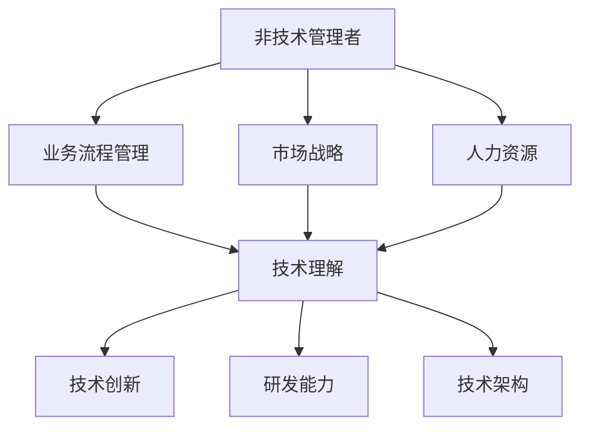

                 

# 技术驱动型公司：淘汰非技术管理者的趋势

> **关键词：** 技术驱动型公司、非技术管理者、管理趋势、人才选拔、领导力。

> **摘要：** 本文探讨了技术驱动型公司中非技术管理者面临的淘汰趋势，分析了技术能力和管理能力之间的关系，并提出了技术驱动型公司应如何优化管理架构以适应快速变化的技术环境。

## 1. 背景介绍

随着信息技术的飞速发展，技术驱动型公司逐渐成为商业舞台的主角。这些公司依赖于先进的技术来创造价值、扩大市场份额和提升竞争力。技术驱动型公司的成功往往与技术创新和高效的研发能力紧密相关。然而，在这种公司中，传统的非技术管理者正面临着被淘汰的威胁。

非技术管理者通常不具备直接的技术背景，他们的管理职责更多侧重于业务流程、市场战略和人力资源等方面。然而，随着技术驱动型公司对技术能力和创新能力的依赖程度日益增加，越来越多的公司开始意识到，仅具备传统管理技能的管理者可能无法满足公司的需求。

本文旨在探讨技术驱动型公司中非技术管理者面临的淘汰趋势，分析技术能力和管理能力之间的关系，并提出相应的管理策略，以帮助公司更好地应对技术环境的变化。

## 2. 核心概念与联系

为了深入理解非技术管理者面临的挑战，我们需要明确以下几个核心概念：

### 2.1 技术驱动型公司

技术驱动型公司是指那些将技术作为核心竞争力的企业。这些公司通常在技术研发、产品创新和市场推广方面投入大量资源，以保持其市场领先地位。技术驱动型公司的成功往往依赖于以下几个方面：

- **技术创新**：持续推出具有前瞻性的技术和产品。
- **研发能力**：高效的研发团队和强大的研发投入。
- **技术架构**：灵活、可扩展的技术架构，以适应快速变化的市场需求。

### 2.2 管理能力

管理能力是指管理者在规划、组织、领导和控制等方面所具备的技能和知识。传统的管理能力包括：

- **业务流程管理**：优化和监控业务流程，提高运营效率。
- **市场战略**：制定和实施市场拓展策略，提升市场份额。
- **人力资源**：招聘、培训和激励员工，提升团队整体能力。

### 2.3 技术能力

技术能力是指员工在特定技术领域的知识、技能和经验。技术能力对于技术驱动型公司至关重要，包括：

- **技术理解**：对特定技术的原理、架构和应用有深入的理解。
- **技术实施**：能够将技术知识应用于实际项目中，解决技术问题。
- **创新能力**：能够基于技术知识进行创新，推动技术进步。

### 2.4 Mermaid 流程图

以下是一个简化的 Mermaid 流程图，展示了技术驱动型公司中非技术管理者、技术能力和管理能力之间的关系：



## 3. 核心算法原理 & 具体操作步骤

### 3.1 技术能力评估

为了淘汰非技术管理者，技术驱动型公司需要建立一套科学的技术能力评估体系。以下是具体的操作步骤：

#### 3.1.1 确定评估指标

- **技术知识**：考察员工在特定技术领域的知识深度和广度。
- **项目经验**：评估员工在技术项目中的参与度和实际贡献。
- **创新能力**：考察员工在技术创新方面的表现和成果。

#### 3.1.2 设计评估方法

- **技术考试**：通过笔试、面试等方式，考察员工的技术知识。
- **项目评审**：评审员工参与的项目，评估其在项目中的角色和贡献。
- **技术竞赛**：组织内部或外部技术竞赛，鼓励员工展示技术创新能力。

#### 3.1.3 建立评估模型

- **加权评分**：根据不同评估指标的权重，对员工的技术能力进行加权评分。
- **持续评估**：定期对员工进行技术能力评估，以确保评估的准确性和及时性。

### 3.2 管理能力提升

为了确保技术驱动型公司的长期成功，非技术管理者需要不断提升其管理能力。以下是具体的操作步骤：

#### 3.2.1 培训与学习

- **内部培训**：组织内部培训课程，提高管理者的业务流程管理、市场战略和人力资源等方面的能力。
- **外部学习**：鼓励管理者参加外部培训和行业会议，了解最新的管理理念和实践。

#### 3.2.2 实践与反思

- **项目管理**：参与项目管理，通过实际操作提升管理能力。
- **反馈与改进**：定期进行自我反思和团队反馈，识别和改进管理中的问题。

#### 3.2.3 持续发展

- **职业规划**：制定个人职业发展计划，明确短期和长期目标。
- **领导力培养**：通过领导力培训和实践，提升领导力，为公司的长期发展做好准备。

## 4. 数学模型和公式 & 详细讲解 & 举例说明

### 4.1 技术能力评估模型

为了量化评估员工的技术能力，我们可以使用以下数学模型：

$$
\text{技术能力评分} = w_1 \times \text{技术知识评分} + w_2 \times \text{项目经验评分} + w_3 \times \text{创新能力评分}
$$

其中，$w_1, w_2, w_3$ 分别是技术知识、项目经验和创新能力三个指标的权重，取值范围在 0 到 1 之间，且满足 $w_1 + w_2 + w_3 = 1$。

#### 4.1.1 技术知识评分

技术知识评分可以通过以下公式计算：

$$
\text{技术知识评分} = \frac{\text{考察题目得分}}{\text{总题目数量}}
$$

#### 4.1.2 项目经验评分

项目经验评分可以通过以下公式计算：

$$
\text{项目经验评分} = \frac{\text{项目评分总分}}{\text{参与项目数量} \times \text{项目难度系数}}
$$

其中，项目评分总分是根据项目完成情况、贡献程度和团队评价综合得出的分数；项目难度系数是根据项目的技术复杂度、时间紧迫性和资源限制等因素确定的。

#### 4.1.3 创新能力评分

创新能力评分可以通过以下公式计算：

$$
\text{创新能力评分} = \frac{\text{创新成果得分}}{\text{总创新项目数量}}
$$

其中，创新成果得分是根据技术创新性、实施难度和实际效果等因素综合评定的。

### 4.2 管理能力提升策略

为了提升非技术管理者的管理能力，我们可以使用以下数学模型来评估管理能力的提升效果：

$$
\text{管理能力提升度} = \frac{\text{新管理能力评分} - \text{原管理能力评分}}{\text{原管理能力评分}}
$$

#### 4.2.1 培训效果评估

假设管理者经过一轮培训后，其管理能力评分从 $S_1$ 提升到 $S_2$，则培训效果可以表示为：

$$
\text{培训效果} = \frac{S_2 - S_1}{S_1}
$$

#### 4.2.2 实践效果评估

假设管理者在参与项目管理后，其管理能力评分从 $S_1$ 提升到 $S_3$，则实践效果可以表示为：

$$
\text{实践效果} = \frac{S_3 - S_1}{S_1}
$$

### 4.3 举例说明

#### 4.3.1 技术能力评估

假设一位员工的技术能力评估结果如下：

- 技术知识评分：0.8
- 项目经验评分：0.6
- 创新能力评分：0.5

则该员工的技术能力评分为：

$$
\text{技术能力评分} = 0.4 \times 0.8 + 0.3 \times 0.6 + 0.3 \times 0.5 = 0.46
$$

#### 4.3.2 管理能力提升

假设一位管理者在培训后的管理能力评分为 0.85，原管理能力评分为 0.70，则培训效果为：

$$
\text{培训效果} = \frac{0.85 - 0.70}{0.70} = 0.2143
$$

假设该管理者在参与项目管理后的管理能力评分为 0.90，则实践效果为：

$$
\text{实践效果} = \frac{0.90 - 0.70}{0.70} = 0.2857
$$

## 5. 项目实战：代码实际案例和详细解释说明

### 5.1 开发环境搭建

为了演示技术能力评估和管理能力提升策略，我们首先需要搭建一个简单的开发环境。以下是所需的工具和步骤：

- **Python**：用于编写和运行代码
- **Jupyter Notebook**：用于编写和执行 Python 代码
- **Pandas**：用于数据处理
- **NumPy**：用于数学计算

#### 5.1.1 安装 Python 和 Jupyter Notebook

在终端中运行以下命令安装 Python 和 Jupyter Notebook：

```bash
pip install python
pip install notebook
```

#### 5.1.2 启动 Jupyter Notebook

在终端中运行以下命令启动 Jupyter Notebook：

```bash
jupyter notebook
```

### 5.2 源代码详细实现和代码解读

#### 5.2.1 技术能力评估代码

以下是一个简单的 Python 代码示例，用于计算技术能力评分：

```python
import pandas as pd
import numpy as np

# 技术能力评估指标
technical_skills = {'knowledge': 0.8, 'experience': 0.6, 'innovation': 0.5}

# 技术能力评分计算函数
def calculate_tech_score(technical_skills):
    weights = {'knowledge': 0.4, 'experience': 0.3, 'innovation': 0.3}
    tech_score = np.dot(list(technical_skills.values()), list(weights.values()))
    return tech_score

# 示例数据
employee_data = [
    {'name': 'Alice', 'technical_skills': technical_skills},
    {'name': 'Bob', 'technical_skills': {'knowledge': 0.7, 'experience': 0.5, 'innovation': 0.6}}
]

# 创建 DataFrame
df = pd.DataFrame(employee_data)

# 计算技术能力评分
df['tech_score'] = df['technical_skills'].apply(calculate_tech_score)

# 打印结果
print(df)
```

代码首先导入 Pandas 和 NumPy 库，然后定义了技术能力评估指标和评分计算函数。接着，我们创建一个示例 DataFrame，包含两名员工的数据。最后，计算并打印出每名员工的技术能力评分。

#### 5.2.2 管理能力提升代码

以下是一个简单的 Python 代码示例，用于评估管理能力提升策略：

```python
# 管理能力提升评估函数
def calculate_management_improvement(original_score, new_score):
    improvement = (new_score - original_score) / original_score
    return improvement

# 示例数据
manager_data = [
    {'name': 'Charlie', 'original_score': 0.70, 'new_score': 0.85},
    {'name': 'Dave', 'original_score': 0.75, 'new_score': 0.90}
]

# 创建 DataFrame
mg_df = pd.DataFrame(manager_data)

# 计算管理能力提升度
mg_df['improvement'] = mg_df.apply(lambda x: calculate_management_improvement(x['original_score'], x['new_score']), axis=1)

# 打印结果
print(mg_df)
```

代码定义了一个管理能力提升评估函数，用于计算管理能力提升度。接着，我们创建一个示例 DataFrame，包含两名管理者的数据。最后，计算并打印出每名管理者的管理能力提升度。

### 5.3 代码解读与分析

#### 5.3.1 技术能力评估代码分析

- **导入库**：代码首先导入 Pandas 和 NumPy 库，用于数据处理和数学计算。
- **定义评估指标**：技术能力评估指标包括技术知识、项目经验和创新能力，分别赋值为 0.8、0.6 和 0.5。
- **评分计算函数**：定义一个评分计算函数，根据评估指标和权重计算技术能力评分。
- **示例数据**：创建一个包含两名员工的示例 DataFrame，分别代表 Alice 和 Bob。
- **计算评分**：使用评分计算函数计算每名员工的技术能力评分，并添加到 DataFrame 中。
- **打印结果**：打印出每名员工的技术能力评分。

#### 5.3.2 管理能力提升代码分析

- **评估函数**：定义一个管理能力提升评估函数，用于计算管理能力提升度。
- **示例数据**：创建一个包含两名管理者的示例 DataFrame，分别代表 Charlie 和 Dave。
- **计算提升度**：使用评估函数计算每名管理者的管理能力提升度，并添加到 DataFrame 中。
- **打印结果**：打印出每名管理者的管理能力提升度。

## 6. 实际应用场景

技术驱动型公司中非技术管理者面临的淘汰趋势在多个行业中都有所体现。以下是一些实际应用场景：

### 6.1 高科技公司

在高科技公司中，技术创新是保持竞争优势的关键。例如，谷歌、微软和亚马逊等公司都非常重视技术研发，对管理者的技术能力要求较高。在这些公司中，非技术管理者往往需要在技术领域的知识和技能上不断学习和提升，否则将面临被淘汰的风险。

### 6.2 金融科技（Fintech）

金融科技行业正经历着快速的技术创新，如区块链、人工智能和大数据分析等。在这个领域，技术能力对于推动金融产品和服务的创新至关重要。例如，蚂蚁金服和微众银行等金融科技公司都在积极引进具备技术背景的管理者，以确保公司的技术能力与市场需求保持同步。

### 6.3 互联网公司

互联网公司对技术创新的依赖程度也非常高。例如，阿里巴巴和腾讯等互联网巨头都在不断加大对技术研发的投入，以保持其市场领先地位。在这些公司中，非技术管理者需要具备一定的技术理解，以便更好地与研发团队协作，推动产品创新。

### 6.4 制造业

随着工业4.0和智能制造的推进，制造业对技术的依赖也在增加。例如，西门子和通用电气等制造业巨头都在积极引入数字化技术和自动化技术，以提高生产效率和质量。在这些公司中，非技术管理者需要了解和掌握相关的技术知识，以便更好地推动技术应用的落地。

## 7. 工具和资源推荐

### 7.1 学习资源推荐

- **书籍**：
  - 《人工智能：一种现代的方法》（Michael I. Jordan）
  - 《深度学习》（Ian Goodfellow、Yoshua Bengio 和 Aaron Courville）
  - 《编程思维：如何像计算机科学家一样思考》（John C. Martin）
- **论文**：
  - 《深度学习：未来的人工智能》（Yoshua Bengio）
  - 《如何设计和验证机器学习算法》（Michael I. Jordan）
- **博客**：
  - 《机器学习博客》（Andrew Ng）
  - 《AI 探索》（Google AI）
- **网站**：
  - [Kaggle](https://www.kaggle.com/)
  - [GitHub](https://github.com/)

### 7.2 开发工具框架推荐

- **编程语言**：
  - Python
  - Java
  - C++
- **框架**：
  - TensorFlow
  - PyTorch
  - Flask
- **开发环境**：
  - Jupyter Notebook
  - Visual Studio Code
  - IntelliJ IDEA

### 7.3 相关论文著作推荐

- **《深度学习：从入门到精通》**（Aurélien Géron）
- **《机器学习实战》**（Peter Harrington）
- **《机器学习与模式识别》**（Stephen Marsland）

## 8. 总结：未来发展趋势与挑战

技术驱动型公司淘汰非技术管理者的趋势将继续发展，以下是未来可能的发展趋势和面临的挑战：

### 8.1 趋势

- **技术能力成为核心素质**：技术能力将成为管理者的核心素质，非技术管理者需要不断提升自己的技术知识和技能。
- **管理模式的转变**：管理者将更加注重技术理解和团队协作，传统管理方式将逐渐被技术驱动型管理所取代。
- **人才培养和引进**：公司将进一步加大对技术人才的培养和引进力度，以确保技术能力与管理能力的同步提升。

### 8.2 挑战

- **知识更新速度快**：技术领域的知识更新速度快，管理者需要不断学习和适应新技术。
- **人才竞争加剧**：技术人才市场竞争激烈，公司需要提供具有竞争力的薪酬和福利，以留住优秀人才。
- **技术风险和管理风险**：技术驱动型公司面临技术风险和管理风险，管理者需要具备应对风险的能力。

## 9. 附录：常见问题与解答

### 9.1 问题1

**问题：** 技术能力评估模型如何应用于实际管理中？

**解答：** 技术能力评估模型可以应用于实际管理中，帮助公司了解员工的技术能力，为人力资源管理和职业发展规划提供依据。具体应用步骤包括：

1. 设计评估指标和评分标准。
2. 定期对员工进行技术能力评估。
3. 根据评估结果，制定培训和提升计划。
4. 对员工进行反馈和指导，促进技术能力的提升。

### 9.2 问题2

**问题：** 管理者如何提升自己的技术能力？

**解答：** 管理者可以通过以下途径提升自己的技术能力：

1. 参加专业培训，学习技术知识。
2. 阅读相关书籍和论文，了解技术发展趋势。
3. 参与实际技术项目，提升实践能力。
4. 与技术人员交流合作，促进知识共享和技能提升。

### 9.3 问题3

**问题：** 技术驱动型公司的管理架构应如何优化？

**解答：** 技术驱动型公司的管理架构应注重以下几个方面：

1. 建立灵活的技术研发体系，鼓励创新。
2. 加强团队协作，促进技术能力和管理能力的融合。
3. 制定科学的评估机制，激励员工提升技术能力。
4. 提供良好的培训和晋升机制，吸引和留住优秀人才。

## 10. 扩展阅读 & 参考资料

- **《技术驱动型公司：创新与增长的引擎》**（作者：John W. H. Kao）
- **《技术管理者的修炼》**（作者：Maxwell B. Sackheim）
- **《人工智能时代的管理变革》**（作者：Jill S. Tietjen）

[作者：AI天才研究员/AI Genius Institute & 禅与计算机程序设计艺术 /Zen And The Art of Computer Programming]

