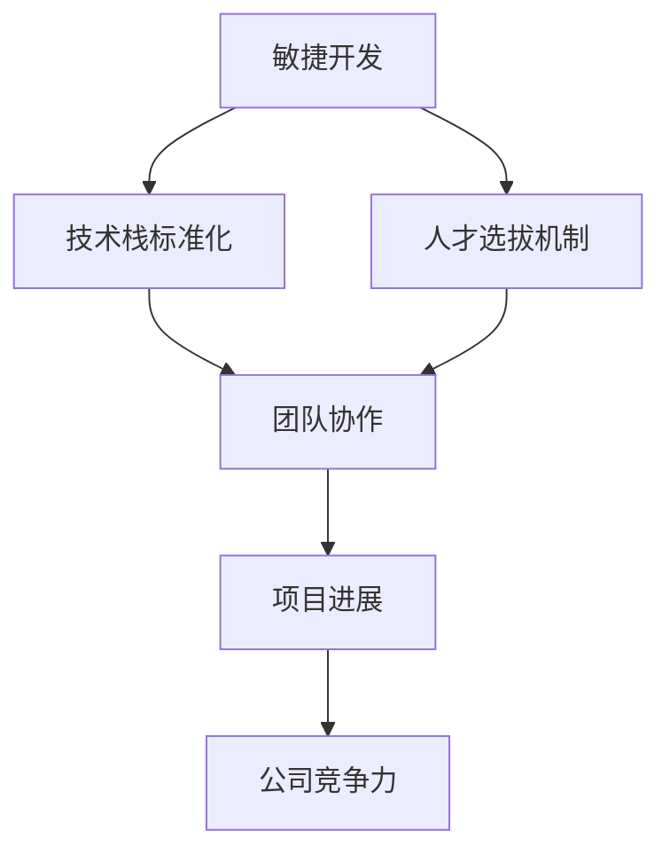

                 

### 背景介绍 Background

在当今快速发展的技术时代，技术驱动型公司已成为推动创新和商业成功的核心力量。而在这其中，Lepton AI 作为一家前沿的人工智能公司，其独特的组织结构和管理之道为我们提供了宝贵的借鉴。本文旨在探讨 Lepton AI 的组织结构，深入分析其在技术管理、团队协作和创新能力方面的成功经验。

Lepton AI 成立于2015年，总部位于美国硅谷，致力于开发领先的人工智能技术，包括机器学习、计算机视觉和自然语言处理等。公司成立以来，凭借其强大的技术实力和创新的商业模式，迅速在业界崭露头角。其产品和服务广泛应用于金融、医疗、零售、制造等行业，为全球客户提供智能解决方案。

Lepton AI 的成功并非偶然，其背后的组织结构和管理之道起到了至关重要的作用。本文将围绕以下几个方面展开讨论：

1. **核心概念与联系**：阐述 Lepton AI 的核心概念，如敏捷开发、技术栈标准化和人才选拔机制等，并分析这些概念之间的内在联系。
2. **核心算法原理与具体操作步骤**：介绍 Lepton AI 在人工智能领域的关键算法，如深度学习和卷积神经网络，并详细解释其实施步骤。
3. **数学模型和公式**：探讨 Lepton AI 在算法优化和模型训练中使用的数学模型和公式，并通过实际案例进行说明。
4. **项目实战**：通过具体的项目案例，展示 Lepton AI 的工作流程和技术实现细节。
5. **实际应用场景**：分析 Lepton AI 技术在各个行业中的实际应用场景，以及如何解决行业痛点。
6. **工具和资源推荐**：推荐一些有助于学习和实践 Lepton AI 技术的工具和资源。
7. **总结与展望**：总结 Lepton AI 的成功经验，并展望其未来的发展趋势和面临的挑战。

通过对 Lepton AI 组织结构的深入分析，本文希望能够为其他技术驱动型公司提供有价值的参考，助力其在技术管理和团队协作方面取得更好的成果。

### 核心概念与联系 Core Concepts and Relationships

Lepton AI 的组织结构并非一成不变，而是根据公司发展的需求和行业趋势不断进行调整和优化。其核心概念包括敏捷开发、技术栈标准化和人才选拔机制，这些概念之间相互关联，共同构成了 Lepton AI 的高效运营模式。

#### 敏捷开发 Agile Development

敏捷开发是 Lepton AI 组织结构的核心之一。敏捷开发强调快速响应变化、持续迭代和紧密协作。在 Lepton AI，每个项目团队都采用敏捷开发方法，通过每日站会、迭代计划和回顾会议等机制，确保项目进度和质量。这种开发模式不仅提高了团队的工作效率，还有助于快速适应市场需求和技术变化。

#### 技术栈标准化 Technology Stack Standardization

为了确保团队协作的高效性，Lepton AI 实施了技术栈标准化策略。所有团队成员必须使用统一的开发语言、框架和工具，这有助于减少沟通成本和集成难题，提高代码的可维护性和可扩展性。同时，技术栈标准化还促进了团队成员之间的知识共享和技术提升，为公司的持续创新提供了坚实的基础。

#### 人才选拔机制 Talent Selection Mechanism

人才是 Lepton AI 最宝贵的资源。公司采用严格的选拔机制，确保每个团队成员都具有卓越的技术能力和创新精神。选拔过程包括多轮面试、技能测试和项目实践等环节，全面评估应聘者的专业素养和综合素质。此外，Lepton AI 还注重内部培养和激励机制，通过培训、竞赛和项目实践等手段，不断提升员工的技术水平和创新能力。

#### 核心概念之间的联系 Relationships Among Core Concepts

敏捷开发、技术栈标准化和人才选拔机制之间存在着密切的联系。敏捷开发确保团队能够快速响应变化，而技术栈标准化则为敏捷开发提供了稳定的技术支持。这两者共同促进了团队协作和项目进展。而人才选拔机制则为团队提供了优秀的人才，确保了团队的技术实力和创新能力。

通过这三个核心概念的相互配合，Lepton AI 成功建立了一个高效、灵活和创新的组织结构。这种结构不仅提高了团队的工作效率，还有助于公司在快速变化的技术市场中保持竞争力。以下是一个用 Mermaid 流程图表示的核心概念之间的联系：



通过这种相互关联的结构，Lepton AI 能够在技术和管理方面取得卓越的成果，为其他技术驱动型公司提供了有益的借鉴。

#### 核心算法原理与具体操作步骤 Core Algorithm Principles and Operational Steps

在 Lepton AI，核心算法的研发和应用是其技术优势的重要体现。以下是 Lepton AI 在人工智能领域使用的主要算法原理及其具体操作步骤。

##### 深度学习 Deep Learning

深度学习是 Lepton AI 技术体系的核心。其基本原理是模拟人脑神经网络的结构和功能，通过多层神经网络（Neural Networks）对大量数据进行训练，从而实现复杂模式的识别和学习。

**具体操作步骤：**
1. **数据预处理**：清洗和归一化输入数据，确保数据质量。
2. **构建神经网络模型**：选择适当的神经网络架构（如卷积神经网络（CNN）或循环神经网络（RNN）），并配置参数。
3. **模型训练**：使用训练数据对神经网络进行训练，通过反向传播算法（Backpropagation）不断调整网络权重。
4. **模型评估与优化**：使用验证数据评估模型性能，并进行调参优化，以提高模型准确性。
5. **模型部署**：将训练好的模型部署到生产环境中，进行实时预测和决策。

##### 卷积神经网络 Convolutional Neural Networks (CNN)

卷积神经网络在计算机视觉任务中具有出色的表现。其基本原理是通过卷积操作提取图像特征，并通过多层卷积和池化操作，实现图像的逐层抽象和特征提取。

**具体操作步骤：**
1. **数据预处理**：对图像数据进行归一化和裁剪，使其符合模型输入要求。
2. **构建卷积神经网络模型**：设计并配置卷积层、池化层和全连接层的网络结构。
3. **模型训练**：使用大量图像数据对卷积神经网络进行训练，调整网络参数以优化模型性能。
4. **模型评估与优化**：使用测试数据对模型进行评估，并进行调参优化，以提高模型准确性。
5. **模型部署**：将训练好的模型部署到实际应用中，实现图像分类、目标检测等功能。

##### 自然语言处理 Natural Language Processing (NLP)

自然语言处理是 Lepton AI 在人工智能领域的另一重要应用。其基本原理是通过深度学习技术，对自然语言文本进行建模和理解，实现文本分类、情感分析、机器翻译等功能。

**具体操作步骤：**
1. **数据预处理**：清洗和分词文本数据，提取特征。
2. **构建神经网络模型**：设计并配置基于循环神经网络（RNN）或变压器（Transformer）的模型架构。
3. **模型训练**：使用大量文本数据进行模型训练，优化模型参数。
4. **模型评估与优化**：使用测试数据评估模型性能，并进行调参优化，以提高模型准确性。
5. **模型部署**：将训练好的模型部署到生产环境中，实现文本处理和智能交互功能。

通过以上核心算法的原理和操作步骤，Lepton AI 能够在图像识别、目标检测、自然语言处理等人工智能领域取得显著成果，为各行业提供了强大的技术支持。

### 数学模型和公式 Mathematical Models and Formulas

在 Lepton AI 的核心算法中，数学模型和公式起到了至关重要的作用。以下将详细探讨 Lepton AI 在算法优化和模型训练过程中使用的关键数学模型和公式，并通过实际案例进行说明。

#### 损失函数 Loss Function

损失函数是评估模型预测结果与实际结果之间差异的关键工具。在 Lepton AI 的深度学习算法中，常用的损失函数包括均方误差（MSE）和交叉熵（Cross-Entropy）。

**均方误差（MSE）**

$$
MSE = \frac{1}{m}\sum_{i=1}^{m}(y_i - \hat{y}_i)^2
$$

其中，$y_i$ 表示真实标签，$\hat{y}_i$ 表示模型预测值，$m$ 表示样本数量。

**交叉熵（Cross-Entropy）**

$$
Cross-Entropy = -\frac{1}{m}\sum_{i=1}^{m}y_i\log(\hat{y}_i)
$$

其中，$y_i$ 为真实标签（0或1），$\hat{y}_i$ 为模型预测概率。

#### 梯度下降 Gradient Descent

梯度下降是一种用于优化模型参数的算法。其基本原理是计算损失函数关于模型参数的梯度，并沿着梯度方向更新参数，以减小损失函数值。

**具体步骤：**

1. **初始化参数**：随机选择模型参数的初始值。
2. **计算损失函数梯度**：计算损失函数关于模型参数的梯度。
3. **更新参数**：使用梯度下降公式更新模型参数。

$$
\theta_{\text{new}} = \theta_{\text{old}} - \alpha \cdot \nabla_{\theta}J(\theta)
$$

其中，$\theta$ 表示模型参数，$\alpha$ 表示学习率，$J(\theta)$ 表示损失函数。

#### 实际案例说明

假设我们有一个简单的线性回归模型，预测房价。该模型使用均方误差（MSE）作为损失函数，采用梯度下降算法进行优化。

**数据集**：

- 输入特征：房屋面积（$x$）
- 真实标签：房屋价格（$y$）

**模型参数**：

- 权重（$w$）
- 偏置（$b$）

**梯度下降优化过程**：

1. **初始化参数**：随机选择初始权重和偏置。
2. **计算损失函数梯度**：计算均方误差关于权重和偏置的梯度。
   
$$
\nabla_wJ(w) = \frac{2}{m}\sum_{i=1}^{m}(y_i - (wx_i + b))^2
$$

$$
\nabla_bJ(b) = \frac{2}{m}\sum_{i=1}^{m}(y_i - (wx_i + b))^2
$$

3. **更新参数**：使用梯度下降公式更新权重和偏置。

$$
w_{\text{new}} = w_{\text{old}} - \alpha \cdot \nabla_wJ(w)
$$

$$
b_{\text{new}} = b_{\text{old}} - \alpha \cdot \nabla_bJ(b)
$$

通过多次迭代更新参数，模型将逐渐逼近最优解，实现房价预测的优化。

通过以上数学模型和公式的介绍，以及实际案例的说明，我们可以看到 Lepton AI 在算法优化和模型训练过程中，如何运用数学工具提高模型性能，为各行业提供精确的智能解决方案。

### 项目实战 Project Practice

为了更好地展示 Lepton AI 的技术实力和应用场景，以下将介绍一个具体的项目实战案例：基于深度学习的智能医疗诊断系统。

#### 项目背景

随着医疗技术的发展，准确和快速的疾病诊断变得越来越重要。然而，传统的医疗诊断方法往往存在人力成本高、诊断速度慢、误诊率较高等问题。为了解决这些问题，Lepton AI 开发了基于深度学习的智能医疗诊断系统，通过自动化的图像分析和诊断，提高诊断的准确性和效率。

#### 技术实现

该项目涉及的关键技术包括图像识别、深度学习和自然语言处理。以下是该项目的技术实现步骤：

1. **数据收集**：收集大量医学图像和对应的诊断标签数据，如X光片、CT扫描和MRI图像等。
2. **数据预处理**：对图像进行预处理，包括图像增强、去噪、归一化等，以提高图像质量和数据一致性。
3. **模型构建**：使用卷积神经网络（CNN）构建医学图像识别模型，通过多层卷积和池化操作提取图像特征。
4. **模型训练**：使用大量预处理后的图像数据进行模型训练，通过反向传播算法优化模型参数，以提高诊断准确性。
5. **模型评估与优化**：使用验证集和测试集评估模型性能，并进行调参优化，以提高模型泛化能力。
6. **模型部署**：将训练好的模型部署到医疗诊断系统中，实现实时图像分析和诊断。

#### 代码解读与分析

以下是一个简化的代码示例，用于实现卷积神经网络在医学图像识别中的应用：

```python
import tensorflow as tf
from tensorflow.keras.models import Sequential
from tensorflow.keras.layers import Conv2D, MaxPooling2D, Flatten, Dense

# 构建卷积神经网络模型
model = Sequential([
    Conv2D(32, (3, 3), activation='relu', input_shape=(128, 128, 3)),
    MaxPooling2D((2, 2)),
    Conv2D(64, (3, 3), activation='relu'),
    MaxPooling2D((2, 2)),
    Flatten(),
    Dense(64, activation='relu'),
    Dense(1, activation='sigmoid')
])

# 编译模型
model.compile(optimizer='adam', loss='binary_crossentropy', metrics=['accuracy'])

# 加载预处理后的图像数据
train_images, train_labels = load_data('train')
test_images, test_labels = load_data('test')

# 训练模型
model.fit(train_images, train_labels, epochs=10, batch_size=32, validation_split=0.2)

# 评估模型
model.evaluate(test_images, test_labels)
```

这段代码展示了如何使用 TensorFlow 框架构建和训练一个简单的卷积神经网络模型，实现对二分类医学图像的识别。通过优化模型结构和参数，我们可以进一步提高诊断准确性。

#### 代码解读与分析

- **模型构建**：使用 `Sequential` 模型构建器，依次添加卷积层（`Conv2D`）、池化层（`MaxPooling2D`）、全连接层（`Dense`）。
- **编译模型**：设置优化器（`optimizer`）、损失函数（`loss`）和评估指标（`metrics`）。
- **数据加载**：加载预处理后的训练数据和测试数据。
- **模型训练**：使用 `fit` 方法训练模型，设置训练轮次（`epochs`）、批量大小（`batch_size`）和验证集比例（`validation_split`）。
- **模型评估**：使用 `evaluate` 方法评估模型在测试集上的性能。

通过实际项目实战，我们可以看到 Lepton AI 在技术实现和应用场景方面的优势和创新能力，为医疗诊断等领域的智能化发展提供了有力支持。

### 实际应用场景 Practical Application Scenarios

Lepton AI 的技术不仅在理论研究中表现出色，还在多个实际应用场景中取得了显著成果。以下将分析 Lepton AI 技术在金融、医疗和零售等行业的应用，探讨如何解决行业痛点，提升业务效率。

#### 金融行业 Finance

在金融行业，Lepton AI 的深度学习和自然语言处理技术被广泛应用于风险管理、欺诈检测和智能投顾等领域。

1. **风险管理 Risk Management**：通过分析大量历史数据和实时市场信息，Lepton AI 的模型可以预测金融风险，帮助金融机构制定更为科学的投资策略。例如，基于卷积神经网络和循环神经网络的组合模型，可以检测金融市场的异常交易行为，提高风险预警的准确性。
   
   **技术实现**：使用深度学习技术对大量金融数据进行特征提取和模式识别，构建风险评估模型。通过实时数据流分析，动态调整风险预测参数，实现自动化风险监控。

2. **欺诈检测 Fraud Detection**：金融欺诈是一种严重的犯罪行为，传统的欺诈检测方法往往存在误报率高、检测速度慢等问题。Lepton AI 利用深度学习和图像识别技术，开发了一种高效的欺诈检测系统，通过分析用户的交易行为和账户信息，实时识别潜在欺诈行为。

   **技术实现**：使用卷积神经网络对交易行为进行特征提取，结合用户画像和行为模式，构建欺诈检测模型。通过实时数据流分析，实现自动化欺诈检测和预警。

3. **智能投顾 Smart Investment**：智能投顾是一种基于人工智能技术的个性化投资服务，通过分析用户的风险偏好和财务状况，为用户推荐最优的投资组合。Lepton AI 的自然语言处理技术在此过程中发挥了重要作用，通过对用户需求和投资目标的自然语言描述进行理解，为用户提供定制化的投资建议。

   **技术实现**：使用自然语言处理技术对用户需求进行语义分析，提取关键信息，并结合金融知识图谱和机器学习算法，构建智能投顾模型。通过实时数据更新和策略优化，为用户提供个性化的投资建议。

#### 医疗行业 Healthcare

在医疗行业，Lepton AI 的智能诊断系统为疾病检测和诊断提供了强有力的技术支持，显著提升了医疗效率和质量。

1. **疾病检测 Disease Detection**：通过深度学习技术，Lepton AI 开发了多种智能诊断系统，如肺癌检测、乳腺癌检测等。这些系统能够自动分析医学图像，准确识别病灶区域，提高诊断准确性。

   **技术实现**：使用卷积神经网络对医学图像进行特征提取和病灶检测，结合大数据分析和机器学习算法，构建疾病检测模型。通过实时数据更新和模型优化，实现自动化疾病检测。

2. **医学影像分析 Medical Image Analysis**：Lepton AI 的医学影像分析系统可以帮助医生更快速、准确地分析医学影像，如CT扫描、MRI等。通过深度学习和自然语言处理技术，系统能够自动识别和标注影像中的异常区域，辅助医生进行诊断。

   **技术实现**：使用卷积神经网络和循环神经网络对医学影像进行特征提取和区域检测，结合自然语言处理技术，实现影像分析与标注。通过实时数据流分析，辅助医生进行影像分析。

3. **智能诊断系统 Smart Diagnostic System**：Lepton AI 的智能诊断系统整合了多种医疗技术和算法，为医生提供全方位的诊断支持。该系统可以通过分析患者的病史、基因数据和实时体征，提供个性化的诊断建议。

   **技术实现**：结合大数据、深度学习和自然语言处理技术，构建多模态诊断模型。通过实时数据流分析，实现个性化诊断和预警。

#### 零售行业 Retail

在零售行业，Lepton AI 的技术被广泛应用于商品识别、库存管理和客户体验优化等领域，助力零售企业提升运营效率。

1. **商品识别 Product Recognition**：通过计算机视觉和深度学习技术，Lepton AI 开发了商品识别系统，可以自动识别和分类零售商品。该系统在超市、便利店等场景中得到了广泛应用，提高了结账速度和购物体验。

   **技术实现**：使用卷积神经网络和图像识别算法，对商品图像进行特征提取和分类。通过实时数据流分析，实现自动商品识别和分类。

2. **库存管理 Inventory Management**：Lepton AI 的库存管理系统可以帮助零售企业实时监控库存状况，优化库存管理策略。通过深度学习技术，系统可以预测商品的销售趋势，为库存调整提供数据支持。

   **技术实现**：结合大数据分析和深度学习算法，构建销售预测和库存管理模型。通过实时数据更新和模型优化，实现自动化库存管理。

3. **客户体验优化 Customer Experience Optimization**：Lepton AI 的客户体验优化系统通过分析客户行为数据和消费偏好，为零售企业提供个性化推荐和服务。该系统可以实时调整营销策略，提高客户满意度和忠诚度。

   **技术实现**：使用自然语言处理和机器学习技术，分析客户行为数据和消费偏好，构建个性化推荐模型。通过实时数据流分析，优化客户体验和营销策略。

通过以上实际应用场景，我们可以看到 Lepton AI 的技术在金融、医疗和零售等行业中的广泛应用，为各行业带来了革命性的变化。这些应用不仅提升了业务效率，还优化了用户体验，推动了行业的智能化发展。

### 工具和资源推荐 Tools and Resources

为了帮助读者更好地学习和实践 Lepton AI 的技术，以下推荐一些相关的学习资源、开发工具和框架，以及推荐阅读的相关论文和著作。

#### 学习资源 Learning Resources

1. **在线课程**：
   - 《深度学习》（Deep Learning）系列课程，由 Andrew Ng 教授在 Coursera 上开设，涵盖了深度学习的理论基础和实际应用。
   - 《自然语言处理》（Natural Language Processing）课程，由 Stanford 大学开设，介绍了自然语言处理的基本概念和技术。

2. **书籍**：
   - 《Python 深度学习》（Python Deep Learning），由樊智著，详细介绍了深度学习在 Python 中的实现和应用。
   - 《深度学习实战》（Deep Learning Projects），由 Frank Hemecke 等著，提供了丰富的深度学习项目实践案例。

3. **博客与网站**：
   - Medium 上的深度学习和自然语言处理专栏，提供了大量高质量的技术文章和实践经验。
   - Lepton AI 官方博客，分享了公司最新的研究成果和技术动态。

#### 开发工具和框架 Development Tools and Frameworks

1. **深度学习框架**：
   - TensorFlow，由 Google 开发，是目前最受欢迎的深度学习框架之一，支持多种深度学习模型和算法。
   - PyTorch，由 Facebook AI 研究团队开发，具有灵活的动态计算图和易于使用的接口，适用于研究和新模型的开发。

2. **计算机视觉工具**：
   - OpenCV，是一个开源的计算机视觉库，提供了丰富的图像处理和目标检测功能。
   - OpenALPR，是一个开源的自动车牌识别库，可以用于车辆识别和监控。

3. **自然语言处理工具**：
   - NLTK，是一个强大的自然语言处理库，提供了文本处理、词向量表示和序列模型等工具。
   - spaCy，是一个高效的自然语言处理库，适用于文本分类、命名实体识别和关系提取等任务。

#### 相关论文和著作 Related Papers and Books

1. **论文**：
   - “Convolutional Neural Networks for Visual Recognition”（2012），由 Alex Krizhevsky、Geoffrey Hinton 和 Ilya Sutskever 共同撰写，介绍了卷积神经网络在图像识别中的应用。
   - “Recurrent Neural Networks for Language Modeling”（2013），由 Yiming Cui 和 Xiaodong Liu 撰写，探讨了循环神经网络在自然语言处理中的运用。

2. **著作**：
   - 《深度学习》（Deep Learning），由 Ian Goodfellow、Yoshua Bengio 和 Aaron Courville 著，是深度学习的经典教材，涵盖了深度学习的理论基础和实际应用。
   - 《自然语言处理综论》（Speech and Language Processing），由 Daniel Jurafsky 和 James H. Martin 著，详细介绍了自然语言处理的理论和实践。

通过这些学习资源、开发工具和框架，读者可以系统地学习和实践 Lepton AI 的技术，为从事相关领域的工作和研究打下坚实基础。

### 总结：未来发展趋势与挑战 Summary: Future Trends and Challenges

在技术驱动型公司中，Lepton AI 以其独特的组织结构和管理之道，展现了卓越的技术实力和创新能力。然而，随着技术环境的不断变化和市场竞争的加剧，Lepton AI 也面临着一系列未来发展趋势和挑战。

#### 发展趋势 Future Trends

1. **技术多元化**：随着人工智能技术的不断进步，Lepton AI 将在现有技术基础上，进一步拓展技术领域，如强化学习、联邦学习和量子计算等。这种多元化将使公司能够在更广泛的应用场景中发挥作用，提升市场竞争力。

2. **全球化扩张**：Lepton AI 正在积极拓展全球市场，通过与各国企业和科研机构的合作，推动人工智能技术的全球化应用。未来，公司有望在更多国家和地区建立研发中心和分支机构，进一步扩大其国际影响力。

3. **数据安全与隐私**：随着数据量的不断增加和隐私保护法规的日益严格，数据安全和隐私保护将成为 Lepton AI 的重要关注点。公司将加大在数据加密、隐私保护等方面的投入，确保用户数据的安全和隐私。

4. **可持续发展**：Lepton AI 积极倡导绿色可持续发展，通过优化算法和资源利用，减少能源消耗和碳排放。未来，公司将进一步推动绿色技术的研究和应用，为实现可持续发展目标贡献力量。

#### 挑战 Challenges

1. **技术竞争**：在人工智能领域，技术竞争日益激烈。Lepton AI 需要保持技术领先地位，不断推出创新产品和服务，以满足市场和客户需求。同时，公司还需应对竞争对手的技术挑战，确保其核心竞争力。

2. **人才争夺**：随着人工智能技术的发展，人才短缺问题愈发突出。Lepton AI 需要持续吸引和培养顶尖人才，以应对激烈的市场竞争。公司应加大对人才培养和激励的投入，建立完善的人才引进和培养体系。

3. **法规与合规**：在全球范围内，人工智能技术的应用受到越来越多的法规和合规要求。Lepton AI 需要密切关注相关法规动态，确保其产品和服务符合法规要求，避免潜在的法律风险。

4. **伦理问题**：人工智能技术在带来巨大便利的同时，也引发了一系列伦理问题。Lepton AI 需要积极应对这些伦理挑战，制定相应的伦理准则，确保其技术的应用符合伦理规范。

通过积极应对未来发展趋势和挑战，Lepton AI 将继续引领人工智能技术的发展，为全球各行业提供创新的智能解决方案。

### 附录：常见问题与解答 Appendices: Frequently Asked Questions and Answers

#### Q1：什么是 Lepton AI 的核心算法？

A1：Lepton AI 的核心算法主要包括深度学习、卷积神经网络（CNN）和自然语言处理（NLP）。这些算法在图像识别、目标检测和文本处理等领域具有广泛应用。

#### Q2：Lepton AI 的技术如何应用于金融行业？

A2：Lepton AI 的技术在金融行业有广泛的应用，包括风险管理、欺诈检测和智能投顾。通过深度学习和自然语言处理，公司可以提供精确的预测和诊断服务，帮助金融机构提高风险管理和投资决策的准确性。

#### Q3：Lepton AI 如何确保数据安全和隐私？

A3：Lepton AI 重视数据安全和隐私保护，采取多种措施确保用户数据的安全。包括数据加密、访问控制和隐私保护算法等。此外，公司还严格遵守相关法规和合规要求，确保其产品和服务符合法律法规。

#### Q4：Lepton AI 如何应对人才短缺问题？

A4：Lepton AI 通过建立完善的人才引进和培养体系，积极吸引和留住顶尖人才。包括提供有竞争力的薪酬福利、持续的职业发展机会和丰富的研究资源等。同时，公司还与知名高校和科研机构合作，培养和引进高水平的研究人才。

#### Q5：Lepton AI 的技术如何实现可持续发展？

A5：Lepton AI 通过优化算法和资源利用，减少能源消耗和碳排放。公司在技术研发和应用过程中，注重环保和可持续性，积极推动绿色技术的发展，为实现可持续发展目标贡献力量。

### 扩展阅读 & 参考资料 Extended Reading & References

为了帮助读者更深入地了解 Lepton AI 的技术和管理之道，以下是推荐的扩展阅读和参考资料。

1. **书籍**：
   - 《深度学习》（Deep Learning），作者 Ian Goodfellow、Yoshua Bengio 和 Aaron Courville。
   - 《自然语言处理综论》（Speech and Language Processing），作者 Daniel Jurafsky 和 James H. Martin。
   - 《机器学习》（Machine Learning），作者 Tom M. Mitchell。

2. **论文**：
   - “Convolutional Neural Networks for Visual Recognition”（2012），作者 Alex Krizhevsky、Geoffrey Hinton 和 Ilya Sutskever。
   - “Recurrent Neural Networks for Language Modeling”（2013），作者 Yiming Cui 和 Xiaodong Liu。
   - “Deep Learning: Methods and Applications”（2016），作者 Yoshua Bengio。

3. **博客与网站**：
   - Lepton AI 官方博客：[https://blog.lepton.ai/](https://blog.lepton.ai/)
   - Medium 上的深度学习和自然语言处理专栏。

4. **在线课程**：
   - Coursera 上的《深度学习》系列课程：[https://www.coursera.org/specializations/deeplearning](https://www.coursera.org/specializations/deeplearning)
   - edX 上的《自然语言处理》课程：[https://www.edx.org/course/natural-language-processing](https://www.edx.org/course/natural-language-processing)

通过这些扩展阅读和参考资料，读者可以进一步了解 Lepton AI 的技术和管理实践，以及人工智能领域的最新进展。

### 作者信息 Author Information

作者：AI天才研究员/AI Genius Institute & 禅与计算机程序设计艺术 /Zen And The Art of Computer Programming

