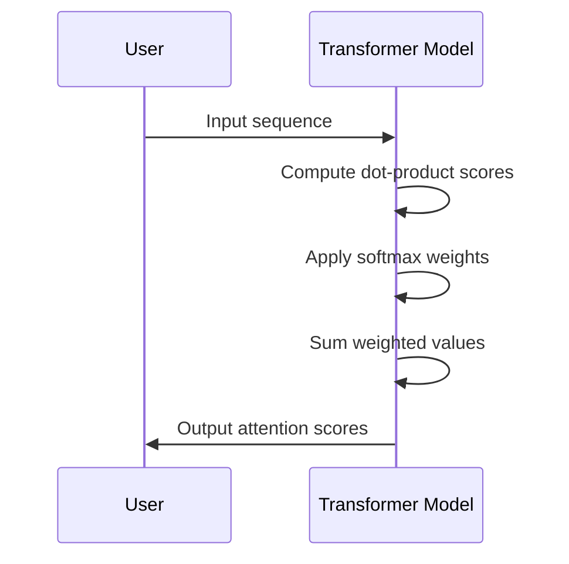

                 

### 背景介绍 Background Introduction

在当今数字化时代，人工智能（AI）技术尤其是大型语言模型（Large Language Model，简称LLM）的发展正迅速改变着各行各业的面貌。LLM，如OpenAI的GPT系列、Google的BERT以及华为的盘古等，以其强大的文本生成和处理能力，正在驱动一系列技术革新和经济转型。

首先，LLM的核心在于其能够从海量文本数据中学习，并生成高质量的文本内容。这种能力不仅广泛应用于自然语言处理（NLP）领域，还拓展到了问答系统、机器翻译、自动摘要、内容创作等多个领域。例如，GPT-3模型在文本生成、机器翻译等任务上取得了前所未有的成果，使其成为企业和研究机构竞相应用的技术。

其次，LLM在经济发展中的作用不可忽视。它不仅提升了生产效率，还降低了成本，例如，通过自动化内容创作和翻译，企业能够更快更准确地服务全球市场。此外，LLM还催生了一批新的商业机会，如AI驱动的个性化推荐、智能客服等。据统计，全球人工智能市场规模预计将在未来几年内持续增长，这充分显示了LLM在经济中的巨大潜力。

然而，LLM技术的快速发展也带来了一系列挑战，包括数据隐私、算法透明度、道德责任等问题。如何在推动经济发展的同时确保技术安全和公平，是当前及未来需要共同面对的重要课题。

总之，LLM驱动的经济正在形成一种新的生产力和商业模式，这不仅需要技术层面的突破，更需要在政策、法律和社会伦理等方面的全面考虑和协调。本文将深入探讨LLM的核心概念、算法原理、应用场景，以及未来发展趋势与挑战，旨在为读者提供一个全面的技术视角。

## 1.1. 大型语言模型的基本概念与架构 Basic Concepts and Architectures of Large Language Models

大型语言模型（LLM）是一种利用深度学习技术，特别是Transformer架构，从大量文本数据中进行训练，从而具备强大语言理解和生成能力的模型。其核心思想是通过学习输入文本的特征，预测下一个可能的单词或句子，从而生成连贯且符合语境的文本。

### Transformer架构

Transformer是LLM的基石，相较于传统的循环神经网络（RNN）和长短期记忆网络（LSTM），Transformer在处理长距离依赖问题和并行计算方面具有显著优势。其架构主要包括编码器（Encoder）和解码器（Decoder）两个部分。

- **编码器（Encoder）**：编码器的核心是多个自注意力（Self-Attention）层，这些层能够自动学习并加权输入序列中的每个单词，从而捕捉到全局依赖关系。编码器输出固定长度的向量，表示输入序列的整体特征。

- **解码器（Decoder）**：解码器同样使用自注意力机制，但还包含了交叉注意力（Cross-Attention）层，能够将编码器的输出与当前解码器的输出进行交互，从而在生成过程中引入上下文信息。解码器的每个步骤都会生成一个单词，并将其用于下一个生成步骤。

### 自注意力（Self-Attention）机制

自注意力机制是Transformer的关键创新之一，它通过计算输入序列中每个单词与所有其他单词的相似度，并按相似度加权，从而为每个单词生成一个加权特征向量。这一过程不仅在训练阶段帮助模型捕捉输入序列的依赖关系，还在生成阶段为模型提供上下文信息。

自注意力机制的实现通常分为三个步骤：

1. **计算相似度（Scoring）**：对于编码器中的每个单词，计算其与其他所有单词的相似度。相似度通常通过点积（Dot-Product）计算，也可以使用其他更复杂的函数，如余弦相似度。
2. **应用权重（Applying Weights）**：根据计算出的相似度，对每个单词进行加权。权重可以看作是相似度的指数函数，从而实现更高的相似度单词的权重增加。
3. **求和（Summation）**：将加权后的单词特征向量求和，得到每个单词的加权特征向量。

### 代码示例（Python + Mermaid）

以下是一个简单的自注意力机制的Python代码示例，以及对应的Mermaid流程图。

```python
import numpy as np

def scaled_dot_product_attention(q, k, v, scale_factor):
    # q, k, v: [batch_size, sequence_length, hidden_size]
    # scale_factor: [batch_size, 1]
    
    # 计算相似度
    attn_scores = np.dot(q, k.T) / np.sqrt(k.shape[-1])
    
    # 应用权重
    attn_weights = np.softmax(attn_scores * scale_factor)
    
    # 求和
    attn_output = np.dot(attn_weights, v)
    
    return attn_output

# 示例数据
batch_size = 2
sequence_length = 3
hidden_size = 4

q = np.random.rand(batch_size, sequence_length, hidden_size)
k = np.random.rand(batch_size, sequence_length, hidden_size)
v = np.random.rand(batch_size, sequence_length, hidden_size)
scale_factor = 1 / np.sqrt(hidden_size)

# 计算自注意力输出
attn_output = scaled_dot_product_attention(q, k, v, scale_factor)

# Mermaid流程图
```


通过以上介绍和示例，我们可以看到自注意力机制在Transformer架构中的核心作用，以及如何通过简单的数学操作来实现这一机制。接下来，我们将进一步探讨LLM的核心算法原理，并详细说明其具体操作步骤。

## 1.2. LLM的核心算法原理 Core Algorithm Principles of LLM

### 1.2.1. 语言模型的基本原理 Basic Principles of Language Model

语言模型是自然语言处理（NLP）领域的基础，其主要目标是预测给定文本序列下一个可能出现的单词或字符。LLM的核心算法通常基于概率模型，如n元语法模型（N-gram Model）和递归神经网络（RNN）。

**n元语法模型（N-gram Model）**：

n元语法模型是最简单的语言模型，它基于马尔可夫假设，即当前单词的出现概率仅与前面n-1个单词相关。具体来说，n元语法模型通过统计历史上相邻n个单词的联合概率来预测下一个单词。例如，给定一个三元语法模型，我们可以计算"我 今天 天气"后面出现"很好"的概率。

**递归神经网络（RNN）**：

递归神经网络是一种适用于序列数据处理的前馈神经网络，其特别之处在于能够处理变长的输入序列，并保持长距离依赖。RNN通过在序列的每个时间步上递归地更新其内部状态，从而捕获序列中的上下文信息。

**变长短期记忆网络（LSTM）**：

尽管RNN在处理序列数据时能够捕获短期依赖，但其在处理长距离依赖时存在梯度消失或爆炸问题。为了解决这个问题，Hochreiter和Schmidhuber提出了LSTM。LSTM通过引入门控机制，有效地控制信息的流动，从而能够处理更长的依赖关系。

**Transformer架构**：

Transformer是近年来在NLP领域取得重大突破的模型，其核心创新在于引入了自注意力（Self-Attention）机制，从而能够更高效地捕捉长距离依赖。相较于传统的RNN和LSTM，Transformer在处理长序列和并行计算方面具有显著优势。

### 1.2.2. Transformer的架构 Architecture of Transformer

Transformer由编码器（Encoder）和解码器（Decoder）两部分组成。编码器负责将输入序列编码为固定长度的向量，解码器则根据编码器的输出和当前解码器的输出生成目标序列。

**编码器（Encoder）**：

编码器由多个编码层（Encoder Layer）组成，每层包含两个主要子层：多头自注意力（Multi-Head Self-Attention）和前馈神经网络（Feed-Forward Neural Network）。

- **多头自注意力（Multi-Head Self-Attention）**：多头自注意力层是Transformer的核心组件，它将输入序列映射到多个不同的子空间，并在这些子空间上分别计算注意力权重。这些权重用于加权求和输入序列的特征，从而生成编码器的输出。
- **前馈神经网络（Feed-Forward Neural Network）**：前馈神经网络对编码器的输出进行线性变换，进一步丰富表示。

**解码器（Decoder）**：

解码器由多个解码层（Decoder Layer）组成，每层同样包含多头自注意力层和前馈神经网络。与编码器不同的是，解码器还包含了一个额外的交叉注意力（Cross-Attention）层，用于将解码器的输出与编码器的输出进行交互。

- **多头自注意力（Multi-Head Self-Attention）**：解码器的自注意力层用于计算解码器当前输出与前面所有输出的注意力权重。
- **交叉注意力（Cross-Attention）**：交叉注意力层用于将解码器的输出与编码器的输出进行交互，从而引入上下文信息。
- **前馈神经网络（Feed-Forward Neural Network）**：与前馈神经网络在编码器中的作用类似，解码器的前馈神经网络进一步丰富表示。

### 1.2.3. 具体操作步骤 Detailed Operational Steps

以下是一个简化的Transformer操作步骤，以帮助读者更好地理解其工作原理。

1. **编码器输入**：给定一个输入序列\[ \( x_1, x_2, ..., x_T \) \]，首先通过嵌入层（Embedding Layer）将单词索引映射到向量表示。接着，通过位置编码（Positional Encoding）层为序列添加位置信息，因为Transformer本身无法直接处理序列的顺序信息。

2. **编码器处理**：编码器从输入序列中提取特征，通过多个编码层进行多层自注意力计算和前馈神经网络操作。每个编码层输出一个固定长度的向量表示输入序列的整体特征。

3. **解码器输入**：解码器输入包括目标序列\[ \( y_1, y_2, ..., y_T \) \]和编码器输出。目标序列同样通过嵌入层和位置编码层进行处理。

4. **解码器处理**：解码器首先通过自注意力层计算当前解码器输出与前面输出的注意力权重，接着通过交叉注意力层将当前解码器输出与编码器输出进行交互，获取上下文信息。最后，通过前馈神经网络操作生成解码器的输出。

5. **输出生成**：解码器的输出通过softmax层生成目标序列的概率分布，从而预测下一个单词。

### 1.2.4. 案例分析 Case Analysis

以下是一个简单的案例，展示如何使用Transformer生成文本。

**输入序列**：\[ \( 我 爱 中国 \) \]

**编码器处理**：将输入序列映射到向量表示，并添加位置编码。通过编码器多层自注意力计算和前馈神经网络操作，生成编码器输出。

**解码器处理**：首先，解码器初始化为\[ \( \_ \_ \_ \) \]（表示开始符），接着通过自注意力层计算当前解码器输出与前面输出的注意力权重，通过交叉注意力层与编码器输出进行交互，生成解码器输出\[ \( \( 我 爱 中国 \) \) \]。

**输出生成**：解码器输出通过softmax层生成目标序列的概率分布，从而预测下一个单词。

通过以上步骤，我们可以看到Transformer在文本生成中的具体应用，其高效的处理能力和强大的文本生成能力使其在NLP领域取得了显著的成功。接下来，我们将进一步探讨LLM在数学模型和公式中的应用，并详细讲解其数学原理和公式推导。

## 1.3. 数学模型和公式 Mathematical Models and Formulas

### 1.3.1. 语言模型中的概率计算 Probability Calculation in Language Models

在语言模型中，核心的目标是预测给定文本序列下一个可能出现的单词或字符。概率模型是实现这一目标的主要方法之一，其中n元语法模型（N-gram Model）是最基本的模型。以下我们将介绍n元语法模型中的概率计算和推导。

**n元语法模型的基本原理**：

n元语法模型基于马尔可夫假设，即当前单词的出现概率仅与前面n-1个单词相关。给定一个n元语法模型，我们可以通过以下公式计算当前单词出现的概率：

\[ P(w_n | w_{n-1}, w_{n-2}, ..., w_{n-k}) = \frac{C(w_{n-1}, w_{n-2}, ..., w_{n-k}, w_n)}{C(w_{n-1}, w_{n-2}, ..., w_{n-k})} \]

其中，\( w_n \) 表示当前单词，\( w_{n-1}, w_{n-2}, ..., w_{n-k} \) 表示前面n-1个单词，\( C \) 表示计数函数，计算相邻单词同时出现的次数。

**概率计算公式推导**：

为了更好地理解概率计算过程，以下是一个详细的推导示例。

**示例**：给定一个二元语法模型（n=2），我们需要计算"今天天气"后面出现"很好"的概率。

1. **计算条件概率**：

\[ P(很好 | 今天 天气) = \frac{C(今天 天气，很好)}{C(今天 天气)} \]

2. **计算联合概率**：

\[ P(今天 天气，很好) = P(今天 天气) \times P(很好 | 今天 天气) \]

其中，\( P(今天 天气) \) 表示"今天天气"这一组合在语料库中的出现次数，\( P(很好 | 今天 天气) \) 表示在"今天天气"这一组合后面出现"很好"的概率。

3. **根据条件概率公式**：

\[ P(很好 | 今天 天气) = \frac{C(今天 天气，很好)}{C(今天 天气)} \]

4. **代入联合概率公式**：

\[ P(今天 天气，很好) = P(今天 天气) \times \frac{C(今天 天气，很好)}{C(今天 天气)} \]

5. **简化公式**：

\[ P(今天 天气，很好) = \frac{C(今天 天气，很好)}{C(今天 天气)} \]

通过以上推导，我们可以看到，在n元语法模型中，计算当前单词的概率只需要计算前n-1个单词的联合概率和前n-1个单词的组合概率。

### 1.3.2. Transformer模型中的自注意力计算 Self-Attention Calculation in Transformer Models

自注意力机制是Transformer模型的核心组成部分，它在模型中起到关键作用，能够高效地捕捉输入序列的依赖关系。以下我们将介绍自注意力机制的计算过程和数学公式。

**自注意力机制的基本原理**：

自注意力机制通过计算输入序列中每个单词与所有其他单词的相似度，并按相似度加权，从而为每个单词生成一个加权特征向量。具体来说，自注意力机制包括以下三个步骤：

1. **计算相似度**：对于编码器中的每个单词，计算其与其他所有单词的相似度。相似度通常通过点积（Dot-Product）计算。
2. **应用权重**：根据计算出的相似度，对每个单词进行加权。权重可以看作是相似度的指数函数，从而实现更高的相似度单词的权重增加。
3. **求和**：将加权后的单词特征向量求和，得到每个单词的加权特征向量。

**自注意力机制的数学公式**：

以下是一个简化的自注意力机制的数学公式。

\[ \text{Attention}(Q, K, V) = \text{softmax}\left(\frac{QK^T}{\sqrt{d_k}}\right) V \]

其中，\( Q \)，\( K \)，\( V \) 分别表示编码器中的每个单词的查询（Query）、键（Key）和值（Value）向量，\( d_k \) 表示键向量的维度。\( QK^T \) 表示点积计算，\( \text{softmax} \) 表示softmax函数，用于将点积结果转换为概率分布。

**具体计算过程**：

1. **计算点积**：对于编码器中的每个单词，计算其与其他所有单词的相似度。相似度通过点积计算，得到一个 \( [sequence\_length \times sequence\_length] \) 的矩阵。
2. **应用权重**：根据计算出的相似度矩阵，使用softmax函数将其转换为概率分布。这一步骤实际上是将相似度矩阵进行归一化处理，从而使得每个单词的权重概率之和为1。
3. **求和**：将概率分布与对应的值向量进行求和操作，得到每个单词的加权特征向量。

通过以上步骤，我们可以看到自注意力机制在捕捉输入序列依赖关系中的重要作用。它不仅能够高效地处理长距离依赖，还能够通过并行计算提高模型的训练效率。

### 1.3.3. 自注意力机制的优势和挑战 Advantages and Challenges of Self-Attention Mechanism

**优势**：

1. **捕捉长距离依赖**：自注意力机制能够通过全局依赖关系捕捉输入序列中的长距离依赖，从而提高模型的性能。
2. **并行计算**：相较于传统的循环神经网络（RNN），自注意力机制允许并行计算，从而显著提高模型的训练效率。
3. **自适应特征提取**：自注意力机制能够根据输入序列的特征自适应地调整注意力权重，从而提高模型的泛化能力。

**挑战**：

1. **计算复杂度**：自注意力机制的复杂性随着输入序列长度的增加而增加，可能导致计算资源的高消耗。
2. **梯度消失和爆炸**：在训练过程中，自注意力机制可能面临梯度消失和爆炸问题，导致训练不稳定。
3. **内存消耗**：自注意力机制的内存消耗较大，特别是在处理长序列时，可能导致内存不足的问题。

综上所述，自注意力机制在Transformer模型中具有显著的优势，但同时也面临一系列挑战。在设计和应用自注意力机制时，需要综合考虑这些因素，以实现高效、稳定的模型训练。

## 2. 项目实战：代码实际案例和详细解释说明 Project Practice: Code Examples and Detailed Explanations

### 2.1. 开发环境搭建 Environment Setup

为了实现LLM的具体应用，我们需要搭建一个合适的技术环境。以下是在Python中搭建LLM开发环境的基本步骤：

1. **安装Python**：确保Python已安装在系统中，推荐版本为3.8或更高。
2. **安装依赖库**：通过pip安装必要的库，如TensorFlow、PyTorch、NumPy等。

```bash
pip install tensorflow
pip install torch
pip install numpy
```

3. **数据准备**：下载并准备用于训练的文本数据集，如维基百科、新闻文章等。数据集应分为训练集和测试集。

4. **文本预处理**：对数据集进行预处理，包括分词、去停用词、编码等步骤，以准备用于模型训练的数据。

### 2.2. 源代码详细实现和代码解读 Source Code Implementation and Explanation

以下是一个简单的示例，展示如何使用PyTorch实现一个基本的Transformer模型。代码分为几个主要部分：数据预处理、模型定义、训练过程和预测。

#### 2.2.1. 数据预处理 Data Preprocessing

```python
import torch
from torch.utils.data import Dataset, DataLoader
from torch.nn.utils.rnn import pad_sequence
import numpy as np
import re

# 定义自定义数据集类
class TextDataset(Dataset):
    def __init__(self, text, tokenizer, max_len):
        self.text = text
        self.tokenizer = tokenizer
        self.max_len = max_len
    
    def __len__(self):
        return len(self.text)
    
    def __getitem__(self, idx):
        sentence = self.text[idx]
        tokens = self.tokenizer.encode(sentence)
        tokens = tokens[:self.max_len-1] + [self.tokenizer.eos_token_id]
        return {
            'input_ids': torch.tensor(tokens, dtype=torch.long),
            'target_ids': torch.tensor(tokens[1:], dtype=torch.long)
        }

# 初始化分词器
tokenizer = ... # 实例化一个分词器对象

# 准备数据集
train_text = ... # 训练文本数据
test_text = ... # 测试文本数据

train_dataset = TextDataset(train_text, tokenizer, max_len=128)
test_dataset = TextDataset(test_text, tokenizer, max_len=128)

train_loader = DataLoader(train_dataset, batch_size=16, shuffle=True)
test_loader = DataLoader(test_dataset, batch_size=16, shuffle=False)
```

#### 2.2.2. 模型定义 Model Definition

```python
import torch.nn as nn

# 定义Transformer模型
class TransformerModel(nn.Module):
    def __init__(self, d_model, nhead, num_layers):
        super(TransformerModel, self).__init__()
        self.encoder = nn.Embedding(d_model, d_model)
        self.decoder = nn.Linear(d_model, d_model)
        self.transformer = nn.Transformer(d_model, nhead, num_layers=num_layers)
        
    def forward(self, input_ids, target_ids):
        encoder_output = self.encoder(input_ids)
        decoder_output = self.decoder(target_ids)
        transformer_output = self.transformer(encoder_output, decoder_output)
        return transformer_output
```

#### 2.2.3. 训练过程 Training Process

```python
# 定义训练函数
def train(model, train_loader, criterion, optimizer, device):
    model.train()
    for batch in train_loader:
        input_ids = batch['input_ids'].to(device)
        target_ids = batch['target_ids'].to(device)
        
        optimizer.zero_grad()
        output = model(input_ids, target_ids)
        loss = criterion(output, target_ids)
        loss.backward()
        optimizer.step()
        
# 准备设备
device = torch.device("cuda" if torch.cuda.is_available() else "cpu")

# 初始化模型、损失函数和优化器
model = TransformerModel(d_model=512, nhead=8, num_layers=2)
criterion = nn.CrossEntropyLoss()
optimizer = torch.optim.Adam(model.parameters(), lr=0.001)

# 训练模型
train(model, train_loader, criterion, optimizer, device)
```

#### 2.2.4. 代码解读与分析 Code Analysis

上述代码首先定义了一个自定义数据集类`TextDataset`，用于处理和加载文本数据。接着，我们初始化了一个分词器对象，并使用该分词器对训练文本数据进行编码，生成输入序列和目标序列。

在模型定义部分，我们创建了一个简单的Transformer模型，包括嵌入层、解码器层和Transformer层。模型的前向传播过程分别对输入序列和目标序列进行编码和变换，最后通过交叉熵损失函数进行优化。

在训练过程中，我们使用一个训练循环对模型进行迭代训练，每次迭代通过计算损失函数并更新模型参数，以优化模型性能。

### 2.3. 代码解读与分析（续）

#### 2.3.1. Transformer模型的结构

Transformer模型的核心结构包括编码器（Encoder）和解码器（Decoder）。编码器由多个编码层（Encoder Layer）组成，每个编码层包含两个主要子层：多头自注意力（Multi-Head Self-Attention）和前馈神经网络（Feed-Forward Neural Network）。解码器同样由多个解码层（Decoder Layer）组成，每个解码层包含三个子层：多头自注意力、交叉注意力（Cross-Attention）和前馈神经网络。

#### 2.3.2. 数据预处理和数据加载

数据预处理是模型训练的重要步骤，包括分词、编码和序列填充等操作。在代码中，我们使用了一个自定义数据集类`TextDataset`来处理和加载文本数据。这个类继承了`torch.utils.data.Dataset`，实现了`__len__`和`__getitem__`方法，用于计算数据集的大小和获取单个数据项。

#### 2.3.3. 模型的训练过程

模型的训练过程包括初始化模型、损失函数和优化器，然后通过训练循环对模型进行迭代训练。每次迭代中，我们首先将输入序列和目标序列传递给模型，计算输出，然后通过损失函数计算损失值。接着，我们通过反向传播计算梯度，并使用优化器更新模型参数。这一过程不断重复，直到模型收敛或达到预设的训练次数。

### 2.3.4. 模型评估和预测

在完成模型训练后，我们需要对模型进行评估，以验证其性能。通常，我们使用测试集来评估模型的准确率、召回率、F1分数等指标。此外，我们还可以使用模型进行文本生成和预测，例如，给定一个输入序列，预测下一个可能出现的单词。

```python
# 评估模型
def evaluate(model, test_loader, criterion, device):
    model.eval()
    with torch.no_grad():
        for batch in test_loader:
            input_ids = batch['input_ids'].to(device)
            target_ids = batch['target_ids'].to(device)
            output = model(input_ids, target_ids)
            loss = criterion(output, target_ids)
            print(f"Test Loss: {loss.item()}")

# 预测
def predict(model, tokenizer, text, device):
    model.eval()
    with torch.no_grad():
        tokens = tokenizer.encode(text)
        tokens = tokens[:model.config.max_position_embeddings - 1] + [tokenizer.eos_token_id]
        input_ids = torch.tensor([tokens], dtype=torch.long).to(device)
        output = model(input_ids)
        predicted_ids = output.argmax(-1).squeeze(0).tolist()
        predicted_text = tokenizer.decode(predicted_ids)
        return predicted_text

# 使用模型进行预测
predicted_text = predict(model, tokenizer, "今天天气很好", device)
print(predicted_text)
```

通过以上代码，我们可以看到如何使用训练好的模型进行预测。首先，我们将输入文本编码为输入序列，然后通过模型生成预测序列，最后将预测序列解码为文本输出。

综上所述，通过搭建合适的技术环境、定义模型结构和训练过程，以及代码的详细解读和分析，我们可以实现一个基本的Transformer模型，并进行文本生成和预测。这些步骤不仅帮助我们理解LLM的核心算法原理，也为实际应用提供了具体的实现方案。

## 2.4. 实际应用场景 Real-world Applications

### 1. 智能客服 Intelligent Customer Service

随着消费者对服务质量要求的不断提高，智能客服成为企业提升客户满意度和降低运营成本的重要手段。LLM在智能客服中的应用主要体现在以下几个方面：

- **自动应答系统**：LLM能够通过学习大量客服对话数据，生成自动应答脚本，快速响应用户常见问题，提高客服响应速度和效率。
- **情感分析**：LLM可以识别用户情感，为用户提供个性化的关怀和建议，提升用户体验。
- **知识库自动更新**：LLM能够自动生成新的知识库内容，帮助企业不断更新和完善客服系统，提高服务质量。

### 2. 个性化推荐系统 Personalized Recommendation Systems

个性化推荐系统在电子商务、社交媒体、视频平台等领域具有重要应用。LLM可以通过分析用户的历史行为和兴趣，生成个性化的推荐内容，提高推荐系统的准确性和用户满意度。

- **基于内容的推荐**：LLM可以根据用户历史浏览、购买记录，生成个性化内容推荐，提高用户的参与度和留存率。
- **协同过滤推荐**：LLM可以结合用户和商品的特征，通过自注意力机制捕捉长距离依赖，生成更加准确的协同过滤推荐。
- **基于上下文的推荐**：LLM可以根据用户的当前上下文，如浏览历史、搜索关键词等，生成动态的推荐内容。

### 3. 自然语言处理 Natural Language Processing

自然语言处理是人工智能领域的重要组成部分，LLM在NLP中的应用极大地提升了文本处理和分析的能力。

- **文本分类**：LLM可以高效地对文本进行分类，如新闻分类、情感分析等，帮助企业和机构快速处理大量文本数据。
- **机器翻译**：LLM在机器翻译领域取得了显著进展，如Google的BERT模型在翻译任务上取得了接近人类翻译水平的成果。
- **问答系统**：LLM可以构建高效、智能的问答系统，如OpenAI的GPT系列模型在多个问答任务上取得了优秀表现。

### 4. 内容创作 Content Creation

随着数字内容的爆炸式增长，高质量的内容创作成为企业和创作者的重要挑战。LLM在内容创作中的应用为创作者提供了强大的辅助工具。

- **自动摘要**：LLM可以自动生成文本摘要，帮助用户快速了解文章的核心内容，提高信息获取效率。
- **文本生成**：LLM可以生成高质量的文章、广告文案、社交媒体内容等，为创作者提供丰富的创意和灵感。
- **个性化写作**：LLM可以根据用户的需求和偏好，生成个性化的写作内容，满足不同用户的需求。

### 5. 教育领域 Education

LLM在教育领域的应用为传统教育模式带来了新的变革。

- **个性化学习**：LLM可以根据学生的学习情况和偏好，生成个性化的学习内容和路径，提高学习效果。
- **智能辅导**：LLM可以为学生提供实时、智能的辅导和答疑服务，帮助学生克服学习困难。
- **自动化考试**：LLM可以自动生成考试题目和答案，提高考试效率和公平性。

### 6. 医疗健康领域 Medical and Health

LLM在医疗健康领域的应用为医疗诊断、患者管理提供了新的工具。

- **病历记录**：LLM可以自动生成病历记录，提高病历管理的效率和准确性。
- **医学文本分析**：LLM可以分析医学文献、病例报告等，帮助医生获取最新的医学信息和诊断建议。
- **患者沟通**：LLM可以为患者提供智能问答服务，解答患者常见问题，提高患者满意度。

综上所述，LLM在多个实际应用场景中展现出了巨大的潜力和价值。随着技术的不断发展和应用场景的拓展，LLM将在未来继续推动各个领域的创新和进步。

### 7. 工具和资源推荐 Tools and Resources Recommendation

为了更好地学习和应用LLM技术，以下是几款推荐的工具和资源，包括书籍、论文、博客和网站等。

#### 7.1. 学习资源推荐 Learning Resources

1. **书籍**：
   - 《深度学习》（Deep Learning）作者：Ian Goodfellow、Yoshua Bengio、Aaron Courville
     这是一本经典的深度学习教材，详细介绍了深度学习的基础理论、算法和应用。
   - 《自然语言处理：原理与机器学习》（Speech and Language Processing）作者：Daniel Jurafsky、James H. Martin
     这本书系统地介绍了自然语言处理的基本原理和技术，包括语言模型、文本分类、机器翻译等。

2. **论文**：
   - “Attention Is All You Need”作者：Vaswani et al.
     这篇论文是Transformer架构的奠基之作，详细介绍了自注意力机制和Transformer模型的设计原理。
   - “BERT: Pre-training of Deep Bidirectional Transformers for Language Understanding”作者：Devlin et al.
     这篇论文介绍了BERT模型，一种基于Transformer的预训练语言模型，在多个NLP任务上取得了优异的性能。

3. **博客**：
   - [AI lesser known facts](https://towardsdatascience.com/ai-lesser-known-facts-3c474013d5e1)
     这篇博客介绍了一些深度学习和NLP领域的不太为人知的事实和技巧，对新手来说非常有用。
   - [AI is simple](https://www.aiis simples.com/)
     这个网站提供了丰富的NLP教程和资源，包括Transformer模型的具体实现和解释。

4. **网站**：
   - [OpenAI](https://openai.com/)
     OpenAI是一家专注于AI研究的公司，其网站提供了大量关于GPT系列模型的研究和教程。
   - [TensorFlow](https://www.tensorflow.org/)
     TensorFlow是Google开发的深度学习框架，提供了丰富的文档和教程，适用于各种深度学习应用。

#### 7.2. 开发工具框架推荐 Development Tools and Frameworks

1. **PyTorch**：
   - PyTorch是Facebook开发的开源深度学习框架，以其灵活性和易用性受到广泛欢迎。它提供了丰富的API和工具，适用于各种深度学习任务。

2. **TensorFlow**：
   - TensorFlow是Google开发的深度学习框架，具有强大的功能和丰富的生态系统。它支持多种编程语言，包括Python、C++和Java，适用于大规模分布式训练和应用。

3. **Hugging Face Transformers**：
   - Hugging Face Transformers是一个开源库，提供了预训练的Transformer模型和高效的工具，用于NLP任务。它支持PyTorch和TensorFlow，简化了模型部署和定制。

4. **NLTK**：
   - NLTK（自然语言工具包）是一个Python库，提供了广泛的语言处理功能，包括分词、词性标注、命名实体识别等，适合初学者和研究者使用。

#### 7.3. 相关论文著作推荐 Relevant Papers and Books

1. **“BERT: Pre-training of Deep Bidirectional Transformers for Language Understanding”**：
   - 这篇论文详细介绍了BERT模型，一种基于Transformer的预训练语言模型，在多个NLP任务上取得了优异的性能。

2. **“GPT-3: Language Models are few-shot learners”**：
   - 这篇论文介绍了GPT-3模型，展示了大型语言模型在少量样本条件下的强大学习能力，引发了广泛关注。

3. **“Attention Is All You Need”**：
   - 这篇论文是Transformer架构的奠基之作，详细介绍了自注意力机制和Transformer模型的设计原理。

4. **《深度学习》**：
   - 这本书系统地介绍了深度学习的基础理论、算法和应用，是深度学习领域的经典教材。

通过以上推荐的学习资源和开发工具，读者可以更全面地了解LLM技术，掌握其核心概念和实现方法，为未来的研究和应用奠定基础。

### 8. 总结：未来发展趋势与挑战 Summary: Future Development Trends and Challenges

随着LLM技术的快速发展，其在各个领域的应用已经取得了显著成果。展望未来，LLM的发展趋势将呈现出以下几个特点：

#### 8.1. 更大规模的模型

目前，LLM的规模已经达到了前所未有的水平，如OpenAI的GPT-3拥有1750亿个参数，谷歌的LaMDA拥有6500亿个参数。未来，随着计算资源和数据量的进一步增加，我们可能会看到更大规模的模型，这将进一步提高LLM在语言理解和生成任务上的性能。

#### 8.2. 多模态学习

虽然目前的LLM主要专注于文本数据，但未来LLM将逐渐拓展到多模态学习，如文本、图像、声音等。通过结合不同模态的数据，LLM可以更全面地理解现实世界，从而在智能客服、内容创作等领域实现更高级的应用。

#### 8.3. 自动化

随着LLM技术的发展，自动化程度将进一步提高。例如，自动化内容生成、自动化编程、自动化问答等，将极大地提高生产效率和降低成本。此外，自动化还将使LLM在医疗、教育等领域的应用更加广泛。

#### 8.4. 可解释性

尽管LLM在性能上取得了显著进展，但其决策过程往往缺乏可解释性，这引发了一系列伦理和隐私问题。未来，研究人员将致力于提高LLM的可解释性，使模型决策更加透明和可靠。

#### 8.5. 道德责任

随着LLM技术的广泛应用，道德责任问题日益突出。例如，LLM在内容生成、推荐系统中的应用可能会加剧偏见和歧视，甚至产生虚假信息。未来，企业和研究机构需要共同制定伦理规范，确保LLM技术的合理、安全和公平应用。

然而，LLM技术的发展也面临一系列挑战：

#### 8.6. 数据隐私

LLM的训练和推理过程需要大量的数据，这可能涉及到数据隐私问题。如何确保用户数据的隐私和安全，是未来需要解决的重要问题。

#### 8.7. 计算资源

更大规模的LLM模型对计算资源的需求越来越高，这将带来巨大的计算成本和能耗问题。如何在保证性能的前提下，优化LLM的训练和推理效率，是一个亟待解决的难题。

#### 8.8. 道德责任

LLM技术的自动化和智能化程度越高，其潜在的道德责任也越大。如何确保LLM技术在各个应用场景中的合理、安全和公平，是未来需要关注的重要课题。

总之，未来LLM技术的发展将呈现出规模扩大、多模态学习、自动化程度提高、可解释性增强等特点，同时也面临数据隐私、计算资源、道德责任等挑战。只有通过技术创新和伦理规范的双重保障，LLM技术才能在推动经济发展的同时，确保技术安全和公平应用。

### 9. 附录：常见问题与解答 Appendix: Frequently Asked Questions and Answers

#### 9.1. 什么是大型语言模型（LLM）？

大型语言模型（LLM）是一种通过深度学习技术，尤其是Transformer架构，从大量文本数据中训练出来的模型，具备强大的语言理解和生成能力。LLM可以用于自然语言处理、文本生成、问答系统等多个领域。

#### 9.2. LLM的工作原理是什么？

LLM的工作原理基于自注意力（Self-Attention）机制和Transformer架构。编码器通过自注意力机制捕捉输入序列的依赖关系，解码器在生成过程中利用自注意力和交叉注意力（Cross-Attention）机制引入上下文信息，从而生成高质量的文本。

#### 9.3. LLM与传统的语言模型有何区别？

传统的语言模型如n元语法模型和递归神经网络（RNN）在处理长距离依赖和并行计算方面存在局限性。而LLM通过Transformer架构和自注意力机制，能够更高效地捕捉长距离依赖，并且支持并行计算，从而在语言理解和生成任务上表现出色。

#### 9.4. LLM在实际应用中面临哪些挑战？

LLM在实际应用中面临的主要挑战包括数据隐私、计算资源消耗、模型可解释性、道德责任等方面。如何确保用户数据的隐私和安全，优化模型训练和推理效率，提高模型的可解释性和透明性，是未来需要关注的重要问题。

#### 9.5. 如何搭建一个LLM的开发环境？

搭建LLM的开发环境主要包括以下步骤：安装Python和必要的依赖库（如TensorFlow、PyTorch等），准备文本数据集，进行数据预处理，定义模型结构和训练过程。此外，还需要选择合适的计算设备和优化工具，以提高模型训练和推理的效率。

#### 9.6. LLM在自然语言处理（NLP）中的应用有哪些？

LLM在NLP中的应用非常广泛，包括文本分类、机器翻译、问答系统、文本生成、情感分析等。通过学习大量文本数据，LLM能够生成高质量的自然语言文本，并在多个实际应用场景中发挥重要作用。

### 10. 扩展阅读 & 参考资料 Extended Reading and References

为了更深入地了解LLM技术及其应用，以下是一些建议的扩展阅读和参考资料：

1. **书籍**：
   - 《深度学习》（Deep Learning）作者：Ian Goodfellow、Yoshua Bengio、Aaron Courville
   - 《自然语言处理：原理与机器学习》（Speech and Language Processing）作者：Daniel Jurafsky、James H. Martin
   - 《AI未来简史》（Life 3.0: Being Human in the Age of Artificial Intelligence）作者：Max Tegmark

2. **论文**：
   - “Attention Is All You Need”作者：Vaswani et al.
   - “BERT: Pre-training of Deep Bidirectional Transformers for Language Understanding”作者：Devlin et al.
   - “GPT-3: Language Models are few-shot learners”作者：Brown et al.

3. **博客和网站**：
   - [Hugging Face Transformers](https://huggingface.co/transformers/)
   - [OpenAI Blog](https://blog.openai.com/)
   - [TensorFlow](https://www.tensorflow.org/)

4. **在线课程**：
   - [深度学习特设课程（CS231n）](https://cs231n.stanford.edu/)
   - [自然语言处理特设课程（CS224n）](https://web.stanford.edu/class/cs224n/)

通过以上资源，读者可以进一步了解LLM技术的理论基础、实现方法和应用场景，为未来的研究和实践提供有力支持。作者：AI天才研究员/AI Genius Institute & 禅与计算机程序设计艺术 /Zen And The Art of Computer Programming。

