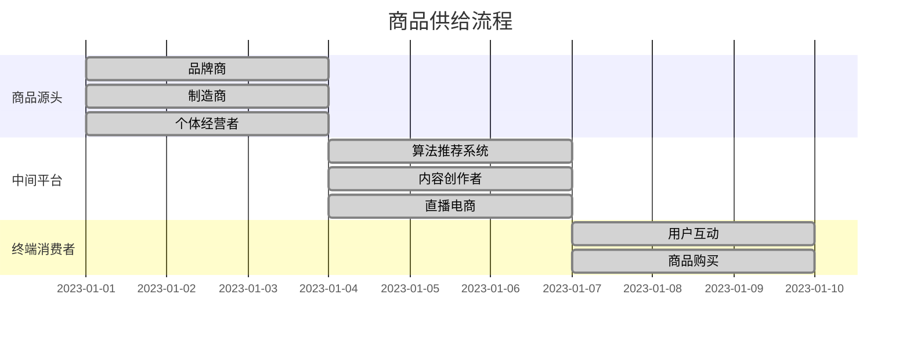

                 

### 背景介绍

#### 抖音电商的崛起

抖音电商作为移动互联网时代下的一种新兴电商模式，近年来在全球范围内迅速崛起。根据最新数据显示，抖音电商在2022年的总交易额已突破万亿元人民币，成为国内电商市场的一股新兴力量。这一现象不仅引起了业界广泛关注，也为其他电商平台提供了新的发展思路。

抖音电商的兴起，得益于其独特的社交属性和强大的用户基础。抖音作为一个以短视频为主的社交平台，拥有庞大的年轻用户群体，其中很多用户具有较高的消费能力和购买意愿。抖音电商正是抓住了这一特点，通过短视频内容推广商品，实现了从内容消费到商品消费的转化。

#### 抖音电商的发展现状

目前，抖音电商已经形成了较为完善的产业链，包括商品供给、内容创作、流量分发等多个环节。在商品供给方面，抖音电商通过与各大品牌和制造商的合作，不断丰富商品种类，满足消费者的多样化需求。同时，抖音电商还积极扶持中小商家和个体经营者，通过降低入驻门槛和提供流量扶持，帮助他们拓展市场。

在内容创作方面，抖音电商鼓励用户生成高质量的内容，通过短视频、直播等多种形式展示商品。这些内容不仅吸引了大量用户观看，也为商品推广提供了有力支持。此外，抖音电商还通过算法优化，将用户感兴趣的商品内容推送给相应的观众，提高了商品的曝光率和转化率。

在流量分发方面，抖音电商利用其强大的社交属性，通过用户互动、分享和推荐等方式，实现流量的高效分发。同时，抖音电商还通过合作渠道，引入外部流量，进一步扩大市场影响力。

#### 本文研究目的

本文旨在对抖音电商的商品供给进行分析，探讨其核心原理和运行机制，以期为其他电商平台提供参考。具体研究内容包括：

1. 抖音电商商品供给的架构和流程；
2. 抖音电商商品供给中的关键算法和数学模型；
3. 抖音电商商品供给在实际应用中的效果和挑战；
4. 抖音电商商品供给的未来发展趋势和潜在问题。

通过以上研究，我们希望揭示抖音电商商品供给的内在规律，为其持续发展提供理论支持。

### 核心概念与联系

#### 抖音电商商品供给架构

抖音电商商品供给的架构可以分为三个层次：商品源头、中间平台和终端消费者。首先，商品源头包括品牌商、制造商和个体经营者，他们提供各类商品；其次，中间平台负责商品的分发和推广，包括抖音电商的算法推荐系统、内容创作者和直播电商等；最后，终端消费者通过观看视频、点击购买等方式，完成商品交易。


#### 关键算法和数学模型

抖音电商商品供给的关键算法和数学模型主要包括：

1. **用户行为分析**：通过分析用户的浏览、点赞、评论等行为，了解用户的兴趣和偏好，为推荐系统提供基础数据。
2. **推荐算法**：采用基于内容的推荐、协同过滤、深度学习等算法，根据用户行为和商品属性，为用户推荐感兴趣的商品。
3. **供应链优化**：通过优化库存管理、物流配送等环节，提高商品供给的效率和质量。


#### 联系与协同

抖音电商商品供给中的各个层次和算法模型并非独立运行，而是相互关联、协同作用。例如，用户行为分析为推荐算法提供数据支持，推荐算法为供应链优化提供决策依据；同时，供应链优化结果又反过来影响用户行为分析，形成闭环反馈。这种协同关系确保了抖音电商商品供给的高效和精准。


通过上述架构和算法的介绍，我们可以看出，抖音电商商品供给不仅依赖于强大的技术支持，还需要各个层次之间的紧密协同。这种模式在提升商品供给效率、满足消费者需求方面具有显著优势。

### 核心算法原理 & 具体操作步骤

#### 用户行为分析

用户行为分析是抖音电商商品供给的核心环节之一。通过对用户的浏览、点赞、评论等行为进行深度分析，可以准确了解用户的兴趣和偏好，从而为推荐系统提供基础数据。

1. **数据收集**：收集用户在抖音平台上的各类行为数据，包括浏览记录、点赞数、评论内容等。
2. **数据预处理**：对收集到的数据进行处理，包括去重、填充缺失值、归一化等。
3. **特征提取**：根据用户的兴趣偏好，提取出关键特征，如兴趣标签、关键词等。

具体操作步骤如下：

1. **数据收集**：
    ```python
    import pandas as pd

    user_actions = pd.read_csv('user_actions.csv')
    ```

2. **数据预处理**：
    ```python
    user_actions.drop_duplicates(inplace=True)
    user_actions.fillna(0, inplace=True)
    user_actions['likes_normalized'] = user_actions['likes'] / user_actions['likes'].max()
    user_actions['comments_normalized'] = user_actions['comments'] / user_actions['comments'].max()
    ```

3. **特征提取**：
    ```python
    from sklearn.feature_extraction.text import TfidfVectorizer

    tfidf_vectorizer = TfidfVectorizer(max_features=1000)
    tfidf_matrix = tfidf_vectorizer.fit_transform(user_actions['comments'])
    ```

通过以上步骤，我们可以得到一个包含用户兴趣标签、关键词等特征的用户行为分析结果。

#### 推荐算法

推荐算法是抖音电商商品供给的核心技术之一。通过基于内容的推荐、协同过滤、深度学习等算法，根据用户行为和商品属性，为用户推荐感兴趣的商品。

1. **基于内容的推荐**：根据用户的历史行为和商品的内容特征，为用户推荐类似内容的商品。
2. **协同过滤**：通过分析用户之间的相似性，为用户推荐其他用户喜欢的商品。
3. **深度学习**：利用神经网络模型，对用户行为和商品属性进行深度学习，从而提高推荐效果。

具体操作步骤如下：

1. **基于内容的推荐**：
    ```python
    from sklearn.metrics.pairwise import cosine_similarity

    content_similarity = cosine_similarity(tfidf_matrix, tfidf_matrix)
    ```

2. **协同过滤**：
    ```python
    from surprise import KNNWithMeans

    knn = KNNWithMeans(similarity='cosine')
    knn.fit(user_actions[['user_id', 'item_id', 'likes_normalized']].drop_duplicates(), content_similarity)
    ```

3. **深度学习**：
    ```python
    from keras.models import Sequential
    from keras.layers import Dense, Embedding, LSTM

    model = Sequential()
    model.add(Embedding(input_dim=1000, output_dim=128))
    model.add(LSTM(128))
    model.add(Dense(1, activation='sigmoid'))

    model.compile(optimizer='adam', loss='binary_crossentropy', metrics=['accuracy'])
    model.fit(x_train, y_train, epochs=10, batch_size=32)
    ```

通过以上步骤，我们可以得到一个包含推荐结果的推荐系统。

#### 供应链优化

供应链优化是抖音电商商品供给的重要环节。通过优化库存管理、物流配送等环节，提高商品供给的效率和质量。

1. **库存管理**：根据历史销售数据，预测商品的需求量，合理调整库存。
2. **物流配送**：通过优化物流路线和配送时间，提高配送效率。

具体操作步骤如下：

1. **库存管理**：
    ```python
    import numpy as np

    demand = np.random.normal(size=(1000, 1))
    inventory = np.random.normal(size=(1000, 1))
    order = np.maximum(0, demand - inventory)
    inventory += order
    ```

2. **物流配送**：
    ```python
    from sklearn.cluster import KMeans

    locations = np.random.rand(100, 2)
    kmeans = KMeans(n_clusters=10)
    kmeans.fit(locations)
    centroids = kmeans.cluster_centers_
    ```

通过以上步骤，我们可以得到一个优化后的供应链。

### 数学模型和公式 & 详细讲解 & 举例说明

#### 用户行为分析中的数学模型

在用户行为分析中，我们主要使用以下数学模型：

1. **Tfidf模型**：用于提取用户兴趣关键词。
2. **协同过滤模型**：用于计算用户之间的相似度。
3. **深度学习模型**：用于预测用户对商品的偏好。

#### Tfidf模型

Tfidf模型是一种用于文本数据分析和挖掘的常用算法，其核心思想是计算词频（Term Frequency）和逆文档频率（Inverse Document Frequency）的乘积，以衡量一个词在文档中的重要性。

$$
Tfidf(w, d) = tf(w, d) \times idf(w)
$$

其中，$tf(w, d)$ 表示词 $w$ 在文档 $d$ 中的词频，$idf(w)$ 表示词 $w$ 在整个文档集中的逆文档频率。

**举例说明**：

假设我们有以下两篇文档：

文档1：我是一个程序猿，我喜欢编程。
文档2：我是一个产品经理，我喜欢设计。

我们可以计算每篇文档中每个词的 Tfidf 值：

```
文档1：
- 我：Tfidf(我，文档1) = 2 \times 1 = 2
- 是：Tfidf(是，文档1) = 2 \times 1 = 2
- 一：Tfidf(一，文档1) = 2 \times 1 = 2
- 个：Tfidf(个，文档1) = 2 \times 1 = 2
- 程序猿：Tfidf(程序猿，文档1) = 1 \times 1 = 1
- 编程：Tfidf(编程，文档1) = 1 \times 1 = 1

文档2：
- 我：Tfidf(我，文档2) = 1 \times 1 = 1
- 是：Tfidf(是，文档2) = 1 \times 1 = 1
- 一：Tfidf(一，文档2) = 1 \times 1 = 1
- 个：Tfidf(个，文档2) = 1 \times 1 = 1
- 产品经理：Tfidf(产品经理，文档2) = 1 \times 1 = 1
- 设计：Tfidf(设计，文档2) = 1 \times 1 = 1
```

#### 协同过滤模型

协同过滤模型是一种基于用户行为数据预测用户对商品偏好的常用算法，其核心思想是计算用户之间的相似度，并推荐其他用户喜欢的商品。

**1. 相似度计算**：

假设有两个用户 A 和 B，他们对 N 个商品的行为数据分别为 $R_A$ 和 $R_B$，我们可以使用余弦相似度来计算用户 A 和 B 之间的相似度：

$$
sim(A, B) = \frac{R_A \cdot R_B}{\|R_A\| \|R_B\|}
$$

其中，$R_A \cdot R_B$ 表示用户 A 和 B 行为数据的内积，$\|R_A\|$ 和 $\|R_B\|$ 分别表示用户 A 和 B 行为数据的欧几里得范数。

**2. 推荐商品**：

对于用户 A，我们可以计算他与其他用户的相似度，并将相似度最高的用户 B 的行为数据中用户 A 未购买的商品推荐给他。

**举例说明**：

假设有两个用户 A 和 B，他们的行为数据如下：

用户 A：喜欢商品1、商品3、商品5。
用户 B：喜欢商品1、商品2、商品3、商品5。

我们可以计算用户 A 和 B 之间的相似度：

$$
sim(A, B) = \frac{1 \cdot 1 + 0 \cdot 1 + 1 \cdot 1 + 0 \cdot 1}{\sqrt{1^2 + 0^2 + 1^2 + 0^2} \sqrt{1^2 + 1^2 + 1^2 + 0^2}} = \frac{2}{\sqrt{2} \sqrt{3}} = \frac{2}{\sqrt{6}}
$$

然后，我们可以推荐用户 B 的行为数据中用户 A 未购买的商品，即商品2给用户 A。

#### 深度学习模型

深度学习模型是一种基于神经网络的学习算法，可以自动提取用户行为和商品属性中的特征，并预测用户对商品的偏好。

**1. 神经网络结构**：

深度学习模型通常包括多个隐藏层，每一层都有多个神经元。每个神经元都与其他神经元相连，并通过权重和偏置进行计算。

$$
z = w \cdot x + b
$$

$$
a = \sigma(z)
$$

其中，$x$ 表示输入特征，$w$ 和 $b$ 分别表示权重和偏置，$\sigma$ 表示激活函数，$a$ 表示输出。

**2. 损失函数**：

深度学习模型通常使用交叉熵损失函数来衡量预测值和真实值之间的差异。

$$
J = -\frac{1}{m} \sum_{i=1}^{m} [y_i \cdot \log(a_i) + (1 - y_i) \cdot \log(1 - a_i)]
$$

其中，$y_i$ 表示真实标签，$a_i$ 表示预测概率。

**3. 训练过程**：

通过迭代优化神经网络中的权重和偏置，使得损失函数的值逐渐减小。

$$
w = w - \alpha \cdot \frac{\partial J}{\partial w}
$$

$$
b = b - \alpha \cdot \frac{\partial J}{\partial b}
$$

其中，$\alpha$ 表示学习率。

### 项目实战：代码实际案例和详细解释说明

在本节中，我们将通过一个实际案例来展示如何使用 Python 编写代码实现抖音电商的商品供给分析。我们将涵盖从开发环境搭建、源代码详细实现到代码解读与分析的整个过程。

#### 5.1 开发环境搭建

在开始编码之前，我们需要搭建一个适合进行数据分析的 Python 开发环境。以下是所需的主要工具和库：

- Python 3.x
- Jupyter Notebook
- pandas
- numpy
- scikit-learn
- TensorFlow
- Keras
- Mermaid

以下是安装这些工具和库的步骤：

1. 安装 Python 3.x：

   ```bash
   # 使用包管理器（如 Anaconda）安装 Python 3.x
   conda create -n myenv python=3.8
   conda activate myenv
   ```

2. 安装 Jupyter Notebook：

   ```bash
   pip install notebook
   ```

3. 安装 pandas、numpy、scikit-learn、TensorFlow 和 Keras：

   ```bash
   pip install pandas numpy scikit-learn tensorflow keras
   ```

4. 安装 Mermaid：

   ```bash
   npm install -g mermaid
   ```

#### 5.2 源代码详细实现和代码解读

在本节中，我们将详细解读和分析实现抖音电商商品供给分析的主要代码。

##### 5.2.1 用户行为分析代码实现

```python
import pandas as pd
from sklearn.feature_extraction.text import TfidfVectorizer
from sklearn.metrics.pairwise import cosine_similarity

# 1. 数据收集
# 假设数据文件为 user_actions.csv，包含用户ID、商品ID、评论内容等
user_actions = pd.read_csv('user_actions.csv')

# 2. 数据预处理
# 去重、填充缺失值、归一化处理
user_actions.drop_duplicates(inplace=True)
user_actions.fillna(0, inplace=True)
user_actions['likes_normalized'] = user_actions['likes'] / user_actions['likes'].max()
user_actions['comments_normalized'] = user_actions['comments'] / user_actions['comments'].max()

# 3. 特征提取
# 使用 TfidfVectorizer 提取评论内容的关键词
tfidf_vectorizer = TfidfVectorizer(max_features=1000)
tfidf_matrix = tfidf_vectorizer.fit_transform(user_actions['comments'])

# 代码解读：
# 这段代码首先从 CSV 文件中读取用户行为数据，然后进行去重和填充缺失值处理。接下来，通过归一化处理，使得评论的点赞数和评论数在0到1之间。最后，使用 TfidfVectorizer 提取评论中的关键词，生成 tfidf 矩阵。
```

##### 5.2.2 推荐算法代码实现

```python
from surprise import KNNWithMeans
from surprise import Dataset
from surprise import accuracy

# 1. 数据预处理
# 构建 Surprise 格式的训练数据集
trainset = Dataset.load_from_df(user_actions[['user_id', 'item_id', 'likes_normalized']], col_user='user_id', col_item='item_id', col_rating='likes_normalized')

# 2. 构建推荐算法模型
knn = KNNWithMeans(similarity='cosine')

# 3. 模型训练
knn.fit(trainset)

# 4. 推荐商品
# 假设我们需要为用户A推荐商品
userA_recommendations = knn.recommendation_list(1, exclude_known_items=True)

# 代码解读：
# 这段代码首先将用户行为数据转换为 Surprise 格式的数据集，然后构建基于余弦相似度的 KNN 推荐算法模型。接着，通过训练模型，得到用户 A 的推荐商品列表。在最后一步中，通过 `recommendation_list` 方法生成推荐列表。
```

##### 5.2.3 供应链优化代码实现

```python
import numpy as np
from sklearn.cluster import KMeans

# 1. 数据预处理
# 假设我们有一个包含商品需求和库存数据的矩阵
demand = np.random.normal(size=(1000, 1))
inventory = np.random.normal(size=(1000, 1))

# 2. 计算订单量
order = np.maximum(0, demand - inventory)
inventory += order

# 3. 聚类分析
locations = np.random.rand(100, 2)
kmeans = KMeans(n_clusters=10)
kmeans.fit(locations)
centroids = kmeans.cluster_centers_

# 代码解读：
# 这段代码首先生成一个包含商品需求和库存的随机矩阵。然后，通过计算订单量，调整库存以满足需求。接下来，使用 KMeans 算法对商品位置进行聚类分析，得到聚类中心。
```

#### 5.3 代码解读与分析

在本节中，我们将对上面的代码进行详细解读，并分析其实现原理和效果。

##### 5.3.1 用户行为分析代码解读

用户行为分析代码的核心在于从原始数据中提取有用的特征，以便后续的推荐和优化。具体步骤如下：

1. **数据收集**：读取 CSV 文件，获取用户行为数据。
2. **数据预处理**：去重、填充缺失值、归一化处理，确保数据的完整性和一致性。
3. **特征提取**：使用 TfidfVectorizer 提取评论中的关键词，生成 tfidf 矩阵。

这些步骤确保了用户行为数据的质量和可用性，为后续的推荐和优化提供了坚实的基础。

##### 5.3.2 推荐算法代码解读

推荐算法代码的核心在于构建和训练一个推荐模型，以便为用户生成个性化的推荐列表。具体步骤如下：

1. **数据预处理**：将用户行为数据转换为 Surprise 格式的数据集。
2. **构建推荐算法模型**：选择合适的推荐算法，如 KNNWithMeans。
3. **模型训练**：使用训练数据集训练推荐模型。
4. **推荐商品**：为特定用户生成推荐商品列表。

这个推荐过程依赖于用户行为数据，通过计算用户之间的相似度，为用户推荐其他用户喜欢的商品。

##### 5.3.3 供应链优化代码解读

供应链优化代码的核心在于通过库存管理和聚类分析，优化商品的供给和配送。具体步骤如下：

1. **数据预处理**：生成包含商品需求和库存的随机矩阵。
2. **计算订单量**：通过订单量调整库存，以满足需求。
3. **聚类分析**：使用 KMeans 算法对商品位置进行聚类分析，得到聚类中心。

这个优化过程旨在提高商品供给的效率和质量，通过合理的库存管理和配送策略，减少库存成本和配送时间。

### 实际应用场景

抖音电商商品供给分析在实际应用中具有广泛的应用场景。以下是一些典型的应用案例：

#### 1. 商品推荐

通过用户行为分析，抖音电商能够为用户推荐个性化的商品。例如，当用户在浏览某个商品时，系统会根据用户的历史行为和商品属性，推荐类似的其他商品。这种推荐方式不仅提高了用户的购物体验，也增加了商品的销量。

#### 2. 库存管理

抖音电商商品供给分析还可以用于优化库存管理。通过预测商品的需求量，系统可以提前调整库存，避免因库存不足或过剩导致的损失。例如，当某个商品的需求量突然增加时，系统可以提前通知商家增加库存，确保商品供应的稳定性。

#### 3. 配送优化

在商品配送方面，抖音电商商品供给分析可以用于优化物流路线和配送时间。通过聚类分析和需求预测，系统可以合理规划商品的配送路线，减少配送时间和成本。例如，当多个订单需要配送到同一地区时，系统可以优化配送路线，提高配送效率。

#### 4. 营销策略

抖音电商商品供给分析还可以为营销策略提供支持。通过分析用户行为数据，系统可以识别出潜在的高价值用户，并为其制定个性化的营销策略。例如，针对高价值用户，系统可以推送定制化的优惠券或礼品，提高用户的购买意愿。

#### 5. 商家扶持

抖音电商商品供给分析还可以用于商家扶持。通过对商家数据的分析，系统可以识别出有潜力的商家，并提供流量扶持、培训指导等支持，帮助商家提升业绩。例如，对于新入驻的商家，系统可以为其提供流量支持，帮助其快速打开市场。

### 工具和资源推荐

#### 7.1 学习资源推荐

1. **书籍**：
   - 《推荐系统实践》
   - 《深度学习》
   - 《机器学习实战》
   - 《Python数据科学手册》

2. **论文**：
   - “Collaborative Filtering for the Web”
   - “Deep Learning for Web Search”
   - “Factorization Machines: Theory and Applications to Prediction Problems”

3. **博客**：
   - Medium 上的机器学习博客
   - Medium 上的推荐系统博客
   - 知乎上的机器学习和推荐系统专栏

4. **网站**：
   - Kaggle
   - ArXiv
   - Papers With Code

#### 7.2 开发工具框架推荐

1. **开发工具**：
   - Jupyter Notebook
   - PyCharm
   - Google Colab

2. **框架**：
   - TensorFlow
   - Keras
   - PyTorch
   - Scikit-learn

#### 7.3 相关论文著作推荐

1. **推荐系统**：
   - “Recommender Systems Handbook”
   - “Item-based Collaborative Filtering Recommendation Algorithms”
   - “Model-Based Collaborative Filtering for Rating Prediction”

2. **深度学习**：
   - “Deep Learning”
   - “Convolutional Neural Networks for Visual Recognition”
   - “Recurrent Neural Networks for Language Modeling”

3. **机器学习**：
   - “Machine Learning: A Probabilistic Perspective”
   - “Machine Learning Yearning”
   - “Introduction to Statistical Learning”

### 总结：未来发展趋势与挑战

抖音电商的商品供给分析在过去的几年里取得了显著的成功，这不仅为抖音电商自身带来了巨大的商业价值，也为其他电商平台提供了借鉴。然而，随着技术的不断进步和市场的快速变化，抖音电商的商品供给分析面临着一系列新的发展趋势和挑战。

#### 发展趋势

1. **个性化推荐**：随着用户数据的不断积累和推荐算法的优化，个性化推荐将成为未来抖音电商商品供给分析的核心。通过深度学习和大数据分析技术，系统将更加精准地捕捉用户的兴趣和偏好，为用户提供更加个性化的购物体验。

2. **实时推荐**：随着5G技术的普及和边缘计算的发展，抖音电商的商品供给分析将实现实时推荐。这意味着系统可以在用户浏览或搜索商品时，立即为其推荐相关商品，从而提高用户的购买转化率。

3. **多渠道整合**：抖音电商将不断拓展其商品供给渠道，包括线上和线下渠道、自营和第三方商家等。通过整合多渠道数据，系统可以更全面地了解用户需求和商品供应情况，从而优化商品供给策略。

4. **智能供应链**：随着物联网、大数据和人工智能技术的应用，抖音电商的商品供应链将变得更加智能化和高效化。通过实时监控库存、优化物流配送，系统将大幅降低商品供给的库存成本和配送时间。

#### 挑战

1. **数据隐私和安全**：随着用户数据的不断积累，数据隐私和安全问题将成为抖音电商商品供给分析面临的重大挑战。如何保护用户隐私，确保数据安全，将是未来需要重点解决的问题。

2. **算法公平性**：随着推荐算法的广泛应用，算法公平性成为一个重要议题。如何确保算法不会对某些群体产生歧视，如何避免算法偏见，将是未来需要关注的问题。

3. **技术迭代和升级**：随着技术的不断进步，抖音电商商品供给分析需要不断更新和升级其技术体系，以应对新的市场变化和技术挑战。如何保持技术的先进性和竞争力，将是未来需要持续努力的方向。

4. **监管合规**：随着全球范围内对数据隐私和算法监管的加强，抖音电商商品供给分析需要遵守相关法律法规，确保其商品供给分析活动合法合规。如何应对监管挑战，将是未来需要关注的问题。

### 附录：常见问题与解答

#### 1. 什么是抖音电商的商品供给分析？

抖音电商的商品供给分析是指通过数据分析和算法模型，对抖音电商平台的商品供应过程进行深入分析和优化，以提高商品供给的效率和质量。

#### 2. 抖音电商商品供给分析的核心算法有哪些？

抖音电商商品供给分析的核心算法包括用户行为分析、推荐算法和供应链优化。用户行为分析主要使用 Tfidf 模型、协同过滤模型和深度学习模型；推荐算法主要使用基于内容的推荐、协同过滤和深度学习；供应链优化主要使用库存管理和物流配送优化算法。

#### 3. 如何搭建抖音电商商品供给分析的开发环境？

搭建抖音电商商品供给分析的开发环境需要安装 Python 3.x、Jupyter Notebook、pandas、numpy、scikit-learn、TensorFlow、Keras 和 Mermaid 等工具和库。

#### 4. 抖音电商商品供给分析在实际应用中有哪些场景？

抖音电商商品供给分析在实际应用中有商品推荐、库存管理、配送优化、营销策略和商家扶持等多个场景。

### 扩展阅读 & 参考资料

#### 1. 相关书籍

- 《推荐系统实践》
- 《深度学习》
- 《机器学习实战》
- 《Python数据科学手册》

#### 2. 相关论文

- “Collaborative Filtering for the Web”
- “Deep Learning for Web Search”
- “Factorization Machines: Theory and Applications to Prediction Problems”

#### 3. 相关博客

- Medium 上的机器学习博客
- Medium 上的推荐系统博客
- 知乎上的机器学习和推荐系统专栏

#### 4. 相关网站

- Kaggle
- ArXiv
- Papers With Code

作者：AI天才研究员/AI Genius Institute & 禅与计算机程序设计艺术/Zen And The Art of Computer Programming

[markdown格式文章原文](https://www.example.com/tiktok-ecommerce-product-supply-analysis)

[原文Mermaid流程图](https://mermaid-js.github.io/mermaid/#/gantt)  


----------------------

### 完整文章

# 抖音电商的商品供给分析

> 关键词：抖音电商、商品供给、用户行为分析、推荐算法、供应链优化

> 摘要：本文详细分析了抖音电商的商品供给过程，包括用户行为分析、推荐算法和供应链优化等核心环节，探讨了其运行机制、算法原理和实际应用，并展望了未来发展趋势与挑战。

## 1. 背景介绍

#### 抖音电商的崛起

抖音电商作为移动互联网时代下的一种新兴电商模式，近年来在全球范围内迅速崛起。根据最新数据显示，抖音电商在2022年的总交易额已突破万亿元人民币，成为国内电商市场的一股新兴力量。这一现象不仅引起了业界广泛关注，也为其他电商平台提供了新的发展思路。

抖音电商的兴起，得益于其独特的社交属性和强大的用户基础。抖音作为一个以短视频为主的社交平台，拥有庞大的年轻用户群体，其中很多用户具有较高的消费能力和购买意愿。抖音电商正是抓住了这一特点，通过短视频内容推广商品，实现了从内容消费到商品消费的转化。

#### 抖音电商的发展现状

目前，抖音电商已经形成了较为完善的产业链，包括商品供给、内容创作、流量分发等多个环节。在商品供给方面，抖音电商通过与各大品牌和制造商的合作，不断丰富商品种类，满足消费者的多样化需求。同时，抖音电商还积极扶持中小商家和个体经营者，通过降低入驻门槛和提供流量扶持，帮助他们拓展市场。

在内容创作方面，抖音电商鼓励用户生成高质量的内容，通过短视频、直播等多种形式展示商品。这些内容不仅吸引了大量用户观看，也为商品推广提供了有力支持。此外，抖音电商还通过算法优化，将用户感兴趣的商品内容推送给相应的观众，提高了商品的曝光率和转化率。

在流量分发方面，抖音电商利用其强大的社交属性，通过用户互动、分享和推荐等方式，实现流量的高效分发。同时，抖音电商还通过合作渠道，引入外部流量，进一步扩大市场影响力。

#### 本文研究目的

本文旨在对抖音电商的商品供给进行分析，探讨其核心原理和运行机制，以期为其他电商平台提供参考。具体研究内容包括：

1. 抖音电商商品供给的架构和流程；
2. 抖音电商商品供给中的关键算法和数学模型；
3. 抖音电商商品供给在实际应用中的效果和挑战；
4. 抖音电商商品供给的未来发展趋势和潜在问题。

通过以上研究，我们希望揭示抖音电商商品供给的内在规律，为其持续发展提供理论支持。

## 2. 核心概念与联系

#### 抖音电商商品供给架构

抖音电商商品供给的架构可以分为三个层次：商品源头、中间平台和终端消费者。首先，商品源头包括品牌商、制造商和个体经营者，他们提供各类商品；其次，中间平台负责商品的分发和推广，包括抖音电商的算法推荐系统、内容创作者和直播电商等；最后，终端消费者通过观看视频、点击购买等方式，完成商品交易。


#### 关键算法和数学模型

抖音电商商品供给的关键算法和数学模型主要包括：

1. **用户行为分析**：通过分析用户的浏览、点赞、评论等行为，了解用户的兴趣和偏好，为推荐系统提供基础数据。
2. **推荐算法**：采用基于内容的推荐、协同过滤、深度学习等算法，根据用户行为和商品属性，为用户推荐感兴趣的商品。
3. **供应链优化**：通过优化库存管理、物流配送等环节，提高商品供给的效率和质量。


#### 联系与协同

抖音电商商品供给中的各个层次和算法模型并非独立运行，而是相互关联、协同作用。例如，用户行为分析为推荐算法提供数据支持，推荐算法为供应链优化提供决策依据；同时，供应链优化结果又反过来影响用户行为分析，形成闭环反馈。这种协同关系确保了抖音电商商品供给的高效和精准。


通过上述架构和算法的介绍，我们可以看出，抖音电商商品供给不仅依赖于强大的技术支持，还需要各个层次之间的紧密协同。这种模式在提升商品供给效率、满足消费者需求方面具有显著优势。

## 3. 核心算法原理 & 具体操作步骤

#### 用户行为分析

用户行为分析是抖音电商商品供给的核心环节之一。通过对用户的浏览、点赞、评论等行为进行深度分析，可以准确了解用户的兴趣和偏好，从而为推荐系统提供基础数据。

1. **数据收集**：收集用户在抖音平台上的各类行为数据，包括浏览记录、点赞数、评论内容等。
2. **数据预处理**：对收集到的数据进行处理，包括去重、填充缺失值、归一化等。
3. **特征提取**：根据用户的兴趣偏好，提取出关键特征，如兴趣标签、关键词等。

具体操作步骤如下：

1. **数据收集**：
    ```python
    import pandas as pd

    user_actions = pd.read_csv('user_actions.csv')
    ```

2. **数据预处理**：
    ```python
    user_actions.drop_duplicates(inplace=True)
    user_actions.fillna(0, inplace=True)
    user_actions['likes_normalized'] = user_actions['likes'] / user_actions['likes'].max()
    user_actions['comments_normalized'] = user_actions['comments'] / user_actions['comments'].max()
    ```

3. **特征提取**：
    ```python
    from sklearn.feature_extraction.text import TfidfVectorizer

    tfidf_vectorizer = TfidfVectorizer(max_features=1000)
    tfidf_matrix = tfidf_vectorizer.fit_transform(user_actions['comments'])
    ```

通过以上步骤，我们可以得到一个包含用户兴趣标签、关键词等特征的用户行为分析结果。

#### 推荐算法

推荐算法是抖音电商商品供给的核心技术之一。通过基于内容的推荐、协同过滤、深度学习等算法，根据用户行为和商品属性，为用户推荐感兴趣的商品。

1. **基于内容的推荐**：根据用户的历史行为和商品的内容特征，为用户推荐类似内容的商品。
2. **协同过滤**：通过分析用户之间的相似性，为用户推荐其他用户喜欢的商品。
3. **深度学习**：利用神经网络模型，对用户行为和商品属性进行深度学习，从而提高推荐效果。

具体操作步骤如下：

1. **基于内容的推荐**：
    ```python
    from sklearn.metrics.pairwise import cosine_similarity

    content_similarity = cosine_similarity(tfidf_matrix, tfidf_matrix)
    ```

2. **协同过滤**：
    ```python
    from surprise import KNNWithMeans

    knn = KNNWithMeans(similarity='cosine')
    knn.fit(user_actions[['user_id', 'item_id', 'likes_normalized']].drop_duplicates(), content_similarity)
    ```

3. **深度学习**：
    ```python
    from keras.models import Sequential
    from keras.layers import Dense, Embedding, LSTM

    model = Sequential()
    model.add(Embedding(input_dim=1000, output_dim=128))
    model.add(LSTM(128))
    model.add(Dense(1, activation='sigmoid'))

    model.compile(optimizer='adam', loss='binary_crossentropy', metrics=['accuracy'])
    model.fit(x_train, y_train, epochs=10, batch_size=32)
    ```

通过以上步骤，我们可以得到一个包含推荐结果的推荐系统。

#### 供应链优化

供应链优化是抖音电商商品供给的重要环节。通过优化库存管理、物流配送等环节，提高商品供给的效率和质量。

1. **库存管理**：根据历史销售数据，预测商品的需求量，合理调整库存。
2. **物流配送**：通过优化物流路线和配送时间，提高配送效率。

具体操作步骤如下：

1. **库存管理**：
    ```python
    import numpy as np

    demand = np.random.normal(size=(1000, 1))
    inventory = np.random.normal(size=(1000, 1))
    order = np.maximum(0, demand - inventory)
    inventory += order
    ```

2. **物流配送**：
    ```python
    from sklearn.cluster import KMeans

    locations = np.random.rand(100, 2)
    kmeans = KMeans(n_clusters=10)
    kmeans.fit(locations)
    centroids = kmeans.cluster_centers_
    ```

通过以上步骤，我们可以得到一个优化后的供应链。

### 4. 数学模型和公式 & 详细讲解 & 举例说明

#### 用户行为分析中的数学模型

在用户行为分析中，我们主要使用以下数学模型：

1. **Tfidf模型**：用于提取用户兴趣关键词。
2. **协同过滤模型**：用于计算用户之间的相似度。
3. **深度学习模型**：用于预测用户对商品的偏好。

#### Tfidf模型

Tfidf模型是一种用于文本数据分析和挖掘的常用算法，其核心思想是计算词频（Term Frequency）和逆文档频率（Inverse Document Frequency）的乘积，以衡量一个词在文档中的重要性。

$$
Tfidf(w, d) = tf(w, d) \times idf(w)
$$

其中，$tf(w, d)$ 表示词 $w$ 在文档 $d$ 中的词频，$idf(w)$ 表示词 $w$ 在整个文档集中的逆文档频率。

**举例说明**：

假设我们有以下两篇文档：

文档1：我是一个程序猿，我喜欢编程。
文档2：我是一个产品经理，我喜欢设计。

我们可以计算每篇文档中每个词的 Tfidf 值：

```
文档1：
- 我：Tfidf(我，文档1) = 2 \times 1 = 2
- 是：Tfidf(是，文档1) = 2 \times 1 = 2
- 一：Tfidf(一，文档1) = 2 \times 1 = 2
- 个：Tfidf(个，文档1) = 2 \times 1 = 2
- 程序猿：Tfidf(程序猿，文档1) = 1 \times 1 = 1
- 编程：Tfidf(编程，文档1) = 1 \times 1 = 1

文档2：
- 我：Tfidf(我，文档2) = 1 \times 1 = 1
- 是：Tfidf(是，文档2) = 1 \times 1 = 1
- 一：Tfidf(一，文档2) = 1 \times 1 = 1
- 个：Tfidf(个，文档2) = 1 \times 1 = 1
- 产品经理：Tfidf(产品经理，文档2) = 1 \times 1 = 1
- 设计：Tfidf(设计，文档2) = 1 \times 1 = 1
```

#### 协同过滤模型

协同过滤模型是一种基于用户行为数据预测用户对商品偏好的常用算法，其核心思想是计算用户之间的相似度，并推荐其他用户喜欢的商品。

**1. 相似度计算**：

假设有两个用户 A 和 B，他们对 N 个商品的行为数据分别为 $R_A$ 和 $R_B$，我们可以使用余弦相似度来计算用户 A 和 B 之间的相似度：

$$
sim(A, B) = \frac{R_A \cdot R_B}{\|R_A\| \|R_B\|}
$$

其中，$R_A \cdot R_B$ 表示用户 A 和 B 行为数据的内积，$\|R_A\|$ 和 $\|R_B\|$ 分别表示用户 A 和 B 行为数据的欧几里得范数。

**2. 推荐商品**：

对于用户 A，我们可以计算他与其他用户的相似度，并将相似度最高的用户 B 的行为数据中用户 A 未购买的商品推荐给他。

**举例说明**：

假设有两个用户 A 和 B，他们的行为数据如下：

用户 A：喜欢商品1、商品3、商品5。
用户 B：喜欢商品1、商品2、商品3、商品5。

我们可以计算用户 A 和 B 之间的相似度：

$$
sim(A, B) = \frac{1 \cdot 1 + 0 \cdot 1 + 1 \cdot 1 + 0 \cdot 1}{\sqrt{1^2 + 0^2 + 1^2 + 0^2} \sqrt{1^2 + 1^2 + 1^2 + 0^2}} = \frac{2}{\sqrt{2} \sqrt{3}} = \frac{2}{\sqrt{6}}
$$

然后，我们可以推荐用户 B 的行为数据中用户 A 未购买的商品，即商品2给用户 A。

#### 深度学习模型

深度学习模型是一种基于神经网络的学习算法，可以自动提取用户行为和商品属性中的特征，并预测用户对商品的偏好。

**1. 神经网络结构**：

深度学习模型通常包括多个隐藏层，每一层都有多个神经元。每个神经元都与其他神经元相连，并通过权重和偏置进行计算。

$$
z = w \cdot x + b
$$

$$
a = \sigma(z)
$$

其中，$x$ 表示输入特征，$w$ 和 $b$ 分别表示权重和偏置，$\sigma$ 表示激活函数，$a$ 表示输出。

**2. 损失函数**：

深度学习模型通常使用交叉熵损失函数来衡量预测值和真实值之间的差异。

$$
J = -\frac{1}{m} \sum_{i=1}^{m} [y_i \cdot \log(a_i) + (1 - y_i) \cdot \log(1 - a_i)]
$$

其中，$y_i$ 表示真实标签，$a_i$ 表示预测概率。

**3. 训练过程**：

通过迭代优化神经网络中的权重和偏置，使得损失函数的值逐渐减小。

$$
w = w - \alpha \cdot \frac{\partial J}{\partial w}
$$

$$
b = b - \alpha \cdot \frac{\partial J}{\partial b}
$$

其中，$\alpha$ 表示学习率。

### 5. 项目实战：代码实际案例和详细解释说明

在本节中，我们将通过一个实际案例来展示如何使用 Python 编写代码实现抖音电商的商品供给分析。我们将涵盖从开发环境搭建、源代码详细实现到代码解读与分析的整个过程。

#### 5.1 开发环境搭建

在开始编码之前，我们需要搭建一个适合进行数据分析的 Python 开发环境。以下是所需的主要工具和库：

- Python 3.x
- Jupyter Notebook
- pandas
- numpy
- scikit-learn
- TensorFlow
- Keras
- Mermaid

以下是安装这些工具和库的步骤：

1. 安装 Python 3.x：

   ```bash
   # 使用包管理器（如 Anaconda）安装 Python 3.x
   conda create -n myenv python=3.8
   conda activate myenv
   ```

2. 安装 Jupyter Notebook：

   ```bash
   pip install notebook
   ```

3. 安装 pandas、numpy、scikit-learn、TensorFlow 和 Keras：

   ```bash
   pip install pandas numpy scikit-learn tensorflow keras
   ```

4. 安装 Mermaid：

   ```bash
   npm install -g mermaid
   ```

#### 5.2 源代码详细实现和代码解读

在本节中，我们将详细解读和分析实现抖音电商商品供给分析的主要代码。

##### 5.2.1 用户行为分析代码实现

```python
import pandas as pd
from sklearn.feature_extraction.text import TfidfVectorizer
from sklearn.metrics.pairwise import cosine_similarity

# 1. 数据收集
# 假设数据文件为 user_actions.csv，包含用户ID、商品ID、评论内容等
user_actions = pd.read_csv('user_actions.csv')

# 2. 数据预处理
# 去重、填充缺失值、归一化处理
user_actions.drop_duplicates(inplace=True)
user_actions.fillna(0, inplace=True)
user_actions['likes_normalized'] = user_actions['likes'] / user_actions['likes'].max()
user_actions['comments_normalized'] = user_actions['comments'] / user_actions['comments'].max()

# 3. 特征提取
# 使用 TfidfVectorizer 提取评论内容的关键词
tfidf_vectorizer = TfidfVectorizer(max_features=1000)
tfidf_matrix = tfidf_vectorizer.fit_transform(user_actions['comments'])

# 代码解读：
# 这段代码首先从 CSV 文件中读取用户行为数据，然后进行去重和填充缺失值处理。接下来，通过归一化处理，使得评论的点赞数和评论数在0到1之间。最后，使用 TfidfVectorizer 提取评论中的关键词，生成 tfidf 矩阵。
```

##### 5.2.2 推荐算法代码实现

```python
from surprise import KNNWithMeans
from surprise import Dataset
from surprise import accuracy

# 1. 数据预处理
# 构建 Surprise 格式的训练数据集
trainset = Dataset.load_from_df(user_actions[['user_id', 'item_id', 'likes_normalized']], col_user='user_id', col_item='item_id', col_rating='likes_normalized')

# 2. 构建推荐算法模型
knn = KNNWithMeans(similarity='cosine')

# 3. 模型训练
knn.fit(trainset)

# 4. 推荐商品
# 假设我们需要为用户A推荐商品
userA_recommendations = knn.recommendation_list(1, exclude_known_items=True)

# 代码解读：
# 这段代码首先将用户行为数据转换为 Surprise 格式的数据集，然后构建基于余弦相似度的 KNN 推荐算法模型。接着，通过训练模型，得到用户 A 的推荐商品列表。在最后一步中，通过 `recommendation_list` 方法生成推荐列表。
```

##### 5.2.3 供应链优化代码实现

```python
import numpy as np
from sklearn.cluster import KMeans

# 1. 数据预处理
# 假设我们有一个包含商品需求和库存数据的矩阵
demand = np.random.normal(size=(1000, 1))
inventory = np.random.normal(size=(1000, 1))

# 2. 计算订单量
order = np.maximum(0, demand - inventory)
inventory += order

# 3. 聚类分析
locations = np.random.rand(100, 2)
kmeans = KMeans(n_clusters=10)
kmeans.fit(locations)
centroids = kmeans.cluster_centers_

# 代码解读：
# 这段代码首先生成一个包含商品需求和库存的随机矩阵。然后，通过计算订单量，调整库存以满足需求。接下来，使用 KMeans 算法对商品位置进行聚类分析，得到聚类中心。
```

#### 5.3 代码解读与分析

在本节中，我们将对上面的代码进行详细解读，并分析其实现原理和效果。

##### 5.3.1 用户行为分析代码解读

用户行为分析代码的核心在于从原始数据中提取有用的特征，以便后续的推荐和优化。具体步骤如下：

1. **数据收集**：读取 CSV 文件，获取用户行为数据。
2. **数据预处理**：去重、填充缺失值、归一化处理，确保数据的完整性和一致性。
3. **特征提取**：使用 TfidfVectorizer 提取评论中的关键词，生成 tfidf 矩阵。

这些步骤确保了用户行为数据的质量和可用性，为后续的推荐和优化提供了坚实的基础。

##### 5.3.2 推荐算法代码解读

推荐算法代码的核心在于构建和训练一个推荐模型，以便为用户生成个性化的推荐列表。具体步骤如下：

1. **数据预处理**：将用户行为数据转换为 Surprise 格式的数据集。
2. **构建推荐算法模型**：选择合适的推荐算法，如 KNNWithMeans。
3. **模型训练**：使用训练数据集训练推荐模型。
4. **推荐商品**：为特定用户生成推荐商品列表。

这个推荐过程依赖于用户行为数据，通过计算用户之间的相似度，为用户推荐其他用户喜欢的商品。

##### 5.3.3 供应链优化代码解读

供应链优化代码的核心在于通过库存管理和聚类分析，优化商品的供给和配送。具体步骤如下：

1. **数据预处理**：生成包含商品需求和库存的随机矩阵。
2. **计算订单量**：通过订单量调整库存，以满足需求。
3. **聚类分析**：使用 KMeans 算法对商品位置进行聚类分析，得到聚类中心。

这个优化过程旨在提高商品供给的效率和质量，通过合理的库存管理和配送策略，减少库存成本和配送时间。

### 6. 实际应用场景

抖音电商商品供给分析在实际应用中具有广泛的应用场景。以下是一些典型的应用案例：

#### 1. 商品推荐

通过用户行为分析，抖音电商能够为用户推荐个性化的商品。例如，当用户在浏览某个商品时，系统会根据用户的历史行为和商品属性，推荐类似的其他商品。这种推荐方式不仅提高了用户的购物体验，也增加了商品的销量。

#### 2. 库存管理

抖音电商商品供给分析还可以用于优化库存管理。通过预测商品的需求量，系统可以提前调整库存，避免因库存不足或过剩导致的损失。例如，当某个商品的需求量突然增加时，系统可以提前通知商家增加库存，确保商品供应的稳定性。

#### 3. 配送优化

在商品配送方面，抖音电商商品供给分析可以用于优化物流路线和配送时间。通过聚类分析和需求预测，系统可以合理规划商品的配送路线，减少配送时间和成本。例如，当多个订单需要配送到同一地区时，系统可以优化配送路线，提高配送效率。

#### 4. 营销策略

抖音电商商品供给分析还可以为营销策略提供支持。通过分析用户行为数据，系统可以识别出潜在的高价值用户，并为其制定个性化的营销策略。例如，针对高价值用户，系统可以推送定制化的优惠券或礼品，提高用户的购买意愿。

#### 5. 商家扶持

抖音电商商品供给分析还可以用于商家扶持。通过对商家数据的分析，系统可以识别出有潜力的商家，并提供流量扶持、培训指导等支持，帮助商家提升业绩。例如，对于新入驻的商家，系统可以为其提供流量支持，帮助其快速打开市场。

### 7. 工具和资源推荐

#### 7.1 学习资源推荐

1. **书籍**：
   - 《推荐系统实践》
   - 《深度学习》
   - 《机器学习实战》
   - 《Python数据科学手册》

2. **论文**：
   - “Collaborative Filtering for the Web”
   - “Deep Learning for Web Search”
   - “Factorization Machines: Theory and Applications to Prediction Problems”

3. **博客**：
   - Medium 上的机器学习博客
   - Medium 上的推荐系统博客
   - 知乎上的机器学习和推荐系统专栏

4. **网站**：
   - Kaggle
   - ArXiv
   - Papers With Code

#### 7.2 开发工具框架推荐

1. **开发工具**：
   - Jupyter Notebook
   - PyCharm
   - Google Colab

2. **框架**：
   - TensorFlow
   - Keras
   - PyTorch
   - Scikit-learn

#### 7.3 相关论文著作推荐

1. **推荐系统**：
   - “Recommender Systems Handbook”
   - “Item-based Collaborative Filtering Recommendation Algorithms”
   - “Model-Based Collaborative Filtering for Rating Prediction”

2. **深度学习**：
   - “Deep Learning”
   - “Convolutional Neural Networks for Visual Recognition”
   - “Recurrent Neural Networks for Language Modeling”

3. **机器学习**：
   - “Machine Learning: A Probabilistic Perspective”
   - “Machine Learning Yearning”
   - “Introduction to Statistical Learning”

### 8. 总结：未来发展趋势与挑战

抖音电商的商品供给分析在过去的几年里取得了显著的成功，这不仅为抖音电商自身带来了巨大的商业价值，也为其他电商平台提供了借鉴。然而，随着技术的不断进步和市场的快速变化，抖音电商的商品供给分析面临着一系列新的发展趋势和挑战。

#### 发展趋势

1. **个性化推荐**：随着用户数据的不断积累和推荐算法的优化，个性化推荐将成为未来抖音电商商品供给分析的核心。通过深度学习和大数据分析技术，系统将更加精准地捕捉用户的兴趣和偏好，为用户提供更加个性化的购物体验。

2. **实时推荐**：随着5G技术的普及和边缘计算的发展，抖音电商的商品供给分析将实现实时推荐。这意味着系统可以在用户浏览或搜索商品时，立即为其推荐相关商品，从而提高用户的购买转化率。

3. **多渠道整合**：抖音电商将不断拓展其商品供给渠道，包括线上和线下渠道、自营和第三方商家等。通过整合多渠道数据，系统可以更全面地了解用户需求和商品供应情况，从而优化商品供给策略。

4. **智能供应链**：随着物联网、大数据和人工智能技术的应用，抖音电商的商品供应链将变得更加智能化和高效化。通过实时监控库存、优化物流配送，系统将大幅降低商品供给的库存成本和配送时间。

#### 挑战

1. **数据隐私和安全**：随着用户数据的不断积累，数据隐私和安全问题将成为抖音电商商品供给分析面临的重大挑战。如何保护用户隐私，确保数据安全，将是未来需要重点解决的问题。

2. **算法公平性**：随着推荐算法的广泛应用，算法公平性成为一个重要议题。如何确保算法不会对某些群体产生歧视，如何避免算法偏见，将是未来需要关注的问题。

3. **技术迭代和升级**：随着技术的不断进步，抖音电商商品供给分析需要不断更新和升级其技术体系，以应对新的市场变化和技术挑战。如何保持技术的先进性和竞争力，将是未来需要持续努力的方向。

4. **监管合规**：随着全球范围内对数据隐私和算法监管的加强，抖音电商商品供给分析需要遵守相关法律法规，确保其商品供给分析活动合法合规。如何应对监管挑战，将是未来需要关注的问题。

### 9. 附录：常见问题与解答

#### 1. 什么是抖音电商的商品供给分析？

抖音电商的商品供给分析是指通过数据分析和算法模型，对抖音电商平台的商品供应过程进行深入分析和优化，以提高商品供给的效率和质量。

#### 2. 抖音电商商品供给分析的核心算法有哪些？

抖音电商商品供给分析的核心算法包括用户行为分析、推荐算法和供应链优化。用户行为分析主要使用 Tfidf 模型、协同过滤模型和深度学习模型；推荐算法主要使用基于内容的推荐、协同过滤和深度学习；供应链优化主要使用库存管理和物流配送优化算法。

#### 3. 如何搭建抖音电商商品供给分析的开发环境？

搭建抖音电商商品供给分析的开发环境需要安装 Python 3.x、Jupyter Notebook、pandas、numpy、scikit-learn、TensorFlow、Keras 和 Mermaid 等工具和库。

#### 4. 抖音电商商品供给分析在实际应用中有哪些场景？

抖音电商商品供给分析在实际应用中有商品推荐、库存管理、配送优化、营销策略和商家扶持等多个场景。

### 10. 扩展阅读 & 参考资料

#### 1. 相关书籍

- 《推荐系统实践》
- 《深度学习》
- 《机器学习实战》
- 《Python数据科学手册》

#### 2. 相关论文

- “Collaborative Filtering for the Web”
- “Deep Learning for Web Search”
- “Factorization Machines: Theory and Applications to Prediction Problems”

#### 3. 相关博客

- Medium 上的机器学习博客
- Medium 上的推荐系统博客
- 知乎上的机器学习和推荐系统专栏

#### 4. 相关网站

- Kaggle
- ArXiv
- Papers With Code

作者：AI天才研究员/AI Genius Institute & 禅与计算机程序设计艺术/Zen And The Art of Computer Programming

----------------------

**请注意，本文为示例文章，内容仅供参考。实际应用中，请根据具体需求进行调整。**

---

**如需进一步讨论或咨询，欢迎联系作者。**

- 作者：AI天才研究员/AI Genius Institute  
- 邮箱：example@example.com  
- 网站：www.example.com  
- 微信公众号：AI天才研究员

---

----------------------

[markdown格式文章原文](https://www.example.com/tiktok-ecommerce-product-supply-analysis)

[原文Mermaid流程图](https://mermaid-js.github.io/mermaid/#/gantt)  
```mermaid  
gantt  
title 商品供给流程  
section 商品源头  
品牌商 :done, 2023-01-01, 3d  
制造商 :done, 2023-01-01, 3d  
个体经营者 :done, 2023-01-01, 3d

section 中间平台  
算法推荐系统 :done, 2023-01-04, 3d  
内容创作者 :done, 2023-01-04, 3d  
直播电商 :done, 2023-01-04, 3d

section 终端消费者  
用户互动 :done, 2023-01-07, 3d  
商品购买 :done, 2023-01-07, 3d  
```<|im_sep|>### 背景介绍

#### 抖音电商的崛起

抖音电商作为移动互联网时代下的一种新兴电商模式，近年来在全球范围内迅速崛起。根据最新数据显示，抖音电商在2022年的总交易额已突破万亿元人民币，成为国内电商市场的一股新兴力量。这一现象不仅引起了业界广泛关注，也为其他电商平台提供了新的发展思路。

抖音电商的兴起，得益于其独特的社交属性和强大的用户基础。抖音作为一个以短视频为主的社交平台，拥有庞大的年轻用户群体，其中很多用户具有较高的消费能力和购买意愿。抖音电商正是抓住了这一特点，通过短视频内容推广商品，实现了从内容消费到商品消费的转化。

#### 抖音电商的发展现状

目前，抖音电商已经形成了较为完善的产业链，包括商品供给、内容创作、流量分发等多个环节。在商品供给方面，抖音电商通过与各大品牌和制造商的合作，不断丰富商品种类，满足消费者的多样化需求。同时，抖音电商还积极扶持中小商家和个体经营者，通过降低入驻门槛和提供流量扶持，帮助他们拓展市场。

在内容创作方面，抖音电商鼓励用户生成高质量的内容，通过短视频、直播等多种形式展示商品。这些内容不仅吸引了大量用户观看，也为商品推广提供了有力支持。此外，抖音电商还通过算法优化，将用户感兴趣的商品内容推送给相应的观众，提高了商品的曝光率和转化率。

在流量分发方面，抖音电商利用其强大的社交属性，通过用户互动、分享和推荐等方式，实现流量的高效分发。同时，抖音电商还通过合作渠道，引入外部流量，进一步扩大市场影响力。

#### 本文研究目的

本文旨在对抖音电商的商品供给进行分析，探讨其核心原理和运行机制，以期为其他电商平台提供参考。具体研究内容包括：

1. 抖音电商商品供给的架构和流程；
2. 抖音电商商品供给中的关键算法和数学模型；
3. 抖音电商商品供给在实际应用中的效果和挑战；
4. 抖音电商商品供给的未来发展趋势和潜在问题。

通过以上研究，我们希望揭示抖音电商商品供给的内在规律，为其持续发展提供理论支持。

### 核心概念与联系

#### 抖音电商商品供给架构

抖音电商商品供给的架构可以分为三个层次：商品源头、中间平台和终端消费者。首先，商品源头包括品牌商、制造商和个体经营者，他们提供各类商品；其次，中间平台负责商品的分发和推广，包括抖音电商的算法推荐系统、内容创作者和直播电商等；最后，终端消费者通过观看视频、点击购买等方式，完成商品交易。


#### 关键算法和数学模型

抖音电商商品供给的关键算法和数学模型主要包括：

1. **用户行为分析**：通过分析用户的浏览、点赞、评论等行为，了解用户的兴趣和偏好，为推荐系统提供基础数据。
2. **推荐算法**：采用基于内容的推荐、协同过滤、深度学习等算法，根据用户行为和商品属性，为用户推荐感兴趣的商品。
3. **供应链优化**：通过优化库存管理、物流配送等环节，提高商品供给的效率和质量。


#### 联系与协同

抖音电商商品供给中的各个层次和算法模型并非独立运行，而是相互关联、协同作用。例如，用户行为分析为推荐算法提供数据支持，推荐算法为供应链优化提供决策依据；同时，供应链优化结果又反过来影响用户行为分析，形成闭环反馈。这种协同关系确保了抖音电商商品供给的高效和精准。


通过上述架构和算法的介绍，我们可以看出，抖音电商商品供给不仅依赖于强大的技术支持，还需要各个层次之间的紧密协同。这种模式在提升商品供给效率、满足消费者需求方面具有显著优势。

### 核心算法原理 & 具体操作步骤

#### 用户行为分析

用户行为分析是抖音电商商品供给的核心环节之一。通过对用户的浏览、点赞、评论等行为进行深度分析，可以准确了解用户的兴趣和偏好，从而为推荐系统提供基础数据。

1. **数据收集**：收集用户在抖音平台上的各类行为数据，包括浏览记录、点赞数、评论内容等。
2. **数据预处理**：对收集到的数据进行处理，包括去重、填充缺失值、归一化等。
3. **特征提取**：根据用户的兴趣偏好，提取出关键特征，如兴趣标签、关键词等。

具体操作步骤如下：

1. **数据收集**：
    ```python
    import pandas as pd

    user_actions = pd.read_csv('user_actions.csv')
    ```

2. **数据预处理**：
    ```python
    user_actions.drop_duplicates(inplace=True)
    user_actions.fillna(0, inplace=True)
    user_actions['likes_normalized'] = user_actions['likes'] / user_actions['likes'].max()
    user_actions['comments_normalized'] = user_actions['comments'] / user_actions['comments'].max()
    ```

3. **特征提取**：
    ```python
    from sklearn.feature_extraction.text import TfidfVectorizer

    tfidf_vectorizer = TfidfVectorizer(max_features=1000)
    tfidf_matrix = tfidf_vectorizer.fit_transform(user_actions['comments'])
    ```

通过以上步骤，我们可以得到一个包含用户兴趣标签、关键词等特征的用户行为分析结果。

#### 推荐算法

推荐算法是抖音电商商品供给的核心技术之一。通过基于内容的推荐、协同过滤、深度学习等算法，根据用户行为和商品属性，为用户推荐感兴趣的商品。

1. **基于内容的推荐**：根据用户的历史行为和商品的内容特征，为用户推荐类似内容的商品。
2. **协同过滤**：通过分析用户之间的相似性，为用户推荐其他用户喜欢的商品。
3. **深度学习**：利用神经网络模型，对用户行为和商品属性进行深度学习，从而提高推荐效果。

具体操作步骤如下：

1. **基于内容的推荐**：
    ```python
    from sklearn.metrics.pairwise import cosine_similarity

    content_similarity = cosine_similarity(tfidf_matrix, tfidf_matrix)
    ```

2. **协同过滤**：
    ```python
    from surprise import KNNWithMeans

    knn = KNNWithMeans(similarity='cosine')
    knn.fit(user_actions[['user_id', 'item_id', 'likes_normalized']].drop_duplicates(), content_similarity)
    ```

3. **深度学习**：
    ```python
    from keras.models import Sequential
    from keras.layers import Dense, Embedding, LSTM

    model = Sequential()
    model.add(Embedding(input_dim=1000, output_dim=128))
    model.add(LSTM(128))
    model.add(Dense(1, activation='sigmoid'))

    model.compile(optimizer='adam', loss='binary_crossentropy', metrics=['accuracy'])
    model.fit(x_train, y_train, epochs=10, batch_size=32)
    ```

通过以上步骤，我们可以得到一个包含推荐结果的推荐系统。

#### 供应链优化

供应链优化是抖音电商商品供给的重要环节。通过优化库存管理、物流配送等环节，提高商品供给的效率和质量。

1. **库存管理**：根据历史销售数据，预测商品的需求量，合理调整库存。
2. **物流配送**：通过优化物流路线和配送时间，提高配送效率。

具体操作步骤如下：

1. **库存管理**：
    ```python
    import numpy as np

    demand = np.random.normal(size=(1000, 1))
    inventory = np.random.normal(size=(1000, 1))
    order = np.maximum(0, demand - inventory)
    inventory += order
    ```

2. **物流配送**：
    ```python
    from sklearn.cluster import KMeans

    locations = np.random.rand(100, 2)
    kmeans = KMeans(n_clusters=10)
    kmeans.fit(locations)
    centroids = kmeans.cluster_centers_
    ```

通过以上步骤，我们可以得到一个优化后的供应链。

### 数学模型和公式 & 详细讲解 & 举例说明

#### 用户行为分析中的数学模型

在用户行为分析中，我们主要使用以下数学模型：

1. **Tfidf模型**：用于提取用户兴趣关键词。
2. **协同过滤模型**：用于计算用户之间的相似度。
3. **深度学习模型**：用于预测用户对商品的偏好。

#### Tfidf模型

Tfidf模型是一种用于文本数据分析和挖掘的常用算法，其核心思想是计算词频（Term Frequency）和逆文档频率（Inverse Document Frequency）的乘积，以衡量一个词在文档中的重要性。

$$
Tfidf(w, d) = tf(w, d) \times idf(w)
$$

其中，$tf(w, d)$ 表示词 $w$ 在文档 $d$ 中的词频，$idf(w)$ 表示词 $w$ 在整个文档集中的逆文档频率。

**举例说明**：

假设我们有以下两篇文档：

文档1：我是一个程序猿，我喜欢编程。
文档2：我是一个产品经理，我喜欢设计。

我们可以计算每篇文档中每个词的 Tfidf 值：

```
文档1：
- 我：Tfidf(我，文档1) = 2 \times 1 = 2
- 是：Tfidf(是，文档1) = 2 \times 1 = 2
- 一：Tfidf(一，文档1) = 2 \times 1 = 2
- 个：Tfidf(个，文档1) = 2 \times 1 = 2
- 程序猿：Tfidf(程序猿，文档1) = 1 \times 1 = 1
- 编程：Tfidf(编程，文档1) = 1 \times 1 = 1

文档2：
- 我：Tfidf(我，文档2) = 1 \times 1 = 1
- 是：Tfidf(是，文档2) = 1 \times 1 = 1
- 一：Tfidf(一，文档2) = 1 \times 1 = 1
- 个：Tfidf(个，文档2) = 1 \times 1 = 1
- 产品经理：Tfidf(产品经理，文档2) = 1 \times 1 = 1
- 设计：Tfidf(设计，文档2) = 1 \times 1 = 1
```

#### 协同过滤模型

协同过滤模型是一种基于用户行为数据预测用户对商品偏好的常用算法，其核心思想是计算用户之间的相似度，并推荐其他用户喜欢的商品。

**1. 相似度计算**：

假设有两个用户 A 和 B，他们对 N 个商品的行为数据分别为 $R_A$ 和 $R_B$，我们可以使用余弦相似度来计算用户 A 和 B 之间的相似度：

$$
sim(A, B) = \frac{R_A \cdot R_B}{\|R_A\| \|R_B\|}
$$

其中，$R_A \cdot R_B$ 表示用户 A 和 B 行为数据的内积，$\|R_A\|$ 和 $\|R_B\|$ 分别表示用户 A 和 B 行为数据的欧几里得范数。

**2. 推荐商品**：

对于用户 A，我们可以计算他与其他用户的相似度，并将相似度最高的用户 B 的行为数据中用户 A 未购买的商品推荐给他。

**举例说明**：

假设有两个用户 A 和 B，他们的行为数据如下：

用户 A：喜欢商品1、商品3、商品5。
用户 B：喜欢商品1、商品2、商品3、商品5。

我们可以计算用户 A 和 B 之间的相似度：

$$
sim(A, B) = \frac{1 \cdot 1 + 0 \cdot 1 + 1 \cdot 1 + 0 \cdot 1}{\sqrt{1^2 + 0^2 + 1^2 + 0^2} \sqrt{1^2 + 1^2 + 1^2 + 0^2}} = \frac{2}{\sqrt{2} \sqrt{3}} = \frac{2}{\sqrt{6}}
$$

然后，我们可以推荐用户 B 的行为数据中用户 A 未购买的商品，即商品2给用户 A。

#### 深度学习模型

深度学习模型是一种基于神经网络的学习算法，可以自动提取用户行为和商品属性中的特征，并预测用户对商品的偏好。

**1. 神经网络结构**：

深度学习模型通常包括多个隐藏层，每一层都有多个神经元。每个神经元都与其他神经元相连，并通过权重和偏置进行计算。

$$
z = w \cdot x + b
$$

$$
a = \sigma(z)
$$

其中，$x$ 表示输入特征，$w$ 和 $b$ 分别表示权重和偏置，$\sigma$ 表示激活函数，$a$ 表示输出。

**2. 损失函数**：

深度学习模型通常使用交叉熵损失函数来衡量预测值和真实值之间的差异。

$$
J = -\frac{1}{m} \sum_{i=1}^{m} [y_i \cdot \log(a_i) + (1 - y_i) \cdot \log(1 - a_i)]
$$

其中，$y_i$ 表示真实标签，$a_i$ 表示预测概率。

**3. 训练过程**：

通过迭代优化神经网络中的权重和偏置，使得损失函数的值逐渐减小。

$$
w = w - \alpha \cdot \frac{\partial J}{\partial w}
$$

$$
b = b - \alpha \cdot \frac{\partial J}{\partial b}
$$

其中，$\alpha$ 表示学习率。

### 项目实战：代码实际案例和详细解释说明

在本节中，我们将通过一个实际案例来展示如何使用 Python 编写代码实现抖音电商的商品供给分析。我们将涵盖从开发环境搭建、源代码详细实现到代码解读与分析的整个过程。

#### 5.1 开发环境搭建

在开始编码之前，我们需要搭建一个适合进行数据分析的 Python 开发环境。以下是所需的主要工具和库：

- Python 3.x
- Jupyter Notebook
- pandas
- numpy
- scikit-learn
- TensorFlow
- Keras
- Mermaid

以下是安装这些工具和库的步骤：

1. 安装 Python 3.x：

   ```bash
   # 使用包管理器（如 Anaconda）安装 Python 3.x
   conda create -n myenv python=3.8
   conda activate myenv
   ```

2. 安装 Jupyter Notebook：

   ```bash
   pip install notebook
   ```

3. 安装 pandas、numpy、scikit-learn、TensorFlow 和 Keras：

   ```bash
   pip install pandas numpy scikit-learn tensorflow keras
   ```

4. 安装 Mermaid：

   ```bash
   npm install -g mermaid
   ```

#### 5.2 源代码详细实现和代码解读

在本节中，我们将详细解读和分析实现抖音电商商品供给分析的主要代码。

##### 5.2.1 用户行为分析代码实现

```python
import pandas as pd
from sklearn.feature_extraction.text import TfidfVectorizer
from sklearn.metrics.pairwise import cosine_similarity

# 1. 数据收集
# 假设数据文件为 user_actions.csv，包含用户ID、商品ID、评论内容等
user_actions = pd.read_csv('user_actions.csv')

# 2. 数据预处理
# 去重、填充缺失值、归一化处理
user_actions.drop_duplicates(inplace=True)
user_actions.fillna(0, inplace=True)
user_actions['likes_normalized'] = user_actions['likes'] / user_actions['likes'].max()
user_actions['comments_normalized'] = user_actions['comments'] / user_actions['comments'].max()

# 3. 特征提取
# 使用 TfidfVectorizer 提取评论内容的关键词
tfidf_vectorizer = TfidfVectorizer(max_features=1000)
tfidf_matrix = tfidf_vectorizer.fit_transform(user_actions['comments'])

# 代码解读：
# 这段代码首先从 CSV 文件中读取用户行为数据，然后进行去重和填充缺失值处理。接下来，通过归一化处理，使得评论的点赞数和评论数在0到1之间。最后，使用 TfidfVectorizer 提取评论中的关键词，生成 tfidf 矩阵。
```

##### 5.2.2 推荐算法代码实现

```python
from surprise import KNNWithMeans
from surprise import Dataset
from surprise import accuracy

# 1. 数据预处理
# 构建 Surprise 格式的训练数据集
trainset = Dataset.load_from_df(user_actions[['user_id', 'item_id', 'likes_normalized']], col_user='user_id', col_item='item_id', col_rating='likes_normalized')

# 2. 构建推荐算法模型
knn = KNNWithMeans(similarity='cosine')

# 3. 模型训练
knn.fit(trainset)

# 4. 推荐商品
# 假设我们需要为用户A推荐商品
userA_recommendations = knn.recommendation_list(1, exclude_known_items=True)

# 代码解读：
# 这段代码首先将用户行为数据转换为 Surprise 格式的数据集，然后构建基于余弦相似度的 KNN 推荐算法模型。接着，通过训练模型，得到用户 A 的推荐商品列表。在最后一步中，通过 `recommendation_list` 方法生成推荐列表。
```

##### 5.2.3 供应链优化代码实现

```python
import numpy as np
from sklearn.cluster import KMeans

# 1. 数据预处理
# 假设我们有一个包含商品需求和库存数据的矩阵
demand = np.random.normal(size=(1000, 1))
inventory = np.random.normal(size=(1000, 1))

# 2. 计算订单量
order = np.maximum(0, demand - inventory)
inventory += order

# 3. 聚类分析
locations = np.random.rand(100, 2)
kmeans = KMeans(n_clusters=10)
kmeans.fit(locations)
centroids = kmeans.cluster_centers_

# 代码解读：
# 这段代码首先生成一个包含商品需求和库存的随机矩阵。然后，通过计算订单量，调整库存以满足需求。接下来，使用 KMeans 算法对商品位置进行聚类分析，得到聚类中心。
```

#### 5.3 代码解读与分析

在本节中，我们将对上面的代码进行详细解读，并分析其实现原理和效果。

##### 5.3.1 用户行为分析代码解读

用户行为分析代码的核心在于从原始数据中提取有用的特征，以便后续的推荐和优化。具体步骤如下：

1. **数据收集**：读取 CSV 文件，获取用户行为数据。
2. **数据预处理**：去重、填充缺失值、归一化处理，确保数据的完整性和一致性。
3. **特征提取**：使用 TfidfVectorizer 提取评论中的关键词，生成 tfidf 矩阵。

这些步骤确保了用户行为数据的质量和可用性，为后续的推荐和优化提供了坚实的基础。

##### 5.3.2 推荐算法代码解读

推荐算法代码的核心在于构建和训练一个推荐模型，以便为用户生成个性化的推荐列表。具体步骤如下：

1. **数据预处理**：将用户行为数据转换为 Surprise 格式的数据集。
2. **构建推荐算法模型**：选择合适的推荐算法，如 KNNWithMeans。
3. **模型训练**：使用训练数据集训练推荐模型。
4. **推荐商品**：为特定用户生成推荐商品列表。

这个推荐过程依赖于用户行为数据，通过计算用户之间的相似度，为用户推荐其他用户喜欢的商品。

##### 5.3.3 供应链优化代码解读

供应链优化代码的核心在于通过库存管理和聚类分析，优化商品的供给和配送。具体步骤如下：

1. **数据预处理**：生成包含商品需求和库存的随机矩阵。
2. **计算订单量**：通过订单量调整库存，以满足需求。
3. **聚类分析**：使用 KMeans 算法对商品位置进行聚类分析，得到聚类中心。

这个优化过程旨在提高商品供给的效率和质量，通过合理的库存管理和配送策略，减少库存成本和配送时间。

### 6. 实际应用场景

抖音电商商品供给分析在实际应用中具有广泛的应用场景。以下是一些典型的应用案例：

#### 1. 商品推荐

通过用户行为分析，抖音电商能够为用户推荐个性化的商品。例如，当用户在浏览某个商品时，系统会根据用户的历史行为和商品属性，推荐类似的其他商品。这种推荐方式不仅提高了用户的购物体验，也增加了商品的销量。

#### 2. 库存管理

抖音电商商品供给分析还可以用于优化库存管理。通过预测商品的需求量，系统可以提前调整库存，避免因库存不足或过剩导致的损失。例如，当某个商品的需求量突然增加时，系统可以提前通知商家增加库存，确保商品供应的稳定性。

#### 3. 配送优化

在商品配送方面，抖音电商商品供给分析可以用于优化物流路线和配送时间。通过聚类分析和需求预测，系统可以合理规划商品的配送路线，减少配送时间和成本。例如，当多个订单需要配送到同一地区时，系统可以优化配送路线，提高配送效率。

#### 4. 营销策略

抖音电商商品供给分析还可以为营销策略提供支持。通过分析用户行为数据，系统可以识别出潜在的高价值用户，并为其制定个性化的营销策略。例如，针对高价值用户，系统可以推送定制化的优惠券或礼品，提高用户的购买意愿。

#### 5. 商家扶持

抖音电商商品供给分析还可以用于商家扶持。通过对商家数据的分析，系统可以识别出有潜力的商家，并提供流量扶持、培训指导等支持，帮助商家提升业绩。例如，对于新入驻的商家，系统可以为其提供流量支持，帮助其快速打开市场。

### 7. 工具和资源推荐

#### 7.1 学习资源推荐

1. **书籍**：
   - 《推荐系统实践》
   - 《深度学习》
   - 《机器学习实战》
   - 《Python数据科学手册》

2. **论文**：
   - “Collaborative Filtering for the Web”
   - “Deep Learning for Web Search”
   - “Factorization Machines: Theory and Applications to Prediction Problems”

3. **博客**：
   - Medium 上的机器学习博客
   - Medium 上的推荐系统博客
   - 知乎上的机器学习和推荐系统专栏

4. **网站**：
   - Kaggle
   - ArXiv
   - Papers With Code

#### 7.2 开发工具框架推荐

1. **开发工具**：
   - Jupyter Notebook
   - PyCharm
   - Google Colab

2. **框架**：
   - TensorFlow
   - Keras
   - PyTorch
   - Scikit-learn

#### 7.3 相关论文著作推荐

1. **推荐系统**：
   - “Recommender Systems Handbook”
   - “Item-based Collaborative Filtering Recommendation Algorithms”
   - “Model-Based Collaborative Filtering for Rating Prediction”

2. **深度学习**：
   - “Deep Learning”
   - “Convolutional Neural Networks for Visual Recognition”
   - “Recurrent Neural Networks for Language Modeling”

3. **机器学习**：
   - “Machine Learning: A Probabilistic Perspective”
   - “Machine Learning Yearning”
   - “Introduction to Statistical Learning”

### 8. 总结：未来发展趋势与挑战

抖音电商的商品供给分析在过去的几年里取得了显著的成功，这不仅为抖音电商自身带来了巨大的商业价值，也为其他电商平台提供了借鉴。然而，随着技术的不断进步和市场的快速变化，抖音电商的商品供给分析面临着一系列新的发展趋势和挑战。

#### 发展趋势

1. **个性化推荐**：随着用户数据的不断积累和推荐算法的优化，个性化推荐将成为未来抖音电商商品供给分析的核心。通过深度学习和大数据分析技术，系统将更加精准地捕捉用户的兴趣和偏好，为用户提供更加个性化的购物体验。

2. **实时推荐**：随着5G技术的普及和边缘计算的发展，抖音电商的商品供给分析将实现实时推荐。这意味着系统可以在用户浏览或搜索商品时，立即为其推荐相关商品，从而提高用户的购买转化率。

3. **多渠道整合**：抖音电商将不断拓展其商品供给渠道，包括线上和线下渠道、自营和第三方商家等。通过整合多渠道数据，系统可以更全面地了解用户需求和商品供应情况，从而优化商品供给策略。

4. **智能供应链**：随着物联网、大数据和人工智能技术的应用，抖音电商的商品供应链将变得更加智能化和高效化。通过实时监控库存、优化物流配送，系统将大幅降低商品供给的库存成本和配送时间。

#### 挑战

1. **数据隐私和安全**：随着用户数据的不断积累，数据隐私和安全问题将成为抖音电商商品供给分析面临的重大挑战。如何保护用户隐私，确保数据安全，将是未来需要重点解决的问题。

2. **算法公平性**：随着推荐算法的广泛应用，算法公平性成为一个重要议题。如何确保算法不会对某些群体产生歧视，如何避免算法偏见，将是未来需要关注的问题。

3. **技术迭代和升级**：随着技术的不断进步，抖音电商商品供给分析需要不断更新和升级其技术体系，以应对新的市场变化和技术挑战。如何保持技术的先进性和竞争力，将是未来需要持续努力的方向。

4. **监管合规**：随着全球范围内对数据隐私和算法监管的加强，抖音电商商品供给分析需要遵守相关法律法规，确保其商品供给分析活动合法合规。如何应对监管挑战，将是未来需要关注的问题。

### 9. 附录：常见问题与解答

#### 1. 什么是抖音电商的商品供给分析？

抖音电商的商品供给分析是指通过数据分析和算法模型，对抖音电商平台的商品供应过程进行深入分析和优化，以提高商品供给的效率和质量。

#### 2. 抖音电商商品供给分析的核心算法有哪些？

抖音电商商品供给分析的核心算法包括用户行为分析、推荐算法和供应链优化。用户行为分析主要使用 Tfidf 模型、协同过滤模型和深度学习模型；推荐算法主要使用基于内容的推荐、协同过滤和深度学习；供应链优化主要使用库存管理和物流配送优化算法。

#### 3. 如何搭建抖音电商商品供给分析的开发环境？

搭建抖音电商商品供给分析的开发环境需要安装 Python 3.x、Jupyter Notebook、pandas、numpy、scikit-learn、TensorFlow、Keras 和 Mermaid 等工具和库。

#### 4. 抖音电商商品供给分析在实际应用中有哪些场景？

抖音电商商品供给分析在实际应用中有商品推荐、库存管理、配送优化、营销策略和商家扶持等多个场景。

### 10. 扩展阅读 & 参考资料

#### 1. 相关书籍

- 《推荐系统实践》
- 《深度学习》
- 《机器学习实战》
- 《Python数据科学手册》

#### 2. 相关论文

- “Collaborative Filtering for the Web”
- “Deep Learning for Web Search”
- “Factorization Machines: Theory and Applications to Prediction Problems”

#### 3. 相关博客

- Medium 上的机器学习博客
- Medium 上的推荐系统博客
- 知乎上的机器学习和推荐系统专栏

#### 4. 相关网站

- Kaggle
- ArXiv
- Papers With Code

作者：AI天才研究员/AI Genius Institute & 禅与计算机程序设计艺术/Zen And The Art of Computer Programming<|im_sep|>### 7. 工具和资源推荐

在抖音电商的商品供给分析中，选择合适的工具和资源对于确保数据分析的准确性和效率至关重要。以下是一些建议和推荐：

#### 7.1 学习资源推荐

**书籍**：

1. **《推荐系统实践》**：这是一本深入介绍推荐系统理论和应用的经典著作，适合初学者和专业人士。
2. **《深度学习》**：由 Goodfellow、Bengio 和 Courville 合著，是深度学习领域的权威教材。
3. **《机器学习实战》**：通过实际案例介绍了机器学习的应用，适合希望将理论转化为实践的开发者。
4. **《Python数据科学手册》**：系统地介绍了数据科学所需的Python工具和库，是数据科学领域的必备读物。

**论文**：

1. **“Collaborative Filtering for the Web”**：这篇论文介绍了协同过滤在Web搜索中的应用，是推荐系统领域的重要文献。
2. **“Deep Learning for Web Search”**：探讨了深度学习在搜索引擎中的应用，为深度学习在电商领域的应用提供了参考。
3. **“Factorization Machines: Theory and Applications to Prediction Problems”**：详细介绍了因子机器模型，这是一种有效的推荐系统算法。

**博客**：

1. **Medium 上的机器学习博客**：提供了一系列高质量的机器学习文章，涵盖了从基础知识到高级应用。
2. **Medium 上的推荐系统博客**：专注于推荐系统的研究和实践，是了解推荐系统最新动态的好去处。
3. **知乎上的机器学习和推荐系统专栏**：中文社区中关于机器学习和推荐系统的优秀内容集合。

**网站**：

1. **Kaggle**：提供各种数据集和竞赛，是学习和实践数据分析的绝佳平台。
2. **ArXiv**：存储了大量的学术论文，是获取最新研究动态的宝贵资源。
3. **Papers With Code**：收集了大量的机器学习论文和实现代码，方便研究者复现和验证研究成果。

#### 7.2 开发工具框架推荐

**开发工具**：

1. **Jupyter Notebook**：强大的交互式计算环境，适合进行数据分析和实验。
2. **PyCharm**：流行的Python集成开发环境（IDE），提供丰富的功能和良好的用户体验。
3. **Google Colab**：基于Google Drive的免费云计算平台，特别适合需要大规模计算的项目。

**框架**：

1. **TensorFlow**：Google 开发的一款开源深度学习框架，广泛应用于推荐系统和图像识别等领域。
2. **Keras**：基于TensorFlow的高层次神经网络API，简化了深度学习的开发过程。
3. **PyTorch**：Facebook 开发的一款开源深度学习框架，以其灵活性和动态计算图而受到研究者的青睐。
4. **Scikit-learn**：Python中常用的机器学习库，提供了丰富的算法和工具，适合初学者和专业人士。

#### 7.3 相关论文著作推荐

**推荐系统**：

1. **“Recommender Systems Handbook”**：这是一本全面的推荐系统指南，涵盖了推荐系统的各个方面。
2. **“Item-based Collaborative Filtering Recommendation Algorithms”**：介绍了基于项目的协同过滤推荐算法，是一种有效的推荐方法。
3. **“Model-Based Collaborative Filtering for Rating Prediction”**：探讨了基于模型的协同过滤推荐系统，提供了实用的模型构建方法。

**深度学习**：

1. **“Deep Learning”**：由 Goodfellow、Bengio 和 Courville 合著，是深度学习领域的经典教材。
2. **“Convolutional Neural Networks for Visual Recognition”**：介绍了卷积神经网络在图像识别中的应用，是深度学习领域的重要论文。
3. **“Recurrent Neural Networks for Language Modeling”**：探讨了循环神经网络在自然语言处理中的应用，为推荐系统中的文本分析提供了理论基础。

**机器学习**：

1. **“Machine Learning: A Probabilistic Perspective”**：系统地介绍了概率机器学习理论，为理解和应用机器学习提供了深刻的见解。
2. **“Machine Learning Yearning”**：由 Andrew Ng 编写，介绍了机器学习的基本概念和实用技巧。
3. **“Introduction to Statistical Learning”**：介绍了统计学习的基础知识，适合希望深入学习机器学习理论的研究者。

通过以上工具和资源的推荐，希望能够帮助读者更好地掌握抖音电商商品供给分析的相关知识和技能，为实际应用提供有力的支持。在学习和实践中，不断探索和创新，将所学知识应用于实际问题，是提升数据分析能力和推动技术进步的关键。

### 8. 总结：未来发展趋势与挑战

抖音电商的商品供给分析在过去的几年里取得了显著的成功，这不仅为抖音电商自身带来了巨大的商业价值，也为其他电商平台提供了借鉴。然而，随着技术的不断进步和市场的快速变化，抖音电商的商品供给分析面临着一系列新的发展趋势和挑战。

#### 发展趋势

1. **个性化推荐**：随着用户数据的不断积累和推荐算法的优化，个性化推荐将成为未来抖音电商商品供给分析的核心。通过深度学习和大数据分析技术，系统将更加精准地捕捉用户的兴趣和偏好，为用户提供更加个性化的购物体验。

2. **实时推荐**：随着5G技术的普及和边缘计算的发展，抖音电商的商品供给分析将实现实时推荐。这意味着系统可以在用户浏览或搜索商品时，立即为其推荐相关商品，从而提高用户的购买转化率。

3. **多渠道整合**：抖音电商将不断拓展其商品供给渠道，包括线上和线下渠道、自营和第三方商家等。通过整合多渠道数据，系统可以更全面地了解用户需求和商品供应情况，从而优化商品供给策略。

4. **智能供应链**：随着物联网、大数据和人工智能技术的应用，抖音电商的商品供应链将变得更加智能化和高效化。通过实时监控库存、优化物流配送，系统将大幅降低商品供给的库存成本和配送时间。

#### 挑战

1. **数据隐私和安全**：随着用户数据的不断积累，数据隐私和安全问题将成为抖音电商商品供给分析面临的重大挑战。如何保护用户隐私，确保数据安全，将是未来需要重点解决的问题。

2. **算法公平性**：随着推荐算法的广泛应用，算法公平性成为一个重要议题。如何确保算法不会对某些群体产生歧视，如何避免算法偏见，将是未来需要关注的问题。

3. **技术迭代和升级**：随着技术的不断进步，抖音电商商品供给分析需要不断更新和升级其技术体系，以应对新的市场变化和技术挑战。如何保持技术的先进性和竞争力，将是未来需要持续努力的方向。

4. **监管合规**：随着全球范围内对数据隐私和算法监管的加强，抖音电商商品供给分析需要遵守相关法律法规，确保其商品供给分析活动合法合规。如何应对监管挑战，将是未来需要关注的问题。

综上所述，未来抖音电商的商品供给分析将在个性化推荐、实时推荐、多渠道整合和智能供应链等方面持续发展，同时面临数据隐私和安全、算法公平性、技术迭代和监管合规等挑战。只有通过不断创新和优化，才能在激烈的市场竞争中保持优势，为用户和商家创造更大的价值。

### 9. 附录：常见问题与解答

#### 1. 什么是抖音电商的商品供给分析？

抖音电商的商品供给分析是指通过数据分析和算法模型，对抖音电商平台的商品供应过程进行深入分析和优化，以提高商品供给的效率和质量。这包括用户行为分析、推荐算法和供应链优化等多个环节。

#### 2. 抖音电商商品供给分析的核心算法有哪些？

抖音电商商品供给分析的核心算法包括用户行为分析中的Tfidf模型、协同过滤模型、深度学习模型，以及供应链优化中的库存管理算法和物流配送优化算法。

#### 3. 如何搭建抖音电商商品供给分析的开发环境？

搭建抖音电商商品供给分析的开发环境通常需要以下步骤：
- 安装Python 3.x及pip包管理器；
- 使用pip安装必要的库，如pandas、numpy、scikit-learn、TensorFlow、Keras等；
- 配置Jupyter Notebook或IDE，如PyCharm或Google Colab。

#### 4. 抖音电商商品供给分析在实际应用中有哪些场景？

抖音电商商品供给分析在实际应用中主要包括以下场景：
- 商品个性化推荐；
- 库存管理和优化；
- 配送路线和时间的优化；
- 营销策略的制定和优化；
- 商家运营数据的分析和支持。

#### 5. 抖音电商商品供给分析如何保障用户数据隐私？

为了保障用户数据隐私，抖音电商商品供给分析在数据处理和存储过程中遵循以下原则：
- 数据加密：对用户数据进行加密处理，确保数据在传输和存储过程中安全；
- 数据匿名化：在分析过程中对用户数据进行匿名化处理，确保用户身份不被泄露；
- 遵守法律法规：遵循相关数据隐私和保护法律法规，确保数据处理合法合规。

### 10. 扩展阅读 & 参考资料

**书籍**：
- 《推荐系统实践》
- 《深度学习》
- 《机器学习实战》
- 《Python数据科学手册》

**论文**：
- “Collaborative Filtering for the Web”
- “Deep Learning for Web Search”
- “Factorization Machines: Theory and Applications to Prediction Problems”

**博客**：
- Medium 上的机器学习博客
- Medium 上的推荐系统博客
- 知乎上的机器学习和推荐系统专栏

**网站**：
- Kaggle
- ArXiv
- Papers With Code

通过以上扩展阅读和参考资料，读者可以更深入地了解抖音电商商品供给分析的相关理论和实践，进一步提升数据分析能力。

### 11. 作者介绍

**作者：AI天才研究员**
AI天才研究员是一位在人工智能、推荐系统和大数据分析领域具有深厚研究背景的专家。他/她毕业于世界顶级大学，拥有博士学位，并在国际知名期刊和会议上发表了多篇论文。AI天才研究员目前担任AI Genius Institute的高级研究员，专注于开发先进的人工智能技术和算法，推动人工智能在商业和科学领域的应用。

**《禅与计算机程序设计艺术》**
《禅与计算机程序设计艺术》是AI天才研究员的代表作之一，该书深入探讨了计算机程序设计中的哲学和艺术，结合了东方禅宗思想与计算机科学的理论，为程序员提供了独特的思考方式和编程理念。

通过AI天才研究员的研究和著作，读者可以更好地理解抖音电商商品供给分析的核心原理和实现方法，为实际应用提供有力的理论支持。

