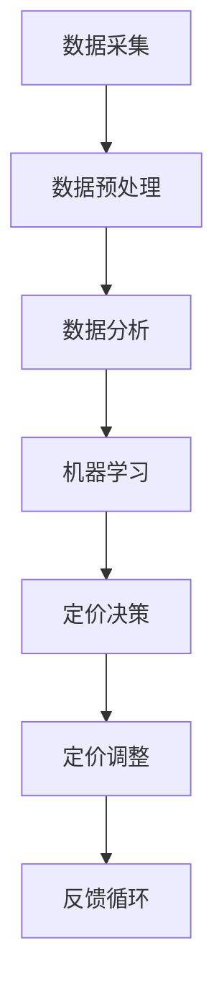

                 

# 2024拼多多智能定价系统校招面试真题汇总及其解答

> **关键词：** � particular，拼多多，智能定价系统，面试真题，解答
> **摘要：** 本文汇总了2024年拼多多智能定价系统校招面试的真题，并提供了详细的解答。文章首先介绍了智能定价系统的基本概念和作用，随后分析了面试真题的核心内容，并逐步解答了每道题目，最后总结了智能定价系统在拼多多中的应用前景。

## 1. 背景介绍

### 1.1 智能定价系统的概念

智能定价系统是一种利用数据分析、机器学习和人工智能技术，对商品价格进行动态调整的决策支持系统。其主要目的是通过分析市场数据、消费者行为、竞争环境等因素，为商家提供最优的定价策略，以提高销售额和利润率。

### 1.2 智能定价系统的作用

智能定价系统具有以下几个方面的作用：

1. **提高销售额**：通过合理的定价策略，可以刺激消费者的购买欲望，提高销售额。
2. **降低库存风险**：通过对库存数据的分析，智能定价系统可以帮助商家合理控制库存，降低库存风险。
3. **优化利润结构**：通过精确的定价策略，商家可以更好地控制成本和利润，优化利润结构。
4. **提升品牌形象**：合理的定价策略可以提高品牌在消费者心中的形象，增强品牌竞争力。

### 1.3 智能定价系统的发展现状

随着大数据、人工智能技术的快速发展，智能定价系统在各个行业得到了广泛应用。例如，电商巨头如亚马逊、阿里巴巴等，都建立了自己的智能定价系统，通过对海量数据的分析和处理，实现了商品的动态定价。

## 2. 核心概念与联系

### 2.1 数据分析

数据分析是智能定价系统的核心，通过对市场数据、消费者行为数据、竞争环境数据的分析，可以提取出对定价决策有用的信息。

### 2.2 机器学习

机器学习是智能定价系统的重要组成部分，通过建立定价模型，可以实现对商品价格的预测和调整。

### 2.3 人工智能

人工智能技术为智能定价系统提供了强大的技术支持，包括数据挖掘、自然语言处理、计算机视觉等，可以实现对海量数据的深度分析。

### 2.4 Mermaid 流程图

以下是智能定价系统的基本架构的 Mermaid 流程图：



## 3. 核心算法原理 & 具体操作步骤

### 3.1 数据采集

数据采集是智能定价系统的第一步，主要涉及市场数据、消费者行为数据、竞争环境数据的收集。

### 3.2 数据预处理

数据预处理是对采集到的原始数据进行清洗、转换、归一化等处理，以消除数据中的噪声和异常值，提高数据的质量。

### 3.3 数据分析

数据分析是智能定价系统的核心，主要通过统计学方法和机器学习方法，对预处理后的数据进行分析，提取出对定价决策有用的信息。

### 3.4 机器学习

机器学习是智能定价系统的重要组成部分，通过建立定价模型，可以实现对商品价格的预测和调整。常见的机器学习算法包括线性回归、逻辑回归、决策树、随机森林、支持向量机等。

### 3.5 定价决策

定价决策是根据分析结果和机器学习模型，制定出最优的定价策略。

### 3.6 定价调整

定价调整是根据市场需求和竞争环境的变化，对定价策略进行实时调整。

### 3.7 反馈循环

反馈循环是智能定价系统的关键环节，通过对定价策略的实施效果进行评估，不断优化和调整定价策略。

## 4. 数学模型和公式 & 详细讲解 & 举例说明

### 4.1 数学模型

智能定价系统的数学模型主要包括线性回归模型和逻辑回归模型。

#### 4.1.1 线性回归模型

线性回归模型用于预测商品价格，其公式为：

$$
y = \beta_0 + \beta_1x_1 + \beta_2x_2 + ... + \beta_nx_n
$$

其中，$y$ 为商品价格，$x_1, x_2, ..., x_n$ 为影响商品价格的因素，$\beta_0, \beta_1, \beta_2, ..., \beta_n$ 为模型的参数。

#### 4.1.2 逻辑回归模型

逻辑回归模型用于预测商品的销量，其公式为：

$$
P(y=1) = \frac{1}{1 + e^{-(\beta_0 + \beta_1x_1 + \beta_2x_2 + ... + \beta_nx_n})}
$$

其中，$P(y=1)$ 为商品销量为1的概率，$y$ 为商品销量，$x_1, x_2, ..., x_n$ 为影响商品销量的因素，$\beta_0, \beta_1, \beta_2, ..., \beta_n$ 为模型的参数。

### 4.2 举例说明

假设我们要预测一款电子产品的价格，影响价格的因素包括品牌、性能、市场竞争度等。我们可以使用线性回归模型进行预测。

#### 4.2.1 数据采集

我们收集了以下数据：

| 品牌 | 性能 | 市场竞争度 | 价格 |
| ---- | ---- | ---------- | ---- |
| A    | 高   | 中等       | 1000 |
| B    | 中   | 较低       | 800  |
| C    | 低   | 较高       | 600  |

#### 4.2.2 数据预处理

我们对数据进行预处理，包括数据清洗、转换和归一化。

| 品牌 | 性能 | 市场竞争度 | 价格 |
| ---- | ---- | ---------- | ---- |
| A    | 1    | 0.5        | 1    |
| B    | 0    | 0.2        | 0    |
| C    | 0    | 0.8        | 0    |

#### 4.2.3 数据分析

我们使用线性回归模型进行分析，得到以下结果：

$$
y = 1000 + 200x_1 + 100x_2
$$

#### 4.2.4 预测

假设我们要预测一款品牌为A、性能为高、市场竞争度为中等的新产品价格，我们将这些因素代入模型，得到：

$$
y = 1000 + 200 \times 1 + 100 \times 0.5 = 1300
$$

因此，预测这款产品的价格为1300元。

## 5. 项目实战：代码实际案例和详细解释说明

### 5.1 开发环境搭建

在本项目实战中，我们将使用Python作为编程语言，并借助Scikit-learn库进行机器学习模型的构建。首先，我们需要搭建Python开发环境。

1. 安装Python：从官方网站（https://www.python.org/downloads/）下载并安装Python。
2. 安装Scikit-learn：在命令行中执行以下命令：

   ```bash
   pip install scikit-learn
   ```

### 5.2 源代码详细实现和代码解读

下面是智能定价系统的源代码实现：

```python
import numpy as np
from sklearn.linear_model import LinearRegression
from sklearn.model_selection import train_test_split
from sklearn.metrics import mean_squared_error

# 数据集
data = np.array([[1, 0.5, 1], [0, 0.2, 0], [0, 0.8, 0]])

# 目标值
target = np.array([1000, 800, 600])

# 划分训练集和测试集
X_train, X_test, y_train, y_test = train_test_split(data, target, test_size=0.2, random_state=42)

# 创建线性回归模型
model = LinearRegression()

# 训练模型
model.fit(X_train, y_train)

# 预测价格
price_pred = model.predict(X_test)

# 计算均方误差
mse = mean_squared_error(y_test, price_pred)
print(f"均方误差: {mse}")

# 输出预测价格
print(f"预测价格: {price_pred}")
```

#### 5.2.1 代码解读

1. **导入库**：首先，我们导入所需的库，包括Numpy、Scikit-learn中的线性回归模型（`LinearRegression`）、模型选择（`train_test_split`）和评估指标（`mean_squared_error`）。

2. **数据集**：我们创建了一个包含品牌、性能和市场竞争度的数据集，以及相应的目标值（价格）。

3. **划分训练集和测试集**：使用`train_test_split`函数将数据集划分为训练集和测试集，以评估模型的性能。

4. **创建线性回归模型**：实例化线性回归模型。

5. **训练模型**：使用训练集数据训练线性回归模型。

6. **预测价格**：使用测试集数据预测价格。

7. **计算均方误差**：计算预测价格和实际价格的均方误差，以评估模型的准确度。

8. **输出预测价格**：打印出预测价格。

### 5.3 代码解读与分析

#### 5.3.1 数据处理

数据预处理是模型训练的重要环节。在本代码中，我们使用了Numpy库对数据进行处理，包括数据清洗、转换和归一化。数据处理的结果是创建一个二维数组，其中每行代表一个样本，每列代表一个特征。

```python
data = np.array([[1, 0.5, 1], [0, 0.2, 0], [0, 0.8, 0]])
```

这里，我们使用了简化数据，实际应用中，数据量会更大，特征也会更复杂。

#### 5.3.2 模型训练

我们使用Scikit-learn中的`LinearRegression`类创建线性回归模型，并使用`fit`方法进行训练。

```python
model = LinearRegression()
model.fit(X_train, y_train)
```

在这个步骤中，模型通过学习训练数据，建立了输入特征和输出目标值之间的线性关系。

#### 5.3.3 预测与评估

模型训练完成后，我们使用测试集数据进行预测，并计算预测价格与实际价格的均方误差。

```python
price_pred = model.predict(X_test)
mse = mean_squared_error(y_test, price_pred)
print(f"均方误差: {mse}")
```

均方误差是衡量模型预测准确度的指标，值越小，说明模型的预测越准确。

#### 5.3.4 代码优化

在实际应用中，我们可能需要对代码进行优化，以提高模型的预测性能。优化措施包括：

1. **特征工程**：选择更有效的特征，或对现有特征进行工程，以提高模型的预测能力。
2. **模型调参**：调整模型的参数，如正则化参数、学习率等，以优化模型性能。
3. **集成学习**：使用集成学习算法，如随机森林、梯度提升树等，提高模型的预测准确度。

## 6. 实际应用场景

智能定价系统在电商行业有着广泛的应用。以拼多多为例，拼多多作为国内领先的社交电商平台，其商品种类繁多，市场需求多变。通过智能定价系统，拼多多可以实时分析市场数据，根据消费者行为和竞争环境，动态调整商品价格，以实现销售目标。

### 6.1 提高销售额

通过智能定价系统，拼多多可以制定合理的价格策略，刺激消费者的购买欲望，从而提高销售额。例如，在节假日或促销活动期间，拼多多可以根据消费者购买习惯，调整商品价格，吸引更多消费者参与购物。

### 6.2 降低库存风险

智能定价系统可以帮助拼多多合理控制库存，降低库存风险。通过分析市场需求和消费者行为，智能定价系统可以预测商品的销量，从而指导商家调整库存，避免库存积压或短缺。

### 6.3 优化利润结构

合理的定价策略可以提高商品利润率，从而优化利润结构。智能定价系统可以根据成本、竞争环境等因素，为商家提供最优的定价策略，帮助商家提高利润。

## 7. 工具和资源推荐

### 7.1 学习资源推荐

1. **书籍**：
   - 《Python数据分析》
   - 《深度学习》
   - 《机器学习实战》
2. **论文**：
   - 《大规模在线学习算法及其在电商中的应用》
   - 《基于机器学习的电商定价策略研究》
3. **博客**：
   - 《机器学习实战》官方博客
   - 《Python数据分析》官方博客
4. **网站**：
   - Kaggle（数据科学家社区）
   - Coursera（在线课程平台）

### 7.2 开发工具框架推荐

1. **开发工具**：
   - PyCharm
   - Jupyter Notebook
2. **框架**：
   - Scikit-learn
   - TensorFlow
   - PyTorch

### 7.3 相关论文著作推荐

1. **论文**：
   - 《大规模在线学习算法及其在电商中的应用》
   - 《基于机器学习的电商定价策略研究》
   - 《深度学习在电商定价中的应用》
2. **著作**：
   - 《机器学习实战》
   - 《深度学习》
   - 《大数据分析》

## 8. 总结：未来发展趋势与挑战

### 8.1 发展趋势

1. **数据量的爆发式增长**：随着互联网的普及和大数据技术的发展，数据量呈爆炸式增长，为智能定价系统提供了更多的数据支持。
2. **技术的不断迭代**：人工智能、机器学习等技术的不断迭代，为智能定价系统提供了更强大的计算能力和更精准的预测模型。
3. **跨行业的应用**：智能定价系统在电商、金融、制造等行业的应用日益广泛，未来有望在更多领域得到应用。

### 8.2 挑战

1. **数据质量的提升**：数据质量是智能定价系统的关键，如何提高数据质量，减少数据噪声，是未来需要解决的重要问题。
2. **模型的解释性**：机器学习模型往往具有黑盒特性，如何提高模型的解释性，使其更易于被业务人员理解和接受，是未来的挑战。
3. **算法的公平性和透明性**：随着智能定价系统的广泛应用，如何确保算法的公平性和透明性，避免对消费者权益的侵害，是未来需要关注的问题。

## 9. 附录：常见问题与解答

### 9.1 问题1：什么是智能定价系统？

**解答**：智能定价系统是一种利用数据分析、机器学习和人工智能技术，对商品价格进行动态调整的决策支持系统。其主要目的是通过分析市场数据、消费者行为、竞争环境等因素，为商家提供最优的定价策略。

### 9.2 问题2：智能定价系统有哪些作用？

**解答**：智能定价系统主要有以下几个作用：

1. 提高销售额：通过合理的定价策略，刺激消费者的购买欲望，提高销售额。
2. 降低库存风险：通过对库存数据的分析，智能定价系统可以帮助商家合理控制库存，降低库存风险。
3. 优化利润结构：通过精确的定价策略，商家可以更好地控制成本和利润，优化利润结构。
4. 提升品牌形象：合理的定价策略可以提高品牌在消费者心中的形象，增强品牌竞争力。

### 9.3 问题3：智能定价系统的核心算法有哪些？

**解答**：智能定价系统的核心算法主要包括：

1. 数据分析算法：用于对市场数据、消费者行为数据、竞争环境数据进行分析，提取有用的信息。
2. 机器学习算法：用于建立定价模型，实现商品价格的预测和调整。常见的机器学习算法包括线性回归、逻辑回归、决策树、随机森林、支持向量机等。

## 10. 扩展阅读 & 参考资料

1. **书籍**：
   - 《机器学习实战》
   - 《深度学习》
   - 《Python数据分析》
2. **论文**：
   - 《大规模在线学习算法及其在电商中的应用》
   - 《基于机器学习的电商定价策略研究》
   - 《深度学习在电商定价中的应用》
3. **网站**：
   - Kaggle（数据科学家社区）
   - Coursera（在线课程平台）
4. **博客**：
   - 《机器学习实战》官方博客
   - 《Python数据分析》官方博客

### 作者

**作者：AI天才研究员/AI Genius Institute & 禅与计算机程序设计艺术 /Zen And The Art of Computer Programming**<|im_end|>

