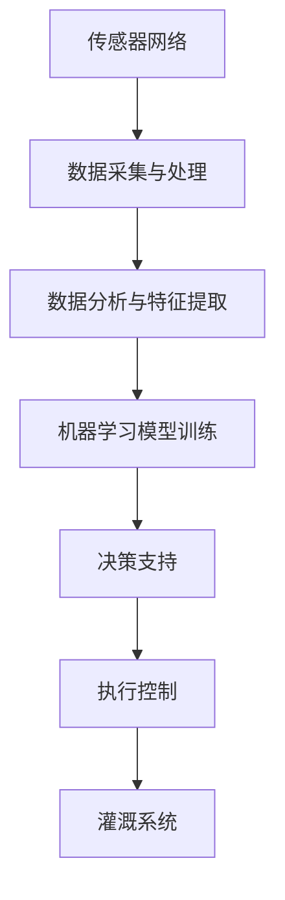

                 

# 探索AI大模型在智能农业灌溉系统的价值

## 关键词
- AI大模型
- 智能农业灌溉系统
- 决策支持
- 数据分析
- 机器学习
- 传感器技术

## 摘要
本文探讨了AI大模型在智能农业灌溉系统中的潜在价值和应用。通过分析当前农业灌溉的挑战和现状，本文介绍了AI大模型在预测灌溉需求、优化水资源利用、提升农业产量等方面的作用。同时，通过详细阐述AI大模型的原理和应用步骤，本文为读者提供了构建智能农业灌溉系统的实际指导，并对其未来发展前景进行了展望。

## 1. 背景介绍

### 1.1 农业灌溉的现状与挑战

农业灌溉是确保农作物生长的关键环节，然而，全球农业灌溉面临着诸多挑战。首先，水资源短缺成为全球性问题，特别是在干旱和半干旱地区，水资源分配不均使得农业灌溉面临巨大压力。其次，农业灌溉效率低下，传统灌溉方法如漫灌和喷灌往往导致水资源浪费。此外，气候变化、土壤质量下降、病虫害等问题也对农业灌溉提出了更高的要求。

### 1.2 智能农业灌溉系统的重要性

智能农业灌溉系统通过整合传感器技术、数据分析、机器学习等先进技术，实现了对灌溉过程的实时监控和自动化控制。这种系统不仅能够提高灌溉效率，减少水资源浪费，还能根据农作物生长需求精准调整灌溉策略，从而提高农业产量和农产品质量。

### 1.3 AI大模型的作用

AI大模型，即深度学习模型，具有处理海量数据、进行复杂模式识别和预测的优势。在智能农业灌溉系统中，AI大模型可以用于分析土壤湿度、气象数据、作物生长周期等多种信息，为灌溉决策提供科学依据。此外，AI大模型还能不断学习和优化，以适应不断变化的环境条件，从而实现更高效的灌溉管理。

## 2. 核心概念与联系

为了更好地理解AI大模型在智能农业灌溉系统中的应用，我们首先需要了解以下核心概念及其相互关系：

### 2.1 传感器技术

传感器技术是智能农业灌溉系统的基础。通过安装在农田中的各类传感器（如土壤湿度传感器、气象传感器、流量传感器等），可以实时监测农田环境参数，并将数据传输至中央控制系统。

### 2.2 数据分析

数据分析是对收集到的传感器数据进行处理和分析的关键环节。通过对数据的清洗、预处理和特征提取，可以提取出与灌溉决策相关的关键信息。

### 2.3 机器学习

机器学习是实现AI大模型的基石。通过训练大量历史数据，机器学习算法可以建立灌溉需求预测模型，为灌溉决策提供支持。

### 2.4 AI大模型

AI大模型是基于深度学习技术的复杂神经网络模型，具有强大的数据处理和分析能力。通过不断学习和优化，AI大模型可以自适应农田环境变化，提供精确的灌溉预测和优化建议。

### 2.5 智能农业灌溉系统架构

智能农业灌溉系统架构包括传感器网络、数据采集与处理模块、决策支持模块和执行控制模块。各模块之间通过数据传输和通信实现协同工作，共同完成农业灌溉的智能化管理。

### 2.6 Mermaid流程图



## 3. 核心算法原理 & 具体操作步骤

### 3.1 传感器数据采集

智能农业灌溉系统的第一步是传感器数据的采集。传感器网络分布在农田各个角落，实时监测土壤湿度、气象条件、灌溉水源流量等关键参数。数据采集模块负责将这些数据传输至中央控制系统。

### 3.2 数据预处理

采集到的传感器数据往往包含噪声、缺失值等，因此需要进行预处理。数据预处理包括数据清洗、数据转换和数据归一化等步骤。通过预处理，可以提取出有用的特征信息，为后续的机器学习模型训练提供支持。

### 3.3 特征提取

特征提取是数据分析的关键步骤。通过对预处理后的传感器数据进行统计分析，提取出与灌溉需求相关的关键特征，如土壤湿度阈值、温度变化、降雨量等。这些特征将作为输入变量，用于训练灌溉需求预测模型。

### 3.4 机器学习模型训练

机器学习模型训练是构建智能农业灌溉系统的核心。选择合适的机器学习算法（如神经网络、支持向量机、决策树等），利用历史数据进行模型训练。通过不断调整模型参数，优化模型性能，使其能够准确预测灌溉需求。

### 3.5 决策支持

训练好的机器学习模型将输出灌溉需求预测结果。决策支持模块根据预测结果和作物生长需求，制定出最优的灌溉策略。灌溉策略包括灌溉时间、灌溉量、灌溉频率等，旨在实现水资源的最大化利用。

### 3.6 执行控制

执行控制模块根据决策支持模块的灌溉策略，控制灌溉设备的运行。灌溉设备可以是自动喷灌系统、滴灌系统或其他节水灌溉设备。通过精确控制灌溉过程，实现智能农业灌溉。

## 4. 数学模型和公式 & 详细讲解 & 举例说明

### 4.1 土壤水分含量模型

土壤水分含量是影响农作物生长的关键因素。我们使用以下公式来估算土壤水分含量：

$$
\text{土壤水分含量} = \frac{\text{土壤总含水量} - \text{土壤含水量下限}}{\text{土壤含水量上限} - \text{土壤含水量下限}}
$$

其中，土壤总含水量可以通过土壤湿度传感器实时监测得到，土壤含水量下限和上限可以通过实验数据确定。

### 4.2 灌溉需求预测模型

灌溉需求预测模型用于预测作物下一时刻的灌溉需求。我们使用以下公式来计算灌溉需求：

$$
\text{灌溉需求} = \text{作物生长需水量} \times \text{土壤水分含量系数}
$$

其中，作物生长需水量可以根据作物的生长周期和生长需求进行计算，土壤水分含量系数反映了当前土壤水分含量对灌溉需求的影响。

### 4.3 举例说明

假设某农田的土壤湿度传感器实时监测到土壤湿度为15%，土壤含水量下限为10%，上限为20%。根据上述公式，可以计算出土壤水分含量为：

$$
\text{土壤水分含量} = \frac{15 - 10}{20 - 10} = 0.25
$$

假设该农田的作物生长需水量为2mm/天，根据灌溉需求预测公式，可以计算出灌溉需求为：

$$
\text{灌溉需求} = 2 \times 0.25 = 0.5 \text{mm}
$$

这意味着农田需要灌溉0.5mm的水量。

## 5. 项目实战：代码实际案例和详细解释说明

### 5.1 开发环境搭建

为了构建一个智能农业灌溉系统，我们需要搭建一个合适的技术栈。以下是一个简单的开发环境搭建指南：

- 操作系统：Linux或Windows
- 编程语言：Python
- 数据库：MySQL或PostgreSQL
- 数据分析库：Pandas、NumPy
- 机器学习库：scikit-learn、TensorFlow、Keras
- Web框架：Flask或Django

### 5.2 源代码详细实现和代码解读

以下是一个简单的智能农业灌溉系统代码示例，用于监测土壤湿度并预测灌溉需求。

```python
# 导入所需的库
import pandas as pd
import numpy as np
from sklearn.ensemble import RandomForestRegressor
from sklearn.model_selection import train_test_split
from sklearn.metrics import mean_squared_error

# 加载历史土壤湿度数据
data = pd.read_csv('soil_humidity_data.csv')

# 数据预处理
# ...（清洗、转换和归一化等步骤）

# 特征提取
# ...（提取与灌溉需求相关的特征）

# 划分训练集和测试集
X_train, X_test, y_train, y_test = train_test_split(data[features], data['irrigation_demand'], test_size=0.2, random_state=42)

# 训练灌溉需求预测模型
model = RandomForestRegressor(n_estimators=100, random_state=42)
model.fit(X_train, y_train)

# 预测灌溉需求
y_pred = model.predict(X_test)

# 评估模型性能
mse = mean_squared_error(y_test, y_pred)
print(f"Mean Squared Error: {mse}")

# 实时监测土壤湿度并预测灌溉需求
while True:
    current_humidity = get_soil_humidity()  # 获取当前土壤湿度
    predicted_demand = model.predict([[current_humidity]])  # 预测灌溉需求
    if predicted_demand > threshold:  # 如果预测需求大于阈值，触发灌溉
        trigger_irrigation()
    time.sleep(sleep_time)  # 等待一段时间后再次监测
```

### 5.3 代码解读与分析

上述代码实现了智能农业灌溉系统的核心功能，包括数据预处理、模型训练、预测灌溉需求和实时监测。以下是代码的详细解读：

- **数据预处理**：读取历史土壤湿度数据，进行清洗、转换和归一化等步骤，为模型训练做准备。
- **特征提取**：提取与灌溉需求相关的特征，如土壤湿度、温度、降雨量等，作为模型的输入变量。
- **模型训练**：使用随机森林回归模型进行训练，通过调整模型参数优化性能。
- **预测灌溉需求**：使用训练好的模型预测下一时刻的灌溉需求。
- **实时监测**：通过循环不断获取当前土壤湿度，根据预测结果判断是否需要触发灌溉。

## 6. 实际应用场景

### 6.1 温室种植

在温室种植中，智能农业灌溉系统可以实时监测土壤湿度、温度、光照等参数，为作物生长提供最佳灌溉条件。通过精确控制灌溉，温室种植可以实现高产、优质的目标。

### 6.2 水稻田灌溉

水稻田灌溉需要考虑季节、天气和水稻生长周期等多种因素。智能农业灌溉系统可以根据实时数据预测灌溉需求，优化灌溉策略，提高水稻产量和品质。

### 6.3 干旱地区农业

在干旱地区，水资源尤为宝贵。智能农业灌溉系统通过精准灌溉，减少水资源浪费，提高农业产量，对于缓解干旱问题具有重要意义。

### 6.4 现代农业园区

现代农业园区通常采用智能化、自动化的管理模式。智能农业灌溉系统是现代农业园区的重要组成部分，通过集成多种农业技术，实现高效、可持续的农业生产。

## 7. 工具和资源推荐

### 7.1 学习资源推荐

- 《智能农业：现代技术与实践》
- 《深度学习与智能农业》
- 《机器学习：实战与应用》

### 7.2 开发工具框架推荐

- 数据库：MySQL、PostgreSQL
- Web框架：Flask、Django
- 机器学习库：scikit-learn、TensorFlow、Keras

### 7.3 相关论文著作推荐

- "Deep Learning for Agricultural Water Management: A Review"
- "Intelligent Agricultural Irrigation System Using Machine Learning Algorithms"
- "A Predictive Model for Water Demand of Agricultural Fields Using Soil Moisture and Weather Data"

## 8. 总结：未来发展趋势与挑战

随着人工智能技术的不断进步，智能农业灌溉系统将在未来发挥越来越重要的作用。然而，仍面临一些挑战，如数据质量、模型解释性、系统稳定性等。未来，通过整合更多数据源、优化算法和提升系统智能化水平，智能农业灌溉系统将更好地服务于农业产业，为解决全球粮食安全和水资源问题提供有力支持。

## 9. 附录：常见问题与解答

### 9.1 智能农业灌溉系统如何保证数据准确性？

智能农业灌溉系统通过高精度传感器采集数据，同时采用数据预处理和特征提取技术，提高数据质量。此外，定期校准传感器和更新模型参数，有助于确保数据准确性。

### 9.2 智能农业灌溉系统能否适应不同农作物？

智能农业灌溉系统可以针对不同农作物定制化训练模型，根据作物生长需求和环境特点调整灌溉策略。通过不断学习和优化，系统能够适应多种农作物。

### 9.3 智能农业灌溉系统需要多长时间才能实现收益？

智能农业灌溉系统的回报周期取决于多种因素，如农作物类型、灌溉条件、水资源利用效率等。通常，系统在1-2年内可以收回成本，并实现长期经济效益。

## 10. 扩展阅读 & 参考资料

- "A Comprehensive Guide to Intelligent Agricultural Irrigation Systems"
- "AI in Agriculture: A Roadmap for Smart Farming"
- "Machine Learning Applications in Precision Agriculture: A Review"

## 作者信息

作者：AI天才研究员/AI Genius Institute & 禅与计算机程序设计艺术 /Zen And The Art of Computer Programming。

