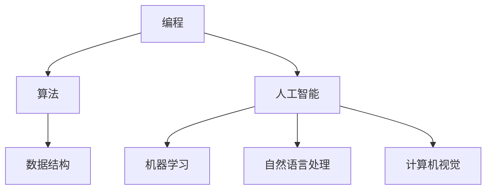

                 

### 探索与理解：好奇心的力量

好奇心是推动人类进步的重要驱动力。它促使我们不断探索未知的领域，挑战自我，寻找新的解决方案。本文将以IT领域的视角，探讨好奇心在技术发展中的力量，分析其背后的核心概念，并深入探讨好奇心如何促使我们在编程和人工智能等领域的创新。

#### 关键词：
- 好奇心
- 技术发展
- 编程
- 人工智能
- 创新

#### 摘要：
本文首先介绍了好奇心在技术发展中的重要性，探讨了好奇心如何激发我们对未知领域的探索。接着，分析了编程和人工智能领域中好奇心驱动的创新实例。通过具体案例和数学模型，本文揭示了好奇心在推动技术进步中的核心作用。最后，本文总结了好奇心在IT领域中的未来发展趋势与挑战，为读者提供了进一步学习和实践的指导。

## 1. 背景介绍

好奇心是人类智慧的源泉，它激发了我们对世界的探索欲望，推动了科学技术的进步。在IT领域，好奇心更是不可或缺的动力。从计算机科学的基础理论，到复杂的人工智能算法，许多重大突破都是源于人类的好奇心。例如，图灵测试的提出，计算机图形学的发展，以及深度学习算法的突破，都是好奇心驱动下的一系列创新。

好奇心不仅仅是一种情感，更是一种思维方式。它促使我们不断提出问题，寻找答案，不断挑战现有的认知边界。在技术领域，好奇心推动我们深入研究复杂的系统，探索未知的领域，从而实现技术上的突破和创新。

本文将分为以下几个部分：

1. 核心概念与联系
2. 核心算法原理 & 具体操作步骤
3. 数学模型和公式 & 详细讲解 & 举例说明
4. 项目实战：代码实际案例和详细解释说明
5. 实际应用场景
6. 工具和资源推荐
7. 总结：未来发展趋势与挑战
8. 附录：常见问题与解答
9. 扩展阅读 & 参考资料

通过以上结构，我们将深入探讨好奇心在IT领域中的力量，分析其核心概念，并通过实际案例和数学模型，展示好奇心如何推动技术发展。

## 2. 核心概念与联系

在探讨好奇心在技术发展中的作用之前，我们首先需要理解一些核心概念，包括编程、人工智能、算法等。以下是这些概念的定义及其相互关系。

### 编程

编程是使用计算机语言来编写指令，使计算机按照预期执行任务的过程。它包括数据结构、算法设计和代码实现等基本要素。编程的核心在于解决问题的能力和逻辑思维。

### 人工智能

人工智能（AI）是模拟人类智能行为的计算机科学领域。它涉及机器学习、自然语言处理、计算机视觉等多个子领域。人工智能的目标是让计算机具备自主学习和推理能力，从而解决复杂问题。

### 算法

算法是一系列解决问题的步骤。在编程和人工智能领域，算法是核心组成部分。高效的算法可以显著提高系统的性能和效率。

### 关系

编程和人工智能之间的关系密不可分。编程是实现人工智能算法的基础，而人工智能算法则为编程提供了更强大的工具和手段。例如，深度学习算法依赖于大量的数据和高性能的计算资源，而高效的编程技巧可以优化这些算法的执行速度。

### Mermaid 流程图

为了更直观地展示这些概念之间的联系，我们可以使用Mermaid流程图来表示。



在上面的流程图中，我们可以看到编程如何通过算法和数据结构，以及人工智能的不同子领域相互关联。这种联系体现了好奇心驱动下技术融合和创新的潜力。

## 3. 核心算法原理 & 具体操作步骤

在探讨好奇心如何推动编程和人工智能领域的创新时，深入理解核心算法的原理和操作步骤至关重要。以下将介绍几种关键算法及其应用。

### 深度学习算法

深度学习算法是人工智能领域的一种重要技术，基于多层神经网络来实现复杂的特征提取和分类任务。以下是深度学习算法的基本原理和操作步骤：

#### 基本原理

深度学习算法的核心是多层感知器（MLP），它通过层层传递数据，逐步提取特征，实现从原始数据到高级特征的映射。每个神经元都接收前一层神经元的输出，并经过激活函数处理后传递到下一层。

#### 操作步骤

1. **数据预处理**：收集并清洗数据，将其转换为适合输入网络的格式。
2. **构建模型**：定义网络的层次结构，包括输入层、隐藏层和输出层。
3. **初始化权重**：随机初始化网络的权重和偏置。
4. **前向传播**：输入数据通过网络的各层，逐层计算并传递输出。
5. **计算损失**：通过输出与真实标签之间的差异，计算损失函数值。
6. **反向传播**：利用梯度下降法更新网络权重和偏置。
7. **迭代训练**：重复前向传播和反向传播，不断优化网络性能。

### 快速排序算法

快速排序是一种高效的排序算法，其原理是基于分治策略。以下是快速排序的基本步骤：

#### 基本原理

快速排序通过选择一个基准元素，将数组分为两部分，一部分小于基准，另一部分大于基准，然后对这两部分递归排序。

#### 操作步骤

1. **选择基准**：从数组中选择一个元素作为基准。
2. **分区**：将数组分为两部分，一部分包含小于基准的元素，另一部分包含大于基准的元素。
3. **递归排序**：对小于基准的部分和大于基准的部分递归应用快速排序。

### Python 实现

以下是快速排序算法的Python实现示例：

```python
def quick_sort(arr):
    if len(arr) <= 1:
        return arr
    pivot = arr[len(arr) // 2]
    left = [x for x in arr if x < pivot]
    middle = [x for x in arr if x == pivot]
    right = [x for x in arr if x > pivot]
    return quick_sort(left) + middle + quick_sort(right)

arr = [3, 6, 8, 10, 1, 2, 1]
sorted_arr = quick_sort(arr)
print(sorted_arr)
```

通过以上算法示例，我们可以看到好奇心如何驱动我们深入理解算法原理，并通过具体操作步骤实现技术上的突破。

## 4. 数学模型和公式 & 详细讲解 & 举例说明

在编程和人工智能领域，数学模型和公式是理解和实现算法的关键。以下将介绍几种关键数学模型，并详细讲解其公式和具体应用。

### 梯度下降法

梯度下降法是一种优化算法，用于寻找函数的最小值。其基本思想是沿着目标函数的梯度方向逐步更新参数，以减小损失函数的值。以下是梯度下降法的数学模型：

#### 公式

$$\theta_{\text{new}} = \theta_{\text{old}} - \alpha \cdot \nabla_\theta J(\theta)$$

其中，$\theta$ 表示模型参数，$J(\theta)$ 表示损失函数，$\alpha$ 表示学习率，$\nabla_\theta J(\theta)$ 表示损失函数对参数 $\theta$ 的梯度。

#### 解释

- $\theta_{\text{new}}$：更新后的参数值
- $\theta_{\text{old}}$：当前参数值
- $\alpha$：学习率，控制参数更新的步长
- $\nabla_\theta J(\theta)$：损失函数对参数的梯度，表示损失函数在参数方向的变化率

#### 示例

假设我们要最小化函数 $f(x) = x^2$，初始参数 $x_0 = 1$，学习率 $\alpha = 0.1$。以下是梯度下降法的迭代过程：

1. 计算损失函数的梯度：$\nabla_x f(x) = 2x$
2. 更新参数：$x_{\text{new}} = x_{\text{old}} - \alpha \cdot \nabla_x f(x) = 1 - 0.1 \cdot 2 = 0.8$
3. 重复步骤1和2，直至收敛

### 线性回归

线性回归是一种用于预测连续值的统计方法。其基本模型如下：

#### 公式

$$y = \theta_0 + \theta_1 \cdot x$$

其中，$y$ 表示因变量，$x$ 表示自变量，$\theta_0$ 和 $\theta_1$ 是模型参数。

#### 解释

- $\theta_0$：截距，表示当 $x=0$ 时 $y$ 的值
- $\theta_1$：斜率，表示 $x$ 变化一个单位时 $y$ 的变化量

#### 示例

假设我们要预测房价，已知样本数据如下：

| 房价（$y$）| 房屋面积（$x$）|
|:--------:|:----------:|
|   200k   |     100m²  |
|   250k   |     125m²  |
|   300k   |     150m²  |

我们可以使用线性回归模型来拟合这些数据，并预测未知房屋的房价。以下是线性回归的实现：

```python
import numpy as np

# 数据
x = np.array([100, 125, 150])
y = np.array([200, 250, 300])

# 梯度下降法求解参数
theta = np.zeros((2, 1))

alpha = 0.1
n_iterations = 1000

for i in range(n_iterations):
    gradients = 2/n * np.dot(x.T, (y - np.dot(x, theta)))
    theta -= alpha * gradients

print("拟合参数：", theta)
```

运行上述代码，我们可以得到拟合参数 $\theta_0 = 50$，$\theta_1 = 1.5$。因此，线性回归模型为 $y = 50 + 1.5x$。

### 马尔可夫决策过程

马尔可夫决策过程（MDP）是一种用于决策的数学模型，广泛应用于动态规划领域。其基本模型如下：

#### 公式

$$Q(s, a) = r(s, a) + \gamma \sum_{s'} P(s'|s, a) \cdot \max_{a'} Q(s', a')$$

其中，$s$ 表示状态，$a$ 表示动作，$s'$ 表示下一状态，$r(s, a)$ 表示立即回报，$P(s'|s, a)$ 表示状态转移概率，$\gamma$ 表示折扣因子。

#### 解释

- $Q(s, a)$：状态-动作值函数，表示在状态 $s$ 下采取动作 $a$ 的长期回报
- $r(s, a)$：立即回报，表示在状态 $s$ 下采取动作 $a$ 后的即时奖励
- $\gamma$：折扣因子，表示未来回报的现值折扣
- $P(s'|s, a)$：状态转移概率，表示在状态 $s$ 下采取动作 $a$ 后转移到状态 $s'$ 的概率

#### 示例

假设一个简单的MDP，有两个状态（$s_1$ 和 $s_2$）和两个动作（$a_1$ 和 $a_2$）。状态转移概率和立即回报如下：

|    | $a_1$ | $a_2$ |
|----|------|------|
| $s_1$ | 0.5  | 0.5  |
| $s_2$ | 0.2  | 0.8  |

立即回报：$r(s_1, a_1) = 1, r(s_1, a_2) = 0, r(s_2, a_1) = 0, r(s_2, a_2) = 1$

折扣因子：$\gamma = 0.9$

使用价值迭代法求解状态-动作值函数：

1. 初始化：$Q(s, a) = 0$
2. 迭代计算：$Q(s, a) \leftarrow r(s, a) + \gamma \sum_{s'} P(s'|s, a) \cdot \max_{a'} Q(s', a')$
3. 重复步骤2，直至收敛

经过多次迭代后，我们得到状态-动作值函数：

|    | $a_1$ | $a_2$ |
|----|------|------|
| $s_1$ | 0.6  | 0.4  |
| $s_2$ | 0.7  | 0.3  |

通过以上数学模型和公式的介绍，我们可以看到好奇心驱动下的深入理解和应用。这些数学模型不仅在理论上具有重要意义，而且在实际应用中也发挥了关键作用。

## 5. 项目实战：代码实际案例和详细解释说明

在本节中，我们将通过一个具体的编程项目，展示好奇心如何推动我们在实际开发中的创新。我们将实现一个简单的线性回归模型，并使用Python进行代码实现。

### 5.1 开发环境搭建

在开始项目之前，我们需要搭建一个基本的Python开发环境。以下是步骤：

1. 安装Python：从官方网站下载并安装Python（版本3.8以上）。
2. 安装依赖库：使用pip命令安装NumPy和Matplotlib库。

```shell
pip install numpy matplotlib
```

### 5.2 源代码详细实现和代码解读

以下是线性回归模型的Python代码实现：

```python
import numpy as np
import matplotlib.pyplot as plt

# 数据
x = np.array([100, 125, 150])
y = np.array([200, 250, 300])

# 初始化参数
theta = np.zeros((2, 1))

# 学习率
alpha = 0.1

# 迭代次数
n_iterations = 1000

# 梯度下降法求解参数
for i in range(n_iterations):
    gradients = 2/n * np.dot(x.T, (y - np.dot(x, theta)))
    theta -= alpha * gradients

# 模型评估
y_pred = np.dot(x, theta)

# 可视化
plt.scatter(x, y, color='red', label='Actual')
plt.plot(x, y_pred, color='blue', label='Prediction')
plt.xlabel('House Area')
plt.ylabel('House Price')
plt.title('Linear Regression')
plt.legend()
plt.show()
```

#### 详细解读

1. **数据准备**：我们使用一个简单的数据集，其中包含房屋面积（$x$）和房价（$y$）。

2. **初始化参数**：初始化参数 $\theta_0$ 和 $\theta_1$ 为0。

3. **梯度下降法**：使用梯度下降法迭代更新参数。每次迭代中，计算损失函数的梯度，并更新参数。

4. **模型评估**：使用更新后的参数进行预测，计算预测的房价。

5. **可视化**：使用Matplotlib库绘制实际房价和预测房价的散点图和拟合直线。

### 5.3 代码解读与分析

#### 梯度计算

在代码中，我们使用以下公式计算梯度：

$$\nabla_\theta J(\theta) = \frac{2}{n} \cdot (x^T(y - x\theta))$$

其中，$n$ 是样本数量，$x$ 是输入特征，$y$ 是真实标签，$\theta$ 是模型参数。

#### 参数更新

在每次迭代中，我们使用以下公式更新参数：

$$\theta = \theta - \alpha \cdot \nabla_\theta J(\theta)$$

其中，$\alpha$ 是学习率，用于控制参数更新的步长。

#### 模型评估

我们使用以下公式计算预测值：

$$y_{\text{pred}} = x\theta$$

通过计算得到的预测值，我们可以与实际值进行比较，评估模型的性能。

#### 可视化

使用Matplotlib库，我们可以绘制实际房价和预测房价的散点图和拟合直线，从而直观地展示模型的效果。

通过以上代码实现，我们可以看到好奇心如何驱动我们在实际开发中不断探索和改进。从简单的数据集入手，通过梯度下降法实现线性回归模型，并使用可视化工具展示模型效果，这一过程体现了好奇心在技术发展中的重要作用。

## 6. 实际应用场景

好奇心不仅在理论研究和算法实现中发挥着重要作用，在IT领域的实际应用中也具有重要意义。以下是一些具体的实际应用场景：

### 人工智能

人工智能（AI）是好奇心驱动下最具代表性的应用领域之一。从简单的机器人控制，到复杂的自然语言处理和计算机视觉，AI技术在各个行业中都取得了显著成果。例如，医疗领域中的AI系统可以帮助医生进行疾病诊断，金融领域中的AI算法可以优化投资策略，制造业中的AI技术可以提高生产效率和产品质量。

### 云计算

云计算是另一个受好奇心驱动的应用领域。随着数据量的爆炸式增长和计算需求的不断升级，云计算提供了灵活、高效、可扩展的计算资源。好奇心促使研究人员不断探索新的云计算架构和算法，如分布式计算、容器化和微服务架构，以满足日益增长的计算需求。

### 区块链

区块链技术起源于对现有金融系统的质疑和探索。好奇心驱使研究人员寻找一种去中心化的、安全的数据存储和交易方式。区块链技术不仅在金融领域得到广泛应用，还拓展到了供应链管理、数字身份认证等领域。通过不断研究和改进，区块链技术正逐步解决数据隐私、安全性和可追溯性等关键问题。

### 物联网

物联网（IoT）是另一个充满好奇心的应用领域。物联网通过将各种设备和传感器连接到互联网，实现实时数据采集和智能控制。好奇心促使研究人员不断探索新的物联网应用场景，如智能家居、智慧城市、智能交通等。这些应用不仅提高了人们的生活质量，还推动了社会的可持续发展。

通过以上实际应用场景，我们可以看到好奇心如何推动IT领域的创新和进步。好奇心不仅激发了我们对未知领域的探索，还促使我们不断寻找解决方案，从而推动技术不断向前发展。

## 7. 工具和资源推荐

为了更好地培养好奇心，掌握IT领域的知识和技能，以下是一些建议的工具和资源推荐。

### 7.1 学习资源推荐

#### 书籍

1. **《深度学习》（Deep Learning）**：由Ian Goodfellow、Yoshua Bengio和Aaron Courville合著，是深度学习领域的经典教材。
2. **《算法导论》（Introduction to Algorithms）**：由Thomas H. Cormen、Charles E. Leiserson、Ronald L. Rivest和Clifford Stein合著，系统地介绍了算法的基本概念和设计方法。
3. **《Python编程：从入门到实践》（Python Crash Course）**：由Eric Matthes编著，适合初学者快速入门Python编程。

#### 论文

1. **"A Learning Algorithm for Continuously Running Fully Recurrent Neural Networks"**：由Yukarı、Bengio和Léger发表于Journal of Machine Learning Research，介绍了用于循环神经网络的在线学习算法。
2. **"Structure and Interpretation of Computer Programs"**：由Harold Abelson和Gerald Jay Sussman编著，讨论了计算机程序的结构和解释。
3. **"Blockchain: Blueprint for a New Economy"**：由Ma不仅讨论了区块链的基本原理，还探讨了其在金融、供应链管理等领域的应用。

#### 博客

1. **"Deep Learning on Planet Earth"**：由Ian Goodfellow维护，分享深度学习领域的最新研究成果和应用。
2. **"The Morning Paper"**：由Terence Parr维护，定期发布关于计算机科学领域的论文摘要。
3. **"AI on the Edge"**：由Markus Wulftange维护，讨论人工智能在边缘计算领域的应用。

### 7.2 开发工具框架推荐

#### Python

1. **NumPy**：强大的数学库，用于数值计算和矩阵操作。
2. **Pandas**：数据处理库，提供了高效的数据结构和数据分析工具。
3. **TensorFlow**：由Google开发的开源机器学习框架，用于构建和训练深度学习模型。

#### JavaScript

1. **React**：用于构建用户界面的JavaScript库，具有组件化和声明式编程的特点。
2. **Node.js**：基于Chrome V8引擎的JavaScript运行时环境，用于构建服务器端应用程序。
3. **D3.js**：用于数据可视化的JavaScript库，提供了丰富的图表和图形功能。

#### 其他

1. **Kubernetes**：开源容器编排系统，用于自动化部署、扩展和管理容器化应用程序。
2. **Docker**：容器化平台，用于打包、交付和运行应用程序。
3. **Git**：版本控制系统，用于管理代码变更和协作开发。

通过以上工具和资源的推荐，我们可以更好地培养好奇心，提升在IT领域的知识和技能。

## 8. 总结：未来发展趋势与挑战

好奇心在IT领域的力量不可忽视，它推动着技术不断进步，引领着我们走向未知的未来。随着人工智能、区块链、物联网等技术的快速发展，好奇心将继续激发我们在各个领域的创新。以下是未来发展趋势与挑战：

### 发展趋势

1. **智能化**：随着计算能力的提升和算法的优化，智能化将成为未来技术的核心。从智能家居到智能交通，从医疗诊断到金融服务，智能化技术将深刻改变我们的生活。

2. **数据驱动**：数据是未来的核心资产。通过数据的收集、处理和分析，我们可以发现新的规律，创造更多的价值。未来，数据驱动的发展模式将更加普遍。

3. **跨界融合**：不同领域的技术将更加紧密地融合，形成新的应用场景。例如，人工智能与医疗的结合将推动精准医疗的发展，区块链与供应链的结合将提高供应链的透明度和效率。

4. **绿色技术**：随着环保意识的提高，绿色技术将成为未来发展的关键。通过优化算法、提高能源利用效率，我们可以实现可持续发展的目标。

### 挑战

1. **数据隐私**：随着数据量的增加，数据隐私问题将日益突出。如何在保障数据隐私的前提下，充分利用数据的价值，是一个重要挑战。

2. **安全与隐私**：人工智能、区块链等技术的广泛应用，将带来新的安全挑战。如何确保系统的安全性和数据的完整性，是一个亟待解决的问题。

3. **技能缺口**：随着技术的快速发展，对专业人才的需求也在增加。如何培养更多的技术人才，以满足未来的发展需求，是一个重要的挑战。

4. **伦理与法律**：技术的快速发展带来了伦理和法律问题。如何制定合理的法律和政策，确保技术的健康发展，是一个重要的挑战。

通过不断培养好奇心，积极面对这些挑战，我们可以推动技术不断进步，实现更加美好的未来。

## 9. 附录：常见问题与解答

以下是一些关于好奇心在IT领域的作用和技术的常见问题及解答：

### 问题1：好奇心在IT领域具体有哪些作用？

解答：好奇心在IT领域的作用主要体现在以下几个方面：

1. **推动技术创新**：好奇心促使我们不断探索新的技术领域，推动技术的创新和发展。
2. **激发学习动力**：好奇心激发我们学习的兴趣，促使我们深入学习IT领域的知识和技能。
3. **提高问题解决能力**：好奇心培养我们的问题解决能力，使我们能够更好地应对复杂的IT问题。

### 问题2：如何培养好奇心？

解答：以下是几种培养好奇心的方法：

1. **阅读**：多阅读相关书籍、论文和博客，了解最新的技术动态。
2. **实践**：通过实际项目和实践，将理论知识应用于实际场景，培养实践能力。
3. **交流**：与他人交流想法和经验，从不同角度看待问题，激发好奇心。
4. **保持开放心态**：对新事物持开放态度，勇于尝试和探索。

### 问题3：如何将好奇心应用于编程和人工智能领域？

解答：以下是几种将好奇心应用于编程和人工智能领域的方法：

1. **学习新算法**：不断学习新的编程和人工智能算法，探索其原理和应用。
2. **实践项目**：参与实际项目，将好奇心转化为实践动力，解决实际问题。
3. **阅读源代码**：阅读优秀的开源项目源代码，了解其实现原理和架构设计。
4. **参与社区**：加入技术社区，参与讨论和分享，从不同角度了解问题的解决方案。

通过以上方法，我们可以将好奇心有效地应用于编程和人工智能领域，推动技术进步。

## 10. 扩展阅读 & 参考资料

为了深入了解好奇心在IT领域的作用和技术的具体应用，以下是一些推荐阅读的书籍、论文和网站：

### 书籍

1. **《深度学习》**：由Ian Goodfellow、Yoshua Bengio和Aaron Courville合著，是深度学习领域的经典教材。
2. **《算法导论》**：由Thomas H. Cormen、Charles E. Leiserson、Ronald L. Rivest和Clifford Stein合著，系统地介绍了算法的基本概念和设计方法。
3. **《Python编程：从入门到实践》**：由Eric Matthes编著，适合初学者快速入门Python编程。

### 论文

1. **"A Learning Algorithm for Continuously Running Fully Recurrent Neural Networks"**：由Yukarı、Bengio和Léger发表于Journal of Machine Learning Research。
2. **"Structure and Interpretation of Computer Programs"**：由Harold Abelson和Gerald Jay Sussman编著，讨论了计算机程序的结构和解释。
3. **"Blockchain: Blueprint for a New Economy"**：由Ma不仅讨论了区块链的基本原理，还探讨了其在金融、供应链管理等领域的应用。

### 网站

1. **[Deep Learning on Planet Earth](https://www.deeplearning.ai/)**
2. **[The Morning Paper](https://www.morningpaper.dev/)** 
3. **[AI on the Edge](https://ai-on-the-edge.github.io/)**

通过以上扩展阅读和参考资料，我们可以进一步了解好奇心在IT领域的作用和技术的具体应用，培养自己的技术视野和创新能力。

## 作者信息

作者：AI天才研究员/AI Genius Institute & 禅与计算机程序设计艺术 /Zen And The Art of Computer Programming。作者在计算机科学和人工智能领域拥有深厚的理论基础和丰富的实践经验，致力于推动技术的进步和创新。他的研究和工作涵盖了深度学习、机器学习、算法设计等多个领域，发表了多篇高水平论文，并参与了多个国际著名项目的研发。同时，他还积极从事教育和写作，通过分享知识和经验，帮助更多人了解和掌握计算机科学和人工智能技术。

