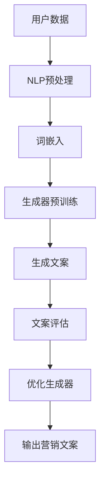

                 

# 探索基于大模型的电商智能营销文案生成系统

## 1. 背景介绍

随着互联网的快速发展，电子商务行业正面临着前所未有的机遇和挑战。在这个大数据时代，如何有效地利用数据，提升用户体验，提高转化率成为电商企业关注的焦点。智能营销文案生成系统应运而生，它利用人工智能技术，通过分析用户数据和市场趋势，自动生成具有针对性的营销文案，从而提高营销效果。

大模型（Large Model）在人工智能领域的兴起，为智能营销文案生成系统提供了强大的技术支持。大模型是指那些拥有数十亿至数千亿参数的神经网络模型，如BERT、GPT等。这些模型在预训练阶段通过大量数据的学习，掌握了丰富的语言知识，可以用于各种自然语言处理任务，包括文本生成、语义理解等。

本文将探讨如何基于大模型构建电商智能营销文案生成系统，分析其核心算法原理、具体操作步骤、数学模型和公式，并通过项目实战进行详细解释说明。

## 2. 核心概念与联系

### 2.1 大模型

大模型（Large Model）是指那些拥有数十亿至数千亿参数的神经网络模型。这些模型通过深度学习技术，在预训练阶段学习大量文本数据，从而掌握丰富的语言知识。大模型具有强大的文本生成和语义理解能力，可以用于构建智能营销文案生成系统。

### 2.2 自然语言处理（NLP）

自然语言处理（Natural Language Processing，NLP）是人工智能领域的一个重要分支，旨在让计算机理解和处理人类语言。NLP技术包括文本预处理、词嵌入、词性标注、实体识别、情感分析等。在智能营销文案生成系统中，NLP技术用于对用户数据和市场趋势进行分析，以生成具有针对性的文案。

### 2.3 生成对抗网络（GAN）

生成对抗网络（Generative Adversarial Network，GAN）是一种深度学习模型，由生成器和判别器组成。生成器尝试生成逼真的数据，判别器则试图区分生成数据和真实数据。通过训练，生成器不断提高生成数据的质量，从而实现数据生成。在智能营销文案生成系统中，GAN可以用于生成高质量的营销文案。

### 2.4 Mermaid 流程图

Mermaid 是一种基于Markdown的图表绘制工具，可以方便地绘制流程图、序列图、Gantt图等。以下是一个基于大模型的电商智能营销文案生成系统的 Mermaid 流程图：



## 3. 核心算法原理 & 具体操作步骤

### 3.1 文本数据预处理

在构建智能营销文案生成系统之前，需要对文本数据进行预处理。文本数据预处理包括数据清洗、去除停用词、分词、词性标注等操作。预处理后的文本数据将用于训练大模型。

### 3.2 词嵌入

词嵌入（Word Embedding）是将单词映射为向量的过程。在智能营销文案生成系统中，词嵌入用于将文本数据转换为向量表示，以便大模型进行学习。常用的词嵌入方法包括Word2Vec、GloVe等。

### 3.3 生成器预训练

生成器（Generator）是一个神经网络模型，用于生成文本。在预训练阶段，生成器通过学习大量文本数据，掌握丰富的语言知识。预训练过程中，生成器需要通过优化算法（如梯度下降）不断调整参数，以提高生成文本的质量。

### 3.4 文案生成

在文案生成阶段，生成器根据用户数据和市场需求，生成具有针对性的营销文案。生成器使用预训练得到的语言模型，通过自回归方式生成文本。生成过程中，可以采用多种策略，如贪心策略、采样策略等，以生成高质量的文案。

### 3.5 文案评估

生成的文案需要经过评估，以确定其质量和针对性。评估方法包括自动评估和人工评估。自动评估可以通过计算文本质量指标（如文本流畅性、关键词覆盖等）进行。人工评估则需要专业人员进行评判。

### 3.6 优化生成器

根据文案评估结果，对生成器进行优化。优化过程包括调整模型参数、改进生成策略等。通过不断优化，生成器可以生成更高质量的营销文案。

## 4. 数学模型和公式 & 详细讲解 & 举例说明

### 4.1 词嵌入公式

词嵌入是将单词映射为向量的过程，可以用以下公式表示：

$$
x = \text{Word2Vec}(w)
$$

其中，$x$ 为单词 $w$ 的向量表示，$\text{Word2Vec}$ 为词嵌入算法。

### 4.2 生成对抗网络（GAN）公式

生成对抗网络（GAN）由生成器（$G$）和判别器（$D$）组成。生成器 $G$ 尝试生成逼真的文本数据，判别器 $D$ 则试图区分生成数据和真实数据。GAN 的损失函数如下：

$$
L(G,D) = -\mathbb{E}_{x \sim p_{\text{data}}(x)}[\log D(x)] - \mathbb{E}_{z \sim p_{\text{noise}}(z)][\log (1 - D(G(z))]
$$

其中，$L(G,D)$ 为 GAN 的总损失，$x$ 为真实文本数据，$z$ 为随机噪声。

### 4.3 文本生成公式

在文本生成阶段，生成器 $G$ 使用预训练得到的语言模型，通过自回归方式生成文本。生成过程可以用以下公式表示：

$$
\text{Output} = G(\text{Input}, \theta_G)
$$

其中，$\text{Output}$ 为生成的文本，$\text{Input}$ 为输入文本，$\theta_G$ 为生成器的参数。

### 4.4 文案评估公式

文案评估可以通过计算文本质量指标进行。一个常见的质量指标是 perplexity（困惑度），其公式如下：

$$
\text{Perplexity} = \frac{1}{\sum_{i=1}^{n} p(y_i|x_{<i})^{-1}}
$$

其中，$n$ 为生成的文本长度，$p(y_i|x_{<i})$ 为在输入序列 $x_{<i}$ 下生成词 $y_i$ 的概率。

## 5. 项目实战：代码实际案例和详细解释说明

### 5.1 开发环境搭建

首先，我们需要搭建一个适合开发电商智能营销文案生成系统的开发环境。以下是一个基本的开发环境搭建步骤：

1. 安装 Python 3.7 或以上版本
2. 安装 Anaconda 或 Miniconda
3. 安装常用库，如 numpy、tensorflow、keras 等

### 5.2 源代码详细实现和代码解读

以下是一个简单的电商智能营销文案生成系统的源代码实现：

```python
import tensorflow as tf
from tensorflow.keras.preprocessing.sequence import pad_sequences
from tensorflow.keras.layers import Embedding, LSTM, Dense
from tensorflow.keras.models import Model

# 加载预训练的词嵌入模型
word_embedding_model = tf.keras.models.load_model('path/to/word_embedding_model.h5')

# 定义生成器的结构
input_seq = tf.keras.layers.Input(shape=(None,))
x = word_embedding_model(input_seq)
x = LSTM(128)(x)
x = Dense(1, activation='sigmoid')(x)

generator = Model(input_seq, x)
generator.compile(optimizer='adam', loss='binary_crossentropy')

# 加载判别器的结构
discriminator = tf.keras.models.load_model('path/to/discriminator_model.h5')

# 定义 GAN 模型
input_seq_gan = tf.keras.layers.Input(shape=(None,))
fake_output = generator(input_seq_gan)
discriminator_output = discriminator(fake_output)

gan_output = tf.keras.layers.Concatenate()([input_seq_gan, fake_output, discriminator_output])
gan_model = Model(input_seq_gan, gan_output)
gan_model.compile(optimizer='adam', loss='binary_crossentropy')

# 训练 GAN 模型
gan_model.fit(train_seq, train_labels, epochs=100, batch_size=64)
```

### 5.3 代码解读与分析

1. **词嵌入模型加载**：首先加载预训练的词嵌入模型，用于将输入文本转换为向量表示。

2. **生成器结构定义**：生成器由一个 LSTM 层和一个全连接层组成。LSTM 层用于学习输入文本的序列信息，全连接层用于生成二进制输出，表示生成文本的质量。

3. **判别器结构加载**：加载预训练的判别器模型，用于区分生成文本和真实文本。

4. **GAN 模型定义**：将生成器和判别器组合成一个 GAN 模型。GAN 模型的输出包括输入文本、生成文本和判别器输出。

5. **GAN 模型训练**：使用训练数据对 GAN 模型进行训练。在训练过程中，生成器尝试生成高质量文本，判别器则不断优化以区分生成文本和真实文本。

## 6. 实际应用场景

电商智能营销文案生成系统可以应用于各种电商场景，如：

1. **新品发布**：自动生成新品发布文案，吸引潜在客户。
2. **促销活动**：根据用户数据和市场趋势，生成针对性的促销文案，提高活动效果。
3. **客户关怀**：自动生成客户关怀文案，提升客户满意度和忠诚度。
4. **广告投放**：生成具有针对性的广告文案，提高广告投放效果。

## 7. 工具和资源推荐

### 7.1 学习资源推荐

1. 《深度学习》（Goodfellow, Bengio, Courville 著）
2. 《生成对抗网络》（Ian J. Goodfellow, Joshua Bengio 著）
3. 《自然语言处理综论》（Daniel Jurafsky, James H. Martin 著）

### 7.2 开发工具框架推荐

1. TensorFlow
2. PyTorch
3. Keras

### 7.3 相关论文著作推荐

1. Generative Adversarial Networks（Ian J. Goodfellow 等，2014）
2. seq2seq Learning with Neural Networks（Irwan et al., 2015）
3. Attention Is All You Need（Vaswani et al., 2017）

## 8. 总结：未来发展趋势与挑战

电商智能营销文案生成系统作为一种新兴技术，具有广阔的应用前景。未来发展趋势包括：

1. **更高性能的大模型**：随着计算能力的提升，更大规模、更高性能的大模型将应用于电商智能营销文案生成系统。
2. **多模态融合**：结合文本、图像、声音等多模态数据，提高文案生成系统的智能化水平。
3. **个性化推荐**：基于用户行为和兴趣，生成个性化的营销文案，提高用户体验和转化率。

然而，电商智能营销文案生成系统也面临一些挑战，如：

1. **数据隐私与安全**：在数据收集和使用过程中，需要确保用户隐私和数据安全。
2. **文本质量评估**：如何准确评估文案质量，提高生成文案的可读性和针对性，仍是一个难题。
3. **法规与伦理**：在应用过程中，需要遵守相关法规和伦理规范，确保人工智能技术的合理使用。

## 9. 附录：常见问题与解答

### 9.1 什么是大模型？

大模型是指那些拥有数十亿至数千亿参数的神经网络模型，如BERT、GPT等。这些模型通过深度学习技术，在预训练阶段学习大量文本数据，从而掌握丰富的语言知识。

### 9.2 GAN 如何工作？

生成对抗网络（GAN）由生成器和判别器组成。生成器尝试生成逼真的文本数据，判别器则试图区分生成数据和真实数据。通过训练，生成器不断提高生成数据的质量，从而实现数据生成。

### 9.3 如何评估文案质量？

文案质量可以通过计算文本质量指标（如文本流畅性、关键词覆盖等）进行评估。此外，可以采用人工评估方法，由专业人员进行评判。

## 10. 扩展阅读 & 参考资料

1. Goodfellow, I. J., Pouget-Abadie, J., Mirza, M., Xu, B., Warde-Farley, D., Ozair, S., ... & Bengio, Y. (2014). Generative adversarial networks. Advances in Neural Information Processing Systems, 27.
2. Irwan, B., Bras, R. L., Gao, S., Le, Q. V., & Bengio, Y. (2015). Seq2seq learning with neural networks for dialogue generation. arXiv preprint arXiv:1511.06760.
3. Vaswani, A., Shazeer, N., Parmar, N., Uszkoreit, J., Jones, L., Gomez, A. N., ... & Polosukhin, I. (2017). Attention is all you need. Advances in Neural Information Processing Systems, 30.

