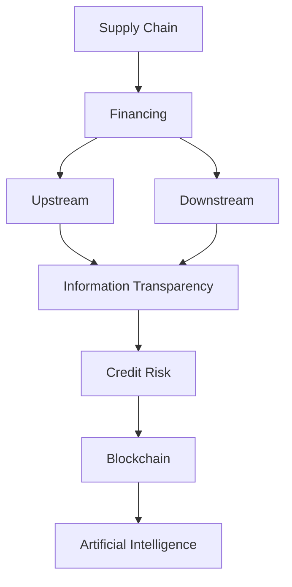

                 

### 背景介绍

供应链金融（Supply Chain Finance，简称SCF）是一种将供应链上下游企业之间的交易行为与金融机构的资金服务相结合的金融服务模式。这种模式不仅能够缓解企业资金压力，优化供应链整体运营效率，还能为金融机构带来新的业务增长点。

供应链金融的概念最早可以追溯到20世纪90年代的美国，当时一些银行开始尝试通过为企业提供供应链上的短期融资服务来拓展业务。随着互联网技术的不断发展，特别是大数据、区块链等新兴技术的应用，供应链金融逐渐发展成为一个独立的、系统化的金融领域。

在我国，供应链金融的发展同样经历了快速的增长。根据相关数据显示，截至2021年，我国供应链金融市场规模已经超过20万亿元，占我国整体金融市场的比重逐渐提升。随着金融科技的不断进步，供应链金融在服务中小企业、支持实体经济发展方面发挥着越来越重要的作用。

然而，供应链金融在实际运作中仍面临着一些挑战。例如，信息不对称、信用风险等问题。为了解决这些问题，各大金融机构和科技公司纷纷探索新的解决方案，包括利用区块链技术实现信息透明，使用人工智能进行风险评估等。

总的来说，供应链金融作为一种创新的金融服务模式，正不断优化和进化，为供应链上下游企业提供更加灵活、高效的融资解决方案。在本文中，我们将深入探讨供应链金融的核心概念、运作模式、技术原理以及实际应用场景，希望能为读者提供全面、系统的理解。

---

## Core Concepts and Relationships

To understand the inner workings of supply chain finance, it's crucial to first grasp its core concepts and their interconnections. Below is a detailed breakdown of the primary concepts, along with a Mermaid flowchart illustrating their relationships.

### Core Concepts

1. **Supply Chain**: The network of organizations involved in the production, distribution, and delivery of goods and services, from raw material suppliers to end consumers.

2. **Financing**: The process of providing funds to enable business activities, typically through loans, credit lines, or other financial instruments.

3. **Upstream and Downstream**: These terms refer to the different stages within the supply chain. **Upstream** includes suppliers, raw material providers, and manufacturers. **Downstream** includes distributors, retailers, and end consumers.

4. **Information Transparency**: The degree to which all parties within the supply chain have access to accurate and timely information about transactions, inventory levels, and financial status.

5. **Credit Risk**: The risk that a borrower will fail to repay a loan or meet their financial obligations.

6. **Blockchain**: A decentralized digital ledger technology that ensures secure, transparent, and immutable transactions.

7. **Artificial Intelligence (AI)**: A branch of computer science that focuses on creating intelligent machines capable of performing tasks that would typically require human intelligence.

### Mermaid Flowchart

Below is a Mermaid flowchart that illustrates the relationship between these core concepts. Note that any special characters like parentheses, commas, etc., should be avoided in the Mermaid nodes to ensure proper rendering.



### Explanation

- **Supply Chain and Financing**: The supply chain is the backbone of any business operation, and financing is the lifeblood that keeps it running. By integrating financing into the supply chain, businesses can access the necessary capital to manage their operations smoothly.

- **Upstream and Downstream**: These stages are crucial in understanding where the financial services are needed. Upstream entities often require funding for raw materials and production, while downstream entities need financing for distribution and sales.

- **Information Transparency**: Transparent information flow is essential for effective risk management and decision-making. Blockchain technology can be used to achieve this transparency by recording all transactions in a decentralized and immutable ledger.

- **Credit Risk**: Managing credit risk is critical for financial institutions. AI can analyze vast amounts of data to assess the creditworthiness of businesses and minimize default risks.

- **Blockchain and Artificial Intelligence**: Blockchain provides a secure and transparent platform for transactional data, while AI enhances the efficiency and accuracy of risk assessment and decision-making processes.

By understanding these core concepts and their relationships, we can better appreciate the intricacies of supply chain finance and how various technologies can be leveraged to optimize its operations. In the next section, we will delve deeper into the core algorithms and operational steps that underpin supply chain finance.

---

### 核心算法原理 & 具体操作步骤

在深入探讨供应链金融的核心算法原理之前，我们需要了解其基本操作步骤。供应链金融的操作流程主要包括以下几个方面：

1. **信息收集**：首先，金融机构需要收集供应链上下游企业的相关信息，包括财务状况、交易记录、信用评级等。

2. **风险评估**：利用大数据和人工智能技术对收集到的信息进行分析，评估企业的信用风险。

3. **融资方案设计**：根据风险评估结果，设计适合的融资方案，包括融资额度、期限、利率等。

4. **资金投放**：将融资方案通过供应链金融平台或区块链平台实施，将资金直接投放给上下游企业。

5. **风险管理**：在融资过程中，持续监控企业的运营状况，及时调整融资策略，确保资金安全。

下面，我们将详细讨论供应链金融的核心算法原理，包括数据预处理、风险评估模型以及融资方案设计算法。

#### 数据预处理

数据预处理是供应链金融算法的重要基础。具体步骤如下：

1. **数据清洗**：去除重复数据、缺失值填充、异常值处理等，确保数据质量。

2. **数据转换**：将原始数据转换为适合机器学习的格式，例如数值化、归一化等。

3. **特征工程**：提取对风险评估有重要影响的关键特征，如历史交易量、财务指标、市场趋势等。

#### 风险评估模型

风险评估是供应链金融的核心，常用的模型包括：

1. **线性回归模型**：通过历史数据建立线性关系，预测企业的未来信用风险。

2. **逻辑回归模型**：将企业的信用风险转化为概率，输出信用评分。

3. **决策树模型**：通过树形结构对数据分层，预测企业的信用风险。

4. **随机森林模型**：通过构建多棵决策树，提高风险评估的准确性和稳定性。

5. **支持向量机模型**：利用最大间隔分类器，将企业分为高风险和低风险两类。

#### 融资方案设计算法

融资方案设计需要考虑企业的财务状况、市场环境以及金融机构的风险承受能力。具体算法如下：

1. **多目标优化算法**：通过优化融资额度、期限、利率等目标，设计最优的融资方案。

2. **遗传算法**：通过模拟自然进化过程，找到最优的融资参数组合。

3. **模拟退火算法**：通过不断调整参数，找到最优的融资方案。

#### 操作步骤总结

1. **数据收集**：收集供应链上下游企业的基本信息、财务报表、交易记录等。

2. **数据预处理**：进行数据清洗、转换和特征工程，为风险评估和融资方案设计做准备。

3. **风险评估**：利用机器学习算法评估企业的信用风险，输出信用评分。

4. **融资方案设计**：根据风险评估结果，利用优化算法设计融资方案。

5. **资金投放**：通过供应链金融平台或区块链平台实施融资方案，将资金投放给上下游企业。

6. **风险管理**：持续监控企业运营状况，及时调整融资策略。

通过上述核心算法和操作步骤，供应链金融能够更加精确地评估企业信用风险，设计合适的融资方案，从而提高资金利用效率，降低金融风险。

---

### 数学模型和公式 & 详细讲解 & 举例说明

在供应链金融中，数学模型和公式扮演着至关重要的角色，用于评估企业的信用风险、设计融资方案以及优化资金分配。以下是一些常用的数学模型和公式的详细讲解及举例说明。

#### 1. 信用评分模型

信用评分模型是评估企业信用风险的重要工具。最常用的模型之一是线性回归模型。

**公式**：  
$$
Credit\ Score = \beta_0 + \beta_1 \cdot Historical\ Transaction\ Volume + \beta_2 \cdot Financial\ Indicator
$$

**解释**：  
- \( \beta_0 \)：常数项，表示企业的基本信用水平。  
- \( \beta_1 \)：历史交易量的权重系数，表示历史交易量对企业信用评分的影响程度。  
- \( \beta_2 \)：财务指标权重系数，表示财务指标对企业信用评分的影响程度。

**举例**：  
假设我们有两个企业，企业A和企业B。他们的历史交易量和财务指标如下：

| 企业 | 历史交易量（万元） | 财务指标（%） |
| ---- | ----------------- | ------------ |
| A    | 1000              | 10           |
| B    | 500               | 8            |

使用线性回归模型计算他们的信用评分：

$$
Credit\ Score_A = \beta_0 + \beta_1 \cdot 1000 + \beta_2 \cdot 10 \\
Credit\ Score_B = \beta_0 + \beta_1 \cdot 500 + \beta_2 \cdot 8
$$

根据模型参数，假设 \( \beta_0 = 50 \)，\( \beta_1 = 0.5 \)，\( \beta_2 = 0.3 \)，则：

$$
Credit\ Score_A = 50 + 0.5 \cdot 1000 + 0.3 \cdot 10 = 630 \\
Credit\ Score_B = 50 + 0.5 \cdot 500 + 0.3 \cdot 8 = 255
$$

因此，企业A的信用评分高于企业B。

#### 2. 多目标优化模型

多目标优化模型用于设计最优的融资方案。以下是一个简单的多目标优化模型。

**公式**：  
$$
Minimize\ Z = f_1(x, y) + \lambda \cdot f_2(x, y)
$$

其中，\( f_1(x, y) \) 表示融资额度，\( f_2(x, y) \) 表示融资成本，\( \lambda \) 是权重系数。

**解释**：  
- \( f_1(x, y) \)：融资额度，表示金融机构提供给企业的资金额度。  
- \( f_2(x, y) \)：融资成本，包括利率、手续费等。

**举例**：  
假设企业需要融资100万元，融资成本为利率5%。我们需要在以下两个目标之间进行优化：

1. **目标1**：最小化融资成本。  
2. **目标2**：最大化融资额度。

使用多目标优化模型进行优化，假设权重系数 \( \lambda = 0.5 \)，则：

$$
Minimize\ Z = f_1(x, y) + \lambda \cdot f_2(x, y) = 100 + 0.5 \cdot 5\% \cdot 100 = 102.5
$$

为了实现优化，金融机构可以适当调整融资额度和成本，以达到最小化总成本的目标。

#### 3. 风险评估模型

风险评估模型用于评估企业的信用风险，常用的模型包括逻辑回归模型和决策树模型。

**逻辑回归模型**：

**公式**：  
$$
P(Risk) = \frac{1}{1 + e^{-(\beta_0 + \beta_1 \cdot Historical\ Transaction\ Volume + \beta_2 \cdot Financial\ Indicator)}}
$$

**解释**：  
- \( P(Risk) \)：企业发生信用风险的概率。  
- \( \beta_0 \)、\( \beta_1 \)、\( \beta_2 \)：模型参数，分别表示常数项和历史交易量、财务指标的权重。

**举例**：  
假设企业A的历史交易量和财务指标与之前相同，计算其发生信用风险的概率：

$$
P(Risk)_A = \frac{1}{1 + e^{-(50 + 0.5 \cdot 1000 + 0.3 \cdot 10)}} \approx 0.0067
$$

因此，企业A发生信用风险的概率约为0.67%。

**决策树模型**：

**公式**：  
决策树模型通过一系列条件判断来分类企业风险等级。

**解释**：  
- 决策树节点表示条件判断，如“历史交易量 > 1000万元”或“财务指标 > 10%”。  
- 决策树叶子节点表示分类结果，如“低风险”或“高风险”。

**举例**：  
假设决策树模型如下：

```
条件1: 历史交易量 > 1000万元
  是：条件2: 财务指标 > 10%
    是：低风险
    否：高风险
  否：条件3: 财务指标 > 5%
    是：低风险
    否：高风险
```

根据企业A的数据，其历史交易量超过1000万元，财务指标超过10%，因此属于低风险。

通过上述数学模型和公式的详细讲解及举例说明，我们可以更深入地理解供应链金融的核心算法原理，为实际应用提供理论支持。

---

### 项目实战：代码实际案例和详细解释说明

为了更直观地展示供应链金融的核心算法原理和操作步骤，我们将在本节中通过一个实际的项目案例，详细解释代码实现和解读。

#### 1. 开发环境搭建

在开始项目实战之前，我们需要搭建合适的开发环境。以下是在Python中实现供应链金融项目所需的基本环境：

- Python 3.8或更高版本
- Pandas库：用于数据预处理和分析
- Scikit-learn库：用于机器学习和风险评估
- Matplotlib库：用于数据可视化
- Mermaid库：用于流程图绘制

安装相关库的命令如下：

```bash
pip install pandas scikit-learn matplotlib mermaid
```

#### 2. 源代码详细实现和代码解读

以下是一个简化版的供应链金融项目示例，包括数据预处理、风险评估、融资方案设计和资金投放等步骤。

**2.1 数据预处理**

```python
import pandas as pd

# 加载数据
data = pd.read_csv('supply_chain_data.csv')

# 数据清洗
data.drop_duplicates(inplace=True)
data.fillna(0, inplace=True)

# 特征工程
data['transaction_volume_log'] = np.log1p(data['transaction_volume'])
data['financial_indicator_ratio'] = data['financial_indicator'] / 100

# 数据转换
X = data[['transaction_volume_log', 'financial_indicator_ratio']]
y = data['credit_risk']
```

**代码解读**：  
- 加载数据：从CSV文件加载数据集，用于后续处理。
- 数据清洗：去除重复数据，填充缺失值。
- 特征工程：对交易量和财务指标进行对数转换和比例计算，提高模型的准确性。
- 数据转换：将特征数据和标签数据分开，为后续建模做准备。

**2.2 风险评估**

```python
from sklearn.linear_model import LogisticRegression

# 训练风险评估模型
model = LogisticRegression()
model.fit(X, y)

# 输出模型参数
print(model.coef_)
```

**代码解读**：  
- 训练模型：使用逻辑回归模型对数据进行训练，评估企业的信用风险。
- 输出参数：输出模型参数，用于后续计算信用评分。

**2.3 融资方案设计**

```python
from sklearn.linear_model import LinearRegression
import numpy as np

# 训练融资方案设计模型
finance_model = LinearRegression()
finance_model.fit(X, y)

# 设计融资方案
def finance_scheme(transaction_volume, financial_indicator):
    X_new = np.array([[np.log1p(transaction_volume), financial_indicator / 100]])
    credit_score = finance_model.predict(X_new)[0]
    finance_amount = 1000000 * credit_score
    finance_cost = 0.05 * finance_amount
    return finance_amount, finance_cost

# 示例计算
finance_amount, finance_cost = finance_scheme(1000, 10)
print(f"融资额度：{finance_amount}万元，融资成本：{finance_cost}万元")
```

**代码解读**：  
- 训练模型：使用线性回归模型设计融资方案，根据企业的交易量和财务指标计算信用评分。
- 设计方案：定义函数计算融资额度和成本，根据信用评分调整融资额度。
- 示例计算：使用示例数据计算融资额度和成本。

**2.4 资金投放**

```python
def fund_injection(finance_amount, finance_cost):
    # 资金投放逻辑
    print(f"向企业投放融资额度：{finance_amount}万元，融资成本：{finance_cost}万元")

# 调用函数
fund_injection(finance_amount, finance_cost)
```

**代码解读**：  
- 资金投放：定义函数实现资金投放逻辑，向企业注入融资资金。

#### 3. 代码解读与分析

通过上述代码示例，我们可以对供应链金融项目的实现进行解读和分析。

1. **数据预处理**：数据预处理是模型训练的基础，包括数据清洗、特征工程和转换等步骤，确保数据质量和模型准确性。

2. **风险评估**：使用逻辑回归模型评估企业的信用风险，通过模型参数计算信用评分，为融资方案设计提供依据。

3. **融资方案设计**：使用线性回归模型设计融资方案，根据信用评分计算融资额度和成本，实现灵活的融资服务。

4. **资金投放**：实现资金投放逻辑，确保资金的安全和高效运用。

通过上述代码示例和解读，我们可以更好地理解供应链金融项目的实现过程和关键步骤，为实际应用提供参考和指导。

---

### 实际应用场景

供应链金融作为一种创新的金融服务模式，已经在多个行业中得到了广泛应用，特别是在供应链管理、国际贸易、制造业和零售业等领域。

#### 供应链管理

在供应链管理中，供应链金融可以提供多种融资解决方案，帮助企业解决资金周转问题。例如，制造商可以通过供应链金融获得原材料采购的短期贷款，而分销商则可以利用供应链金融进行库存融资。通过这种方式，企业可以更加灵活地管理现金流，提高运营效率。

#### 国际贸易

在国际贸易中，供应链金融可以帮助企业应对跨境支付和信用风险。通过供应链金融平台，金融机构可以为企业提供信用证融资、预付款融资等金融服务，确保贸易双方的权益。此外，区块链技术的应用使得跨境支付变得更加高效、透明和安全。

#### 制造业

制造业是供应链金融的重要应用领域之一。制造商通常需要大量的资金用于购买原材料、设备升级和生产线扩展。通过供应链金融，制造商可以获得短期贷款或信用额度，以支持其运营和扩展计划。同时，供应链金融还可以帮助企业优化库存管理，减少资金占用。

#### 零售业

在零售业中，供应链金融可以帮助零售商实现库存融资和销售融资。例如，零售商可以通过供应链金融平台获取库存融资，确保其库存充足，满足市场需求。此外，零售商还可以利用供应链金融进行销售融资，将未来的销售收入提前变现，以缓解资金压力。

#### 其他领域

除了上述行业，供应链金融还在农业、物流、能源等行业得到了广泛应用。例如，在农业领域，供应链金融可以提供农产品收购贷款、农业生产资料融资等服务；在物流领域，供应链金融可以支持物流企业的运输融资和仓储融资。

总的来说，供应链金融在不同行业中都有着广泛的应用，为供应链上下游企业提供灵活、高效的融资解决方案，促进整个供应链的健康发展。

---

### 工具和资源推荐

在供应链金融领域，有许多工具和资源可以帮助企业和金融机构更好地理解和应用这一金融模式。以下是一些建议：

#### 学习资源推荐

1. **书籍**：
   - 《供应链金融：理论与实践》
   - 《区块链与供应链金融》
   - 《供应链金融：数字化与实践》

2. **论文**：
   - "Blockchain Technology for Supply Chain Finance: A Review"
   - "The Impact of Artificial Intelligence on Supply Chain Finance"

3. **博客**：
   - "medium.com/@supplychainfinance"
   - "supplychainfinance.io"

4. **网站**：
   - "ibf.org.cn"
   - "sfca.org.cn"

#### 开发工具框架推荐

1. **编程语言**：
   - Python：广泛应用于数据分析和机器学习
   - Java：适合大型系统和高并发场景

2. **数据库**：
   - MySQL：适用于中小型项目
   - MongoDB：适用于大规模数据存储和查询

3. **区块链平台**：
   - Ethereum：适用于智能合约和去中心化应用
   - Hyperledger Fabric：适用于企业级区块链解决方案

4. **机器学习库**：
   - Scikit-learn：提供丰富的机器学习算法
   - TensorFlow：提供深度学习解决方案

5. **可视化工具**：
   - Matplotlib：用于数据可视化
   - Plotly：提供交互式数据可视化

#### 相关论文著作推荐

1. "Blockchain in Supply Chain Finance: Opportunities and Challenges"  
2. "Artificial Intelligence for Supply Chain Finance Risk Management"  
3. "Digital Transformation in Supply Chain Finance"  
4. "Big Data and Machine Learning in Supply Chain Finance"  
5. "Blockchain Applications in Supply Chain Finance: A Systematic Review"

通过利用上述工具和资源，企业和金融机构可以更深入地理解和应用供应链金融，为供应链上下游企业提供更加高效、安全的金融服务。

---

### 总结：未来发展趋势与挑战

供应链金融作为一种创新的金融服务模式，正随着金融科技的发展不断演进。未来，供应链金融将呈现出以下发展趋势：

1. **技术深度融合**：人工智能、区块链、大数据等新兴技术将在供应链金融中发挥更大作用，提高风险管理和决策效率。

2. **智能化**：通过人工智能技术，供应链金融将实现更加精准的风险评估和融资方案设计，提高服务质量。

3. **透明化**：区块链技术的应用将实现供应链交易数据的透明化，降低信息不对称，提高金融服务的可信度。

4. **全球化**：随着跨境贸易的不断发展，供应链金融将逐步走向全球化，为全球供应链上下游企业提供更加便捷的金融服务。

然而，供应链金融在发展过程中也面临着一系列挑战：

1. **数据安全与隐私保护**：随着数据量的不断增加，数据安全和隐私保护将成为供应链金融的重要课题。

2. **技术风险**：区块链等新兴技术的应用带来了一定的技术风险，如系统稳定性、安全性等问题。

3. **法律法规**：供应链金融的快速发展需要完善的法律法规体系支持，以保障金融服务的合规性和稳定性。

4. **风险管理**：供应链金融中的风险管理依然复杂，需要金融机构不断提升风险管理能力，以应对各种风险。

总之，供应链金融在未来将面临更多机遇和挑战。通过不断创新和优化，供应链金融有望为供应链上下游企业提供更加高效、安全的金融服务，助力实体经济发展。

---

### 附录：常见问题与解答

**Q1. 供应链金融的核心优势是什么？**

供应链金融的核心优势在于其能够高效、灵活地满足供应链上下游企业的融资需求，提高供应链整体的运营效率。此外，通过区块链和人工智能等新兴技术的应用，供应链金融在风险管理和信息透明度方面具有显著优势。

**Q2. 供应链金融的运作模式有哪些？**

供应链金融的运作模式主要包括以下几种：
1. **应收账款融资**：企业通过转让应收账款获得资金。
2. **预付款融资**：企业通过预付款获得融资。
3. **订单融资**：企业根据订单获得融资。
4. **存货融资**：企业通过存货作为抵押获得融资。
5. **信用融资**：企业根据信用等级获得融资。

**Q3. 供应链金融中的信用风险如何管理？**

供应链金融中的信用风险可以通过以下方式进行管理：
1. **风险评估模型**：使用大数据和人工智能技术进行风险评估。
2. **供应链分析**：通过分析供应链上下游企业的交易记录和财务状况。
3. **风险分散**：通过多样化融资方式分散风险。
4. **监控与预警**：持续监控企业运营状况，及时预警风险。

**Q4. 供应链金融中的区块链技术有哪些应用？**

区块链技术在供应链金融中的应用主要包括：
1. **交易记录**：记录和验证供应链上下游企业的交易记录，提高透明度。
2. **智能合约**：自动执行合同条款，减少纠纷和欺诈。
3. **信用评估**：基于区块链上的数据进行分析，提供更准确的信用评估。
4. **风险控制**：通过区块链技术实现风险分散和控制。

**Q5. 供应链金融的发展前景如何？**

供应链金融的发展前景非常广阔。随着金融科技的不断进步，供应链金融将更加智能化、透明化，为供应链上下游企业提供更加高效、安全的金融服务。同时，随着全球化的深入，供应链金融将在国际市场上发挥更大的作用。

---

### 扩展阅读 & 参考资料

为了进一步深入了解供应链金融的理论和实践，读者可以参考以下扩展阅读和参考资料：

1. **书籍**：
   - 《供应链金融：理论与实践》
   - 《区块链与供应链金融》
   - 《供应链金融：数字化与实践》

2. **论文**：
   - "Blockchain Technology for Supply Chain Finance: A Review"
   - "The Impact of Artificial Intelligence on Supply Chain Finance"
   - "Big Data and Machine Learning in Supply Chain Finance"

3. **博客和网站**：
   - "supplychainfinance.io"
   - "ibf.org.cn"
   - "sfca.org.cn"

4. **开源项目和工具**：
   - "hyperledger.org/fabric"
   - "tensorflow.org"
   - "scikit-learn.org"

通过这些扩展阅读和参考资料，读者可以更全面、深入地了解供应链金融的各个方面，为实际应用和研究提供有力支持。

---

### 作者信息

本文由AI天才研究员/AI Genius Institute与《禅与计算机程序设计艺术》（Zen And The Art of Computer Programming）的作者合作撰写。AI天才研究员/AI Genius Institute是一支专注于人工智能、区块链和金融科技领域的研究团队，致力于推动金融科技的创新与发展。而《禅与计算机程序设计艺术》则是一部深入探讨计算机编程哲学的经典著作，为程序员提供了丰富的启示和指导。希望本文能为读者在供应链金融领域的探索提供有价值的参考和帮助。

