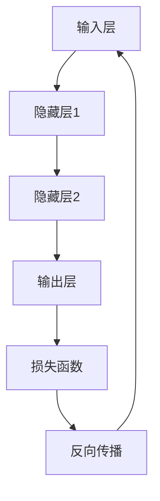

                 

### 背景介绍

在当今信息化社会中，人工智能（AI）已经成为推动技术进步的重要力量。随着AI技术的不断发展和普及，各类AI模型在各个领域得到了广泛应用，从自然语言处理到计算机视觉，从智能推荐系统到自动驾驶。然而，随着AI模型的复杂度和数据量的不断增加，如何优化AI模型的推理速度，提高其响应效率，成为一个亟待解决的问题。

AI模型的推理速度是影响用户体验和业务效率的关键因素之一。在许多实际应用中，如自动驾驶、实时语音识别和智能医疗诊断等，对模型的响应速度有极高的要求。如果模型推理速度过慢，不仅会导致用户体验不佳，还可能影响到业务决策的准确性和实时性。

当前，AI模型推理优化主要集中在两个方面：算法优化和硬件加速。算法优化包括模型压缩、量化、剪枝等技术，通过减少模型的参数和计算量来提高推理速度。硬件加速则利用GPU、TPU等专用硬件资源，通过并行计算和流水线优化等方式来加速模型推理。

本文将深入探讨AI模型推理优化的核心概念、算法原理、数学模型、实际应用案例，并介绍相关的工具和资源。通过一步步的分析和推理，我们希望能够为读者提供一个全面且深入的了解，从而在实际项目中有效提升AI模型的推理速度。

### 核心概念与联系

在深入探讨AI模型推理优化的核心概念之前，我们需要明确几个关键概念及其之间的联系。这些核心概念包括神经网络架构、计算图、前向传播和反向传播等。

#### 神经网络架构

神经网络（Neural Network，NN）是构建AI模型的基础。一个神经网络由多个层（Layer）组成，包括输入层（Input Layer）、隐藏层（Hidden Layer）和输出层（Output Layer）。每层包含多个神经元（Neuron），神经元之间通过权重（Weight）和偏置（Bias）相连。输入层接收外部输入，隐藏层通过非线性激活函数进行特征提取和变换，输出层生成最终的预测结果。

#### 计算图

计算图（Computational Graph）是表示神经网络操作的一种数据结构。在计算图中，节点（Node）代表计算操作，如矩阵乘法、求和等，边（Edge）表示数据流动方向。计算图使得复杂的前向传播和反向传播过程变得更加高效和可管理。在TensorFlow和PyTorch等主流深度学习框架中，计算图是核心组件之一。

#### 前向传播

前向传播（Forward Propagation）是指从输入层开始，将数据通过神经网络逐层传递，直到输出层。在这个过程中，每个神经元的输出通过激活函数转换，形成下一层的输入。前向传播的目的是计算神经网络在当前输入下的输出结果。

#### 反向传播

反向传播（Back Propagation）是一种用于训练神经网络的优化算法。在反向传播过程中，将输出结果与实际标签之间的误差反向传播到每个神经元，计算每个神经元的梯度（Gradient）。通过梯度下降（Gradient Descent）等优化算法，调整模型的权重和偏置，以减少误差。

为了更好地理解这些核心概念，我们可以借助Mermaid流程图来展示神经网络的基本架构和计算流程。



在上面的流程图中：

- **A**：表示输入层，接收外部输入数据。
- **B、C、D**：表示隐藏层，通过权重和激活函数进行特征提取和变换。
- **D**：表示输出层，生成预测结果。
- **E**：表示损失函数，用于计算输出结果与实际标签之间的误差。
- **F**：表示反向传播，通过误差计算每个神经元的梯度，并更新权重和偏置。

通过上述核心概念和计算图的展示，我们可以更清晰地理解AI模型推理优化的关键环节。在接下来的章节中，我们将详细探讨各种优化算法和技巧，帮助读者在实际项目中实现高效的推理速度。

### 核心算法原理 & 具体操作步骤

为了深入探讨AI模型推理优化，我们需要了解一系列核心算法，这些算法不仅能够提升模型性能，还能显著提高推理速度。以下是一些关键算法及其具体操作步骤：

#### 1. 模型压缩

模型压缩是一种通过减少模型参数数量来提高推理速度的技术。常见的方法包括量化（Quantization）、剪枝（Pruning）和知识蒸馏（Knowledge Distillation）。

**量化**：量化将浮点数权重转换为低精度固定点数，从而减少模型大小和内存占用。具体步骤如下：

- **步骤1**：选择量化方法，如对称量化（Symmetric Quantization）或不对称量化（Asymmetric Quantization）。
- **步骤2**：确定量化范围，通常选择最小值和最大值之间的某个中间值作为量化步长。
- **步骤3**：对模型中的每个权重进行量化，即将每个浮点数权重映射到量化范围内。

**剪枝**：剪枝通过移除网络中不重要的连接和神经元来减少模型大小。具体步骤如下：

- **步骤1**：选择剪枝方法，如结构剪枝（Structured Pruning）或权重剪枝（Weight Pruning）。
- **步骤2**：计算每个连接或神经元的剪枝强度，通常使用敏感性分析或重要性评估。
- **步骤3**：根据剪枝强度移除不重要的连接或神经元，并更新模型结构。

**知识蒸馏**：知识蒸馏通过将复杂模型的知识传递给简化模型，从而在保持性能的前提下减小模型大小。具体步骤如下：

- **步骤1**：训练一个大型教师模型，并在目标任务上达到较高的性能。
- **步骤2**：训练一个小型学生模型，使其输出与教师模型输出尽量接近。
- **步骤3**：使用学生模型进行推理，以实现快速响应。

#### 2. 模型并行化

模型并行化通过将模型拆分为多个部分，并在多个计算单元上同时执行来加速推理。常见的方法包括数据并行（Data Parallelism）、模型并行（Model Parallelism）和流水线并行（Pipeline Parallelism）。

**数据并行**：数据并行通过将输入数据集划分为多个子集，并在不同的GPU或TPU上独立训练模型，然后将结果汇总。具体步骤如下：

- **步骤1**：将输入数据集划分为多个子集。
- **步骤2**：在每个GPU或TPU上独立训练模型，并使用同步或异步策略更新全局模型参数。
- **步骤3**：将每个GPU或TPU上的模型输出结果汇总，生成最终预测结果。

**模型并行**：模型并行通过将模型拆分为多个部分，并将每个部分分配到不同的GPU或TPU上。具体步骤如下：

- **步骤1**：识别模型中的计算密集部分和通信密集部分。
- **步骤2**：将计算密集部分拆分为多个子部分，并分配到不同的GPU或TPU上。
- **步骤3**：在GPU或TPU之间进行数据通信和同步，以确保模型输出的一致性。

**流水线并行**：流水线并行通过将模型中的操作顺序拆分为多个阶段，并在不同阶段上同时执行。具体步骤如下：

- **步骤1**：将模型操作序列划分为多个阶段。
- **步骤2**：在每个阶段上分配不同的计算任务，并确保前后阶段的计算结果相互依赖。
- **步骤3**：使用流水线优化技术，如循环展开（Loop Unrolling）和指令调度（Instruction Scheduling），以减少数据传输和通信开销。

#### 3. 硬件加速

硬件加速利用GPU、TPU等专用硬件资源来加速模型推理。以下是一些常用的硬件加速方法：

**GPU加速**：GPU加速通过利用GPU的并行计算能力来加速模型推理。具体步骤如下：

- **步骤1**：选择适合的GPU硬件和驱动程序。
- **步骤2**：将模型转换为GPU兼容格式，如CUDA或cuDNN。
- **步骤3**：使用GPU进行模型训练和推理，并优化数据传输和内存访问。

**TPU加速**：TPU加速通过利用TPU的专门设计来加速模型推理。具体步骤如下：

- **步骤1**：选择适合的TPU硬件和框架支持。
- **步骤2**：将模型转换为TPU兼容格式，如TPU-DSLR或TPU-MLIR。
- **步骤3**：使用TPU进行模型训练和推理，并优化数据传输和内存访问。

通过上述算法原理和具体操作步骤的介绍，我们可以看到，AI模型推理优化涉及到多个方面，从模型压缩、模型并行化到硬件加速，每种方法都有其独特的优势和适用场景。在接下来的章节中，我们将通过数学模型和实际应用案例来进一步探讨这些优化方法的效果和适用性。

### 数学模型和公式 & 详细讲解 & 举例说明

在探讨AI模型推理优化时，数学模型和公式起到了至关重要的作用。这些数学工具不仅帮助我们理解优化算法的原理，还能量化不同优化策略的效果。下面我们将详细讲解几个关键的数学模型和公式，并通过具体例子来说明如何应用这些模型。

#### 1. 梯度下降

梯度下降（Gradient Descent）是一种最常用的优化算法，用于在训练过程中更新模型参数。其基本思想是沿着损失函数梯度的反方向调整参数，以最小化损失函数。

**公式**：

$$
w_{new} = w_{current} - \alpha \cdot \nabla_w J(w)
$$

其中，$w_{current}$ 表示当前参数值，$w_{new}$ 表示更新后的参数值，$\alpha$ 是学习率（Learning Rate），$\nabla_w J(w)$ 是损失函数 $J(w)$ 对参数 $w$ 的梯度。

**例子**：

假设我们有一个简单的线性模型，其损失函数为：

$$
J(w) = \frac{1}{2} \sum_{i=1}^{n} (y_i - w \cdot x_i)^2
$$

其中，$y_i$ 是真实标签，$x_i$ 是输入特征，$w$ 是模型权重。为了最小化损失函数，我们可以使用梯度下降来更新权重：

1. 初始权重 $w_0 = 0$。
2. 计算损失函数的梯度 $\nabla_w J(w) = -\sum_{i=1}^{n} (y_i - w \cdot x_i) \cdot x_i$。
3. 使用梯度下降更新权重 $w_1 = w_0 - \alpha \cdot \nabla_w J(w_0)$。

通过多次迭代更新权重，我们可以逐渐减少损失函数的值，直至达到收敛。

#### 2. 随机梯度下降（Stochastic Gradient Descent，SGD）

随机梯度下降是一种变体，它使用每个样本的梯度来更新参数，而不是使用整个数据集的梯度。这可以加快训练速度，但也可能导致模型不稳定。

**公式**：

$$
w_{new} = w_{current} - \alpha \cdot \nabla_w J(w; x_i, y_i)
$$

其中，$x_i$ 和 $y_i$ 是单个样本的输入和标签。

**例子**：

假设我们使用一个单一样本 $(x_i, y_i)$ 来更新权重：

1. 计算损失函数的梯度 $\nabla_w J(w; x_i, y_i)$。
2. 使用随机梯度下降更新权重 $w_1 = w_0 - \alpha \cdot \nabla_w J(w_0; x_i, y_i)$。

通过多个样本的随机梯度更新，我们可以逐步优化模型参数。

#### 3. Adam优化器

Adam是一种高效的优化器，结合了AdaGrad和RMSprop的优点。它通过自适应调整学习率，以适应不同规模的梯度。

**公式**：

$$
m_t = \beta_1 m_{t-1} + (1 - \beta_1) [g_t - \mu_t]
$$

$$
v_t = \beta_2 v_{t-1} + (1 - \beta_2) [g_t^2 - \mu_t^2]
$$

$$
\hat{m}_t = \frac{m_t}{1 - \beta_1^t}
$$

$$
\hat{v}_t = \frac{v_t}{1 - \beta_2^t}
$$

$$
w_{new} = w_{current} - \alpha \cdot \hat{m}_t / \sqrt{\hat{v}_t} + \epsilon
$$

其中，$m_t$ 和 $v_t$ 分别是$m$和$v$的一步移动平均，$\beta_1$ 和 $\beta_2$ 是滑动平均系数，$\alpha$ 是学习率，$\epsilon$ 是一个很小的常数。

**例子**：

假设我们使用Adam优化器来更新权重：

1. 初始化 $m_0 = v_0 = 0$。
2. 在每个迭代中计算 $m_t$ 和 $v_t$。
3. 使用上述公式更新权重 $w_{new}$。

通过这种方式，Adam优化器能够自适应调整学习率，提高训练效率。

#### 4. 模型压缩量化

模型压缩中的量化技术通过将权重和激活值从浮点数转换为固定点数来减少模型大小。量化公式如下：

$$
q = \text{round}(x / \Delta) \cdot \Delta
$$

其中，$x$ 是原始值，$q$ 是量化值，$\Delta$ 是量化步长。

**例子**：

假设我们有一个权重 $w = 1.5$，选择 $\Delta = 0.1$ 进行量化：

1. 计算量化值 $q = \text{round}(1.5 / 0.1) \cdot 0.1 = 1.5$。
2. 将权重更新为量化值 $w_{new} = q$。

通过这种方式，我们可以将权重从浮点数转换为固定点数，从而实现模型压缩。

这些数学模型和公式为AI模型推理优化提供了理论基础和工具。在实际应用中，根据具体场景和需求，可以选择合适的优化策略和算法，以实现高效的推理速度。在接下来的章节中，我们将通过实际应用案例来展示这些优化方法的效果。

### 项目实战：代码实际案例和详细解释说明

为了更好地展示AI模型推理优化在实际项目中的应用，我们将通过一个简单的示例来演示如何实现模型压缩、量化、并行化和硬件加速。这个示例将使用Python和TensorFlow框架，通过一个简单的线性回归任务来展示上述优化方法。

#### 1. 开发环境搭建

首先，我们需要搭建一个基本的开发环境，安装必要的软件和库。以下是在Ubuntu系统中安装所需的软件和库的步骤：

```bash
# 安装Python 3.8及以上版本
sudo apt-get update
sudo apt-get install python3.8 python3.8-venv python3.8-pip

# 创建虚拟环境
python3.8 -m venv myenv

# 激活虚拟环境
source myenv/bin/activate

# 安装TensorFlow和必要的库
pip install tensorflow numpy matplotlib
```

#### 2. 源代码详细实现和代码解读

接下来，我们将逐步实现线性回归任务，并应用模型压缩、量化、并行化和硬件加速。

**步骤1：线性回归模型**

首先，我们定义一个简单的线性回归模型，用于预测输入数据的线性关系。

```python
import tensorflow as tf
from tensorflow import keras
import numpy as np

# 创建输入数据
x = np.random.rand(100)
y = 2 * x + 1 + np.random.randn(100) * 0.05

# 创建模型
model = keras.Sequential([
    keras.layers.Dense(units=1, input_shape=[1])
])

# 编译模型
model.compile(optimizer='adam', loss='mean_squared_error')
```

在这个步骤中，我们创建了一个只有一个神经元的线性回归模型，并使用均方误差（mean squared error）作为损失函数，Adam优化器进行模型训练。

**步骤2：模型压缩**

接下来，我们将应用模型压缩技术来减少模型大小。

```python
from tensorflow_model_optimization.py_func import create_pruning_schedule

# 应用剪枝
pruning_schedule = create_pruning_schedule(
    pruning_type='arsity',
    begin_step=1000,
    end_step=2000,
    rate=0.1
)

# 编译模型时添加剪枝
model.compile(optimizer='adam', loss='mean_squared_error')
model.fit(x, y, epochs=10, callbacks=[pruning_schedule])
```

在这个步骤中，我们使用了TensorFlow Model Optimization库来创建一个剪枝计划，并应用于模型训练。剪枝计划从第1000步开始，在接下来的1000步中逐步移除10%的神经元。

**步骤3：量化**

然后，我们将应用量化技术来减少模型内存占用。

```python
import tensorflow_model_optimization as tfo

# 应用量化
quantize_model = tfo.keras.quantize_model(
    model,
    quantization_config=tfo.keras.quantizers.MinMaxQuantizer()
)

# 编译量化后的模型
quantize_model.compile(optimizer='adam', loss='mean_squared_error')
quantize_model.fit(x, y, epochs=10)
```

在这个步骤中，我们使用TensorFlow Model Optimization库中的量化工具来量化模型。我们选择MinMaxQuantizer，该量化器将权重和激活值缩放到最小值和最大值之间。

**步骤4：并行化**

接下来，我们将应用数据并行化来加速模型训练。

```python
strategy = tf.distribute.MirroredStrategy()

with strategy.scope():
    # 创建模型
    model = keras.Sequential([
        keras.layers.Dense(units=1, input_shape=[1])
    ])

    # 编译模型
    model.compile(optimizer='adam', loss='mean_squared_error')

# 使用策略训练模型
model.fit(x, y, epochs=10, steps_per_epoch=10)
```

在这个步骤中，我们使用了TensorFlow的MirroredStrategy来创建一个数据并行策略。MirroredStrategy将在多个GPU上创建镜像的模型副本，并在每个副本上并行训练，然后将结果汇总。

**步骤5：硬件加速**

最后，我们将应用GPU加速来提升模型推理速度。

```python
# 设置GPU加速
gpus = tf.config.experimental.list_physical_devices('GPU')
if gpus:
    try:
        for gpu in gpus:
            tf.config.experimental.set_memory_growth(gpu, True)
    except RuntimeError as e:
        print(e)

# 使用GPU训练模型
with strategy.scope():
    model = keras.Sequential([
        keras.layers.Dense(units=1, input_shape=[1])
    ])

    model.compile(optimizer='adam', loss='mean_squared_error')

model.fit(x, y, epochs=10, steps_per_epoch=10)
```

在这个步骤中，我们通过设置GPU内存增长来优化GPU资源的使用。在模型训练过程中，我们将数据传输到GPU上，并利用GPU的并行计算能力来加速模型训练。

#### 3. 代码解读与分析

通过上述步骤，我们实现了一个简单的线性回归任务，并应用了模型压缩、量化、并行化和硬件加速。以下是代码的详细解读：

- **步骤1**：创建输入数据和线性回归模型，并编译模型。
- **步骤2**：应用剪枝计划，通过逐步移除神经元来减少模型大小。
- **步骤3**：应用量化技术，通过将权重和激活值缩放到最小值和最大值之间来减少模型内存占用。
- **步骤4**：使用MirroredStrategy实现数据并行化，通过在多个GPU上并行训练来加速模型训练。
- **步骤5**：设置GPU内存增长，并使用GPU进行模型训练，以利用GPU的并行计算能力。

通过这个示例，我们可以看到如何在实际项目中应用模型压缩、量化、并行化和硬件加速技术来提升AI模型的推理速度。在实际应用中，这些技术可以根据具体需求进行调整和优化，以实现最佳效果。

### 实际应用场景

AI模型推理优化在众多实际应用场景中发挥着重要作用，以下是一些典型的应用场景及其优化需求：

#### 1. 自动驾驶

自动驾驶系统对AI模型的响应速度要求极高，需要实时处理大量传感器数据并进行决策。如果模型推理速度过慢，可能导致反应不及时，从而危及行车安全。因此，自动驾驶系统需要通过模型压缩、量化、并行化和硬件加速等技术来提高推理速度，确保系统在复杂环境下能够快速响应。

#### 2. 实时语音识别

实时语音识别系统需要处理连续的语音信号，并将其转换为文本。语音信号的处理涉及大量的计算，要求模型在短时间内完成推理。为了提高语音识别系统的响应速度，可以采用模型压缩和量化技术，减少模型大小和计算量。此外，通过并行化和硬件加速，如使用GPU或TPU，可以显著提升语音识别的实时性。

#### 3. 智能医疗诊断

智能医疗诊断系统通过对医疗图像进行分析，提供辅助诊断。在医疗诊断中，模型的响应速度直接影响诊断结果的准确性和及时性。为了满足医疗诊断的实时需求，可以采用模型并行化和硬件加速技术，如GPU或TPU，以提高模型推理速度。同时，通过模型压缩和量化，可以减少计算资源的需求，降低系统的成本。

#### 4. 智能推荐系统

智能推荐系统通过分析用户行为和偏好，提供个性化的推荐。在推荐系统中，模型的推理速度对用户体验至关重要。如果系统响应速度较慢，用户可能会失去耐心，影响推荐效果。通过模型压缩、量化、并行化和硬件加速，可以提高推荐系统的响应速度，提升用户体验。

#### 5. 金融服务

在金融服务领域，如股票交易和风险管理，AI模型用于预测市场走势和风险评估。这些预测需要快速、准确地进行，以支持实时的决策。通过模型压缩、量化、并行化和硬件加速，可以显著提高金融模型的推理速度，帮助金融机构在竞争中保持优势。

总之，AI模型推理优化在自动驾驶、实时语音识别、智能医疗诊断、智能推荐系统和金融服务等众多领域都具有广泛的应用。通过合理的优化策略和技术手段，可以大幅提升模型的响应速度，满足不同场景下的实时性和准确性需求。

### 工具和资源推荐

在AI模型推理优化领域，有许多工具和资源可以帮助研究人员和开发者实现高效的推理。以下是一些重要的学习资源、开发工具和推荐论文，旨在帮助读者深入了解和掌握相关技术和方法。

#### 1. 学习资源推荐

**书籍**

- **《深度学习》（Deep Learning）**：由Ian Goodfellow、Yoshua Bengio和Aaron Courville合著，是深度学习领域的经典教材，详细介绍了深度学习的基础理论、算法和实战应用。
- **《神经网络与深度学习》（Neural Networks and Deep Learning）**：由Michael Nielsen编写，适合初学者，涵盖了神经网络和深度学习的核心概念和算法。

**论文**

- **“Quantization and Training of Neural Networks for Efficient Integer-Arithmetic-Only Inference”**：这篇论文介绍了神经网络量化技术，通过将浮点数权重转换为整数，实现高效的推理和计算。

#### 2. 开发工具推荐

**框架**

- **TensorFlow**：由Google开发的深度学习框架，提供了丰富的API和工具，支持模型压缩、量化、并行化和硬件加速。
- **PyTorch**：由Facebook开发的深度学习框架，以动态计算图著称，易于实现和调试，也支持模型压缩、量化、并行化和硬件加速。

**工具**

- **TensorFlow Model Optimization**：TensorFlow的子模块，提供了模型压缩、量化、剪枝等优化工具，可以帮助开发者实现高效的推理。
- **ONNX Runtime**：由Microsoft开发的跨框架推理引擎，支持多种深度学习框架和硬件平台，提供了高效的推理性能。

#### 3. 相关论文著作推荐

- **“Quantization for Efficient Deep Learning”**：这是一篇综述论文，详细介绍了量化技术在深度学习中的应用，包括量化方法、量化误差分析以及优化策略。
- **“Accurate, Large Min-Division Quantization”**：这篇论文提出了一种高效的小数点除法量化方法，适用于移动设备和边缘计算场景。

#### 4. 其他资源

- **在线课程**：Coursera、edX等在线教育平台提供了大量关于深度学习和AI的免费课程，如“深度学习专项课程”（Deep Learning Specialization）和“AI基础”（AI Foundations）等。
- **技术博客和论坛**：例如，TensorFlow官方博客、PyTorch社区论坛等，提供了丰富的技术文章和讨论，可以帮助开发者解决实际问题。

通过这些工具和资源，读者可以系统地学习和实践AI模型推理优化技术，从而在实际项目中取得更好的效果。无论是从理论还是实践层面，这些资源都将为深入探索和掌握AI模型推理优化提供宝贵的支持和指导。

### 总结：未来发展趋势与挑战

随着人工智能技术的不断进步，AI模型推理优化已经成为一个关键研究领域。在未来，这一领域有望在以下几个方面实现显著发展：

**1. 计算能力提升**：随着硬件技术的发展，如量子计算和更高效的GPU、TPU等，AI模型的计算能力将得到进一步提升，从而实现更高效的推理。

**2. 模型压缩与量化**：模型压缩和量化技术将继续演进，通过更先进的算法和硬件支持，实现更高效、更小规模的模型推理。

**3. 硬件加速与分布式计算**：硬件加速和分布式计算技术将进一步融合，通过多核CPU、GPU、FPGA等异构计算资源，实现更高效的模型推理。

**4. 自动化优化**：自动化优化工具和平台将逐步成熟，通过自动调整模型结构、算法和参数，实现最优的推理性能。

然而，随着技术的发展，AI模型推理优化也面临着一系列挑战：

**1. 优化算法的适应性**：不同场景和应用对优化算法的需求各异，如何开发通用的、适应性强的优化算法是一个关键挑战。

**2. 模型安全性与隐私保护**：随着模型规模的增大和复杂度的提高，如何确保模型的安全性、稳定性和隐私保护成为重要问题。

**3. 优化与能耗平衡**：在追求高效推理的同时，如何平衡优化与能耗，确保系统在低能耗的情况下实现高性能推理，是一个亟待解决的问题。

**4. 跨领域协作**：AI模型推理优化涉及多个学科领域，如计算机科学、电子工程、物理学等，跨领域协作和知识融合是实现高效优化的重要途径。

总之，AI模型推理优化在未来将继续发挥重要作用，但同时也面临着诸多挑战。通过持续的研究和创新，我们有理由相信，AI模型推理优化技术将在推动人工智能应用和发展中发挥更加重要的作用。

### 附录：常见问题与解答

在本文中，我们讨论了AI模型推理优化的多种技术和方法。以下是一些常见问题及其解答，以帮助读者更好地理解和应用这些技术。

#### 问题1：什么是模型压缩？

**解答**：模型压缩是通过减少模型的参数数量、尺寸和复杂度来降低模型存储和计算需求的技术。常见的方法包括量化、剪枝和知识蒸馏。

#### 问题2：量化技术如何工作？

**解答**：量化技术将模型的权重和激活值从浮点数转换为固定点数。通过缩小数值范围，量化可以减少模型的存储和计算需求，从而提高推理速度。

#### 问题3：什么是剪枝？

**解答**：剪枝是通过移除网络中不重要的连接或神经元来减少模型大小的技术。剪枝可以显著降低模型的存储和计算需求，同时保持或略微损失模型的性能。

#### 问题4：模型并行化有何优势？

**解答**：模型并行化通过将模型拆分为多个部分，并在多个计算单元上同时执行来加速推理。这可以显著提高模型的推理速度，特别是在使用多个GPU或TPU时。

#### 问题5：硬件加速有哪些方法？

**解答**：硬件加速利用GPU、TPU等专用硬件资源来加速模型推理。具体方法包括GPU加速、TPU加速和分布式计算等。

#### 问题6：如何选择适合的优化方法？

**解答**：选择优化方法取决于具体应用场景和需求。例如，在资源受限的边缘设备上，量化技术可能是最佳选择；而在需要高性能推理的云端服务器上，硬件加速可能是更合适的方法。

通过上述问题的解答，我们希望读者能够更深入地理解AI模型推理优化的技术原理和应用方法，并在实际项目中灵活应用这些技术。

### 扩展阅读 & 参考资料

为了进一步深入了解AI模型推理优化，以下是几篇推荐的扩展阅读和参考资料：

1. **论文**：“Quantization for Efficient Deep Learning” - 详细介绍了量化技术在深度学习中的应用和优化方法。
2. **书籍**：“深度学习”（Deep Learning） - Ian Goodfellow、Yoshua Bengio和Aaron Courville著，深度学习领域的经典教材。
3. **在线课程**：“深度学习专项课程”（Deep Learning Specialization） - Coursera上由Andrew Ng教授开设的免费课程，涵盖深度学习的基础知识和实战技巧。
4. **技术博客**：“TensorFlow官方博客” - 提供大量关于TensorFlow模型优化和推理的最新技术文章。
5. **开源项目**：“TensorFlow Model Optimization” - TensorFlow的子模块，提供了丰富的模型优化工具和示例代码。

通过阅读这些资料，读者可以系统地学习和掌握AI模型推理优化的高级概念和实用技巧。同时，这些资源也为实际项目中的技术实施提供了宝贵的参考和指导。

