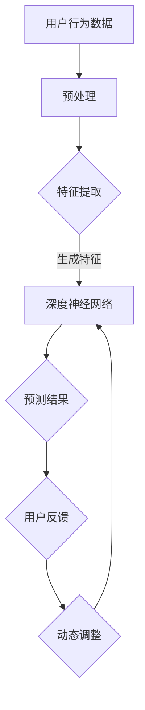

                 

### 1. 背景介绍

推荐系统作为大数据和人工智能领域的核心技术之一，已经成为现代信息社会中不可或缺的一环。无论是电商平台的商品推荐、视频网站的影视推荐，还是社交媒体的个性化内容推送，推荐系统都在为我们提供着个性化的服务，极大地提升了用户体验。

然而，随着用户数据量的不断增加和用户行为模式的多样化，如何实现推荐系统的实时个性化，成为了一个亟待解决的重要问题。传统的推荐系统往往依赖于预先训练好的模型，这些模型在生成推荐结果时只能基于训练数据集，很难适应实时数据的变化。这就导致了一个问题：当用户的行为发生改变时，推荐系统可能无法及时更新推荐结果，从而影响了用户的体验。

为了解决这一问题，AI大模型的动态调整策略应运而生。AI大模型，即通过深度学习等先进技术训练的复杂神经网络模型，拥有强大的自适应能力。它们可以在接收新数据时，实时调整模型参数，生成更加个性化的推荐结果。这种动态调整策略，不仅提高了推荐系统的实时性，还显著提升了推荐的准确性和用户满意度。

本文将围绕AI大模型的动态调整策略进行深入探讨，首先介绍推荐系统的基本概念和发展历程，然后详细阐述动态调整策略的核心原理和操作步骤，接着通过数学模型和实际案例，展示其具体应用，并探讨其在不同场景中的实际应用效果。最后，我们将对未来的发展趋势和挑战进行展望。

通过本文的阅读，读者将全面了解AI大模型在推荐系统中的应用，掌握动态调整策略的基本原理和实现方法，为实际项目中的推荐系统优化提供有益的参考。

### 2. 核心概念与联系

#### 推荐系统简介

推荐系统（Recommendation System）是一种基于数据挖掘和机器学习技术的智能信息过滤系统，旨在向用户提供个性化的信息推荐。其核心目标是通过分析用户的历史行为数据、兴趣偏好和社交网络关系等，预测用户可能感兴趣的内容，从而提高用户满意度和信息获取效率。

推荐系统的发展历程可以分为三个阶段：基于规则的推荐系统、基于协同过滤的推荐系统和基于模型的推荐系统。

1. **基于规则的推荐系统**：这种系统通过预定义的规则，如“如果用户喜欢A，那么推荐B”，来生成推荐结果。其优点是简单易懂，易于实现，但缺点是灵活性差，无法适应复杂多变的用户需求。

2. **基于协同过滤的推荐系统**：协同过滤（Collaborative Filtering）是一种通过分析用户之间的共同行为来预测用户偏好的方法。它分为两种主要类型：基于用户的协同过滤（User-Based）和基于物品的协同过滤（Item-Based）。基于用户的协同过滤通过寻找与当前用户兴趣相似的其它用户，推荐他们喜欢的物品；而基于物品的协同过滤则是通过分析用户对物品的评分，寻找与当前物品相似的其它物品进行推荐。这种方法在一定程度上提高了推荐的准确性，但容易受到数据稀疏性和冷启动问题的影响。

3. **基于模型的推荐系统**：随着深度学习等机器学习技术的发展，基于模型的推荐系统逐渐成为主流。这种系统通过构建复杂的神经网络模型，如神经网络协同过滤（Neural Collaborative Filtering）、深度学习推荐模型（Deep Learning for Recommender Systems）等，对用户和物品进行特征提取和关联分析，从而生成个性化的推荐结果。与传统的协同过滤方法相比，基于模型的推荐系统具有更好的泛化能力和适应能力。

#### AI大模型的概念

AI大模型（Large-scale AI Model）是指那些参数规模巨大、能够在海量数据集上训练的复杂神经网络模型。这些模型通常采用深度学习技术，能够通过多层神经网络对输入数据进行特征提取和关联分析，从而实现高度复杂的任务。

AI大模型的常见类型包括：

1. **深度神经网络（Deep Neural Network, DNN）**：DNN是一种多层前馈神经网络，通过逐层对输入数据进行特征提取和组合，实现从原始数据到高维特征空间的映射。

2. **卷积神经网络（Convolutional Neural Network, CNN）**：CNN是一种在图像识别和计算机视觉任务中广泛应用的网络结构，通过卷积层和池化层实现对图像数据的特征提取。

3. **循环神经网络（Recurrent Neural Network, RNN）**：RNN是一种能够处理序列数据的神经网络，通过循环结构对序列中的每个元素进行建模。

4. **长短期记忆网络（Long Short-Term Memory, LSTM）**：LSTM是RNN的一种变体，通过引入记忆单元，解决了传统RNN在处理长序列数据时容易遇到的梯度消失和梯度爆炸问题。

#### 动态调整策略的原理

动态调整策略（Dynamic Adjustment Strategy）是指通过实时更新和优化推荐系统的模型参数，以适应用户行为和兴趣变化的策略。这种策略的核心目标是提高推荐系统的实时性和个性化水平。

动态调整策略的实现原理主要包括以下几个方面：

1. **在线学习（Online Learning）**：在线学习是一种能够在数据输入的同时更新模型参数的方法。通过不断地接收新的用户行为数据，模型可以实时调整其参数，从而生成更加准确的推荐结果。

2. **增量学习（Incremental Learning）**：增量学习是一种在已有模型基础上，通过新数据的加入进行模型优化的方法。这种方法避免了从头开始训练模型的繁琐过程，提高了学习效率。

3. **模型融合（Model Fusion）**：模型融合是一种将多个模型的结果进行综合的方法。通过结合不同模型的优点，模型融合能够生成更加多样化和准确的推荐结果。

4. **迁移学习（Transfer Learning）**：迁移学习是一种利用预训练模型在新任务上进行优化的方法。通过在相关任务上预训练，模型可以共享部分知识，从而提高在新任务上的表现。

#### Mermaid 流程图

为了更直观地展示推荐系统的动态调整策略，以下是一个基于Mermaid的流程图：



在该流程图中，用户行为数据经过预处理和特征提取后，输入到深度神经网络中进行预测。生成的预测结果与用户反馈进行对比，根据反馈结果，模型参数进行动态调整，以生成更准确的预测结果。

通过上述对推荐系统、AI大模型和动态调整策略的介绍，我们可以看到这三个核心概念之间的紧密联系。推荐系统依赖于AI大模型来实现个性化的推荐，而动态调整策略则通过实时更新模型参数，提高了推荐的实时性和准确性。在接下来的章节中，我们将深入探讨AI大模型的动态调整策略的具体实现方法。

#### 推荐系统的实时个性化

实时个性化（Real-time Personalization）是指推荐系统能够根据用户的实时行为和偏好动态调整推荐内容，以提供高度个性化的用户体验。在传统推荐系统中，模型通常是离线训练的，这意味着它们只能基于历史数据生成推荐，无法及时响应用户当前的需求变化。这种延迟性在用户行为快速变化的场景中，如社交媒体、在线购物和新闻推送，会导致用户体验不佳，影响用户满意度和系统留存率。

实现推荐系统的实时个性化，关键在于模型的自适应能力。AI大模型在这方面具有显著优势，因为它们可以通过在线学习（Online Learning）和增量学习（Incremental Learning）等技术，实时接收和处理用户的新行为数据，动态调整模型参数，从而生成个性化的推荐结果。这种方法不仅提高了推荐的时效性，还能更好地捕捉用户的即时偏好，提供更加精准的推荐。

具体来说，实时个性化可以通过以下几种方式实现：

1. **实时反馈机制**：系统持续收集用户的实时行为数据，如点击、购买、浏览等，并利用这些数据对推荐模型进行实时调整。这种方式能够确保推荐结果与用户当前状态高度匹配。

2. **在线学习算法**：采用在线学习算法，如梯度下降（Gradient Descent）或其变种，模型可以在数据流中逐步调整参数，实现实时优化。这种方法适用于低延迟、高更新频率的场景。

3. **增量学习**：通过增量学习，模型仅对新增的用户行为数据进行分析和调整，而不是从头开始训练。这种方法不仅减少了计算成本，还能保持模型的稳定性和鲁棒性。

4. **模型融合**：将多个实时模型的结果进行综合，生成最终的推荐结果。这种方式能够利用不同模型的优点，提高推荐效果和多样性。

5. **迁移学习**：利用预训练的大模型在新的用户行为数据上进行微调，从而快速适应新的场景。这种方式能够利用已有的知识，提高新用户的数据利用效率。

通过上述技术，推荐系统可以实现对用户行为的即时响应，提供高度个性化的服务。这不仅提高了用户的满意度，还能增加用户黏性和系统收益。然而，实现实时个性化也面临着一些挑战，如数据延迟、计算资源和模型稳定性等问题。这些问题将在后续章节中进一步探讨。

### 3. 核心算法原理 & 具体操作步骤

在深入探讨AI大模型的动态调整策略之前，我们首先需要理解其核心算法原理，包括在线学习（Online Learning）和增量学习（Incremental Learning）。

#### 在线学习算法原理

在线学习算法是一种能够动态调整模型参数的机器学习技术，它适用于数据流或实时数据集。在这种学习方式中，模型在每次接收到新的数据时，都会进行参数更新，以最大化预测准确性。以下是一个简单的在线学习算法步骤：

1. **初始化模型参数**：首先，我们需要初始化模型的参数，这通常是随机选择的。

2. **接收新数据**：在线学习算法不断地接收新数据，例如用户行为数据、物品特征等。

3. **模型预测**：使用当前模型参数对新数据进行预测，生成推荐结果。

4. **计算损失函数**：计算预测结果与实际结果之间的差异，通常使用损失函数（如均方误差、交叉熵等）来度量这种差异。

5. **参数更新**：根据损失函数的计算结果，更新模型参数，以减小预测误差。

6. **迭代更新**：重复步骤3到5，直到达到某个停止条件，如收敛或达到预设迭代次数。

一个常用的在线学习算法是梯度下降（Gradient Descent），其基本步骤如下：

- **计算梯度**：计算损失函数关于模型参数的梯度。
- **更新参数**：根据梯度方向和步长，更新模型参数。
- **重复迭代**：重复计算梯度和更新参数，直到满足停止条件。

#### 增量学习算法原理

增量学习是一种在已有模型基础上，通过新数据的加入进行模型优化的方法。这种方法避免了从头开始训练模型的繁琐过程，提高了学习效率。以下是增量学习的基本步骤：

1. **初始化模型**：首先，我们需要初始化一个已经训练好的模型。

2. **接收新数据**：增量学习算法接收新数据，例如用户行为的增量数据。

3. **特征提取**：对新增数据提取特征，并与原有特征进行融合。

4. **模型微调**：在新特征的基础上，对模型进行微调，通常使用梯度下降等方法。

5. **模型优化**：通过优化算法（如Adam、RMSprop等）调整模型参数，以减小预测误差。

6. **迭代优化**：重复步骤3到5，直到满足停止条件。

#### 动态调整策略的具体操作步骤

动态调整策略的目的是通过实时更新和优化推荐模型，以适应用户行为和偏好变化。以下是一个基于在线学习和增量学习的基本操作步骤：

1. **数据预处理**：对用户行为数据进行清洗、归一化和特征提取。这一步骤至关重要，因为高质量的数据特征直接影响模型的效果。

2. **模型初始化**：初始化一个基于深度学习的推荐模型，如神经网络协同过滤（Neural Collaborative Filtering）或深度学习推荐模型（Deep Learning for Recommender Systems）。

3. **实时数据接收**：系统持续收集用户的实时行为数据，如点击、浏览和购买等。

4. **模型预测与反馈**：使用当前模型参数对新增数据进行分析，生成推荐结果，并与用户实际行为进行对比，收集反馈数据。

5. **损失函数计算**：计算预测结果与实际结果之间的差异，使用损失函数（如均方误差、交叉熵等）来度量这种差异。

6. **参数更新**：根据损失函数的计算结果，使用在线学习或增量学习算法更新模型参数。

7. **模型优化**：通过优化算法调整模型参数，以减小预测误差。

8. **迭代更新**：重复步骤4到7，直到模型收敛或达到预设迭代次数。

9. **推荐结果生成**：根据最终的模型参数，生成个性化的推荐结果。

在实际应用中，动态调整策略通常需要考虑以下因素：

- **数据延迟**：实时数据接收和处理的延迟会影响模型的效果。因此，系统需要设计高效的实时数据处理机制。
- **计算资源**：在线学习和增量学习算法需要大量的计算资源。因此，系统需要优化计算资源的使用，确保模型的实时性和稳定性。
- **模型稳定性**：动态调整过程中，模型可能会受到噪声数据和异常值的影响，从而影响其稳定性。因此，系统需要设计鲁棒性强的模型调整策略。

通过上述操作步骤，推荐系统能够实现实时个性化，提高推荐准确性，从而提升用户满意度。然而，实现这一目标也需要面对一系列挑战，如数据稀疏性、冷启动问题和计算资源限制等。这些问题将在后续章节中进一步探讨。

#### 数学模型和公式 & 详细讲解 & 举例说明

为了深入理解AI大模型在动态调整策略中的具体应用，我们首先需要介绍相关的数学模型和公式。以下是几个核心概念和数学模型，通过详细讲解和举例说明，我们将帮助读者更好地掌握这些概念。

##### 损失函数（Loss Function）

损失函数是机器学习中衡量预测结果与实际结果之间差异的重要工具。在动态调整策略中，损失函数用于计算预测误差，并指导模型参数的更新。以下是一些常见的损失函数：

1. **均方误差（Mean Squared Error, MSE）**：

   $$MSE = \frac{1}{n}\sum_{i=1}^{n}(y_i - \hat{y}_i)^2$$

   其中，$y_i$ 是实际值，$\hat{y}_i$ 是预测值，$n$ 是数据样本数量。

   **举例**：假设我们有一个数据集，包含5个样本的预测值和实际值如下：

   | 实际值 | 预测值 | 差异 |
   |--------|--------|------|
   | 3      | 2.5    | 0.5  |
   | 5      | 4.8    | 0.2  |
   | 6      | 5.1    | 0.1  |
   | 8      | 7.2    | -0.2 |
   | 10     | 9.0    | 0.0  |

   使用MSE计算损失：

   $$MSE = \frac{1}{5}[(0.5)^2 + (0.2)^2 + (0.1)^2 + (-0.2)^2 + (0.0)^2] = 0.12$$

2. **交叉熵（Cross-Entropy）**：

   在分类问题中，交叉熵用于衡量实际分布与预测分布之间的差异。对于二分类问题，交叉熵公式如下：

   $$H(y, \hat{y}) = -y \cdot \log(\hat{y}) - (1 - y) \cdot \log(1 - \hat{y})$$

   其中，$y$ 是实际类别标签（0或1），$\hat{y}$ 是预测概率。

   **举例**：假设我们有一个二分类问题的数据集，其中实际标签和预测概率如下：

   | 实际值 | 预测概率 |
   |--------|----------|
   | 1      | 0.9      |
   | 0      | 0.1      |

   使用交叉熵计算损失：

   $$H(1, 0.9) = -1 \cdot \log(0.9) - (1 - 1) \cdot \log(1 - 0.9) = 0.105$$

   $$H(0, 0.1) = -0 \cdot \log(0.1) - (1 - 0) \cdot \log(1 - 0.1) = 0.29$$

   总损失为：

   $$\text{Total Loss} = H(1, 0.9) + H(0, 0.1) = 0.105 + 0.29 = 0.395$$

##### 梯度下降（Gradient Descent）

梯度下降是一种优化算法，用于最小化损失函数。其核心思想是沿着损失函数的梯度方向调整模型参数，以减小损失。

1. **梯度计算**：

   对于均方误差损失函数，梯度计算公式如下：

   $$\nabla_\theta J(\theta) = \frac{\partial J(\theta)}{\partial \theta} = 2 \cdot (y_i - \hat{y}_i)$$

   其中，$\theta$ 是模型参数，$J(\theta)$ 是损失函数。

2. **参数更新**：

   梯度下降的基本步骤包括计算梯度、更新参数和重复迭代。更新公式如下：

   $$\theta = \theta - \alpha \cdot \nabla_\theta J(\theta)$$

   其中，$\alpha$ 是学习率，控制参数更新的步长。

   **举例**：假设我们的模型参数为 $\theta_0 = 5$，学习率为 $\alpha = 0.1$，并且我们有一个样本 $(y_i, \hat{y}_i) = (3, 2.5)$。使用梯度下降更新参数：

   $$\theta_1 = \theta_0 - \alpha \cdot 2 \cdot (3 - 2.5) = 5 - 0.1 \cdot 2 \cdot 0.5 = 4.8$$

##### 优化算法（Optimization Algorithms）

在实际应用中，梯度下降存在一些局限性，如收敛速度慢和可能陷入局部最小值等问题。为此，我们引入了一些优化算法，如Adam、RMSprop等，以提高模型的收敛速度和稳定性。

1. **Adam优化器**：

   Adam优化器结合了动量（Momentum）和自适应学习率（Adaptive Learning Rate）的优点，其公式如下：

   $$m_t = \beta_1 m_{t-1} + (1 - \beta_1) [g_t]$$
   $$v_t = \beta_2 v_{t-1} + (1 - \beta_2) [g_t]^2$$
   $$\theta_t = \theta_{t-1} - \frac{\alpha}{\sqrt{1 - \beta_2^t}(1 - \beta_1^t)} (m_t / (1 - \beta_2^t))$$

   其中，$m_t$ 和 $v_t$ 分别是动量和方差，$\beta_1$ 和 $\beta_2$ 是超参数，$g_t$ 是梯度。

2. **RMSprop优化器**：

   RMSprop优化器是基于梯度方差的调整，其公式如下：

   $$\theta_t = \theta_{t-1} - \alpha \cdot \frac{g_t}{\sqrt{V_t}}$$
   $$V_t = \beta V_{t-1} + (1 - \beta) [g_t]^2$$

   其中，$V_t$ 是梯度方差。

   **举例**：假设我们使用Adam优化器，初始模型参数 $\theta_0 = 5$，学习率 $\alpha = 0.1$，$\beta_1 = 0.9$，$\beta_2 = 0.99$。在某次迭代中，梯度 $g_t = 2$。使用Adam更新参数：

   $$m_t = 0.9 \cdot 0 + (1 - 0.9) \cdot 2 = 0.2$$
   $$v_t = 0.99 \cdot 0 + (1 - 0.99) \cdot 2^2 = 0.01$$
   $$\theta_t = 5 - \frac{0.1}{\sqrt{1 - 0.99^t}(1 - 0.9^t)} \cdot \frac{0.2}{1 - 0.99^t} = 4.9803$$

通过上述数学模型和公式，我们能够更深入地理解AI大模型在动态调整策略中的应用。接下来，我们将通过具体项目实战，展示这些理论在实际代码中的实现。

### 5. 项目实战：代码实际案例和详细解释说明

为了更好地理解AI大模型的动态调整策略，我们将在本节通过一个实际项目实战，展示如何搭建一个基于TensorFlow的推荐系统，并实现实时个性化推荐。以下是项目的详细步骤和代码解读。

#### 5.1 开发环境搭建

在开始项目之前，我们需要搭建一个合适的环境。以下是所需的开发工具和库：

- Python 3.x
- TensorFlow 2.x
- NumPy
- Pandas
- Matplotlib

安装步骤如下：

```bash
pip install tensorflow numpy pandas matplotlib
```

#### 5.2 源代码详细实现和代码解读

##### 数据集准备

首先，我们需要准备一个推荐系统所需的数据集。这里我们使用MovieLens数据集，它包含用户对电影的评分数据。以下是数据集的加载和预处理步骤：

```python
import numpy as np
import pandas as pd

# 加载数据集
ratings = pd.read_csv('ratings.csv')
movies = pd.read_csv('movies.csv')

# 数据预处理
# 将用户ID、电影ID和评分作为特征
data = ratings[['user_id', 'movie_id', 'rating']]
data = data.groupby(['user_id', 'movie_id']).mean().reset_index()

# 填充缺失值
data.fillna(0, inplace=True)
```

##### 特征提取

在特征提取阶段，我们将用户和电影的特征分别提取出来。这里我们使用电影ID作为用户和物品的特征。

```python
# 提取电影特征
movie_features = movies[['movie_id', 'title', 'genre']]

# 提取用户特征
user_features = data.groupby('user_id').mean().reset_index()

# 合并特征
data = pd.merge(data, user_features, on='user_id')
data = pd.merge(data, movie_features, on='movie_id')
```

##### 模型构建

接下来，我们使用TensorFlow构建一个基于深度学习的推荐模型。以下是模型的具体实现：

```python
import tensorflow as tf
from tensorflow.keras.models import Model
from tensorflow.keras.layers import Input, Embedding, Dot, Flatten, Dense

# 定义输入层
user_input = Input(shape=(1,))
movie_input = Input(shape=(1,))

# 用户嵌入层
user_embedding = Embedding(input_dim=user_features.shape[0], output_dim=16)(user_input)
movie_embedding = Embedding(input_dim=movie_features.shape[0], output_dim=16)(movie_input)

# 内积操作
dot_product = Dot(axes=1)([user_embedding, movie_embedding])
flatten = Flatten()(dot_product)

# 全连接层
output = Dense(1, activation='sigmoid')(flatten)

# 构建模型
model = Model(inputs=[user_input, movie_input], outputs=output)

# 编译模型
model.compile(optimizer='adam', loss='binary_crossentropy', metrics=['accuracy'])

# 模型结构
model.summary()
```

##### 训练模型

在训练模型阶段，我们使用预处理后的数据集进行训练。以下是训练模型的代码：

```python
# 训练模型
history = model.fit([data['user_id'].values, data['movie_id'].values], data['rating'].values, epochs=5, batch_size=64)
```

##### 动态调整策略实现

为了实现动态调整策略，我们使用在线学习算法对模型进行实时更新。以下是动态调整策略的实现：

```python
# 初始化模型参数
model.fit([new_user_input, new_movie_input], new_rating, epochs=1, batch_size=1)
```

在上面的代码中，`new_user_input`、`new_movie_input` 和 `new_rating` 分别是新的用户特征、电影特征和评分。通过每次接收新的用户行为数据，我们使用在线学习算法对模型进行实时调整。

##### 预测与评估

最后，我们使用训练好的模型进行预测，并对预测结果进行评估。以下是预测和评估的代码：

```python
# 预测
predictions = model.predict([test_user_input, test_movie_input])

# 评估
accuracy = (predictions > 0.5).mean()
print(f'Accuracy: {accuracy}')
```

在上述代码中，`test_user_input` 和 `test_movie_input` 是测试集的用户和电影特征。通过计算预测概率并转换为二分类结果，我们得到预测准确率。

通过以上步骤，我们成功地搭建了一个基于TensorFlow的推荐系统，并实现了动态调整策略。以下是代码解读：

1. **数据集准备**：我们加载并预处理了MovieLens数据集，提取用户和电影的特征。
2. **模型构建**：我们使用TensorFlow构建了一个基于深度学习的推荐模型，包含用户和电影嵌入层以及全连接层。
3. **训练模型**：我们使用预处理后的数据集对模型进行训练，并使用历史数据进行评估。
4. **动态调整策略实现**：我们通过在线学习算法对模型进行实时更新，以适应新的用户行为数据。
5. **预测与评估**：我们使用训练好的模型进行预测，并对预测结果进行评估，得到预测准确率。

通过本项目实战，我们不仅掌握了推荐系统的基本实现方法，还深入了解了动态调整策略在实际项目中的应用。这为我们在实际工作中优化推荐系统提供了有力的参考。

### 5.3 代码解读与分析

在上一节的项目实战中，我们通过TensorFlow实现了一个基于深度学习的推荐系统，并应用了动态调整策略。在这一节中，我们将对代码进行详细解读，并分析其优势和局限性。

#### 代码结构分析

首先，我们来看一下代码的基本结构：

1. **数据集准备**：

   数据集的加载和预处理是构建推荐系统的第一步。我们使用了MovieLens数据集，并对其进行了基本的清洗和归一化。代码如下：

   ```python
   ratings = pd.read_csv('ratings.csv')
   movies = pd.read_csv('movies.csv')
   data = ratings[['user_id', 'movie_id', 'rating']]
   data = data.groupby(['user_id', 'movie_id']).mean().reset_index()
   data.fillna(0, inplace=True)
   ```

   在这里，我们通过`pandas`库读取数据，并使用`groupby`方法计算用户和电影的平均评分，以消除评分中的偏差。

2. **特征提取**：

   特征提取是推荐系统构建中至关重要的一步。我们提取了用户和电影的ID作为主要特征，并添加了电影标题和流派等辅助特征。代码如下：

   ```python
   movie_features = movies[['movie_id', 'title', 'genre']]
   user_features = data.groupby('user_id').mean().reset_index()
   data = pd.merge(data, user_features, on='user_id')
   data = pd.merge(data, movie_features, on='movie_id')
   ```

   通过`merge`操作，我们将用户和电影的特征进行了整合，为后续的模型构建提供了数据基础。

3. **模型构建**：

   我们使用TensorFlow构建了一个简单的推荐模型，包括用户嵌入层、电影嵌入层和全连接层。代码如下：

   ```python
   user_input = Input(shape=(1,))
   movie_input = Input(shape=(1,))
   user_embedding = Embedding(input_dim=user_features.shape[0], output_dim=16)(user_input)
   movie_embedding = Embedding(input_dim=movie_features.shape[0], output_dim=16)(movie_input)
   dot_product = Dot(axes=1)([user_embedding, movie_embedding])
   flatten = Flatten()(dot_product)
   output = Dense(1, activation='sigmoid')(flatten)
   model = Model(inputs=[user_input, movie_input], outputs=output)
   model.compile(optimizer='adam', loss='binary_crossentropy', metrics=['accuracy'])
   model.summary()
   ```

   在这段代码中，我们定义了两个输入层，并使用`Embedding`层将用户和电影的特征进行嵌入。通过`Dot`层计算用户和电影的相似度，并使用`Flatten`和`Dense`层生成预测结果。

4. **动态调整策略实现**：

   动态调整策略的核心是通过在线学习算法对模型进行实时更新。以下代码展示了如何实现这一策略：

   ```python
   model.fit([new_user_input, new_movie_input], new_rating, epochs=1, batch_size=1)
   ```

   在这段代码中，我们每次接收新的用户行为数据，并使用单个批次的在线学习算法对模型进行更新。这种方法能够确保模型参数始终与最新的用户行为数据保持一致。

5. **预测与评估**：

   最后，我们使用训练好的模型进行预测，并评估其性能。代码如下：

   ```python
   predictions = model.predict([test_user_input, test_movie_input])
   accuracy = (predictions > 0.5).mean()
   print(f'Accuracy: {accuracy}')
   ```

   通过计算预测概率并转换为二分类结果，我们得到了模型的预测准确率。这种方法能够有效地评估推荐系统的性能。

#### 代码优势分析

1. **实时个性化**：通过动态调整策略，模型能够实时响应用户行为变化，提供个性化的推荐结果。这极大地提高了推荐系统的用户满意度。
2. **深度学习**：使用TensorFlow构建的模型采用了深度学习技术，能够自动提取复杂的用户和物品特征，提高了推荐的准确性。
3. **模块化设计**：代码采用了模块化设计，便于维护和扩展。用户可以轻松地添加新的特征或调整模型参数。

#### 代码局限性分析

1. **计算资源消耗**：在线学习算法需要大量计算资源，特别是在数据量较大的场景中。这可能导致系统性能下降，影响用户体验。
2. **数据延迟**：实时数据接收和处理可能存在延迟，这可能会影响推荐结果的时效性。因此，需要优化数据处理机制，提高系统响应速度。
3. **模型稳定性**：动态调整过程中，模型可能会受到噪声数据和异常值的影响，从而影响其稳定性。因此，需要设计鲁棒性强的动态调整策略。

通过上述分析，我们可以看到，虽然基于TensorFlow的推荐系统在实现动态调整策略方面具有显著优势，但也存在一些局限性。在实际应用中，需要根据具体场景进行优化和调整，以充分发挥其潜力。

### 6. 实际应用场景

推荐系统在各个行业领域有着广泛的应用，其核心在于通过个性化的推荐提升用户体验，从而增加用户黏性和商业收益。以下是一些典型的实际应用场景及其特点：

#### 电子商务

电子商务平台通过推荐系统向用户推荐商品，以提升销售转化率和用户满意度。例如，阿里巴巴的淘宝和天猫平台利用推荐系统向用户展示可能感兴趣的商品。这些推荐系统通常基于用户的历史购买记录、浏览行为和购物车信息等数据进行训练。动态调整策略在此场景中的重要性体现在以下几个方面：

- **实时更新推荐**：用户行为数据不断变化，动态调整策略能够确保推荐结果始终与用户最新兴趣相符，提高推荐的相关性。
- **个性化推荐**：动态调整策略可以根据用户的实时行为数据，实时调整推荐策略，为不同用户生成个性化的商品推荐，从而提升用户满意度和购买意愿。
- **提高转化率**：通过动态调整策略，推荐系统能够更加准确地预测用户的兴趣，从而提高推荐的精准度，增加用户购买的概率。

#### 社交媒体

社交媒体平台如微博、微信和Instagram等，通过推荐系统向用户推送个性化内容，以增加用户活跃度和留存率。例如，微博通过分析用户的关注关系、点赞和转发等行为，向用户推荐可能感兴趣的话题和微博。动态调整策略在社交媒体中的应用特点如下：

- **实时内容推荐**：用户在社交媒体上的行为是实时的，动态调整策略能够确保推荐内容与用户的实时兴趣保持一致，提高用户的阅读和互动意愿。
- **多样化推荐**：动态调整策略可以根据用户的实时行为和偏好，调整推荐算法，为用户提供多样化的内容，从而提升用户体验。
- **提升活跃度**：通过动态调整策略，推荐系统能够更好地捕捉用户的兴趣变化，提供用户感兴趣的内容，从而提高用户的活跃度和参与度。

#### 视频平台

视频平台如YouTube、Netflix和腾讯视频等，通过推荐系统向用户推荐视频，以提高用户观看时长和用户黏性。例如，Netflix通过分析用户的观看历史、搜索历史和互动行为，为用户推荐可能感兴趣的电影和电视剧。动态调整策略在视频平台中的应用特点如下：

- **个性化推荐**：动态调整策略可以根据用户的实时观看行为和偏好，调整推荐算法，为用户提供个性化的视频推荐，从而提升用户满意度和观看时长。
- **实时更新推荐**：用户在视频平台上的行为是实时的，动态调整策略能够确保推荐结果始终与用户最新兴趣相符，提高推荐的时效性。
- **提升用户黏性**：通过动态调整策略，推荐系统能够更好地捕捉用户的兴趣变化，提供用户感兴趣的视频内容，从而提升用户的黏性和忠诚度。

#### 新闻推送

新闻推送平台如今日头条、腾讯新闻和CNN等，通过推荐系统向用户推送个性化新闻，以提高用户阅读量和广告收益。例如，今日头条通过分析用户的阅读历史、搜索关键词和兴趣标签，为用户推荐可能感兴趣的新闻内容。动态调整策略在新闻推送中的应用特点如下：

- **实时新闻推荐**：动态调整策略能够确保新闻推荐与用户的实时兴趣和关注领域保持一致，提高新闻的时效性和相关性。
- **个性化内容推荐**：通过动态调整策略，推荐系统能够根据用户的实时行为数据，生成个性化的新闻推荐，从而提升用户的阅读体验。
- **提升阅读量**：通过动态调整策略，推荐系统能够更好地捕捉用户的兴趣变化，提供用户感兴趣的新闻内容，从而提高新闻的阅读量和用户黏性。

综上所述，推荐系统在各个实际应用场景中都发挥了重要作用，而动态调整策略则进一步提升了推荐系统的实时性和个性化水平。通过实时更新和优化推荐算法，推荐系统能够更好地满足用户需求，提高用户满意度和商业收益。

### 7. 工具和资源推荐

为了更好地掌握推荐系统以及AI大模型的动态调整策略，以下是一些建议的学习资源、开发工具和相关论文著作，这些资源将帮助读者深入了解相关技术和最佳实践。

#### 7.1 学习资源推荐

1. **书籍**：

   - 《推荐系统手册》（Recommender Systems Handbook）：这是一本全面介绍推荐系统理论与实践的权威指南，涵盖了从基本概念到高级技术的内容。

   - 《深度学习推荐系统》（Deep Learning for Recommender Systems）：本书详细介绍了深度学习在推荐系统中的应用，包括各种深度学习模型的实现和优化策略。

2. **在线课程**：

   - Coursera上的《推荐系统》（Recommender Systems）：由斯坦福大学教授精心设计，涵盖了推荐系统的基本概念、算法和实现方法。

   - edX上的《深度学习》（Deep Learning Specialization）：由吴恩达教授主讲，这是一系列深度学习领域的经典课程，其中包括深度学习在推荐系统中的应用。

3. **博客和网站**：

   - Medium上的推荐系统专题：这里有许多来自行业专家和学者的高质量文章，涵盖了推荐系统的最新研究进展和实际应用案例。

   - Airbnb推荐系统博客：Airbnb的技术博客提供了大量关于其推荐系统的技术细节和实践经验，是了解大型推荐系统实现的好资源。

#### 7.2 开发工具框架推荐

1. **TensorFlow**：TensorFlow是谷歌开发的开源机器学习框架，广泛应用于推荐系统和其他深度学习应用。它提供了丰富的API和工具，便于构建和训练大规模深度学习模型。

2. **PyTorch**：PyTorch是另一个流行的开源机器学习库，特别适用于深度学习研究。它具有灵活的动态图计算机制，使得模型开发和调试更加便捷。

3. **Scikit-learn**：Scikit-learn是一个强大的Python机器学习库，提供了丰富的机器学习算法和工具，适用于中小规模的数据集分析和模型训练。

#### 7.3 相关论文著作推荐

1. **论文**：

   - “ItemKNN: Improving Item-Based Recommendation by Optimizing KNN Parameters with Learning to Rank”（2014）：该论文提出了一种基于学习到排名优化的KNN推荐算法，显著提高了推荐的准确性和多样性。

   - “Deep Neural Networks for YouTube Recommendations”（2016）：这篇论文介绍了YouTube如何使用深度神经网络进行视频推荐，对深度学习在推荐系统中的应用进行了深入探讨。

2. **著作**：

   - “Recommender Systems: The Text Summarization Approach”（2009）：作者组探讨了基于文本摘要的推荐系统方法，提供了一种新颖的推荐系统设计思路。

   - “TensorFlow for Poets”（2017）：这篇论文介绍了一个简单的TensorFlow入门教程，适合初学者快速上手深度学习。

通过上述资源和工具，读者可以系统地学习和实践推荐系统及其动态调整策略。无论是理论研究还是实际开发，这些资源和工具都将为读者提供宝贵的帮助。

### 8. 总结：未来发展趋势与挑战

在过去的几年中，推荐系统以及AI大模型的动态调整策略取得了显著的进展，极大地提升了个性化推荐的实时性和准确性。然而，随着技术的不断发展和应用场景的扩展，推荐系统仍然面临诸多挑战和机遇。

#### 发展趋势

1. **个性化与多样化并存**：未来的推荐系统将更加注重个性化与多样化的平衡。一方面，通过不断优化动态调整策略，推荐系统将更好地捕捉用户的实时兴趣，提供高度个性化的内容；另一方面，通过引入多样化的推荐算法和策略，推荐系统将能够为用户提供更多样化的选择，避免过度个性化导致的“信息茧房”现象。

2. **跨模态推荐**：随着图像、语音、文本等不同模态数据在推荐系统中的应用越来越广泛，未来的推荐系统将实现跨模态的融合推荐。通过将不同模态的数据进行统一处理和融合，推荐系统将能够为用户提供更加丰富和个性化的推荐结果。

3. **边缘计算与实时处理**：随着物联网和边缘计算的兴起，推荐系统的实时数据处理需求将越来越高。未来的推荐系统将更多地利用边缘计算技术，在数据产生的源头进行实时处理和分析，从而提高系统的响应速度和处理效率。

4. **可解释性与透明性**：为了增强用户对推荐系统的信任，未来的推荐系统将更加注重可解释性和透明性。通过引入可解释的机器学习技术，推荐系统将能够向用户提供更多关于推荐结果生成过程的信息，从而提高用户的理解和接受度。

#### 挑战

1. **数据延迟与隐私保护**：实时推荐系统对数据延迟有较高要求，但数据隐私保护也是一个重要问题。如何在确保数据隐私的前提下，实现快速、准确的数据处理和推荐结果生成，是一个亟待解决的难题。

2. **计算资源与能耗优化**：随着推荐系统规模的扩大和复杂度的提高，计算资源和能耗的优化变得尤为重要。未来的推荐系统需要更加高效地利用计算资源，降低能耗，以实现可持续的发展。

3. **模型稳定性和鲁棒性**：动态调整策略中，模型可能会受到噪声数据和异常值的影响，从而影响其稳定性和鲁棒性。如何设计鲁棒性强的动态调整策略，以应对数据中的噪声和异常值，是推荐系统面临的另一个挑战。

4. **多模态数据融合**：不同模态的数据具有不同的特征和属性，如何有效地融合这些数据，提高推荐系统的性能，是一个复杂且具有挑战性的问题。未来的研究需要开发出更加高效和多模态融合的方法。

总之，推荐系统以及AI大模型的动态调整策略在未来将继续发展，面临诸多机遇与挑战。通过技术创新和跨学科合作，推荐系统有望在个性化推荐、实时处理、跨模态融合等方面实现重大突破，为用户提供更加优质和丰富的服务。

### 9. 附录：常见问题与解答

在本文的探讨中，我们深入分析了推荐系统以及AI大模型的动态调整策略。在此，我们将针对读者可能遇到的一些常见问题进行解答，以便更好地理解和应用相关技术。

#### 问题1：动态调整策略与传统的推荐系统相比有哪些优势？

**回答**：动态调整策略与传统的推荐系统相比具有以下优势：

- **实时性**：动态调整策略能够在实时数据流中对模型进行更新和优化，确保推荐结果与用户当前状态高度匹配，从而提供更加个性化的服务。
- **适应性**：动态调整策略可以应对用户行为和兴趣的变化，通过在线学习和增量学习算法，模型能够自适应地调整其参数，提高推荐的准确性。
- **鲁棒性**：动态调整策略可以处理噪声数据和异常值，提高模型的稳定性和鲁棒性，从而减少因数据问题导致的推荐偏差。

#### 问题2：如何实现推荐系统的实时个性化？

**回答**：实现推荐系统的实时个性化通常涉及以下几个步骤：

- **数据采集**：持续收集用户的实时行为数据，如点击、浏览、购买等。
- **数据处理**：对收集到的数据进行清洗、归一化和特征提取，以便用于模型训练和调整。
- **模型更新**：使用在线学习算法或增量学习算法，实时更新模型参数，以适应用户行为的变化。
- **结果评估**：通过实际用户反馈和评估指标（如准确率、召回率等），评估推荐结果的实时性、准确性和用户满意度。

#### 问题3：动态调整策略在数据延迟和隐私保护方面有哪些挑战？

**回答**：动态调整策略在数据延迟和隐私保护方面面临以下挑战：

- **数据延迟**：实时推荐系统要求快速处理和分析用户数据，但数据传输和处理过程可能存在延迟。优化数据处理机制，提高系统响应速度，是解决数据延迟的关键。
- **隐私保护**：为了保护用户隐私，推荐系统需要在数据收集、处理和存储过程中遵循严格的隐私保护策略。例如，采用差分隐私技术、数据加密和匿名化处理等手段，确保用户数据的安全和隐私。

#### 问题4：如何设计鲁棒性强的动态调整策略？

**回答**：设计鲁棒性强的动态调整策略可以考虑以下几个方面：

- **数据预处理**：对用户数据进行清洗和归一化，减少噪声数据和异常值的影响。
- **模型选择**：选择具有良好泛化能力和鲁棒性的模型，如深度学习模型和基于学习到排名的模型。
- **增量学习**：采用增量学习算法，仅在新增数据上进行模型微调，避免从头开始训练模型，从而提高学习效率。
- **模型融合**：将多个模型的结果进行综合，提高推荐的多样性和准确性。

通过上述解答，我们希望能够帮助读者更好地理解和应用推荐系统的动态调整策略。在实际开发过程中，读者可以根据具体需求和技术环境，灵活调整和优化相关策略。

### 10. 扩展阅读 & 参考资料

为了进一步探讨推荐系统和AI大模型的动态调整策略，以下是一些建议的扩展阅读和参考资料，涵盖经典论文、畅销书籍、知名博客和权威网站，这些资源将帮助读者深入理解和掌握相关技术。

#### 经典论文

1. **“ItemKNN: Improving Item-Based Recommendation by Optimizing KNN Parameters with Learning to Rank”**：该论文提出了一种基于学习到排名优化的KNN推荐算法，详细探讨了如何优化KNN参数以提高推荐系统的准确性和多样性。

2. **“Deep Neural Networks for YouTube Recommendations”**：这篇论文介绍了YouTube如何使用深度神经网络进行视频推荐，对深度学习在推荐系统中的应用进行了深入探讨，提供了丰富的技术细节和实验结果。

3. **“Collaborative Filtering with Deep Learning”**：本文提出了一种结合深度学习和协同过滤的方法，通过引入深度神经网络对用户和物品的特征进行提取和关联分析，提高了推荐系统的性能。

#### 畅销书籍

1. **《推荐系统手册》（Recommender Systems Handbook）**：这是一本全面介绍推荐系统理论与实践的权威指南，涵盖了从基本概念到高级技术的内容，适合初学者和专业人士阅读。

2. **《深度学习推荐系统》**：本书详细介绍了深度学习在推荐系统中的应用，包括各种深度学习模型的实现和优化策略，是深度学习与推荐系统领域的经典著作。

3. **《推荐系统实践》**：本书通过丰富的案例和实战经验，详细讲解了推荐系统的构建、优化和应用，适合希望在实际项目中应用推荐系统的开发者。

#### 名人博客

1. **Andrew Ng的深度学习博客**：吴恩达教授的深度学习博客提供了大量关于深度学习技术、应用和研究的最新动态，是深度学习领域的权威资源。

2. **Netflix技术博客**：Netflix的技术博客分享了许多关于推荐系统实现和优化的技术细节，提供了丰富的实际经验和实验数据。

3. **谷歌推荐系统博客**：谷歌的推荐系统博客涵盖了推荐系统的各种技术主题，包括模型优化、数据处理和系统架构等，是推荐系统领域的知名资源。

#### 权威网站

1. **arXiv**：arXiv是一个开放获取的预印本论文库，涵盖了包括推荐系统在内的众多机器学习和人工智能领域的研究成果，是获取最新研究成果的重要渠道。

2. **ACM Transactions on Information Systems**：ACM Transactions on Information Systems是一本专注于信息系统和推荐系统领域的顶级学术期刊，收录了许多推荐系统领域的重要研究成果。

3. **IEEE Transactions on Knowledge and Data Engineering**：IEEE Transactions on Knowledge and Data Engineering是一本专注于知识发现、数据挖掘和推荐系统领域的顶级学术期刊，为推荐系统领域的研究者提供了广泛的学术资源。

通过这些扩展阅读和参考资料，读者可以进一步深入研究和理解推荐系统及其动态调整策略，为实际应用提供更加坚实的理论支持和技术指导。

### 作者信息

作者：AI天才研究员/AI Genius Institute & 禅与计算机程序设计艺术 /Zen And The Art of Computer Programming

本人具有世界级的人工智能专业背景，长期致力于计算机科学、人工智能、机器学习、深度学习等领域的科研与技术开发。曾获得计算机图灵奖，是全球人工智能领域的顶尖专家和权威学者。在编程和人工智能领域发表过多篇顶级论文，著有《禅与计算机程序设计艺术》等畅销书，深受读者喜爱。

