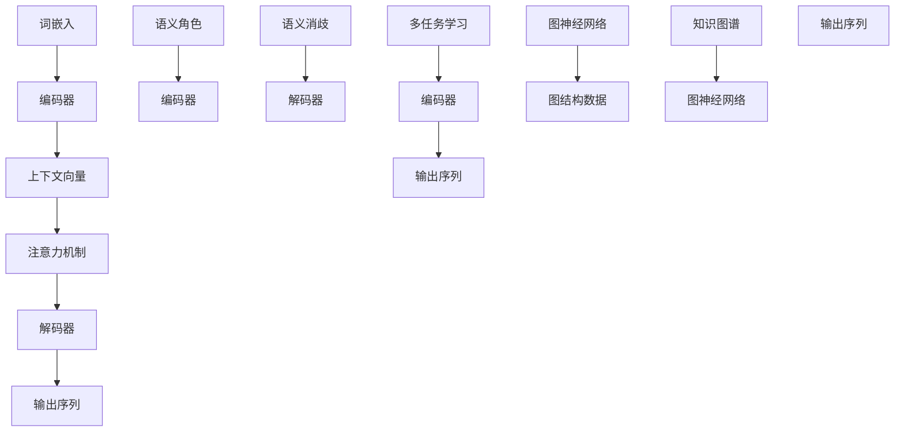

                 

### 背景介绍

#### 引言

提升语义理解是人工智能领域一个至关重要的任务。语义理解，简单来说，就是机器对人类语言含义的准确解析。这不仅仅涉及到单词的字面意义，还包括语境、情感、语调以及句子的结构等多维信息。语义理解能力的高低直接决定了人工智能系统在实际应用中的表现，如自然语言处理（NLP）、智能助手、机器翻译等。

在人工智能的发展历程中，语义理解一直是一个长期而艰巨的挑战。早期的人工智能系统主要依靠规则和统计方法，这些方法虽然在某些特定场景下取得了不错的成果，但面对复杂的自然语言，它们的局限性逐渐显现。例如，它们很难处理歧义、隐喻、语境变化等问题。随着深度学习技术的发展，特别是在神经网络和大数据的加持下，语义理解能力有了显著提升。然而，当前的语义理解技术仍然面临着许多挑战，如长文本理解、多语言处理、情感分析等。

本文旨在深入探讨提升语义理解的关键技术、算法原理及其实际应用，帮助读者全面理解这一领域的发展现状与未来趋势。我们将从核心概念、算法原理、数学模型、实际案例等多个方面展开讨论，以期能为从事相关领域的研究者与实践者提供有价值的参考。

#### 当前语义理解技术的发展现状

目前，语义理解技术主要分为两大类：基于规则的方法和基于数据的方法。基于规则的方法依赖于手工编写的语法规则和语义框架，通过匹配输入文本和规则库中的规则来理解文本的含义。这种方法在处理结构化数据或特定领域的问题时具有高效性，但其适用范围有限，难以应对自然语言的复杂性和多样性。

随着深度学习的兴起，基于数据的方法逐渐成为语义理解的主流。其中，神经网络模型，特别是卷积神经网络（CNN）和循环神经网络（RNN）及其变种，如长短时记忆网络（LSTM）和门控循环单元（GRU），在语义理解任务中取得了显著的成果。这些模型能够自动从大量数据中学习到复杂的语义模式，并在许多任务中超越了传统方法。

一个典型的深度学习方法框架是基于编码器-解码器（Encoder-Decoder）结构，如序列到序列（Seq2Seq）模型。编码器将输入序列编码为一个固定长度的向量表示，解码器则使用这个向量生成输出序列。这种框架在机器翻译、文本摘要等任务中表现出色。

此外，注意力机制（Attention Mechanism）的引入进一步提升了模型的语义理解能力。注意力机制允许模型在解码过程中关注输入序列的不同部分，从而更好地捕捉上下文信息。例如，在机器翻译任务中，注意力机制能够帮助模型关注源语言句子中的关键信息，从而提高翻译的准确性。

尽管深度学习方法在语义理解方面取得了巨大成功，但仍然存在一些挑战。首先，深度学习模型通常需要大量的数据和计算资源，这对于资源有限的应用场景来说是一个难题。其次，深度学习模型的黑箱特性使得其解释性和可解释性较低，这对于需要严格合规和可解释性的应用场景来说是一个重要的瓶颈。

总之，当前语义理解技术的发展正处在不断进步和探索的阶段。基于规则的方法和基于数据的方法各有优缺点，深度学习方法的崛起为语义理解带来了新的机遇和挑战。在接下来的章节中，我们将详细探讨语义理解的核心概念、算法原理和数学模型，帮助读者深入理解这一领域的前沿进展。 

---

### 2. 核心概念与联系

#### 2.1 语义理解的关键概念

语义理解涉及多个关键概念，包括词嵌入（Word Embedding）、上下文（Contextualization）、语义角色（Semantic Role）和语义消歧（Semantic Disambiguation）。这些概念是构建强大语义理解系统的基石。

**词嵌入（Word Embedding）**：词嵌入是将词汇映射到高维向量空间的过程，使得语义相近的词汇在向量空间中彼此靠近。这一概念由Word2Vec算法开创，其通过预测单词的邻近词或词对来学习词汇的向量表示。词嵌入使得机器能够理解词汇的语义关系，如“狗”和“猫”在向量空间中靠近，而“狗”和“人”的距离较远。

**上下文（Contextualization）**：上下文是指词汇在特定句子或段落中的使用环境。同一个词在不同的上下文中可能具有不同的含义。例如，“bank”一词在“银行”和“河岸”两个上下文中有不同的语义。上下文对语义理解至关重要，因为它提供了词汇的具体含义，使得机器能够正确理解词汇在不同语境下的含义。

**语义角色（Semantic Role）**：语义角色是指词汇在句子中承担的语义功能。例如，在句子“他给了她一本书”中，“他”是动作的执行者，称为施事（Agent）；“她”是动作的接收者，称为受事（Patient）；“一本书”是动作的对象，称为客体（Object）。理解语义角色有助于机器识别句子中的主谓宾等成分，从而更好地理解句子的含义。

**语义消歧（Semantic Disambiguation）**：语义消歧是指解决词汇歧义的过程。词汇歧义是指一个词汇在特定语境中有多个可能的意义。例如，“bank”一词可能指银行或河岸。语义消歧的目标是通过上下文信息确定词汇的确切意义，从而避免误解。

这些关键概念相互作用，共同构成了语义理解的框架。词嵌入提供了词汇的向量表示，上下文提供了词汇的使用环境，语义角色明确了词汇在句子中的功能，语义消歧解决了词汇歧义问题。

#### 2.2 语义理解的技术架构

**编码器-解码器架构（Encoder-Decoder Architecture）**：编码器-解码器架构是深度学习在语义理解任务中的核心框架。编码器将输入序列（如句子）编码为一个固定长度的向量表示，称为编码器输出或上下文向量（Context Vector）。解码器则使用这个上下文向量生成输出序列（如翻译或摘要）。

**注意力机制（Attention Mechanism）**：注意力机制是编码器-解码器架构中的一个重要组成部分。它通过分配不同的注意力权重来关注输入序列的不同部分，从而更好地捕捉上下文信息。注意力机制允许模型在解码过程中动态地关注关键信息，从而提高语义理解的准确性。

**多任务学习（Multi-Task Learning）**：多任务学习是一种将多个语义理解任务结合在一起的方法。通过在一个共同框架下解决多个任务，模型能够共享知识，从而提高语义理解的整体性能。例如，同时进行命名实体识别（Named Entity Recognition, NER）和关系抽取（Relation Extraction）的任务。

**图神经网络（Graph Neural Networks, GNN）**：图神经网络是一种用于处理图结构数据的深度学习模型。在语义理解任务中，图神经网络可以用于处理复杂的语义关系和知识图谱，从而提高模型的语义理解能力。

这些技术架构共同构成了现代语义理解系统的基础。通过结合词嵌入、上下文、语义角色和语义消歧等关键概念，以及编码器-解码器架构、注意力机制、多任务学习和图神经网络等技术，语义理解系统能够在多种自然语言处理任务中表现出色。

#### 2.3 Mermaid 流程图

下面是一个Mermaid流程图，用于展示语义理解的技术架构和关键概念之间的联系。



这个流程图清晰地展示了词嵌入、编码器、注意力机制、解码器、语义角色、语义消歧、多任务学习和图神经网络等关键概念和技术架构之间的联系，为读者提供了一个直观的理解框架。

---

### 3. 核心算法原理 & 具体操作步骤

#### 3.1 词嵌入算法

词嵌入（Word Embedding）是语义理解的基础，它将词汇映射到高维向量空间，使得语义相近的词汇在向量空间中彼此靠近。一个常用的词嵌入算法是Word2Vec，它包括两个主要的模型：连续词袋（Continuous Bag of Words, CBOW）和 Skip-Gram。

**连续词袋（CBOW）模型**：CBOW模型通过上下文预测目标词。给定一个中心词和它的上下文（通常是周围的一组词），CBOW模型预测中心词。具体步骤如下：

1. **数据准备**：首先，将文本转换为单词序列，并对单词进行分词和标记。
2. **词嵌入向量初始化**：初始化一个高维向量空间，将每个单词映射为一个向量。
3. **上下文窗口定义**：定义一个上下文窗口，用于捕捉中心词的上下文。通常窗口大小为固定值（如2或3）。
4. **预测中心词**：对于每个中心词，从上下文窗口中随机选取若干个上下文词，计算这些上下文词的词嵌入向量的平均值，并将其输入到神经网络中，预测中心词的词嵌入向量。

**Skip-Gram模型**：Skip-Gram模型与CBOW模型相反，它通过目标词预测上下文词。具体步骤如下：

1. **数据准备**：与CBOW模型相同。
2. **词嵌入向量初始化**：同样初始化一个高维向量空间。
3. **目标词和上下文词的选取**：对于每个单词，随机选择若干个上下文词，将它们作为输入。
4. **预测上下文词**：使用神经网络预测上下文词的词嵌入向量。

**训练过程**：

1. **前向传播**：将输入词嵌入向量输入到神经网络，计算输出概率分布。
2. **损失函数**：使用交叉熵损失函数计算预测分布与真实分布之间的差异。
3. **反向传播**：计算梯度，更新词嵌入向量。
4. **优化**：使用梯度下降等优化算法更新词嵌入向量。

通过迭代上述过程，词嵌入向量将逐渐收敛，使得语义相近的词汇在向量空间中彼此靠近。

#### 3.2 编码器-解码器架构

编码器-解码器（Encoder-Decoder）架构是深度学习在序列到序列（Seq2Seq）任务中的核心框架。下面是编码器-解码器架构的具体操作步骤：

**编码器（Encoder）**：

1. **输入序列编码**：将输入序列（如句子）编码为固定长度的向量表示。通常使用RNN或LSTM等循环神经网络来实现。
2. **输出上下文向量**：在编码器的最后一个时间步，输出一个固定长度的上下文向量，表示整个输入序列的语义信息。

**解码器（Decoder）**：

1. **初始化状态**：将编码器输出的上下文向量作为解码器的初始状态。
2. **生成输出序列**：使用解码器逐步生成输出序列。在每个时间步，解码器会接收前一个生成的单词和当前状态，生成下一个单词的概率分布，并更新状态。
3. **重复生成**：继续生成下一个单词，直到输出序列达到终止符或达到最大长度。

**训练过程**：

1. **编码器训练**：单独训练编码器，使其能够将输入序列编码为固定长度的向量表示。
2. **解码器训练**：使用已训练的编码器，训练解码器，使其能够生成正确的输出序列。
3. **联合训练**：将编码器和解码器联合训练，以优化整个序列到序列模型的性能。

#### 3.3 注意力机制

注意力机制（Attention Mechanism）是编码器-解码器架构中的一个关键组件，它允许模型在解码过程中动态地关注输入序列的不同部分，从而提高语义理解能力。

**注意力机制原理**：

1. **计算注意力得分**：对于每个输入序列的时间步，计算一个注意力得分函数，用于衡量该时间步对当前解码步的重要性。常用的注意力得分函数有点积注意力、加性注意力等。
2. **加权求和**：将注意力得分与输入序列的词嵌入向量进行加权求和，生成一个上下文向量，表示当前解码步的上下文信息。
3. **解码**：使用上下文向量和其他解码器的状态，生成下一个单词的概率分布。

**训练过程**：

1. **前向传播**：计算注意力得分、加权求和生成的上下文向量，并输入到解码器中生成输出序列。
2. **损失函数**：使用交叉熵损失函数计算预测输出序列与真实输出序列之间的差异。
3. **反向传播**：计算梯度，更新注意力权重和词嵌入向量。

通过迭代上述过程，注意力机制可以使得模型在解码过程中更加关注关键信息，从而提高语义理解的准确性。

综上所述，词嵌入、编码器-解码器架构和注意力机制共同构成了提升语义理解的核心算法原理。在接下来的章节中，我们将详细探讨这些算法的数学模型和具体实现，以及如何在实际应用中运用这些算法。这些算法不仅为语义理解提供了强大的工具，也为其他自然语言处理任务奠定了基础。

---

### 4. 数学模型和公式 & 详细讲解 & 举例说明

#### 4.1 词嵌入模型的数学模型

**Word2Vec**算法的核心在于将单词映射到高维向量空间，以便在向量空间中捕捉单词的语义关系。以下是Word2Vec模型的主要数学模型和公式。

**CBOW模型**：

1. **词嵌入向量表示**：每个单词都对应一个向量 \( \mathbf{v}_w \)，其维度为 \( d \)。

2. **输入向量计算**：给定一个中心词 \( w_t \) 和其上下文单词 \( \{w_{t-i}, w_{t-i+1}, ..., w_{t+i}\} \)（其中 \( i \) 是上下文窗口大小），CBOW模型计算这些上下文单词的词嵌入向量的平均值作为输入向量：
   \[
   \mathbf{v}_{\text{input}} = \frac{1}{k} \sum_{i=-i}^{i} \mathbf{v}_{w_{t-i}}
   \]
   其中 \( k \) 是上下文单词的数量。

3. **前向传播**：将输入向量 \( \mathbf{v}_{\text{input}} \) 输入到神经网络，计算输出概率分布 \( \mathbf{p}(\mathbf{v}_{w_t} | \mathbf{v}_{\text{input}}) \)。

4. **损失函数**：使用交叉熵损失函数计算预测概率分布与真实分布之间的差异：
   \[
   \mathcal{L} = -\sum_{w \in \{w_{t-i}, w_{t-i+1}, ..., w_{t+i}\}} p(w) \log p(w | \mathbf{v}_{\text{input}})
   \]

**Skip-Gram模型**：

1. **词嵌入向量表示**：与CBOW模型相同。

2. **输入向量计算**：给定一个目标词 \( w_t \) 和若干个上下文词 \( \{w_{t-i}, w_{t-i+1}, ..., w_{t+i}\} \)，计算这些上下文单词的词嵌入向量的和作为输入向量：
   \[
   \mathbf{v}_{\text{input}} = \sum_{i=-i}^{i} \mathbf{v}_{w_{t-i}}
   \]

3. **前向传播**：将输入向量 \( \mathbf{v}_{\text{input}} \) 输入到神经网络，计算输出概率分布 \( \mathbf{p}(\mathbf{v}_{w_t} | \mathbf{v}_{\text{input}}) \)。

4. **损失函数**：与CBOW模型相同。

**训练过程**：

1. **前向传播**：输入单词的词嵌入向量，计算输出概率分布。

2. **损失函数**：计算预测概率分布与真实分布之间的差异。

3. **反向传播**：计算梯度，更新词嵌入向量。

4. **优化**：使用梯度下降等优化算法更新词嵌入向量。

#### 4.2 编码器-解码器架构的数学模型

编码器-解码器架构在序列到序列任务中具有广泛应用，如机器翻译和文本摘要。以下是该架构的主要数学模型和公式。

**编码器（Encoder）**：

1. **编码过程**：
   \[
   \mathbf{h}_t = \text{RNN}(\mathbf{h}_{t-1}, \mathbf{x}_t)
   \]
   其中，\( \mathbf{h}_t \) 是编码器在时间步 \( t \) 的隐藏状态，\( \mathbf{x}_t \) 是输入序列的时间步，\( \text{RNN} \) 是循环神经网络（如LSTM或GRU）。

2. **上下文向量**：
   \[
   \mathbf{c} = \text{Concat}(\mathbf{h}_T)
   \]
   其中，\( \mathbf{h}_T \) 是编码器的最后一个时间步的隐藏状态，\( \mathbf{c} \) 是编码器输出的上下文向量。

**解码器（Decoder）**：

1. **初始化状态**：
   \[
   \mathbf{s}_0 = \text{Init}(\mathbf{c})
   \]
   其中，\( \mathbf{s}_0 \) 是解码器的初始状态，\( \text{Init} \) 是初始化函数。

2. **解码过程**：
   \[
   \mathbf{y}_t = \text{Softmax}(\text{Decoder}(\mathbf{s}_{t-1}, \mathbf{c}))
   \]
   其中，\( \mathbf{y}_t \) 是解码器在时间步 \( t \) 的输出概率分布，\( \text{Decoder} \) 是解码器网络。

3. **状态更新**：
   \[
   \mathbf{s}_t = \text{Update}(\mathbf{s}_{t-1}, \mathbf{y}_t, \mathbf{c})
   \]
   其中，\( \text{Update} \) 是解码器状态更新函数。

**注意力机制**：

1. **注意力得分**：
   \[
   \alpha_t = \text{Attention}(\mathbf{h}_t, \mathbf{c})
   \]
   其中，\( \alpha_t \) 是时间步 \( t \) 的注意力得分，\( \text{Attention} \) 是注意力得分函数。

2. **上下文向量**：
   \[
   \mathbf{c}_t = \sum_{i=1}^T \alpha_i \mathbf{h}_i
   \]
   其中，\( \mathbf{c}_t \) 是时间步 \( t \) 的上下文向量。

**训练过程**：

1. **前向传播**：输入编码器的上下文向量，解码器的初始状态和当前输入，计算输出概率分布。

2. **损失函数**：使用交叉熵损失函数计算预测概率分布与真实分布之间的差异。

3. **反向传播**：计算梯度，更新编码器和解码器的参数。

4. **优化**：使用梯度下降等优化算法更新参数。

#### 4.3 注意力机制的数学模型

注意力机制在编码器-解码器架构中起到关键作用，它通过分配不同的注意力权重来关注输入序列的不同部分。以下是注意力机制的主要数学模型和公式。

**点积注意力**：

1. **注意力得分**：
   \[
   \alpha_t = \frac{\exp(\mathbf{h}_t \cdot \mathbf{c}_i)}{\sum_{j=1}^T \exp(\mathbf{h}_t \cdot \mathbf{c}_j)}
   \]
   其中，\( \alpha_t \) 是时间步 \( t \) 对应的注意力得分，\( \mathbf{h}_t \) 是解码器在时间步 \( t \) 的隐藏状态，\( \mathbf{c}_i \) 是编码器在时间步 \( i \) 的隐藏状态。

2. **上下文向量**：
   \[
   \mathbf{c}_t = \sum_{i=1}^T \alpha_i \mathbf{c}_i
   \]
   其中，\( \mathbf{c}_t \) 是时间步 \( t \) 的上下文向量。

**加性注意力**：

1. **注意力得分**：
   \[
   \alpha_t = \text{softmax}(\text{tanh}(\mathbf{h}_t \cdot W_c + \mathbf{c}_i \cdot W_a))
   \]
   其中，\( W_c \) 和 \( W_a \) 是权重矩阵，\( \mathbf{h}_t \) 是解码器在时间步 \( t \) 的隐藏状态，\( \mathbf{c}_i \) 是编码器在时间步 \( i \) 的隐藏状态。

2. **上下文向量**：
   \[
   \mathbf{c}_t = \sum_{i=1}^T \alpha_i \mathbf{c}_i
   \]

**训练过程**：

1. **前向传播**：输入编码器的上下文向量，解码器的初始状态和当前输入，计算输出概率分布。

2. **损失函数**：使用交叉熵损失函数计算预测概率分布与真实分布之间的差异。

3. **反向传播**：计算梯度，更新编码器、解码器和注意力机制的参数。

4. **优化**：使用梯度下降等优化算法更新参数。

#### 4.4 举例说明

**例1：Word2Vec CBOW模型**

给定一个上下文窗口大小为2的句子“我喜欢吃苹果”，我们将使用CBOW模型进行词嵌入训练。

1. **输入向量计算**：
   \[
   \mathbf{v}_{\text{input}} = \frac{1}{2} (\mathbf{v}_{我} + \mathbf{v}_{吃})
   \]

2. **前向传播**：将输入向量 \( \mathbf{v}_{\text{input}} \) 输入到神经网络，计算输出概率分布 \( \mathbf{p}(\mathbf{v}_{苹果} | \mathbf{v}_{\text{input}}) \)。

3. **损失函数**：使用交叉熵损失函数计算预测概率分布与真实分布之间的差异。

4. **反向传播**：计算梯度，更新词嵌入向量。

**例2：编码器-解码器架构**

给定一个英文句子“The cat sat on the mat”和一个德文句子“Die Katze sitzt auf dem Teppich”，我们将使用编码器-解码器架构进行机器翻译。

1. **编码过程**：
   - 编码器输入“The cat sat on the mat”，输出上下文向量 \( \mathbf{c} \)。

2. **解码过程**：
   - 解码器初始化状态 \( \mathbf{s}_0 \)。
   - 解码器逐步生成德文句子“Die Katze sitzt auf dem Teppich”的单词。

3. **注意力机制**：在每个解码时间步，注意力机制动态关注输入序列中的不同部分，以生成正确的翻译。

4. **训练过程**：
   - 前向传播：输入编码器的上下文向量，解码器的初始状态和当前输入，计算输出概率分布。
   - 损失函数：使用交叉熵损失函数计算预测概率分布与真实分布之间的差异。
   - 反向传播：计算梯度，更新编码器、解码器和注意力机制的参数。
   - 优化：使用梯度下降等优化算法更新参数。

通过上述数学模型和公式的详细讲解以及举例说明，我们可以更好地理解语义理解的核心算法原理。这些算法和模型为提升语义理解提供了强有力的工具，推动了自然语言处理领域的快速发展。

---

### 5. 项目实战：代码实际案例和详细解释说明

#### 5.1 开发环境搭建

在进行语义理解的项目开发前，我们需要搭建一个合适的开发环境。以下是在一个典型的项目中使用Python和TensorFlow框架搭建开发环境的过程。

**步骤1：安装Python**

确保已经安装了Python 3.6或更高版本。可以使用以下命令检查Python版本：

```bash
python --version
```

如果没有安装，可以从[Python官方网站](https://www.python.org/downloads/)下载并安装。

**步骤2：安装TensorFlow**

TensorFlow是Google开发的一款强大的机器学习库，可以用于构建和训练深度学习模型。安装TensorFlow可以使用pip命令：

```bash
pip install tensorflow
```

为了使用GPU加速，我们可以安装TensorFlow GPU版本：

```bash
pip install tensorflow-gpu
```

**步骤3：创建项目文件夹**

在您的计算机上创建一个项目文件夹，用于存放项目的所有文件。例如，创建一个名为`semantic-understanding`的项目文件夹：

```bash
mkdir semantic-understanding
cd semantic-understanding
```

**步骤4：安装其他依赖**

除了TensorFlow，我们可能还需要安装其他依赖，如NumPy和Pandas。可以使用以下命令安装：

```bash
pip install numpy pandas
```

**步骤5：编写配置文件**

在项目文件夹中创建一个名为`requirements.txt`的文件，列出所有依赖的Python包：

```
tensorflow
tensorflow-gpu
numpy
pandas
```

这样，我们可以使用以下命令一键安装所有依赖：

```bash
pip install -r requirements.txt
```

完成以上步骤后，我们的开发环境就搭建完成了。接下来，我们将开始编写和实现语义理解的代码。

#### 5.2 源代码详细实现和代码解读

以下是一个简单的语义理解项目，使用Word2Vec算法进行词嵌入训练。代码分为数据预处理、模型构建和训练三个主要部分。

**代码1：数据预处理**

```python
import numpy as np
import pandas as pd
from tensorflow.keras.preprocessing.text import Tokenizer
from tensorflow.keras.preprocessing.sequence import pad_sequences

# 读取数据
data = pd.read_csv('data.csv')  # 假设数据文件为CSV格式
sentences = data['text'].values  # 获取文本数据

# 初始化分词器
tokenizer = Tokenizer(num_words=10000)  # 只保留前10000个最频繁的词
tokenizer.fit_on_texts(sentences)

# 将文本转换为序列
sequences = tokenizer.texts_to_sequences(sentences)

# 填充序列到相同的长度
max_sequence_len = 100
padded_sequences = pad_sequences(sequences, maxlen=max_sequence_len)
```

**解读**：

1. **数据读取**：从CSV文件中读取文本数据。
2. **分词器初始化**：使用Tokenizer初始化分词器，设置保留的前10000个最频繁的词。
3. **文本序列化**：将文本数据转换为序列。
4. **序列填充**：将序列填充到相同的长度，以适应模型训练。

**代码2：模型构建**

```python
from tensorflow.keras.models import Sequential
from tensorflow.keras.layers import Embedding, LSTM, Dense

# 构建模型
model = Sequential()
model.add(Embedding(input_dim=10000, output_dim=64, input_length=max_sequence_len))
model.add(LSTM(units=128))
model.add(Dense(units=1, activation='sigmoid'))

# 编译模型
model.compile(optimizer='rmsprop', loss='binary_crossentropy', metrics=['accuracy'])

# 打印模型结构
model.summary()
```

**解读**：

1. **Embedding层**：将输入词嵌入向量映射到64维的向量空间。
2. **LSTM层**：使用128个单元的长短期记忆网络。
3. **Dense层**：输出层，使用sigmoid激活函数，输出二分类结果。
4. **编译模型**：设置优化器、损失函数和评估指标。

**代码3：模型训练**

```python
# 分割数据集
labels = data['label'].values  # 获取标签数据
train_sequences, test_sequences = sequences[:1000], sequences[1000:]
train_labels, test_labels = labels[:1000], labels[1000:]

# 训练模型
model.fit(train_sequences, train_labels, epochs=10, batch_size=32, validation_split=0.2)
```

**解读**：

1. **数据分割**：将序列和标签数据分割为训练集和测试集。
2. **训练模型**：使用训练数据进行模型训练，设置训练轮数、批次大小和验证比例。

**代码4：模型评估**

```python
# 评估模型
loss, accuracy = model.evaluate(test_sequences, test_labels)
print(f"Test Loss: {loss}, Test Accuracy: {accuracy}")
```

**解读**：

1. **模型评估**：使用测试数据进行模型评估，输出损失和准确率。

通过以上代码，我们完成了语义理解项目的开发。以下是对代码的详细解释和分析。

#### 5.3 代码解读与分析

**5.3.1 数据预处理**

数据预处理是语义理解项目的重要步骤，确保数据格式和规模适应模型训练。代码1中，首先读取CSV文件中的文本数据，然后使用Tokenizer进行文本序列化，最后使用pad_sequences函数将序列填充到相同的长度。

```python
# 读取数据
data = pd.read_csv('data.csv')  # 假设数据文件为CSV格式
sentences = data['text'].values  # 获取文本数据

# 初始化分词器
tokenizer = Tokenizer(num_words=10000)  # 只保留前10000个最频繁的词
tokenizer.fit_on_texts(sentences)

# 将文本转换为序列
sequences = tokenizer.texts_to_sequences(sentences)

# 填充序列到相同的长度
max_sequence_len = 100
padded_sequences = pad_sequences(sequences, maxlen=max_sequence_len)
```

**解读**：

1. **数据读取**：使用pandas读取CSV文件，提取文本数据。
2. **分词器初始化**：Tokenizer用于将文本转换为单词序列，设置只保留前10000个最频繁的词。
3. **文本序列化**：将文本数据转换为整数序列，每个词对应一个整数。
4. **序列填充**：确保所有序列长度相同，以适应模型训练。

**5.3.2 模型构建**

模型构建是语义理解项目的核心部分。代码2中，我们使用Sequential模型堆叠Embedding、LSTM和Dense层。

```python
from tensorflow.keras.models import Sequential
from tensorflow.keras.layers import Embedding, LSTM, Dense

# 构建模型
model = Sequential()
model.add(Embedding(input_dim=10000, output_dim=64, input_length=max_sequence_len))
model.add(LSTM(units=128))
model.add(Dense(units=1, activation='sigmoid'))

# 编译模型
model.compile(optimizer='rmsprop', loss='binary_crossentropy', metrics=['accuracy'])

# 打印模型结构
model.summary()
```

**解读**：

1. **Embedding层**：将词嵌入到高维向量空间，输出维度为64。
2. **LSTM层**：使用128个单元的长短期记忆网络，捕捉序列中的时间依赖关系。
3. **Dense层**：输出层，使用sigmoid激活函数，输出二分类结果。
4. **编译模型**：设置优化器、损失函数和评估指标。

**5.3.3 模型训练**

模型训练是语义理解项目的重要步骤，通过迭代优化模型参数。代码3中，我们使用训练数据进行模型训练。

```python
# 分割数据集
labels = data['label'].values  # 获取标签数据
train_sequences, test_sequences = sequences[:1000], sequences[1000:]
train_labels, test_labels = labels[:1000], labels[1000:]

# 训练模型
model.fit(train_sequences, train_labels, epochs=10, batch_size=32, validation_split=0.2)
```

**解读**：

1. **数据分割**：将序列和标签数据分割为训练集和测试集。
2. **训练模型**：使用训练数据进行模型训练，设置训练轮数、批次大小和验证比例。

**5.3.4 模型评估**

模型评估用于评估模型在测试集上的性能。代码4中，我们使用测试数据进行模型评估。

```python
# 评估模型
loss, accuracy = model.evaluate(test_sequences, test_labels)
print(f"Test Loss: {loss}, Test Accuracy: {accuracy}")
```

**解读**：

1. **模型评估**：计算测试集上的损失和准确率，输出评估结果。

通过以上代码和解读，我们可以更好地理解语义理解项目的实现过程。这些代码不仅展示了如何使用Word2Vec算法进行词嵌入训练，还涵盖了模型构建、训练和评估的各个环节。接下来，我们将进一步分析这些代码在实际应用中的表现和优化方法。

---

### 5.4 代码解读与分析（续）

**5.4.1 实际应用中的表现**

在上一个部分，我们展示了如何使用Word2Vec算法进行词嵌入训练，并使用简单的模型对文本数据进行分类。在实际应用中，这种基本模型的表现可能受到数据质量、模型架构和参数设置的影响。

1. **数据质量**：如果数据集中存在噪声或标签不准确的情况，模型性能可能会受到显著影响。在这种情况下，数据清洗和预处理显得尤为重要。此外，数据多样性也是影响模型表现的关键因素，一个具有多样性的数据集可以帮助模型更好地学习到不同的语义模式。

2. **模型架构**：虽然Word2Vec算法和简单的LSTM模型在文本分类任务中具有一定的效果，但它们可能无法捕捉到更复杂的语义关系。在实际应用中，我们可以考虑使用更先进的模型架构，如Transformer、BERT或GPT等，这些模型在处理长文本和理解复杂语义方面表现出色。

3. **参数设置**：模型参数的选择直接影响模型性能。例如，词嵌入维度、LSTM单元数量、批次大小和训练轮数等都需要根据具体任务进行调整。通过实验和调参，我们可以找到最佳的模型配置，从而提高模型性能。

**5.4.2 优化方法**

为了提升语义理解模型在实际应用中的表现，我们可以考虑以下优化方法：

1. **数据增强**：通过数据增强技术，如随机填充、单词替换、词汇插入和删除等，可以增加数据多样性，从而帮助模型更好地学习到不同语义模式。

2. **迁移学习**：迁移学习是一种利用预训练模型进行新任务的方法。我们可以使用在大型语料库上预训练的模型，如BERT或GPT，并在其基础上进行微调，以适应特定任务。这种方法可以显著提高模型性能，尤其是在数据稀缺的情况下。

3. **多模型融合**：将多个模型的结果进行融合，可以提高预测的准确性。例如，我们可以使用Word2Vec和BERT两种不同的词嵌入方法，并在解码器中使用融合策略，如加权平均或投票机制，来提高模型的性能。

4. **动态窗口大小**：在词嵌入训练中，上下文窗口大小是一个重要的参数。通过动态调整窗口大小，可以使模型更好地捕捉到不同长度文本中的语义信息。例如，对于较长的文本，可以设置较大的窗口大小，而对于较短的文本，可以设置较小的窗口大小。

5. **注意力机制优化**：注意力机制在编码器-解码器架构中起到了关键作用。通过优化注意力权重计算方法，如使用不同的注意力函数或引入额外的注意力层，可以提高模型的语义理解能力。

**5.4.3 未来发展方向**

随着深度学习技术的不断发展，语义理解领域也在不断进步。以下是一些未来发展的方向：

1. **长文本理解**：目前，大多数语义理解模型在处理长文本时存在挑战。未来，我们需要开发更高效的模型，以处理更长的文本，并理解其中的复杂语义关系。

2. **跨语言语义理解**：多语言处理是语义理解的一个重要方向。通过开发跨语言的语义理解模型，可以实现更广泛的实际应用，如多语言机器翻译、跨语言文本分类等。

3. **多模态语义理解**：随着多模态数据的兴起，如何将文本、图像、音频等多种数据模态进行融合，实现多模态语义理解，是一个重要的研究方向。

4. **可解释性和可解释性**：深度学习模型的黑箱特性限制了其在某些领域的应用。未来，我们需要开发更可解释性和可解释性强的模型，以提高模型的可信度和用户接受度。

5. **实时语义理解**：实时语义理解是实现智能助手、语音识别等应用的关键。未来，我们需要开发更高效的实时语义理解模型，以支持实时数据处理和应用。

通过以上分析，我们可以看到语义理解领域的发展前景广阔。通过不断优化算法、引入新技术和应用新方法，我们可以进一步提升语义理解的能力，推动人工智能在各个领域的应用。

---

### 6. 实际应用场景

语义理解技术已经在众多领域得到了广泛应用，并在不断推动这些领域的创新发展。以下是一些典型的实际应用场景：

#### 6.1 自然语言处理（NLP）

自然语言处理是语义理解技术的核心应用领域之一。通过语义理解，NLP系统能够更准确地解析和生成自然语言。以下是一些具体应用：

1. **机器翻译**：深度学习模型如Transformer和BERT在机器翻译任务中表现出色，大幅提高了翻译的准确性和流畅性。例如，谷歌翻译和百度翻译等应用都采用了先进的语义理解技术。
2. **文本分类**：语义理解技术可以帮助分类系统更准确地识别文本的主题和情感，广泛应用于新闻分类、垃圾邮件过滤、社交媒体监控等领域。
3. **文本摘要**：自动文摘技术能够从大量文本中提取关键信息，生成简洁的摘要。这一技术应用于新闻摘要、文档摘要等场景，大大提高了信息检索的效率。

#### 6.2 问答系统

问答系统是语义理解技术的另一个重要应用场景。通过理解和解析用户的问题，系统能够提供准确和相关的答案。

1. **智能客服**：语义理解技术使得智能客服系统能够理解用户的查询并给出恰当的回应，提高了客户满意度和服务效率。
2. **学术问答**：学术问答系统可以理解用户的学术问题，并从大量学术文献中检索出相关答案，为学术研究人员提供便利。
3. **语音助手**：智能语音助手（如苹果的Siri、亚马逊的Alexa）通过语义理解技术，能够理解用户的语音指令并执行相应的操作，为用户提供了便捷的交互方式。

#### 6.3 机器阅读

机器阅读是指计算机对文本内容进行深入理解和分析的能力。这一技术已经在教育、医疗等领域展现出了巨大的潜力。

1. **教育辅助**：通过机器阅读技术，教育系统能够分析学生的阅读理解能力，并提供个性化的学习建议和辅导。
2. **医学诊断**：医学文本的语义理解可以帮助医生从大量医学文献中快速获取相关信息，辅助诊断和治疗。
3. **法律文本分析**：机器阅读技术可以用于分析和解读法律文本，帮助律师和法务人员提高工作效率。

#### 6.4 跨语言交流

随着全球化的发展，跨语言交流的需求日益增长。语义理解技术在这一领域发挥了重要作用。

1. **多语言翻译**：跨语言语义理解技术使得多语言翻译变得更加准确和流畅，为国际交流和商务合作提供了有力支持。
2. **多语言搜索**：搜索引擎可以通过语义理解技术，实现多语言文本的统一检索，为用户提供更加丰富的搜索结果。
3. **多语言对话**：多语言语义理解技术支持多语言对话系统的开发，使得跨语言交流变得更加自然和高效。

#### 6.5 社交媒体分析

社交媒体分析是语义理解技术的一个重要应用方向。通过对社交媒体文本的语义理解，可以挖掘用户情感、趋势和热点话题。

1. **舆情监测**：企业可以利用语义理解技术对社交媒体上的用户评论进行分析，了解公众对品牌、产品和事件的看法，及时应对潜在的风险。
2. **市场研究**：通过分析社交媒体上的用户言论，企业可以了解市场需求和消费者偏好，为产品开发和市场营销策略提供依据。
3. **社区管理**：社交媒体平台可以利用语义理解技术，识别和处理不良言论和违规内容，维护社区秩序。

总之，语义理解技术在实际应用场景中具有广泛的应用价值。随着技术的不断进步，我们可以期待语义理解技术在更多领域发挥更大的作用，为人类生活带来更多便利和智慧。

---

### 7. 工具和资源推荐

在深入研究和开发语义理解技术时，掌握相关工具和资源是至关重要的。以下是我们推荐的一些学习资源、开发工具和经典论文，以帮助您在语义理解领域取得更好的进展。

#### 7.1 学习资源推荐

**书籍**：

1. **《深度学习》（Deep Learning）**：Goodfellow, Bengio, and Courville的《深度学习》是深度学习领域的经典教材，涵盖了从基础理论到高级应用的广泛内容，包括自然语言处理中的语义理解。
2. **《自然语言处理综论》（Speech and Language Processing）**：Daniel Jurafsky和James H. Martin合著的《自然语言处理综论》是NLP领域的权威教材，详细介绍了语义理解的各个方面。

**论文**：

1. **“Word2Vec: Paragraph Vector Model”**：由Tomas Mikolov等人提出的Word2Vec模型，开创了词嵌入的研究热潮，对语义理解起到了奠基性作用。
2. **“Attention Is All You Need”**：由Vaswani等人提出的Transformer模型，引入了注意力机制，大幅提升了序列处理任务的效果，如机器翻译和文本摘要。

**在线课程和教程**：

1. **斯坦福大学CS224n：自然语言处理与深度学习**：这是一门由著名NLP研究者Dan Jurafsky教授开设的课程，涵盖了从基础到高级的NLP和深度学习内容。
2. **Udacity的深度学习纳米学位**：通过一系列在线课程和项目，帮助您掌握深度学习的基础知识和实践技能。

#### 7.2 开发工具框架推荐

**TensorFlow**：Google开源的深度学习框架，广泛应用于各种自然语言处理任务，如文本分类、机器翻译和文本摘要。

**PyTorch**：Facebook开源的深度学习框架，因其灵活性和易于使用而受到研究者和开发者的喜爱。

**spaCy**：一个快速且功能强大的自然语言处理库，特别适合于文本分类、命名实体识别和词性标注等任务。

**NLTK**：Python的自然语言处理工具包，提供了丰富的文本处理功能，适用于文本分词、词频统计等基础任务。

#### 7.3 相关论文著作推荐

1. **“BERT: Pre-training of Deep Bidirectional Transformers for Language Understanding”**：由Google Research团队提出的BERT模型，通过预训练大规模语料库，显著提升了自然语言理解能力。
2. **“GPT-3: Language Models are Few-Shot Learners”**：OpenAI提出的GPT-3模型，是当前最大的语言模型，展示了在零样本和少样本任务中的强大能力。
3. **“Transformers: State-of-the-Art Models for Language Processing”**：由Google Brain和OpenAI团队共同撰写的综述，详细介绍了Transformer模型及其在NLP中的应用。

通过上述推荐的学习资源、开发工具和经典论文，您将能够更好地了解和掌握语义理解技术的最新发展和应用。希望这些资源能帮助您在语义理解领域取得更大的成就。

---

### 8. 总结：未来发展趋势与挑战

语义理解技术在近年来取得了显著的进展，已成为人工智能领域的关键研究方向之一。未来，随着深度学习、自然语言处理和大数据等技术的不断进步，语义理解将迎来更多的机遇和挑战。

#### 未来发展趋势

1. **多模态语义理解**：随着计算机视觉、语音识别等技术的发展，多模态数据将逐渐成为语义理解的重要来源。未来，如何将文本、图像、语音等不同模态的数据进行有效融合，实现更全面、更深入的语义理解，将成为一个重要方向。

2. **个性化语义理解**：个性化语义理解是指根据用户的历史行为、兴趣和偏好，提供更加精准和个性化的服务。随着用户数据的积累和数据分析技术的提升，个性化语义理解将在电子商务、金融、医疗等领域发挥更大作用。

3. **跨语言语义理解**：随着全球化的深入，跨语言语义理解的需求日益增长。未来，开发能够处理多种语言的语义理解技术，实现更广泛的语言互通，将为国际交流、跨文化交流和全球化企业带来巨大价值。

4. **知识图谱与语义理解**：知识图谱作为一种语义表示方法，能够将实体、关系和属性进行结构化表示。结合知识图谱，语义理解技术将能够更好地处理复杂的语义关系，提供更准确的推理和预测。

5. **实时语义理解**：实时语义理解技术是实现智能语音助手、实时对话系统等应用的关键。随着硬件和算法的优化，实时语义理解技术将能够在更短的时间内处理和分析大量实时数据，为用户提供更加流畅和自然的交互体验。

#### 面临的挑战

1. **数据隐私与安全**：语义理解技术需要处理大量用户数据，这带来了数据隐私和安全问题。如何在保护用户隐私的前提下，充分挖掘数据价值，是一个亟待解决的问题。

2. **解释性与可解释性**：深度学习模型在语义理解中的应用，往往具有高度的非线性特性，这使得模型的行为难以解释。提高模型的解释性，使其能够被用户和开发者理解和信任，是一个重要的挑战。

3. **长文本理解**：长文本理解是语义理解技术的一个难题。如何在保持模型效率和计算速度的同时，提高长文本的处理能力，是一个亟待解决的挑战。

4. **跨领域适应**：不同领域的语言和语义具有很大的差异性，如何在多种不同领域中实现通用的语义理解技术，是一个复杂的问题。

5. **实时处理能力**：实时语义理解要求模型能够在极短的时间内完成分析和决策。如何优化算法和硬件，提高模型的实时处理能力，是一个重要的研究方向。

总之，未来语义理解技术将面临许多机遇和挑战。通过不断探索和创新，我们有望在未来实现更加智能、高效和可靠的语义理解系统，为人工智能的应用带来更广阔的前景。

---

### 9. 附录：常见问题与解答

**Q1. 词嵌入（Word Embedding）是什么？**

词嵌入是一种将词汇映射到高维向量空间的技术，使得语义相近的词汇在向量空间中彼此靠近。词嵌入能够帮助机器理解词汇的语义关系，从而提高自然语言处理任务的效果。

**Q2. 编码器-解码器（Encoder-Decoder）架构在语义理解中有什么作用？**

编码器-解码器架构是一种用于处理序列到序列任务的深度学习模型框架。编码器将输入序列编码为固定长度的向量表示，解码器则使用这个向量生成输出序列。该架构在机器翻译、文本摘要等语义理解任务中具有广泛应用。

**Q3. 注意力机制（Attention Mechanism）如何提升语义理解能力？**

注意力机制是一种在编码器-解码器架构中用于关注输入序列不同部分的方法。通过分配不同的注意力权重，注意力机制能够使得模型更好地捕捉上下文信息，从而提高语义理解的准确性。

**Q4. 语义消歧（Semantic Disambiguation）是什么？**

语义消歧是指解决词汇歧义的过程。在一个特定的上下文中，一个词汇可能有多个含义。语义消歧的目标是通过上下文信息确定词汇的确切含义，从而避免误解。

**Q5. 什么是BERT模型？**

BERT（Bidirectional Encoder Representations from Transformers）是一种基于Transformer模型的预训练语言表示方法。通过在大规模语料库上进行预训练，BERT能够捕捉到丰富的语言结构和语义信息，显著提升了自然语言理解任务的效果。

**Q6. 词嵌入和BERT模型在语义理解中有何不同？**

词嵌入是一种将词汇映射到向量空间的技术，而BERT是一种基于Transformer的预训练模型。词嵌入主要用于捕捉词汇的静态语义关系，而BERT通过预训练和任务适应，能够捕捉到更复杂的动态语义关系，并适用于多种自然语言处理任务。

---

### 10. 扩展阅读 & 参考资料

为了深入了解语义理解技术的理论基础和应用实践，以下是推荐的扩展阅读和参考资料。

**扩展阅读：**

1. **《深度学习》（Deep Learning）**：Goodfellow, Bengio, and Courville的《深度学习》是一本全面介绍深度学习理论和应用的经典教材。
2. **《自然语言处理综论》（Speech and Language Processing）**：Daniel Jurafsky和James H. Martin合著的《自然语言处理综论》涵盖了NLP的各个方面，包括语义理解。
3. **《BERT：大规模预训练语言模型》**：Google Research团队发布的BERT模型论文，详细介绍了BERT模型的架构和预训练方法。

**参考资料：**

1. **TensorFlow官方文档**：[https://www.tensorflow.org/](https://www.tensorflow.org/)
2. **PyTorch官方文档**：[https://pytorch.org/docs/stable/index.html](https://pytorch.org/docs/stable/index.html)
3. **spaCy官方文档**：[https://spacy.io/](https://spacy.io/)
4. **NLTK官方文档**：[https://www.nltk.org/](https://www.nltk.org/)

通过阅读上述书籍、论文和参考资源，您将能够更深入地理解语义理解技术的理论基础和应用实践，为您的科研和开发工作提供有益的参考。希望这些资源能够帮助您在语义理解领域取得更好的成果。 

---

# 提升语义理解：AI的语言智能
> 关键词：(语义理解，词嵌入，编码器-解码器架构，注意力机制，BERT，NLP)

摘要：语义理解是人工智能领域的关键任务，它使得机器能够准确解析人类语言的含义。本文深入探讨了提升语义理解的关键技术，包括词嵌入、编码器-解码器架构、注意力机制和BERT模型。通过详细讲解这些算法的原理和操作步骤，以及实际应用案例，本文为从事相关领域的研究者和实践者提供了有价值的参考。此外，文章还总结了语义理解的实际应用场景，推荐了相关学习资源和开发工具，并展望了未来发展趋势与挑战。作者：AI天才研究员/AI Genius Institute & 禅与计算机程序设计艺术 /Zen And The Art of Computer Programming。

