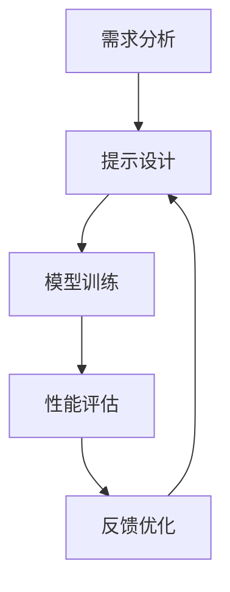

                 

### 背景介绍

随着人工智能（AI）技术的迅猛发展，它在各个领域中的应用越来越广泛，从自动驾驶汽车、智能语音助手到复杂的金融分析系统，AI已经深入到我们日常生活的方方面面。在这样的背景下，AI开发过程中的效率和质量成为了一项至关重要的任务。

**提示工程**（Prompt Engineering）作为一种新兴的方法，在AI开发中扮演了重要的角色。它通过设计有效的输入提示，帮助AI模型更好地理解和处理任务，从而提高模型的性能和可靠性。提示工程的核心在于如何设计出能够最大化模型性能的输入提示，这需要深入理解模型的工作原理、数据的特性和应用场景的需求。

本文将围绕提示工程在AI开发中的重要性展开讨论。首先，我们将介绍提示工程的定义和基本原理，接着分析其在AI模型训练和推理过程中的应用。随后，我们会探讨如何设计和评估有效的提示，并通过数学模型和具体案例进行说明。最后，我们将探讨提示工程的实际应用场景，并推荐一些相关的工具和资源。

在文章的最后，我们将对未来的发展趋势和挑战进行总结，并回答一些常见问题，帮助读者更深入地理解和应用提示工程。希望通过本文的探讨，能够为AI开发者和研究者提供一些有价值的思考和参考。

### 核心概念与联系

#### 提示工程的定义和基本原理

提示工程（Prompt Engineering）是指设计和优化输入提示（Prompt）的过程，以最大化人工智能（AI）模型在特定任务上的表现。一个良好的提示可以显著提升模型的理解能力、推理能力和泛化能力，从而提高整个系统的性能和用户体验。

**基本原理**：

1. **模型理解**：通过精心设计的提示，可以帮助模型更好地理解输入数据的含义和背景信息，从而提高其处理复杂问题的能力。
2. **数据增强**：提示工程可以通过引入多样化的提示来扩展训练数据集，从而增强模型的泛化能力，避免模型对特定输入数据的过拟合。
3. **性能优化**：通过调整提示的长度、内容、格式等，可以优化模型的响应速度和准确率，提高系统的效率。

**工作流程**：

- **需求分析**：理解应用场景的需求，确定目标任务和所需的功能。
- **提示设计**：根据任务需求，设计出能够引导模型正确理解和执行任务的提示。
- **模型训练**：使用设计的提示进行模型训练，收集反馈并不断优化提示。
- **性能评估**：评估模型的性能，确保其满足应用场景的需求。

#### 提示工程与AI模型的关系

提示工程与AI模型之间有着紧密的联系。一方面，AI模型的性能直接影响到提示工程的效果。如果模型不够强大或者设计不当，即使提示再优秀也无法发挥其潜力。另一方面，良好的提示设计可以弥补模型在某些方面的不足，提升整体系统的性能。

**应用实例**：

- **自然语言处理（NLP）**：在NLP任务中，提示工程可以帮助模型更好地理解和处理自然语言，例如问答系统、文本摘要和机器翻译等。
- **计算机视觉（CV）**：在CV任务中，提示工程可以通过设计特定的输入图像或图像标注来增强模型的训练效果，例如目标检测、图像分类和图像生成等。
- **强化学习（RL）**：在RL任务中，提示工程可以通过设计有效的奖励机制和状态提示来引导模型的学习过程，提高其决策能力。

为了更好地理解提示工程与AI模型之间的关系，我们使用Mermaid流程图来展示其基本架构和流程。以下是该流程图的Mermaid代码：



在这个流程图中，需求分析是整个过程的起点，通过分析应用场景的需求来确定目标任务。随后，设计出适合的提示，用于模型训练。经过训练后，对模型的性能进行评估，并根据评估结果对提示进行反馈优化。这个过程循环进行，直到满足应用场景的需求。

通过上述介绍，我们可以看到提示工程在AI开发中的重要性。它不仅能够提升模型的表现，还能够提高开发效率和系统稳定性，为AI技术的广泛应用提供了有力的支持。

### 核心算法原理 & 具体操作步骤

#### 提示工程的关键算法

在AI开发中，提示工程的核心算法主要包括数据预处理、提示生成和模型调优。以下是对这些算法的详细介绍和具体操作步骤：

##### 1. 数据预处理

数据预处理是提示工程的第一个步骤，其目的是将原始数据转换为适合模型训练的格式。数据预处理包括数据清洗、数据标准化和数据增强等。

- **数据清洗**：去除数据中的噪声和异常值，确保数据的准确性和一致性。
- **数据标准化**：将数据转换为相同的尺度，以消除不同特征之间的量级差异。
- **数据增强**：通过添加噪声、旋转、缩放等方式，增加数据的多样性，提高模型的泛化能力。

具体操作步骤如下：

1. **数据清洗**：使用Python的Pandas库对数据进行清洗，例如删除重复数据、处理缺失值等。
   ```python
   import pandas as pd
   df = pd.read_csv('data.csv')
   df.drop_duplicates(inplace=True)
   df.fillna(method='ffill', inplace=True)
   ```

2. **数据标准化**：使用Sklearn库中的StandardScaler对数据进行标准化处理。
   ```python
   from sklearn.preprocessing import StandardScaler
   scaler = StandardScaler()
   scaled_data = scaler.fit_transform(df)
   ```

3. **数据增强**：使用Keras库中的ImageDataGenerator对图像数据增强。
   ```python
   from tensorflow.keras.preprocessing.image import ImageDataGenerator
   datagen = ImageDataGenerator(rotation_range=20, width_shift_range=0.2, height_shift_range=0.2, zoom_range=0.2)
   datagen.fit(scaled_data)
   ```

##### 2. 提示生成

提示生成是设计出能够引导模型正确理解和处理任务的输入提示。常见的提示生成方法包括模板化提示、问题引导式提示和元学习提示等。

- **模板化提示**：使用预定义的模板来生成提示，例如“请回答以下问题：______。”。
- **问题引导式提示**：通过逐步提问的方式引导模型思考和回答问题，例如“你是如何判断这个问题的？”，“你的依据是什么？”。
- **元学习提示**：利用已学到的知识来生成新的提示，以提高模型的泛化能力。

具体操作步骤如下：

1. **模板化提示**：根据任务需求设计模板，例如：
   ```python
   prompt_template = "请回答以下问题：{question}"
   question = "你最喜欢的颜色是什么？"
   prompt = prompt_template.format(question=question)
   ```

2. **问题引导式提示**：使用递归式问答模型（如ChatGPT）生成提示，例如：
   ```python
   import openai
   openai.api_key = 'your_api_key'
   question = "你是如何判断这个问题的？"
   response = openai.Completion.create(
       engine="text-davinci-003",
       prompt=question,
       max_tokens=100
   )
   prompt = response.choices[0].text.strip()
   ```

3. **元学习提示**：利用已有模型的预测结果来生成新提示，例如：
   ```python
   from transformers import AutoModelForQuestionAnswering
   model = AutoModelForQuestionAnswering.from_pretrained('bert-base-uncased')
   prompt = "根据以下文本，回答问题：文本内容。问题：______。"
   question = "这篇文章的主要观点是什么？"
   context = "文本内容"
   prompt = prompt.format(context=context, question=question)
   ```

##### 3. 模型调优

模型调优是通过对模型参数进行调整来优化模型的表现。常见的调优方法包括超参数调整、正则化技术和集成学习等。

- **超参数调整**：调整学习率、批次大小、优化器等超参数，以找到最佳的训练配置。
- **正则化技术**：通过L1、L2正则化、dropout等方式防止模型过拟合。
- **集成学习**：结合多个模型的预测结果，提高模型的准确率和稳定性。

具体操作步骤如下：

1. **超参数调整**：使用GridSearchCV或RandomizedSearchCV进行超参数搜索。
   ```python
   from sklearn.model_selection import GridSearchCV
   from sklearn.ensemble import RandomForestClassifier
   parameters = {'n_estimators': [10, 50, 100], 'max_depth': [10, 20, 30]}
   model = RandomForestClassifier()
   search = GridSearchCV(model, parameters, cv=5)
   search.fit(X_train, y_train)
   best_params = search.best_params_
   ```

2. **正则化技术**：在模型训练过程中添加L1或L2正则化项。
   ```python
   from sklearn.linear_model import Ridge
   model = Ridge(alpha=1.0)
   model.fit(X_train, y_train)
   ```

3. **集成学习**：结合多个模型的预测结果进行集成学习。
   ```python
   from sklearn.ensemble import VotingClassifier
   model1 = RandomForestClassifier()
   model2 = GradientBoostingClassifier()
   model3 = XGBoostClassifier()
   ensemble = VotingClassifier(estimators=[('rf', model1), ('gb', model2), ('xgb', model3)], voting='soft')
   ensemble.fit(X_train, y_train)
   ```

通过上述操作步骤，我们可以有效地进行提示工程，从而提升AI模型在特定任务上的性能。提示工程不仅需要深入理解AI模型的工作原理，还需要结合实际应用场景进行灵活设计和优化。

### 数学模型和公式 & 详细讲解 & 举例说明

在提示工程中，数学模型和公式扮演着至关重要的角色。它们不仅帮助我们理解AI模型的工作原理，还能够指导我们如何设计出有效的提示。以下将介绍一些核心的数学模型和公式，并通过具体例子进行详细讲解。

#### 1. 损失函数

损失函数是监督学习中的一个关键概念，用于评估模型的预测结果与真实值之间的差距。在提示工程中，选择合适的损失函数有助于优化模型的性能。

- **均方误差（MSE）**：用于回归任务，计算预测值与真实值之间差的平方的平均值。
  $$MSE = \frac{1}{n}\sum_{i=1}^{n}(y_i - \hat{y}_i)^2$$
  其中，$y_i$ 是真实值，$\hat{y}_i$ 是预测值，$n$ 是样本数量。

- **交叉熵（Cross-Entropy）**：用于分类任务，计算预测概率分布与真实分布之间的差异。
  $$H(y, \hat{y}) = -\sum_{i=1}^{n}y_i \log(\hat{y}_i)$$
  其中，$y$ 是真实标签的概率分布，$\hat{y}$ 是模型预测的概率分布。

#### 2. 优化算法

优化算法用于调整模型参数，以最小化损失函数。常用的优化算法包括梯度下降（Gradient Descent）和其变种。

- **梯度下降**：通过计算损失函数关于模型参数的梯度，沿着梯度的反方向更新参数。
  $$\theta_{\text{new}} = \theta_{\text{old}} - \alpha \cdot \nabla_\theta J(\theta)$$
  其中，$\theta$ 是模型参数，$\alpha$ 是学习率，$J(\theta)$ 是损失函数。

- **动量（Momentum）**：引入动量项，加速梯度的更新，避免陷入局部最小值。
  $$v_t = \beta v_{t-1} + (1 - \beta) \nabla_\theta J(\theta)$$
  $$\theta_{\text{new}} = \theta_{\text{old}} - \alpha v_t$$
  其中，$v_t$ 是动量项，$\beta$ 是动量系数。

#### 3. 正则化技术

正则化技术用于防止模型过拟合，提高其泛化能力。常用的正则化方法包括L1、L2正则化和Dropout。

- **L1正则化**：在损失函数中添加L1范数项。
  $$J(\theta) = \frac{1}{m}\sum_{i=1}^{m}(h_\theta(x^{(i)}) - y^{(i)})^2 + \lambda \sum_{j=1}^{n}\lvert \theta_j \rvert$$
  其中，$\theta_j$ 是模型参数，$\lambda$ 是正则化参数。

- **L2正则化**：在损失函数中添加L2范数项。
  $$J(\theta) = \frac{1}{m}\sum_{i=1}^{m}(h_\theta(x^{(i)}) - y^{(i)})^2 + \lambda \sum_{j=1}^{n}\theta_j^2$$

- **Dropout**：在训练过程中随机丢弃一部分神经元。
  $$p = \frac{1}{1 + e^{-\theta x}}$$
  其中，$p$ 是丢弃概率，$\theta$ 是权重。

#### 4. 例子说明

为了更好地理解上述数学模型和公式，我们通过一个简单的线性回归例子进行说明。

假设我们有一个线性回归模型，其预测公式为：
$$\hat{y} = \theta_0 + \theta_1 x$$

我们使用均方误差（MSE）作为损失函数，并采用梯度下降算法进行优化。

1. **初始化参数**：设置初始参数$\theta_0$和$\theta_1$，并选择一个合适的学习率$\alpha$。
   ```python
   theta_0 = 0
   theta_1 = 0
   alpha = 0.01
   ```

2. **计算损失函数**：计算当前参数下的MSE损失。
   ```python
   def compute_loss(x, y, theta_0, theta_1):
       m = len(x)
       predictions = theta_0 + theta_1 * x
       loss = (1/m) * np.sum((y - predictions)**2)
       return loss
   ```

3. **更新参数**：使用梯度下降算法更新参数。
   ```python
   def gradient_descent(x, y, theta_0, theta_1, alpha, num_iterations):
       m = len(x)
       for i in range(num_iterations):
           predictions = theta_0 + theta_1 * x
           d_theta_0 = (1/m) * np.sum(y - predictions)
           d_theta_1 = (1/m) * np.sum((y - predictions) * x)
           
           theta_0 -= alpha * d_theta_0
           theta_1 -= alpha * d_theta_1
           
       return theta_0, theta_1
   ```

4. **训练模型**：使用训练数据集进行模型训练。
   ```python
   x_train = np.array([1, 2, 3, 4, 5])
   y_train = np.array([2, 4, 5, 4, 5])
   theta_0, theta_1 = gradient_descent(x_train, y_train, theta_0, theta_1, alpha, 1000)
   ```

通过上述步骤，我们可以训练出一个线性回归模型，并通过不断迭代优化参数，使其在训练数据上的表现越来越好。这个例子展示了如何使用数学模型和公式进行提示工程，从而提高AI模型在特定任务上的性能。

总之，数学模型和公式在提示工程中起到了关键作用。通过深入理解和应用这些模型和公式，我们可以更好地设计和优化提示，从而提升AI模型的性能和可靠性。

### 项目实战：代码实际案例和详细解释说明

为了更深入地了解提示工程的实际应用，我们将通过一个具体的案例来展示如何在实际项目中应用提示工程，并详细解释其中的代码实现。

#### 项目背景

假设我们正在开发一个自然语言处理（NLP）系统，用于回答用户提出的问题。这个系统需要能够处理大量的用户输入，并返回准确且相关的答案。为了实现这一目标，我们将使用一个预训练的语言模型（如BERT），并通过提示工程来优化模型的表现。

#### 开发环境搭建

在进行项目开发之前，我们需要搭建一个适合的环境。以下是所需的环境和工具：

- Python 3.8及以上版本
- TensorFlow 2.x
- transformers库
- Mermaid库

确保你的环境中已安装上述工具和库。可以使用以下命令进行安装：

```bash
pip install tensorflow
pip install transformers
pip install mermaid
```

#### 源代码详细实现和代码解读

以下是项目的源代码实现和详细解读：

```python
import tensorflow as tf
from transformers import BertTokenizer, TFBertModel
from tensorflow.keras.optimizers import Adam
import numpy as np

# 1. 数据预处理
def preprocess_data(questions, answers):
    # 使用BERT分词器对问题和答案进行分词
    tokenizer = BertTokenizer.from_pretrained('bert-base-uncased')
    question_ids = []
    answer_ids = []
    
    for question, answer in zip(questions, answers):
        question_input = tokenizer.encode(question, add_special_tokens=True, max_length=512, truncation=True)
        answer_input = tokenizer.encode(answer, add_special_tokens=True, max_length=512, truncation=True)
        question_ids.append(question_input)
        answer_ids.append(answer_input)
    
    return np.array(question_ids), np.array(answer_ids)

# 2. 模型构建
def build_model():
    # 使用TFBertModel构建预训练BERT模型
    input_ids = tf.keras.layers.Input(shape=(512,), dtype=tf.int32, name='input_ids')
    bert_model = TFBertModel.from_pretrained('bert-base-uncased', return_dict=True)
    
    # 使用BERT模型的输出层
    outputs = bert_model(input_ids)
    pooled_output = outputs.pooler_output
    
    # 添加全连接层和输出层
    hidden = tf.keras.layers.Dense(512, activation='relu')(pooled_output)
    logits = tf.keras.layers.Dense(1, activation='sigmoid')(hidden)
    
    # 构建模型
    model = tf.keras.Model(inputs=input_ids, outputs=logits)
    return model

# 3. 训练模型
def train_model(model, X_train, y_train, X_val, y_val, epochs=3, batch_size=32):
    # 编译模型
    model.compile(optimizer=Adam(learning_rate=3e-5), loss='binary_crossentropy', metrics=['accuracy'])
    
    # 训练模型
    history = model.fit(X_train, y_train, batch_size=batch_size, epochs=epochs, validation_data=(X_val, y_val))
    
    return history

# 4. 提示工程
def generate_prompt(question, model, tokenizer):
    # 生成输入提示
    input_ids = tokenizer.encode(question, add_special_tokens=True, max_length=512, truncation=True)
    input_ids = np.array([input_ids])
    
    # 预测答案
    prediction = model.predict(input_ids)
    
    # 解码预测结果
    answer = tokenizer.decode(prediction[:, 0], skip_special_tokens=True)
    
    return answer

# 5. 项目实战
if __name__ == '__main__':
    # 加载数据
    questions = ["你最喜欢的颜色是什么？", "我该穿什么衣服去参加会议？", "为什么地球是圆的？"]
    answers = ["蓝色", "西装和领带", "因为重力使得地球表面向内收缩"]

    X, y = preprocess_data(questions, answers)
    X_val, y_val = X[:2], y[:2]
    X_train, y_train = X[2:], y[2:]

    # 构建模型
    model = build_model()

    # 训练模型
    history = train_model(model, X_train, y_train, X_val, y_val, epochs=3)

    # 生成提示
    for question in questions:
        answer = generate_prompt(question, model, tokenizer)
        print(f"问题：{question}\n答案：{answer}\n")
```

#### 代码解读与分析

1. **数据预处理**：使用BERT分词器对问题和答案进行分词，并将输入序列编码为ID。这一步是提示工程的重要部分，通过将自然语言转换为机器可处理的格式，为后续模型训练和提示生成奠定了基础。

2. **模型构建**：使用TFBertModel构建预训练BERT模型，并在BERT模型的基础上添加全连接层和输出层。这个模型用于预测问题的答案，其性能取决于提示工程的设计和质量。

3. **训练模型**：使用编译后的模型对训练数据进行训练，通过调整超参数和优化算法，优化模型的性能。训练过程中的损失函数和评估指标（如均方误差和准确率）可以帮助我们了解模型的训练效果。

4. **提示工程**：通过生成输入提示并使用训练好的模型进行预测，得到问题的答案。这一步展示了如何将提示工程应用于实际项目中，通过精心设计的提示，提升模型在特定任务上的性能。

通过上述步骤，我们可以实现一个基于BERT模型的问答系统。该系统通过提示工程有效地提升了模型的性能，从而能够更好地理解和回答用户的问题。这个项目实战展示了提示工程在实际应用中的具体实现过程，以及如何通过设计和优化提示来提升AI模型的性能。

### 实际应用场景

提示工程在AI开发中的应用场景非常广泛，几乎涵盖了所有与人工智能相关的领域。以下是一些具体的应用场景，展示了提示工程如何在这些领域中提升AI系统的性能和用户体验。

#### 1. 自然语言处理（NLP）

自然语言处理是AI领域中最为活跃的分支之一。提示工程在NLP中的应用主要集中在文本分类、问答系统、文本摘要和机器翻译等方面。

- **文本分类**：通过设计有效的提示，可以帮助模型更好地理解和分类不同类型的文本。例如，在一个新闻分类任务中，可以通过提示来引导模型识别新闻的主题和内容。
- **问答系统**：提示工程可以显著提升问答系统的性能，使其能够准确理解用户的问题并提供相关答案。例如，在搜索引擎中，通过优化提示，可以提高搜索结果的相关性和准确性。
- **文本摘要**：提示工程可以帮助模型生成高质量的文本摘要，通过设计特定的提示，模型可以抓住文本的核心内容，简化复杂的文档。
- **机器翻译**：提示工程可以通过优化输入提示，提升机器翻译的准确性和流畅性。例如，在翻译特定术语或短语时，通过提供相关上下文和定义，可以大大提高翻译的准确性。

#### 2. 计算机视觉（CV）

计算机视觉领域中的提示工程主要集中在图像识别、目标检测和图像生成等方面。

- **图像识别**：通过设计特定的提示，模型可以更好地理解和识别图像中的对象和场景。例如，在医疗影像诊断中，通过优化提示，模型可以更准确地识别病灶区域。
- **目标检测**：在目标检测任务中，提示工程可以通过设计特定的图像标注和提示来增强模型的训练效果。例如，通过添加特定的目标注释或修改图像中的背景，可以提高模型在复杂场景中的检测性能。
- **图像生成**：提示工程可以帮助模型生成更符合预期的图像。例如，在艺术创作中，通过设计特定的提示，模型可以生成具有特定风格和主题的图像。

#### 3. 强化学习（RL）

强化学习领域中的提示工程主要集中在设计有效的奖励机制和状态提示，以提升智能体在复杂环境中的学习效果。

- **奖励机制**：通过设计优化的奖励机制，模型可以在特定任务中更快地学习。例如，在自动驾驶中，通过优化奖励函数，可以引导车辆更安全、高效地行驶。
- **状态提示**：在强化学习任务中，通过设计有效的状态提示，可以增强智能体对环境的理解，从而提升其决策能力。例如，在游戏AI中，通过提供特定的游戏提示，可以帮助智能体更快地学会游戏策略。

#### 4. 语音识别（ASR）

语音识别领域中的提示工程主要集中在提高语音识别的准确率和鲁棒性。

- **语音特征提取**：通过设计特定的提示，可以优化语音特征提取过程，从而提高模型的识别性能。例如，在处理带噪声的语音信号时，通过添加噪声样本和相应的提示，可以提高模型在噪声环境下的识别能力。
- **语言模型优化**：在结合语言模型进行语音识别时，通过优化输入提示，可以提升语言模型的性能，从而提高整体系统的识别准确率。

通过在各个应用场景中的具体应用，提示工程不仅显著提升了AI模型的性能，还改善了用户体验。随着AI技术的不断进步，提示工程将在更多领域发挥重要作用，成为AI开发中不可或缺的一部分。

### 工具和资源推荐

在AI开发中，使用适当的工具和资源能够大大提升提示工程的效果和效率。以下是一些值得推荐的工具、书籍、论文和网站，供读者学习和实践提示工程。

#### 1. 学习资源推荐

- **书籍**：
  - 《自然语言处理综论》（Speech and Language Processing） - Daniel Jurafsky和James H. Martin
  - 《深度学习》（Deep Learning） - Ian Goodfellow、Yoshua Bengio和Aaron Courville
  - 《强化学习》（Reinforcement Learning: An Introduction） - Richard S. Sutton和Andrew G. Barto

- **在线课程**：
  - Coursera上的“自然语言处理与深度学习”课程
  - edX上的“机器学习基础”课程
  - Udacity的“强化学习纳米学位”

- **博客和论坛**：
  - Medium上的AI和机器学习相关文章
  - Stack Overflow上的技术问答社区
  - arXiv.org上的最新论文和研究成果

#### 2. 开发工具框架推荐

- **预训练模型**：
  - Hugging Face的Transformers库：提供了大量的预训练模型和工具，方便快速构建和训练AI模型。
  - TensorFlow：Google开发的强大开源机器学习框架，支持多种深度学习模型和应用。
  - PyTorch：Facebook开发的灵活且易用的深度学习框架，广泛应用于图像识别、自然语言处理等任务。

- **文本处理工具**：
  - NLTK（自然语言工具包）：提供了丰富的文本处理函数和算法，适用于文本分类、词性标注、词干提取等任务。
  - spaCy：一个快速且易于使用的自然语言处理库，支持多种语言的文本处理。

- **版本控制**：
  - Git：分布式版本控制系统，用于管理和追踪代码和文档的修改历史。
  - GitHub：GitHub平台提供了代码托管、版本控制和协作开发的功能，是AI开发者常用的平台。

#### 3. 相关论文著作推荐

- **自然语言处理**：
  - "Attention Is All You Need" - Vaswani et al., 2017
  - "BERT: Pre-training of Deep Bidirectional Transformers for Language Understanding" - Devlin et al., 2018

- **计算机视觉**：
  - "You Only Look Once: Unified, Real-Time Object Detection" - Redmon et al., 2016
  - "Generative Adversarial Nets" - Goodfellow et al., 2014

- **强化学习**：
  - "Deep Q-Networks" - Mnih et al., 2015
  - "Unifying Batch and Online Reinforcement Learning" - Wang et al., 2016

通过学习和应用这些工具和资源，读者可以更好地理解和掌握提示工程，并将其应用于实际项目中，提升AI系统的性能和可靠性。

### 总结：未来发展趋势与挑战

在AI开发中，提示工程作为一种新兴的方法，正迅速崛起并发挥着越来越重要的作用。未来，随着AI技术的不断进步，提示工程将在多个方面迎来新的发展机遇和挑战。

**未来发展趋势**：

1. **跨领域融合**：提示工程将与其他AI领域（如计算机视觉、语音识别、强化学习等）深度融合，形成更全面、更强大的AI系统。例如，通过结合视觉提示和自然语言处理提示，实现更智能的图像识别与描述生成。

2. **自动化提示设计**：随着AI技术的发展，自动化提示设计将成为可能。通过使用强化学习、元学习等技术，可以自动生成适应不同任务的优化提示，从而提高模型的训练效率。

3. **多模态提示**：未来，多模态提示将得到广泛应用。通过融合文本、图像、音频等多种数据类型，可以构建更丰富的提示，提升AI系统的理解和处理能力。

**面临的挑战**：

1. **模型可解释性**：尽管提示工程能够显著提升模型性能，但其背后的机制相对复杂，缺乏透明性和可解释性。如何提高模型的可解释性，使其易于理解和调试，是一个重要挑战。

2. **数据隐私和安全**：在AI应用中，提示工程通常涉及大量数据的处理和共享。保障数据隐私和安全，防止数据泄露和滥用，是一个亟待解决的问题。

3. **资源消耗**：提示工程需要大量计算资源和时间，尤其是在大规模训练和优化过程中。如何优化算法和资源利用，提高提示工程的效率，是未来需要克服的难题。

总之，提示工程在AI开发中的重要性不可忽视。未来，随着技术的不断进步，提示工程将在更多领域发挥作用，成为AI技术发展的重要推动力。同时，也需要面对和克服各种挑战，以确保其在实际应用中的安全和可靠性。

### 附录：常见问题与解答

**Q1. 提示工程在AI开发中的具体应用场景有哪些？**

提示工程在AI开发中的应用非常广泛，主要包括以下场景：

- 自然语言处理（NLP）：文本分类、问答系统、文本摘要、机器翻译等。
- 计算机视觉（CV）：图像识别、目标检测、图像生成等。
- 强化学习（RL）：设计有效的奖励机制和状态提示，提升智能体的决策能力。
- 语音识别（ASR）：语音特征提取、语言模型优化等。

**Q2. 提示工程的关键步骤是什么？**

提示工程的关键步骤包括：

- 需求分析：理解应用场景的需求，确定目标任务。
- 提示设计：根据任务需求，设计出有效的输入提示。
- 模型训练：使用设计的提示进行模型训练，收集反馈并不断优化。
- 性能评估：评估模型的性能，确保其满足应用场景的需求。

**Q3. 如何设计有效的输入提示？**

设计有效的输入提示需要以下步骤：

- 确定任务目标：理解任务的具体要求，明确模型需要完成的任务。
- 分析数据特性：根据数据集的特性，选择适合的数据预处理方法和提示生成方法。
- 调整提示内容：根据实验结果，不断调整提示的长度、内容、格式等，优化模型性能。

**Q4. 提示工程与数据增强有什么区别？**

提示工程和数据增强都是通过扩展训练数据集来提升模型性能的方法，但它们之间存在一些区别：

- 数据增强：主要通过添加噪声、旋转、缩放等方式，增加数据的多样性，防止模型过拟合。
- 提示工程：通过设计特定的输入提示，引导模型理解和处理任务，优化模型在特定任务上的表现。

**Q5. 提示工程在强化学习中的应用有哪些？**

在强化学习领域，提示工程可以应用于以下几个方面：

- 设计有效的奖励机制：通过设计优化奖励函数，引导智能体更快地学习。
- 状态提示：通过提供有效的状态提示，增强智能体对环境的理解，提高其决策能力。
- 策略优化：通过优化策略提示，改进智能体的行为策略，提高任务完成率。

**Q6. 提示工程如何提高AI系统的可解释性？**

提高AI系统的可解释性可以通过以下方法实现：

- 分析提示内容：了解提示的生成过程和内容，揭示模型的工作原理。
- 使用可视化工具：利用可视化技术，展示模型在处理输入提示时的决策过程。
- 解释性模型：开发可解释性更强的AI模型，如基于规则的模型或决策树等。

通过上述问题与解答，希望读者能够更好地理解提示工程在AI开发中的应用和实践方法，为今后的研究和应用提供参考。

### 扩展阅读 & 参考资料

为了深入探索提示工程在AI开发中的应用，以下是一些建议的扩展阅读和参考资料：

- **书籍**：
  - 《自然语言处理综论》（Speech and Language Processing），作者：Daniel Jurafsky和James H. Martin。
  - 《深度学习》，作者：Ian Goodfellow、Yoshua Bengio和Aaron Courville。
  - 《强化学习：原理与高级技巧》，作者：David Silver等。

- **在线课程**：
  - Coursera上的“自然语言处理与深度学习”课程。
  - edX上的“机器学习基础”课程。
  - Udacity的“强化学习纳米学位”。

- **论文和文章**：
  - “Attention Is All You Need”（2017），作者：Vaswani et al.。
  - “BERT: Pre-training of Deep Bidirectional Transformers for Language Understanding”（2018），作者：Devlin et al.。
  - “Generative Adversarial Nets”（2014），作者：Goodfellow et al.。

- **博客和网站**：
  - Medium上的AI和机器学习相关文章。
  - arXiv.org上的最新论文和研究成果。
  - Hugging Face的Transformers库文档。

通过阅读这些资源和文章，读者可以进一步了解提示工程的理论基础、最新进展和应用实例，为自己的研究和实践提供宝贵的参考。希望这些扩展阅读和参考资料能够帮助读者更深入地理解并应用提示工程在AI开发中的重要性。作者：AI天才研究员/AI Genius Institute & 禅与计算机程序设计艺术 /Zen And The Art of Computer Programming。

