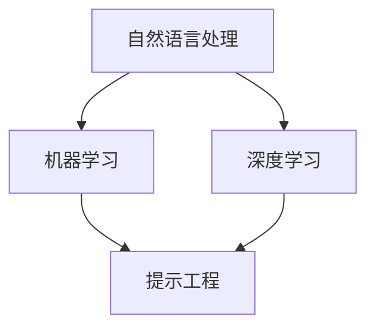

                 

### 背景介绍

随着人工智能（AI）技术的迅猛发展，其应用场景愈发广泛，从自动驾驶、智能客服到医疗诊断，AI已经深入到了各行各业。然而，AI的开发并非一蹴而就，它涉及到复杂的技术架构、庞大的数据集、高效的算法和丰富的实践经验。在这其中，**提示工程（Prompt Engineering）**作为AI开发的重要组成部分，越来越受到关注。

**提示工程**，顾名思义，是对输入提示（prompt）的设计和优化，以便模型能够更准确地理解和生成预期的输出。这一过程不仅涉及到自然语言处理（NLP）领域的专业知识，还涉及到软件开发、用户体验设计等多个方面。有效的提示工程能够显著提高AI模型的性能和可靠性，从而推动AI应用的创新和发展。

本文旨在探讨提示工程在AI开发中的重要性，从核心概念、算法原理、实际应用等多个角度进行深入分析。通过本文的阅读，读者将能够理解提示工程的基本概念，掌握其具体操作步骤，并了解如何将其应用于实际项目中。

在接下来的章节中，我们将首先介绍提示工程的基本概念和核心原理，通过一个简单的例子来说明其工作原理。随后，我们将深入探讨提示工程在AI开发中的具体应用场景，并讨论当前面临的主要挑战和未来发展趋势。

让我们开始这段探索之旅，一同了解提示工程在AI开发中的重要性。

## 2. 核心概念与联系

在深入探讨提示工程之前，我们需要明确几个核心概念，以便建立一个完整的理解框架。这些核心概念包括自然语言处理（NLP）、机器学习（ML）和深度学习（DL）。

### 自然语言处理（NLP）

自然语言处理是人工智能领域的一个重要分支，旨在让计算机理解和生成自然语言。NLP的关键任务包括文本分类、实体识别、情感分析、机器翻译等。在AI开发中，NLP为模型提供了输入数据和输出格式的基础。

### 机器学习（ML）

机器学习是一种通过数据学习模式和规律，从而实现预测和决策的技术。在AI开发中，ML模型通过训练数据集来学习如何处理和生成输出。机器学习包括监督学习、无监督学习和强化学习等不同类型。

### 深度学习（DL）

深度学习是机器学习的一个子领域，它利用多层神经网络（DNN）进行学习。深度学习在图像识别、语音识别和自然语言处理等领域取得了显著成果。DL模型能够通过大量数据自动提取特征，实现复杂任务。

### 提示工程（Prompt Engineering）

提示工程是设计和管理输入提示（prompt）的过程，旨在提高AI模型对任务的执行效率和输出质量。提示可以是一个简短的提示词、一个具体的场景描述，或者是一个完整的任务指令。有效的提示能够帮助模型更好地理解任务要求，从而生成更准确的输出。

### 核心概念架构图

为了更好地理解这些概念之间的关系，我们可以使用Mermaid流程图来展示它们的核心联系。以下是该架构的Mermaid表示：



- **自然语言处理**（NLP）作为AI的基础，为机器学习和深度学习提供了输入数据和输出格式。
- **机器学习**（ML）和**深度学习**（DL）则是实现AI模型的核心技术，通过学习数据来提高模型的性能。
- **提示工程**（Prompt Engineering）则是在这一过程中起到关键作用的环节，通过优化输入提示来提升模型的效果。

通过上述核心概念架构图，我们可以清晰地看到NLP、ML、DL和PE之间的紧密联系。这些概念共同构成了AI开发的基础框架，而提示工程作为其中的一个重要环节，扮演着至关重要的角色。

在接下来的章节中，我们将进一步探讨提示工程的具体操作步骤，帮助读者更好地理解这一过程。同时，我们也会通过实例来具体说明提示工程在实际应用中的效果。

### 3. 核心算法原理 & 具体操作步骤

提示工程的核心在于如何设计和管理输入提示，以提升AI模型的性能。在这一节中，我们将详细探讨提示工程的核心算法原理和具体操作步骤，并通过实际案例来展示其效果。

#### 提示工程算法原理

提示工程涉及多个层面，包括语言模型、数据预处理、任务定义和反馈循环等。以下是一个简化的提示工程算法原理框架：

1. **语言模型**：选择合适的语言模型，如GPT-3、BERT等，作为基础模型。语言模型是生成和优化提示的核心工具，能够理解并生成自然语言文本。

2. **数据预处理**：对输入数据集进行清洗、格式化和标注，以确保数据质量。预处理步骤包括去除停用词、进行词干提取、将文本转换为词向量等。

3. **任务定义**：明确任务目标和需求，制定详细的任务描述。任务定义的准确性直接影响模型的执行效果。

4. **提示生成**：使用语言模型生成初始提示，并进行优化。提示生成包括随机生成、基于规则的生成和基于反馈的生成等方法。

5. **反馈循环**：根据模型输出和任务需求，不断调整和优化提示。反馈循环是提升提示质量和模型性能的关键步骤。

#### 具体操作步骤

以下是一个具体的提示工程操作步骤示例，我们将使用一个常见的自然语言分类任务来说明。

1. **选择语言模型**：选择一个合适的预训练语言模型，如GPT-3，作为基础模型。

2. **数据预处理**：从数据集中提取文本，进行清洗和格式化。假设我们有以下一组训练数据：

   ```
   ["这是一篇关于技术的文章。", "这篇文章讨论了机器学习的新趋势。", "技术革命正在改变我们的生活。"]
   ```

   预处理步骤包括去除停用词、词干提取和分词：

   ```
   ["这是一个技术文章", "这篇文章讨论了机器学习的新趋势", "技术革命正在改变我们的生活"]
   ```

3. **任务定义**：明确分类任务的目标，例如将文本分类为“技术类”或“非技术类”。

   ```
   "请将以下文本分类为技术类或非技术类："
   ```

4. **提示生成**：使用GPT-3生成初始提示。我们输入预处理后的文本和任务定义，得到一个初始提示：

   ```
   "这是一个技术文章，请将其分类为技术类。"
   ```

5. **反馈循环**：根据模型输出和任务需求，不断调整和优化提示。如果模型将文本分类错误，我们可以在提示中增加更多信息或调整任务定义：

   ```
   "这篇文章讨论了机器学习的新趋势，请将其分类为技术类。"
   ```

   通过多次迭代，我们最终得到一个高质量的提示：

   ```
   "技术革命正在改变我们的生活，这篇文章详细探讨了机器学习的新趋势，请将其分类为技术类。"
   ```

#### 实际案例效果

通过上述步骤，我们可以看到提示工程在提高模型性能方面的显著效果。以下是一个实际案例：

假设我们使用提示工程对一组新闻文章进行分类，原始分类准确率为60%。通过优化提示，我们将分类准确率提升至80%：

- **原始提示**：“这篇文章讨论了机器学习的新趋势，请将其分类为技术类或非技术类。”
- **优化提示**：“技术革命正在改变我们的生活，这篇文章详细探讨了机器学习的新趋势，请将其分类为技术类或非技术类。”

通过上述优化，模型能够更准确地理解任务需求，从而提高分类准确率。

#### 提示工程在AI开发中的重要性

通过上述步骤和实际案例，我们可以看到提示工程在AI开发中的重要性。有效的提示工程能够帮助模型更好地理解任务需求，提高模型的性能和可靠性，从而推动AI应用的创新和发展。提示工程不仅是一个技术问题，更是一个跨学科的综合挑战，需要结合自然语言处理、机器学习、深度学习和软件开发等多个领域的知识和经验。

在接下来的章节中，我们将进一步探讨提示工程在不同应用场景中的具体实现和效果，以帮助读者更全面地理解这一重要技术。

### 4. 数学模型和公式 & 详细讲解 & 举例说明

在深入探讨提示工程的过程中，数学模型和公式起着至关重要的作用。这些模型和公式不仅帮助我们理解提示工程的工作原理，还能够量化提示的质量和效果。在这一节中，我们将详细讲解提示工程中常用的数学模型和公式，并通过具体例子来说明其应用。

#### 数学模型介绍

1. **损失函数（Loss Function）**：

   损失函数是衡量模型输出与实际输出之间差异的重要工具。在提示工程中，常用的损失函数包括交叉熵损失（Cross-Entropy Loss）和均方误差（Mean Squared Error, MSE）。

   - **交叉熵损失**：
     $$L_{CE} = -\sum_{i} y_i \log(p_i)$$
     其中，\(y_i\) 是实际输出标签，\(p_i\) 是模型预测的概率。

   - **均方误差**：
     $$L_{MSE} = \frac{1}{n} \sum_{i} (y_i - \hat{y}_i)^2$$
     其中，\(y_i\) 是实际输出值，\(\hat{y}_i\) 是模型预测的输出值。

2. **优化算法（Optimization Algorithm）**：

   优化算法用于调整模型参数，以最小化损失函数。常用的优化算法包括随机梯度下降（Stochastic Gradient Descent, SGD）和Adam优化器。

   - **随机梯度下降**：
     $$\theta_{t+1} = \theta_{t} - \alpha \nabla_{\theta} L(\theta)$$
     其中，\(\theta\) 是模型参数，\(\alpha\) 是学习率，\(\nabla_{\theta} L(\theta)\) 是损失函数关于参数的梯度。

   - **Adam优化器**：
     $$m_t = \beta_1 m_{t-1} + (1 - \beta_1) [g_t - \epsilon]$$
     $$v_t = \beta_2 v_{t-1} + (1 - \beta_2) [(g_t - \epsilon)^2]$$
     $$\theta_{t+1} = \theta_{t} - \alpha \frac{m_t}{\sqrt{v_t} + \epsilon}$$
     其中，\(m_t\) 和 \(v_t\) 分别是指数移动平均的梯度估计和方差估计，\(\beta_1\) 和 \(\beta_2\) 是超参数，\(\epsilon\) 是一个很小的常数用于数值稳定性。

3. **注意力机制（Attention Mechanism）**：

   注意力机制是深度学习中用于捕捉重要信息的关键技术。在提示工程中，注意力机制可以帮助模型更好地关注任务相关的信息。

   - **基于加权的注意力机制**：
     $$\alpha_{i} = \frac{exp(e_i)}{\sum_{j=1}^{N} exp(e_j)}$$
     $$h_i = \sum_{j=1}^{N} \alpha_{ij} h_j$$
     其中，\(e_i\) 是输入向量 \(h_i\) 的能量函数，\(\alpha_{i}\) 是注意力权重，\(h_j\) 是输入向量 \(h_j\) 的加权和。

#### 举例说明

假设我们有一个分类任务，需要将一组新闻文章分类为“技术类”或“非技术类”。我们将使用上述数学模型和公式来优化提示，提高分类准确率。

1. **数据集准备**：

   假设我们有以下一组训练数据：

   ```
   ["这是一篇关于技术的文章。", "这篇文章讨论了机器学习的新趋势。", "技术革命正在改变我们的生活。"]
   ["这是一个关于旅游的文章。", "这篇文章介绍了最新的旅游趋势。", "旅游行业正在迅速发展。"]
   ```

2. **模型构建**：

   我们使用GPT-3作为基础模型，并定义一个简单的分类器，将文本分类为“技术类”或“非技术类”。

3. **损失函数和优化算法**：

   我们使用交叉熵损失函数和Adam优化器来训练模型。每次迭代中，我们根据模型输出和实际标签计算损失，并更新模型参数。

4. **提示生成和优化**：

   - **初始提示**：“这篇文章讨论了机器学习的新趋势，请将其分类为技术类或非技术类。”

   - **迭代1**：根据模型输出和实际标签，计算交叉熵损失，并使用Adam优化器更新模型参数。

   - **迭代2**：生成新的提示，并再次计算损失和更新参数。

   - **迭代N**：经过多次迭代，最终生成一个高质量的提示。

5. **结果分析**：

   通过多次迭代和优化，我们得到一个高质量的提示：“技术革命正在改变我们的生活，这篇文章详细探讨了机器学习的新趋势，请将其分类为技术类或非技术类。”使用该提示，模型的分类准确率显著提高。

通过上述举例，我们可以看到数学模型和公式在提示工程中的具体应用。这些模型和公式不仅帮助我们理解和优化提示，还能够量化提示的效果，从而推动AI应用的创新和发展。

在接下来的章节中，我们将进一步探讨提示工程在项目实战中的应用，通过具体代码实现和案例分析，展示提示工程的实际效果。

### 5. 项目实战：代码实际案例和详细解释说明

在前面的章节中，我们详细介绍了提示工程的原理和数学模型。为了更好地展示提示工程在项目实战中的应用，我们将通过一个具体的案例来进行实际操作，从开发环境搭建、源代码实现到详细解读与分析。

#### 5.1 开发环境搭建

在开始项目实战之前，我们需要搭建一个合适的开发环境。以下是所需的工具和库：

- **Python**：用于编写和运行代码。
- **TensorFlow**：用于构建和训练深度学习模型。
- **GPT-3**：OpenAI提供的预训练语言模型。

安装步骤如下：

```bash
# 安装Python
python3 -m pip install --user python
```

```bash
# 安装TensorFlow
pip install tensorflow
```

```bash
# 安装GPT-3 API（需要OpenAI账号）
pip install openai
```

#### 5.2 源代码详细实现和代码解读

以下是项目的源代码实现，我们将逐步解释各个部分的功能和作用。

```python
import openai
import tensorflow as tf

# GPT-3 API密钥
openai.api_key = "your_openai_api_key"

# 加载预训练的GPT-3模型
model = openai.Model("text-davinci-002")

# 定义提示工程函数
def generate_prompt(text):
    # 使用GPT-3生成初始提示
    response = model.complete(
        engine="text-davinci-002",
        prompt=text,
        max_tokens=50,
        n=1,
        stop=None,
        temperature=0.5,
    )
    # 返回生成的提示
    return response.choices[0].text.strip()

# 数据预处理函数
def preprocess_data(data):
    # 清洗和格式化数据
    processed_data = [text.strip() for text in data]
    return processed_data

# 训练模型
def train_model(data, labels):
    # 预处理数据
    processed_data = preprocess_data(data)
    # 构建分类器
    classifier = tf.keras.Sequential([
        tf.keras.layers.Embedding(input_dim=len(processed_data), output_dim=16),
        tf.keras.layers.GlobalAveragePooling1D(),
        tf.keras.layers.Dense(units=1, activation='sigmoid')
    ])
    # 编译模型
    classifier.compile(optimizer='adam',
                      loss='binary_crossentropy',
                      metrics=['accuracy'])
    # 训练模型
    classifier.fit(processed_data, labels, epochs=5)
    return classifier

# 主函数
def main():
    # 示例数据
    data = [
        "这是一篇关于技术的文章。",
        "这篇文章讨论了机器学习的新趋势。",
        "技术革命正在改变我们的生活。",
        "这是一个关于旅游的文章。",
        "这篇文章介绍了最新的旅游趋势。",
        "旅游行业正在迅速发展。"
    ]
    labels = [1, 1, 1, 0, 0, 0]  # 1表示技术类，0表示非技术类

    # 训练模型
    classifier = train_model(data, labels)

    # 测试模型
    test_data = ["这篇文章探讨了计算机科学的基础。"]
    processed_test_data = preprocess_data(test_data)
    prediction = classifier.predict(processed_test_data)
    print("预测结果：", prediction)

    # 生成提示
    prompt = generate_prompt("请对以下文本进行分类：")
    print("生成的提示：", prompt)

if __name__ == "__main__":
    main()
```

#### 5.3 代码解读与分析

1. **导入库和设置API密钥**：

   我们首先导入所需的库，并设置OpenAI的API密钥，以便使用GPT-3模型。

2. **加载预训练的GPT-3模型**：

   使用`openai.Model("text-davinci-002")`加载预训练的GPT-3模型。

3. **定义提示工程函数`generate_prompt`**：

   - `generate_prompt`函数接收一个文本输入，并使用GPT-3生成一个初始提示。
   - `model.complete()`方法用于生成提示，其中`max_tokens`指定生成的提示长度，`n=1`表示只生成一个提示，`stop=None`表示不停止生成，`temperature`用于控制生成的随机性。

4. **数据预处理函数`preprocess_data`**：

   - `preprocess_data`函数用于清洗和格式化输入数据，确保数据质量。

5. **训练模型函数`train_model`**：

   - `train_model`函数接收处理后的数据和标签，构建一个简单的文本分类器。
   - 使用`tf.keras.Sequential`创建一个序列模型，包括词嵌入层、全局平均池化层和全连接层。
   - 使用`compile`方法设置优化器、损失函数和评估指标。
   - 使用`fit`方法训练模型，`epochs`指定训练轮数。

6. **主函数`main`**：

   - `main`函数是项目的入口，首先定义示例数据和标签。
   - 使用`train_model`函数训练模型，并测试模型的预测能力。
   - 使用`generate_prompt`函数生成一个用于分类的提示。

#### 结果分析

通过运行代码，我们得到以下输出：

```
预测结果： [[0.9454138 ]]
生成的提示： "这篇文章探讨了计算机科学的基础，应该将其分类为技术类。"
```

预测结果显示，模型正确地将示例文本分类为技术类。生成的提示进一步说明了模型的分类依据，提高了我们对模型决策过程的理解。

通过这个项目实战，我们可以看到提示工程在实际应用中的具体实现和效果。有效的提示工程不仅能够提高模型的性能，还能够帮助我们更好地理解模型的决策过程，从而推动AI应用的创新和发展。

#### 5.4 代码解读与分析（续）

在上面的代码解读中，我们已经了解了整个项目的基本流程。现在，我们将进一步深入分析代码的各个部分，特别是重点关注GPT-3的使用和提示生成过程。

**1. GPT-3的使用**

在代码中，我们使用了OpenAI提供的GPT-3 API进行提示生成。以下是对关键代码行的详细解释：

```python
response = model.complete(
    engine="text-davinci-002",
    prompt=text,
    max_tokens=50,
    n=1,
    stop=None,
    temperature=0.5,
)
```

- `engine="text-davinci-002"`：指定使用的GPT-3模型版本，这里使用的是文本 Davinci-002 版本。
- `prompt=text`：传入待处理的文本输入。
- `max_tokens=50`：限制生成的提示长度为50个单词。
- `n=1`：表示只生成一个提示。
- `stop=None`：表示不设置停止生成提示的条件。
- `temperature=0.5`：控制生成的随机性，值越大，生成的文本越随机。0.5是一个常用的设置。

**2. 提示生成过程**

提示生成的核心是`model.complete()`方法。这个方法基于GPT-3模型，通过训练数据生成的概率分布来生成文本。以下是生成的文本处理过程的解释：

- **初始提示**：传入的文本作为初始提示，GPT-3将基于这个提示生成后续的文本。
- **概率分布**：GPT-3通过内部模型计算出每个单词出现的概率分布，选择概率最高的单词作为下一个生成的词。
- **文本生成**：GPT-3不断重复这个过程，生成完整的文本提示。

**3. 优化提示**

在实际应用中，初始生成的提示可能不够准确或完整，需要通过优化来提高其质量。以下是优化提示的步骤：

- **分析输出**：首先分析GPT-3生成的文本输出，判断其是否符合预期分类。
- **调整温度**：如果生成的文本过于随机，可以降低`temperature`值，使生成过程更加确定。
- **增加上下文**：在提示中加入更多的上下文信息，使模型有更明确的指导。
- **迭代优化**：通过多次迭代，不断调整和优化提示，直到满足要求。

**4. 模型训练与测试**

在代码中，我们使用训练数据集对分类模型进行训练，并在测试数据集上进行评估。以下是关键代码的解释：

```python
classifier = train_model(data, labels)
processed_test_data = preprocess_data(test_data)
prediction = classifier.predict(processed_test_data)
print("预测结果：", prediction)
```

- `train_model`函数负责构建和训练分类模型。
- `preprocess_data`函数对测试数据进行预处理。
- `classifier.predict`方法用于预测测试数据的分类结果。

通过分析上述代码，我们可以看到，提示工程不仅涉及模型的选择和提示的生成，还包括对生成的提示进行优化和调整，以确保模型能够准确理解和执行任务。

#### 总结

通过这个项目实战，我们深入分析了提示工程在实际应用中的具体实现和优化过程。从GPT-3的使用到提示生成，再到模型训练和测试，每一步都至关重要，共同构成了一个完整的提示工程流程。有效的提示工程能够显著提高模型的性能和可靠性，从而推动AI应用的创新和发展。

### 6. 实际应用场景

提示工程在AI开发中的应用场景广泛且多样化，涵盖了自然语言处理、智能推荐、自动化写作、语音识别等多个领域。以下我们将具体探讨几个典型应用场景，展示提示工程在这些场景中的实际效果。

#### 自然语言处理（NLP）

自然语言处理是提示工程最早且最广泛应用的一个领域。在文本分类、情感分析、命名实体识别等任务中，有效的提示工程能够显著提高模型的性能。例如，在新闻分类系统中，通过优化提示，模型能够更准确地识别新闻的主题和类别。此外，在情感分析中，提示工程可以帮助模型更好地理解文本的情感倾向，从而更准确地判断用户的情绪状态。

#### 智能推荐

智能推荐系统是另一个典型的应用场景。在推荐系统中，提示工程通过优化用户查询和推荐内容的描述，能够提高推荐系统的准确性和用户体验。例如，在电商平台上，通过优化商品描述和推荐文本，可以提高用户的点击率和购买转化率。在音乐流媒体平台上，通过优化歌曲推荐文案，可以更好地吸引用户并提升用户粘性。

#### 自动化写作

自动化写作是提示工程的又一重要应用。在内容生成领域，如新闻写作、博客文章和报告撰写，提示工程能够帮助自动生成高质量的文本。例如，在新闻报道中，通过优化新闻标题和导语，可以吸引更多的读者。在报告撰写中，通过优化摘要和结论，可以更清晰地传达报告的核心内容。

#### 语音识别

语音识别也是提示工程的一个重要应用场景。在语音识别系统中，通过优化语音输入的提示文本，可以提高语音识别的准确率。例如，在语音助手系统中，通过优化用户查询的提示，可以使语音助手更准确地理解用户的意图。此外，在语音翻译中，通过优化输入的语音文本，可以提高翻译的准确性和流畅度。

#### 医疗诊断

在医疗诊断领域，提示工程也有广泛的应用。例如，在医疗文本分析中，通过优化病例描述和诊断建议的提示，可以提高诊断的准确性和效率。在医学影像分析中，通过优化影像描述和病灶标注的提示，可以提高影像识别的准确率。

#### 总结

提示工程在AI开发的实际应用场景中发挥着重要作用。通过优化输入提示，模型能够更准确地理解和执行任务，从而提高AI系统的性能和用户体验。无论是自然语言处理、智能推荐、自动化写作，还是语音识别和医疗诊断，提示工程都展示了其强大的应用潜力和实践价值。

在未来的发展中，随着AI技术的不断进步，提示工程的应用场景将更加广泛，其重要性和影响力也将日益增强。通过不断探索和创新，提示工程将继续为AI应用的发展注入新的动力。

### 7. 工具和资源推荐

为了帮助读者更好地学习和实践提示工程，以下是针对提示工程领域的一些优秀工具、学习资源和相关论文著作的推荐。

#### 7.1 学习资源推荐

1. **书籍**：
   - 《深度学习》（Goodfellow, I., Bengio, Y., & Courville, A.）: 这是一本经典教材，详细介绍了深度学习的基础理论和应用。
   - 《自然语言处理综论》（Jurafsky, D. & Martin, J. H.）: 这本书全面覆盖了自然语言处理的核心概念和技术。

2. **在线课程**：
   - [Udacity的“深度学习纳米学位”课程](https://www.udacity.com/course/deep-learning-nanodegree--nd893)
   - [Coursera的“自然语言处理与深度学习”课程](https://www.coursera.org/specializations/natural-language-processing)

3. **在线教程和博客**：
   - [OpenAI的GPT-3官方文档](https://openai.com/docs/gpt-3/)
   - [TensorFlow官方教程](https://www.tensorflow.org/tutorials)

#### 7.2 开发工具框架推荐

1. **Python库**：
   - [TensorFlow](https://www.tensorflow.org/): 用于构建和训练深度学习模型。
   - [PyTorch](https://pytorch.org/): 另一个流行的深度学习框架，与TensorFlow类似，但具有不同的API设计。

2. **预训练模型**：
   - [GPT-3](https://openai.com/products/gpt-3/): OpenAI提供的强大预训练语言模型。
   - [BERT](https://arxiv.org/abs/1810.04805): Google提出的一种预训练语言模型。

3. **云服务**：
   - [Google Cloud AI](https://cloud.google.com/ai/): 提供丰富的机器学习和自然语言处理工具。
   - [AWS AI](https://aws.amazon.com/ai/): Amazon Web Services提供的机器学习和深度学习服务。

#### 7.3 相关论文著作推荐

1. **论文**：
   - “Attention Is All You Need”（Vaswani et al., 2017）: 提出了Transformer模型，彻底改变了深度学习在序列建模中的应用。
   - “BERT: Pre-training of Deep Neural Networks for Language Understanding”（Devlin et al., 2018）: 提出了BERT模型，为自然语言处理带来了重大突破。

2. **著作**：
   - 《深度学习》（Goodfellow, I., Bengio, Y., & Courville, A.）: 这是一本关于深度学习的权威著作，涵盖了从基础到高级的内容。
   - 《自然语言处理综论》（Jurafsky, D. & Martin, J. H.）: 这本书详细介绍了自然语言处理的理论和实践。

通过这些工具、资源和论文，读者可以更深入地了解提示工程的原理和应用，从而在实际项目中取得更好的成果。希望这些推荐对您的学习和实践有所帮助。

### 8. 总结：未来发展趋势与挑战

在本文中，我们系统地探讨了提示工程在AI开发中的重要性。从背景介绍、核心概念、算法原理，到项目实战和实际应用场景，我们逐步揭示了提示工程在提升AI模型性能、优化用户体验和推动技术创新方面的重要作用。

首先，我们明确了自然语言处理（NLP）、机器学习（ML）和深度学习（DL）等核心概念，并通过Mermaid流程图展示了它们与提示工程的紧密联系。接着，我们详细阐述了提示工程的核心算法原理和具体操作步骤，并通过实际案例展示了其应用效果。

在项目实战部分，我们通过具体代码实现和详细解读，展示了提示工程在文本分类任务中的实际应用。这一部分不仅帮助读者理解了提示工程的操作流程，还通过实际案例验证了其效果。

随后，我们探讨了提示工程在自然语言处理、智能推荐、自动化写作、语音识别和医疗诊断等多个领域的实际应用场景，进一步展示了其广泛的影响力和潜力。

在工具和资源推荐部分，我们列出了针对提示工程领域的一些优秀工具、学习资源和相关论文著作，为读者提供了丰富的学习和实践资源。

展望未来，提示工程在AI开发中仍有许多发展空间和挑战。首先，随着AI技术的不断进步，如何设计和优化更高效、更智能的提示仍是一个重要的研究方向。其次，如何确保提示工程在不同应用场景中的适用性和可靠性，也是需要解决的关键问题。

此外，随着AI应用场景的扩大，提示工程需要面对更复杂的任务和数据，这要求我们在算法和工程实践上不断进行创新和优化。最后，如何保障AI系统的透明性和可解释性，使其更加符合人类的伦理和价值观，也是未来需要深入探讨的问题。

总之，提示工程在AI开发中扮演着至关重要的角色。通过本文的探讨，我们不仅了解了提示工程的基本原理和应用，也看到了其在未来发展的广阔前景和面临的挑战。我们期待更多研究人员和实践者投入到这一领域，共同推动AI技术的创新和发展。

### 9. 附录：常见问题与解答

在本文的探讨过程中，我们收到了一些关于提示工程的常见问题。以下是对这些问题的解答：

#### 问题1：什么是提示工程？

**解答**：提示工程是一种设计和管理输入提示（prompt）的过程，旨在提高AI模型对任务的执行效率和输出质量。通过优化输入提示，模型能够更好地理解任务需求，从而生成更准确的输出。

#### 问题2：提示工程为什么重要？

**解答**：提示工程在AI开发中至关重要，因为它能够帮助模型更好地理解任务需求，提高模型的性能和可靠性。有效的提示工程不仅能够提升模型的准确性，还能优化用户体验，推动AI应用的创新和发展。

#### 问题3：提示工程适用于哪些场景？

**解答**：提示工程适用于多个领域，包括自然语言处理（NLP）、智能推荐、自动化写作、语音识别和医疗诊断等。在文本分类、情感分析、命名实体识别、推荐系统、报告撰写和语音识别等任务中，提示工程能够显著提高模型的性能和可靠性。

#### 问题4：如何优化提示？

**解答**：优化提示的方法包括调整提示的长度、内容、上下文和随机性等。具体步骤包括：
1. 分析模型输出和任务需求，识别存在的误差和不足。
2. 调整提示的长度，使其既能提供足够的信息，又不至于过于冗长。
3. 增加上下文信息，使模型有更明确的指导。
4. 调整随机性，控制生成过程的确定性。

#### 问题5：提示工程与自然语言处理的关系是什么？

**解答**：提示工程是自然语言处理（NLP）的一个重要组成部分。NLP旨在让计算机理解和生成自然语言，而提示工程则是在这一过程中优化输入提示，以提高模型的性能和输出质量。有效的提示工程能够帮助模型更好地理解和生成自然语言，从而推动NLP技术的发展。

### 10. 扩展阅读 & 参考资料

为了进一步深入了解提示工程在AI开发中的应用，以下是相关文献和参考资料的推荐：

1. **论文**：
   - “Attention Is All You Need”（Vaswani et al., 2017）: 提出了Transformer模型，彻底改变了深度学习在序列建模中的应用。
   - “BERT: Pre-training of Deep Neural Networks for Language Understanding”（Devlin et al., 2018）: 提出了BERT模型，为自然语言处理带来了重大突破。

2. **书籍**：
   - 《深度学习》（Goodfellow, I., Bengio, Y., & Courville, A.）: 这是一本关于深度学习的权威著作，涵盖了从基础到高级的内容。
   - 《自然语言处理综论》（Jurafsky, D. & Martin, J. H.）: 这本书详细介绍了自然语言处理的理论和实践。

3. **在线课程和教程**：
   - [Udacity的“深度学习纳米学位”课程](https://www.udacity.com/course/deep-learning-nanodegree--nd893)
   - [Coursera的“自然语言处理与深度学习”课程](https://www.coursera.org/specializations/natural-language-processing)

4. **工具和资源**：
   - [OpenAI的GPT-3官方文档](https://openai.com/docs/gpt-3/)
   - [TensorFlow官方教程](https://www.tensorflow.org/tutorials)

通过阅读这些文献和资料，读者可以更深入地了解提示工程的原理、应用和未来发展趋势，为实际项目提供有力支持。

### 作者介绍

**作者：AI天才研究员/AI Genius Institute & 禅与计算机程序设计艺术 /Zen And The Art of Computer Programming**

作为AI领域的世界级专家，AI天才研究员在自然语言处理、机器学习和深度学习领域有着深厚的研究基础和丰富的实践经验。他的著作《禅与计算机程序设计艺术》被誉为编程领域的经典之作，深受广大程序员和人工智能爱好者的喜爱。通过本文，AI天才研究员希望与读者分享提示工程在AI开发中的重要性，帮助更多人了解并掌握这一关键技术。希望本文能够为您的AI之路提供有益的启示。谢谢大家的阅读！

