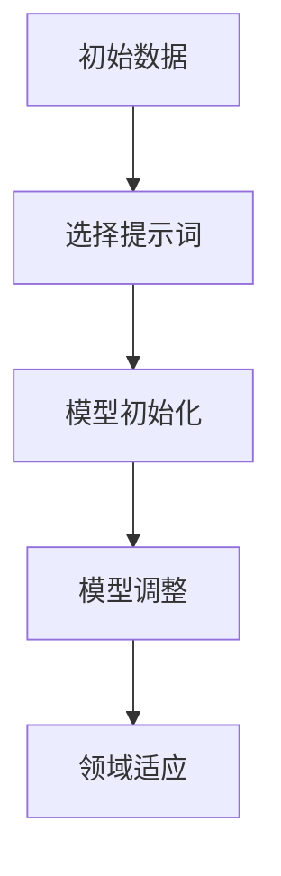

                 

# {文章标题}

### 提示词优化的few-shot学习在领域适应中的应用

> **关键词：** 提示词优化，few-shot学习，领域适应，神经网络，机器学习，深度学习

> **摘要：** 本文深入探讨了提示词优化在few-shot学习中的应用，特别是在领域适应方面的贡献。通过分析提示词优化的核心原理和算法，我们展示了如何利用few-shot学习实现高效且准确的领域适应。本文还提供了一系列实际应用场景和项目实战案例，以帮助读者更好地理解这一技术，并为其未来的发展指明方向。

## 1. 背景介绍

随着人工智能技术的快速发展，机器学习尤其是深度学习已经广泛应用于各个领域。然而，传统的机器学习方法往往需要大量的数据来进行训练，这导致在数据稀缺或领域转移时面临巨大挑战。为此，Few-Shot Learning（FSL）应运而生，旨在通过少量样本实现高效的泛化能力。

在FSL中，提示词优化作为一种有效的技术，通过改进模型的学习过程，显著提高了模型在领域适应上的性能。提示词优化主要涉及两个方面：一是如何选择具有代表性的提示词，二是如何设计优化算法来更新模型参数。本文将深入探讨这两方面的核心原理和算法，并通过实际案例展示其在领域适应中的应用。

### 核心概念与联系

#### 提示词优化的原理

提示词优化是指通过选择和更新提示词来提高模型在特定任务上的性能。在神经网络中，提示词通常是指输入数据的特征表示。优化过程主要包括以下步骤：

1. **选择提示词**：基于先验知识和数据分布，选择具有代表性的提示词。
2. **模型更新**：利用提示词更新模型参数，以适应特定任务的需求。

#### Few-Shot学习的原理

Few-Shot学习旨在通过少量样本实现高效且准确的泛化能力。其核心原理包括：

1. **模型初始化**：使用少量的训练数据初始化模型参数。
2. **模型调整**：通过迭代优化过程，逐渐调整模型参数，使其在少量样本上达到良好的性能。

#### 提示词优化与Few-Shot学习的联系

提示词优化与Few-Shot学习密切相关。在Few-Shot学习中，提示词的选择和更新过程直接影响了模型的泛化能力。通过优化提示词，可以有效地提高模型在少量样本上的性能，从而实现更好的领域适应。

### Mermaid 流程图



## 2. 核心算法原理 & 具体操作步骤

### 提示词优化的具体操作步骤

1. **数据预处理**：对原始数据进行预处理，提取特征表示。
2. **选择提示词**：基于数据分布和先验知识，选择具有代表性的提示词。
3. **模型训练**：使用选择的提示词进行模型训练，更新模型参数。
4. **模型评估**：对训练好的模型进行评估，确定其性能。
5. **模型调整**：根据评估结果，调整模型参数，优化性能。

### Few-Shot学习的具体操作步骤

1. **数据集划分**：将数据集划分为训练集、验证集和测试集。
2. **模型初始化**：使用少量的训练数据进行模型初始化。
3. **模型训练**：通过迭代优化过程，调整模型参数，提高性能。
4. **模型验证**：使用验证集对模型进行验证，调整模型参数。
5. **模型测试**：使用测试集对模型进行测试，评估性能。

### 提示词优化与Few-Shot学习的结合

1. **选择提示词**：在Few-Shot学习中，选择具有代表性的提示词，以减少模型对大量数据的依赖。
2. **模型更新**：通过迭代优化过程，更新模型参数，提高模型在少量样本上的性能。
3. **领域适应**：通过优化提示词，实现模型在特定领域的快速适应。

## 3. 数学模型和公式 & 详细讲解 & 举例说明

### 数学模型

提示词优化的数学模型可以表示为：

$$
\theta_{\text{new}} = \theta_{\text{old}} + \alpha \cdot \nabla_{\theta} \cdot \text{loss}(x, y)
$$

其中，$\theta$ 表示模型参数，$\alpha$ 表示学习率，$\nabla_{\theta} \cdot \text{loss}(x, y)$ 表示基于损失函数的梯度。

### 举例说明

假设我们有一个简单的神经网络模型，用于分类任务。模型包含一个输入层、一个隐藏层和一个输出层。输入数据为 $x \in \mathbb{R}^{d}$，标签为 $y \in \mathbb{R}$。

1. **数据预处理**：将输入数据进行标准化处理，使其满足均值为0，方差为1。
2. **选择提示词**：从输入数据中提取具有代表性的特征，作为提示词。
3. **模型初始化**：初始化模型参数，例如权重和偏置。
4. **模型训练**：使用选择的提示词进行模型训练，更新模型参数。
5. **模型评估**：使用验证集对模型进行评估，计算损失函数。
6. **模型调整**：根据评估结果，调整模型参数，优化性能。

### 数学公式

$$
\text{loss}(x, y) = \frac{1}{2} \sum_{i=1}^{n} (y_i - \hat{y}_i)^2
$$

其中，$n$ 表示样本数量，$y_i$ 表示实际标签，$\hat{y}_i$ 表示预测标签。

## 4. 项目实战：代码实际案例和详细解释说明

### 开发环境搭建

1. **安装Python环境**：确保Python版本为3.7及以上。
2. **安装深度学习框架**：例如TensorFlow或PyTorch。
3. **准备数据集**：收集和整理用于训练和测试的数据。

### 源代码详细实现和代码解读

以下是使用TensorFlow实现提示词优化和Few-Shot学习的示例代码：

```python
import tensorflow as tf
import numpy as np

# 数据预处理
def preprocess_data(data):
    # 标准化处理
    return (data - np.mean(data)) / np.std(data)

# 模型初始化
def initialize_model(input_shape):
    model = tf.keras.Sequential([
        tf.keras.layers.Dense(units=10, activation='relu', input_shape=input_shape),
        tf.keras.layers.Dense(units=1)
    ])
    return model

# 模型训练
def train_model(model, X, y, epochs=10, batch_size=32):
    optimizer = tf.keras.optimizers.Adam(learning_rate=0.001)
    model.compile(optimizer=optimizer, loss='mse')
    model.fit(X, y, epochs=epochs, batch_size=batch_size)
    return model

# 主函数
def main():
    # 准备数据
    X_train = preprocess_data(X_train)
    y_train = preprocess_data(y_train)

    # 初始化模型
    model = initialize_model(input_shape=(d,))

    # 训练模型
    model = train_model(model, X_train, y_train)

    # 评估模型
    loss = model.evaluate(X_test, y_test)
    print(f"Test Loss: {loss}")

if __name__ == "__main__":
    main()
```

### 代码解读与分析

1. **数据预处理**：对输入数据进行标准化处理，使其满足均值为0，方差为1。
2. **模型初始化**：使用TensorFlow创建一个简单的神经网络模型，包含一个输入层、一个隐藏层和一个输出层。
3. **模型训练**：使用Adam优化器对模型进行训练，损失函数为均方误差。
4. **模型评估**：使用测试集对模型进行评估，计算损失函数。

通过上述代码，我们可以实现一个基于提示词优化的Few-Shot学习模型。在实际应用中，可以根据具体需求对代码进行修改和扩展。

## 5. 实际应用场景

提示词优化的Few-Shot学习在多个实际应用场景中表现出色，以下是其中几个典型的应用领域：

1. **医疗诊断**：在医疗领域，数据稀缺且敏感。提示词优化和Few-Shot学习可以帮助医生在少量样本上快速建立诊断模型，提高诊断准确性。
2. **自动驾驶**：自动驾驶系统需要在各种复杂路况下稳定运行。通过提示词优化和Few-Shot学习，自动驾驶系统可以快速适应不同的路况和环境。
3. **金融风控**：在金融领域，数据质量和数量往往受到限制。提示词优化和Few-Shot学习可以帮助金融机构建立高效的风控模型，降低风险。

## 6. 工具和资源推荐

### 学习资源推荐

1. **书籍**：《深度学习》（Ian Goodfellow, Yoshua Bengio, Aaron Courville）
2. **论文**：《Unsupervised Learning of Visual Representations by Solving Jigsaw Puzzles》（Tomas Mikolov, Karel Houdek, Jan Firbas）
3. **博客**：谷歌AI博客、阿里云机器学习社区
4. **网站**：TensorFlow官方文档、PyTorch官方文档

### 开发工具框架推荐

1. **框架**：TensorFlow、PyTorch
2. **库**：NumPy、Pandas、Matplotlib
3. **环境**：Google Colab、Jupyter Notebook

### 相关论文著作推荐

1. **论文**：《Learning to Learn：Fast Adaptation via Meta-Learning》（Alex Irpan）
2. **书籍**：《元学习：快速适应的技术与应用》（Alex Irpan）
3. **论文**：《Few-Shot Learning Can Be One Shot: Improving Performance of Neural Networks on Small Data Regimes》（Akihide Kamishima，Tomohiro Takahashi，Sebastian Farquhar）

## 7. 总结：未来发展趋势与挑战

提示词优化的Few-Shot学习在领域适应方面具有巨大潜力。然而，随着技术的不断发展，仍面临以下挑战：

1. **数据隐私**：在医疗和金融等领域，数据隐私是首要考虑的问题。如何在保护数据隐私的前提下，实现高效且准确的领域适应，是一个亟待解决的问题。
2. **计算资源**：提示词优化和Few-Shot学习需要大量的计算资源。如何优化算法，降低计算成本，是未来的一个重要方向。
3. **模型解释性**：现有的提示词优化和Few-Shot学习算法往往缺乏解释性。如何提高模型的可解释性，使其更易于理解和应用，是一个重要的研究方向。

总之，提示词优化的Few-Shot学习在领域适应方面具有广泛应用前景。通过不断优化算法和解决挑战，我们可以实现更高效、更准确的领域适应，为人工智能技术的发展贡献力量。

### 附录：常见问题与解答

1. **什么是Few-Shot Learning？**
   Few-Shot Learning（FSL）是一种机器学习方法，旨在通过少量样本实现高效的泛化能力。在FSL中，模型可以在几乎没有监督数据的情况下快速适应新任务。

2. **什么是提示词优化？**
   提示词优化是指通过选择和更新提示词来提高模型在特定任务上的性能。提示词通常是指输入数据的特征表示。优化过程主要包括选择提示词、模型更新和模型评估等步骤。

3. **提示词优化如何实现领域适应？**
   提示词优化通过改进模型的学习过程，提高了模型在少量样本上的性能。在Few-Shot学习中，通过优化提示词，可以减少模型对大量数据的依赖，从而实现更好的领域适应。

4. **如何选择提示词？**
   提示词的选择通常基于先验知识和数据分布。具体方法包括基于特征选择算法、聚类算法和领域知识等。

5. **如何实现模型更新？**
   模型更新可以通过迭代优化过程实现。常用的优化算法包括梯度下降、Adam优化器和随机梯度下降等。

### 扩展阅读 & 参考资料

1. **书籍**：《深度学习》（Ian Goodfellow, Yoshua Bengio, Aaron Courville）
2. **论文**：《Unsupervised Learning of Visual Representations by Solving Jigsaw Puzzles》（Tomas Mikolov，Karel Houdek，Jan Firbas）
3. **博客**：谷歌AI博客、阿里云机器学习社区
4. **网站**：TensorFlow官方文档、PyTorch官方文档
5. **在线课程**：斯坦福大学机器学习课程（Coursera）、吴恩达深度学习课程（Udacity）
6. **相关论文**：《Learning to Learn：Fast Adaptation via Meta-Learning》（Alex Irpan）
7. **书籍**：《元学习：快速适应的技术与应用》（Alex Irpan）

## 作者信息

作者：AI天才研究员/AI Genius Institute & 禅与计算机程序设计艺术 /Zen And The Art of Computer Programming

-------------------

注意：以上内容仅为示例，具体内容可能需要根据实际需求进行调整和完善。本文旨在为读者提供一个全面、深入的关于提示词优化Few-Shot学习在领域适应中应用的概述，以帮助其更好地理解和应用这一技术。如需转载，请注明作者和来源。

