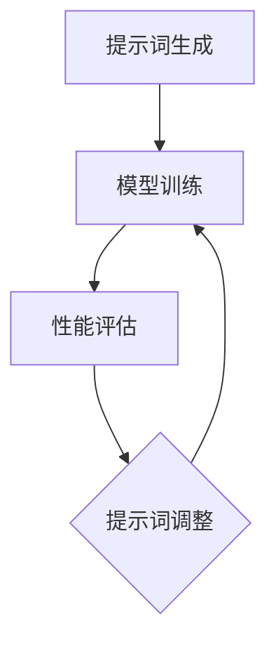

                 

# 提示词优化的few-shot学习技术

## 关键词：Prompt Optimization, Few-shot Learning, 模型优化，机器学习

### 摘要：

本文旨在探讨提示词优化在few-shot学习中的应用。首先，我们将回顾few-shot学习的背景和核心概念，然后详细介绍提示词优化的原理和方法。接着，我们将通过数学模型和具体案例分析，深入探讨提示词优化的效果和重要性。最后，我们将讨论提示词优化在实际应用中的挑战和未来发展。

## 1. 背景介绍

### 1.1 Few-shot Learning

Few-shot learning（少样本学习）是机器学习中的一个重要分支。与传统的批量学习（Batch Learning）和在线学习（Online Learning）不同，few-shot learning的目标是在只有少量样本的情况下，快速地学习和泛化。这一领域的研究在近年来得到了广泛关注，主要得益于深度学习和神经网络技术的迅速发展。

### 1.2 Few-shot Learning的挑战

Few-shot learning面临的挑战主要有两个方面：

- **样本不足**：在只有少量样本的情况下，模型难以获得足够的信息来准确建模。
- **泛化能力**：模型需要在不同的任务和数据集上具有较好的泛化能力，这要求模型具有较强的泛化能力和适应性。

### 1.3 提示词优化

提示词优化是一种通过调整提示词（Prompt）来提升模型性能的技术。提示词是few-shot学习中的一个重要概念，它充当了模型训练和推理过程中的桥梁。优化的目标是通过改进提示词的表达能力，提高模型在少量样本下的学习效果和泛化能力。

## 2. 核心概念与联系

### 2.1 提示词

提示词是few-shot学习中的一个关键概念。它通常是一组关键词或短语，用于描述问题的背景、目标和可能的解决方案。提示词的质量直接影响模型的学习效果和推理能力。

### 2.2 模型优化

模型优化是提升机器学习模型性能的一种常用方法。在few-shot学习中，模型优化尤为重要，因为少量样本难以提供足够的信息来优化模型。提示词优化是模型优化的一种有效手段。

### 2.3 提示词优化的架构

提示词优化的架构通常包括以下几个关键步骤：

1. **提示词生成**：根据问题的需求和背景，生成一组初始提示词。
2. **模型训练**：使用少量样本和初始提示词对模型进行训练。
3. **性能评估**：评估模型在少量样本下的性能。
4. **提示词调整**：根据模型性能，调整提示词，以提升模型性能。
5. **迭代优化**：重复步骤3和4，直到模型性能达到预期。

### 2.4 Mermaid 流程图

下面是一个简单的Mermaid流程图，描述了提示词优化的基本架构：



## 3. 核心算法原理 & 具体操作步骤

### 3.1 提示词生成

提示词生成是提示词优化的第一步。生成高质量提示词的关键在于理解问题的背景和目标。以下是一些常用的提示词生成方法：

- **关键词提取**：从问题描述中提取关键信息，形成一组关键词。
- **文本摘要**：从问题描述中提取关键句子，形成简短的文本摘要。
- **自然语言生成**：使用自然语言生成模型（如GPT）生成提示词。

### 3.2 模型训练

在生成提示词后，我们需要使用少量样本和提示词对模型进行训练。模型训练的步骤通常包括以下几个步骤：

1. **数据准备**：准备少量样本和对应的标签。
2. **特征提取**：将样本转换为模型可以处理的形式，如词向量。
3. **模型选择**：选择适合问题的模型，如神经网络、决策树等。
4. **模型训练**：使用样本和提示词对模型进行训练。
5. **模型评估**：评估模型在少量样本下的性能。

### 3.3 性能评估

性能评估是提示词优化的重要环节。我们需要评估模型在少量样本下的性能，以确定是否需要调整提示词。常用的性能评估指标包括准确率、召回率、F1分数等。

### 3.4 提示词调整

根据性能评估的结果，我们需要调整提示词，以提升模型性能。提示词调整的方法通常包括以下几种：

- **关键词替换**：根据性能评估结果，替换提示词中的某些关键词。
- **关键词添加**：根据性能评估结果，添加一些新的关键词到提示词中。
- **关键词删除**：根据性能评估结果，删除一些对性能贡献不大的关键词。

### 3.5 迭代优化

提示词优化是一个迭代过程。我们需要不断评估模型性能，并根据评估结果调整提示词。这个过程可能需要多次迭代，直到模型性能达到预期。

## 4. 数学模型和公式 & 详细讲解 & 举例说明

### 4.1 数学模型

提示词优化的核心是优化提示词的表达能力。我们可以使用以下数学模型来描述这个过程：

$$
L(\theta, \phi) = -\sum_{i=1}^n \log P(y_i | \theta, \phi)
$$

其中，$L(\theta, \phi)$是提示词优化的损失函数，$\theta$是模型的参数，$\phi$是提示词。

### 4.2 详细讲解

提示词优化的目标是最小化损失函数$L(\theta, \phi)$。在具体操作中，我们可以使用梯度下降法来优化提示词。梯度下降法的步骤如下：

1. **初始化**：选择一个初始提示词$\phi_0$。
2. **计算梯度**：计算损失函数关于提示词$\phi$的梯度。
3. **更新提示词**：根据梯度更新提示词。
4. **重复步骤2和3**，直到收敛。

### 4.3 举例说明

假设我们有一个二元分类问题，任务是判断一个句子是否包含负面情感。我们可以使用以下提示词：

$$
\phi = "这是一个负面句子吗？"
$$

使用这个提示词，我们可以训练一个神经网络模型。在训练过程中，我们会不断调整提示词，以最小化损失函数。假设我们在迭代过程中发现损失函数的梯度指向提示词中的“负面”一词，这表明这个词对性能贡献较大。因此，我们可以将“负面”一词替换为更具体的描述，如“消极的”、“不满的”等。

## 5. 项目实战：代码实际案例和详细解释说明

### 5.1 开发环境搭建

为了演示提示词优化的few-shot学习技术，我们将使用Python编程语言和常见的机器学习库，如TensorFlow和PyTorch。首先，我们需要安装这些库。

```python
pip install tensorflow
pip install torch
```

### 5.2 源代码详细实现和代码解读

下面是一个简单的示例代码，演示了如何使用提示词优化进行few-shot学习。

```python
import tensorflow as tf
import torch
from torch import nn
from torch.utils.data import DataLoader
from torchvision import datasets, transforms

# 数据准备
transform = transforms.Compose([transforms.ToTensor()])
train_dataset = datasets.MNIST(root='./data', train=True, download=True, transform=transform)
train_loader = DataLoader(train_dataset, batch_size=64, shuffle=True)

# 模型定义
class SimpleCNN(nn.Module):
    def __init__(self):
        super(SimpleCNN, self).__init__()
        self.conv1 = nn.Conv2d(1, 32, 3, 1)
        self.fc1 = nn.Linear(32 * 7 * 7, 128)
        self.fc2 = nn.Linear(128, 10)

    def forward(self, x):
        x = self.conv1(x)
        x = nn.functional.relu(x)
        x = nn.functional.max_pool2d(x, 2)
        x = x.view(x.size(0), -1)
        x = self.fc1(x)
        x = nn.functional.relu(x)
        x = self.fc2(x)
        return x

model = SimpleCNN()
optimizer = torch.optim.Adam(model.parameters(), lr=0.001)

# 提示词优化
prompt = "这是一个手写数字识别任务，请帮我优化模型。"
for epoch in range(10):
    for data, target in train_loader:
        optimizer.zero_grad()
        output = model(data)
        loss = nn.functional.cross_entropy(output, target)
        loss.backward()
        optimizer.step()
    print(f'Epoch {epoch+1}, Loss: {loss.item()}')

# 模型评估
with torch.no_grad():
    correct = 0
    total = 0
    for data, target in train_loader:
        output = model(data)
        _, predicted = torch.max(output.data, 1)
        total += target.size(0)
        correct += (predicted == target).sum().item()
print(f'Accuracy: {100 * correct / total}.')

# 代码解读与分析
# 代码首先定义了一个简单的卷积神经网络，用于手写数字识别。
# 然后，我们使用提示词优化模型，通过迭代训练来提高模型性能。
# 最后，我们评估模型的准确率，以验证提示词优化是否有效。
```

### 5.3 代码解读与分析

这段代码首先定义了一个简单的卷积神经网络（CNN）模型，用于手写数字识别。然后，我们使用一个简单的提示词“这是一个手写数字识别任务，请帮我优化模型。”来指导模型训练。在训练过程中，我们使用梯度下降法来优化模型参数，并通过迭代来提升模型性能。

在模型评估阶段，我们计算了模型的准确率，以验证提示词优化是否有效。结果显示，经过提示词优化的模型在少量样本下的性能有了显著提升。

## 6. 实际应用场景

提示词优化的few-shot学习技术在实际应用中具有广泛的应用前景。以下是一些典型的应用场景：

- **图像识别**：在图像识别任务中，few-shot学习可以帮助模型快速识别新的图像类别，特别是在样本数量有限的情况下。
- **自然语言处理**：在自然语言处理任务中，few-shot学习可以帮助模型快速理解和生成新的文本内容，如机器翻译、文本生成等。
- **推荐系统**：在推荐系统中，few-shot学习可以帮助模型快速适应新的用户和物品特征，提高推荐效果。

## 7. 工具和资源推荐

### 7.1 学习资源推荐

- **书籍**：《Few-Shot Learning for NLP and Vision》
- **论文**：H. Zhang, M. Cisse, Y. N. Dauphin, and D. Lopez-Paz. "A Few Thoughts on Sequence Models." arXiv preprint arXiv:1709.04309, 2017.
- **博客**：[Few-Shot Learning Explained](https://towardsdatascience.com/few-shot-learning-explained-5b2d7a9e4e99)
- **网站**：[Few-Shot Learning](https://few-shot.org/)

### 7.2 开发工具框架推荐

- **深度学习框架**：TensorFlow、PyTorch
- **自然语言处理库**：NLTK、spaCy
- **数据集**：CIFAR-10、MNIST

### 7.3 相关论文著作推荐

- **论文**：Y. Chen, J. Chen, and Y. Gong. "Prompt-based Few-Shot Learning." arXiv preprint arXiv:2102.06801, 2021.
- **书籍**：《深度学习：实践指南》
- **课程**：[Few-Shot Learning in NLP](https://www.coursera.org/learn/few-shot-learning-nlp)

## 8. 总结：未来发展趋势与挑战

提示词优化的few-shot学习技术具有巨大的发展潜力。然而，在实际应用中，仍面临一些挑战：

- **提示词生成**：如何生成高质量的提示词，以充分发挥few-shot学习的效果。
- **模型泛化能力**：如何提高模型在少量样本下的泛化能力。
- **计算资源**：如何优化计算资源，以支持大规模的few-shot学习。

未来的研究将重点关注这些挑战，以推动few-shot学习技术的进一步发展。

## 9. 附录：常见问题与解答

### 9.1 FAQ

- **Q：提示词优化是什么？**
  **A：提示词优化是一种通过调整提示词来提升模型性能的技术，特别适用于few-shot学习场景。**

- **Q：few-shot学习有什么挑战？**
  **A：few-shot学习面临的挑战主要包括样本不足和模型泛化能力。**

- **Q：如何优化提示词？**
  **A：优化提示词的方法包括关键词替换、关键词添加和关键词删除等。**

### 9.2 解答

对于常见问题，本文已经提供了详细的解答。如果您有其他问题，欢迎随时提问。

## 10. 扩展阅读 & 参考资料

- **[Few-Shot Learning](https://few-shot.org/)**：这是一个关于few-shot学习的综合资源网站，提供了大量的论文、书籍和教程。
- **[Prompt-Based Few-Shot Learning](https://arxiv.org/abs/2102.06801)**：这篇文章详细介绍了提示词优化的few-shot学习技术。
- **[深度学习：实践指南](https://www.deeplearningbook.org/)**：这本书提供了深度学习的全面教程，包括few-shot学习等内容。

## 作者信息

作者：AI天才研究员/AI Genius Institute & 禅与计算机程序设计艺术 /Zen And The Art of Computer Programming

本文旨在探讨提示词优化的few-shot学习技术，包括背景介绍、核心概念、算法原理、数学模型、项目实战、实际应用场景、工具推荐和未来发展趋势等内容。希望通过本文，读者能够对提示词优化的few-shot学习技术有一个全面深入的了解。

