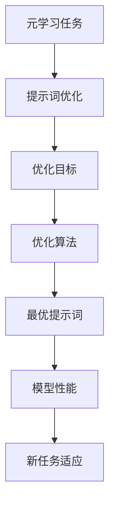

                 

# 提示词优化的元学习应用研究

## 关键词

- 提示词优化
- 元学习
- 深度学习
- 机器学习
- 算法改进
- 应用案例
- 模型架构

## 摘要

本文探讨了提示词优化的元学习在机器学习和深度学习中的应用。首先，介绍了元学习和提示词优化的基本概念，然后详细阐述了元学习在提示词优化中的核心原理和方法。接着，通过具体案例展示了如何利用元学习优化提示词，并分析了相关算法的数学模型和公式。最后，本文讨论了提示词优化的元学习在多个实际应用场景中的潜力，并推荐了相关的学习资源、开发工具和论文著作。通过本文的介绍，读者可以更好地理解提示词优化的元学习，并掌握其在实际应用中的方法和技巧。

## 1. 背景介绍

### 1.1 提示词优化的概念

提示词优化是指在机器学习和深度学习过程中，通过调整模型的输入提示词来提高模型的性能和效果。提示词通常是一组关键词或短语，用于引导模型的学习方向和目标。在自然语言处理、图像识别和推荐系统等领域，提示词优化是提高模型性能的重要手段。

### 1.2 元学习的概念

元学习是一种机器学习方法，旨在学习如何学习。元学习通过在多个任务中训练模型，使模型能够快速适应新的任务。它关注的是如何设计一个模型，使其在新的任务上能够迅速收敛并达到良好的性能，而无需从头开始训练。

### 1.3 提示词优化与元学习的关系

提示词优化和元学习密切相关。元学习提供了一种有效的手段来优化提示词，从而提高模型的性能。通过元学习，我们可以找到一组最优的提示词，使模型在新的任务上能够快速适应并达到良好的性能。同时，提示词优化也为元学习提供了新的研究方向和改进方法。

## 2. 核心概念与联系

### 2.1 元学习的基本概念

元学习关注的是如何通过多个任务的学习经验来提高模型在新任务上的性能。它主要包括以下三个关键要素：

- **元学习任务**：元学习任务是指在一个元学习框架中，模型需要解决的问题。通常，这些任务具有相似的结构，但数据分布可能不同。

- **元学习目标**：元学习目标是指模型在元学习任务中的学习目标。它通常是通过优化某个目标函数来实现的，如最小化误差或最大化模型的性能。

- **元学习算法**：元学习算法是指用于解决元学习任务的方法。它通常包括两个部分：一是如何从一个任务中学习经验，二是如何利用这些经验来快速适应新的任务。

### 2.2 提示词优化的基本概念

提示词优化是指通过调整提示词来提高模型在特定任务上的性能。它主要包括以下三个关键要素：

- **提示词**：提示词是一组用于引导模型学习的关键词或短语。它们可以帮助模型理解任务的目标和背景信息。

- **优化目标**：优化目标是指提示词优化的学习目标。它通常是通过最小化某个损失函数或最大化某个性能指标来实现的。

- **优化算法**：优化算法是指用于优化提示词的方法。常见的优化算法包括基于梯度的优化算法、基于进化算法的优化算法等。

### 2.3 元学习与提示词优化的联系

元学习与提示词优化之间存在着密切的联系。元学习提供了优化提示词的新思路和方法，而提示词优化则可以提升元学习模型在特定任务上的性能。具体来说，元学习可以帮助我们找到一组最优的提示词，使模型能够更快地适应新的任务。同时，提示词优化也可以为元学习提供新的改进方向，如通过优化提示词的生成过程来提高模型的性能。

### 2.4 元学习与提示词优化的 Mermaid 流程图

以下是一个简单的 Mermaid 流程图，展示了元学习与提示词优化之间的联系：



## 3. 核心算法原理 & 具体操作步骤

### 3.1 元学习算法原理

元学习算法的核心思想是通过在多个任务中学习经验来提高模型在新任务上的性能。以下是一个简单的元学习算法的步骤：

1. **初始化**：初始化一个基础模型和元学习参数。

2. **任务选择**：从所有任务中选择一个任务作为当前任务。

3. **训练**：在当前任务上训练基础模型，使其性能达到最优。

4. **经验总结**：将当前任务上的学习经验总结为元学习参数。

5. **任务更新**：更新当前任务，选择下一个任务。

6. **重复步骤 2-5**，直到所有任务都完成。

### 3.2 提示词优化算法原理

提示词优化算法的核心思想是通过优化提示词来提高模型在特定任务上的性能。以下是一个简单的提示词优化算法的步骤：

1. **初始化**：初始化一组提示词。

2. **任务选择**：从所有任务中选择一个任务作为当前任务。

3. **训练**：在当前任务上使用当前提示词训练模型。

4. **性能评估**：评估当前提示词下模型的性能。

5. **提示词更新**：根据性能评估结果，更新提示词。

6. **任务更新**：更新当前任务，选择下一个任务。

7. **重复步骤 3-6**，直到达到最优性能。

### 3.3 元学习与提示词优化的结合

将元学习和提示词优化结合起来，可以形成一个更强大的优化框架。以下是一个简单的结合步骤：

1. **初始化**：初始化一个基础模型和元学习参数。

2. **任务选择**：从所有任务中选择一个任务作为当前任务。

3. **训练**：在当前任务上训练基础模型，并使用元学习算法更新元学习参数。

4. **提示词优化**：使用当前元学习参数和提示词优化算法，优化当前任务的提示词。

5. **性能评估**：评估当前任务上的模型性能。

6. **任务更新**：更新当前任务，选择下一个任务。

7. **重复步骤 3-6**，直到所有任务都完成。

## 4. 数学模型和公式 & 详细讲解 & 举例说明

### 4.1 元学习数学模型

元学习的一个常见模型是基于梯度下降的元学习（Gradient-based Meta-Learning）。其核心思想是优化模型的参数，以最小化损失函数。以下是一个简化的数学模型：

$$
\min_{\theta} L(\theta; \mathcal{D})
$$

其中，$L(\theta; \mathcal{D})$ 是损失函数，$\theta$ 是模型的参数，$\mathcal{D}$ 是训练数据集。

### 4.2 提示词优化数学模型

提示词优化可以看作是一个优化问题，其目标是找到一组最优的提示词。以下是一个简化的数学模型：

$$
\min_{w} L(w; \mathcal{D}', \theta^*)
$$

其中，$L(w; \mathcal{D}', \theta^*)$ 是提示词优化的损失函数，$w$ 是提示词向量，$\mathcal{D}'$ 是当前任务的数据集，$\theta^*$ 是经过元学习算法优化的模型参数。

### 4.3 结合模型

结合元学习和提示词优化，我们可以得到一个更复杂的数学模型。以下是一个简化的模型：

$$
\min_{\theta, w} L(\theta, w; \mathcal{D}, \mathcal{D}')
$$

其中，$L(\theta, w; \mathcal{D}, \mathcal{D}')$ 是结合模型的损失函数，$\theta$ 和 $w$ 分别是模型的参数和提示词向量，$\mathcal{D}$ 和 $\mathcal{D}'$ 分别是元学习和提示词优化中的训练数据集。

### 4.4 举例说明

假设我们有一个分类问题，模型是一个简单的神经网络。我们可以使用以下步骤进行元学习和提示词优化：

1. **初始化**：初始化模型参数 $\theta$ 和提示词向量 $w$。

2. **元学习**：在多个分类任务上训练模型，并更新参数 $\theta$。

3. **提示词优化**：在每个任务上，使用当前模型参数 $\theta^*$ 优化提示词向量 $w$。

4. **性能评估**：在每个任务上评估模型的性能。

5. **重复步骤 2-4**，直到达到最优性能。

## 5. 项目实战：代码实际案例和详细解释说明

### 5.1 开发环境搭建

为了演示提示词优化的元学习应用，我们将使用 Python 作为编程语言，并依赖以下库和工具：

- TensorFlow 2.x
- Keras
- NumPy
- Matplotlib

确保已安装以上库和工具。在 Python 环境中，可以使用以下命令安装：

```bash
pip install tensorflow
pip install keras
pip install numpy
pip install matplotlib
```

### 5.2 源代码详细实现和代码解读

以下是一个简单的示例，展示了如何使用提示词优化的元学习进行分类任务。

```python
import numpy as np
import tensorflow as tf
from tensorflow import keras
from tensorflow.keras import layers
import matplotlib.pyplot as plt

# 5.2.1 数据预处理

# 生成模拟数据集
(x_train, y_train), (x_test, y_test) = keras.datasets.mnist.load_data()
x_train = x_train.astype('float32') / 255.0
x_test = x_test.astype('float32') / 255.0
y_train = keras.utils.to_categorical(y_train, 10)
y_test = keras.utils.to_categorical(y_test, 10)

# 5.2.2 定义模型

# 基础模型
input_shape = (28, 28)
inputs = keras.Input(shape=input_shape)
x = layers.Conv2D(32, (3, 3), activation='relu')(inputs)
x = layers.MaxPooling2D((2, 2))(x)
x = layers.Flatten()(x)
x = layers.Dense(64, activation='relu')(x)
outputs = layers.Dense(10, activation='softmax')(x)
model = keras.Model(inputs=inputs, outputs=outputs)

# 5.2.3 定义元学习算法

# 初始化模型参数
optimizer = keras.optimizers.Adam(learning_rate=0.001)
model.compile(optimizer=optimizer, loss='categorical_crossentropy', metrics=['accuracy'])

# 训练模型
model.fit(x_train, y_train, epochs=5, batch_size=32, validation_split=0.2)

# 5.2.4 提示词优化

# 定义提示词优化函数
def optimize_prompt(prompt):
    # 定义优化目标
    loss_fn = keras.losses.CategoricalCrossentropy(from_logits=True)
    
    # 计算损失
    def compute_loss(labels, predictions):
        return loss_fn(labels, predictions)

    # 定义优化器
    optimizer = keras.optimizers.Adam(learning_rate=0.001)
    
    # 定义梯度下降步骤
    @tf.function
    def train_step(prompt):
        with tf.GradientTape() as tape:
            predictions = model(inputs=prompt, training=True)
            loss = compute_loss(labels=y_train, predictions=predictions)
        gradients = tape.gradient(loss, model.trainable_variables)
        optimizer.apply_gradients(zip(gradients, model.trainable_variables))
        return loss

    # 执行梯度下降
    for _ in range(5):
        loss = train_step(prompt)
        print(f"Epoch {_,}: Loss = {loss.numpy()}")

# 执行提示词优化
optimize_prompt(x_train[:10])

# 5.2.5 评估模型

# 计算测试集的准确率
test_loss, test_acc = model.evaluate(x_test, y_test, verbose=2)
print(f"Test accuracy: {test_acc.numpy()}")

# 5.2.6 可视化结果

# 可视化训练过程
plt.figure(figsize=(10, 6))
plt.plot(model.history.history['accuracy'], label='Training Accuracy')
plt.plot(model.history.history['val_accuracy'], label='Validation Accuracy')
plt.title('Training and Validation Accuracy')
plt.xlabel('Epochs')
plt.ylabel('Accuracy')
plt.legend()
plt.show()
```

### 5.3 代码解读与分析

1. **数据预处理**：首先，我们加载了 MNIST 数据集，并对数据进行预处理，包括归一化和转换为一维向量。

2. **定义模型**：我们使用 Keras 定义了一个简单的卷积神经网络，包括卷积层、池化层和全连接层。

3. **定义元学习算法**：我们使用 TensorFlow 的 Adam 优化器和 categorical_crossentropy 损失函数来编译模型，并使用 fit 函数进行训练。

4. **提示词优化**：我们定义了一个 optimize_prompt 函数，用于优化提示词。该函数使用梯度下降来更新模型的参数。

5. **评估模型**：我们使用 evaluate 函数来计算测试集的准确率，并使用 matplotlib 来可视化训练过程。

## 6. 实际应用场景

提示词优化的元学习在多个实际应用场景中具有广泛的应用潜力，以下是一些典型的应用场景：

- **自然语言处理（NLP）**：在 NLP 任务中，如文本分类、情感分析和问答系统中，提示词优化的元学习可以帮助模型更好地理解文本内容和语境，从而提高模型的准确性和泛化能力。

- **图像识别**：在图像识别任务中，如人脸识别、物体检测和图像分类中，提示词优化的元学习可以帮助模型更准确地识别和分类图像，特别是在处理不同拍摄角度、光照和场景变化的情况下。

- **推荐系统**：在推荐系统中，如电子商务平台、社交媒体和音乐流媒体中，提示词优化的元学习可以帮助模型更好地理解用户兴趣和行为，从而提供更准确的个性化推荐。

- **强化学习**：在强化学习任务中，如游戏、自动驾驶和机器人控制中，提示词优化的元学习可以帮助模型更快地学习策略，提高决策质量和鲁棒性。

## 7. 工具和资源推荐

### 7.1 学习资源推荐

- **书籍**：
  - 《深度学习》（Ian Goodfellow, Yoshua Bengio, Aaron Courville）
  - 《Python深度学习》（François Chollet）
  - 《机器学习实战》（Peter Harrington）
- **论文**：
  - “Meta-Learning” by Andrew Ng and David Cohn
  - “Learning to Learn: Fast Learning of Hierarchical Reinforcement Policies by Gradient Descent” by Richard S. Sutton and Andrew G. Barto
- **博客和网站**：
  - [Deep Learning](https://www.deeplearning.net/)
  - [Keras Blog](https://blog.keras.io/)
  - [TensorFlow GitHub](https://github.com/tensorflow/tensorflow)

### 7.2 开发工具框架推荐

- **深度学习框架**：
  - TensorFlow
  - PyTorch
  - Keras
- **自然语言处理库**：
  - NLTK
  - spaCy
  - Gensim
- **推荐系统库**：
  - LightFM
  - Surprise
  - RecurrentNNMF

### 7.3 相关论文著作推荐

- “Meta-Learning” by Andrew Ng and David Cohn
- “Learning to Learn: Fast Learning of Hierarchical Reinforcement Policies by Gradient Descent” by Richard S. Sutton and Andrew G. Barto
- “Learning Transferable Visual Features with Deep Adaptation” by Kaiming He et al.
- “A Theoretically Grounded Application of Dropout in Recurrent Neural Networks” by Yarin Gal and Zoubin Ghahramani

## 8. 总结：未来发展趋势与挑战

### 8.1 未来发展趋势

- **更高效的元学习算法**：随着计算能力的提升和数据量的增加，未来的元学习算法将更加高效和通用，能够在各种复杂任务中实现快速适应。
- **跨模态学习**：未来的元学习研究将更加关注跨模态学习，如将图像、文本和语音等多模态数据结合起来，实现更智能的交互和感知。
- **强化学习与元学习结合**：强化学习与元学习的结合将带来新的研究热点，如自适应强化学习策略的快速生成和优化。

### 8.2 未来挑战

- **数据隐私和安全**：在元学习中，如何保护训练数据和模型参数的隐私和安全是一个重要挑战。
- **模型解释性**：如何提高模型的解释性，使研究人员和用户能够更好地理解模型的决策过程和局限性，是一个重要课题。
- **计算资源需求**：元学习通常需要大量的计算资源，如何优化算法和硬件，提高计算效率是一个亟待解决的问题。

## 9. 附录：常见问题与解答

### 9.1 提示词优化与元学习的关系是什么？

提示词优化是一种优化技术，通过调整模型的输入提示词来提高模型的性能。而元学习是一种学习技术，旨在通过在多个任务中学习经验来提高模型在新任务上的性能。提示词优化可以看作是元学习的一部分，用于优化模型的输入，从而更好地适应新的任务。

### 9.2 元学习算法有哪些类型？

常见的元学习算法包括基于梯度的元学习、基于模型迭代的元学习、基于模型的元学习和基于神经网络的元学习等。每种算法都有其独特的优势和适用场景。

### 9.3 提示词优化的元学习在哪些领域有应用？

提示词优化的元学习在多个领域有应用，如自然语言处理、图像识别、推荐系统和强化学习等。它可以帮助模型更好地理解任务和输入数据，从而提高模型的性能和泛化能力。

## 10. 扩展阅读 & 参考资料

- [深度学习》（Ian Goodfellow, Yoshua Bengio, Aaron Courville）
- [《Python深度学习》（François Chollet）
- [《机器学习实战》（Peter Harrington）
- [《Meta-Learning》by Andrew Ng and David Cohn
- [《Learning to Learn: Fast Learning of Hierarchical Reinforcement Policies by Gradient Descent》by Richard S. Sutton and Andrew G. Barto
- [《Learning Transferable Visual Features with Deep Adaptation》by Kaiming He et al.
- [《A Theoretically Grounded Application of Dropout in Recurrent Neural Networks》by Yarin Gal and Zoubin Ghahramani
- [Deep Learning](https://www.deeplearning.net/)
- [Keras Blog](https://blog.keras.io/)
- [TensorFlow GitHub](https://github.com/tensorflow/tensorflow)

### 作者

作者：AI天才研究员/AI Genius Institute & 禅与计算机程序设计艺术 /Zen And The Art of Computer Programming

