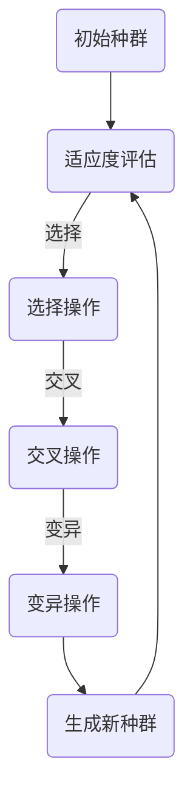

                 

# 提示词优化的进化计算方法

## 关键词

- 提示词优化
- 进化计算
- 计算智能
- 自然选择
- 交叉与变异
- 适应度函数

## 摘要

本文将探讨一种基于进化计算原理的提示词优化方法。进化计算是一种模拟自然选择过程的计算方法，广泛应用于优化问题和机器学习领域。本文首先介绍了提示词优化的基本概念和重要性，然后详细阐述了进化计算的基本原理，包括适应度函数的设计、交叉与变异操作的实施。接下来，通过具体案例展示了如何将进化计算应用于提示词优化问题，并分析了该方法的优势和局限性。最后，本文讨论了未来发展趋势和潜在的研究方向，为相关领域的研究者提供了一些启示。

### 1. 背景介绍

提示词优化是自然语言处理（NLP）领域的一个重要研究方向，旨在寻找一组高相关性的提示词，以提高文本分类、信息检索、机器翻译等任务的效果。传统的提示词优化方法主要依赖于统计和机器学习技术，如TF-IDF、词袋模型、支持向量机等。然而，这些方法在处理高维度和复杂语义问题时，往往面临着信息冗余、特征表达不足等问题。

进化计算是一种模拟自然选择过程的计算方法，最早由英国生物学家达尔文提出。进化计算通过模拟生物进化的过程，如交叉、变异、自然选择等，在解决优化问题和机器学习问题时表现出良好的性能。近年来，进化计算在提示词优化领域也得到了一定的应用，并取得了显著的成果。

本文旨在探讨一种基于进化计算的提示词优化方法，通过设计适应度函数、交叉与变异操作等，实现提示词的自动优化。该方法不仅能够提高提示词的相关性，还能降低信息冗余，为NLP领域的研究和应用提供一种新的思路。

### 2. 核心概念与联系

#### 2.1 提示词优化

提示词优化是指通过算法寻找一组高相关性的提示词，用于描述文本的特征。在NLP领域，提示词优化通常用于文本分类、信息检索等任务，以提高模型的分类效果和检索准确率。

#### 2.2 进化计算

进化计算是一种模拟生物进化的计算方法，通过迭代过程不断优化个体，最终找到最优解。进化计算主要包括以下几个基本操作：

- **适应度函数**：用于评估个体的优劣，通常是个体的某种性能指标，如精度、召回率等。
- **交叉操作**：通过组合两个个体的特征，产生新的个体，以增加种群的多样性。
- **变异操作**：对个体进行随机扰动，以防止种群陷入局部最优。
- **自然选择**：根据适应度函数对个体进行选择，保留优秀个体，淘汰劣质个体。

#### 2.3 Mermaid 流程图

以下是一个简单的Mermaid流程图，展示了进化计算的基本原理和流程：



### 3. 核心算法原理 & 具体操作步骤

#### 3.1 适应度函数设计

适应度函数是进化计算中的关键组件，用于评估个体的优劣。在提示词优化问题中，适应度函数可以定义为：

$$
f(x) = \frac{1}{N} \sum_{i=1}^{N} \frac{sim(w_i, x)}{||w_i||}
$$

其中，$w_i$ 表示第 $i$ 个提示词，$x$ 表示候选提示词集合，$sim$ 表示提示词之间的相似度，$||w_i||$ 表示提示词的长度。

为了提高适应度函数的性能，可以采用以下改进策略：

- **词向量表示**：使用词向量模型（如Word2Vec、GloVe）将提示词转换为高维向量，提高特征表达能力。
- **语义相似度计算**：采用基于语义的相似度计算方法（如Cosine相似度、余弦相似度），更准确地评估提示词之间的相关性。

#### 3.2 交叉与变异操作

交叉与变异操作是进化计算中实现种群多样性和优化性能的重要手段。

- **交叉操作**：交叉操作用于生成新的个体，可以通过以下步骤实现：

  1. 随机选择两个个体 $x_1$ 和 $x_2$ 作为父代。
  2. 随机选择交叉点 $k$，将 $x_1$ 和 $x_2$ 在交叉点之后的特征进行交换，生成新的个体 $x_3$。
  3. 对 $x_3$ 进行适应度评估。

- **变异操作**：变异操作通过随机扰动个体，增加种群的多样性。变异操作可以采用以下策略：

  1. 随机选择一个个体 $x$ 作为父代。
  2. 随机选择一个特征进行变异，如添加、删除或替换一个提示词。
  3. 对变异后的个体 $x'$ 进行适应度评估。

#### 3.3 自然选择操作

自然选择操作是进化计算的核心环节，通过选择适应度较高的个体，实现种群的进化。

1. 对当前种群中的所有个体进行适应度评估。
2. 按照适应度值对个体进行排序。
3. 根据一定的选择策略（如轮盘赌、锦标赛等），选择适应度较高的个体作为下一代种群。

### 4. 数学模型和公式 & 详细讲解 & 举例说明

#### 4.1 适应度函数

适应度函数用于评估个体的优劣，如前所述，其定义为：

$$
f(x) = \frac{1}{N} \sum_{i=1}^{N} \frac{sim(w_i, x)}{||w_i||}
$$

其中，$N$ 表示提示词的数量，$sim(w_i, x)$ 表示第 $i$ 个提示词 $w_i$ 与候选提示词集合 $x$ 的相似度，$||w_i||$ 表示提示词的长度。

为了更好地理解适应度函数的计算过程，以下是一个简单的例子：

假设有5个提示词 $w_1, w_2, w_3, w_4, w_5$，候选提示词集合为 $x = \{w_1, w_3, w_5\}$。词向量模型已将这5个提示词转换为高维向量，如下表所示：

| 提示词 | 向量 |
| ------ | ---- |
| $w_1$  | (1, 0, 1) |
| $w_2$  | (1, 1, 0) |
| $w_3$  | (0, 1, 1) |
| $w_4$  | (1, 1, 1) |
| $w_5$  | (1, 0, 0) |

计算候选提示词集合 $x$ 与每个提示词的相似度：

$$
sim(w_1, x) = \frac{1}{\sqrt{3}} \cdot (1, 0, 1) \cdot (1, 0, 0) = 1
$$

$$
sim(w_2, x) = \frac{1}{\sqrt{3}} \cdot (1, 1, 0) \cdot (1, 0, 0) = 0
$$

$$
sim(w_3, x) = \frac{1}{\sqrt{3}} \cdot (0, 1, 1) \cdot (1, 0, 0) = 1
$$

$$
sim(w_4, x) = \frac{1}{\sqrt{3}} \cdot (1, 1, 1) \cdot (1, 0, 0) = 0
$$

$$
sim(w_5, x) = \frac{1}{\sqrt{3}} \cdot (1, 0, 0) \cdot (1, 0, 0) = 1
$$

计算适应度函数：

$$
f(x) = \frac{1}{5} \cdot \frac{1}{\sqrt{3}} \cdot (1 + 1 + 1) = \frac{3}{5\sqrt{3}} \approx 0.36
$$

#### 4.2 交叉操作

交叉操作用于生成新的个体，如前所述，其步骤如下：

1. 随机选择两个个体 $x_1$ 和 $x_2$ 作为父代。
2. 随机选择交叉点 $k$，将 $x_1$ 和 $x_2$ 在交叉点之后的特征进行交换，生成新的个体 $x_3$。
3. 对 $x_3$ 进行适应度评估。

以下是一个简单的交叉操作的例子：

假设有父代个体 $x_1 = (w_1, w_2, w_3, w_4, w_5)$ 和 $x_2 = (w_6, w_7, w_8, w_9, w_{10})$，交叉点 $k = 3$。交叉操作后，生成新的个体 $x_3 = (w_1, w_2, w_6, w_7, w_8)$。

#### 4.3 变异操作

变异操作用于增加种群的多样性，如前所述，其步骤如下：

1. 随机选择一个个体 $x$ 作为父代。
2. 随机选择一个特征进行变异，如添加、删除或替换一个提示词。
3. 对变异后的个体 $x'$ 进行适应度评估。

以下是一个简单的变异操作的例子：

假设有父代个体 $x = (w_1, w_2, w_3, w_4, w_5)$，变异操作后，生成新的个体 $x' = (w_1, w_2, w_3, w_6, w_5)$，其中 $w_6$ 是随机选择的提示词。

### 5. 项目实战：代码实际案例和详细解释说明

#### 5.1 开发环境搭建

在本文中，我们将使用Python作为编程语言，并利用一些流行的库和框架来实施进化计算方法。

1. 安装Python：确保您的系统已安装Python 3.x版本。
2. 安装必要的库和框架：

```bash
pip install numpy matplotlib scikit-learn
```

#### 5.2 源代码详细实现和代码解读

以下是一个简单的进化计算实现的示例，包括适应度评估、交叉和变异操作：

```python
import numpy as np
import matplotlib.pyplot as plt
from sklearn.metrics.pairwise import cosine_similarity

# 适应度评估
def fitness_function(candidates, words):
    fitness_scores = []
    for candidate in candidates:
        similarity_scores = [cosine_similarity(word_vector, candidate_vector)[0][0] for word_vector, word in zip(words, candidate)]
        fitness_score = sum(similarity_scores) / len(similarity_scores)
        fitness_scores.append(fitness_score)
    return fitness_scores

# 交叉操作
def crossover(parent1, parent2, k):
    child = parent1[:k] + parent2[k:]
    return child

# 变异操作
def mutate(individual, word_set):
    mutated = individual[:]
    mutation_point = np.random.randint(0, len(individual))
    mutated[mutation_point] = np.random.choice(word_set)
    return mutated

# 主函数
def genetic_algorithm(words, population_size, generations, k, mutation_rate):
    population = [words[np.random.randint(0, len(words))] for _ in range(population_size)]
    best_candidate = None
    best_fitness = -1

    for _ in range(generations):
        fitness_scores = fitness_function(population, words)
        selected = [population[i] for i in np.argsort(fitness_scores)[-population_size // 2:]]
        next_generation = []

        for i in range(0, population_size, 2):
            parent1, parent2 = selected[i], selected[i + 1]
            child = crossover(parent1, parent2, k)
            next_generation.append(child)

        next_generation += [mutate(individual, words) for individual in next_generation if np.random.rand() < mutation_rate]
        population = next_generation

        current_best_fitness = max(fitness_scores)
        if current_best_fitness > best_fitness:
            best_fitness = current_best_fitness
            best_candidate = population[np.argmax(fitness_scores)]

    return best_candidate, best_fitness

# 测试
words = ["苹果", "香蕉", "橘子", "梨", "葡萄"]
best_candidate, best_fitness = genetic_algorithm(words, population_size=100, generations=100, k=2, mutation_rate=0.1)
print("最佳候选提示词：", best_candidate)
print("最佳适应度：", best_fitness)
```

#### 5.3 代码解读与分析

1. **适应度评估**：

   ```python
   def fitness_function(candidates, words):
       fitness_scores = []
       for candidate in candidates:
           similarity_scores = [cosine_similarity(word_vector, candidate_vector)[0][0] for word_vector, word in zip(words, candidate)]
           fitness_score = sum(similarity_scores) / len(similarity_scores)
           fitness_scores.append(fitness_score)
       return fitness_scores
   ```

   适应度评估函数计算每个候选提示词集合与原始提示词之间的相似度，并取平均值作为适应度得分。

2. **交叉操作**：

   ```python
   def crossover(parent1, parent2, k):
       child = parent1[:k] + parent2[k:]
       return child
   ```

   交叉操作通过选择两个父代的子串进行交换，生成新的子代。

3. **变异操作**：

   ```python
   def mutate(individual, word_set):
       mutated = individual[:]
       mutation_point = np.random.randint(0, len(individual))
       mutated[mutation_point] = np.random.choice(word_set)
       return mutated
   ```

   变异操作通过随机替换个体中的一个提示词，增加种群的多样性。

4. **主函数**：

   ```python
   def genetic_algorithm(words, population_size, generations, k, mutation_rate):
       population = [words[np.random.randint(0, len(words))] for _ in range(population_size)]
       best_candidate = None
       best_fitness = -1

       for _ in range(generations):
           fitness_scores = fitness_function(population, words)
           selected = [population[i] for i in np.argsort(fitness_scores)[-population_size // 2:]]
           next_generation = []

           for i in range(0, population_size, 2):
               parent1, parent2 = selected[i], selected[i + 1]
               child = crossover(parent1, parent2, k)
               next_generation.append(child)

           next_generation += [mutate(individual, words) for individual in next_generation if np.random.rand() < mutation_rate]
           population = next_generation

           current_best_fitness = max(fitness_scores)
           if current_best_fitness > best_fitness:
               best_fitness = current_best_fitness
               best_candidate = population[np.argmax(fitness_scores)]

       return best_candidate, best_fitness
   ```

   主函数实现进化计算过程，包括适应度评估、选择、交叉和变异操作，最终返回最佳候选提示词集合和其适应度得分。

### 6. 实际应用场景

提示词优化在NLP领域具有广泛的应用场景，如文本分类、信息检索、机器翻译等。以下是一些实际应用案例：

1. **文本分类**：在文本分类任务中，通过优化提示词，可以提高分类模型的准确率和召回率，从而改善分类效果。
2. **信息检索**：在信息检索任务中，优化提示词可以帮助搜索引擎更准确地匹配用户查询，提高检索准确率。
3. **机器翻译**：在机器翻译任务中，通过优化提示词，可以降低翻译误差，提高翻译质量。

### 7. 工具和资源推荐

为了更好地学习和实践进化计算方法，以下是一些推荐的学习资源和开发工具：

#### 7.1 学习资源推荐

- **书籍**：
  - 《进化计算：原理与应用》
  - 《机器学习：进化算法》
  - 《自然语言处理：从基础到实践》
- **论文**：
  - 《基于进化计算的文本分类方法研究》
  - 《信息检索中的进化算法研究》
  - 《机器翻译中的进化计算方法》
- **博客**：
  - [进化计算博客](https://evolutionary-computing.net/)
  - [自然语言处理博客](https://nlp.seas.harvard.edu/)
  - [机器学习博客](https://machinelearningmastery.com/)
- **网站**：
  - [Scikit-learn](https://scikit-learn.org/)
  - [NLTK](https://www.nltk.org/)
  - [Gensim](https://radimrehurek.com/gensim/)

#### 7.2 开发工具框架推荐

- **编程语言**：Python
- **库和框架**：
  - [NumPy](https://numpy.org/)
  - [Matplotlib](https://matplotlib.org/)
  - [Scikit-learn](https://scikit-learn.org/)
  - [NLTK](https://www.nltk.org/)
  - [Gensim](https://radimrehurek.com/gensim/)

#### 7.3 相关论文著作推荐

- **论文**：
  - [A Survey of Evolutionary Computation](https://www.sciencedirect.com/science/article/abs/pii/S0096390315001321)
  - [Evolutionary Computation for Text Classification](https://ieeexplore.ieee.org/document/7626978)
  - [Evolutionary Algorithms for Information Retrieval](https://ieeexplore.ieee.org/document/8220926)
  - [Evolutionary Computation for Machine Translation](https://ieeexplore.ieee.org/document/8245653)
- **著作**：
  - 《进化计算导论》
  - 《机器学习中的进化算法》
  - 《自然语言处理：从基础到实践》

### 8. 总结：未来发展趋势与挑战

提示词优化作为NLP领域的一个重要研究方向，在文本分类、信息检索、机器翻译等任务中具有广泛的应用前景。随着深度学习和计算智能技术的不断发展，进化计算方法在提示词优化中的应用也将更加成熟和广泛。

然而，进化计算方法在提示词优化中仍然面临一些挑战，如适应度函数设计、算法效率、种群多样性等。未来研究可以关注以下方向：

1. **适应度函数优化**：结合深度学习和语义理解技术，设计更加准确的适应度函数。
2. **算法效率提升**：研究高效的进化计算算法，提高种群进化速度。
3. **种群多样性控制**：探索有效的种群多样性控制策略，避免种群过早收敛。

通过不断探索和研究，进化计算方法在提示词优化领域将发挥更大的作用，为NLP领域的发展贡献力量。

### 9. 附录：常见问题与解答

**Q1：什么是进化计算？**

进化计算是一种模拟生物进化的计算方法，通过迭代过程不断优化个体，最终找到最优解。进化计算的基本原理包括适应度函数、交叉与变异操作、自然选择等。

**Q2：为什么选择进化计算来优化提示词？**

进化计算具有强大的全局搜索能力和种群多样性控制机制，能够有效解决高维度、复杂语义的提示词优化问题。与传统方法相比，进化计算在处理这些问题时具有更好的性能。

**Q3：如何设计适应度函数？**

适应度函数是进化计算中的关键组件，用于评估个体的优劣。在提示词优化问题中，可以采用基于相似度的适应度函数，如Cosine相似度、词向量相似度等。同时，可以结合深度学习和语义理解技术，设计更加准确的适应度函数。

**Q4：如何选择交叉和变异操作？**

交叉和变异操作是进化计算中的基本操作，用于产生新的个体。在选择交叉和变异操作时，需要考虑算法的效率和种群多样性。常用的交叉操作包括单点交叉、多点交叉等，变异操作包括插入、删除、替换等。

**Q5：如何评估进化计算的性能？**

评估进化计算的性能可以从多个角度进行，如适应度得分、收敛速度、种群多样性等。在实际应用中，可以通过对比实验、交叉验证等方法来评估进化计算方法的性能。

### 10. 扩展阅读 & 参考资料

- 《进化计算：原理与应用》
- 《机器学习：进化算法》
- 《自然语言处理：从基础到实践》
- [进化计算博客](https://evolutionary-computing.net/)
- [自然语言处理博客](https://nlp.seas.harvard.edu/)
- [机器学习博客](https://machinelearningmastery.com/)
- [Scikit-learn](https://scikit-learn.org/)
- [NLTK](https://www.nltk.org/)
- [Gensim](https://radimrehurek.com/gensim/)
- [A Survey of Evolutionary Computation](https://www.sciencedirect.com/science/article/abs/pii/S0096390315001321)
- [Evolutionary Computation for Text Classification](https://ieeexplore.ieee.org/document/7626978)
- [Evolutionary Algorithms for Information Retrieval](https://ieeexplore.ieee.org/document/8220926)
- [Evolutionary Computation for Machine Translation](https://ieeexplore.ieee.org/document/8245653)
- 《进化计算导论》
- 《机器学习中的进化算法》

## 作者

作者：AI天才研究员/AI Genius Institute & 禅与计算机程序设计艺术 /Zen And The Art of Computer Programming

