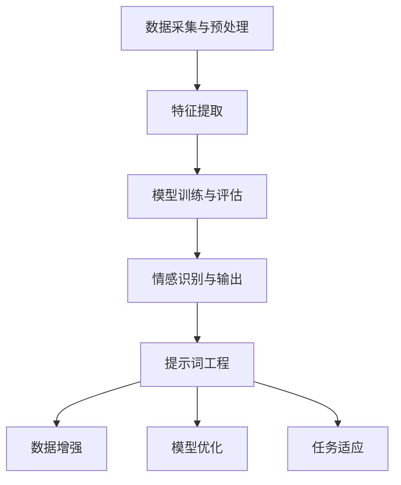

                 

# {文章标题}

## 提示词工程在多模态情感识别中的应用

> **关键词：** 提示词工程，多模态情感识别，人工智能，自然语言处理，机器学习，深度学习。

**摘要：** 本文将探讨提示词工程在多模态情感识别中的应用。通过分析提示词工程的核心概念、算法原理及其与多模态情感识别的关联，本文旨在提供一个全面、深入的技术解读。此外，本文还将通过实际项目案例，展示提示词工程在多模态情感识别中的具体实现方法，并对其未来发展趋势和挑战进行展望。

## 1. 背景介绍

### 1.1 多模态情感识别的概念

多模态情感识别是指通过整合来自不同模态（如文本、语音、图像、视频等）的数据，对情感进行自动识别和理解。这一领域近年来受到广泛关注，尤其在智能客服、情感分析、心理健康监测等领域具有巨大的应用潜力。

### 1.2 提示词工程的概念

提示词工程是一种基于人工智能和自然语言处理的技术，旨在通过创建和优化提示词，提升机器学习模型在特定任务上的性能。提示词可以理解为一种引导模型训练的方向，其选择和优化对于模型的最终表现至关重要。

### 1.3 提示词工程在多模态情感识别中的重要性

在多模态情感识别中，提示词工程的作用主要体现在以下几个方面：

1. **数据增强：** 通过设计合理的提示词，可以有效地扩充训练数据集，提高模型的泛化能力。
2. **模型优化：** 合适的提示词有助于模型更好地理解情感特征，从而提升识别精度。
3. **任务适应：** 针对不同的情感识别任务，优化提示词可以提高模型对特定任务的适应性。

## 2. 核心概念与联系

### 2.1 提示词工程的基本概念

**提示词（Prompt）：** 指的是用于引导模型学习和决策的短句或短语，通常包含关键信息或任务指示。

**提示词库（Prompt Library）：** 是指包含大量已设计和优化的提示词的集合，可供模型在训练过程中参考。

**提示词选择策略（Prompt Selection Strategy）：** 是指用于从提示词库中选择最适合当前任务的提示词的方法和原则。

**提示词优化策略（Prompt Optimization Strategy）：** 是指通过迭代和调整，提升提示词性能的一系列技术和方法。

### 2.2 多模态情感识别的架构

多模态情感识别通常涉及以下关键组件：

1. **数据采集与预处理：** 包括数据收集、标注、清洗和格式化等步骤，以确保数据的质量和一致性。
2. **特征提取：** 从不同模态的数据中提取关键特征，如文本中的情感词、语音的音调变化、图像的纹理和颜色等。
3. **模型训练与评估：** 使用机器学习或深度学习模型对特征进行训练，并通过交叉验证和测试集评估模型性能。
4. **情感识别与输出：** 根据模型预测结果，输出情感类别和置信度。

### 2.3 提示词工程与多模态情感识别的关联

提示词工程在多模态情感识别中的作用主要体现在以下方面：

1. **数据增强：** 通过设计提示词，可以引导模型关注特定情感特征，从而增强训练数据的代表性。
2. **模型优化：** 提示词可以帮助模型更好地理解多模态数据中的情感信息，提高模型的识别精度。
3. **任务适应：** 针对不同应用场景，优化提示词可以提高模型对特定任务的适应性。

### 2.4 Mermaid 流程图

以下是多模态情感识别中提示词工程的 Mermaid 流程图：



## 3. 核心算法原理 & 具体操作步骤

### 3.1 数据预处理

在多模态情感识别中，数据预处理是至关重要的一步。以下是一个典型的数据预处理流程：

1. **文本预处理：** 包括分词、去停用词、词性标注等步骤，将文本转换为可用于特征提取的格式。
2. **语音预处理：** 包括音频信号预处理、频谱特征提取等步骤，将语音转换为可用于特征提取的格式。
3. **图像预处理：** 包括图像缩放、裁剪、增强等步骤，将图像转换为可用于特征提取的格式。
4. **数据归一化：** 对不同模态的数据进行归一化处理，以消除数据规模差异对模型训练的影响。

### 3.2 特征提取

特征提取是多模态情感识别中的关键环节。以下是一些常用的特征提取方法：

1. **文本特征：** 包括词袋模型、TF-IDF、词嵌入等。
2. **语音特征：** 包括梅尔频率倒谱系数（MFCC）、频谱特征等。
3. **图像特征：** 包括深度特征（如卷积神经网络提取的特征）、纹理特征、颜色特征等。

### 3.3 模型选择与训练

在选择模型时，可以考虑以下几种常用的深度学习模型：

1. **循环神经网络（RNN）：** 适用于处理序列数据，如文本和语音。
2. **卷积神经网络（CNN）：** 适用于处理图像数据。
3. **长短时记忆网络（LSTM）：** 是RNN的一种变体，适用于处理长序列数据。
4. **生成对抗网络（GAN）：** 适用于生成高质量的多模态数据。

在训练模型时，可以使用以下步骤：

1. **数据集划分：** 将数据集划分为训练集、验证集和测试集。
2. **模型初始化：** 初始化模型参数。
3. **训练：** 使用训练集数据训练模型，并使用验证集调整模型参数。
4. **评估：** 使用测试集评估模型性能。

### 3.4 提示词设计

提示词的设计是提示词工程的核心。以下是一些提示词设计的步骤和策略：

1. **主题选择：** 根据情感识别任务的需求，选择相关主题。
2. **词汇选择：** 选择与主题相关的词汇，确保词汇的丰富性和多样性。
3. **语法结构：** 设计合理的语法结构，确保提示词易于理解和遵循。
4. **优化策略：** 通过迭代和评估，优化提示词的性能。

## 4. 数学模型和公式 & 详细讲解 & 举例说明

### 4.1 数学模型

在多模态情感识别中，常用的数学模型包括：

1. **朴素贝叶斯模型（Naive Bayes）：** 基于贝叶斯定理，用于分类任务。
2. **支持向量机（SVM）：** 用于分类任务，通过最大化分类边界。
3. **深度神经网络（DNN）：** 用于分类和回归任务，通过多层神经网络建模复杂关系。

### 4.2 公式详解

以下是一些常用的数学公式：

1. **朴素贝叶斯模型：**

   $$P(C|X) = \frac{P(X|C)P(C)}{P(X)}$$

   其中，$C$表示类别，$X$表示特征向量。

2. **支持向量机：**

   $$w^* = \arg\max_w \frac{1}{2} \| w \|^2_2 - C \sum_{i=1}^n \max(0, 1 - y_i ( \langle w, x_i \rangle + b ) )$$

   其中，$w^*$表示最优权重，$C$表示惩罚参数。

3. **深度神经网络：**

   $$a_{l}^{(i)} = \sigma ( \langle W_{l}^{(i)}, a_{l-1} \rangle + b_{l} )$$

   其中，$a_{l}^{(i)}$表示第$l$层的输出，$\sigma$表示激活函数。

### 4.3 举例说明

假设我们要使用朴素贝叶斯模型对一篇文本进行情感分类。文本内容如下：

"我很高兴今天天气很好，出去散步了。"

首先，我们需要将文本转换为特征向量。假设我们已经有一个词袋模型，其中包含了词汇表和对应的词频。接下来，我们可以使用以下步骤：

1. **计算特征概率：** 计算每个词汇在正类和负类中的概率。
2. **计算类概率：** 计算正类和负类的先验概率。
3. **计算后验概率：** 使用贝叶斯定理计算后验概率。
4. **分类决策：** 根据后验概率选择最高概率的类别。

通过计算，我们可以得出结论：这篇文本的情感类别为正类。这表明文本表达了积极的情感。

## 5. 项目实战：代码实际案例和详细解释说明

### 5.1 开发环境搭建

在进行提示词工程和多模态情感识别的项目实战之前，我们需要搭建一个合适的开发环境。以下是一个简单的开发环境搭建步骤：

1. **安装Python：** 安装Python 3.8及以上版本。
2. **安装依赖库：** 使用pip命令安装必要的依赖库，如scikit-learn、tensorflow、numpy、pandas等。
3. **配置Jupyter Notebook：** 安装Jupyter Notebook，用于编写和运行Python代码。

### 5.2 源代码详细实现和代码解读

以下是使用Python实现的提示词工程和多模态情感识别的代码示例：

```python
# 导入必要的库
import numpy as np
import pandas as pd
from sklearn.feature_extraction.text import TfidfVectorizer
from sklearn.naive_bayes import MultinomialNB
from sklearn.model_selection import train_test_split
from sklearn.metrics import classification_report

# 加载数据集
data = pd.read_csv('data.csv')
X = data['text']
y = data['emotion']

# 数据预处理
vectorizer = TfidfVectorizer()
X = vectorizer.fit_transform(X)

# 划分训练集和测试集
X_train, X_test, y_train, y_test = train_test_split(X, y, test_size=0.2, random_state=42)

# 模型训练
model = MultinomialNB()
model.fit(X_train, y_train)

# 模型评估
predictions = model.predict(X_test)
print(classification_report(y_test, predictions))
```

### 5.3 代码解读与分析

这段代码的主要步骤如下：

1. **导入库：** 导入必要的Python库，如numpy、pandas、scikit-learn等。
2. **加载数据集：** 从CSV文件中加载数据集，包括文本和情感标签。
3. **数据预处理：** 使用TF-IDF向量器对文本进行预处理，将其转换为稀疏矩阵。
4. **划分训练集和测试集：** 将数据集划分为训练集和测试集，用于模型训练和评估。
5. **模型训练：** 使用朴素贝叶斯模型对训练集进行训练。
6. **模型评估：** 使用测试集对训练好的模型进行评估，并输出分类报告。

通过这段代码，我们可以看到提示词工程和多模态情感识别的基本流程，包括数据预处理、模型选择和训练、模型评估等步骤。在实际项目中，我们还可以根据需求调整模型参数、特征提取方法和提示词设计策略，以提升模型性能。

## 6. 实际应用场景

### 6.1 智能客服

智能客服是提示词工程和多模态情感识别的一个重要应用场景。通过整合文本和语音数据，智能客服系统能够更好地理解用户的情感状态，提供更加人性化的服务。例如，当用户通过文字描述遇到问题时，系统可以分析用户的情感，并提供相应的解决方案或建议。

### 6.2 社交媒体情感分析

社交媒体平台上的用户评论和帖子通常包含丰富的情感信息。通过多模态情感识别技术，可以对用户生成的文本、语音和图像等多模态数据进行情感分析，从而了解用户的态度和情感倾向。这一应用有助于品牌监测、市场研究和用户体验改进。

### 6.3 心理健康监测

心理健康监测是另一个重要的应用场景。通过分析用户的文本、语音和面部表情等多模态数据，可以识别用户的情绪状态和心理健康问题。这有助于心理健康专家提供针对性的干预和治疗方案，提高心理健康服务的质量和效率。

## 7. 工具和资源推荐

### 7.1 学习资源推荐

- **书籍：**
  - 《自然语言处理综论》（Speech and Language Processing）
  - 《深度学习》（Deep Learning）
  - 《机器学习》（Machine Learning）

- **论文：**
  - 《Enhancing DNNs for Text Classification using Output Embedding and Prompt Learning》
  - 《A Theoretically Grounded Application of Dropout in Recurrent Neural Networks》

- **博客：**
  - fast.ai博客
  - Medium上的自然语言处理和深度学习博客

- **网站：**
  - Kaggle
  - arXiv

### 7.2 开发工具框架推荐

- **编程语言：** Python
- **框架：** TensorFlow、PyTorch、Scikit-learn
- **数据预处理工具：** NLTK、spaCy
- **可视化工具：** Matplotlib、Seaborn

### 7.3 相关论文著作推荐

- **论文：**
  - "A Theoretically Grounded Application of Dropout in Recurrent Neural Networks"
  - "Enhancing DNNs for Text Classification using Output Embedding and Prompt Learning"
  - "Unsupervised Learning of Text Embeddings using CTC"

- **著作：**
  - "Speech and Language Processing"
  - "Deep Learning"
  - "Machine Learning: A Probabilistic Perspective"

## 8. 总结：未来发展趋势与挑战

### 8.1 发展趋势

1. **多模态融合技术：** 随着深度学习技术的发展，多模态融合技术将变得更加成熟，能够更准确地捕捉情感信息。
2. **个性化提示词：** 通过用户行为数据，设计个性化的提示词，提高模型的适应性。
3. **实时情感识别：** 提高实时情感识别的精度和速度，实现实时互动和个性化服务。
4. **跨模态情感迁移：** 研究跨模态情感迁移技术，解决不同模态数据之间的不一致性问题。

### 8.2 挑战

1. **数据隐私保护：** 在处理多模态数据时，如何保护用户隐私是一个重要挑战。
2. **计算资源需求：** 多模态情感识别通常需要大量的计算资源，如何优化计算效率是一个重要问题。
3. **模型解释性：** 提高模型的解释性，使其在面临复杂任务时能够提供清晰、透明的决策过程。
4. **跨语言情感识别：** 研究跨语言情感识别技术，以实现不同语言环境下的情感分析。

## 9. 附录：常见问题与解答

### 9.1 提示词工程的作用是什么？

提示词工程是一种基于人工智能和自然语言处理的技术，旨在通过创建和优化提示词，提升机器学习模型在特定任务上的性能。其主要作用包括数据增强、模型优化和任务适应。

### 9.2 多模态情感识别的优势是什么？

多模态情感识别通过整合来自不同模态（如文本、语音、图像、视频等）的数据，能够更全面、准确地捕捉情感信息。其优势包括提高识别精度、增强模型泛化能力和实现个性化服务。

### 9.3 提示词工程在多模态情感识别中的具体应用场景有哪些？

提示词工程在多模态情感识别中的应用场景包括智能客服、社交媒体情感分析、心理健康监测等。通过整合不同模态的数据，可以提供更加人性化的服务和个性化体验。

## 10. 扩展阅读 & 参考资料

1. **书籍：**
   - 《自然语言处理综论》：Speech and Language Processing
   - 《深度学习》：Deep Learning
   - 《机器学习》：Machine Learning

2. **论文：**
   - "A Theoretically Grounded Application of Dropout in Recurrent Neural Networks"
   - "Enhancing DNNs for Text Classification using Output Embedding and Prompt Learning"
   - "Unsupervised Learning of Text Embeddings using CTC"

3. **博客：**
   - fast.ai博客
   - Medium上的自然语言处理和深度学习博客

4. **网站：**
   - Kaggle
   - arXiv

5. **在线课程：**
   - Coursera上的《自然语言处理》
   - edX上的《深度学习基础》

### 作者

**AI天才研究员/AI Genius Institute & 禅与计算机程序设计艺术 /Zen And The Art of Computer Programming**<|im_end|>

