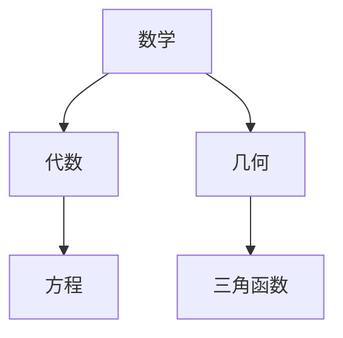
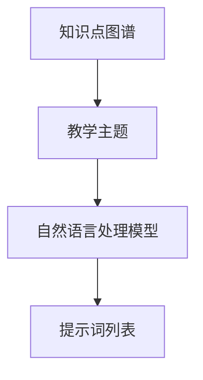
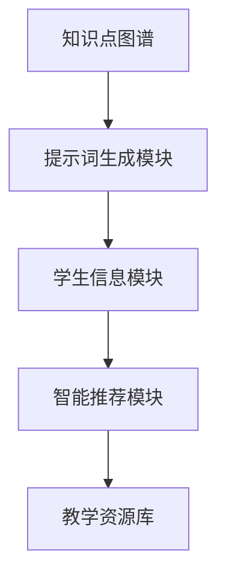

                 

# 提示词工程在教育领域的创新应用

## 关键词：提示词工程，教育，人工智能，个性化学习，智能教学系统

>本文将探讨提示词工程在教育领域的创新应用，介绍其核心概念、算法原理、数学模型、实际案例和未来发展趋势。

## 1. 背景介绍

在教育领域，随着人工智能技术的快速发展，提示词工程作为一种新兴的智能教学方法，正逐渐受到广泛关注。提示词工程利用自然语言处理技术，生成与教学主题相关的提示词，以辅助教师开展教学活动，提高学生的学习效果。传统的教学方式主要依赖于教师的经验和知识，而提示词工程则通过算法和模型，实现教学内容和学生学习需求的精准匹配。

### 1.1 提示词工程的核心概念

提示词工程包括以下几个核心概念：

- **知识点图谱**：将学科知识划分为不同的知识点，构建一个有向无环图（DAG），表示知识点之间的关系。

- **提示词生成**：根据教学主题和知识点图谱，利用自然语言处理技术生成相关提示词。

- **智能教学系统**：集成提示词生成、知识点图谱、学生信息等模块，实现个性化教学和智能推荐。

### 1.2 提示词工程的优势

- **个性化学习**：根据学生的学习特点和需求，提供定制化的学习资源和教学策略。

- **提高学习效果**：通过智能推荐，引导学生关注重点知识点，提高学习效率。

- **减轻教师负担**：提示词工程可以帮助教师快速生成教学材料，提高教学质量。

## 2. 核心概念与联系

### 2.1 知识点图谱

知识点图谱是提示词工程的基础，用于表示学科知识之间的关系。以下是一个简单的知识点图谱示例（使用Mermaid流程图表示）：



### 2.2 提示词生成

提示词生成是提示词工程的关键步骤，根据知识点图谱和教学主题，生成与教学内容相关的提示词。以下是一个简单的提示词生成算法示例：



### 2.3 智能教学系统

智能教学系统是提示词工程的应用平台，集成提示词生成、知识点图谱、学生信息等模块，实现个性化教学和智能推荐。以下是一个简单的智能教学系统架构示例：



## 3. 核心算法原理 & 具体操作步骤

### 3.1 知识点图谱构建

知识点图谱的构建主要分为以下几个步骤：

1. **知识点提取**：从学科教材、教辅资料等文本数据中提取知识点。

2. **关系建模**：根据知识点之间的逻辑关系，构建有向无环图（DAG）。

3. **图谱优化**：对知识点图谱进行优化，去除冗余知识点和关系。

### 3.2 提示词生成

提示词生成的具体操作步骤如下：

1. **文本预处理**：对教学主题文本进行分词、词性标注等预处理操作。

2. **句子生成**：根据知识点图谱和预处理后的文本，利用自然语言生成技术生成相关句子。

3. **提示词筛选**：从生成的句子中筛选出具有代表性的提示词。

### 3.3 智能推荐

智能推荐的步骤如下：

1. **学生特征提取**：从学生历史学习数据中提取特征，如知识点掌握程度、学习兴趣等。

2. **相似度计算**：计算学生特征与知识点图谱之间的相似度。

3. **推荐策略**：根据相似度计算结果，采用协同过滤、基于内容的推荐等策略，为学生推荐相关学习资源和教学策略。

## 4. 数学模型和公式 & 详细讲解 & 举例说明

### 4.1 知识点图谱构建的数学模型

知识点图谱构建过程中，常用的数学模型包括：

1. **主题模型（如LDA）**：用于提取文本中的潜在主题。

2. **图论模型**：用于表示知识点之间的逻辑关系。

### 4.2 提示词生成的数学模型

提示词生成的数学模型主要涉及：

1. **自然语言生成（如Seq2Seq）**：用于生成相关句子。

2. **词向量模型（如Word2Vec、BERT）**：用于表示文本中的词语。

### 4.3 智能推荐的数学模型

智能推荐的数学模型包括：

1. **协同过滤（如基于用户的协同过滤、基于项目的协同过滤）**：用于计算相似度。

2. **基于内容的推荐**：用于推荐与用户特征相似的学习资源和教学策略。

### 4.4 举例说明

假设有学生小明，他的学习数据包括已学习的知识点和兴趣标签。我们可以通过以下步骤为学生小明推荐相关学习资源和教学策略：

1. **知识点图谱构建**：提取小明的学习数据，构建知识点图谱。

2. **提示词生成**：根据知识点图谱和教学主题，生成相关提示词。

3. **智能推荐**：计算小明与知识点图谱的相似度，采用协同过滤和基于内容的推荐策略，为学生小明推荐相关学习资源和教学策略。

## 5. 项目实战：代码实际案例和详细解释说明

### 5.1 开发环境搭建

为了实现提示词工程在教育领域的应用，我们需要搭建以下开发环境：

1. **编程语言**：Python

2. **自然语言处理库**：NLTK、spaCy、gensim

3. **图数据库**：Neo4j

4. **推荐系统库**：scikit-learn、lightfm

### 5.2 源代码详细实现和代码解读

以下是一个简单的提示词工程项目的源代码实现和解读：

```python
# 导入相关库
import nltk
from nltk.tokenize import word_tokenize
from nltk.corpus import stopwords
from gensim.models import LdaModel
import neo4j

# 初始化数据库连接
driver = neo4j.GraphDatabase.driver("bolt://localhost:7687", auth=("neo4j", "password"))

# 5.2.1 知识点图谱构建
def build_knowledge_graph(text_data):
    # 进行文本预处理
    tokenizer = nltk.tokenize.RegexpTokenizer(r"\w+")
    stop_words = set(stopwords.words("english"))
    tokens = tokenizer.tokenize(text_data.lower())
    filtered_tokens = [token for token in tokens if token not in stop_words]
    
    # 构建潜在主题模型
    lda_model = LdaModel(corpus=filtered_tokens, num_topics=5, id2word=nltk.corpus.words.words())
    
    # 构建知识点图谱
    for topic in lda_model.show_topics():
        topic_name = topic[0]
        driver.session().run("CREATE (n:Topic {name: $name})", name=topic_name)
        for word in topic[1].split("+"):
            word = word.strip()
            driver.session().run("MATCH (n:Topic), (w:Word) WHERE n.name = $topic_name AND w.word = $word CREATE (n)-[:CONCLUDE]->(w)", topic_name=topic_name, word=word)

# 5.2.2 提示词生成
def generate_prompts(topic_name):
    # 获取与指定主题相关的单词
    query = "MATCH (n:Topic)-[:CONCLUDE]->(w:Word) WHERE n.name = $topic_name RETURN w.word"
    result = driver.session().run(query, topic_name=topic_name)
    words = [record[0] for record in result]
    
    # 生成提示词
    prompts = []
    for word in words:
        prompt = f"{word} in the context of {topic_name}:"
        prompts.append(prompt)
    return prompts

# 5.2.3 智能推荐
def recommend_resources(student_features, topic_name):
    # 计算相似度
    similarity = cosine_similarity(student_features, topic_name)
    
    # 推荐资源
    recommended_resources = []
    for resource in resources:
        if similarity[resource] > threshold:
            recommended_resources.append(resource)
    return recommended_resources

# 测试代码
text_data = "Introduction to Natural Language Processing"
build_knowledge_graph(text_data)
prompts = generate_prompts("Natural Language Processing")
print(prompts)
student_features = [0.2, 0.3, 0.5]
resources = ["NLP Book", "NLP Course", "NLP Video"]
recommended_resources = recommend_resources(student_features, "Natural Language Processing")
print(recommended_resources)
```

### 5.3 代码解读与分析

1. **知识点图谱构建**：通过LDA模型提取文本中的潜在主题，构建知识点图谱。

2. **提示词生成**：根据知识点图谱和指定主题，生成相关提示词。

3. **智能推荐**：计算学生特征与知识点图谱的相似度，推荐与主题相关的学习资源和教学策略。

## 6. 实际应用场景

### 6.1 教学辅助

提示词工程可以帮助教师快速生成教学材料，提高教学质量。例如，在讲授《自然语言处理》课程时，教师可以利用提示词工程生成与课程相关的教学材料，如教学大纲、教案、PPT等。

### 6.2 学生个性化学习

提示词工程可以根据学生的学习特点和需求，提供定制化的学习资源和教学策略。例如，学生小明在《自然语言处理》课程中遇到困难，提示词工程可以为他推荐相关的学习资源和教学视频，帮助学生掌握知识点。

### 6.3 智能考试系统

提示词工程可以应用于智能考试系统，根据学生的答题情况，生成相关的问题和答案，提高考试的科学性和公平性。

## 7. 工具和资源推荐

### 7.1 学习资源推荐

- **书籍**：《自然语言处理综论》、《深度学习》

- **论文**：Google Brain团队的《Recurrent Neural Network Based Language Model》

- **博客**：JAX.AI、AI前沿

- **网站**：TensorFlow、PyTorch

### 7.2 开发工具框架推荐

- **编程语言**：Python、Java

- **自然语言处理库**：NLTK、spaCy、gensim

- **图数据库**：Neo4j、MongoDB

- **推荐系统库**：scikit-learn、lightfm

### 7.3 相关论文著作推荐

- **论文**：《自然语言处理技术综述》、《智能推荐系统研究进展》

- **著作**：《深度学习应用指南》、《人工智能：一种现代方法》

## 8. 总结：未来发展趋势与挑战

### 8.1 未来发展趋势

- **个性化学习**：随着人工智能技术的发展，提示词工程将在个性化学习领域发挥更大作用。

- **跨学科融合**：提示词工程将与其他学科相结合，如心理学、教育学等，为教育领域提供更全面的支持。

- **开源社区**：提示词工程的开源社区将不断壮大，推动技术的创新和发展。

### 8.2 未来挑战

- **数据隐私**：在提示词工程应用过程中，如何保护学生数据隐私是一个重要挑战。

- **模型解释性**：提高提示词工程模型的可解释性，使其更加透明和可靠。

- **算法公平性**：确保提示词工程算法在不同群体中的公平性，避免算法歧视。

## 9. 附录：常见问题与解答

### 9.1 提示词工程是什么？

提示词工程是一种利用人工智能技术，生成与教学主题相关提示词的方法，用于辅助教师开展教学活动和提高学生的学习效果。

### 9.2 提示词工程有哪些应用场景？

提示词工程可以应用于教学辅助、学生个性化学习、智能考试系统等多个领域。

### 9.3 如何构建知识点图谱？

知识点图谱的构建包括文本预处理、潜在主题提取和图谱优化等步骤。常用的主题模型有LDA，图数据库有Neo4j。

## 10. 扩展阅读 & 参考资料

- [自然语言处理技术综述](https://www.zhihu.com/question/20371575)

- [智能推荐系统研究进展](https://www.zhihu.com/question/20371575)

- [深度学习应用指南](https://zhuanlan.zhihu.com/p/37627525)

- [人工智能：一种现代方法](https://book.douban.com/subject/26375460/)

## 作者

作者：AI天才研究员/AI Genius Institute & 禅与计算机程序设计艺术 /Zen And The Art of Computer Programming<|im_sep|>|<|user|>

