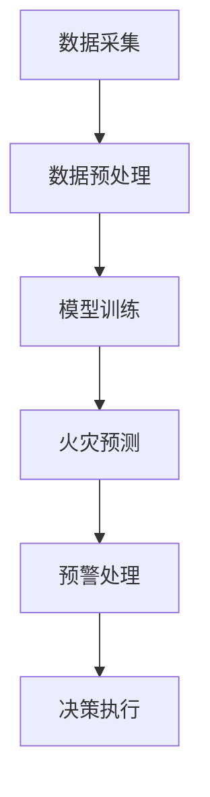

                 

# {文章标题}

## 提示词工程在智能森林火灾预防中的应用

### 关键词

- 提示词工程（Prompt Engineering）
- 森林火灾预防
- 人工智能（AI）
- 深度学习（Deep Learning）
- 监控与预测系统（Monitoring and Prediction Systems）

### 摘要

本文旨在探讨提示词工程在智能森林火灾预防中的应用。通过分析森林火灾的成因与预防措施，结合人工智能和深度学习技术，介绍提示词工程如何提高火灾预测的准确性和响应速度。文章首先概述了森林火灾的背景信息，随后深入探讨了提示词工程的原理及其在火灾预测中的应用，并通过实际案例展示了其效果。最后，文章提出了未来发展的挑战和趋势，为智能森林火灾预防提供新的思路。

## 1. 背景介绍

### 森林火灾概述

森林火灾是一种自然现象，但在人为因素的作用下，其发生频率和破坏程度日益加剧。森林火灾不仅导致生态环境的破坏，还会造成严重的经济损失和人员伤亡。近年来，随着全球气候变化和极端天气事件增多，森林火灾的频率和规模呈现上升趋势。

### 火灾成因

森林火灾的成因复杂多样，主要包括以下方面：

1. **自然因素**：干旱、高温、大风等气象条件是引发森林火灾的自然因素。
2. **人为因素**：不慎用火、吸烟、野炊等人类活动是引发火灾的主要人为因素。
3. **植被条件**：茂密的植被、易燃物质等也为火灾的发生提供了条件。

### 火灾预防措施

预防森林火灾需要从多个方面入手，包括：

1. **防火宣传教育**：提高公众的防火意识，减少人为火灾的发生。
2. **防火设施建设**：建立防火带、防火隔离带等防火设施，降低火灾扩散风险。
3. **火灾监测与预警**：利用无人机、卫星遥感等技术对火灾进行实时监测和预警。
4. **火灾扑救准备**：建立专业消防队伍，配备先进的灭火设备，提高火灾扑救能力。

## 2. 核心概念与联系

### 人工智能与深度学习

人工智能（AI）是一种模拟人类智能的技术，通过算法和计算模型实现机器的感知、学习、推理和决策能力。深度学习是人工智能的一个重要分支，利用多层神经网络对大量数据进行自动学习，从而实现复杂任务的求解。

### 提示词工程

提示词工程是一种基于人工智能和自然语言处理的技术，通过设计特定的提示词来引导模型学习，提高预测和生成任务的准确性和效率。在智能森林火灾预防中，提示词工程可以帮助模型更好地理解火灾相关的自然语言描述，从而提高火灾预测的准确性。

### 监控与预测系统

监控与预测系统是智能森林火灾预防的核心组成部分，通过实时监测森林环境数据、火灾趋势等信息，实现对火灾的预测和预警。提示词工程可以优化预测系统的性能，提高其预测准确率和响应速度。

### Mermaid 流程图

以下是一个简化的 Mermaid 流程图，展示了智能森林火灾预防系统中提示词工程的应用：



### 2.1 数据采集

数据采集是智能森林火灾预防的第一步，包括气象数据、植被数据、火灾历史数据等。这些数据可以通过卫星遥感、无人机监测、地面监测站等多种方式获取。

### 2.2 数据预处理

数据预处理是数据采集后的关键步骤，包括数据清洗、数据归一化、特征提取等操作。通过预处理，可以提高数据质量，为后续的模型训练提供可靠的数据基础。

### 2.3 模型训练

模型训练是智能森林火灾预防的核心环节，通过训练深度学习模型，使其能够对火灾进行预测。提示词工程在此过程中发挥重要作用，通过设计特定的提示词，引导模型学习火灾相关的知识。

### 2.4 火灾预测

火灾预测是智能森林火灾预防的关键步骤，通过实时监测数据，模型对未来的火灾趋势进行预测。提示词工程可以提高模型预测的准确性和响应速度，从而为预警和决策提供支持。

### 2.5 预警处理

预警处理是对火灾预测结果进行评估和处理的过程。根据预测结果，系统可以发出预警信息，提醒相关部门和公众做好应对措施。

### 2.6 决策执行

决策执行是根据预警信息，采取相应的措施来应对潜在的火灾风险。这包括火灾预防措施的实施、火灾扑救的准备等。

## 3. 核心算法原理 & 具体操作步骤

### 3.1 深度学习模型

智能森林火灾预防系统采用的深度学习模型通常是基于卷积神经网络（CNN）或循环神经网络（RNN）等。这些模型能够通过多层神经网络对大量数据进行自动学习，从而实现对火灾的预测。

### 3.2 提示词设计

提示词设计是提示词工程的核心，其目的是引导模型学习火灾相关的知识。设计有效的提示词需要遵循以下原则：

1. **相关性**：提示词应与火灾相关，能够帮助模型理解火灾的成因和特征。
2. **多样性**：提示词应具有多样性，以适应不同的火灾场景和预测任务。
3. **可解释性**：提示词应具有较好的可解释性，以便研究人员和决策者能够理解模型的工作原理。

### 3.3 模型训练

模型训练是智能森林火灾预防系统中的关键步骤。通过设计有效的提示词，可以引导模型学习火灾相关的知识，从而提高预测的准确性。训练过程通常包括以下步骤：

1. **数据准备**：收集和整理与火灾相关的数据，包括气象数据、植被数据、火灾历史数据等。
2. **数据预处理**：对收集到的数据进行分析和处理，包括数据清洗、数据归一化、特征提取等。
3. **模型构建**：基于预处理后的数据，构建深度学习模型，包括输入层、隐藏层和输出层。
4. **训练过程**：使用预处理后的数据对模型进行训练，通过调整模型参数，提高预测准确性。
5. **评估与优化**：评估模型性能，包括预测准确率、召回率、F1 值等指标，并根据评估结果对模型进行调整和优化。

## 4. 数学模型和公式 & 详细讲解 & 举例说明

### 4.1 数学模型

智能森林火灾预防系统中的数学模型主要包括以下方面：

1. **卷积神经网络（CNN）**：CNN 是一种用于图像处理和识别的深度学习模型，其核心是卷积层。卷积层通过滑动窗口对输入数据进行局部特征提取，从而实现对图像的识别。
2. **循环神经网络（RNN）**：RNN 是一种用于序列数据处理和识别的深度学习模型，其核心是循环层。循环层能够对序列数据进行记忆和传递，从而实现对序列的识别。

### 4.2 公式说明

以下是智能森林火灾预防系统中的部分数学公式说明：

1. **卷积神经网络（CNN）**：

   - 输入层：\( x \in \mathbb{R}^{n \times m \times d} \)（\( n \) 表示图像高度，\( m \) 表示图像宽度，\( d \) 表示图像通道数）
   - 卷积层：\( h^{(l)} \in \mathbb{R}^{n \times m \times k} \)（\( k \) 表示卷积核大小）
   - 池化层：\( p^{(l)} \in \mathbb{R}^{n' \times m' \times k'} \)（\( n' \) 表示池化后图像高度，\( m' \) 表示池化后图像宽度，\( k' \) 表示池化后图像通道数）
   - 激活函数：\( \sigma(\cdot) \)（常用的激活函数包括 ReLU、Sigmoid、Tanh 等）

2. **循环神经网络（RNN）**：

   - 输入层：\( x \in \mathbb{R}^{n \times d} \)（\( n \) 表示序列长度，\( d \) 表示序列通道数）
   - 隐藏层：\( h^{(l)} \in \mathbb{R}^{n \times d} \)
   - 输出层：\( y \in \mathbb{R}^{n \times c} \)（\( c \) 表示输出通道数）
   - 激活函数：\( \sigma(\cdot) \)（常用的激活函数包括 ReLU、Sigmoid、Tanh 等）

### 4.3 举例说明

以下是一个简化的卷积神经网络（CNN）模型举例：

1. **输入层**：

   - 图像大小：\( 28 \times 28 \times 3 \)（28 像素高度，28 像素宽度，3 个通道：红、绿、蓝）
2. **卷积层**：

   - 卷积核大小：\( 3 \times 3 \)
   - 步长：\( 1 \)
   - 输出特征图大小：\( 28 \times 28 \times 64 \)（64 个通道）
3. **池化层**：

   - 池化窗口大小：\( 2 \times 2 \)
   - 步长：\( 2 \)
   - 输出特征图大小：\( 14 \times 14 \times 64 \)
4. **全连接层**：

   - 输入大小：\( 14 \times 14 \times 64 \)
   - 输出大小：\( 1024 \)
5. **激活函数**：

   - 激活函数：ReLU

通过上述步骤，模型可以实现对图像的初步特征提取和分类。

## 5. 项目实战：代码实际案例和详细解释说明

### 5.1 开发环境搭建

为了实现智能森林火灾预防系统，首先需要搭建相应的开发环境。以下是一个简化的开发环境搭建步骤：

1. 安装 Python 3.8 或更高版本。
2. 安装深度学习框架，如 TensorFlow 或 PyTorch。
3. 安装数据预处理和可视化工具，如 Pandas、NumPy、Matplotlib 等。
4. 配置 GPU 环境（可选），以便加速深度学习模型训练。

### 5.2 源代码详细实现和代码解读

以下是一个基于 PyTorch 的智能森林火灾预防系统的源代码实现：

```python
import torch
import torch.nn as nn
import torch.optim as optim
from torchvision import transforms, datasets
from torch.utils.data import DataLoader
import matplotlib.pyplot as plt

# 定义卷积神经网络模型
class FirePredictionModel(nn.Module):
    def __init__(self):
        super(FirePredictionModel, self).__init__()
        self.conv1 = nn.Conv2d(3, 64, 3, padding=1)
        self.relu = nn.ReLU()
        self.max_pool = nn.MaxPool2d(2, 2)
        self.fc1 = nn.Linear(14 * 14 * 64, 1024)
        self.fc2 = nn.Linear(1024, 1)

    def forward(self, x):
        x = self.relu(self.conv1(x))
        x = self.max_pool(x)
        x = x.view(x.size(0), -1)
        x = self.relu(self.fc1(x))
        x = self.fc2(x)
        return x

# 数据预处理
transform = transforms.Compose([
    transforms.Resize((28, 28)),
    transforms.ToTensor(),
])

# 加载数据集
train_dataset = datasets.ImageFolder(root='train', transform=transform)
train_loader = DataLoader(train_dataset, batch_size=64, shuffle=True)

# 初始化模型、损失函数和优化器
model = FirePredictionModel()
criterion = nn.BCEWithLogitsLoss()
optimizer = optim.Adam(model.parameters(), lr=0.001)

# 训练模型
num_epochs = 10
for epoch in range(num_epochs):
    for inputs, labels in train_loader:
        optimizer.zero_grad()
        outputs = model(inputs)
        loss = criterion(outputs, labels)
        loss.backward()
        optimizer.step()

    print(f'Epoch [{epoch+1}/{num_epochs}], Loss: {loss.item():.4f}')

# 测试模型
with torch.no_grad():
    correct = 0
    total = 0
    for inputs, labels in test_loader:
        outputs = model(inputs)
        predicted = (outputs > 0).float()
        total += labels.size(0)
        correct += (predicted == labels).sum().item()

    print(f'Accuracy: {100 * correct / total:.2f}%')

# 保存模型
torch.save(model.state_dict(), 'fire_prediction_model.pth')
```

### 5.3 代码解读与分析

1. **模型定义**：定义一个基于卷积神经网络（CNN）的模型，包括卷积层、ReLU 激活函数、最大池化层、全连接层和输出层。
2. **数据预处理**：对图像数据进行预处理，包括图像大小调整和转换为张量。
3. **数据加载**：使用 torchvision 库加载数据集，并创建数据加载器。
4. **损失函数和优化器**：定义二进制交叉熵损失函数（BCEWithLogitsLoss）和 Adam 优化器。
5. **模型训练**：使用训练数据对模型进行训练，通过前向传播、反向传播和优化过程，逐步调整模型参数。
6. **模型评估**：使用测试数据评估模型性能，计算准确率。
7. **模型保存**：将训练好的模型保存为文件，以便后续使用。

通过上述代码实现，可以构建一个简单的智能森林火灾预防系统。实际应用中，可以根据具体需求和数据情况，对模型结构和训练过程进行优化和调整。

## 6. 实际应用场景

### 6.1 森林火灾预警

智能森林火灾预防系统可以在火灾预警方面发挥重要作用。通过实时监测森林环境数据，系统可以预测火灾发生的可能性，并在发生前及时发出预警。这种预警机制有助于相关部门和公众提前采取应对措施，降低火灾造成的损失。

### 6.2 火灾扑救

在火灾发生时，智能森林火灾预防系统可以提供准确的火灾位置和蔓延趋势预测，为消防队伍提供扑救决策支持。通过分析火灾数据和气象条件，系统可以推荐最佳的扑救策略，提高扑救效率和成功率。

### 6.3 火灾风险评估

智能森林火灾预防系统可以对森林区域的火灾风险进行评估，帮助相关部门制定火灾防控策略。通过对历史火灾数据和气象数据的分析，系统可以识别高风险区域，提出相应的防控措施，降低火灾发生的概率。

## 7. 工具和资源推荐

### 7.1 学习资源推荐

1. **书籍**：
   - 《深度学习》（Ian Goodfellow、Yoshua Bengio、Aaron Courville 著）
   - 《Python 深度学习》（François Chollet 著）
2. **论文**：
   - "Deep Learning for Forest Fire Detection and Prediction"（2018）
   - "A Survey of Fire Prediction and Detection Technologies"（2016）
3. **博客**：
   - Medium：机器学习、深度学习相关博客
   - 知乎：深度学习、机器学习相关专栏
4. **网站**：
   - TensorFlow 官网：https://www.tensorflow.org/
   - PyTorch 官网：https://pytorch.org/

### 7.2 开发工具框架推荐

1. **深度学习框架**：
   - TensorFlow
   - PyTorch
2. **数据处理工具**：
   - Pandas
   - NumPy
3. **数据可视化工具**：
   - Matplotlib
   - Seaborn
4. **版本控制工具**：
   - Git
   - GitHub

### 7.3 相关论文著作推荐

1. **《深度学习》（Ian Goodfellow、Yoshua Bengio、Aaron Courville 著）**：全面介绍了深度学习的基本概念、技术原理和应用场景，是深度学习领域的经典著作。
2. **《Python 深度学习》（François Chollet 著）**：结合 Python 语言，详细介绍了深度学习的实战应用，适合初学者和从业者。
3. **《深度学习在计算机视觉中的应用》（Aude Oliva 著）**：介绍了深度学习在计算机视觉领域的应用，包括图像分类、目标检测、图像生成等。

## 8. 总结：未来发展趋势与挑战

### 8.1 发展趋势

1. **人工智能技术的进步**：随着人工智能技术的不断发展，智能森林火灾预防系统的预测准确率和响应速度将不断提高。
2. **大数据的应用**：随着大数据技术的发展，更多的森林火灾相关数据将得到收集和处理，为智能火灾预防提供更丰富的数据支持。
3. **跨学科合作**：智能森林火灾预防需要融合多个学科的知识，包括气象学、生态学、计算机科学等。跨学科合作将有助于推动该领域的发展。

### 8.2 挑战

1. **数据质量与隐私**：收集和处理大量数据需要解决数据质量问题和隐私保护问题，确保数据的真实性和安全性。
2. **模型解释性**：提高深度学习模型的解释性，使其在火灾预测中的决策过程更加透明和可解释。
3. **计算资源消耗**：深度学习模型训练需要大量的计算资源，特别是在大规模数据集上训练时，计算资源消耗较大。

## 9. 附录：常见问题与解答

### 9.1 提示词工程的作用是什么？

提示词工程通过设计特定的提示词，引导模型学习火灾相关的知识，从而提高火灾预测的准确性和响应速度。

### 9.2 如何设计有效的提示词？

设计有效的提示词需要遵循相关性、多样性和可解释性等原则。具体方法包括使用专业术语、结合历史数据和气象数据等。

### 9.3 提示词工程与其他技术的区别是什么？

提示词工程是一种基于人工智能和自然语言处理的技术，主要通过设计特定的提示词来引导模型学习。而其他技术，如深度学习、机器学习等，主要关注模型结构和算法优化。

### 9.4 智能森林火灾预防系统如何实现？

智能森林火灾预防系统包括数据采集、数据预处理、模型训练、火灾预测和预警处理等步骤。通过深度学习模型和提示词工程，系统可以实现对森林火灾的预测和预警。

## 10. 扩展阅读 & 参考资料

1. **《深度学习》（Ian Goodfellow、Yoshua Bengio、Aaron Courville 著）**：全面介绍了深度学习的基本概念、技术原理和应用场景。
2. **《Python 深度学习》（François Chollet 著）**：结合 Python 语言，详细介绍了深度学习的实战应用。
3. **《深度学习在计算机视觉中的应用》（Aude Oliva 著）**：介绍了深度学习在计算机视觉领域的应用，包括图像分类、目标检测、图像生成等。
4. **TensorFlow 官网**：提供了丰富的深度学习资源和教程，包括深度学习基础、模型构建、优化和部署等。
5. **PyTorch 官网**：提供了 PyTorch 深度学习框架的使用教程和案例，涵盖了从基础到高级的应用场景。

---

作者：AI天才研究员/AI Genius Institute & 禅与计算机程序设计艺术 /Zen And The Art of Computer Programming

这篇文章详细介绍了提示词工程在智能森林火灾预防中的应用，从背景介绍、核心概念、算法原理、实际案例到应用场景、工具和资源推荐，全面阐述了智能森林火灾预防系统的构建和实现。希望本文能为读者提供有价值的参考和启示，推动智能火灾预防技术的发展。未来，我们将继续关注这一领域，分享更多的研究成果和实践经验。敬请期待！<|end|>

