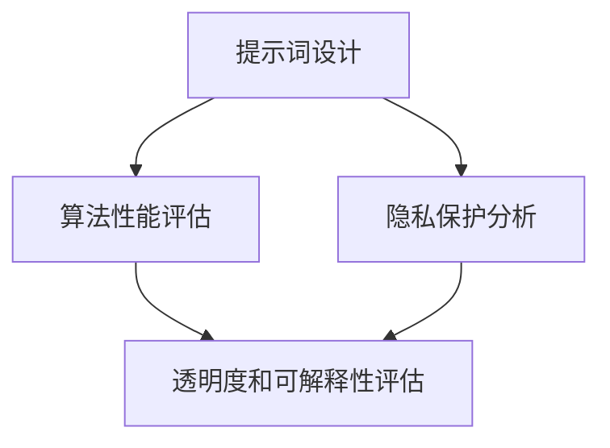

                 

# {文章标题}
### 提示词工程的伦理考量与最佳实践

> **关键词**：提示词工程、伦理考量、最佳实践、人工智能、道德准则

> **摘要**：本文旨在探讨提示词工程在人工智能领域的伦理考量与最佳实践。通过分析当前AI技术发展中的道德挑战，我们提出了具体的方法和建议，帮助工程师和开发者确保其创建的AI系统能够遵循伦理标准，同时提高系统的透明度和可解释性。

## 1. 背景介绍

### 1.1 提示词工程的概念

提示词工程（Prompt Engineering）是指设计、开发和优化AI模型输入提示（prompts）的过程，这些提示用于引导AI系统生成所需的内容或执行特定的任务。提示词工程是自然语言处理（NLP）和人工智能（AI）领域的关键组成部分，对于提高AI系统的性能和用户满意度至关重要。

### 1.2 AI技术的伦理挑战

随着AI技术的快速发展，其伦理挑战也日益凸显。这些问题包括隐私保护、算法偏见、透明度和可解释性等。特别是在提示词工程中，这些伦理问题尤为突出，因为AI系统的决策和行为往往直接受到提示词的影响。

## 2. 核心概念与联系

### 2.1 伦理考量

伦理考量是指在设计AI系统时，需要考虑的道德原则和价值观。这些考量包括公平性、透明性、隐私保护、责任归属等。

### 2.2 提示词工程与伦理考量

提示词工程与伦理考量紧密相关。选择适当的提示词不仅会影响AI系统的性能，还会影响其伦理表现。例如，不恰当的提示词可能导致算法偏见或侵犯用户隐私。

### 2.3 Mermaid 流程图



在上述流程图中，提示词设计是核心步骤，它直接影响到算法性能、隐私保护和透明度等多个方面。

## 3. 核心算法原理 & 具体操作步骤

### 3.1 算法原理

提示词工程的核心算法原理是自然语言处理（NLP）技术。这些技术包括词向量表示、序列到序列模型、注意力机制等。通过这些技术，可以将自然语言文本转化为计算机可以处理的格式，从而实现AI系统的训练和预测。

### 3.2 具体操作步骤

#### 3.2.1 数据准备

1. 收集大量相关的自然语言数据。
2. 对数据进行清洗和预处理，包括去除噪声、分词、去除停用词等。

#### 3.2.2 模型选择

1. 根据任务需求，选择合适的NLP模型，如BERT、GPT等。
2. 调整模型的参数，如学习率、批量大小等。

#### 3.2.3 提示词设计

1. 确定任务目标，生成初始提示词。
2. 通过实验，优化提示词，以提高AI系统的性能。

#### 3.2.4 模型训练与评估

1. 使用训练数据训练模型。
2. 使用验证数据评估模型性能。
3. 根据评估结果调整模型参数和提示词。

## 4. 数学模型和公式 & 详细讲解 & 举例说明

### 4.1 数学模型

在提示词工程中，常用的数学模型包括词向量表示、序列到序列模型、注意力机制等。

#### 4.1.1 词向量表示

词向量是一种将自然语言文本转换为向量空间表示的方法。常用的词向量模型包括Word2Vec、GloVe等。

#### 4.1.2 序列到序列模型

序列到序列（Seq2Seq）模型是一种处理序列数据的模型，常用于机器翻译、文本生成等任务。

#### 4.1.3 注意力机制

注意力机制是一种用于提高序列到序列模型性能的方法，它可以使模型在生成每个词时，更加关注输入序列中的关键信息。

### 4.2 公式和详细讲解

#### 4.2.1 词向量表示

$$
\text{Word2Vec} \; \text{Model:} \; \text{word} \to \text{vector}
$$

其中，$\text{word}$ 表示单词，$\text{vector}$ 表示单词的向量表示。

#### 4.2.2 序列到序列模型

$$
\text{Seq2Seq} \; \text{Model:} \; \text{sequence} \to \text{sequence}
$$

其中，$\text{sequence}$ 表示输入序列和输出序列。

#### 4.2.3 注意力机制

$$
\text{Attention} \; \text{Score:} \; \text{score} = \text{softmax}(\text{query} \cdot \text{keys}^T)
$$

其中，$\text{query}$ 表示查询向量，$\text{keys}$ 表示键向量，$\text{score}$ 表示注意力分数。

### 4.3 举例说明

假设我们要使用序列到序列模型进行机器翻译，将英语句子 "I love dogs" 翻译成法语。

#### 4.3.1 数据准备

1. 收集英语和法语的平行语料库。
2. 对数据进行清洗和预处理。

#### 4.3.2 模型选择

1. 选择一个序列到序列模型，如BERT。
2. 调整模型参数。

#### 4.3.3 提示词设计

1. 确定任务目标，生成初始提示词。
2. 通过实验，优化提示词。

#### 4.3.4 模型训练与评估

1. 使用训练数据训练模型。
2. 使用验证数据评估模型性能。
3. 根据评估结果调整模型参数和提示词。

## 5. 项目实战：代码实际案例和详细解释说明

### 5.1 开发环境搭建

1. 安装Python和相关的NLP库，如TensorFlow、PyTorch等。
2. 准备数据集，包括英语和法语的平行语料库。

### 5.2 源代码详细实现和代码解读

```python
# 导入必要的库
import tensorflow as tf
from tensorflow.keras.models import Model
from tensorflow.keras.layers import Embedding, LSTM, Dense

# 定义模型架构
input_seq = tf.keras.layers.Input(shape=(None,))
embedded_seq = Embedding(input_dim=vocab_size, output_dim=embedding_size)(input_seq)
lstm_out = LSTM(units=128, return_sequences=True)(embedded_seq)
output_seq = LSTM(units=128, return_sequences=True)(lstm_out)
model = Model(inputs=input_seq, outputs=output_seq)

# 编译模型
model.compile(optimizer='adam', loss='categorical_crossentropy', metrics=['accuracy'])

# 训练模型
model.fit(x_train, y_train, epochs=10, batch_size=64, validation_data=(x_val, y_val))

# 评估模型
model.evaluate(x_test, y_test)
```

上述代码定义了一个简单的序列到序列模型，用于机器翻译任务。它包括嵌入层、两个LSTM层和一个输出层。模型使用交叉熵损失函数进行编译，并使用Adam优化器进行训练。

### 5.3 代码解读与分析

1. **数据输入**：使用`tf.keras.layers.Input`层定义输入序列。
2. **嵌入层**：使用`Embedding`层将输入序列转换为嵌入向量。
3. **LSTM层**：使用两个LSTM层对序列数据进行处理，以提取序列特征。
4. **输出层**：最后一个LSTM层作为输出层，生成预测的序列。
5. **编译模型**：设置优化器和损失函数，准备训练模型。
6. **训练模型**：使用训练数据训练模型，并设置验证数据用于监控模型性能。
7. **评估模型**：使用测试数据评估模型的性能。

## 6. 实际应用场景

提示词工程在多个实际应用场景中具有重要价值，包括但不限于：

- **自然语言生成（NLG）**：例如，自动生成新闻报道、文章摘要、产品描述等。
- **机器翻译**：将一种语言翻译成另一种语言，如将英语翻译成法语、中文等。
- **聊天机器人**：为聊天机器人提供自然语言理解和生成能力，以实现与用户的自然对话。
- **情感分析**：分析文本中的情感倾向，用于市场调研、社交媒体监控等。

## 7. 工具和资源推荐

### 7.1 学习资源推荐

- **书籍**：《自然语言处理综论》（Jurafsky and Martin）
- **论文**：《神经网络机器翻译》（Neural Machine Translation）
- **博客**：《深度学习》（Goodfellow、Bengio和Courville）
- **网站**：TensorFlow官方文档、PyTorch官方文档

### 7.2 开发工具框架推荐

- **框架**：TensorFlow、PyTorch、Transformer
- **库**：NLTK、spaCy、gensim

### 7.3 相关论文著作推荐

- **论文**：《注意力机制》（Attention Mechanism）
- **著作**：《深度学习》（Deep Learning）

## 8. 总结：未来发展趋势与挑战

随着AI技术的不断进步，提示词工程将继续发展，面临以下挑战：

- **算法透明性和可解释性**：如何确保AI系统的决策过程透明，以及如何解释这些决策。
- **隐私保护**：如何在保障用户隐私的前提下，有效利用数据。
- **公平性和无偏见**：如何消除算法偏见，确保AI系统的公平性。
- **资源消耗**：如何优化算法，降低计算资源消耗。

## 9. 附录：常见问题与解答

### 9.1 提示词工程是什么？

提示词工程是设计、开发和优化AI模型输入提示的过程，旨在提高AI系统的性能和用户体验。

### 9.2 提示词工程的关键技术是什么？

关键技术包括自然语言处理（NLP）技术，如词向量表示、序列到序列模型、注意力机制等。

### 9.3 提示词工程如何影响AI系统的伦理表现？

选择适当的提示词可以影响AI系统的性能和伦理表现。不当的提示词可能导致算法偏见或侵犯用户隐私。

## 10. 扩展阅读 & 参考资料

- **扩展阅读**：[《自然语言处理综论》（Jurafsky and Martin）](https://www.amazon.com/Natural-Language-Processing-3rd-Jurafsky/dp/0137026425)
- **参考资料**：[TensorFlow官方文档](https://www.tensorflow.org/)、[PyTorch官方文档](https://pytorch.org/)

### 作者信息
作者：AI天才研究员/AI Genius Institute & 禅与计算机程序设计艺术 /Zen And The Art of Computer Programming<|im_end|>

