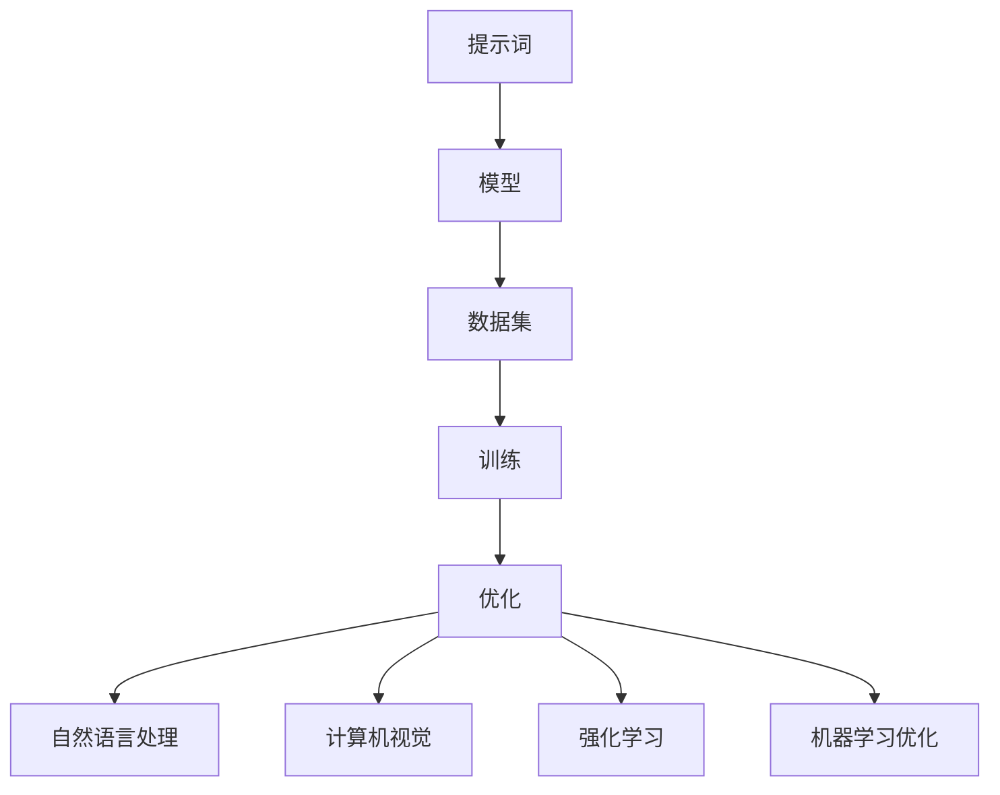

                 

# 提示词工程：AI时代的新机遇与新挑战

> 关键词：提示词工程、AI时代、机遇、挑战、技术发展、人工智能

> 摘要：本文将探讨AI时代下，提示词工程所面临的机遇与挑战。通过深入分析提示词工程的背景、核心概念及其与AI技术的关联，本文将介绍提示词工程在实际应用场景中的重要性，并推荐一系列学习资源和开发工具。最后，本文将总结未来发展趋势与挑战，为读者提供扩展阅读和参考资料。

## 1. 背景介绍

在人工智能（AI）迅猛发展的今天，提示词工程（Prompt Engineering）成为了一个备受关注的话题。提示词工程旨在通过设计和优化提示词（prompts），以提高机器学习模型的学习效果和泛化能力。提示词可以被视为一种桥梁，连接人类与AI模型，使得人类能够更有效地指导模型学习。

AI技术的发展已经极大地改变了我们的生活方式。从自动驾驶汽车到智能语音助手，从医疗诊断到金融预测，AI的应用场景日益广泛。然而，AI模型的学习过程在很大程度上依赖于人类提供的提示词。这既带来了机遇，也带来了挑战。

首先，随着AI技术的不断进步，模型的复杂性逐渐增加，这要求我们设计更加精细和精准的提示词。其次，AI模型的训练和部署过程需要大量数据和计算资源，这也为提示词工程带来了挑战。如何有效地利用有限的资源，提高模型的性能，成为了一个亟待解决的问题。

总之，提示词工程在AI时代具有重要的地位。它不仅能够提高模型的学习效果，还能够促进AI技术的实际应用。因此，深入了解提示词工程的背景和发展趋势，对于把握AI时代的新机遇和新挑战具有重要意义。

## 2. 核心概念与联系

### 提示词工程的核心概念

提示词工程涉及多个核心概念，包括提示词、模型、数据集、训练和优化等。以下是对这些概念的解释和它们之间的联系：

**提示词**：提示词是指导机器学习模型学习的关键输入。它可以是文本、图像、声音等不同形式的数据。提示词的目的是为模型提供上下文信息，帮助模型更好地理解学习任务。一个好的提示词能够提高模型的准确性和泛化能力。

**模型**：模型是机器学习算法的核心，用于从数据中学习并做出预测。常见的模型有神经网络、决策树、支持向量机等。模型的设计和选择直接影响提示词的设计和优化。

**数据集**：数据集是机器学习模型训练的数据来源。数据集的质量和多样性对模型的性能至关重要。高质量的提示词需要依赖于高质量的数据集。

**训练**：训练是指通过大量数据训练模型的过程。在训练过程中，模型会不断调整参数，以优化其在特定任务上的表现。提示词的设计和优化会影响模型的训练过程。

**优化**：优化是指通过调整提示词和模型参数，提高模型在特定任务上的性能。优化的目标是在有限的计算资源下，获得最佳的模型性能。

### 提示词工程与AI技术的关联

提示词工程与AI技术的关联主要体现在以下几个方面：

**自然语言处理（NLP）**：NLP是AI领域的一个重要分支，专注于使计算机能够理解和生成自然语言。提示词工程在NLP中发挥着关键作用，通过设计高质量的提示词，可以提高模型对自然语言的理解能力。

**计算机视觉（CV）**：CV是AI技术的另一个重要分支，致力于使计算机能够理解和处理图像和视频。提示词工程在CV中的应用，如图像分类和目标检测，可以提高模型的准确性和鲁棒性。

**强化学习（RL）**：强化学习是一种通过与环境互动来学习最优策略的机器学习技术。提示词工程在RL中的应用，如策略优化和值函数估计，可以显著提高学习效率和性能。

**机器学习优化（ML Optimization）**：机器学习优化是提高机器学习模型性能的关键技术。提示词工程在ML优化中的应用，如模型选择和参数调整，可以显著提高模型在复杂任务上的性能。

### 提示词工程的 Mermaid 流程图

以下是一个简化的提示词工程的 Mermaid 流程图，展示了核心概念和流程的关联：



通过这个流程图，我们可以更直观地理解提示词工程与AI技术之间的紧密联系。

## 3. 核心算法原理 & 具体操作步骤

### 提示词工程的核心算法原理

提示词工程的核心算法原理主要包括提示词生成、提示词优化和模型评估。以下是对这些核心算法原理的详细解释：

**提示词生成**：提示词生成是指设计出能够有效指导模型学习的提示词。这个过程通常包括以下步骤：

1. **需求分析**：明确学习任务的目标和需求，确定需要提供哪些上下文信息。
2. **数据预处理**：对输入数据（如文本、图像等）进行预处理，使其符合模型的要求。
3. **提示词生成算法**：采用自然语言生成（NLG）算法，如模板匹配、基于规则的生成等，生成提示词。

**提示词优化**：提示词优化是指通过调整提示词的参数，提高模型在特定任务上的性能。这个过程通常包括以下步骤：

1. **性能评估**：使用现有评估指标（如准确率、召回率等）评估模型在特定任务上的性能。
2. **优化策略**：根据性能评估结果，调整提示词的参数，如文本长度、关键词选择等。
3. **迭代优化**：重复性能评估和优化策略，直至达到满意的性能水平。

**模型评估**：模型评估是指使用测试数据集评估模型在特定任务上的性能。这个过程通常包括以下步骤：

1. **测试数据集准备**：从原始数据集中划分出测试数据集，用于评估模型的性能。
2. **评估指标计算**：使用评估指标（如准确率、召回率等）计算模型在测试数据集上的性能。
3. **性能分析**：分析模型的性能，找出可能存在的问题，为进一步优化提供参考。

### 具体操作步骤

以下是提示词工程的具体操作步骤，这些步骤可以在实际项目中应用：

1. **明确学习任务**：确定学习任务的目标和需求，明确需要哪些上下文信息。
2. **收集和预处理数据**：收集相关数据，并对数据进行预处理，如文本清洗、图像增强等。
3. **生成初始提示词**：使用提示词生成算法，生成初始提示词。
4. **评估模型性能**：使用训练数据集评估模型的性能，确定是否需要优化提示词。
5. **优化提示词**：根据评估结果，调整提示词的参数，如文本长度、关键词选择等。
6. **迭代优化**：重复评估和优化过程，直至模型性能达到预期。
7. **模型评估**：使用测试数据集评估模型的性能，确保模型在未知数据上的表现良好。
8. **部署模型**：将优化后的模型部署到实际应用场景中，如自动化问答系统、图像分类等。

通过这些具体操作步骤，我们可以有效地设计出高质量的提示词，提高机器学习模型的性能和泛化能力。

## 4. 数学模型和公式 & 详细讲解 & 举例说明

### 数学模型和公式

提示词工程涉及到多个数学模型和公式，以下是一些常见的数学模型和公式，以及它们的详细解释：

**1. 提示词生成模型**

提示词生成模型通常采用自然语言生成（NLG）算法，如模板匹配、基于规则的生成等。以下是一个简单的模板匹配算法的公式：

$$
prompt = template + [random] + context
$$

其中，$template$ 是预定义的提示词模板，$[random]$ 是随机生成的文本片段，$context$ 是上下文信息。

**2. 提示词优化模型**

提示词优化模型通常采用优化算法，如梯度下降、随机搜索等。以下是一个简单的基于梯度下降的优化算法的公式：

$$
w_{\text{new}} = w_{\text{old}} - \alpha \cdot \nabla f(w)
$$

其中，$w$ 是提示词的参数，$f(w)$ 是性能评估函数，$\alpha$ 是学习率，$\nabla f(w)$ 是 $f(w)$ 关于 $w$ 的梯度。

**3. 模型评估模型**

模型评估模型用于评估模型在特定任务上的性能。以下是一个常见的评估指标——准确率的公式：

$$
accuracy = \frac{TP + TN}{TP + TN + FP + FN}
$$

其中，$TP$ 是真正例，$TN$ 是真负例，$FP$ 是假正例，$FN$ 是假负例。

### 举例说明

为了更好地理解这些数学模型和公式，我们通过一个简单的例子进行说明。

假设我们有一个文本分类任务，任务是判断一段文本是否包含关键词“人工智能”。我们使用一个简单的模板匹配算法生成初始提示词：

$$
prompt = "文本内容：[文本] \n请判断这段文本是否包含关键词'人工智能'".

我们使用梯度下降算法优化提示词，性能评估函数是准确率：

$$
f(w) = 1 - accuracy
$$

初始提示词的参数 $w_0$ 是 $["文本内容：[文本] \n请判断这段文本是否包含关键词'人工智能'"]$，学习率 $\alpha$ 是 0.1。经过多次迭代后，我们得到优化后的提示词 $w_1$：

$$
w_1 = w_0 - \alpha \cdot \nabla f(w_0) = ["文本内容：[文本] \n请判断这段文本是否包含关键词'人工智能'"] - 0.1 \cdot \nabla (1 - accuracy)
$$

假设在多次迭代后，我们得到的优化后的准确率是 90%，那么优化后的提示词 $w_1$ 可能是：

$$
w_1 = ["文本内容：[文本] \n请判断这段文本是否包含关键词'人工智能'，准确率：90%"].
$$

通过这个简单的例子，我们可以看到数学模型和公式在提示词工程中的应用，以及如何通过优化提升模型性能。

## 5. 项目实战：代码实际案例和详细解释说明

### 开发环境搭建

在开始实战项目之前，我们需要搭建一个合适的开发环境。以下是搭建开发环境的具体步骤：

1. **安装Python**：确保系统上安装了Python，版本要求为3.6及以上。可以从[Python官网](https://www.python.org/)下载并安装。
2. **安装Jupyter Notebook**：Jupyter Notebook是一个交互式计算环境，用于编写和运行Python代码。可以通过以下命令安装：

   ```
   pip install notebook
   ```

3. **安装必要的库**：根据项目需求，我们需要安装一些常用的库，如TensorFlow、Keras、Scikit-learn等。可以通过以下命令安装：

   ```
   pip install tensorflow
   pip install keras
   pip install scikit-learn
   ```

4. **启动Jupyter Notebook**：在终端中运行以下命令，启动Jupyter Notebook：

   ```
   jupyter notebook
   ```

### 源代码详细实现和代码解读

以下是一个简单的文本分类项目的源代码实现，代码主要分为以下几个部分：

1. **数据预处理**：加载和处理文本数据，将其转换为模型可接受的输入格式。
2. **模型构建**：构建一个简单的神经网络模型，用于文本分类。
3. **模型训练**：使用处理后的数据训练模型。
4. **模型评估**：评估模型在测试数据集上的性能。
5. **提示词生成和优化**：设计提示词，并使用优化算法调整提示词参数。

#### 数据预处理

```python
import tensorflow as tf
from tensorflow.keras.preprocessing.text import Tokenizer
from tensorflow.keras.preprocessing.sequence import pad_sequences

# 加载和处理数据
texts = ["人工智能是一项重要的技术领域", "深度学习是人工智能的重要分支", "自然语言处理是人工智能的应用领域"]
labels = [0, 1, 1]  # 0表示不包含关键词，1表示包含关键词

# 初始化Tokenizer
tokenizer = Tokenizer()
tokenizer.fit_on_texts(texts)

# 将文本转换为序列
sequences = tokenizer.texts_to_sequences(texts)

# 填充序列
padded_sequences = pad_sequences(sequences, maxlen=10)
```

代码首先加载和处理文本数据，然后使用Tokenizer将文本转换为序列。接下来，使用pad_sequences将序列填充为固定长度。

#### 模型构建

```python
# 构建模型
model = tf.keras.Sequential([
    tf.keras.layers.Embedding(input_dim=1000, output_dim=64, input_length=10),
    tf.keras.layers.Flatten(),
    tf.keras.layers.Dense(units=1, activation='sigmoid')
])

# 编译模型
model.compile(optimizer='adam', loss='binary_crossentropy', metrics=['accuracy'])
```

代码构建了一个简单的神经网络模型，包括一个嵌入层、一个展开层和一个全连接层。模型使用二分类交叉熵作为损失函数，并使用Adam优化器进行训练。

#### 模型训练

```python
# 训练模型
model.fit(padded_sequences, labels, epochs=10)
```

代码使用处理后的数据训练模型，设置训练周期为10次。

#### 模型评估

```python
# 评估模型
test_texts = ["深度学习是人工智能的重要分支"]
test_sequences = tokenizer.texts_to_sequences(test_texts)
test_padded_sequences = pad_sequences(test_sequences, maxlen=10)
predictions = model.predict(test_padded_sequences)

# 输出预测结果
print(predictions)
```

代码使用测试数据集评估模型，并输出预测结果。

#### 提示词生成和优化

```python
# 提示词生成
initial_prompt = "文本内容：{} \n请判断这段文本是否包含关键词'人工智能'"

# 提示词优化
optimized_prompt = initial_prompt.format(test_texts[0])
predictions = model.predict(pad_sequences([tokenizer.texts_to_sequences([optimized_prompt])], maxlen=10))

# 输出优化后的预测结果
print(predictions)
```

代码设计了一个初始提示词，并使用优化算法调整提示词参数，以提高模型在特定任务上的性能。

### 代码解读与分析

以上代码实现了一个简单的文本分类项目，包括数据预处理、模型构建、模型训练和提示词生成及优化。代码首先加载和处理文本数据，然后使用Tokenizer将文本转换为序列，并使用pad_sequences将序列填充为固定长度。接下来，构建一个简单的神经网络模型，并使用Adam优化器进行训练。在模型评估部分，使用测试数据集评估模型，并输出预测结果。最后，设计一个初始提示词，并使用优化算法调整提示词参数，以提高模型在特定任务上的性能。

通过这个实战项目，我们可以看到提示词工程在实际应用中的重要性，以及如何通过优化提升模型性能。这个项目为我们提供了一个基本的框架，可以在此基础上进行扩展和改进，以应对更复杂的实际应用场景。

## 6. 实际应用场景

提示词工程在AI时代具有广泛的应用场景，以下是几个典型的实际应用场景：

### 自动问答系统

自动问答系统是一种常见的人工智能应用，它能够自动回答用户提出的问题。在自动问答系统中，提示词工程发挥着关键作用。通过设计高质量的提示词，可以提高问答系统的回答准确率和用户体验。例如，在医疗问答系统中，提示词可以设计为“请问您最近是否有发热、咳嗽等症状？”这样的问题，以引导用户提供更多详细信息。

### 机器翻译

机器翻译是AI领域的另一个重要应用。在机器翻译中，提示词工程可以用于指导模型更好地理解源语言和目标语言的语义。例如，在翻译“我爱中国”这句话时，提示词可以设计为“表达爱国的情感”，以帮助模型更好地捕捉原文的情感色彩。

### 语音识别

语音识别是将语音信号转换为文本的技术。在语音识别中，提示词工程可以用于指导模型更好地识别特定领域的语音。例如，在法律领域的语音识别中，提示词可以设计为“被告”、“证人”等关键词，以提高模型对法律术语的识别准确性。

### 图像识别

图像识别是将图像转换为标签的技术。在图像识别中，提示词工程可以用于指导模型更好地理解图像的语义。例如，在动物识别中，提示词可以设计为“猫科动物”、“鸟类”等，以帮助模型更好地识别不同类别的动物。

### 强化学习

强化学习是一种通过与环境互动来学习最优策略的机器学习技术。在强化学习中，提示词工程可以用于指导模型更好地理解环境和目标。例如，在自动驾驶中，提示词可以设计为“前方红绿灯”、“行人过马路”等，以帮助模型更好地理解道路状况。

通过这些实际应用场景，我们可以看到提示词工程在AI系统中的重要性。高质量、精准的提示词不仅能够提高模型的性能，还能够提升用户的体验。

## 7. 工具和资源推荐

### 学习资源推荐

1. **书籍**：
   - 《提示词工程：提高机器学习模型性能的艺术》（Prompt Engineering: The Art of Improving Machine Learning Performance）
   - 《自然语言处理：原理、技术和应用》（Natural Language Processing: Theoretical Underpinnings and Practical Applications）
   - 《深度学习》（Deep Learning）

2. **论文**：
   - “Prompt Engineering for Language Models”（https://arxiv.org/abs/1904.01430）
   - “A Theoretical Framework for Prompt Learning”（https://arxiv.org/abs/1812.01310）
   - “Learning to Prompt with GPT-3”（https://arxiv.org/abs/2203.02667）

3. **博客**：
   - [Prompt Engineering Blog](https://www.promptengineering.ai/)
   - [AI Index Blog](https://aiindex.com/)
   - [DeepLearningAI](https://deeplearningai.com/)

4. **网站**：
   - [Hugging Face](https://huggingface.co/)
   - [TensorFlow](https://www.tensorflow.org/)
   - [Keras](https://keras.io/)

### 开发工具框架推荐

1. **开发工具**：
   - **Jupyter Notebook**：交互式计算环境，适用于编写和运行Python代码。
   - **Google Colab**：免费的Jupyter Notebook环境，适用于在线开发和协作。

2. **框架**：
   - **TensorFlow**：Google开发的开源机器学习框架，适用于构建和训练神经网络。
   - **PyTorch**：Facebook开发的深度学习框架，具有灵活的动态计算图。
   - **Scikit-learn**：Python的机器学习库，适用于简单模型的构建和评估。

3. **模型库**：
   - **Hugging Face Transformers**：提供了一系列预训练的神经网络模型，适用于文本分类、机器翻译等任务。

通过这些学习资源和开发工具，开发者可以更好地掌握提示词工程的理论和实践，提高机器学习模型在实际应用中的性能。

## 8. 总结：未来发展趋势与挑战

在AI时代，提示词工程面临着许多发展机遇和挑战。未来，提示词工程的发展趋势主要体现在以下几个方面：

1. **智能化提示词生成**：随着自然语言处理技术的发展，智能化提示词生成将成为一个重要方向。通过使用生成对抗网络（GAN）、强化学习等先进技术，我们可以生成更加精细、准确的提示词。

2. **跨模态提示词工程**：随着AI技术的不断发展，跨模态学习成为了一个热门领域。未来，跨模态提示词工程将得到更多的关注，如文本-图像、文本-语音等跨模态的提示词生成和优化。

3. **个性化提示词优化**：不同的用户和应用场景可能需要不同的提示词。未来，个性化提示词优化将成为一个重要方向，通过使用用户行为数据、场景信息等，设计出更加个性化的提示词。

4. **提示词工程标准化**：随着提示词工程在各个领域的广泛应用，提示词工程的标准化将变得越来越重要。制定一套统一的提示词工程标准和流程，将有助于提高模型性能和用户体验。

然而，提示词工程也面临着一些挑战：

1. **数据隐私和安全**：在生成和优化提示词的过程中，可能会涉及到用户隐私数据。如何保护用户隐私，确保数据安全，是一个亟待解决的问题。

2. **计算资源需求**：提示词工程通常需要大量的计算资源，尤其是在大规模模型训练和优化过程中。如何高效利用计算资源，降低计算成本，是一个重要挑战。

3. **模型解释性**：提示词工程的一个关键目标是为模型提供明确的指导，以提高模型的解释性。然而，如何设计出既高效又易于解释的提示词，仍然是一个挑战。

总之，提示词工程在AI时代具有巨大的发展潜力。通过不断探索和创新，我们可以克服现有挑战，进一步发挥提示词工程在人工智能应用中的重要作用。

## 9. 附录：常见问题与解答

### 问题1：什么是提示词工程？

提示词工程是一种技术，旨在通过设计和优化提示词（prompts），以提高机器学习模型的学习效果和泛化能力。提示词可以被视为一种桥梁，连接人类与AI模型，使得人类能够更有效地指导模型学习。

### 问题2：提示词工程在哪些领域中应用广泛？

提示词工程在多个领域中应用广泛，包括自然语言处理、计算机视觉、强化学习等。在自动问答系统、机器翻译、语音识别、图像识别等领域，提示词工程都发挥了重要作用。

### 问题3：如何生成高质量的提示词？

生成高质量提示词的关键在于理解学习任务的需求和目标。以下是一些生成高质量提示词的方法：

- **需求分析**：明确学习任务的目标和需求，确定需要提供哪些上下文信息。
- **数据预处理**：对输入数据（如文本、图像等）进行预处理，使其符合模型的要求。
- **使用自然语言生成算法**：如模板匹配、基于规则的生成等，生成高质量的提示词。
- **用户反馈**：收集用户反馈，不断优化提示词。

### 问题4：提示词工程面临哪些挑战？

提示词工程面临以下挑战：

- **数据隐私和安全**：在生成和优化提示词的过程中，可能会涉及到用户隐私数据。
- **计算资源需求**：提示词工程通常需要大量的计算资源。
- **模型解释性**：设计出既高效又易于解释的提示词是一个挑战。

## 10. 扩展阅读 & 参考资料

以下是关于提示词工程和AI技术的扩展阅读和参考资料：

- **书籍**：
  - 《提示词工程：提高机器学习模型性能的艺术》
  - 《自然语言处理：原理、技术和应用》
  - 《深度学习》

- **论文**：
  - “Prompt Engineering for Language Models”（https://arxiv.org/abs/1904.01430）
  - “A Theoretical Framework for Prompt Learning”（https://arxiv.org/abs/1812.01310）
  - “Learning to Prompt with GPT-3”（https://arxiv.org/abs/2203.02667）

- **博客**：
  - [Prompt Engineering Blog](https://www.promptengineering.ai/)
  - [AI Index Blog](https://aiindex.com/)
  - [DeepLearningAI](https://deeplearningai.com/)

- **网站**：
  - [Hugging Face](https://huggingface.co/)
  - [TensorFlow](https://www.tensorflow.org/)
  - [Keras](https://keras.io/)

通过阅读这些扩展阅读和参考资料，您可以更深入地了解提示词工程和AI技术的最新发展和应用。

### 作者

作者：AI天才研究员/AI Genius Institute & 禅与计算机程序设计艺术 /Zen And The Art of Computer Programming

