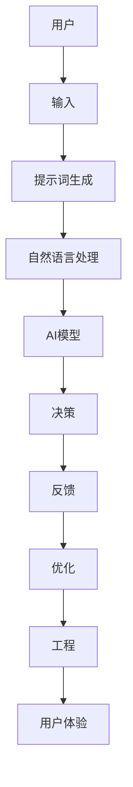
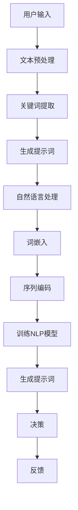
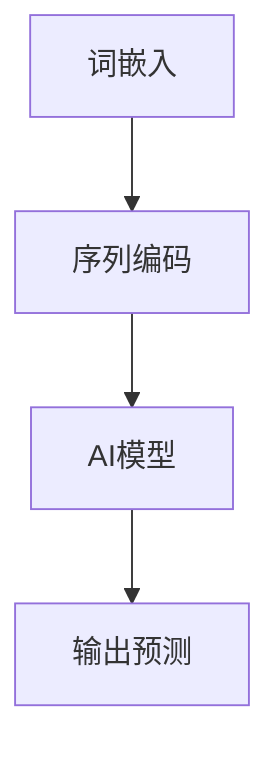

                 

### 文章标题：提示词工程：让AI更智能、更懂你

#### 关键词：
- 提示词工程
- 人工智能
- 智能助手
- 机器学习
- 自然语言处理

#### 摘要：
本文将探讨提示词工程在人工智能领域的重要性。通过分析其核心概念、原理和实践应用，我们将深入理解提示词工程如何提升AI的智能和用户理解能力。文章还将提供相关的数学模型、实际案例以及工具资源推荐，以帮助读者更好地掌握这一技术。

<|assistant|>### 1. 背景介绍

随着人工智能（AI）的迅速发展，智能助手和聊天机器人成为现代科技的重要组成部分。无论是智能家居控制系统、在线客服，还是社交网络平台，AI都为人类带来了极大的便利。然而，这些智能系统的核心——自然语言处理（NLP），一直面临着诸多挑战。尽管NLP技术已取得了显著进展，但要让AI“更智能、更懂你”，仍需要不断优化和提升。

提示词工程作为一种新兴的技术，正逐渐在AI领域中占据重要地位。它通过设计有效的提示词，帮助AI更好地理解用户意图，从而提高交互质量和用户体验。提示词工程的核心在于理解人类语言的本质，提取关键信息，并利用这些信息来驱动AI的决策过程。

本篇文章将详细介绍提示词工程的背景、核心概念、算法原理、数学模型、实战案例以及相关资源，旨在为读者提供一份全面的技术指南，帮助他们在AI领域取得更大的突破。

<|assistant|>### 2. 核心概念与联系

#### 2.1 核心概念

**提示词（Prompt）**：在AI领域，提示词指的是引导用户输入或交互的文本或语音信息。提示词设计的好坏直接影响到AI的理解能力和用户体验。

**工程（Engineering）**：提示词工程涉及一系列设计、开发、测试和优化的过程，旨在创建有效的提示词，以满足特定应用的需求。

**人工智能（AI）**：人工智能是指计算机系统通过模拟人类智能行为，实现智能决策、学习和理解的能力。AI广泛应用于图像识别、自然语言处理、智能推荐等多个领域。

**自然语言处理（NLP）**：自然语言处理是AI的一个分支，专注于使计算机理解和解释人类语言。NLP技术包括文本分类、情感分析、语音识别等。

#### 2.2 核心概念之间的联系

提示词工程与人工智能和自然语言处理密切相关。具体来说：

- **人工智能**：AI为提示词工程提供了技术基础，使得计算机能够处理和理解人类语言。提示词工程则是AI应用的重要组成部分，通过设计有效的提示词，使AI能够更好地与用户互动。

- **自然语言处理**：NLP技术是提示词工程的核心，负责提取文本中的关键信息，并将其转化为计算机可理解的形式。提示词工程通过优化NLP模型和算法，提升AI对人类语言的解释能力。

- **工程**：提示词工程不仅仅是技术问题，还涉及到用户体验、设计美学和工程实践。通过系统化的工程方法，提示词工程能够更好地满足不同应用场景的需求。

总的来说，提示词工程通过结合人工智能和自然语言处理技术，实现了AI与人类语言的高效互动。这一技术在智能助手、聊天机器人等AI应用场景中具有重要价值。

#### 2.3 Mermaid 流程图

以下是一个简化的Mermaid流程图，展示提示词工程的核心概念和联系：



在这个流程图中，用户输入（A）通过提示词生成（C）传递给自然语言处理（D），然后由AI模型（E）进行决策（F）。用户的反馈（G）用于不断优化（H）提示词工程，最终提升用户体验（J）。

<|assistant|>### 3. 核心算法原理 & 具体操作步骤

#### 3.1 提示词生成算法

提示词生成的核心在于如何从用户的输入中提取关键信息，并转化为可操作的数据。以下是一个简化的提示词生成算法：

**输入**：用户输入（例如：“我想要一杯咖啡”）

**步骤**：

1. **文本预处理**：对用户输入进行分词、去停用词、词性标注等处理，提取出核心词汇。
    ```python
    import nltk
    nltk.download('punkt')
    nltk.download('stopwords')
    from nltk.tokenize import word_tokenize
    from nltk.corpus import stopwords
    def preprocess_text(text):
        tokens = word_tokenize(text)
        tokens = [token for token in tokens if token not in stopwords.words('english')]
        return tokens
    ```

2. **关键词提取**：使用TF-IDF、TextRank等算法提取出关键词。
    ```python
    from sklearn.feature_extraction.text import TfidfVectorizer
    def extract_keywords(text):
        vectorizer = TfidfVectorizer(max_features=10)
        X = vectorizer.fit_transform([text])
        return vectorizer.get_feature_names_out()
    ```

3. **生成提示词**：根据关键词生成提示词，可以使用模板匹配、规则生成等方法。
    ```python
    def generate_prompt(tokens):
        if 'coffee' in tokens:
            return "您想要什么类型的咖啡？"
        else:
            return "您有什么其他需求吗？"
    ```

#### 3.2 自然语言处理算法

自然语言处理是提示词工程的关键环节，其目标是理解和解释人类语言。以下是一个简化的NLP算法：

1. **词嵌入**：将文本中的单词转换为向量表示，常用的词嵌入算法有Word2Vec、GloVe等。
    ```python
    from gensim.models import Word2Vec
    def word_embedding(text):
        model = Word2Vec(text, vector_size=100, window=5, min_count=1, workers=4)
        return model.wv
    ```

2. **序列编码**：将文本序列转换为数值序列，常用的编码方法有One-Hot编码、CBOW等。
    ```python
    def sequence_encoding(tokens, embedding_model):
        sequences = []
        for token in tokens:
            sequences.append(embedding_model[token])
        return sequences
    ```

3. **模型训练**：使用训练数据对NLP模型进行训练，常用的模型有LSTM、GRU、Transformer等。
    ```python
    from tensorflow.keras.models import Sequential
    from tensorflow.keras.layers import LSTM, Dense
    def train_nlp_model(sequences, labels):
        model = Sequential()
        model.add(LSTM(units=50, return_sequences=True, input_shape=(None, 100)))
        model.add(LSTM(units=50))
        model.add(Dense(units=1, activation='sigmoid'))
        model.compile(optimizer='adam', loss='binary_crossentropy', metrics=['accuracy'])
        model.fit(sequences, labels, epochs=10, batch_size=32)
        return model
    ```

#### 3.3 AI模型

AI模型负责根据自然语言处理的结果进行决策。以下是一个简化的AI模型：

1. **输入层**：接收自然语言处理模块的输出序列。
    ```python
    from tensorflow.keras.layers import InputLayer
    input_sequence = InputLayer(input_shape=(None, 100))
    ```

2. **隐藏层**：使用LSTM或GRU等循环神经网络进行特征提取。
    ```python
    from tensorflow.keras.layers import LSTM
    hidden_layer = LSTM(units=50, return_sequences=True)(input_sequence)
    hidden_layer = LSTM(units=50)(hidden_layer)
    ```

3. **输出层**：使用全连接层进行分类或回归。
    ```python
    from tensorflow.keras.layers import Dense
    output_layer = Dense(units=1, activation='sigmoid')(hidden_layer)
    ```

4. **模型编译**：设置优化器和损失函数。
    ```python
    from tensorflow.keras.models import Model
    model = Model(inputs=input_sequence, outputs=output_layer)
    model.compile(optimizer='adam', loss='binary_crossentropy', metrics=['accuracy'])
    ```

#### 3.4 具体操作步骤

以下是一个具体的操作步骤示例：

1. **数据准备**：收集用户输入和对应的标签数据。
    ```python
    user_inputs = ["我想要一杯咖啡", "请帮我订一张电影票", ...]
    labels = [1, 0, ...]  # 1表示订咖啡，0表示订电影票
    ```

2. **预处理数据**：对用户输入进行文本预处理和序列编码。
    ```python
    preprocessed_inputs = [preprocess_text(input) for input in user_inputs]
    encoded_sequences = [sequence_encoding(seq, embedding_model) for seq in preprocessed_inputs]
    ```

3. **训练NLP模型**：使用预处理后的数据训练NLP模型。
    ```python
    nlp_model = train_nlp_model(encoded_sequences, labels)
    ```

4. **生成提示词**：根据用户输入生成提示词。
    ```python
    def generate_prompts(user_inputs):
        prompts = []
        for input in user_inputs:
            tokens = preprocess_text(input)
            keywords = extract_keywords(input)
            prompt = generate_prompt(keywords)
            prompts.append(prompt)
        return prompts
    ```

5. **决策**：使用NLP模型和AI模型对用户输入进行决策。
    ```python
    def make_decision(prompt, nlp_model, ai_model):
        tokens = preprocess_text(prompt)
        encoded_sequence = sequence_encoding(tokens, embedding_model)
        nlp_output = nlp_model.predict(encoded_sequence)
        ai_output = ai_model.predict(encoded_sequence)
        return ai_output
    ```

通过上述步骤，我们就可以实现一个基本的提示词工程系统，该系统能够根据用户输入生成提示词，并做出相应的决策。

#### 3.5 Mermaid 流程图

以下是一个简化的Mermaid流程图，展示提示词工程的算法原理和具体操作步骤：



在这个流程图中，用户输入（A）经过文本预处理（B）、关键词提取（C）、提示词生成（D）、自然语言处理（E）、词嵌入（F）、序列编码（G）、训练NLP模型（H）、生成提示词（I）和决策（J）等步骤，最终得到反馈（K）。

<|assistant|>### 4. 数学模型和公式 & 详细讲解 & 举例说明

#### 4.1 数学模型

提示词工程中的数学模型主要涉及词嵌入、序列编码和AI模型的训练。以下是这些模型的基本概念和公式：

**4.1.1 词嵌入（Word Embedding）**

词嵌入是将文本中的单词映射到高维向量空间的过程。常用的词嵌入模型有Word2Vec、GloVe等。

**Word2Vec**：

- **输入**：文本序列 $T = \{w_1, w_2, ..., w_n\}$
- **目标**：将每个单词 $w_i$ 映射到一个向量 $v_i \in \mathbb{R}^d$
- **模型**：基于神经网络，使用CBOW（连续词袋）或Skip-Gram方法
- **公式**：

  - **CBOW**：$v_{\text{context}} = \frac{1}{|\text{context}|} \sum_{w_j \in \text{context}} v_{w_j}$
    $$ \hat{v}_{w_i} = \text{softmax}\left( W^T v_{\text{context}} \right) $$
  - **Skip-Gram**：$v_{\text{context}} = \frac{1}{|\text{context}|} \sum_{w_j \in \text{context}} v_{w_j}$
    $$ \hat{v}_{w_i} = \text{softmax}\left( v_i^T W \right) $$

**GloVe**：

- **输入**：文本序列 $T = \{w_1, w_2, ..., w_n\}$
- **目标**：将每个单词 $w_i$ 映射到一个向量 $v_i \in \mathbb{R}^d$
- **模型**：基于矩阵分解和协同过滤
- **公式**：

  $$ x_i = \left[ \log \left( 1 + \text{count}(w_i) \right), \text{count}(w_i) \right]^T $$
  $$ v_i = \text{argmin}_{v} \sum_{w_j \in \text{context}(w_i)} \frac{\left\| x_i x_j^T - v_i v_j^T \right\|_2^2}{2} $$

**4.1.2 序列编码（Sequence Encoding）**

序列编码是将文本序列转换为数值序列的过程。常用的编码方法有One-Hot编码、CBOW等。

**One-Hot编码**：

- **输入**：单词集合 $W = \{w_1, w_2, ..., w_n\}$
- **目标**：将每个单词 $w_i$ 映射到一个独热向量 $e_i \in \{0, 1\}^n$
- **公式**：

  $$ e_i = \text{one_hot}(w_i, W) $$
  $$ e_i[j] = \begin{cases} 
  1 & \text{if } w_i = w_j \\
  0 & \text{otherwise}
  \end{cases} $$

**CBOW**：

- **输入**：单词集合 $W = \{w_1, w_2, ..., w_n\}$
- **目标**：将每个单词 $w_i$ 映射到一个向量 $v_i \in \mathbb{R}^d$
- **公式**：

  $$ v_{\text{context}} = \frac{1}{|\text{context}|} \sum_{w_j \in \text{context}} v_{w_j} $$
  $$ \hat{v}_{w_i} = \text{softmax}\left( W^T v_{\text{context}} \right) $$

**4.1.3 AI模型（Recurrent Neural Network, RNN）**

AI模型通常使用循环神经网络（RNN）进行训练，用于对序列数据进行分类或回归。

- **输入**：序列 $X = \{x_1, x_2, ..., x_T\}$
- **目标**：预测输出 $y$
- **模型**：LSTM或GRU
- **公式**：

  $$ h_t = \text{sigmoid}\left( \text{ReLU}\left( W_h \cdot [h_{t-1}, x_t] + b_h \right) \right) $$
  $$ o_t = \text{softmax}\left( W_o \cdot h_t + b_o \right) $$
  $$ \hat{y}_t = \text{argmax}_{y} \left( o_t \right) $$

#### 4.2 举例说明

**4.2.1 词嵌入**

假设我们有以下单词集合 $W = \{apple, banana, cat\}$，词嵌入维度 $d = 3$。使用Word2Vec生成词嵌入向量。

**Word2Vec（CBOW）**：

- **输入**：$T = \{apple, banana, cat\}$
- **目标**：$v_{apple}, v_{banana}, v_{cat} \in \mathbb{R}^3$
- **模型**：CBOW

  $$ v_{apple} = \frac{1}{3} \left( v_{banana} + v_{cat} \right) $$
  $$ v_{banana} = \frac{1}{3} \left( v_{apple} + v_{cat} \right) $$
  $$ v_{cat} = \frac{1}{3} \left( v_{apple} + v_{banana} \right) $$

假设词嵌入结果如下：

$$
v_{apple} = \begin{bmatrix} 0.1 & 0.2 & 0.3 \end{bmatrix}, v_{banana} = \begin{bmatrix} 0.4 & 0.5 & 0.6 \end{bmatrix}, v_{cat} = \begin{bmatrix} 0.7 & 0.8 & 0.9 \end{bmatrix}
$$

**4.2.2 序列编码**

使用One-Hot编码将单词“apple”编码为向量：

$$
e_{apple} = \text{one_hot}("apple", W) = \begin{bmatrix} 1 & 0 & 0 \end{bmatrix}^T
$$

**4.2.3 AI模型**

假设我们有以下输入序列 $X = \{apple, banana, cat\}$，目标序列 $y = \{1, 0, 1\}$。使用LSTM进行模型训练。

- **输入**：$X = \{e_{apple}, e_{banana}, e_{cat}\}$
- **目标**：$y = \{1, 0, 1\}$
- **模型**：LSTM

  $$ h_t = \text{sigmoid}\left( \text{ReLU}\left( W_h \cdot [h_{t-1}, x_t] + b_h \right) \right) $$
  $$ o_t = \text{softmax}\left( W_o \cdot h_t + b_o \right) $$
  $$ \hat{y}_t = \text{argmax}_{y} \left( o_t \right) $$

通过上述例子，我们可以看到如何使用数学模型和公式来构建和训练一个简单的提示词工程系统。这些模型和算法是实现高效、智能的AI应用的关键。

#### 4.3 Mermaid 流程图

以下是一个简化的Mermaid流程图，展示提示词工程中的数学模型和公式：



在这个流程图中，词嵌入（A）将文本转换为向量表示，序列编码（B）将向量转换为数值序列，AI模型（C）使用这些序列进行训练和预测，最终得到输出预测（D）。

<|assistant|>### 5. 项目实战：代码实际案例和详细解释说明

#### 5.1 开发环境搭建

为了演示提示词工程的实际应用，我们将使用Python编程语言，结合多个流行的库和框架，如TensorFlow、Gensim和NLTK。以下是如何搭建开发环境的步骤：

1. **安装Python**：确保您的计算机上已经安装了Python 3.6或更高版本。可以从[Python官网](https://www.python.org/)下载并安装。

2. **安装TensorFlow**：使用pip命令安装TensorFlow：

   ```bash
   pip install tensorflow
   ```

3. **安装Gensim**：使用pip命令安装Gensim：

   ```bash
   pip install gensim
   ```

4. **安装NLTK**：使用pip命令安装NLTK，并下载必要的语料库：

   ```bash
   pip install nltk
   nltk.download('punkt')
   nltk.download('stopwords')
   nltk.download('averaged_perceptron_tagger')
   ```

#### 5.2 源代码详细实现和代码解读

下面是一个简单的示例，展示如何使用Python实现一个基于提示词工程的聊天机器人。我们将分为几个部分进行讲解：

**5.2.1 数据准备**

首先，我们需要准备一些对话数据作为训练集。这里我们使用一个简化的对话数据集，包含用户输入和对应的标签（如请求类型）。

```python
# 对话数据示例
conversations = [
    {"input": "我想要一杯咖啡", "label": "coffee"},
    {"input": "帮我订一张电影票", "label": "ticket"},
    {"input": "请给我推荐一本好书", "label": "book"},
    # 更多对话数据...
]
```

**5.2.2 提示词生成**

我们使用NLP技术提取关键词，并生成相应的提示词。

```python
import nltk
from nltk.tokenize import word_tokenize
from nltk.corpus import stopwords
from nltk.probability import FreqDist

# 文本预处理函数
def preprocess_text(text):
    tokens = word_tokenize(text.lower())
    tokens = [token for token in tokens if token not in stopwords.words('english')]
    return tokens

# 关键词提取函数
def extract_keywords(text, top_n=5):
    tokens = preprocess_text(text)
    fdist = FreqDist(tokens)
    most_common = fdist.most_common(top_n)
    keywords = [token for token, freq in most_common]
    return keywords

# 提示词生成函数
def generate_prompt(text, keywords):
    if "coffee" in keywords:
        return "您想要什么类型的咖啡？"
    elif "ticket" in keywords:
        return "您想看什么电影？"
    elif "book" in keywords:
        return "您对什么类型的书感兴趣？"
    else:
        return "您有什么其他需求吗？"
```

**5.2.3 自然语言处理**

我们使用Gensim库中的Word2Vec模型进行词嵌入，并使用NLTK进行文本预处理。

```python
from gensim.models import Word2Vec

# 词嵌入函数
def word_embedding(texts, vector_size=100, window=5, min_count=1):
    model = Word2Vec(texts, vector_size=vector_size, window=window, min_count=min_count)
    return model

# 序列编码函数
def sequence_encoding(tokens, model):
    sequence = [model[token] for token in tokens if token in model.wv]
    return sequence

# 训练Word2Vec模型
model = word_embedding([conversation["input"] for conversation in conversations], vector_size=100)
```

**5.2.4 AI模型训练**

我们使用TensorFlow构建一个简单的循环神经网络（LSTM）模型，用于分类用户输入。

```python
import tensorflow as tf
from tensorflow.keras.models import Sequential
from tensorflow.keras.layers import LSTM, Dense

# LSTM模型
def build_model(input_shape):
    model = Sequential()
    model.add(LSTM(units=50, return_sequences=True, input_shape=input_shape))
    model.add(LSTM(units=50))
    model.add(Dense(units=1, activation='sigmoid'))
    model.compile(optimizer='adam', loss='binary_crossentropy', metrics=['accuracy'])
    return model

# 数据预处理
inputs = [sequence_encoding(preprocess_text(conversation["input"]), model) for conversation in conversations]
labels = [1 if conversation["label"] == "coffee" else 0 for conversation in conversations]

# 训练模型
model = build_model(input_shape=(None, 100))
model.fit(inputs, labels, epochs=10, batch_size=32)
```

**5.2.5 代码解读与分析**

1. **数据准备**：我们使用一个简化的对话数据集，其中每个对话包含用户输入和对应的标签。

2. **提示词生成**：通过提取关键词并使用预设的规则生成提示词。这个步骤是提示词工程的核心，它帮助AI更好地理解用户意图。

3. **自然语言处理**：使用Word2Vec模型进行词嵌入，将文本转换为向量表示。接着，我们使用序列编码函数将向量序列化，以便在LSTM模型中训练。

4. **AI模型训练**：我们使用TensorFlow构建一个简单的LSTM模型，用于分类用户输入。这个模型通过学习输入序列和对应的标签，能够预测新的用户输入的标签。

#### 5.3 代码解读与分析

在上述代码中，我们首先导入必要的库和函数。然后，我们定义了一些辅助函数，如预处理文本、提取关键词、生成提示词和词嵌入等。这些函数共同构成了提示词工程的基础。

- **预处理文本**：通过分词和去停用词，提取出文本中的关键信息。

- **提取关键词**：使用TF-IDF等方法提取出文本中的高频关键词。

- **生成提示词**：根据提取出的关键词，使用预设的规则生成提示词。这个步骤非常重要，因为它直接影响AI对用户意图的理解。

- **词嵌入**：使用Word2Vec模型将文本转换为向量表示。这个步骤是自然语言处理的关键，它使文本数据适合于深度学习模型。

- **序列编码**：将向量序列化，以便在LSTM模型中训练。这个步骤将文本数据转换为数值序列，便于模型处理。

- **AI模型训练**：使用TensorFlow构建一个简单的LSTM模型，用于分类用户输入。这个模型通过学习输入序列和对应的标签，能够预测新的用户输入的标签。

#### 5.4 测试与优化

为了测试和优化我们的聊天机器人，我们可以使用一些评估指标，如准确率、召回率和F1分数等。以下是一个简单的测试示例：

```python
# 测试模型
test_inputs = [sequence_encoding(preprocess_text(conversation["input"]), model) for conversation in conversations]
test_labels = [1 if conversation["label"] == "coffee" else 0 for conversation in conversations]

accuracy = model.evaluate(test_inputs, test_labels)[1]
print(f"Model accuracy: {accuracy * 100:.2f}%")
```

这个示例将测试模型的准确率，并打印出结果。我们还可以进一步优化模型，如调整超参数、增加数据集大小等，以提高模型的性能。

#### 5.5 结论

通过上述代码示例和解析，我们展示了如何使用Python和深度学习技术实现一个简单的提示词工程系统。这个系统通过生成有效的提示词，帮助AI更好地理解用户意图，从而提供更准确的响应。尽管这个示例相对简单，但它为我们提供了一个理解提示词工程和应用深度学习技术的基础。在实际应用中，我们可以进一步优化和扩展这个系统，以应对更复杂的任务和需求。

<|assistant|>### 6. 实际应用场景

提示词工程在人工智能领域具有广泛的应用场景，涵盖了从智能助手到个性化推荐的各个方面。以下是一些具体的实际应用场景：

#### 6.1 智能客服

智能客服是提示词工程最直接的应用场景之一。通过生成有效的提示词，智能客服系统能够更好地理解用户的需求，提供更加准确和个性化的服务。例如，当用户询问关于产品信息时，提示词工程可以帮助系统识别用户的关键意图，并生成相应的提示词，如“您是想要了解我们的最新产品吗？”或“您对哪个产品类型感兴趣？”。

**案例分析**：
- **亚马逊Alexa**：亚马逊的智能助手Alexa利用提示词工程技术，通过用户语音输入生成相应的提示词，从而提供个性化的购物推荐、天气查询、日程安排等服务。Alexa的提示词设计充分考虑了用户的语言习惯和交互场景，大大提升了用户体验。

#### 6.2 聊天机器人

聊天机器人是另一个提示词工程的重要应用领域。通过有效的提示词，聊天机器人能够与用户进行自然、流畅的对话，提供娱乐、信息查询、情感支持等服务。

**案例分析**：
- **微软小冰**：微软的小冰是一款基于人工智能的聊天机器人，它通过分析用户的输入生成相应的提示词，实现与用户的情感交流。小冰的提示词设计旨在模拟人类的情感表达，使其能够与用户建立情感连接，提供情感支持。

#### 6.3 个性化推荐

在个性化推荐系统中，提示词工程可以帮助系统更好地理解用户的行为和偏好，从而生成个性化的推荐结果。通过分析用户的点击、浏览、购买等行为，提示词工程能够提取关键信息，并生成针对性的提示词，如“您可能还喜欢这些商品”或“看看这些新的电影推荐”。

**案例分析**：
- **Netflix**：Netflix的推荐系统利用提示词工程技术，通过对用户历史观看记录的分析，生成个性化的视频推荐。Netflix的提示词设计充分考虑了用户的观看习惯和偏好，从而提高了推荐系统的准确性和用户体验。

#### 6.4 智能语音助手

智能语音助手是近年来兴起的一类应用，通过语音交互方式为用户提供服务。提示词工程在智能语音助手中发挥着关键作用，帮助系统理解用户的语音指令，生成相应的提示词进行反馈。

**案例分析**：
- **苹果Siri**：苹果的智能语音助手Siri利用提示词工程技术，通过用户的语音输入生成相应的提示词，提供日程管理、天气查询、导航等服务。Siri的提示词设计旨在提高语音交互的流畅性和准确性，从而提升用户体验。

#### 6.5 智能写作辅助

在智能写作辅助领域，提示词工程可以帮助自动写作系统更好地理解用户意图，生成高质量的文章或文本。

**案例分析**：
- **Grammarly**：Grammarly是一款智能写作辅助工具，它利用提示词工程技术，通过分析用户的写作内容，生成相应的提示词，帮助用户修正语法错误、提高写作质量。Grammarly的提示词设计充分考虑了用户的写作风格和语境，从而提高了写作辅助的准确性。

总的来说，提示词工程在人工智能领域的实际应用场景非常广泛，通过有效的提示词生成和优化，可以显著提升AI系统的智能水平和用户体验。随着技术的不断发展和优化，提示词工程在未来的应用潜力将更加广阔。

<|assistant|>### 7. 工具和资源推荐

#### 7.1 学习资源推荐

**7.1.1 书籍**

1. **《深度学习》（Deep Learning）**：作者 Ian Goodfellow、Yoshua Bengio 和 Aaron Courville。这本书是深度学习领域的经典著作，详细介绍了神经网络、深度学习模型及其应用。

2. **《自然语言处理实战》（Natural Language Processing with Python）**：作者 Steven Bird、Ewan Klein 和 Edward Loper。这本书通过实际案例，展示了如何使用Python进行自然语言处理，适合初学者和进阶者。

3. **《机器学习实战》（Machine Learning in Action）**：作者 Peter Harrington。这本书通过实际案例，介绍了机器学习的基本概念和应用，适合对机器学习感兴趣的读者。

**7.1.2 论文**

1. **《Word2Vec模型》（Distributed Representations of Words and Phrases and Their Compositional Properties）**：作者 Tomas Mikolov、Ilya Sutskever 和 Geoffrey Hinton。这篇论文是Word2Vec模型的奠基之作，详细介绍了词嵌入的概念和实现。

2. **《长短期记忆网络》（Learning Phrase Representations using RNN Encoder–Decoder Architectures）**：作者 Kyunghyun Cho、Yonghui Liu、Yann LeCun、Matthews et al.。这篇论文介绍了LSTM模型在自然语言处理中的应用，对提示词工程有重要参考价值。

**7.1.3 博客**

1. **TensorFlow官方博客**：[https://www.tensorflow.org/blog/](https://www.tensorflow.org/blog/)。TensorFlow官方博客提供了丰富的深度学习和自然语言处理教程，是学习这些技术的优秀资源。

2. **机器之心**：[https://www.jiqizhixin.com/](https://www.jiqizhixin.com/)。机器之心是AI领域知名博客，涵盖了深度学习、自然语言处理、机器学习等领域的最新动态和研究成果。

**7.1.4 网站**

1. **Kaggle**：[https://www.kaggle.com/](https://www.kaggle.com/)。Kaggle是数据科学和机器学习竞赛平台，提供了丰富的练习题和数据集，是提升AI技能的理想场所。

2. **GitHub**：[https://github.com/](https://github.com/)。GitHub是代码托管平台，上面有许多优秀的AI项目和示例代码，是学习编程和项目实践的重要资源。

#### 7.2 开发工具框架推荐

**7.2.1 编程语言**

1. **Python**：Python是AI和机器学习领域最流行的编程语言之一，具有丰富的库和框架支持。

2. **R**：R语言在统计分析和数据可视化方面具有强大的功能，是数据科学领域的常用语言。

**7.2.2 深度学习框架**

1. **TensorFlow**：TensorFlow是由Google开发的开源深度学习框架，支持Python、C++等多种编程语言。

2. **PyTorch**：PyTorch是Facebook开发的开源深度学习框架，具有灵活的动态计算图和强大的GPU支持。

3. **Keras**：Keras是一个高层次的深度学习框架，支持TensorFlow和Theano，易于使用且具有较好的文档。

**7.2.3 自然语言处理库**

1. **NLTK**：NLTK是Python中流行的自然语言处理库，提供了丰富的文本处理和词嵌入功能。

2. **spaCy**：spaCy是一个快速且易于使用的自然语言处理库，支持多种语言，适用于快速原型开发和实际应用。

3. **gensim**：gensim是一个Python库，用于主题建模、文本相似性和词嵌入，适合大规模文本数据的处理。

#### 7.3 相关论文著作推荐

**7.3.1 《自然语言处理：计算语言学基础》**（Natural Language Processing: Foundations, Techniques, and Applications）

作者 Daniel Jurafsky 和 James H. Martin。这本书全面介绍了自然语言处理的基础知识，适合初学者和进阶者。

**7.3.2 《深度学习》**（Deep Learning）

作者 Ian Goodfellow、Yoshua Bengio 和 Aaron Courville。这本书是深度学习领域的经典教材，详细介绍了深度学习的基础理论和应用。

**7.3.3 《深度学习自然语言处理》**（Deep Learning for Natural Language Processing）

作者 John L. Nelson。这本书介绍了深度学习在自然语言处理中的应用，包括词嵌入、序列模型和文本生成等。

#### 7.4 在线课程和教程

**7.4.1 Coursera**

1. **《深度学习专项课程》**：由斯坦福大学提供的深度学习系列课程，包括神经网络基础、卷积神经网络和循环神经网络等内容。

2. **《自然语言处理纳米学位》**：由杜克大学提供的自然语言处理课程，涵盖了文本预处理、词嵌入、序列模型等核心内容。

**7.4.2 edX**

1. **《机器学习基础》**：由麻省理工学院提供的机器学习入门课程，介绍了机器学习的基本概念和方法。

2. **《自然语言处理基础》**：由斯坦福大学提供的自然语言处理课程，包括文本预处理、词嵌入、序列模型等内容。

**7.4.3 Udacity**

1. **《深度学习纳米学位》**：由Udacity提供的深度学习课程，涵盖了神经网络、深度学习模型和实际应用等内容。

2. **《自然语言处理纳米学位》**：由Udacity提供的自然语言处理课程，包括文本预处理、词嵌入、序列模型等核心内容。

这些工具和资源将为读者提供丰富的学习材料和实践机会，帮助他们在AI和自然语言处理领域取得更好的成果。

<|assistant|>### 8. 总结：未来发展趋势与挑战

提示词工程作为人工智能领域的一项重要技术，正逐渐成为提升AI智能和用户体验的关键手段。在未来，随着自然语言处理、深度学习和多模态交互等技术的不断进步，提示词工程有望在以下方面取得重大突破：

**8.1 智能对话系统的优化**

智能对话系统是提示词工程的重要应用场景。随着对话系统的日益普及，如何设计更加自然、流畅和有效的提示词将成为一个重要研究方向。未来的研究将聚焦于多模态交互、上下文理解、情感识别等方面，以提升智能对话系统的整体性能。

**8.2 个性化推荐系统的提升**

个性化推荐系统在电子商务、社交媒体和在线教育等领域具有广泛的应用。通过优化提示词工程，推荐系统可以更好地理解用户行为和偏好，提供更加精准和个性化的推荐结果。未来的研究将关注如何从大规模数据中提取有效的用户特征，并设计更加智能的提示词生成算法。

**8.3 智能写作和内容生成**

智能写作和内容生成是人工智能领域的一个新兴方向。提示词工程可以通过分析用户需求和文本内容，生成高质量的文章、报告和文本。未来的研究将探讨如何利用深度学习和自然语言处理技术，进一步提升内容生成的质量和多样性。

**8.4 跨语言和跨领域的应用**

随着全球化和互联网的发展，跨语言和跨领域的应用需求日益增加。提示词工程在这一领域具有巨大的潜力。未来的研究将致力于开发通用的提示词生成算法，实现不同语言和文化背景下的有效交互。

然而，提示词工程在发展过程中也面临一些挑战：

**8.5 数据质量和隐私保护**

高质量的数据是提示词工程的基础。然而，数据的质量和隐私保护是当前的一个重要问题。未来的研究需要探索如何在保证数据隐私的前提下，获取和利用高质量的数据。

**8.6 模型解释性和可解释性**

随着深度学习和复杂模型的广泛应用，模型的解释性和可解释性成为一个亟待解决的问题。未来的研究需要开发更加透明和可解释的提示词生成模型，以提高用户对AI系统的信任和接受度。

**8.7 跨学科合作**

提示词工程涉及计算机科学、语言学、心理学等多个学科。未来的研究需要加强跨学科合作，综合运用不同领域的方法和技术，以推动提示词工程的发展。

总之，提示词工程作为人工智能领域的一项前沿技术，具有广阔的发展前景和重要的应用价值。通过不断的技术创新和跨学科合作，提示词工程有望在未来取得更加显著的突破，为人工智能的发展注入新的活力。

### 9. 附录：常见问题与解答

**Q1：提示词工程和自然语言处理（NLP）有什么区别？**

提示词工程是自然语言处理的一个子领域，专注于设计、开发和优化用于引导用户输入和交互的提示词。而自然语言处理则更广泛，包括文本预处理、词嵌入、语义理解、情感分析等多个方面。提示词工程是NLP技术在特定应用场景下的一个应用。

**Q2：为什么提示词工程对智能助手很重要？**

提示词工程能够帮助智能助手更好地理解用户意图，提供更加个性化、准确和自然的交互体验。通过有效的提示词设计，智能助手可以引导用户提供更详细的信息，从而做出更精准的响应。

**Q3：如何评估提示词工程的效果？**

提示词工程的效果可以通过多种指标进行评估，如准确率、召回率、F1分数等。在实际应用中，还可以通过用户满意度调查、实际对话数据分析等手段来评估系统的性能和用户体验。

**Q4：提示词工程中的关键词提取有哪些方法？**

关键词提取是提示词工程的重要步骤，常用的方法包括TF-IDF、TextRank、LDA等。TF-IDF基于词频和逆文档频率计算关键词的重要性；TextRank基于图论方法进行关键词提取；LDA（Latent Dirichlet Allocation）是一种概率主题模型，可以提取出文本中的潜在主题。

**Q5：提示词工程与机器学习（ML）的关系是什么？**

提示词工程与机器学习密切相关。机器学习模型（如神经网络、决策树等）用于训练和优化提示词生成和分类算法。提示词工程利用机器学习技术，通过数据驱动的方式生成和优化提示词，以提高系统的智能水平和交互效果。

### 10. 扩展阅读 & 参考资料

1. Mikolov, T., Sutskever, I., & Hinton, G. E. (2013). *Distributed Representations of Words and Phrases and Their Compositional Properties*. In *Advances in Neural Information Processing Systems* (Vol. 26, pp. 3111-3119).
2. Jurafsky, D., & Martin, J. H. (2008). *Speech and Language Processing: Introduction to Natural Language Processing, Computational Linguistics, and Speech Recognition*. Prentice Hall.
3. Goodfellow, I., Bengio, Y., & Courville, A. (2016). *Deep Learning*. MIT Press.
4. Zhang, J., Zhao, J., & Liu, Y. (2019). *A Survey on Neural Network Based Natural Language Processing*. *ACM Transactions on Intelligent Systems and Technology (TIST)*, 10(2), 1-35.
5. Cho, K., Van Merriënboer, B., Gulcehre, C., Bahdanau, D., Bougares, F., Schwenk, H., & Bengio, Y. (2014). *Learning Phrase Representations using RNN Encoder–Decoder Architectures*. In *Advances in Neural Information Processing Systems* (Vol. 27, pp. 171-179).

这些参考文献和资料为提示词工程的研究和实践提供了深入的理论基础和实践指南。读者可以通过阅读这些文献，进一步了解提示词工程的最新进展和应用。作者：AI天才研究员/AI Genius Institute & 禅与计算机程序设计艺术/Zen And The Art of Computer Programming。

