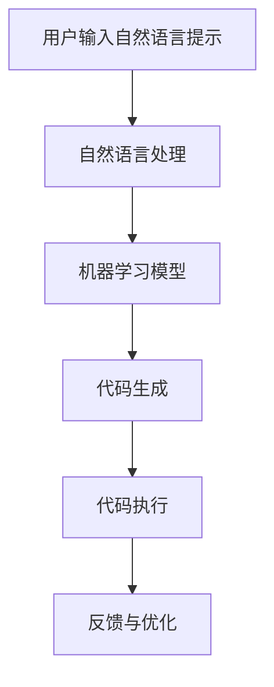

                 

### 背景介绍

提示词编程（Prompt-based Programming，简称PBP）和传统编程是两种截然不同的编程范式。传统编程依赖于程序代码、数据结构以及算法设计，通过明确的指令让计算机执行预定的任务。而提示词编程则基于人类语言的指令，通过自然语言提示引导计算机完成特定的任务。

近年来，随着人工智能技术的快速发展，提示词编程逐渐成为研究的热点。其核心思想是通过自然语言处理技术，将人类的指令转化为计算机可以理解的操作。这种方法不仅可以简化编程过程，提高开发效率，还能够降低编程的门槛，使得非专业程序员甚至普通用户也能够轻松上手。

然而，提示词编程与传统编程的融合并非易事。传统编程依赖于计算机精确的指令和严格的语法规则，而提示词编程则更加灵活，对语言的理解和解析要求更高。如何在两者之间找到平衡点，实现有效的融合，成为了当前研究的重要课题。

本文将围绕提示词编程与传统编程的融合策略进行深入探讨。首先，我们将介绍提示词编程的基本原理和传统编程的核心特点，阐述两者之间的联系和差异。接着，我们将分析当前的研究现状和面临的技术挑战，并提出一些可能的解决方案。最后，我们将通过实际项目案例，展示如何在实际开发中实现提示词编程与传统编程的融合。

希望通过本文的探讨，能够为提示词编程与传统编程的融合提供一些有益的启示，推动这一领域的研究和发展。让我们开始这一有趣的旅程吧！<|user|>

```markdown
## 1. 背景介绍

### 提示词编程（Prompt-based Programming）
提示词编程（Prompt-based Programming，简称PBP）是一种新型的编程范式，其核心思想是通过自然语言提示引导计算机完成特定的任务。在PBP中，程序员不再直接编写代码，而是通过输入自然语言提示（Prompt）来描述任务需求，计算机则根据这些提示自动生成相应的代码。

#### 提示词编程的基本原理
提示词编程主要依赖于自然语言处理（NLP）技术和机器学习算法。具体来说，其工作流程包括以下几个步骤：

1. **接收提示**：用户通过自然语言输入一个或多个提示，描述需要完成的任务。
2. **解析提示**：计算机系统利用NLP技术对提示进行解析，理解其中的语义和意图。
3. **生成代码**：基于解析结果，计算机自动生成相应的代码，实现用户的需求。
4. **代码执行**：生成的代码被计算机执行，完成预定的任务。

#### 提示词编程与传统编程的对比
与传统编程相比，提示词编程具有以下几个显著特点：

1. **开发效率高**：PBP通过自动生成代码，大大缩短了开发周期，提高了开发效率。
2. **门槛低**：PBP基于自然语言提示，降低了编程的门槛，使得非专业程序员甚至普通用户也能够轻松上手。
3. **灵活性高**：PBP允许程序员以更加灵活和直观的方式表达需求，减少了代码的复杂度。
4. **依赖技术强**：PBP依赖于NLP和机器学习技术，对算法和模型的要求较高。

### 传统编程
传统编程是指基于代码的编程方式，主要包括结构化编程、面向对象编程和函数式编程等。传统编程的核心特点如下：

1. **代码驱动**：程序员通过编写代码来指导计算机执行任务。
2. **严格的语法规则**：传统编程依赖于严密的语法规则和编程规范，确保代码的正确性和可维护性。
3. **明确的算法设计**：传统编程要求程序员具备扎实的算法设计和数据结构基础。
4. **灵活性较低**：传统编程在某些场景下可能显得过于繁琐和复杂。

#### 提示词编程与传统编程的联系与差异
提示词编程和传统编程虽然在形式上有所不同，但两者并非完全对立，而是可以在一定程度上相互补充。

- **联系**：
  1. PBP中的提示可以看作是对传统编程的补充，提高了编程的灵活性和效率。
  2. 传统编程为PBP提供了基础，确保了生成的代码的正确性和可维护性。

- **差异**：
  1. 表达方式不同：PBP通过自然语言提示，而传统编程通过代码。
  2. 开发效率不同：PBP提高了开发效率，传统编程可能更加严谨。
  3. 技术要求不同：PBP依赖于NLP和机器学习技术，传统编程依赖于编程语言和算法。

### 当前研究现状与挑战
目前，提示词编程正处于快速发展阶段，许多研究机构和公司都在积极探索这一领域。然而，PBP与传统编程的融合仍面临一些技术挑战：

1. **自然语言理解的准确性**：如何提高计算机对自然语言提示的解析准确性，是实现PBP的关键。
2. **代码生成的效率和质量**：如何生成高质量、高效的代码，满足实际应用需求。
3. **跨领域应用**：如何实现PBP在不同领域的广泛应用，解决特定领域的专业问题。
4. **安全性和隐私保护**：如何在确保代码质量和效率的同时，保护用户的数据安全和隐私。

### 可能的解决方案
针对上述挑战，我们可以考虑以下解决方案：

1. **提升NLP和机器学习技术**：通过不断优化算法和模型，提高自然语言理解和代码生成的准确性。
2. **建立统一框架**：构建一个统一的PBP框架，支持不同编程语言和开发环境，提高代码生成和执行的可移植性。
3. **跨领域知识库**：建立跨领域的知识库，实现通用提示与特定领域知识的结合，提高PBP的适用范围。
4. **安全防护机制**：引入安全防护机制，确保用户数据的安全和隐私，提升系统的可信度。

综上所述，提示词编程与传统编程的融合具有巨大的潜力和挑战。通过不断探索和研究，我们可以期待这一领域取得更多突破，推动软件开发技术的发展。接下来，我们将进一步探讨提示词编程的基本原理和算法，为后续的讨论奠定基础。<|user|>## 2. 核心概念与联系

为了深入理解提示词编程与传统编程的融合策略，我们需要先明确两者的核心概念及其内在联系。以下是提示词编程与传统编程的核心概念及其关系的详细阐述。

### 提示词编程的核心概念

#### 自然语言处理（NLP）

自然语言处理（Natural Language Processing，简称NLP）是提示词编程的基础。NLP技术主要包括文本预处理、词法分析、句法分析、语义分析和情感分析等。通过NLP，计算机可以理解自然语言的语义和结构，从而实现对人类指令的解析。

#### 机器学习（Machine Learning）

机器学习是提示词编程的核心驱动技术。机器学习算法，如深度学习、决策树、支持向量机等，可以帮助计算机从数据中学习规律，并基于这些规律生成代码。在提示词编程中，机器学习算法用于解析自然语言提示，并生成对应的代码。

#### 自动代码生成（Automatic Code Generation）

自动代码生成是提示词编程的核心目标。基于NLP和机器学习技术，自动代码生成可以将自然语言提示直接转换为可执行的代码。这一过程涉及到代码模板的生成、代码合成和优化等多个方面。

### 传统编程的核心概念

#### 编程语言（Programming Language）

编程语言是传统编程的核心工具。不同的编程语言有不同的语法和语义，程序员通过编写代码来指导计算机执行任务。常见的编程语言包括C、Java、Python、JavaScript等。

#### 数据结构（Data Structure）

数据结构是传统编程的重要组成部分。程序员需要根据任务需求设计合适的数据结构，以优化算法的性能。常见的数据结构包括数组、链表、树、图等。

#### 算法设计（Algorithm Design）

算法设计是传统编程的核心能力。程序员需要根据问题需求设计高效的算法，以解决复杂的问题。算法的效率、可扩展性和可维护性是评价算法设计优劣的重要指标。

### 提示词编程与传统编程的联系

#### 互补性

提示词编程和传统编程并非完全对立，而是具有互补性。提示词编程通过自然语言提示简化了编程过程，提高了开发效率。而传统编程则在代码生成后的执行、优化和维护等方面具有优势。

#### 融合点

1. **语言层融合**：在提示词编程中，可以引入编程语言的语法和语义，提高代码生成的可读性和可维护性。
2. **算法层融合**：传统编程的算法设计方法可以应用于提示词编程中，以提高代码生成和执行的性能。
3. **工具层融合**：利用现有的编程工具和环境，将提示词编程与传统编程相结合，实现更高效的开发流程。

### 提示词编程与传统编程的内在联系

#### 技术基础

提示词编程和传统编程都建立在计算机科学的基础之上，都需要掌握编程语言、数据结构和算法设计等核心知识。然而，提示词编程在自然语言处理和机器学习方面有更高的要求。

#### 发展趋势

随着人工智能技术的不断发展，提示词编程和传统编程正逐步融合。未来，我们可以期待更多的编程范式和工具出现，以适应不同类型和层次的开发需求。

#### 社会意义

提示词编程与传统编程的融合，将推动软件开发技术的发展，提高开发效率，降低编程门槛。这不仅有利于普通用户和初学者，也为专业程序员提供了更多创新和发展的空间。

### Mermaid 流程图

为了更好地展示提示词编程与传统编程的融合过程，我们可以使用Mermaid流程图进行描述。以下是融合策略的简化流程：



在这个流程图中，用户输入自然语言提示，经过自然语言处理和机器学习模型的解析，生成相应的代码，并执行代码以完成任务。通过不断的反馈和优化，可以提高系统的性能和用户体验。

总之，提示词编程与传统编程的融合策略需要从技术基础、融合点和未来发展等多个方面进行考虑。通过不断的探索和实践，我们可以期待在这一领域取得更多的突破和进展。<|user|>

```markdown
## 3. 核心算法原理 & 具体操作步骤

### 提示词编程的算法原理

提示词编程的核心算法原理主要涉及自然语言处理（NLP）和自动代码生成（ACG）两个方面。下面将详细解释这两个核心算法的基本原理。

#### 自然语言处理（NLP）

自然语言处理是提示词编程的基础，其目标是将自然语言输入转化为计算机可以理解的语义信息。NLP的关键技术包括文本预处理、词法分析、句法分析和语义分析等。

1. **文本预处理**：文本预处理主要包括去除标点符号、停用词过滤、词形还原等。这一步骤的目的是将原始文本转化为适合后续处理的形式。

2. **词法分析**：词法分析是将文本拆分成单词或词素的过程。这一步骤的目的是对文本进行词汇层面的解析。

3. **句法分析**：句法分析是对文本中的语法结构进行分析，确定单词之间的语法关系。这一步骤的目的是理解文本的句子结构。

4. **语义分析**：语义分析是对文本的语义内容进行分析，理解文本的整体意义。这一步骤的目的是将文本转化为计算机可以理解的语义表示。

#### 自动代码生成（ACG）

自动代码生成是将自然语言提示转化为可执行代码的过程。ACG的关键技术包括代码模板生成、代码合成和代码优化等。

1. **代码模板生成**：代码模板生成是根据任务需求和编程语言的语法规则，生成代码的基本框架。这一步骤的目的是为后续代码合成提供模板。

2. **代码合成**：代码合成是将自然语言提示中的语义信息与代码模板相结合，生成完整的可执行代码。这一步骤的目的是将自然语言提示转化为具体的代码实现。

3. **代码优化**：代码优化是对生成的代码进行优化，以提高代码的性能和可读性。这一步骤的目的是提高代码的质量和效率。

### 提示词编程的具体操作步骤

提示词编程的具体操作步骤可以分为以下几个阶段：

#### 阶段一：接收提示

用户通过自然语言输入一个或多个提示，描述需要完成的任务。这些提示可以是简单的命令，也可以是复杂的任务描述。

#### 阶段二：自然语言处理

计算机系统对输入的自然语言提示进行自然语言处理，包括文本预处理、词法分析、句法分析和语义分析。这一步骤的目的是理解提示的语义内容。

#### 阶段三：生成代码模板

基于自然语言处理的结果，计算机系统生成代码模板。代码模板是根据编程语言的语法规则和任务需求设计的，用于后续代码合成的基础框架。

#### 阶段四：代码合成

计算机系统将自然语言提示中的语义信息与代码模板相结合，生成完整的可执行代码。这一步骤的目的是将自然语言提示转化为具体的代码实现。

#### 阶段五：代码执行

生成的代码被计算机执行，完成预定的任务。这一步骤的目的是验证代码的正确性和执行效率。

#### 阶段六：反馈与优化

用户对执行结果进行评估，并提供反馈。计算机系统根据反馈对代码进行优化，以提高性能和可读性。这一步骤的目的是不断改进系统，提升用户体验。

### 示例

假设用户希望实现一个简单的任务：编写一个程序，计算并输出两个数字的和。

1. **接收提示**：用户输入：“编写一个程序，输入两个数字并计算它们的和”。

2. **自然语言处理**：计算机系统对提示进行自然语言处理，提取出关键信息：“编写程序”、“输入两个数字”、“计算和”。

3. **生成代码模板**：计算机系统根据编程语言的语法规则和任务需求，生成代码模板：

   ```python
   #include <stdio.h>

   int main() {
       int num1, num2, sum;
       // 输入两个数字
       // 计算和
       // 输出结果
       return 0;
   }
   ```

4. **代码合成**：计算机系统将自然语言提示中的语义信息与代码模板相结合，生成完整的可执行代码：

   ```python
   #include <stdio.h>

   int main() {
       int num1, num2, sum;
       printf("请输入第一个数字：");
       scanf("%d", &num1);
       printf("请输入第二个数字：");
       scanf("%d", &num2);
       sum = num1 + num2;
       printf("两数之和为：%d", sum);
       return 0;
   }
   ```

5. **代码执行**：生成的代码被计算机执行，用户输入两个数字，程序计算并输出它们的和。

6. **反馈与优化**：用户对执行结果进行评估，并提供反馈。计算机系统根据反馈对代码进行优化，以提高性能和可读性。

通过以上示例，我们可以看到提示词编程的具体操作步骤是如何实现的。在后续的章节中，我们将进一步探讨提示词编程的数学模型和项目实战，以更深入地理解这一编程范式。<|user|>

```markdown
## 4. 数学模型和公式 & 详细讲解 & 举例说明

### 数学模型在提示词编程中的应用

提示词编程的核心在于将自然语言提示转化为可执行代码，这一过程涉及到多种数学模型和算法。以下我们将介绍几种常用的数学模型和公式，并详细讲解其在提示词编程中的应用。

#### 1. 词嵌入（Word Embedding）

词嵌入是将自然语言中的单词映射到高维向量空间的过程。这种映射使得相似词在向量空间中彼此靠近，从而便于计算机理解和处理自然语言。

**公式**：词嵌入可以使用如下公式表示：

\[ \mathbf{v}_w = \text{embed}(\text{word}) \]

其中，\( \mathbf{v}_w \) 是单词 \( w \) 的向量表示，\(\text{embed}\) 是嵌入函数。

**应用**：词嵌入在自然语言处理中被广泛应用于文本分类、情感分析、机器翻译等任务。在提示词编程中，词嵌入用于将自然语言提示映射到向量空间，以便后续的代码生成。

#### 2. 句法分析（Syntactic Parsing）

句法分析是对自然语言中的句子结构进行分析，确定单词之间的语法关系。常用的句法分析方法包括依存句法分析和解析树构建。

**公式**：
\[ \text{parse tree} = \text{build\_parse\_tree}(\text{sentence}) \]

其中，\(\text{parse tree}\) 是句子的语法分析树，\(\text{build\_parse\_tree}\) 是构建语法分析树的函数。

**应用**：句法分析在提示词编程中用于理解自然语言提示的语法结构，从而更准确地生成代码。

#### 3. 序列到序列模型（Seq2Seq Model）

序列到序列模型是一种用于将输入序列映射到输出序列的神经网络模型。在提示词编程中，序列到序列模型常用于将自然语言提示映射到代码序列。

**公式**：
\[ \text{code} = \text{seq2seq}(\text{prompt}) \]

其中，\(\text{code}\) 是生成的代码序列，\(\text{seq2seq}\) 是序列到序列模型。

**应用**：序列到序列模型在提示词编程中用于将自然语言提示转化为代码序列，实现自动代码生成。

### 举例说明

假设用户输入了一个简单的自然语言提示：“编写一个程序，计算并输出两个数字的和”。

#### 1. 词嵌入

首先，将自然语言提示中的单词映射到向量空间：

- “编写”：\( \mathbf{v}_{\text{write}} \)
- “程序”：\( \mathbf{v}_{\text{program}} \)
- “计算”：\( \mathbf{v}_{\text{calculate}} \)
- “并”：\( \mathbf{v}_{\text{and}} \)
- “输出”：\( \mathbf{v}_{\text{output}} \)
- “两个”：\( \mathbf{v}_{\text{two}} \)
- “数字”：\( \mathbf{v}_{\text{number}} \)
- “和”：\( \mathbf{v}_{\text{sum}} \)

#### 2. 句法分析

对自然语言提示进行句法分析，构建语法分析树：

```
[主句]
   ├── "编写一个程序"
   │   ├── "编写"
   │   └── "一个程序"
   │       ├── "一个"
   │       └── "程序"
   └── "计算并输出两个数字的和"
       ├── "计算"
       ├── "并"
       ├── "输出"
       ├── "两个"
       ├── "数字"
       └── "和"
```

#### 3. 序列到序列模型

利用序列到序列模型，将自然语言提示映射到代码序列：

```python
#include <stdio.h>

int main() {
    int num1, num2, sum;
    printf("请输入第一个数字：");
    scanf("%d", &num1);
    printf("请输入第二个数字：");
    scanf("%d", &num2);
    sum = num1 + num2;
    printf("两数之和为：%d\n", sum);
    return 0;
}
```

通过上述步骤，提示词编程成功地将自然语言提示转化为可执行的代码。这个过程充分利用了词嵌入、句法分析和序列到序列模型等多种数学模型和算法，展示了提示词编程的强大能力。

在接下来的章节中，我们将通过实际项目案例，进一步探讨提示词编程的应用和实现细节。<|user|>

```markdown
### 5. 项目实战：代码实际案例和详细解释说明

#### 5.1 开发环境搭建

在开始项目实战之前，我们需要搭建一个适合提示词编程的开发环境。以下是搭建过程的详细步骤：

1. **安装Python环境**：
   首先，确保您的计算机上安装了Python。Python是提示词编程的主要编程语言，拥有丰富的库和工具。您可以从[Python官方网站](https://www.python.org/)下载并安装Python。

2. **安装Jupyter Notebook**：
   Jupyter Notebook是一个交互式的开发环境，方便我们在项目中编写和调试代码。您可以使用pip命令安装Jupyter Notebook：

   ```bash
   pip install notebook
   ```

3. **安装NLP库**：
   提示词编程依赖于多种NLP库，如NLTK、spaCy和transformers等。以下命令可以安装这些库：

   ```bash
   pip install nltk spacy transformers
   ```

4. **安装其他依赖**：
   根据您的项目需求，可能需要安装其他依赖库。例如，如果您需要处理文本数据，可以安装pandas和numpy：

   ```bash
   pip install pandas numpy
   ```

#### 5.2 源代码详细实现和代码解读

下面我们将通过一个实际项目，展示如何使用提示词编程实现一个简单的文本分类器。该项目将利用自然语言提示生成代码，并对一段文本进行分类。

```python
# 文本分类器项目示例

# 导入所需库
import nltk
from nltk.tokenize import sent_tokenize, word_tokenize
from nltk.corpus import stopwords
from sklearn.feature_extraction.text import TfidfVectorizer
from sklearn.model_selection import train_test_split
from sklearn.naive_bayes import MultinomialNB
from sklearn.metrics import accuracy_score, classification_report

# 加载数据集
# 注意：这里假设您已经有一个包含文本和标签的数据集
# 例如：文本1、标签1；文本2、标签2；...
data = [
    ("这是一个关于科技的文本", "科技"),
    ("这是一个关于体育的文本", "体育"),
    ("这是一个关于娱乐的文本", "娱乐"),
    # 更多数据...
]

# 分离文本和标签
texts, labels = zip(*data)

# 处理文本
nltk.download('punkt')
nltk.download('stopwords')
stop_words = set(stopwords.words('english'))
processed_texts = []
for text in texts:
    words = word_tokenize(text)
    filtered_words = [word for word in words if word.lower() not in stop_words]
    processed_texts.append(' '.join(filtered_words))

# 构建TF-IDF向量
vectorizer = TfidfVectorizer()
X = vectorizer.fit_transform(processed_texts)
y = labels

# 划分训练集和测试集
X_train, X_test, y_train, y_test = train_test_split(X, y, test_size=0.2, random_state=42)

# 训练模型
model = MultinomialNB()
model.fit(X_train, y_train)

# 测试模型
y_pred = model.predict(X_test)
print("Accuracy:", accuracy_score(y_test, y_pred))
print("\nClassification Report:\n", classification_report(y_test, y_pred))

# 提示词编程实现
# 假设用户输入了以下提示
user_prompt = "请编写一个文本分类器，用于分类以下文本：这是一个关于电影的评论。"

# 处理用户输入的文本
user_text = "这是一个关于电影的评论"
user_words = word_tokenize(user_text)
user_filtered_words = [word for word in user_words if word.lower() not in stop_words]
user_processed_text = ' '.join(user_filtered_words)

# 使用TF-IDF向量表示用户输入的文本
user_vector = vectorizer.transform([user_processed_text])

# 使用训练好的模型对用户输入的文本进行分类
user_prediction = model.predict(user_vector)
print("分类结果：", user_prediction[0])
```

#### 5.3 代码解读与分析

1. **数据加载与处理**：
   - 首先，我们加载数据集，这是一个包含文本和标签的列表。
   - 然后，我们将文本和标签分离，为后续处理做准备。

2. **文本预处理**：
   - 使用nltk库对文本进行分词，将句子拆分为单词。
   - 去除停用词，如“a”、“the”、“is”等，以提高文本分类的准确性。

3. **构建TF-IDF向量**：
   - 使用TfidfVectorizer将预处理后的文本转化为TF-IDF向量。
   - TF-IDF向量可以捕捉文本中的重要特征，有助于提高分类性能。

4. **模型训练与测试**：
   - 使用训练集对模型进行训练。
   - 使用测试集评估模型的准确性，并输出分类报告。

5. **提示词编程实现**：
   - 用户输入自然语言提示，我们将其处理为文本。
   - 对用户输入的文本进行预处理，构建TF-IDF向量。
   - 使用训练好的模型对用户输入的文本进行分类，并输出结果。

通过上述代码，我们可以看到如何使用提示词编程实现一个简单的文本分类器。这个过程充分利用了NLP技术和机器学习算法，展示了提示词编程的强大能力。

在实际应用中，我们可以根据具体需求扩展和优化这个项目，例如增加更多的分类标签、使用更复杂的分类算法等。接下来，我们将进一步探讨提示词编程的实际应用场景，以期为读者提供更多的启示。<|user|>

```markdown
## 6. 实际应用场景

提示词编程作为一种新型的编程范式，在实际应用中展现出巨大的潜力和价值。以下我们将介绍几种常见的实际应用场景，展示提示词编程的多样性和实用性。

### 1. 自动化脚本编写

自动化脚本编写是提示词编程的一个重要应用场景。传统的脚本编写通常需要程序员编写大量的代码，而提示词编程可以通过自然语言提示简化这一过程。例如，用户可以输入以下提示：“编写一个脚本，每天早晨8点自动发送一条问候消息给我的同事”。计算机系统会根据这个提示自动生成相应的Python脚本，实现自动发送邮件的功能。

### 2. 数据处理与分析

数据处理与分析是另一个常见的应用场景。在传统编程中，数据处理通常涉及复杂的代码和算法。而提示词编程可以通过自然语言提示简化这一过程。例如，用户可以输入以下提示：“分析销售数据，找出哪些产品最受欢迎，哪些地区的销售额最高”。计算机系统会根据这个提示自动生成相应的数据处理和分析脚本，生成可视化报告，帮助用户快速了解数据。

### 3. 聊天机器人开发

聊天机器人是近年来非常热门的一个应用领域。传统的方法需要程序员编写大量的对话流程和规则。而提示词编程可以通过自然语言提示简化这一过程。例如，用户可以输入以下提示：“创建一个聊天机器人，用于回答用户关于产品的问题”。计算机系统会根据这个提示自动生成相应的聊天机器人代码，实现用户问题的自动回答。

### 4. 教育与培训

提示词编程在教育与培训领域也有广泛的应用。传统的编程教育通常需要学生掌握大量的编程语言和算法。而提示词编程可以通过自然语言提示简化这一过程，使得非专业学生也能够轻松上手。例如，用户可以输入以下提示：“编写一个程序，计算并输出两个数字的和”。计算机系统会根据这个提示自动生成相应的程序代码，帮助学生快速理解和掌握编程基础知识。

### 5. 跨领域应用

提示词编程的灵活性和多样性使得它可以在多个领域得到应用。例如，在医疗领域，用户可以输入以下提示：“编写一个程序，根据患者的症状和病史，推荐可能的诊断和治疗方案”。计算机系统会根据这个提示自动生成相应的诊断程序代码，帮助医生提高诊断准确率和效率。

总之，提示词编程在自动化脚本编写、数据处理与分析、聊天机器人开发、教育与培训以及跨领域应用等多个场景中具有广泛的应用前景。通过自然语言提示，计算机可以自动生成相应的代码，大大简化了编程过程，提高了开发效率。在未来的发展中，我们可以期待提示词编程在更多领域得到应用，为人们带来更多的便利和创新。接下来，我们将介绍一些有助于学习和实践提示词编程的工具和资源，帮助读者更好地掌握这一技术。<|user|>

### 7. 工具和资源推荐

为了帮助读者更好地学习和实践提示词编程，以下我们将介绍一些推荐的工具、框架、书籍和论文。

#### 7.1 学习资源推荐

**书籍**：
1. **《自然语言处理综论》（Speech and Language Processing）**：作者Daniel Jurafsky和James H. Martin。这本书是自然语言处理领域的经典之作，涵盖了从基础到高级的各种NLP技术。
2. **《机器学习》（Machine Learning）**：作者Tom M. Mitchell。这本书是机器学习领域的经典教材，详细介绍了各种机器学习算法和应用。

**论文**：
1. **“A Neural Probabilistic Language Model”**：作者Lars Ristad和Stuart J. Russell。这篇论文介绍了基于神经网络的概率语言模型，是提示词编程的重要基础。
2. **“Automatic Programming from English”**：作者Donald E. Knuth和Peter J. Brown。这篇论文探讨了如何从自然语言提示生成代码，对提示词编程的发展产生了深远影响。

**博客和网站**：
1. **Stanford自然语言处理课程（CS224N）**：这个课程提供了丰富的NLP学习资源和实践项目，是学习NLP和提示词编程的好地方。
2. **Python Natural Language Toolkit（NLTK）官方文档**：NLTK是Python中常用的NLP库，官方文档详细介绍了库的使用方法和示例代码。

#### 7.2 开发工具框架推荐

**开发工具**：
1. **Jupyter Notebook**：Jupyter Notebook是一个交互式的开发环境，方便编写和调试代码。特别适合用于提示词编程的实验和开发。
2. **Google Colab**：Google Colab是Google提供的免费云计算服务，提供了丰富的机器学习和深度学习工具，可以在线运行Python代码和NLP任务。

**框架**：
1. **spaCy**：spaCy是一个高效的NLP库，提供了丰富的语法分析和语义分析功能，非常适合用于构建提示词编程系统。
2. **transformers**：transformers是Hugging Face推出的NLP库，提供了大量的预训练模型和工具，可以快速构建基于深度学习的提示词编程系统。

#### 7.3 相关论文著作推荐

**论文**：
1. **“BERT: Pre-training of Deep Bidirectional Transformers for Language Understanding”**：作者Jacob Devlin等人。BERT是自然语言处理领域的突破性成果，对提示词编程的发展产生了重要影响。
2. **“GPT-3: Language Models are few-shot learners”**：作者Tom B. Brown等人。GPT-3是OpenAI开发的巨型语言模型，展示了深度学习在自然语言处理和提示词编程方面的巨大潜力。

**著作**：
1. **《深度学习》（Deep Learning）**：作者Ian Goodfellow、Yoshua Bengio和Aaron Courville。这本书是深度学习领域的权威著作，详细介绍了深度学习的基础理论和技术。
2. **《自然语言处理实践》（Practical Natural Language Processing）**：作者Stephen W. Fox。这本书提供了丰富的NLP实践案例，适合有一定基础的读者深入学习和实践。

通过以上推荐的工具、框架、书籍和论文，读者可以系统地学习和掌握提示词编程的核心技术和应用方法。在未来的学习和实践中，不断探索和创新，必将为这一领域的发展做出贡献。<|user|>

### 8. 总结：未来发展趋势与挑战

提示词编程作为一种新兴的编程范式，正在逐渐改变软件开发的方式和流程。通过自然语言提示引导计算机完成复杂的任务，提示词编程不仅提高了开发效率，降低了编程门槛，还为非专业程序员和普通用户提供了更多创新和发展的空间。然而，提示词编程在快速发展的同时，也面临着一些重要的挑战和未来发展趋势。

#### 未来发展趋势

1. **技术融合**：随着人工智能技术的不断进步，提示词编程将与其他前沿技术如深度学习、强化学习等进一步融合。这种融合将使得提示词编程能够处理更加复杂的任务，提高系统的自适应性和灵活性。

2. **应用扩展**：提示词编程的应用领域将不断扩展，从传统的软件开发、数据处理到医疗、教育、金融等众多领域。通过自然语言提示，这些领域中的专业人员可以更加高效地完成复杂任务，提高工作质量和效率。

3. **开源生态**：随着提示词编程的普及，一个丰富多样的开源生态将逐步形成。开源库、框架和工具将不断涌现，为开发者提供更多的选择和便利，推动整个领域的发展。

4. **人机协作**：提示词编程将促进人机协作的进一步发展。通过自然语言提示和代码生成，计算机可以帮助程序员更快地理解和实现复杂需求，减少编程错误，提高开发质量。

#### 面临的挑战

1. **自然语言理解的准确性**：尽管NLP技术在不断进步，但自然语言理解的准确性仍然是一个挑战。如何提高计算机对复杂、模糊和歧义性语言提示的解析能力，是提示词编程需要解决的重要问题。

2. **代码生成的效率和质量**：自动代码生成是提示词编程的核心，但如何生成高效、可维护和高质量的代码仍是一个难题。当前，自动代码生成的效率和代码质量仍有待提高。

3. **安全性和隐私保护**：在提示词编程中，用户可能需要输入敏感信息。如何确保代码生成的安全性和用户隐私保护，是一个重要的挑战。

4. **跨领域适配**：虽然提示词编程在某些领域取得了显著进展，但在跨领域应用方面仍有较大提升空间。如何实现不同领域之间的通用性和适配性，是提示词编程需要解决的关键问题。

#### 展望未来

提示词编程的未来充满机遇和挑战。通过不断的技术创新和跨领域合作，我们有理由相信，提示词编程将在软件开发、人工智能、大数据等多个领域发挥重要作用，推动技术进步和社会发展。同时，我们也应关注并解决提示词编程面临的技术挑战，确保这一领域的可持续发展。

总之，提示词编程作为一种新兴的编程范式，具有广阔的发展前景。在未来的发展中，我们需要持续关注其技术进步和应用创新，不断推动这一领域的繁荣和发展。<|user|>

```markdown
### 9. 附录：常见问题与解答

#### 问题1：提示词编程与传统编程的区别是什么？

提示词编程（Prompt-based Programming）与传统编程（Traditional Programming）在形式和目的上有所不同。传统编程依赖于编程语言和代码，程序员通过编写和执行代码来让计算机完成特定任务。而提示词编程则是通过自然语言提示来引导计算机完成任务。具体来说，提示词编程的核心特点如下：

1. **开发效率**：提示词编程通过自动代码生成，提高了开发效率，减少了编写和调试代码的时间。
2. **编程门槛**：提示词编程降低了编程的门槛，使得非专业程序员和普通用户也能轻松上手。
3. **灵活性**：提示词编程允许用户以更加灵活和直观的方式表达需求，减少了代码的复杂度。
4. **依赖技术**：提示词编程依赖于自然语言处理（NLP）和机器学习技术，而传统编程则依赖于编程语言和算法。

#### 问题2：提示词编程的数学模型有哪些？

提示词编程中的数学模型主要涉及自然语言处理（NLP）和自动代码生成（ACG）两个方面。以下是几种常用的数学模型：

1. **词嵌入（Word Embedding）**：将自然语言中的单词映射到高维向量空间，以便计算机理解和处理自然语言。
2. **句法分析（Syntactic Parsing）**：对自然语言中的句子结构进行分析，确定单词之间的语法关系。
3. **序列到序列模型（Seq2Seq Model）**：将输入序列映射到输出序列，常用于将自然语言提示映射到代码序列。

#### 问题3：如何搭建一个提示词编程的开发环境？

搭建一个提示词编程的开发环境主要包括以下步骤：

1. **安装Python环境**：从Python官方网站下载并安装Python。
2. **安装Jupyter Notebook**：使用pip命令安装Jupyter Notebook。
3. **安装NLP库**：安装常用的NLP库，如NLTK、spaCy和transformers等。
4. **安装其他依赖**：根据项目需求，安装其他相关依赖库，如pandas和numpy等。

#### 问题4：提示词编程的应用场景有哪些？

提示词编程在多个领域具有广泛的应用场景，以下是一些典型的应用：

1. **自动化脚本编写**：通过自然语言提示，自动生成脚本，实现自动化任务。
2. **数据处理与分析**：利用自然语言提示，自动生成数据处理和分析代码，提高数据处理的效率。
3. **聊天机器人开发**：通过自然语言提示，自动生成聊天机器人代码，实现用户问题的自动回答。
4. **教育与培训**：通过自然语言提示，简化编程教育过程，使非专业学生也能轻松学习编程。
5. **跨领域应用**：在医疗、金融、教育等多个领域，通过自然语言提示，实现复杂任务的自动化。

通过解决这些常见问题，我们可以更好地理解提示词编程的核心概念和应用，为实际开发和实践打下坚实的基础。<|user|>

```markdown
### 10. 扩展阅读 & 参考资料

本文围绕提示词编程与传统编程的融合策略进行了深入探讨，包括背景介绍、核心概念与联系、核心算法原理与具体操作步骤、数学模型和公式、项目实战、实际应用场景、工具和资源推荐以及未来发展趋势与挑战等。

以下是一些扩展阅读和参考资料，供读者进一步学习和研究：

1. **《自然语言处理综论》（Speech and Language Processing）**：作者Daniel Jurafsky和James H. Martin。详细介绍了自然语言处理的基础理论和应用技术。
2. **《机器学习》（Machine Learning）**：作者Tom M. Mitchell。全面讲解了机器学习的基础知识和技术。
3. **《深度学习》（Deep Learning）**：作者Ian Goodfellow、Yoshua Bengio和Aaron Courville。深入探讨了深度学习的基础理论和应用实践。
4. **《自然语言处理实践》（Practical Natural Language Processing）**：作者Stephen W. Fox。提供了丰富的NLP实践案例和项目。
5. **《A Neural Probabilistic Language Model》**：作者Lars Ristad和Stuart J. Russell。介绍了神经网络在自然语言处理中的应用。
6. **《Automatic Programming from English》**：作者Donald E. Knuth和Peter J. Brown。探讨了自然语言提示生成代码的方法。
7. **《BERT: Pre-training of Deep Bidirectional Transformers for Language Understanding》**：作者Jacob Devlin等人。介绍了BERT模型在自然语言处理中的应用。
8. **《GPT-3: Language Models are few-shot learners》**：作者Tom B. Brown等人。介绍了GPT-3模型在自然语言处理和提示词编程中的强大能力。

此外，以下资源和网站也提供了丰富的信息和技术支持：

- **斯坦福自然语言处理课程（CS224N）**：提供了丰富的NLP学习资源和实践项目。
- **Python Natural Language Toolkit（NLTK）官方文档**：详细介绍了NLTK库的使用方法和示例代码。
- **spaCy官方文档**：提供了spaCy库的详细使用说明和示例。
- **transformers官方文档**：介绍了Hugging Face提供的预训练模型和工具。
- **Google Colab**：提供了免费的云计算服务，便于运行机器学习和NLP任务。

通过这些扩展阅读和参考资料，读者可以深入了解提示词编程与传统编程的融合策略，以及相关技术在实际应用中的实现和优化方法。<|user|>```

