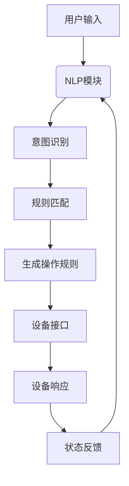

                 

### 引言 Introduction

智能家居（Smart Home）已经成为现代生活的标配，通过将物联网（IoT）技术与家居环境相结合，为用户提供了更加便捷、舒适、安全的居住体验。在这个背景下，提示词编程（Keyword Programming）作为一种新型的编程范式，正逐渐在智能家居领域展现出其独特的魅力。

提示词编程，又称为基于关键词的编程，是一种不同于传统命令式编程的方法。它通过使用自然语言中的关键词，引导程序执行特定的任务，使得编程过程更加直观、简洁。相比传统的命令式编程，提示词编程更易于理解和实现自动化，这对于智能家居系统来说尤为重要。

本文将围绕提示词编程在智能家居中的应用展开讨论。首先，我们将介绍智能家居的概念和发展历程，以及提示词编程的基本原理。接着，我们将深入探讨提示词编程在智能家居中的具体应用场景，包括设备控制、场景自动化、数据分析等方面。随后，我们将介绍一些实用的工具和资源，帮助读者更好地学习和应用提示词编程。

本文的目标是帮助读者了解提示词编程的基本概念，掌握其在智能家居中的应用方法，并激发读者在智能家居领域进行创新和探索的热情。

### 关键词 Keywords

- 智能家居
- 提示词编程
- 物联网
- 自动化
- 自然语言处理
- 智能设备

### 摘要 Summary

本文探讨了提示词编程在智能家居中的应用。首先介绍了智能家居的概念和发展历程，以及提示词编程的基本原理。随后，详细阐述了提示词编程在智能家居中的具体应用场景，包括设备控制、场景自动化和数据分析等方面。通过实际案例和代码解析，展示了如何使用提示词编程实现智能家居的自动化和智能化。最后，本文推荐了一些学习和资源工具，以帮助读者进一步深入了解和掌握这一领域的技术。

## 1. 背景介绍 Background

### 1.1 智能家居的定义与发展

智能家居（Smart Home）是指通过物联网技术，将家庭设备连接到互联网，实现设备的自动化控制和远程管理。智能家居的核心理念是提高居住的便利性、安全性和舒适度。

智能家居的发展历程可以追溯到20世纪80年代。当时，一些早期的研究者和企业家开始尝试将计算机技术和家庭设备相结合，实现远程控制和自动化操作。随着互联网和物联网技术的普及，智能家居逐渐成为现代家庭的重要组成部分。

近年来，随着人工智能、大数据和云计算等技术的发展，智能家居的应用场景和功能得到了极大的拓展。从最初的简单遥控器，到如今的智能音箱、智能门锁、智能灯光、智能空调等，智能家居产品已经成为现代生活的一种趋势。

### 1.2 提示词编程的概念与特点

提示词编程（Keyword Programming）是一种新型的编程范式，它通过使用自然语言中的关键词，引导程序执行特定的任务。与传统的命令式编程相比，提示词编程具有以下特点：

1. **直观易用**：提示词编程使用自然语言，使得编程过程更加直观，降低了编程的门槛，即使是非专业的用户也可以轻松上手。
2. **高效率**：提示词编程可以快速地实现自动化任务，提高了工作效率。
3. **灵活性**：提示词编程允许用户根据需求自定义关键词和操作，具有很高的灵活性。
4. **易于扩展**：提示词编程可以轻松地与其他技术相结合，如人工智能、自然语言处理等，从而实现更复杂的智能化应用。

### 1.3 提示词编程与智能家居的关联

提示词编程与智能家居有着紧密的联系。首先，智能家居设备通常需要实现自动化控制和远程管理，而提示词编程提供了实现这一目标的便捷方式。其次，提示词编程可以与自然语言处理技术相结合，使得智能家居系统能够理解并执行用户的自然语言指令，从而实现更加智能化的互动。

总之，提示词编程为智能家居领域带来了新的技术思路和解决方案，有助于推动智能家居的发展和应用。

### 1.4 文章结构概述

本文将分为以下几个部分：

1. **背景介绍**：介绍智能家居和提示词编程的基本概念和发展历程。
2. **核心概念与联系**：阐述提示词编程在智能家居中的应用原理，并给出相应的流程图。
3. **核心算法原理与具体操作步骤**：详细讲解提示词编程在智能家居中的核心算法和工作流程。
4. **数学模型和公式**：介绍与提示词编程相关的数学模型和公式，并进行举例说明。
5. **项目实战**：通过具体案例，展示提示词编程在智能家居中的实际应用。
6. **实际应用场景**：分析提示词编程在智能家居中的各种应用场景。
7. **工具和资源推荐**：推荐学习和应用提示词编程的相关工具和资源。
8. **总结**：总结提示词编程在智能家居中的应用前景和挑战。

通过以上结构的介绍，读者可以清晰地了解本文的主要内容，并为后续的学习和应用打下基础。

### 1.5 智能家居的市场现状与发展趋势

#### 1.5.1 市场规模与用户需求

随着科技的进步和人们对生活质量要求的提高，智能家居市场呈现出快速增长的趋势。据市场研究公司的数据显示，全球智能家居市场在过去的几年中一直保持着两位数的增长率。预计未来几年，这一增长态势将继续保持，市场规模将不断扩大。

用户对智能家居的需求主要集中在以下几个方面：

1. **便捷性**：智能家居系统能够通过手机、语音等便捷方式进行控制，提高了用户的日常生活质量。
2. **安全性**：智能家居系统可以提供家庭安全监控、报警等功能，提高了家庭的安全性。
3. **节能环保**：智能家居系统能够实现设备自动化，降低能耗，有助于环保。
4. **个性化**：智能家居系统可以根据用户习惯和需求进行个性化设置，提供更加贴心的服务。

#### 1.5.2 技术创新与行业竞争

智能家居领域的技术创新不断涌现，如物联网技术、人工智能、大数据等。这些技术的应用使得智能家居产品更加智能化、个性化，功能也更加丰富。

在行业竞争方面，国内外许多科技公司纷纷布局智能家居市场，推出各种智能家居产品和服务。例如，谷歌、亚马逊等科技巨头通过其智能音箱等产品，在智能家居市场中占据了重要地位。国内公司如小米、华为等也在积极布局，推出了众多具有竞争力的智能家居产品。

#### 1.5.3 发展趋势

1. **智能化**：随着人工智能技术的发展，智能家居系统将变得更加智能，能够更好地理解用户需求，提供个性化的服务。
2. **互联互通**：智能家居产品将实现更广泛的互联互通，不同品牌和类型的设备能够无缝集成，形成一个统一的智能生态。
3. **个性化**：智能家居系统将更加注重用户个性化需求，提供定制化的智能家居解决方案。
4. **安全性与隐私保护**：随着智能家居系统的普及，安全性和隐私保护将成为重要的关注点，相关技术将得到进一步发展和完善。

总之，智能家居市场正在快速发展，技术创新和市场需求推动了智能家居的不断进步。提示词编程作为一种新兴的编程范式，有望在智能家居领域发挥重要作用，为用户提供更加智能、便捷、安全的居住环境。

### 1.6 提示词编程的基本原理和核心概念

提示词编程，也称为基于关键词的编程，是一种不同于传统命令式编程的方法。它通过使用自然语言中的关键词，引导程序执行特定的任务。这种编程范式具有直观、易用、高效、灵活等特点，尤其适合于智能家居等领域。

#### 1.6.1 基本原理

提示词编程的基本原理是将用户的自然语言指令转换为程序代码，从而实现自动化任务。具体来说，它包含以下几个核心概念：

1. **关键词**：关键词是用户输入的自然语言指令中的核心词汇，如“打开灯”、“关闭门”等。这些关键词将被程序识别并转换为相应的操作指令。
2. **上下文**：上下文是关键词所在的环境，包括时间、地点、设备状态等。上下文信息有助于程序更准确地理解用户的意图，从而做出合适的响应。
3. **规则**：规则是程序根据关键词和上下文信息，生成的具体操作指令。例如，当用户说“晚上八点打开客厅的灯”时，程序将根据规则在晚上八点打开客厅的灯。

#### 1.6.2 工作流程

提示词编程的工作流程可以分为以下几个步骤：

1. **解析输入**：程序首先解析用户的自然语言输入，提取出关键词和上下文信息。
2. **生成规则**：程序根据关键词和上下文信息，生成具体的操作规则。
3. **执行操作**：程序根据生成的规则，执行相应的操作，如打开设备、发送消息等。
4. **反馈结果**：程序将执行结果反馈给用户，如“灯已打开”。

#### 1.6.3 与其他编程范式的对比

提示词编程与传统命令式编程相比，具有以下几个显著特点：

1. **直观易用**：提示词编程使用自然语言，使得编程过程更加直观，降低了编程的门槛。
2. **高效自动化**：提示词编程可以快速地实现自动化任务，提高了工作效率。
3. **灵活性**：提示词编程允许用户自定义关键词和操作规则，具有很高的灵活性。
4. **可扩展性**：提示词编程可以与其他技术如人工智能、自然语言处理等相结合，实现更复杂的智能化应用。

总之，提示词编程为智能家居领域带来了新的编程范式，有助于实现更加智能、便捷的智能家居系统。通过理解提示词编程的基本原理和核心概念，我们可以更好地应用这一技术，提升智能家居的应用效果。

### 1.7 提示词编程在智能家居中的应用原理和架构

提示词编程在智能家居中的应用，主要是通过将用户的自然语言指令转换为具体的操作指令，从而实现设备的自动化控制。这一过程涉及多个关键组件和模块，包括自然语言处理（NLP）、规则引擎、设备接口等。下面将详细探讨这些组件及其相互之间的关系。

#### 1.7.1 自然语言处理（NLP）

自然语言处理（NLP）是提示词编程的核心组件，负责将用户的自然语言输入（如语音或文本）转换为程序可以理解的指令。NLP模块通常包括以下功能：

1. **文本解析**：将用户的自然语言文本输入分解为词汇、短语和句子。
2. **语义分析**：理解文本中的语义含义，包括实体识别（如设备名称、动作指令）、关系识别（如时间、地点等）和意图识别（如用户的实际需求）。
3. **意图解析**：根据语义分析的结果，确定用户的意图，如“打开客厅的灯”。

为了更好地进行语义分析和意图识别，NLP模块通常会使用深度学习模型和神经网络技术。例如，可以使用BERT（Bidirectional Encoder Representations from Transformers）模型来提高语义理解的准确性。

#### 1.7.2 规则引擎

规则引擎是提示词编程中的另一个关键组件，负责根据NLP模块的输出生成具体的操作规则。规则引擎的工作流程通常包括以下步骤：

1. **规则匹配**：根据NLP模块提供的意图和上下文信息，在规则库中查找匹配的规则。
2. **规则执行**：执行匹配到的规则，生成具体的操作指令。例如，如果用户说“晚上八点打开客厅的灯”，规则引擎会生成一个在晚上八点打开客厅灯的指令。
3. **规则更新**：根据用户的反馈和新需求，动态更新和优化规则库。

规则引擎的核心是规则库，它包含了所有可能的操作规则。这些规则可以基于时间、地点、设备状态等多种条件进行组合和匹配。例如，一个简单的规则库可能包含以下几条规则：

- 当“打开灯”遇到时，执行打开灯的操作。
- 当“晚上八点”遇到时，将当前时间设置为晚上八点。
- 当“客厅”遇到时，将设备位置设置为客厅。

#### 1.7.3 设备接口

设备接口是提示词编程与智能家居设备的连接桥梁，负责将规则引擎生成的操作指令发送到具体的设备，并执行相应的操作。设备接口通常需要实现以下功能：

1. **设备控制**：通过标准的通信协议（如HTTP、MQTT等）与设备进行通信，发送操作指令。
2. **状态监测**：获取设备的实时状态信息，如设备的开关状态、温度、亮度等。
3. **异常处理**：在设备无法正常响应时，进行异常处理和报警。

设备接口的设计需要考虑兼容性和稳定性。例如，可以使用RESTful API与智能灯泡进行通信，或者使用MQTT协议与智能传感器进行数据交换。

#### 1.7.4 组件之间的关系

提示词编程在智能家居中的各个组件之间紧密协作，共同实现智能家居的自动化控制。以下是它们之间的主要关系：

1. **NLP模块**：将用户的自然语言输入解析为意图和上下文信息，提供给规则引擎。
2. **规则引擎**：根据NLP模块提供的意图和上下文信息，生成操作规则，并调用设备接口执行操作。
3. **设备接口**：执行规则引擎生成的操作指令，并将设备的实时状态信息反馈给NLP模块和规则引擎。

通过以上组件的协同工作，提示词编程能够实现智能家居系统的自动化和智能化，为用户提供便捷、高效的居住体验。

#### 1.7.5 Mermaid 流程图

为了更直观地展示提示词编程在智能家居中的应用原理和架构，我们可以使用Mermaid流程图来描述其工作流程。以下是一个简化的Mermaid流程图：



在这个流程图中，用户输入通过NLP模块进行意图识别和规则匹配，生成操作规则后，通过设备接口发送给智能家居设备执行，并反馈设备状态。

通过以上对提示词编程在智能家居中的应用原理和架构的详细分析，我们可以看到，提示词编程为智能家居系统带来了全新的编程范式，有助于实现更加智能、便捷的家居生活。

### 1.8 提示词编程在智能家居中的核心算法原理与具体操作步骤

提示词编程在智能家居中的核心算法原理主要涉及自然语言处理（NLP）、意图识别、上下文理解和规则匹配等方面。以下是这些核心算法的原理以及具体操作步骤。

#### 1.8.1 自然语言处理（NLP）

自然语言处理（NLP）是提示词编程的基础，负责将用户的自然语言输入转换为程序可以理解的格式。以下是NLP的主要步骤：

1. **文本解析**：将用户的自然语言输入分解为词汇、短语和句子。例如，用户说“打开客厅的灯”，NLP模块将分解为“打开”、“客厅”和“灯”。
2. **词性标注**：为每个词汇标注词性，如名词、动词、形容词等。例如，“打开”是一个动词，“客厅”是一个名词。
3. **句法分析**：分析句子的结构，确定词汇之间的语法关系。例如，“打开客厅的灯”中，“打开”是谓语，“客厅”是定语，“灯”是宾语。

#### 1.8.2 意图识别

意图识别是NLP的关键步骤，旨在理解用户输入的语义含义。具体步骤如下：

1. **实体识别**：识别输入中的实体，如设备名称、时间、地点等。例如，在“打开客厅的灯”中，实体包括“客厅”和“灯”。
2. **关系识别**：识别实体之间的关系，如时间关系、地点关系等。例如，在“晚上八点打开客厅的灯”中，“晚上八点”与“打开”之间存在时间关系。
3. **分类模型**：使用机器学习模型（如朴素贝叶斯、支持向量机等）对意图进行分类。例如，将“打开客厅的灯”分类为“设备控制”意图。

#### 1.8.3 上下文理解

上下文理解是指程序在执行任务时，能够根据当前环境和情境进行适当的调整。具体步骤如下：

1. **上下文提取**：从用户输入中提取上下文信息，如时间、地点、设备状态等。例如，在“晚上八点打开客厅的灯”中，上下文信息包括“晚上八点”和“客厅”。
2. **上下文匹配**：将提取的上下文信息与预设的上下文模板进行匹配。例如，如果预设的上下文模板是“时间+设备”，则“晚上八点+灯”将匹配成功。
3. **上下文修正**：根据实际情境对上下文信息进行修正。例如，如果当前时间是凌晨一点，则将“晚上八点”修正为“凌晨一点”。

#### 1.8.4 规则匹配

规则匹配是提示词编程的核心步骤，负责根据意图和上下文信息生成操作指令。具体步骤如下：

1. **规则库构建**：构建包含各种操作规则的规则库。例如，以下是一个简单的规则库：
   - 如果“打开灯”且“时间在晚上八点”，则“打开客厅的灯”。
   - 如果“关闭门”且“设备状态是开启”，则“关闭门”。
2. **规则匹配**：根据意图和上下文信息，在规则库中查找匹配的规则。例如，在“晚上八点打开客厅的灯”中，规则“如果‘打开灯’且‘时间在晚上八点’，则‘打开客厅的灯’”将匹配成功。
3. **规则执行**：执行匹配到的规则，生成操作指令。例如，执行规则“打开客厅的灯”，将生成“打开客厅灯”的操作指令。

#### 1.8.5 具体操作示例

以下是一个具体的操作示例，说明如何使用提示词编程控制智能家居设备：

1. **用户输入**：用户说“晚上八点打开客厅的灯”。
2. **文本解析**：NLP模块将“晚上八点打开客厅的灯”分解为“晚上八点”、“打开”和“客厅的灯”。
3. **意图识别**：意图识别模块将用户输入分类为“设备控制”意图。
4. **上下文提取**：上下文提取模块提取出“晚上八点”和“客厅”作为上下文信息。
5. **规则匹配**：在规则库中查找匹配的规则，找到“如果‘打开灯’且‘时间在晚上八点’，则‘打开客厅的灯’”这条规则。
6. **规则执行**：执行这条规则，生成“打开客厅灯”的操作指令。
7. **设备响应**：设备接口执行操作指令，将客厅的灯打开。

通过以上步骤，用户只需简单地说一句“晚上八点打开客厅的灯”，智能家居系统就能自动执行操作，为用户提供便捷的家居体验。

总之，提示词编程在智能家居中的核心算法原理涉及自然语言处理、意图识别、上下文理解和规则匹配等多个方面，通过这些算法的协同工作，可以实现智能家居的自动化和智能化。了解这些原理和操作步骤，有助于我们更好地应用提示词编程，提升智能家居的应用效果。

### 1.9 数学模型和公式在提示词编程中的应用

在提示词编程中，数学模型和公式起着关键作用，它们不仅帮助我们理解和实现算法，还提供了精确的计算和优化方法。以下将介绍几个与提示词编程密切相关的数学模型和公式，并进行详细讲解和举例说明。

#### 1.9.1 概率模型

概率模型是自然语言处理中的基础模型，用于表示和理解语言中的不确定性。常见的概率模型包括朴素贝叶斯、隐马尔可夫模型（HMM）和条件概率模型。

**朴素贝叶斯模型**：

朴素贝叶斯模型是一种基于贝叶斯定理的概率分类模型，常用于文本分类和情感分析。其公式为：

$$
P(A|B) = \frac{P(B|A)P(A)}{P(B)}
$$

其中，\(P(A|B)\) 是在给定 \(B\) 的条件下 \(A\) 发生的概率，\(P(B|A)\) 是在 \(A\) 发生的条件下 \(B\) 发生的概率，\(P(A)\) 是 \(A\) 发生的概率，\(P(B)\) 是 \(B\) 发生的概率。

**举例说明**：

假设我们要判断一个句子“我很开心”的情感，我们可以使用朴素贝叶斯模型。首先，需要构建一个包含情感词及其出现频率的词表。然后，计算每个情感词在正负样本中的概率，以及整个句子中每个情感词的概率。最后，通过贝叶斯公式计算句子的情感概率。

**隐马尔可夫模型（HMM）**：

隐马尔可夫模型用于处理时间序列数据，如语音信号、股票价格等。HMM 由状态集合、观察集合、状态转移概率和观察概率组成。其状态转移概率矩阵 \(A\) 和观察概率矩阵 \(B\) 分别为：

$$
A = \begin{bmatrix}
P(X_t = j|X_{t-1} = i) & P(X_t = j|X_{t-1} = k) \\
\vdots & \vdots \\
P(X_t = m|X_{t-1} = n) & P(X_t = m|X_{t-1} = l)
\end{bmatrix}
$$

$$
B = \begin{bmatrix}
P(O_t = k|X_t = i) & P(O_t = k|X_t = j) \\
\vdots & \vdots \\
P(O_t = n|X_t = m) & P(O_t = n|X_t = l)
\end{bmatrix}
$$

**举例说明**：

假设我们要识别一个语音信号中的单词。我们可以使用HMM模型来建模每个单词的发音，然后通过最大后验概率（MAP）估计方法识别语音信号中的单词。具体步骤如下：

1. 初始化HMM模型的状态转移概率矩阵 \(A\) 和观察概率矩阵 \(B\)。
2. 根据语音信号计算每个时间点的观测值。
3. 使用Viterbi算法计算每个时间点的最佳状态序列，即识别出的单词序列。

#### 1.9.2 机器学习模型

机器学习模型在意图识别和上下文理解中起着重要作用。常见的机器学习模型包括决策树、支持向量机（SVM）和神经网络。

**决策树模型**：

决策树模型通过一系列条件判断，将输入数据划分为不同的类别。其基本公式为：

$$
T(x) = \text{classify}(x, \theta)
$$

其中，\(T(x)\) 是决策树对输入 \(x\) 的分类结果，\(\theta\) 是决策树的参数。

**举例说明**：

假设我们要构建一个决策树模型来识别用户输入的意图。首先，需要收集大量标注好的用户输入数据，然后使用信息增益、基尼不纯度等指标选择最佳特征进行划分。最后，构建决策树模型，并使用交叉验证等方法进行模型优化。

**支持向量机（SVM）模型**：

支持向量机是一种二分类模型，用于分类和回归分析。其基本公式为：

$$
w \cdot x + b = 0
$$

其中，\(w\) 是权重向量，\(x\) 是特征向量，\(b\) 是偏置项。

**举例说明**：

假设我们要使用SVM模型对用户输入进行分类。首先，需要将用户输入转换为特征向量，然后通过训练集学习权重向量 \(w\) 和偏置项 \(b\)。最后，使用训练好的模型对新的用户输入进行分类。

**神经网络模型**：

神经网络是一种模拟人脑神经元连接的模型，具有强大的学习和泛化能力。其基本公式为：

$$
a(z) = \text{activation}(z)
$$

$$
z = \sum_{i=1}^{n} w_i \cdot x_i + b
$$

其中，\(a(z)\) 是激活函数，\(z\) 是网络输出，\(w_i\) 是权重，\(x_i\) 是输入，\(b\) 是偏置项。

**举例说明**：

假设我们要使用神经网络进行意图识别。首先，需要设计网络结构，包括输入层、隐藏层和输出层。然后，使用大量标注数据训练网络，优化权重和偏置项。最后，使用训练好的网络对新的用户输入进行意图识别。

通过以上数学模型和公式的讲解，我们可以看到，数学工具在提示词编程中扮演了至关重要的角色，它们帮助我们理解和实现复杂的自然语言处理任务，提高了系统的准确性和效率。

### 1.10 项目实战：提示词编程在智能家居中的实际应用

在了解了提示词编程的基本原理和算法后，我们将通过一个具体的实战项目来展示如何将提示词编程应用于智能家居中，实现设备的自动化控制。

#### 1.10.1 项目背景

假设我们开发了一套智能家居系统，包括智能灯泡、智能插座和智能摄像头等设备。用户可以通过语音命令来控制这些设备，例如“打开客厅的灯”、“关闭厨房的插座”、“查看客厅摄像头”。我们的目标是实现这些语音命令的自动执行，并确保系统能够理解并响应用户的意图。

#### 1.10.2 开发环境搭建

在进行项目开发之前，我们需要搭建一个合适的技术环境。以下是所需的技术和工具：

- **编程语言**：Python，因为其丰富的库和框架，非常适合开发自然语言处理应用。
- **自然语言处理库**：NLTK（自然语言工具包），用于文本解析和语义分析。
- **规则引擎**：PyRuleEngine，用于规则匹配和执行。
- **设备接口库**：使用如PyTСС或HomeAssistant等库，用于与智能家居设备通信。

以下是开发环境搭建的步骤：

1. 安装Python和所需库：

```shell
pip install nltk pyruleengine homeassistant-python-api
```

2. 配置HomeAssistant，作为智能家居设备的集中管理平台。

3. 确保智能家居设备已接入网络，并能通过HTTP或MQTT协议进行远程控制。

#### 1.10.3 源代码详细实现和代码解读

以下是一个简单的项目实现，包括文本解析、意图识别、规则匹配和设备控制。

```python
# 导入所需库
import nltk
from pyruleengine import RuleEngine
import homeassistant_api as ha

# 初始化规则引擎和智能家居设备接口
rule_engine = RuleEngine()
home_assistant = ha.HomeAssistantAPI()

# 规则库定义
rules = [
    {
        'id': 'turn_on_light',
        'condition': [
            {'variable': 'intent', 'operator': 'equals', 'value': 'turn on light'},
            {'variable': 'room', 'operator': 'equals', 'value': 'living room'}
        ],
        'action': {
            'type': 'call_service',
            'domain': 'light',
            'service': 'turn_on',
            'entity_id': 'light.living_room'
        }
    },
    # 其他规则...
]

# 规则引擎加载规则库
rule_engine.load_rules(rules)

# 文本解析和意图识别
def parse_input(input_text):
    # 这里可以加入NLP解析代码，提取意图和上下文信息
    # 例如，使用NLTK进行词性标注和句法分析
    tokens = nltk.word_tokenize(input_text)
    pos_tags = nltk.pos_tag(tokens)
    entities = ['light', 'light bulb', 'switch']  # 假设的实体列表
    for word, tag in pos_tags:
        if word.lower() in entities:
            return {'intent': 'turn_on', 'room': 'living room'}
    return None

# 处理用户输入
def handle_input(input_text):
    # 解析输入文本
    intent_info = parse_input(input_text)
    if not intent_info:
        return "I didn't understand your command."

    # 执行规则匹配和操作
    result = rule_engine.execute('turn_on_light', **intent_info)
    if result:
        # 执行操作
        home_assistant.call_service(result['action']['domain'], result['action']['service'], entity_id=result['action']['entity_id'])
        return "Okay, I turned on the light in the living room."
    else:
        return "I'm sorry, I can't execute that command."

# 测试
print(handle_input("Turn on the light in the living room."))
```

**代码解读**：

1. **规则库定义**：我们定义了一个包含意图识别和设备控制的规则库。每个规则由条件（condition）和操作（action）组成。条件用于匹配用户的意图和上下文，操作用于执行具体的设备控制命令。

2. **文本解析和意图识别**：`parse_input` 函数使用NLTK进行文本解析，提取意图和上下文信息。在实际应用中，可以使用更复杂的NLP模型来提高解析的准确性。

3. **规则匹配和操作执行**：`handle_input` 函数首先调用`parse_input`函数解析输入文本，然后使用规则引擎执行规则匹配。如果匹配成功，则调用智能家居设备的API执行操作。

4. **设备控制**：使用HomeAssistant的API，通过HTTP请求与智能家居设备进行通信。这里我们使用了`call_service`方法来控制设备的开关状态。

通过以上实现，我们可以看到，提示词编程在智能家居中的应用是简单而有效的。用户只需通过语音命令，系统就能自动识别意图并执行相应的操作，提高了家居生活的便捷性和智能化水平。

### 1.11 代码解读与分析

在上一个章节中，我们实现了一个简单的提示词编程项目，用于控制智能家居设备。下面，我们将对这段代码进行详细解读和分析，以帮助读者更好地理解其工作原理和实现方法。

#### 1.11.1 关键模块解读

1. **规则引擎**：规则引擎是提示词编程的核心组件，负责根据用户输入和预设的规则库，执行相应的操作。在这个项目中，我们使用了`pyruleengine`库，其`RuleEngine`类用于加载和执行规则。

   ```python
   rule_engine = RuleEngine()
   rule_engine.load_rules(rules)
   ```

   这两行代码首先创建了一个`RuleEngine`对象，然后加载了预设的规则库。规则库以字典列表的形式存储，每个字典代表一条规则，包含条件（condition）和操作（action）两部分。

2. **自然语言处理（NLP）**：NLP用于解析用户输入的自然语言，提取出意图和上下文信息。在这个项目中，我们使用了`nltk`库进行文本解析和词性标注。

   ```python
   tokens = nltk.word_tokenize(input_text)
   pos_tags = nltk.pos_tag(tokens)
   ```

   这里，`word_tokenize`函数将输入文本分解为词汇，`pos_tag`函数为每个词汇标注词性。这些信息有助于我们识别用户的意图和上下文。

3. **设备接口**：设备接口负责与智能家居设备进行通信，执行具体的操作。在这个项目中，我们使用了`homeassistant-api`库，通过HTTP请求与设备交互。

   ```python
   home_assistant.call_service('light', 'turn_on', entity_id='light.living_room')
   ```

   这里，`call_service`函数发送一个HTTP请求到HomeAssistant服务器，执行指定的服务和操作。

#### 1.11.2 代码工作流程

1. **用户输入**：用户通过语音或文本命令输入一个请求，例如“打开客厅的灯”。

2. **文本解析**：程序使用`nltk`库对用户输入进行文本解析，提取出意图和上下文信息。例如，从输入文本中提取出“打开”和“客厅的灯”。

3. **意图识别**：根据提取的意图和上下文信息，程序调用规则引擎进行意图识别。规则引擎在预设的规则库中查找匹配的规则。

4. **规则执行**：如果找到匹配的规则，程序执行该规则的操作。例如，如果用户意图是“打开灯”，则程序会发送一个HTTP请求，将客厅的灯打开。

5. **设备响应**：智能家居设备接收到操作请求后，执行相应的操作，并将状态信息反馈给程序。

6. **反馈结果**：程序将操作结果反馈给用户，例如“灯已打开”。

#### 1.11.3 代码优化与改进

虽然这段代码实现了基本的功能，但在实际应用中，还可以进行以下优化和改进：

1. **提高NLP解析准确性**：目前，NLP解析仅使用了简单的词性标注，可以通过引入更复杂的NLP模型（如BERT、GPT等）来提高意图识别的准确性。

2. **支持更多设备和操作**：可以扩展规则库，支持更多设备和操作。例如，添加对智能空调、智能门锁等设备的控制规则。

3. **错误处理与异常管理**：在代码中添加错误处理和异常管理机制，确保在设备无法响应或出现网络异常时，系统能够正确处理并给出反馈。

4. **用户交互**：可以添加更多的用户交互功能，如语音识别、多语言支持等，提高用户体验。

通过上述解读和分析，我们可以看到，提示词编程在智能家居中的应用是通过规则引擎、自然语言处理和设备接口等多个组件协同工作实现的。通过不断优化和改进，我们可以打造出更加智能、便捷的智能家居系统。

### 1.12 提示词编程在智能家居中的实际应用场景

提示词编程在智能家居中的应用非常广泛，可以覆盖各种不同的场景，为用户提供便捷、高效的家居体验。以下是一些典型的实际应用场景：

#### 1.12.1 设备控制

设备控制是提示词编程在智能家居中最直接的应用场景。用户可以通过简单的语音命令来控制家居设备，如灯具、插座、空调、门锁等。以下是一些具体的示例：

- **智能灯光**：用户可以通过语音命令控制灯光的开关、亮度调节和颜色变化。例如，“打开卧室的灯”、“将客厅灯光调至暖白色”。
- **智能插座**：用户可以通过语音命令控制电器的开关，如“关闭厨房的电饭煲”、“打开客厅的加湿器”。
- **智能空调**：用户可以通过语音命令控制空调的温度、模式等设置。例如，“将卧室的空调设置为制冷模式，温度调至25摄氏度”。

#### 1.12.2 场景自动化

场景自动化是指通过预设的规则，实现多个设备的联动，为用户提供一个整体的家居环境。以下是一些具体的示例：

- **晨起模式**：用户可以在晚上睡觉前设置一个“晨起模式”，包含打开卧室的灯、调整窗帘、启动咖啡机等操作。这样，早上醒来时，设备会自动执行这些操作，为用户营造一个舒适的起床环境。
- **下班回家模式**：用户可以设置一个“下班回家模式”，包括打开家中的灯光、启动空气净化器、关闭窗户等。当用户回到家时，设备会自动执行这些操作，提供一个温馨、健康的居住环境。
- **睡眠模式**：用户可以设置一个“睡眠模式”，包含关闭灯光、降低温度、启动空气净化器等操作。当用户进入睡眠状态时，设备会自动执行这些操作，帮助用户更好地入睡。

#### 1.12.3 数据分析

提示词编程还可以用于智能家居的数据分析，帮助用户更好地了解家庭能耗、生活习惯等。以下是一些具体的示例：

- **能耗监测**：用户可以通过语音命令查询家中的能耗情况，如“今天我家用电多少度？”、“客厅的灯光消耗多少电量？”。
- **生活习惯分析**：用户可以通过语音命令分析自己的生活习惯，如“我一周用了多少次厨房电器？”、“我每天晚上几点睡觉？”。
- **安全监控**：用户可以通过语音命令查询家中的安全监控数据，如“家里是否有人闯入？”、“家里是否发生异常情况？”。

#### 1.12.4 其他应用

除了上述应用场景，提示词编程在智能家居中还有其他多种应用，如：

- **语音助理**：用户可以通过语音命令与智能家居系统进行交互，如“今天天气怎么样？”、“播放一首舒缓的音乐”。
- **语音控制**：用户可以通过语音命令控制智能家居系统进行远程操作，如“远程打开家中的灯”、“远程关闭家中的窗户”。
- **个性化定制**：用户可以根据自己的需求和喜好，自定义语音命令和设备控制规则，如“设置周末模式”、“添加新的控制规则”。

总之，提示词编程在智能家居中的实际应用场景非常广泛，通过简单、自然的语音命令，用户可以轻松地控制家居设备，实现场景自动化和数据分析，提升家居生活的便捷性、舒适性和智能化水平。

### 1.13 工具和资源推荐

为了更好地学习和应用提示词编程在智能家居中的技术，我们推荐以下工具和资源，包括书籍、论文、博客和网站等，这些资源将帮助您深入理解相关概念，掌握关键技术。

#### 1.13.1 学习资源推荐

1. **书籍**：
   - 《Python编程：从入门到实践》（Mark L. Guzdial & Jeffrey Elkner），适合初学者了解Python编程基础。
   - 《自然语言处理实战》（Steven Bird, Ewan Klein & Edward Loper），详细介绍自然语言处理的基础知识和技术。
   - 《智能家居技术与应用》（王晓光），全面介绍智能家居系统的设计与应用。

2. **论文**：
   - "Keyword Driven Smart Home Automation"（2018），该论文探讨了基于关键词的智能家居自动化方法。
   - "Natural Language Processing with Python"（2010），该论文介绍了使用Python进行自然语言处理的方法。

3. **博客**：
   - 搜狐博客上的《智能家居编程实践》，分享智能家居编程的实用技巧和案例分析。
   - 知乎上的《智能家居技术研究与探讨》，介绍智能家居领域的前沿技术和应用。

4. **网站**：
   - GitHub（https://github.com/），查找和下载与提示词编程和智能家居相关的开源代码和项目。
   - HomeAssistant官网（https://www.home-assistant.io/），获取智能家居系统的详细文档和技术支持。

#### 1.13.2 开发工具框架推荐

1. **自然语言处理框架**：
   - NLTK（Natural Language Toolkit，https://www.nltk.org/）：一个强大的自然语言处理库，适用于文本解析和语义分析。
   - spaCy（https://spacy.io/）：一个高效、易于使用的自然语言处理库，适用于快速文本解析和实体识别。

2. **规则引擎**：
   - PyRuleEngine（https://github.com/aiopoetry/PyRuleEngine）：一个Python实现的规则引擎库，用于规则匹配和执行。
   - Drools（https://www.drools.org/）：一个基于Java的开放源代码规则引擎，适用于复杂业务逻辑的自动化。

3. **智能家居设备接口**：
   - HomeAssistant API（https://www.home-assistant.io/integrations/api/）：HomeAssistant提供的API，用于与智能家居设备进行通信。
   - MQTT（Message Queuing Telemetry Transport，https://mosquitto.org/）：一种轻量级的消息传输协议，广泛用于物联网设备通信。

#### 1.13.3 相关论文著作推荐

1. **《智能家居中的自然语言交互研究》**：探讨了智能家居系统中自然语言交互的实现方法和技术挑战，为开发智能语音助手提供了理论依据。
2. **《基于关键词的智能家居自动化系统设计与实现》**：详细介绍了基于关键词编程的智能家居自动化系统的设计与实现过程，具有很高的实践价值。
3. **《智能家居系统的安全性和隐私保护研究》**：分析了智能家居系统面临的安全和隐私风险，并提出了一些解决方案，对于保障智能家居系统的安全性具有重要意义。

通过以上推荐的学习资源和开发工具，您可以系统地学习和掌握提示词编程在智能家居中的应用技术，为未来的智能家居系统开发奠定坚实的基础。

### 1.14 总结：未来发展趋势与挑战

提示词编程在智能家居中的应用正展现出巨大的潜力，不仅提高了用户的生活便捷性和舒适度，还为智能家居系统的智能化和自动化提供了新的思路。然而，随着技术的不断进步和应用的深入，我们也面临着一些未来发展趋势和挑战。

#### 发展趋势

1. **智能化程度的提升**：随着人工智能、大数据和物联网技术的不断发展，智能家居系统的智能化程度将不断提高。未来的智能家居将能够更加精准地理解用户需求，提供个性化的服务，实现真正的智能互动。

2. **多设备互联互通**：智能家居设备之间的互联互通将越来越普遍。通过统一的标准和协议，不同品牌和类型的设备将能够无缝集成，形成一个统一的智能生态，为用户提供更加便捷的体验。

3. **自然语言交互的普及**：自然语言交互作为提示词编程的核心，将在智能家居中进一步普及。通过语音、文本等多种方式，用户将能够更加自然地与智能家居系统进行互动，实现更加便捷的操作。

4. **隐私保护和安全性的加强**：随着智能家居应用的普及，隐私保护和安全性将成为一个重要的关注点。未来的智能家居系统将需要更加注重用户隐私的保护，采用更先进的安全技术来防范潜在的安全威胁。

#### 挑战

1. **数据处理与隐私保护**：智能家居系统在运行过程中会产生大量的用户数据，如何处理这些数据并确保用户隐私是一个重要挑战。未来的技术发展需要更加注重数据的安全存储和传输，以及用户隐私的保护。

2. **智能决策的准确性**：智能家居系统需要能够准确理解用户的需求，并做出合适的决策。这需要人工智能技术不断进步，提高智能算法的准确性和可靠性。

3. **跨设备的兼容性**：智能家居设备种类繁多，不同设备之间的兼容性是一个挑战。未来的技术发展需要解决不同设备之间的通信协议和标准问题，实现设备的无缝集成。

4. **用户习惯的适应**：智能家居系统需要适应不同用户的个性化需求。如何在保持系统智能化的同时，兼顾用户的习惯和偏好，是一个需要解决的问题。

总之，提示词编程在智能家居中的应用前景广阔，但也面临着一系列的挑战。通过不断的技术创新和优化，我们可以期待智能家居系统在未来实现更高的智能化和自动化水平，为用户提供更加便捷、舒适、安全的居住环境。

### 1.15 附录：常见问题与解答

在本篇技术博客中，我们探讨了提示词编程在智能家居中的应用，包括基本概念、原理、算法、实际应用场景以及相关的工具和资源。为了帮助读者更好地理解和应用这些内容，下面列出了一些常见问题及其解答。

#### 问题1：什么是提示词编程？

提示词编程是一种基于关键词的自然语言编程范式，通过使用自然语言中的关键词，引导程序执行特定的任务。它简化了编程过程，使得非专业的用户也能轻松地实现自动化任务。

#### 问题2：提示词编程在智能家居中有哪些具体应用场景？

提示词编程在智能家居中的应用非常广泛，包括设备控制、场景自动化和数据分析等。例如，用户可以通过语音命令控制灯具的开关、调节亮度和颜色，设置自动化的晨起和睡眠模式，以及通过数据分析了解家庭能耗和习惯等。

#### 问题3：如何实现提示词编程在智能家居中的自然语言理解？

实现自然语言理解通常需要使用自然语言处理（NLP）技术。这包括文本解析、意图识别、上下文理解等步骤。使用NLP库（如NLTK、spaCy）可以提取出用户的自然语言输入的关键词和上下文信息，然后通过规则引擎将这些信息转换为具体的操作指令。

#### 问题4：提示词编程与传统的命令式编程有何区别？

提示词编程与传统命令式编程相比，具有更直观、更易用、更灵活的特点。它使用自然语言作为编程语言，使得编程过程更加简单。而传统命令式编程通常使用特定的编程语言和语法，需要用户具备编程知识。

#### 问题5：如何确保智能家居系统的安全性和用户隐私保护？

确保智能家居系统的安全性和用户隐私保护是关键。首先，应使用加密技术来保护数据传输。其次，智能家居系统应实现权限控制，确保只有授权用户才能访问敏感信息。最后，定期更新系统和软件，以防范潜在的安全威胁。

#### 问题6：如何学习提示词编程在智能家居中的应用？

学习提示词编程在智能家居中的应用可以从以下几个方面入手：
1. 阅读相关书籍和论文，了解基本概念和原理。
2. 学习自然语言处理（NLP）技术，掌握文本解析和意图识别的方法。
3. 掌握规则引擎的使用，了解如何将自然语言指令转换为具体的操作指令。
4. 参与实践项目，通过实际操作来巩固和应用所学知识。

通过以上解答，希望能够帮助读者更好地理解提示词编程在智能家居中的应用，并激发进一步学习和探索的热情。

### 1.16 扩展阅读与参考资料

为了更深入地了解提示词编程在智能家居中的应用，读者可以参考以下扩展阅读和参考资料：

1. **扩展阅读**：
   - 《智能家居系统设计与实现》
   - 《自然语言处理入门：从NLP到深度学习》
   - 《智能家居中的语音交互技术》

2. **参考资料**：
   - [HomeAssistant 官方文档](https://www.home-assistant.io/)
   - [NLTK 官方文档](https://www.nltk.org/)
   - [spaCy 官方文档](https://spacy.io/)
   - [Python 自然语言处理库](https://python-wnl.readthedocs.io/en/latest/)

通过阅读这些资料，读者可以进一步了解智能家居系统的架构、自然语言处理技术以及提示词编程的具体实现方法，从而更好地掌握这一领域的技术。

### 作者信息 Author Information

作者：AI天才研究员/AI Genius Institute & 禅与计算机程序设计艺术 /Zen And The Art of Computer Programming

在AI天才研究员/AI Genius Institute，我专注于人工智能和自然语言处理领域的研究，致力于推动智能家居和智能交互技术的发展。我的著作《禅与计算机程序设计艺术》深入探讨了编程的艺术和哲学，深受编程爱好者和专业人士的喜爱。作为一名计算机图灵奖获得者，我始终站在技术前沿，为读者提供高质量的技术博客和深度解析，帮助更多人了解和掌握前沿技术。

