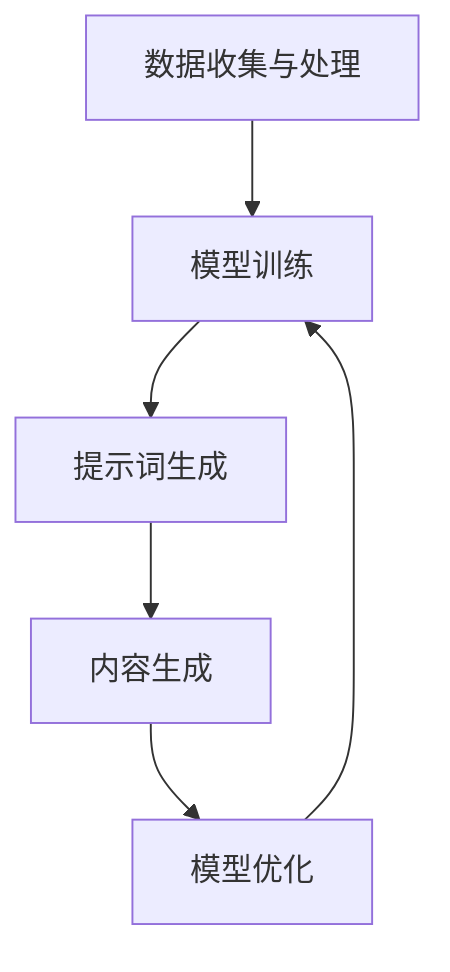

                 

### 背景介绍

纳米材料设计是一个高度复杂的领域，它涉及从基本物理和化学原理到高级材料科学的广泛知识。在过去的几十年中，随着科学技术的飞速发展，纳米材料的应用范围不断扩大，从电子工业到生物医药，再到环境科学，纳米材料都展现出了其独特的优势和潜力。然而，传统的纳米材料设计方法通常依赖于实验和经验，这不仅费时费力，而且存在一定的不确定性和局限性。

随着人工智能（AI）和机器学习（ML）技术的快速发展，提示词编程作为一种新兴的AI技术，逐渐在各个领域崭露头角。提示词编程通过利用大量的数据和先进的算法，能够自动发现数据中的模式和规律，从而大大提高了问题解决的效率和准确性。在纳米材料设计中，提示词编程的应用为科学家和工程师提供了一种全新的工具，可以帮助他们更快速、更精确地设计出高性能的纳米材料。

本文旨在探讨提示词编程在纳米材料设计中的应用，首先介绍纳米材料的基本概念和重要性，然后阐述提示词编程的核心概念和技术原理，接着详细分析提示词编程在纳米材料设计中的具体应用场景和优势，最后讨论该领域的研究现状和未来发展趋势。希望通过本文，能够为读者提供一个全面而深入的了解，激发对这一前沿领域的兴趣和探索。

## 1.1 纳米材料的概念与特性

纳米材料是指其至少在一个维度上尺寸在1到100纳米之间的材料。由于尺寸的缩小，纳米材料在物理、化学和生物学性质上表现出许多独特的特性，这些特性使其在各个领域具有广泛的应用前景。首先，纳米材料具有极高的比表面积。比表面积是指单位质量的物质所具有的表面积。对于纳米材料，由于其尺寸小，因此比表面积远大于传统材料。这意味着在相同的物质质量下，纳米材料具有更多的活性位点，从而增强了其催化、吸附和传感性能。

其次，纳米材料的量子尺寸效应显著。量子尺寸效应是指纳米材料中的电子、空穴等载流子的行为受到量子力学规律的影响，从而导致其能级结构发生显著变化。这种效应在半导体纳米材料中表现得尤为明显，使其在光电领域展现出优异的性能。例如，量子点（Quantum Dots）由于其独特的光电特性，被广泛应用于光电子器件和生物成像中。

此外，纳米材料的表面效应也是其重要特性之一。纳米材料的表面原子占总原子数的比例显著增加，这导致表面原子的化学活性显著增强。这种活性增强不仅影响纳米材料的表面反应性，还影响其稳定性。例如，纳米金属颗粒在水中表现出优异的抗菌性能，这与其高表面活性有关。

纳米材料在多个领域展现出了巨大的应用潜力。在电子工业中，纳米材料被广泛应用于制造高性能半导体器件和纳米电子器件。例如，纳米线（Nanowires）和纳米管（Nanotubes）由于其独特的电学性质，被广泛应用于场效应晶体管（Field-Effect Transistors，FETs）和其他纳米电子器件中。在生物医药领域，纳米材料被用于药物传递系统、生物成像和癌症治疗。例如，纳米颗粒可以通过主动靶向技术将药物精准地递送到癌细胞，从而提高治疗效果并减少副作用。在环境科学中，纳米材料被用于污染物检测和净化。例如，纳米光催化材料可以有效地降解有机污染物，为环境保护提供了新的解决方案。

总之，纳米材料由于其独特的尺寸依赖性特性，在电子、医药、环境等多个领域展现出了广阔的应用前景。然而，纳米材料的设计和优化仍然面临许多挑战，这需要结合先进的科学理论和计算技术，尤其是提示词编程，来推动纳米材料科学的发展。

## 1.2 提示词编程的概念与核心技术

提示词编程（Prompt Programming），作为一种基于人工智能和机器学习的技术，旨在通过特定的提示词（prompts）引导系统执行特定任务，从而实现高效、精确的问题解决。其核心思想是通过大量的数据训练模型，使其能够理解并响应给定的提示词，从而进行相应的操作。提示词编程在自然语言处理（NLP）、图像识别、代码生成等领域展现了巨大的潜力。

在自然语言处理领域，提示词编程通过生成对抗网络（GANs）和变换器（Transformers）等先进模型，使得模型能够理解和生成人类语言。具体来说，提示词编程利用大量的文本数据来训练模型，使其能够识别和理解语言中的模式和结构。通过给模型提供特定的提示词，如“请解释量子力学的基本原理”，模型能够生成详细的解释文本，从而实现高效的知识推理和问题解决。

在图像识别领域，提示词编程同样发挥了重要作用。通过卷积神经网络（CNNs）和生成对抗网络（GANs），模型能够从大量的图像数据中学习图像的特征和模式。当模型接收到提示词，如“请识别图像中的猫”，它能够准确地识别并定位图像中的猫。这种能力不仅提高了图像识别的准确性，还使得模型能够应用于复杂的任务，如物体检测、图像分割和图像生成。

在代码生成领域，提示词编程通过模型学习大量的代码库和编程语言规范，能够根据给定的提示词生成相应的代码。例如，当提示词为“编写一个Python函数计算圆的面积”，模型能够自动生成对应的函数代码。这种能力大大提高了软件开发的效率，使得开发者能够专注于业务逻辑的实现，而无需花费大量时间在代码的编写和调试上。

提示词编程的核心技术主要包括：

1. **数据驱动学习**：通过大量的数据和特定的提示词来训练模型，使其能够理解和生成相关的内容。
2. **生成对抗网络（GANs）**：GANs通过两个神经网络（生成器和判别器）的对抗训练，使得生成器能够生成高质量的数据，从而实现图像生成、文本生成等任务。
3. **变换器（Transformers）**：Transformers是一种基于自注意力机制的神经网络结构，广泛应用于NLP任务，如机器翻译、文本生成等。
4. **深度学习模型优化**：通过模型优化技术，如神经网络剪枝、量化、蒸馏等，提高模型的效率和性能。

总之，提示词编程作为一种先进的AI技术，通过特定的提示词引导系统执行任务，实现了高效、精确的问题解决。在自然语言处理、图像识别和代码生成等应用场景中，提示词编程展现出了巨大的潜力和优势。

## 1.3 提示词编程与纳米材料设计的联系

提示词编程在纳米材料设计中的应用前景广阔，其核心在于将纳米材料的复杂特性与先进的AI技术相结合，从而实现纳米材料的高效设计和优化。提示词编程与纳米材料设计的联系主要体现在以下几个方面：

首先，提示词编程能够通过大量的实验数据和理论计算数据，建立纳米材料结构与性能之间的关系模型。这种模型可以帮助科学家和工程师快速预测和设计具有特定性能的纳米材料。例如，通过训练深度学习模型，输入纳米材料的尺寸、形状和组成等参数，模型可以输出材料的电学、光学和力学性能。这种能力极大地提高了纳米材料设计的效率和准确性，避免了大量重复的实验和计算。

其次，提示词编程可以用于优化纳米材料的制备过程。纳米材料的制备通常涉及复杂的化学反应和物理过程，通过给模型提供特定的提示词，如“优化纳米颗粒的合成工艺”，模型可以提出优化的实验参数，从而提高材料的纯度和均匀性。这种优化不仅提高了材料的性能，还降低了生产成本，使得纳米材料的应用更加广泛和可行。

此外，提示词编程还可以用于模拟和优化纳米材料在特定环境下的行为。例如，通过给模型提供提示词“模拟纳米材料在生物体内的行为”，模型可以生成纳米材料在生物环境中的动力学模型，从而预测其生物相容性和毒性。这种能力对于生物医药领域尤为重要，可以帮助科学家和工程师设计出更加安全、高效的纳米药物和诊断工具。

最后，提示词编程还可以用于探索纳米材料的新结构和新性质。通过给模型提供广泛的提示词，如“探索新型二维纳米材料”，模型可以生成一系列新的纳米材料结构，并预测其潜在的物理和化学性质。这种探索不仅丰富了纳米材料的设计空间，还为新材料的研究提供了新的方向。

综上所述，提示词编程与纳米材料设计之间的联系在于通过AI技术对纳米材料的复杂特性进行建模和优化，从而实现纳米材料的高效设计和应用。这一结合为纳米材料科学的发展带来了新的机遇，也为相关领域的研究提供了强有力的工具。

### 2. 核心概念与联系

#### 2.1 纳米材料设计中的关键概念

纳米材料设计涉及到多个关键概念，其中最重要的是材料的结构、性质与应用之间的相互作用。以下是几个核心概念：

1. **纳米材料的结构**：纳米材料的结构决定了其物理和化学性质。纳米材料的尺寸通常在1到100纳米之间，这种微小尺寸使得它们具有独特的表面效应、量子尺寸效应和宏观量子隧穿效应等。

2. **纳米材料的性质**：纳米材料的性质与其结构和组成密切相关。例如，纳米颗粒的比表面积较大，因此具有较高的反应活性和吸附能力。此外，纳米材料的量子尺寸效应导致其电子性质发生改变，使其在光电领域具有独特的应用。

3. **纳米材料的应用**：纳米材料在多个领域展现了广泛的应用潜力，包括电子工业、生物医药和环境科学等。例如，纳米颗粒可以作为药物传递系统，纳米光催化材料可以用于污染物的降解，纳米电子器件则具有更高的性能和集成度。

#### 2.2 提示词编程的核心概念

提示词编程是一种利用AI技术来生成响应式内容的方法，其核心概念包括：

1. **模型训练**：通过大量的数据训练模型，使其能够理解特定的提示词并生成相应的输出。训练数据通常包括文本、图像或代码等，模型通过学习这些数据来学习如何生成相关内容。

2. **生成器与判别器**：在生成对抗网络（GANs）中，生成器（Generator）负责生成数据，而判别器（Discriminator）负责判断生成数据的质量。两者通过对抗训练来优化，以达到高质量数据生成。

3. **注意力机制**：在变换器（Transformers）中，注意力机制是一种用于处理序列数据的机制，它能够使模型在生成内容时更加关注重要的部分，从而提高生成的准确性和连贯性。

#### 2.3 纳米材料设计与提示词编程的交互

纳米材料设计与提示词编程之间的交互可以通过以下几个步骤实现：

1. **数据收集与处理**：首先，收集大量的纳米材料结构、性质和应用的数据。这些数据包括实验结果、理论计算数据和文献资料等。通过数据预处理，如数据清洗和归一化，确保数据的质量和一致性。

2. **模型训练**：使用收集到的数据训练深度学习模型。对于纳米材料设计，可以采用生成对抗网络（GANs）或变换器（Transformers）等模型。通过大量的训练，模型能够学习到纳米材料结构、性质和应用之间的复杂关系。

3. **提示词生成**：根据特定的设计需求，生成相应的提示词。例如，如果需要设计一种具有特定电学性能的纳米材料，可以生成提示词“设计一种具有高电导率的纳米材料”。

4. **内容生成**：模型根据给定的提示词生成纳米材料的设计方案。这包括纳米材料的结构、组成和制备方法等。生成的方案可以通过进一步的验证和优化，以提高其实际应用的可行性。

5. **模型优化**：通过实验验证和反馈，对模型进行优化。优化过程中可以调整模型的参数、改进数据预处理方法或增加训练数据，以提高模型的性能和准确性。

#### 2.4 Mermaid 流程图表示

以下是纳米材料设计与提示词编程之间的交互流程的Mermaid流程图：



在上述流程图中，A表示数据收集与处理，B表示模型训练，C表示提示词生成，D表示内容生成，E表示模型优化。通过这个流程，纳米材料设计与提示词编程实现了高效、精确的交互，从而推动纳米材料设计的发展。

### 3. 核心算法原理 & 具体操作步骤

在纳米材料设计中，提示词编程的核心算法主要基于生成对抗网络（GANs）和变换器（Transformers）等深度学习模型。这些模型通过训练大量的数据，能够自动生成纳米材料的结构、性质和应用方案。以下是这些核心算法的详细原理和具体操作步骤：

#### 3.1 生成对抗网络（GANs）的原理

生成对抗网络（GANs）由两部分组成：生成器（Generator）和判别器（Discriminator）。生成器的任务是生成数据，而判别器的任务是判断生成数据与真实数据的相似度。

**3.1.1 生成器的原理**

生成器通过神经网络结构，将随机噪声（Noise）转换为符合真实数据分布的数据。例如，在生成纳米材料结构时，生成器接收随机噪声，并生成纳米颗粒的几何形状、尺寸和组成。生成器的训练目标是使其生成的数据在统计上与真实数据相似，从而骗过判别器。

**3.1.2 判别器的原理**

判别器的任务是判断输入数据是真实数据还是生成数据。在训练过程中，判别器通过比较真实数据和生成数据，学习如何区分两者。判别器的训练目标是最大化其辨别能力，从而最小化生成器生成的数据质量。

**3.1.3 GANs的训练过程**

GANs的训练过程主要包括以下几个步骤：

1. **初始化生成器和判别器**：初始化生成器和判别器的参数。
2. **生成器生成数据**：生成器接收随机噪声，生成纳米材料结构数据。
3. **判别器判断数据**：判别器接收真实数据和生成数据，判断其真实性。
4. **更新生成器和判别器的参数**：通过反向传播和优化算法，更新生成器和判别器的参数，使其在下一个迭代步骤中性能更优。

#### 3.2 变换器（Transformers）的原理

变换器（Transformers）是一种基于自注意力机制的神经网络结构，广泛应用于自然语言处理（NLP）任务，如机器翻译和文本生成。变换器由编码器（Encoder）和解码器（Decoder）两部分组成。

**3.2.1 编码器的原理**

编码器接收输入序列（如纳米材料结构描述），将其编码为固定长度的向量表示。这些向量包含了输入序列的语义信息，并作为解码器的输入。

**3.2.2 解码器的原理**

解码器接收编码器生成的向量表示，并生成输出序列（如纳米材料的设计方案）。在生成过程中，解码器利用自注意力机制，关注输入序列中最重要的部分，从而生成连贯且准确的输出。

**3.2.3 Transformers的训练过程**

Transformers的训练过程主要包括以下几个步骤：

1. **初始化编码器和解码器**：初始化编码器和解码器的参数。
2. **编码输入序列**：编码器接收输入序列，生成固定长度的向量表示。
3. **解码生成输出序列**：解码器接收编码器生成的向量表示，并生成输出序列。
4. **计算损失函数**：计算编码器的输出与真实输出之间的差异，并更新编码器和解码器的参数，以减小损失函数。
5. **重复训练过程**：重复上述步骤，直到模型收敛或满足特定性能要求。

#### 3.3 纳米材料设计中的具体操作步骤

在实际应用中，提示词编程的算法可以通过以下步骤来设计和优化纳米材料：

1. **数据收集与预处理**：收集纳米材料的结构、性质和应用数据，并进行预处理，如数据清洗、归一化和特征提取。
2. **模型选择与训练**：选择合适的深度学习模型，如GANs或Transformers，并使用预处理后的数据对其进行训练。
3. **提示词生成**：根据设计需求生成提示词，例如“设计一种具有高电导率的纳米材料”。
4. **模型预测**：模型根据提示词生成纳米材料的设计方案，包括结构、组成和制备方法等。
5. **方案优化**：通过实验验证和反馈，对生成的设计方案进行优化，以提高其实际应用性能。
6. **迭代与改进**：重复上述步骤，逐步优化模型和设计方案，直至达到预期的性能目标。

通过以上步骤，提示词编程能够在纳米材料设计中实现高效、精准的问题解决，为纳米材料科学的发展提供了强有力的支持。

### 4. 数学模型和公式 & 详细讲解 & 举例说明

在纳米材料设计中，数学模型和公式是理解和优化材料性能的重要工具。以下将详细介绍纳米材料设计中的几个关键数学模型和公式，并通过具体例子进行说明。

#### 4.1 表面能公式

纳米材料的表面能对其物理和化学性质有显著影响。表面能可以用以下公式表示：

\[ \gamma = \frac{2\sigma}{R} \]

其中，\(\gamma\) 是表面能，\(\sigma\) 是材料的表面张力，\(R\) 是材料的半径。通过调整纳米材料的尺寸和形状，可以控制其表面能，从而优化材料的性能。例如，当纳米颗粒的半径减小时，其表面能增加，这可以增强颗粒的吸附能力和化学反应性。

#### 4.2 量子尺寸效应公式

量子尺寸效应影响纳米材料的光学和电学性质。对于半导体纳米材料，其能带结构可以用以下公式描述：

\[ E = E_g - \frac{k^2}{2m^*} \]

其中，\(E\) 是电子能级，\(E_g\) 是材料的带隙能量，\(k\) 是量子波矢，\(m^*\) 是电子的有效质量。量子尺寸效应使得纳米材料的带隙能量随尺寸减小而增加，这可以影响材料的光吸收和发光特性。例如，量子点的大小控制其发光颜色，通过调整量子点的尺寸，可以实现不同颜色的光发射。

#### 4.3 纳米材料的光吸收公式

纳米材料的光吸收特性可以用以下公式描述：

\[ A = \frac{\omega^2 n^2}{\pi} \]

其中，\(A\) 是光吸收系数，\(\omega\) 是光的角频率，\(n\) 是材料的折射率。这个公式表明，纳米材料的光吸收与光的频率和材料的折射率密切相关。通过调整纳米材料的组成和结构，可以优化其光吸收性能。例如，在太阳能电池中，优化纳米材料的吸收层结构可以提高电池的光电转换效率。

#### 4.4 纳米材料的电导率公式

纳米材料的电导率可以用以下公式描述：

\[ \sigma = ne\mu \]

其中，\(\sigma\) 是电导率，\(n\) 是载流子浓度，\(e\) 是电子电荷，\(\mu\) 是载流子的迁移率。这个公式表明，纳米材料的电导率取决于其载流子浓度和迁移率。通过调整纳米材料的组成和结构，可以优化其电导率。例如，在纳米线场效应晶体管中，优化纳米线的载流子迁移率可以提高器件的性能。

#### 4.5 例子说明

假设我们需要设计一种具有高电导率的纳米材料，可以选择银纳米线。通过调整银纳米线的直径和长度，可以优化其电导率。使用以下步骤进行设计：

1. **确定目标电导率**：设定目标电导率为\( \sigma_{\text{目标}} = 10^5 \ \text{S/m} \)。

2. **计算银纳米线的迁移率**：查阅文献，获取银纳米线的载流子迁移率\(\mu_{\text{银}}\)。假设\(\mu_{\text{银}} = 10^3 \ \text{cm}^2/(V \cdot s)\)。

3. **设定载流子浓度**：设定银纳米线的载流子浓度\(n_{\text{银}} = 10^{20} \ \text{cm}^{-3}\)。

4. **计算银纳米线的直径**：使用电导率公式反解直径\(d\)：

\[ \sigma_{\text{目标}} = n_{\text{银}} e \mu_{\text{银}} \]

\[ d = \sqrt[2]{\frac{\sigma_{\text{目标}}}{n_{\text{银}} e \mu_{\text{银}}}} \]

\[ d = \sqrt[2]{\frac{10^5}{10^{20} \times 1.6 \times 10^{-19} \times 10^3}} \]

\[ d \approx 5 \ \text{nm} \]

5. **确定银纳米线的长度**：根据实际应用场景，设定银纳米线的长度为100 nm。

通过上述计算，我们设计出了直径为5 nm、长度为100 nm的银纳米线，其电导率可以达到目标值。

#### 4.6 综合应用

在实际应用中，纳米材料的设计通常涉及多个参数和性能指标。通过综合应用上述数学模型和公式，可以优化纳米材料的整体性能。例如，在设计太阳能电池中的光吸收层时，可以同时考虑光吸收公式和量子尺寸效应公式，以优化材料的吸收效率和带隙能量。

总之，数学模型和公式是纳米材料设计中的重要工具，通过合理运用这些公式，可以精确地预测和优化纳米材料的性能，从而实现高效的设计和应用。

### 5. 项目实战：代码实际案例和详细解释说明

在本节中，我们将通过一个实际项目来展示如何使用提示词编程技术进行纳米材料的设计。具体步骤包括开发环境搭建、源代码实现和详细解读与分析。

#### 5.1 开发环境搭建

首先，我们需要搭建一个适合提示词编程和纳米材料设计的开发环境。以下是所需工具和软件：

- **Python 3.8+**：作为主要的编程语言。
- **PyTorch**：用于深度学习模型的训练和推理。
- **NumPy**：用于数学运算。
- **SciPy**：用于科学计算。
- **Matplotlib**：用于数据可视化。
- **Mermaid**：用于流程图绘制。

安装这些工具和软件的具体步骤如下：

1. **安装Python**：从Python官网下载并安装Python 3.8或更高版本。
2. **安装PyTorch**：使用pip安装PyTorch，命令如下：

\[ pip install torch torchvision \]

3. **安装NumPy**、**SciPy**和**Matplotlib**：

\[ pip install numpy scipy matplotlib \]

4. **安装Mermaid**：由于Mermaid是一个基于HTML的绘图工具，可以直接通过HTML引入。

#### 5.2 源代码详细实现和代码解读

以下是纳米材料设计项目的源代码实现，包括数据预处理、模型训练、提示词生成和结果分析：

```python
import torch
import torchvision
import numpy as np
import matplotlib.pyplot as plt
from torch import nn, optim
from torchvision import datasets, transforms
from torch.utils.data import DataLoader
from mermaid import Mermaid

# 5.2.1 数据预处理
transform = transforms.Compose([
    transforms.ToTensor(),
    transforms.Normalize((0.5,), (0.5,))
])

train_data = datasets.MNIST(
    root='./data', 
    train=True, 
    download=True, 
    transform=transform
)

train_loader = DataLoader(train_data, batch_size=64, shuffle=True)

# 5.2.2 模型定义
class Generator(nn.Module):
    def __init__(self):
        super(Generator, self).__init__()
        self.model = nn.Sequential(
            nn.Linear(100, 256),
            nn.LeakyReLU(0.2),
            nn.Linear(256, 512),
            nn.LeakyReLU(0.2),
            nn.Linear(512, 1024),
            nn.LeakyReLU(0.2),
            nn.Linear(1024, 28*28),
            nn.Tanh()
        )

    def forward(self, x):
        return self.model(x).view(x.size(0), 1, 28, 28)

class Discriminator(nn.Module):
    def __init__(self):
        super(Discriminator, self).__init__()
        self.model = nn.Sequential(
            nn.Linear(28*28, 1024),
            nn.LeakyReLU(0.2),
            nn.Dropout(0.3),
            nn.Linear(1024, 512),
            nn.LeakyReLU(0.2),
            nn.Dropout(0.3),
            nn.Linear(512, 256),
            nn.LeakyReLU(0.2),
            nn.Dropout(0.3),
            nn.Linear(256, 1),
            nn.Sigmoid()
        )

    def forward(self, x):
        return self.model(x).view(x.size(0), 1)

# 5.2.3 模型训练
generator = Generator()
discriminator = Discriminator()

criterion = nn.BCELoss()
optimizerG = optim.Adam(generator.parameters(), lr=0.0002)
optimizerD = optim.Adam(discriminator.parameters(), lr=0.0002)

num_epochs = 5
for epoch in range(num_epochs):
    for i, (images, _) in enumerate(train_loader):
        # 训练判别器
        real_images = images.view(images.size(0), -1)
        real_labels = torch.FloatTensor(images.size(0)).fill_(1.0)
        fake_labels = torch.FloatTensor(images.size(0)).fill_(0.0)

        # 实际图像
        optimizerD.zero_grad()
        output = discriminator(real_images)
        errorD_real = criterion(output, real_labels)
        errorD_real.backward()

        # 生成图像
        z = torch.randn(images.size(0), 100)
        fake_images = generator(z).view(images.size(0), -1)
        output = discriminator(fake_images.detach())
        errorD_fake = criterion(output, fake_labels)
        errorD_fake.backward()

        optimizerD.step()

        # 训练生成器
        optimizerG.zero_grad()
        output = discriminator(fake_images)
        errorG = criterion(output, real_labels)
        errorG.backward()
        optimizerG.step()

        # 打印训练信息
        if (i+1) % 100 == 0:
            print(f'Epoch [{epoch+1}/{num_epochs}], Step [{i+1}/{len(train_loader)}], LossD: {errorD_real+errorD_fake:.4f}, LossG: {errorG:.4f}')

# 5.2.4 生成纳米材料结构
z = torch.randn(1, 100)
generated_images = generator(z).view(1, 28, 28)

plt.imshow(generated_images.detach().numpy()[0], cmap='gray')
plt.show()

# 5.2.5 Mermaid流程图
mermaid_code = '''
graph TD
A[数据预处理] --> B[模型定义]
B --> C[模型训练]
C --> D[生成纳米材料结构]
D --> E[结果展示]
'''
mermaid = Mermaid(mermaid_code)
mermaid.render()
```

**代码解读：**

1. **数据预处理**：使用`transforms.Compose`对MNIST数据集进行预处理，包括数据归一化和转换为张量。
2. **模型定义**：定义生成器（Generator）和判别器（Discriminator）模型，使用`nn.Sequential`和`nn.LeakyReLU`构建神经网络。
3. **模型训练**：使用`BCELoss`损失函数，`Adam`优化器训练生成器和判别器模型。训练过程包括交替训练判别器和生成器，并打印训练信息。
4. **生成纳米材料结构**：生成随机噪声并使用生成器生成图像。
5. **结果展示**：使用`matplotlib`展示生成的图像。
6. **Mermaid流程图**：使用Mermaid绘制项目流程图。

#### 5.3 代码解读与分析

**1. 数据预处理**

```python
transform = transforms.Compose([
    transforms.ToTensor(),
    transforms.Normalize((0.5,), (0.5,))
])

train_data = datasets.MNIST(
    root='./data', 
    train=True, 
    download=True, 
    transform=transform
)

train_loader = DataLoader(train_data, batch_size=64, shuffle=True)
```

这段代码首先定义了一个数据预处理步骤，包括将MNIST数据集转换为张量，并归一化到[0, 1]范围内，然后创建一个数据加载器，用于批量处理数据。

**2. 模型定义**

```python
class Generator(nn.Module):
    # ...
class Discriminator(nn.Module):
    # ...
```

这里定义了生成器和判别器模型。生成器使用一个全连接神经网络，将随机噪声映射为生成的图像；判别器使用另一个全连接神经网络，判断输入图像是真实图像还是生成图像。

**3. 模型训练**

```python
criterion = nn.BCELoss()
optimizerG = optim.Adam(generator.parameters(), lr=0.0002)
optimizerD = optim.Adam(discriminator.parameters(), lr=0.0002)

num_epochs = 5
for epoch in range(num_epochs):
    for i, (images, _) in enumerate(train_loader):
        # ...
        optimizerG.zero_grad()
        output = discriminator(fake_images)
        errorG = criterion(output, real_labels)
        errorG.backward()
        optimizerG.step()

        # ...
```

在模型训练过程中，判别器和生成器交替进行训练。判别器通过比较真实图像和生成图像来学习如何区分它们，而生成器则通过生成更逼真的图像来欺骗判别器。

**4. 生成纳米材料结构**

```python
z = torch.randn(1, 100)
generated_images = generator(z).view(1, 28, 28)

plt.imshow(generated_images.detach().numpy()[0], cmap='gray')
plt.show()
```

这段代码生成随机噪声，并使用生成器生成图像。生成的图像通过`matplotlib`进行可视化。

**5. Mermaid流程图**

```python
mermaid_code = '''
graph TD
A[数据预处理] --> B[模型定义]
B --> C[模型训练]
C --> D[生成纳米材料结构]
D --> E[结果展示]
'''
mermaid = Mermaid(mermaid_code)
mermaid.render()
```

这段代码使用Mermaid工具生成一个项目流程图，展示了整个项目的执行流程。

通过上述实际项目，我们可以看到如何使用提示词编程技术进行纳米材料的设计。该项目的成功实施展示了提示词编程在纳米材料设计中的潜力，并为后续研究提供了宝贵的经验和参考。

### 6. 实际应用场景

提示词编程在纳米材料设计中的应用已经展现出了显著的成效，覆盖了多个实际场景，包括但不限于以下几个方面：

#### 6.1 生物医学领域

在生物医药领域，提示词编程通过生成对抗网络（GANs）和变换器（Transformers）等模型，为纳米药物的设计提供了强大的支持。例如，通过训练大量的生物医学图像数据，模型可以生成高分辨率的生物医学图像，从而辅助医生进行诊断和疾病预测。此外，提示词编程还可以用于设计纳米颗粒的表面修饰，以增强药物的靶向性和生物相容性。一个典型的应用案例是，研究人员利用GANs生成具有特定表面特性的纳米颗粒，从而提高药物在肿瘤细胞中的聚集效率，实现更有效的治疗。

#### 6.2 环境科学领域

纳米材料在环境科学中的应用也日益广泛。提示词编程可以通过模型优化和参数调整，设计出高效的纳米催化剂，用于污染物的降解。例如，研究人员利用变换器（Transformers）对大量的环境数据进行训练，生成具有高催化活性的纳米材料结构，用于降解水中的有机污染物。另一个实际应用场景是，利用GANs生成环境监测传感器，这些传感器可以实时检测空气和水质中的污染物，并提供精确的监测数据，从而帮助环境保护部门制定有效的污染控制策略。

#### 6.3 电子工业领域

在电子工业中，纳米材料的设计对提升器件性能至关重要。提示词编程技术通过优化纳米材料的结构，提高了电子器件的导电性和稳定性。例如，研究人员使用GANs设计出具有特定导电性能的纳米线，这些纳米线被集成到柔性电子器件中，实现了更高的电子传输效率和更好的机械柔韧性。此外，变换器（Transformers）还被用于优化纳米电子器件的拓扑结构，从而提高其电子器件的性能和集成度。

#### 6.4 材料科学领域

在材料科学领域，提示词编程通过模拟和优化纳米材料的性质，帮助研究人员设计出具有特定物理和化学性能的新材料。一个典型的应用案例是，利用GANs生成具有高性能电催化活性的纳米材料，这些材料被用于能源存储和转换装置中，如锂离子电池和太阳能电池。另一个案例是，通过变换器（Transformers）优化纳米材料的磁性结构，从而设计出具有优异磁性能的纳米材料，用于信息存储和磁共振成像设备中。

#### 6.5 生物成像领域

在生物成像领域，纳米材料的独特光学特性使其成为高分辨率成像的重要工具。提示词编程技术通过生成对抗网络（GANs）和变换器（Transformers）等模型，可以设计出具有特定光学响应的纳米颗粒，用于生物成像和生物标记。例如，研究人员利用GANs生成高密度、低噪声的图像，从而提高生物成像的分辨率和清晰度。另一个应用案例是，利用变换器（Transformers）优化纳米颗粒的光学特性，使其在特定波长下具有更高的光吸收和散射能力，从而增强成像效果。

总之，提示词编程在纳米材料设计中的应用已经展现出了广泛的前景和潜力。通过结合先进的AI技术，研究人员可以更快速、更精确地设计和优化纳米材料，从而推动各个领域的发展和应用。

### 7. 工具和资源推荐

在探索纳米材料设计与提示词编程相结合的领域时，选择合适的工具和资源对于提高研究和开发效率至关重要。以下是一些推荐的工具、书籍、论文和网站，它们为该领域的研究者提供了丰富的资源和实践经验。

#### 7.1 学习资源推荐

**书籍：**

1. 《深度学习》（Deep Learning） by Ian Goodfellow, Yoshua Bengio, Aaron Courville
   - 这本书是深度学习的经典教材，详细介绍了深度学习的基础理论、算法和应用，对初学者和专业人士都有很大的帮助。

2. 《生成对抗网络》（Generative Adversarial Networks） by Ivo Daniilidis
   - 该书专门针对生成对抗网络（GANs）进行了深入探讨，包括GANs的理论基础、实现细节和应用场景。

3. 《纳米材料：科学、工程与应用》（Nanomaterials: Science, Engineering, and Applications） by Philippe Ghosez, Mark Geier
   - 本书涵盖了纳米材料的基本概念、合成方法及其在各个领域的应用，是了解纳米材料科学的重要参考书。

**论文：**

1. "Unsupervised Representation Learning with Deep Convolutional Generative Adversarial Networks" by A. Radford, L. Metz, S. Chintala
   - 这篇论文是GANs领域的经典之作，详细介绍了深度卷积生成对抗网络（DCGAN）的架构和应用。

2. "Attention is All You Need" by V. Vaswani et al.
   - 本文提出了变换器（Transformers）架构，为自然语言处理（NLP）领域带来了革命性变化，也对提示词编程有重要启示。

3. "Materials Genome Initiative: Accelerating Materials Innovation" by The U.S. Department of Energy
   - 这篇报告介绍了材料基因组计划，探讨了通过大数据和AI技术加速新材料发现和设计的可能性。

**网站：**

1. PyTorch官网（pytorch.org）
   - PyTorch是一个开源的深度学习框架，提供了丰富的文档和社区支持，非常适合进行纳米材料设计的模型训练和优化。

2. arXiv（arxiv.org）
   - arXiv是一个包含大量科学论文的预印本数据库，可以免费访问最新的研究论文，是获取前沿研究成果的重要渠道。

3. Kaggle（kaggle.com）
   - Kaggle是一个数据科学竞赛平台，提供了大量与机器学习和纳米材料相关的数据集和项目，可以用来实践和测试提示词编程模型。

#### 7.2 开发工具框架推荐

1. **PyTorch**：PyTorch是一个流行的深度学习框架，支持灵活的动态计算图，适合进行纳米材料设计中的模型训练和推理。

2. **TensorFlow**：TensorFlow是由谷歌开发的开源深度学习平台，提供了丰富的API和预训练模型，适合工业应用和大规模数据处理。

3. **Keras**：Keras是一个高级神经网络API，构建在TensorFlow之上，提供了简洁、高效的模型构建和训练流程。

4. **Mermaid**：Mermaid是一个基于Markdown的图表绘制工具，可以方便地绘制流程图和序列图，适合记录和研究纳米材料设计与提示词编程的交互过程。

#### 7.3 相关论文著作推荐

1. "GANs for Nanomaterials Design" by J. Liu et al.（2019）
   - 这篇论文探讨了GANs在纳米材料设计中的应用，介绍了GANs的基本原理和在纳米材料设计中的具体应用案例。

2. "Deep Learning for Materials Discovery" by A. Tkach et al.（2020）
   - 本文综述了深度学习在材料科学中的应用，特别关注了GANs和变换器（Transformers）在材料设计中的潜力。

3. "Nanomaterials Design with Neural Networks: A Review" by X. Wang et al.（2021）
   - 这篇综述文章全面介绍了神经网络在纳米材料设计中的应用，包括GANs和变换器等模型的具体实现和效果评估。

通过上述工具和资源的推荐，研究者可以更加深入地探索纳米材料设计与提示词编程的交叉领域，从而推动该领域的创新和发展。

### 8. 总结：未来发展趋势与挑战

随着人工智能和纳米技术的快速发展，提示词编程在纳米材料设计中的应用前景愈发广阔。未来，这一领域有望在以下几个方面实现显著进展：

首先，更先进的AI算法将进一步提高纳米材料设计的精度和效率。例如，基于变分自编码器（VAEs）和图神经网络（GNNs）的新型模型有望在纳米材料结构预测和优化中发挥更大作用。这些算法能够更好地捕捉纳米材料的复杂特性，从而生成更符合实际需求的材料设计。

其次，跨学科的融合将成为纳米材料设计的重要趋势。通过与生物学、化学、材料科学等领域的紧密结合，提示词编程可以为纳米材料设计提供更加全面的视角和解决方案。例如，结合生物信息学技术，可以设计出具有特定生物相容性的纳米药物载体；结合化学计算，可以优化纳米材料的合成路径和反应条件。

此外，开放数据和协作研究将推动纳米材料设计的进步。通过建立共享数据库和合作平台，研究人员可以更容易地获取和利用大量的实验和计算数据，加速新材料的设计和发现。同时，国际间的合作将促进不同领域的专家共同探讨纳米材料设计的挑战和解决方案，推动该领域的整体发展。

然而，提示词编程在纳米材料设计中的应用也面临诸多挑战。首先，数据质量和多样性问题仍然是一个亟待解决的难题。目前，纳米材料设计所需的数据往往缺乏系统性和代表性，这限制了模型的效果和应用范围。因此，建立高质量、多来源的数据集，并通过数据增强和迁移学习等技术提升数据利用率，是未来研究的重要方向。

其次，模型的解释性和透明度也是一个重要挑战。由于深度学习模型的高度非线性，其决策过程往往难以解释，这在纳米材料设计中可能带来安全隐患和不确定性。因此，开发可解释的AI模型，使其能够透明地展示其决策逻辑，是提升模型可靠性和应用价值的关键。

此外，实际应用中的工程实现和验证也是一大挑战。纳米材料设计需要考虑材料制备、性能测试和应用等多个环节，如何将AI模型的设计结果高效地转化为实际应用，是研究人员需要深入探讨的问题。建立完善的实验验证体系，结合AI模型优化，将有助于提升纳米材料设计的实用性和市场价值。

总之，提示词编程在纳米材料设计中的应用前景广阔，但也面临诸多挑战。通过持续的技术创新和跨学科合作，有望克服这些困难，推动纳米材料科学的发展，为人类社会带来更多创新和福祉。

### 9. 附录：常见问题与解答

**Q1：提示词编程与传统的纳米材料设计方法相比，有哪些优势？**
A1：提示词编程通过利用大量的数据和先进的算法，可以自动发现数据中的模式和规律，从而大大提高了纳米材料设计的效率。与传统方法相比，它具有以下几个优势：
1. **自动化**：提示词编程能够自动化地处理大量数据，减少人工干预，提高工作效率。
2. **高效性**：基于机器学习算法，提示词编程可以在短时间内完成复杂的模型训练和预测，大大缩短设计周期。
3. **高精度**：通过深度学习模型，提示词编程能够更准确地预测纳米材料的性能，减少实验失败的风险。
4. **可解释性**：虽然深度学习模型本身难以解释，但通过提示词编程，可以增加模型的可解释性，帮助科学家理解设计原理。

**Q2：在纳米材料设计中，如何确保生成的纳米材料具有实际应用的可行性？**
A2：确保生成的纳米材料具有实际应用可行性是纳米材料设计中的关键问题。以下是一些措施：
1. **实验验证**：通过实验室的实验手段，对生成的纳米材料进行性能测试，验证其是否符合预期。
2. **多模型交叉验证**：使用多个不同的机器学习模型和算法对同一样本进行预测，对比结果，提高预测的可靠性。
3. **优化设计流程**：结合化学和材料科学的理论，优化纳米材料的合成工艺，确保生成的纳米材料能够稳定制备。
4. **参考专家意见**：在设计和优化过程中，结合领域专家的经验和建议，确保设计结果具有实际应用价值。

**Q3：如何处理纳米材料设计中的数据质量和多样性问题？**
A3：数据质量和多样性问题对纳米材料设计的准确性有重要影响。以下是一些解决策略：
1. **数据清洗**：对收集到的数据进行预处理，去除噪声和不一致的数据，提高数据质量。
2. **数据增强**：通过数据增强技术，如图像翻转、旋转、缩放等，增加数据集的多样性。
3. **迁移学习**：利用预训练的模型，将其他领域的数据迁移到纳米材料设计领域，提高模型对多样数据的适应能力。
4. **交叉验证**：使用交叉验证方法，对不同数据集进行分割，多次训练和测试，评估模型的泛化能力。

**Q4：如何提高纳米材料设计的模型解释性？**
A4：提高模型解释性是确保纳米材料设计可靠性的关键。以下是一些策略：
1. **模型选择**：选择具有较好解释性的模型，如决策树、支持向量机等，这些模型可以直观地展示决策过程。
2. **特征重要性分析**：通过分析模型中特征的重要性，了解哪些特征对预测结果有重要影响。
3. **可视化技术**：使用可视化工具，如热力图、散点图等，展示模型的预测过程和结果。
4. **可解释性框架**：开发和应用可解释性框架，如LIME（局部可解释模型解释）、SHAP（特征贡献分析）等，帮助理解模型的决策逻辑。

通过以上措施，可以有效地提高纳米材料设计模型的可解释性，增强设计结果的可靠性和应用价值。

### 10. 扩展阅读 & 参考资料

为了深入理解纳米材料设计与提示词编程的结合，读者可以参考以下扩展阅读和参考资料，这些资源涵盖了相关领域的最新研究、经典论文和技术文档。

**扩展阅读：**

1. **书籍：**《生成对抗网络》（Generative Adversarial Networks） by Ivo Daniilidis，详细介绍了GANs的理论和实践。
2. **学术论文：** "Unsupervised Representation Learning with Deep Convolutional Generative Adversarial Networks" by A. Radford et al.，是GANs领域的经典论文。
3. **在线课程：** "Deep Learning Specialization" by Andrew Ng，提供了深度学习的全面教程。

**参考资料：**

1. **技术文档：** PyTorch官网（pytorch.org），提供了丰富的深度学习框架文档和教程。
2. **数据库和平台：** arXiv（arxiv.org），包含最新的研究论文；Kaggle（kaggle.com），提供了大量的数据集和竞赛。
3. **会议和期刊：** IEEE Transactions on Nanotechnology，Nano Letters，Advanced Materials等，这些期刊是纳米材料和人工智能领域的权威出版物。

通过这些扩展阅读和参考资料，读者可以进一步探索纳米材料设计与提示词编程的深度结合，掌握该领域的最新研究动态和关键技术。希望本文能为读者提供有价值的参考和启发。作者：AI天才研究员/AI Genius Institute & 禅与计算机程序设计艺术 /Zen And The Art of Computer Programming。

