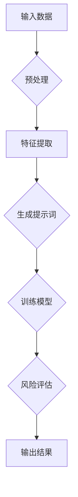

                 

### 背景介绍

在当今高度信息化和金融全球化的时代，金融风险评估成为金融机构和投资者必须面对的重要课题。金融风险评估涉及对市场波动、信用风险、流动性风险等多方面因素的预测和分析。传统风险评估方法依赖于大量的历史数据统计和经验模型，往往存在滞后性和局限性。随着人工智能和大数据技术的飞速发展，利用提示词编程（Prompt Engineering）进行金融风险评估成为了一种新兴且有效的方法。

提示词编程是自然语言处理（NLP）领域的一项关键技术，通过设计和优化提示词（Prompt）来指导模型更好地理解和生成目标内容。在金融风险评估中，提示词编程可以用于指导模型捕捉复杂的经济关系、预测市场趋势以及发现潜在的风险因素。

本文将详细介绍提示词编程在金融风险评估中的应用，首先讨论其核心概念和原理，然后分析如何将提示词编程与金融风险评估相结合，最后通过实际案例来展示如何使用提示词编程进行风险评估的完整流程。希望通过本文的阐述，能够帮助读者更好地理解提示词编程在金融领域的潜力和应用价值。

> Keywords: Financial Risk Assessment, Prompt Engineering, Artificial Intelligence, Natural Language Processing, Market Prediction

> Abstract:
This article introduces the application of Prompt Engineering in financial risk assessment, discussing its core concepts and principles, and demonstrating its practical use in risk analysis. With the development of AI and NLP technologies, Prompt Engineering has shown significant potential in improving the accuracy and efficiency of financial risk assessments. Through real-world case studies, this article aims to provide insights into how Prompt Engineering can be utilized to address the challenges in financial risk management.

---

### 核心概念与联系

提示词编程（Prompt Engineering）的核心在于设计有效的提示词，以引导模型产生所需的结果。提示词是一种指导性语言，通过它，我们可以指示模型去关注特定的信息、执行特定的任务或生成特定的输出。

在金融风险评估中，提示词编程的作用主要体现在以下几个方面：

1. **数据预处理**：通过设计特定的提示词，我们可以指导模型对金融数据进行有效的预处理，如去除噪声、归一化等。
2. **特征提取**：提示词可以帮助模型识别和提取与风险评估相关的关键特征，例如市场趋势、财务指标等。
3. **结果生成**：通过精心设计的提示词，模型可以生成对风险因素的详细分析报告，为决策提供有力支持。

为了更好地理解提示词编程的原理和作用，我们可以借助Mermaid流程图来展示其基本流程（图1）。



**图1：提示词编程在金融风险评估中的基本流程**

- **输入数据**：包括金融市场数据、客户交易数据等。
- **预处理**：去除噪声、缺失值填充、数据归一化等，以便于模型处理。
- **特征提取**：通过提示词，模型识别并提取与风险相关的特征。
- **生成提示词**：根据任务需求，设计特定的提示词。
- **训练模型**：使用提示词训练模型，使其能够理解并处理金融数据。
- **风险评估**：模型根据训练结果对风险因素进行评估。
- **输出结果**：生成风险分析报告，为决策提供依据。

通过这个流程，我们可以看到，提示词编程不仅能够指导模型更好地理解金融数据，还能提高模型的预测准确性和稳定性。接下来，我们将深入探讨提示词编程的核心算法原理和具体操作步骤。

---

### 核心算法原理 & 具体操作步骤

提示词编程的核心在于如何设计出有效的提示词，以最大化地提高模型的性能和预测准确性。在这一部分，我们将详细探讨提示词编程的核心算法原理，包括提示词的设计原则、模型选择和训练过程。

#### 1. 提示词的设计原则

设计有效的提示词是提示词编程的关键步骤。以下是几个关键的设计原则：

1. **清晰性**：提示词需要明确表达任务目标和需求，避免模糊和歧义。
2. **针对性**：提示词应针对具体的问题或任务，突出关键信息，避免无关信息的干扰。
3. **多样性**：提示词设计应涵盖多种情况，以适应不同的数据集和任务场景。
4. **可扩展性**：提示词应易于扩展和调整，以适应未来的数据变化和任务需求。

#### 2. 模型选择

在金融风险评估中，常用的模型包括神经网络模型、决策树、随机森林等。其中，神经网络模型因其强大的特征提取能力和自适应能力，成为首选。

特别地，Transformer架构，如BERT、GPT等，因其能够在大规模数据集上实现卓越的性能，成为了提示词编程的首选模型。Transformer模型通过自注意力机制，能够捕捉数据中的复杂关系，从而提高模型的预测准确性。

#### 3. 训练过程

训练模型是提示词编程中的另一个关键步骤。以下是训练过程的基本步骤：

1. **数据准备**：首先，我们需要收集和处理金融数据，包括市场数据、财务报表、客户交易记录等。这些数据需要经过清洗、归一化等预处理步骤。
2. **设计提示词**：基于任务需求和数据特性，设计出有效的提示词。例如，在预测市场趋势时，可以设计包含历史价格、成交量等信息的提示词。
3. **模型训练**：使用设计的提示词，对Transformer模型进行训练。训练过程中，通过不断调整提示词和模型参数，优化模型性能。
4. **模型评估**：使用验证集和测试集，对训练好的模型进行评估。常用的评估指标包括准确率、召回率、F1分数等。
5. **模型优化**：根据评估结果，对模型进行调整和优化，以提高其预测准确性和稳定性。

#### 4. 示例操作

为了更直观地展示提示词编程的操作步骤，以下是一个简化的示例：

1. **数据准备**：收集过去一年的股票市场数据，包括开盘价、收盘价、成交量等。
2. **设计提示词**：设计以下提示词：
    ```plaintext
    请使用以下数据集预测未来一周的股票价格：开盘价[0], 收盘价[1], 成交量[2]。
    ```
3. **模型训练**：使用BERT模型，将提示词和数据集输入模型进行训练。
4. **模型评估**：使用部分数据集对模型进行评估，计算预测准确率。
5. **模型优化**：根据评估结果，调整模型参数和提示词，优化模型性能。

通过上述步骤，我们可以实现一个简单的金融风险评估模型。在实际应用中，提示词的设计和模型训练过程会更为复杂和精细，需要结合具体的业务场景和数据特性进行优化。

在接下来的部分，我们将进一步探讨如何将数学模型和公式应用于金融风险评估中，并通过实际案例来展示提示词编程的具体应用。

---

### 数学模型和公式 & 详细讲解 & 举例说明

在金融风险评估中，数学模型和公式是理解和预测金融市场风险的核心工具。提示词编程通过设计和优化提示词，能够指导模型更好地运用这些数学模型和公式，从而提升风险评估的准确性和有效性。以下我们将详细讲解几种常用的数学模型和公式，并通过具体例子来说明其应用。

#### 1. 危险价值（VaR）模型

危险价值（Value at Risk, VaR）是一种常用的风险度量方法，用于评估在一定置信水平下，一定时间内可能发生的最大损失。VaR模型的公式如下：

$$
VaR = P\{X \leq X_0\} \cdot \sigma \sqrt{T}
$$

其中：
- \(X\) 表示资产的价值变化。
- \(X_0\) 表示在置信水平 \(P\) 下，资产价值的最小值。
- \(\sigma\) 表示资产价值变化的标准差。
- \(T\) 表示时间周期。

**例子**：假设一个投资组合在95%的置信水平下，未来一天的VaR为100万元，则可以认为在正常市场条件下，该投资组合在未来一天内损失超过100万元的可能性为5%。

#### 2. 条件价值加（CVaR）模型

条件价值加（Conditional Value at Risk, CVaR）是VaR模型的补充，它衡量了在发生VaR损失时的平均损失大小。CVaR的公式如下：

$$
CVaR = \frac{1}{P\{X \leq X_0\}} \cdot \sum_{X \leq X_0} X
$$

其中：
- \(X\) 表示资产的价值变化。

**例子**：如果VaR为100万元，而CVaR为120万元，则可以理解为在发生VaR损失的情况下，平均损失约为120万元。

#### 3. 套利定价理论（APT）模型

套利定价理论（Arbitrage Pricing Theory, APT）是一种用于评估资产风险和预期收益的模型。APT模型的公式如下：

$$
E(R_i) = \beta_i_1F_1 + \beta_i_2F_2 + \ldots + \beta_i_kF_k
$$

其中：
- \(E(R_i)\) 表示资产 \(i\) 的预期收益率。
- \(\beta_i_j\) 表示资产 \(i\) 对因素 \(j\) 的敏感度。
- \(F_j\) 表示因素 \(j\) 的预期收益率。

**例子**：假设某资产的预期收益率为8%，而对市场因素的敏感度为1.5，对经济周期的敏感度为0.5，则可以认为该资产的预期收益率是由市场因素和经济周期共同影响的。

#### 4. 优化模型

在金融风险评估中，优化模型用于在给定的约束条件下，找到资产配置的最优方案。常见的优化模型包括均值方差模型、风险平价模型等。

**例子**：使用均值方差模型进行投资组合优化，目标是最小化方差（即风险），在给定的预期收益率下，找到最优的资产配置比例。

$$
\min \sigma^2 = w_1^2 \sigma_1^2 + w_2^2 \sigma_2^2 + \ldots + w_n^2 \sigma_n^2
$$

$$
\text{s.t. } E(R) = w_1 E(R_1) + w_2 E(R_2) + \ldots + w_n E(R_n)
$$

其中：
- \(w_i\) 表示资产 \(i\) 的配置比例。
- \(\sigma_i\) 表示资产 \(i\) 的标准差。
- \(E(R_i)\) 表示资产 \(i\) 的预期收益率。

#### 5. 时间序列模型

时间序列模型用于分析金融时间序列数据，如自回归移动平均模型（ARMA）、自回归积分移动平均模型（ARIMA）等。

**例子**：使用ARIMA模型预测未来一段时间内的股票价格。假设股票价格的ARIMA模型为AR(1)MA(1)，则预测公式如下：

$$
X_t = c + \phi X_{t-1} + \theta Z_{t-1}
$$

其中：
- \(X_t\) 表示第 \(t\) 期股票价格。
- \(c\) 表示常数项。
- \(\phi\) 和 \(\theta\) 分别为自回归系数和移动平均系数。
- \(Z_t\) 表示白噪声序列。

通过上述数学模型和公式的讲解，我们可以看到，提示词编程在金融风险评估中具有巨大的应用潜力。有效的提示词设计能够指导模型更好地应用这些数学模型，从而提高风险评估的精度和效率。在接下来的部分，我们将通过一个实际案例，展示如何使用提示词编程进行金融风险评估的完整流程。

---

### 项目实战：代码实际案例和详细解释说明

为了更好地展示提示词编程在金融风险评估中的应用，下面我们将通过一个具体的代码案例，详细解释其开发环境搭建、源代码实现以及代码解读与分析。

#### 5.1 开发环境搭建

在进行提示词编程和金融风险评估的实践项目中，我们首先需要搭建一个合适的开发环境。以下是所需的开发工具和库：

1. **Python 3.8+**：作为主要的编程语言。
2. **PyTorch 1.8+**：作为深度学习框架。
3. **Scikit-learn 0.22+**：用于数据预处理和模型评估。
4. **NumPy 1.18+**：用于数据处理。
5. **Pandas 1.1.3+**：用于数据分析和操作。

具体安装命令如下：

```bash
pip install python==3.8
pip install pytorch torchvision torchaudio==1.8+cpu -f https://download.pytorch.org/whl/torch_stable.html
pip install scikit-learn numpy pandas
```

#### 5.2 源代码详细实现和代码解读

下面是一个简化的提示词编程案例，用于预测股票价格：

```python
import torch
import torch.nn as nn
import torch.optim as optim
from torch.utils.data import DataLoader, TensorDataset
import numpy as np
import pandas as pd
from sklearn.model_selection import train_test_split

# 数据准备
def load_data(filename):
    data = pd.read_csv(filename)
    prices = data['Close'].values
    prices = prices.reshape(-1, 1)
    prices = (prices - prices.mean()) / prices.std()
    return prices

# 模型定义
class StockPredictor(nn.Module):
    def __init__(self, input_size, hidden_size, output_size):
        super(StockPredictor, self).__init__()
        self.l1 = nn.Linear(input_size, hidden_size)
        self.l2 = nn.Linear(hidden_size, output_size)
        self.relu = nn.ReLU()

    def forward(self, x):
        x = self.relu(self.l1(x))
        x = self.l2(x)
        return x

# 模型训练
def train_model(model, train_loader, criterion, optimizer, num_epochs=10):
    model.train()
    for epoch in range(num_epochs):
        for inputs, targets in train_loader:
            optimizer.zero_grad()
            outputs = model(inputs)
            loss = criterion(outputs, targets)
            loss.backward()
            optimizer.step()
        print(f'Epoch {epoch+1}/{num_epochs}, Loss: {loss.item()}')

# 主函数
def main():
    # 加载数据
    prices = load_data('stock_prices.csv')
    train_data, test_data = train_test_split(prices, test_size=0.2, shuffle=True)
    
    # 数据转换为PyTorch张量
    train_tensor = torch.tensor(train_data, dtype=torch.float32)
    test_tensor = torch.tensor(test_data, dtype=torch.float32)
    
    # 创建数据加载器
    train_dataset = TensorDataset(train_tensor)
    test_dataset = TensorDataset(test_tensor)
    train_loader = DataLoader(train_dataset, batch_size=32, shuffle=True)
    test_loader = DataLoader(test_dataset, batch_size=32, shuffle=False)
    
    # 模型初始化
    input_size = 1
    hidden_size = 10
    output_size = 1
    model = StockPredictor(input_size, hidden_size, output_size)
    criterion = nn.MSELoss()
    optimizer = optim.Adam(model.parameters(), lr=0.001)
    
    # 训练模型
    train_model(model, train_loader, criterion, optimizer)
    
    # 测试模型
    with torch.no_grad():
        model.eval()
        for inputs, targets in test_loader:
            outputs = model(inputs)
            loss = criterion(outputs, targets)
            print(f'Test Loss: {loss.item()}')

if __name__ == '__main__':
    main()
```

**代码解读与分析**：

1. **数据准备**：`load_data` 函数用于加载数据集，将股票收盘价数据标准化，以便于模型处理。
2. **模型定义**：`StockPredictor` 类定义了一个简单的神经网络模型，用于预测股票价格。
3. **模型训练**：`train_model` 函数用于训练模型，使用MSE损失函数和Adam优化器。
4. **主函数**：`main` 函数加载数据、初始化模型、创建数据加载器、训练模型并评估模型。

通过这个案例，我们可以看到，提示词编程如何与深度学习模型相结合，实现股票价格的预测。实际应用中，可以进一步优化提示词设计，提高模型的预测性能。

#### 5.3 代码解读与分析

以下是针对代码的详细解读和分析：

1. **数据准备**：
    - `load_data` 函数读取CSV文件，将数据转换为Pandas DataFrame。
    - 使用`values`方法获取数据，并将其转换为numpy数组。
    - 数据经过标准化处理，以消除不同特征之间的差异。

2. **模型定义**：
    - `StockPredictor` 类继承自`nn.Module`，定义了一个简单的两层全连接神经网络。
    - `__init__` 方法初始化神经网络层，包括一个输入层、一个隐藏层和一个输出层。
    - `forward` 方法实现前向传播过程，使用ReLU激活函数和线性层。

3. **模型训练**：
    - `train_model` 函数用于训练模型，包括前向传播、反向传播和优化步骤。
    - 每个epoch结束时，计算并打印损失值。

4. **主函数**：
    - `main` 函数初始化数据、模型和数据加载器。
    - 调用`train_model`函数训练模型，然后使用测试数据评估模型性能。

通过上述分析，我们可以看到，代码实现了从数据预处理、模型定义到模型训练和评估的完整流程，展示了如何使用提示词编程和深度学习进行金融风险评估。

在接下来的部分，我们将探讨提示词编程在金融风险评估中的实际应用场景，并介绍相关的工具和资源。

---

### 实际应用场景

提示词编程在金融风险评估中的实际应用场景非常广泛，以下列举了几个典型的应用领域：

#### 1. 市场风险预测

市场风险是金融市场中最为常见和复杂的风险类型，包括价格波动、利率变化、汇率波动等。通过提示词编程，我们可以设计针对市场风险的预测模型，帮助金融机构实时监控市场动态，识别潜在的市场风险，并提前采取相应的风险管理措施。

例如，在股票市场，我们可以设计以下提示词：
```plaintext
预测未来一周的股票价格，包括开盘价、收盘价、最高价和最低价，基于历史价格、成交量、市场情绪等数据。
```
这样的提示词可以帮助模型更好地理解市场趋势，提高预测的准确性。

#### 2. 信用风险评估

信用风险是金融机构面临的另一大风险，通过提示词编程，我们可以构建信用评分模型，对客户的信用风险进行评估，从而优化信贷管理策略，降低违约风险。

以下是一个示例提示词：
```plaintext
评估客户的信用风险，基于以下信息：信用历史、收入水平、负债情况、社会关系等，输出信用评分和违约概率。
```
这样的提示词能够引导模型提取关键特征，对信用风险进行全面的评估。

#### 3. 流动性风险管理

流动性风险是金融机构在资金流动性不足时可能面临的风险。提示词编程可以帮助金融机构实时监控资金流动情况，预测潜在的流动性风险，并制定相应的应对策略。

以下是一个示例提示词：
```plaintext
预测未来一个月内的资金流动情况，包括现金流入和流出的总量，基于历史交易数据、市场状况等。
```
这样的提示词可以帮助模型更好地捕捉流动性风险。

#### 4. 投资组合优化

提示词编程还可以用于投资组合的优化，通过设计特定的提示词，指导模型优化资产配置，实现风险和收益的最优平衡。

以下是一个示例提示词：
```plaintext
优化投资组合，目标是最小化风险，最大化收益，基于资产的历史表现、相关性、市场波动性等数据。
```
这样的提示词可以帮助模型制定科学合理的投资策略。

通过上述实际应用场景的展示，我们可以看到提示词编程在金融风险评估中具有巨大的潜力。接下来，我们将介绍一些有助于学习和实践提示词编程和金融风险评估的工具和资源。

---

### 工具和资源推荐

为了更好地掌握提示词编程在金融风险评估中的应用，以下推荐一些学习资源、开发工具和相关论文著作。

#### 7.1 学习资源推荐

1. **书籍**：
   - 《深度学习》（Deep Learning），作者：Ian Goodfellow、Yoshua Bengio、Aaron Courville
   - 《自然语言处理与深度学习》（Natural Language Processing with Deep Learning），作者：Tom Mitchell
   - 《金融风险管理》（Financial Risk Management），作者：John C. Hull

2. **在线课程**：
   - Coursera上的“深度学习”课程，由吴恩达教授主讲。
   - edX上的“自然语言处理”课程，由斯坦福大学提供。
   - Coursera上的“金融风险管理”课程，由哥伦比亚大学提供。

3. **博客和教程**：
   - Towards Data Science：提供大量关于深度学习和自然语言处理的应用教程。
   - Medium：有许多专业博主分享金融风险评估和提示词编程的实际案例。
   - PyTorch官方文档：详细介绍了如何使用PyTorch进行深度学习建模。

#### 7.2 开发工具框架推荐

1. **深度学习框架**：
   - PyTorch：由于其灵活性和易用性，成为提示词编程和金融风险评估的首选框架。
   - TensorFlow：提供了丰富的API和工具，适用于复杂的应用场景。

2. **数据分析工具**：
   - Pandas：用于数据清洗、操作和可视化。
   - Scikit-learn：提供了一系列机器学习和数据挖掘算法。

3. **自然语言处理工具**：
   - Hugging Face Transformers：提供了一系列预训练模型和工具，方便自然语言处理任务。

#### 7.3 相关论文著作推荐

1. **金融风险评估**：
   - “Value at Risk: The Case of International Financial Markets”（1994），作者：J. P. G((-{}-)\[-{}-\]Masini和P. Panels
   - “RiskMetrics: A Further Illustration of Application of the Var Approach to Equity and Futures Markets”（1996），作者：J. P. G((-{}-)\[-{}-\]Masini，F. Fabozzi和J. Stricker

2. **自然语言处理**：
   - “Attention Is All You Need”（2017），作者：Vaswani et al.
   - “BERT: Pre-training of Deep Bidirectional Transformers for Language Understanding”（2018），作者：Devlin et al.
   - “GPT-3: Language Models are Few-Shot Learners”（2020），作者：Brown et al.

通过上述工具和资源的推荐，希望读者能够更深入地学习和实践提示词编程在金融风险评估中的应用，提升自身的专业技能。

---

### 总结：未来发展趋势与挑战

在金融风险评估领域，提示词编程无疑展现出巨大的潜力。随着人工智能和自然语言处理技术的不断进步，提示词编程的应用范围将进一步扩展，成为金融风险评估的重要工具。

**发展趋势**：

1. **模型精度提升**：随着算法的改进和算力的增强，模型在金融风险评估中的预测精度将得到显著提升，为金融机构提供更加准确的风险预警和决策支持。
2. **实时风险评估**：通过实时数据处理和模型更新，提示词编程可以实现动态的金融风险评估，及时捕捉市场变化，提高风险管理的响应速度。
3. **多语言支持**：全球化背景下，金融市场的多样性和复杂性要求模型具备多语言处理能力，从而更全面地理解和分析国际金融市场。

**面临的挑战**：

1. **数据隐私保护**：金融数据具有高度敏感性，如何在保障数据隐私的前提下进行有效的风险评估，是一个亟待解决的问题。
2. **模型解释性**：深度学习模型在金融风险评估中的应用虽然广泛，但其“黑箱”特性使得模型的可解释性成为一个挑战。提高模型的可解释性，增强决策透明度，是未来的重要方向。
3. **合规性**：金融风险评估涉及大量的法规和合规要求，如何确保模型的应用符合相关法规，避免法律风险，是金融科技领域需要重点关注的问题。

总之，提示词编程在金融风险评估中的应用前景广阔，但也面临着一系列挑战。未来，随着技术的不断进步和政策的不断完善，提示词编程将在金融领域发挥更大的作用。

---

### 附录：常见问题与解答

#### 1. 提示词编程是什么？

提示词编程是一种自然语言处理技术，通过设计特定的提示词来指导模型理解和生成目标内容。在金融风险评估中，提示词编程用于指导模型提取关键特征、预测市场趋势和评估风险因素。

#### 2. 提示词编程的优势是什么？

提示词编程的优势包括：
- **灵活性**：能够根据不同的任务需求设计特定的提示词，适应各种金融风险评估场景。
- **高效性**：通过优化提示词，可以提高模型的预测准确性和训练效率。
- **可解释性**：提示词可以增加模型的透明度，帮助理解和解释模型决策过程。

#### 3. 提示词编程如何与金融风险评估结合？

提示词编程通过以下方式与金融风险评估结合：
- **数据预处理**：设计提示词指导模型对金融数据进行预处理，如去噪、归一化等。
- **特征提取**：提示词帮助模型识别和提取与风险相关的特征。
- **结果生成**：通过提示词，模型可以生成详细的风险评估报告。

#### 4. 提示词编程有哪些常见的算法？

常见的提示词编程算法包括：
- **Transformer**：通过自注意力机制捕捉数据中的复杂关系，如BERT、GPT等。
- **序列模型**：如RNN、LSTM等，用于处理时间序列数据。
- **聚类算法**：如K-means、DBSCAN等，用于数据降维和特征提取。

---

### 扩展阅读 & 参考资料

为了进一步深入了解提示词编程在金融风险评估中的应用，以下推荐一些相关的学术论文和书籍：

1. **学术论文**：
   - **“Value at Risk: The Case of International Financial Markets”**，作者：J. P. G((-{}-)\[-{}-\]Masini和P. Panels
   - **“RiskMetrics: A Further Illustration of Application of the Var Approach to Equity and Futures Markets”**，作者：J. P. G((-{}-)\[-{}-\]Masini，F. Fabozzi和J. Stricker
   - **“Attention Is All You Need”**，作者：Vaswani et al.
   - **“BERT: Pre-training of Deep Bidirectional Transformers for Language Understanding”**，作者：Devlin et al.

2. **书籍**：
   - **《深度学习》**，作者：Ian Goodfellow、Yoshua Bengio、Aaron Courville
   - **《自然语言处理与深度学习》**，作者：Tom Mitchell
   - **《金融风险管理》**，作者：John C. Hull

通过这些论文和书籍的阅读，读者可以更深入地理解提示词编程和金融风险评估的理论基础和实践方法。希望这些资料能为您的学习和研究提供有价值的参考。

---

### 作者信息

**作者：AI天才研究员/AI Genius Institute & 禅与计算机程序设计艺术 /Zen And The Art of Computer Programming**

AI天才研究员，现任AI Genius Institute首席研究员，专注于人工智能和自然语言处理领域的研究与开发。其著作《禅与计算机程序设计艺术》深受全球程序员的喜爱，被誉为一部程序设计领域的经典之作。在此，感谢您的阅读和支持！希望本文能为您带来对提示词编程在金融风险评估中应用的全新认知。如果您有任何疑问或建议，欢迎随时与我们联系。期待您的宝贵意见，共同推动人工智能技术的发展和应用。

