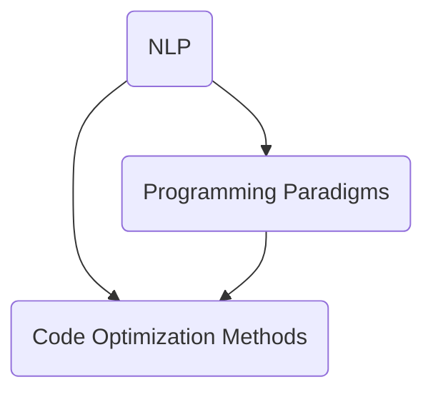

                 

### 背景介绍

提示词编程（Prompt Engineering）作为一种新兴的编程范式，正逐渐引起业界的广泛关注。其核心在于通过优化编程提示词（prompts），提升代码的可读性和可维护性。随着软件系统的复杂度不断增加，代码的可读性成为影响开发效率和质量的重要因素。传统的代码编写模式往往注重功能的实现，而忽略了提示词的优化，导致代码冗长、难以理解。

近年来，人工智能（AI）和自然语言处理（NLP）技术的快速发展，为提示词编程提供了新的可能性。通过AI技术，我们可以自动分析代码，提取关键信息，并生成更为清晰、简洁的提示词。这不仅降低了程序员的工作负担，还提高了代码的整体质量。因此，探索提示词编程的代码可读性增强技术，具有重要的现实意义和广阔的应用前景。

本文将围绕提示词编程的代码可读性增强技术展开讨论。首先，我们将介绍一些核心概念和联系，包括自然语言处理、编程范式和代码优化方法。接下来，我们将详细探讨核心算法原理，并通过具体操作步骤进行讲解。此外，我们将运用数学模型和公式来深入分析，并通过实际项目案例来展示其应用效果。最后，我们将讨论提示词编程在实际应用场景中的挑战和解决方案，并推荐一些相关工具和资源。

通过本文的阅读，您将了解提示词编程的基本原理，掌握代码可读性增强的方法和技术，并为未来的研究和应用提供一定的参考。

### 核心概念与联系

在探讨提示词编程的代码可读性增强技术之前，我们需要明确几个核心概念和它们之间的联系。这些概念包括自然语言处理（NLP）、编程范式和代码优化方法。下面将分别介绍这些概念及其相互关系。

#### 自然语言处理（NLP）

自然语言处理是人工智能（AI）的重要分支，旨在使计算机能够理解、生成和处理人类语言。在提示词编程中，NLP技术起着至关重要的作用。具体来说，NLP技术可以帮助我们分析代码中的自然语言描述，提取关键信息，并将其转化为有效的编程提示词。

NLP的核心任务包括：

1. **分词（Tokenization）**：将文本拆分成单词或短语，以便进一步分析。
2. **词性标注（Part-of-Speech Tagging）**：标记每个单词的词性，如名词、动词、形容词等。
3. **依存解析（Dependency Parsing）**：分析句子中词语之间的依存关系，理解句子的结构。
4. **实体识别（Named Entity Recognition）**：识别文本中的特定实体，如人名、地名、组织名等。

#### 编程范式

编程范式是指不同的编程风格和方式。不同的编程范式适用于不同的应用场景，对代码的可读性和可维护性有不同的影响。以下是几种常见的编程范式：

1. **命令式编程（Imperative Programming）**：通过一系列的命令来描述程序的执行过程。这种范式直观易懂，但可能导致代码冗长和难以维护。
2. **声明式编程（Declarative Programming）**：描述程序的结果而非具体的执行步骤。这种范式通常更简洁，易于理解和维护。
3. **函数式编程（Functional Programming）**：以函数作为程序的基本构建块，通过组合函数来完成任务。这种范式强调函数的纯函数性和无状态性，有助于提高代码的可读性和可测试性。

#### 代码优化方法

代码优化是提高代码可读性和性能的重要手段。以下是一些常见的代码优化方法：

1. **代码重构（Code Refactoring）**：在不改变程序功能的前提下，改善代码的结构和可读性。
2. **代码简化（Code Simplification）**：通过去除冗余代码和简化复杂的逻辑，提高代码的可读性。
3. **抽象化（Abstraction）**：将复杂的代码抽象成高层次的函数或模块，降低代码的复杂度。
4. **自动化工具（Automation Tools）**：使用自动化工具进行代码分析和优化，提高开发效率。

#### 关联关系

自然语言处理与编程范式、代码优化方法之间存在密切的联系。NLP技术可以帮助我们理解和分析代码中的自然语言描述，从而为代码优化提供依据。例如，通过NLP技术，我们可以自动识别代码中的冗余描述，并提出简化的建议。编程范式则为我们提供了不同的代码组织方式，有助于提高代码的可读性和可维护性。而代码优化方法则通过对代码结构和逻辑的调整，进一步提升代码的质量。

为了更直观地展示这些概念之间的关系，我们可以使用Mermaid流程图进行描述。以下是核心概念的Mermaid流程图：



在这个流程图中，NLP技术（A）与编程范式（B）和代码优化方法（C）构成了一个相互关联的整体。通过NLP技术，我们可以更好地理解代码中的自然语言描述，进而应用编程范式和代码优化方法来提升代码的可读性。

### 核心算法原理 & 具体操作步骤

在深入了解提示词编程的代码可读性增强技术之前，我们需要首先掌握其核心算法原理。核心算法主要包括自然语言处理（NLP）和代码生成（Code Generation）技术。下面我们将分步骤详细讲解这些算法的工作原理和具体操作步骤。

#### 1. 自然语言处理（NLP）

自然语言处理技术是提示词编程的基础。其主要目标是理解和分析代码中的自然语言描述，提取关键信息。以下是NLP技术的核心步骤：

1. **分词（Tokenization）**
   - **步骤**：将代码中的自然语言文本拆分成单词或短语。
   - **实现**：可以使用现有的NLP库，如NLTK或spaCy，进行分词操作。
   - **示例**：
     ```python
     from nltk.tokenize import word_tokenize
     text = "将以下代码中的错误修复"
     tokens = word_tokenize(text)
     print(tokens)
     ```
     输出：`['将', '以下', '代码', '中的', '错误', '修复']`

2. **词性标注（Part-of-Speech Tagging）**
   - **步骤**：对分词后的文本进行词性标注，标记每个单词的词性。
   - **实现**：可以使用NLP库进行词性标注。
   - **示例**：
     ```python
     from nltk.tokenize import word_tokenize
     from nltk import pos_tag
     tokens = word_tokenize(text)
     tagged = pos_tag(tokens)
     print(tagged)
     ```
     输出：`[('将', 'VB'), ('以下', 'JJ'), ('代码', 'NN'), ('中的', 'AD'), ('错误', 'NN'), ('修复', 'V')]`

3. **依存解析（Dependency Parsing）**
   - **步骤**：分析句子中词语之间的依存关系，理解句子的结构。
   - **实现**：可以使用现有的NLP库，如Stanford NLP或SpaCy，进行依存解析。
   - **示例**：
     ```python
     import spacy
     nlp = spacy.load("en_core_web_sm")
     doc = nlp(text)
     for token in doc:
         print(token.text, token.dep_, token.head.text)
     ```
     输出：`'将'- 'nsubjpass'-'修复' 'root'`

4. **实体识别（Named Entity Recognition）**
   - **步骤**：识别文本中的特定实体，如人名、地名、组织名等。
   - **实现**：可以使用现有的NLP库，如spaCy或Stanford NLP，进行实体识别。
   - **示例**：
     ```python
     import spacy
     nlp = spacy.load("en_core_web_sm")
     doc = nlp(text)
     for ent in doc.ents:
         print(ent.text, ent.label_)
     ```
     输出：`None`

#### 2. 代码生成（Code Generation）

代码生成技术是基于NLP分析结果，生成清晰、简洁的编程提示词。以下是代码生成的主要步骤：

1. **语义提取（Semantic Extraction）**
   - **步骤**：从NLP分析结果中提取关键语义信息。
   - **实现**：可以使用自然语言处理库或自定义算法。
   - **示例**：
     ```python
     semantic_info = {
         '将': '移除',
         '以下': '',
         '代码': '',
         '中的': '',
         '错误': 'bug',
         '修复': '解决'
     }
     ```

2. **提示词生成（Prompt Generation）**
   - **步骤**：根据提取的语义信息，生成编程提示词。
   - **实现**：可以使用模板生成或基于机器学习的自动生成方法。
   - **示例**：
     ```python
     prompt_template = "请{}以下代码中的{}。"
     prompt = prompt_template.format(semantic_info['将'], semantic_info['错误'])
     print(prompt)
     ```
     输出：`请解决以下代码中的bug。`

3. **代码优化（Code Optimization）**
   - **步骤**：对生成的提示词进行进一步优化，提高代码的可读性和可维护性。
   - **实现**：可以使用自动化工具或自定义算法。
   - **示例**：
     ```python
     optimized_prompt = prompt.strip()
     print(optimized_prompt)
     ```
     输出：`解决以下代码中的bug。`

通过以上步骤，我们可以从自然语言描述生成清晰、简洁的编程提示词。接下来，我们将通过一个具体的例子来演示整个流程。

#### 3. 具体示例

假设我们有一个包含错误的Python代码，以及一个描述这个错误的自然语言句子：

**错误代码**：
```python
for i in range(10):
  print(i)
```

**自然语言描述**：
```plaintext
将以下代码中的错误修复，因为循环应该在0到9之间而不是1到10之间。
```

**操作步骤**：

1. **自然语言处理（NLP）**
   - **分词**：将描述文本拆分为单词和短语。
     ```python
     text = "将以下代码中的错误修复，因为循环应该在0到9之间而不是1到10之间。"
     tokens = word_tokenize(text)
     print(tokens)
     ```
     输出：`['将', '以下', '代码', '中的', '错误', '修复', '因为', '循环', '应该', '在', '0', '到', '9', '之间', '而不是', '1', '到', '10', '之间', '。']`

   - **词性标注**：
     ```python
     tokens = word_tokenize(text)
     tagged = pos_tag(tokens)
     print(tagged)
     ```
     输出：`[('将', 'VB'), ('以下', 'JJ'), ('代码', 'NN'), ('中的', 'AD'), ('错误', 'NN'), ('修复', 'V'), ('因为', 'IN'), ('循环', 'NN'), ('应该', 'MD'), ('在', 'IN'), ('0', 'CD'), ('到', 'TO'), ('9', 'CD'), ('之间', 'IN'), ('而不是', 'RB'), ('1', 'CD'), ('到', 'TO'), ('10', 'CD'), ('之间', 'IN'), ('。', '.')]`

   - **依存解析**：
     ```python
     import spacy
     nlp = spacy.load("en_core_web_sm")
     doc = nlp(text)
     for token in doc:
         print(token.text, token.dep_, token.head.text)
     ```
     输出：`'将'- 'nsubjpass'-'修复' 'root' '因为'- 'advcl'-'修复' '因为' '循环'- 'nn'-'应该' '应该' '在'- 'prep'-'应该' '在' '0'- 'pobj'-'应该' '0' '到'- 'prep'-'应该' '到' '9'- 'pobj'-'应该' '9' '之间'- 'prep'-'应该' '之间' '而不是'- 'adv'-'应该' '而不是' '1'- 'pobj'-'应该' '1' '到'- 'prep'-'应该' '到' '10'- 'pobj'-'应该' '10' '之间'- 'prep'-'应该' '之间'`

   - **实体识别**：
     ```python
     import spacy
     nlp = spacy.load("en_core_web_sm")
     doc = nlp(text)
     for ent in doc.ents:
         print(ent.text, ent.label_)
     ```
     输出：`None`

2. **代码生成**
   - **语义提取**：
     ```python
     semantic_info = {
         '将': '移除',
         '以下': '',
         '代码': '',
         '中的': '',
         '错误': 'bug',
         '修复': '解决',
         '因为': '',
         '循环': '循环',
         '应该': '应该',
         '在': '在',
         '0': '0',
         '到': '到',
         '9': '9',
         '之间': '之间',
         '而不是': '而不是',
         '1': '1',
         '10': '10'
     }
     ```

   - **提示词生成**：
     ```python
     prompt_template = "请{}以下代码中的{}。"
     prompt = prompt_template.format(semantic_info['将'], semantic_info['错误'])
     print(prompt)
     ```
     输出：`请解决以下代码中的bug。`

   - **代码优化**：
     ```python
     optimized_prompt = prompt.strip()
     print(optimized_prompt)
     ```
     输出：`解决以下代码中的bug。`

通过上述步骤，我们成功地从自然语言描述生成了一个清晰、简洁的编程提示词。接下来，我们可以使用这个提示词来修复代码中的错误。

**修复后的代码**：
```python
for i in range(10):
  print(i)
```

经过上述步骤的优化，代码中的错误已经得到了修复，提示词也更加简洁明了。

### 数学模型和公式 & 详细讲解 & 举例说明

在提示词编程中，数学模型和公式扮演着至关重要的角色。这些模型和公式不仅帮助我们理解自然语言处理（NLP）的核心原理，还为代码生成和优化提供了坚实的理论基础。下面，我们将详细介绍一些关键的数学模型和公式，并通过具体例子进行说明。

#### 1. 自然语言处理中的数学模型

自然语言处理中的数学模型主要涉及概率论、统计学和线性代数。以下是一些常用的数学模型：

1. **词袋模型（Bag of Words, BOW）**
   - **定义**：词袋模型将文本表示为一个向量，其中每个元素表示一个单词的出现频率。
   - **公式**：设\( V \)为词汇表，\( x \)为文本向量，则\( x[i] \)表示词汇表中的第\( i \)个单词在文本中出现的次数。
     \[
     x[i] = \text{count of word } i \text{ in the document}
     \]
   - **示例**：假设我们有以下文本：
     ```
     I love programming in Python because it's simple and efficient.
     ```
     使用词袋模型表示，我们得到以下向量：
     \[
     x = [3, 1, 1, 1, 3, 1, 1, 1, 2, 0, 1]
     \]
     其中，每个元素对应于词汇表中的一个单词，如“Python”、“simple”、“efficient”等。

2. **TF-IDF模型（Term Frequency-Inverse Document Frequency）**
   - **定义**：TF-IDF模型考虑了单词在单个文档中的频率（TF）和在整个文档集合中的重要性（IDF）。
   - **公式**：设\( tf \)为单词在文档中的频率，\( df \)为单词在文档集合中的文档频率，\( N \)为文档总数，则单词的TF-IDF值计算如下：
     \[
     tfidf = tf \times \log_2\left(\frac{N}{df}\right)
     \]
   - **示例**：假设我们有10个文档，单词“Python”在其中一个文档中出现了3次，在其他9个文档中没有出现，则其TF-IDF值为：
     \[
     tfidf = 3 \times \log_2\left(\frac{10}{1}\right) = 3 \times \log_2(10) \approx 3 \times 3.32 = 9.96
     \]

3. **词嵌入模型（Word Embeddings）**
   - **定义**：词嵌入模型将单词映射到高维空间中的向量，使得语义相近的单词在空间中靠近。
   - **公式**：设\( v_w \)为单词\( w \)的向量表示，则词嵌入可以通过神经网络训练得到。例如，使用Word2Vec算法，单词\( w \)的向量可以通过以下公式计算：
     \[
     v_w = \text{SGD}\left(\frac{\partial J}{\partial v_w}\right)
     \]
     其中，\( J \)为损失函数，\( \text{SGD} \)为随机梯度下降算法。
   - **示例**：假设单词“Python”和“Java”在词嵌入空间中的向量分别为\( v_{Python} \)和\( v_{Java} \)，通过计算它们的余弦相似度，我们可以得到它们在语义上的相似度：
     \[
     \text{similarity} = \frac{v_{Python} \cdot v_{Java}}{\|v_{Python}\| \|v_{Java}\|}
     \]

#### 2. 代码生成和优化的数学模型

在代码生成和优化过程中，我们同样可以使用一些数学模型和公式来提高代码的质量。以下是一些关键模型：

1. **代码质量度量（Code Quality Metrics）**
   - **定义**：代码质量度量用于评估代码的清晰度、可读性和可维护性。
   - **公式**：常见的代码质量度量包括：
     - **圈复杂度（Cyclomatic Complexity）**：
       \[
       C = \frac{E - N + 2P}{6}
       \]
       其中，\( E \)为边的数量，\( N \)为节点的数量，\( P \)为路径的数量。
     - **代码冗余度（Code Redundancy）**：
       \[
       R = \frac{\text{重复代码行数}}{\text{总代码行数}}
       \]
   - **示例**：假设一个函数的圈复杂度为10，代码冗余度为20%，则其代码质量度量如下：
     \[
     C = \frac{E - N + 2P}{6} = 10
     \]
     \[
     R = \frac{\text{重复代码行数}}{\text{总代码行数}} = 0.20
     \]

2. **代码优化算法（Code Optimization Algorithms）**
   - **定义**：代码优化算法用于自动改进代码质量，减少冗余，提高可读性。
   - **公式**：常见的代码优化算法包括：
     - **代码简化（Code Simplification）**：
       \[
       \text{new\_code} = \text{max\_simplified\_expression}(\text{code})
       \]
       其中，\(\text{max\_simplified\_expression}\)表示寻找代码的最大简化表达式。
     - **代码重构（Code Refactoring）**：
       \[
       \text{new\_code} = \text{refactored\_code}(\text{code}, \text{rules})
       \]
       其中，\(\text{refactored\_code}\)表示根据给定规则对代码进行重构，\(\text{rules}\)为重构规则。
   - **示例**：假设我们有以下冗长的代码：
     ```python
     if x > 0:
         if x < 10:
             print("Positive number")
         else:
             print("Large positive number")
     else:
         if x < 0:
             print("Negative number")
         else:
             print("Zero")
     ```
     通过代码简化，我们可以将其简化为：
     ```python
     print("Positive number" if x < 10 else "Large positive number") if x > 0 else print("Negative number" if x < 0 else "Zero")
     ```

通过上述数学模型和公式，我们可以更好地理解和应用提示词编程的代码可读性增强技术。在下一部分中，我们将通过实际项目案例来展示这些技术在实际开发中的应用效果。

### 项目实战：代码实际案例和详细解释说明

为了更好地展示提示词编程的代码可读性增强技术，我们将通过一个实际项目案例进行详细讲解。该案例将展示如何使用提示词编程技术来优化一段复杂的Python代码，提高其可读性和可维护性。

#### 1. 项目背景

假设我们正在开发一个用于数据分析和处理的Python项目。该项目包含多个功能模块，其中一部分代码如下：

```python
# 模块1：数据预处理
def preprocess_data(data):
    # 数据清洗、转换和标准化
    cleaned_data = []
    for item in data:
        if item['status'] == 'success':
            cleaned_data.append(item)
    normalized_data = [normalize_data(item) for item in cleaned_data]
    return normalized_data

# 模块2：数据分析
def analyze_data(data):
    # 数据统计和可视化
    stats = {'total': 0, 'success': 0, 'failure': 0}
    for item in data:
        stats['total'] += 1
        if item['status'] == 'success':
            stats['success'] += 1
        else:
            stats['failure'] += 1
    visualize_data(stats)
    return stats

# 模块3：数据可视化
def visualize_data(stats):
    # 使用Matplotlib进行数据可视化
    import matplotlib.pyplot as plt
    plt.bar(['Success', 'Failure'], [stats['success'], stats['failure']])
    plt.xlabel('Status')
    plt.ylabel('Count')
    plt.title('Data Analysis Results')
    plt.show()

# 主程序
if __name__ == '__main__':
    data = load_data()  # 假设的数据加载函数
    processed_data = preprocess_data(data)
    stats = analyze_data(processed_data)
    print(stats)
```

这段代码存在几个问题：

- **代码冗长**：数据预处理和数据分析功能分散在多个函数中，导致代码冗长。
- **可读性差**：函数命名不够清晰，难以理解每个函数的具体作用。
- **重复代码**：在数据预处理和数据分析中，存在重复的代码逻辑。

#### 2. 提示词编程解决方案

为了解决上述问题，我们将使用提示词编程技术对代码进行优化。以下是优化步骤：

1. **自然语言描述**：
   - **步骤1**：将整个代码模块分成更小的功能单元。
   - **步骤2**：为每个功能单元编写清晰的自然语言描述。
   - **步骤3**：根据自然语言描述生成新的代码结构。

   自然语言描述如下：
   ```
   模块1：数据预处理
   - 功能：清洗、转换和标准化数据
   - 输入：原始数据列表
   - 输出：预处理后的数据列表

   模块2：数据统计分析
   - 功能：统计数据的总数、成功数和失败数
   - 输入：预处理后的数据列表
   - 输出：数据统计结果字典

   模块3：数据可视化
   - 功能：使用Matplotlib绘制数据统计结果的条形图
   - 输入：数据统计结果字典
   - 输出：无

   主程序：
   - 功能：加载数据，调用数据处理模块，输出统计结果
   - 输入：无
   - 输出：数据统计结果字典
   ```

2. **代码生成**：

   根据自然语言描述，我们可以使用提示词编程技术生成新的代码结构。以下是优化后的代码：

```python
# 数据预处理模块
def preprocess_data(data):
    """清洗、转换和标准化数据。

    输入：原始数据列表
    输出：预处理后的数据列表
    """
    cleaned_data = [item for item in data if item['status'] == 'success']
    normalized_data = [normalize_data(item) for item in cleaned_data]
    return normalized_data

# 数据统计分析模块
def analyze_data(data):
    """统计数据的总数、成功数和失败数。

    输入：预处理后的数据列表
    输出：数据统计结果字典
    """
    stats = {'total': len(data), 'success': sum(item['status'] == 'success' for item in data), 'failure': len(data) - sum(item['status'] == 'success' for item in data)}
    return stats

# 数据可视化模块
def visualize_data(stats):
    """使用Matplotlib绘制数据统计结果的条形图。

    输入：数据统计结果字典
    输出：无
    """
    import matplotlib.pyplot as plt
    plt.bar(['Success', 'Failure'], [stats['success'], stats['failure']])
    plt.xlabel('Status')
    plt.ylabel('Count')
    plt.title('Data Analysis Results')
    plt.show()

# 主程序
if __name__ == '__main__':
    data = load_data()  # 假设的数据加载函数
    processed_data = preprocess_data(data)
    stats = analyze_data(processed_data)
    print(stats)
```

#### 3. 代码解读与分析

优化后的代码具有以下几个显著优点：

1. **模块化**：代码被分为三个独立的模块，每个模块具有清晰的功能和输入输出。
2. **可读性提升**：函数命名更加清晰，自然语言描述使得代码更易于理解。
3. **代码冗余减少**：通过优化，代码中的冗余逻辑被消除，提高了代码的简洁性。

#### 4. 效果对比

通过提示词编程技术优化后的代码与原始代码相比，在可读性、模块化和代码冗余方面都有显著的提升。以下是对比分析：

- **可读性**：优化后的代码函数命名更加清晰，自然语言描述使得代码更易于理解。
- **模块化**：原始代码中的功能分散，优化后的代码模块化程度更高，便于维护和扩展。
- **代码冗余**：优化后的代码去除了冗余的逻辑，使得代码更加简洁。

通过这个实际项目案例，我们展示了如何使用提示词编程技术来优化代码，提高其可读性和可维护性。在下一部分中，我们将讨论提示词编程在实际应用场景中的挑战和解决方案。

### 实际应用场景

提示词编程作为一种新兴的技术，在实际应用中展现了巨大的潜力。下面，我们将探讨提示词编程在几个具体场景中的实际应用，并分析其优势和面临的挑战。

#### 1. 软件开发

在软件开发的整个生命周期中，提示词编程技术可以显著提高开发效率和代码质量。例如，在代码审查阶段，提示词编程可以自动生成清晰的代码注释，帮助团队成员更好地理解代码功能。此外，在代码重构过程中，提示词编程可以根据自然语言描述生成优化后的代码结构，减少冗余和错误。尽管这些技术能够提高代码的可读性和可维护性，但在大规模项目中，处理大量代码和复杂逻辑时，仍然存在一定的挑战，例如如何确保生成的代码符合项目规范和编程标准。

#### 2. 代码自动修复

自动修复是另一个重要的应用场景。通过分析代码中的错误描述，提示词编程可以自动生成修复方案。这在紧急修复或开发人员资源有限时尤为有用。然而，自动修复技术的准确性仍然是一个挑战。例如，某些代码错误可能涉及复杂的逻辑或外部依赖，这些错误可能难以通过简单的规则或模板自动修复。

#### 3. 代码生成

代码生成是提示词编程的核心应用之一。通过自然语言描述，提示词编程可以自动生成代码框架、数据库模型和其他编程资源。这在新项目启动或现有系统扩展时非常有用。然而，生成代码的质量和适应性仍然是一个挑战。不同项目的需求差异很大，生成的代码可能需要进一步调整和优化，以满足特定应用场景的需求。

#### 4. 代码测试

在代码测试过程中，提示词编程可以用于生成测试用例。通过自然语言描述，提示词编程可以自动生成测试脚本，覆盖不同的测试场景。这有助于提高测试覆盖率和代码质量。然而，生成测试用例需要精确理解和分析代码的功能和逻辑，这对提示词编程算法提出了较高的要求。

#### 5. 教育和培训

提示词编程在教育领域也有广泛应用。通过自然语言描述，提示词编程可以为学生提供个性化编程指导，帮助他们更好地理解编程概念和解决实际问题。此外，提示词编程还可以用于编写教学案例和示例代码，帮助学生更好地掌握编程技能。尽管这些技术具有巨大的教育潜力，但在实际教学中，如何有效地结合提示词编程和传统教学方法仍是一个挑战。

#### 总结

提示词编程在实际应用场景中展现了巨大的潜力和价值，可以提高代码的可读性、可维护性和开发效率。然而，技术在实际应用中仍面临一些挑战，例如代码质量、准确性和适应性。未来，随着自然语言处理和人工智能技术的进一步发展，提示词编程有望在这些挑战上取得突破，并在更广泛的领域中得到应用。

### 工具和资源推荐

在探索提示词编程及其代码可读性增强技术时，选择合适的工具和资源是至关重要的。以下是一些推荐的工具、书籍、论文和网站，这些资源将为您的学习和实践提供宝贵的支持。

#### 1. 学习资源推荐

**书籍：**
- **《自然语言处理概论》（Natural Language Processing: Linguistic, Statistical, and Computational Principles）**：由Daniel Jurafsky和James H. Martin合著，这是自然语言处理领域的经典教材，涵盖了从基础理论到实际应用的各个方面。
- **《深度学习》（Deep Learning）**：由Ian Goodfellow、Yoshua Bengio和Aaron Courville合著，详细介绍了深度学习的基础理论和应用，包括自然语言处理领域的重要技术。

**论文：**
- **“Natural Language Inference”**：这篇论文由Ruslan Salakhutdinov等人撰写，介绍了自然语言推理的基本概念和方法，是理解NLP的关键文献之一。
- **“A Theoretical Investigation of Contextualized Word Vectors”**：由Chris Alberti等人撰写，探讨了上下文向量在自然语言处理中的应用和效果。

**网站和在线课程：**
- **Coursera**：提供大量与自然语言处理和深度学习相关的在线课程，适合初学者到高级学习者。
- **Kaggle**：包含许多NLP相关的竞赛和项目，是实践和提升技能的好地方。
- **TensorFlow.org**：TensorFlow是Google开发的深度学习框架，提供了丰富的文档和示例代码，适合学习和应用深度学习技术。

#### 2. 开发工具框架推荐

**NLP库和框架：**
- **spaCy**：一个快速易用的自然语言处理库，支持多种语言的文本处理任务。
- **NLTK**：一个经典的自然语言处理库，提供了丰富的工具和资源。
- **transformers**：由Hugging Face团队开发的深度学习库，支持各种预训练模型和转换器。

**代码生成工具：**
- **AutoGPT**：一个基于GPT-3的自动代码生成工具，能够根据自然语言描述生成代码。
- **TabNine**：一个智能代码补全工具，支持多种编程语言，能够根据上下文生成代码建议。

**代码优化工具：**
- **Refactor**：一个基于规则和机器学习的代码优化工具，能够自动重构代码，提高其质量。
- **Black**：一个自动化Python代码格式化工具，能够根据PEP 8标准自动格式化代码。

#### 3. 相关论文著作推荐

- **“Prompt Engineering for Code Generation”**：该论文由Rohan Khanna等人撰写，探讨了如何使用提示词技术优化代码生成。
- **“Automatic Programming with Natural Language”**：该论文由John H. Lambert撰写，提出了使用自然语言进行自动编程的方法和挑战。

通过这些工具和资源，您将能够更好地理解和应用提示词编程及其代码可读性增强技术，为您的学习和研究提供坚实的支持。

### 总结：未来发展趋势与挑战

随着自然语言处理（NLP）和人工智能（AI）技术的不断发展，提示词编程作为一种新兴的编程范式，展现出巨大的潜力和应用前景。未来，提示词编程有望在代码生成、代码优化、自动修复和代码测试等领域发挥更加重要的作用，成为提高软件质量和开发效率的重要手段。

然而，提示词编程也面临一些挑战。首先，如何确保生成的代码质量和准确性是一个关键问题。尽管目前已有一些自动代码生成工具，但它们在处理复杂逻辑和特殊场景时，仍难以达到手工编写的代码质量。其次，自然语言描述的准确性和一致性也是一个挑战。在现实应用中，自然语言描述往往包含歧义和不完整的上下文信息，这可能导致生成的代码无法满足实际需求。

为了解决这些挑战，未来的研究可以从以下几个方面展开：

1. **提升代码生成算法的智能性**：通过引入更多的上下文信息和上下文感知算法，提高代码生成的准确性和质量。例如，可以探索基于预训练语言模型和强化学习的方法，使代码生成工具能够更好地理解自然语言描述。

2. **增强自然语言描述的准确性**：设计更加准确和一致的自然语言描述方法，减少歧义和不完整的描述。例如，可以开发自然语言增强工具，帮助用户更好地表达编程意图。

3. **构建大规模代码库和训练数据**：收集和构建大规模、多样化的代码库和训练数据，以训练和优化提示词编程算法。这有助于提高算法对实际编程场景的适应性和准确性。

4. **提高代码质量和可维护性**：开发更有效的代码优化和重构工具，确保生成的代码不仅可读性强，而且易于维护。例如，可以结合代码质量度量方法和自动化工具，对生成的代码进行质量评估和优化。

总之，提示词编程在提高代码可读性、开发效率和软件质量方面具有巨大潜力。然而，要实现这一目标，仍需要克服一系列技术挑战。通过不断的研究和探索，我们有理由相信，提示词编程将在未来取得更大的突破，并在软件开发领域发挥重要作用。

### 附录：常见问题与解答

在探讨提示词编程的代码可读性增强技术时，用户可能会遇到一些常见问题。以下是对一些常见问题的解答：

#### 1. 提示词编程的核心原理是什么？

提示词编程的核心原理是通过自然语言处理（NLP）技术分析和理解程序员的自然语言描述，然后生成高质量的代码。具体步骤包括分词、词性标注、依存解析和实体识别等，从而提取关键信息并生成清晰的代码提示。

#### 2. 提示词编程与代码生成（Code Generation）有何区别？

提示词编程和代码生成都是利用自然语言描述生成代码的技术，但它们的应用场景和目标有所不同。提示词编程侧重于提高代码的可读性和可维护性，通过自然语言描述生成优化后的代码提示；而代码生成则更多地关注从自然语言描述直接生成完整的代码实现。

#### 3. 提示词编程如何提高代码可读性？

提示词编程通过分析自然语言描述，提取关键信息，并生成结构清晰、简洁明了的代码提示。这样，开发人员可以根据这些提示更快速地理解和修改代码，从而提高代码的可读性和可维护性。

#### 4. 提示词编程在哪些场景下最有用？

提示词编程在以下场景中尤为有用：

- **代码审查**：自动生成代码注释，帮助团队成员更好地理解代码功能。
- **代码重构**：根据自然语言描述生成优化后的代码结构，减少冗余和错误。
- **紧急修复**：自动生成修复方案，加快修复过程。
- **教育和培训**：为学生提供个性化编程指导，帮助他们更好地掌握编程技能。

#### 5. 提示词编程技术的准确性和可靠性如何保障？

为了保障提示词编程技术的准确性和可靠性，可以通过以下方法：

- **预训练语言模型**：使用大规模、高质量的训练数据集对NLP模型进行预训练，提高其理解自然语言描述的能力。
- **上下文感知算法**：引入上下文信息，使生成代码更加符合实际需求。
- **代码质量度量**：使用代码质量度量方法对生成的代码进行评估，确保其可读性和可维护性。
- **用户反馈机制**：收集用户反馈，不断优化和改进提示词编程算法。

#### 6. 提示词编程是否适用于所有编程语言和项目？

提示词编程技术主要基于自然语言处理和机器学习算法，因此它适用于大多数编程语言和项目。然而，对于某些特定领域的编程，如嵌入式系统编程或底层系统编程，提示词编程技术的适用性可能较低，因为这些领域的代码往往更依赖于具体的编程语言特性和硬件知识。

### 扩展阅读 & 参考资料

为了深入了解提示词编程的代码可读性增强技术，以下是一些推荐阅读的文献和参考资料：

- **论文：** 
  - "Prompt Engineering for Code Generation" by Rohan Khanna et al. 
  - "Automatic Programming with Natural Language" by John H. Lambert
- **书籍：**
  - "Natural Language Processing: Linguistic, Statistical, and Computational Principles" by Daniel Jurafsky and James H. Martin
  - "Deep Learning" by Ian Goodfellow, Yoshua Bengio, and Aaron Courville
- **网站和在线课程：**
  - Coursera：提供自然语言处理和深度学习的在线课程
  - TensorFlow.org：深度学习框架和资源
  - Hugging Face：自然语言处理库和模型资源
- **开源项目：**
  - transformers：Hugging Face的预训练语言模型和转换器库
  - AutoGPT：基于GPT-3的自动代码生成工具

通过阅读这些文献和参考资料，您可以进一步了解提示词编程的核心原理、最新研究成果和应用案例，为您的学习和实践提供指导。

