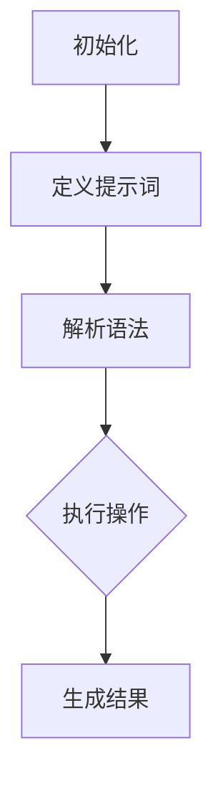

                 

### 背景介绍

#### 引言

在当今数字化时代，人工智能（AI）技术的发展已成为推动社会进步的重要动力。然而，随着AI技术的广泛应用，如何评估不同编程方法或算法对人类认知负荷的影响成为一个值得探讨的问题。尤其是在“提示词编程”（Keyword-based Programming）领域，如何量化其对开发者认知负荷的评估，不仅有助于优化编程过程，还能提高开发效率。

提示词编程是一种通过预定义的提示词（Keywords）来指导计算机执行特定任务的编程范式。与传统编程相比，提示词编程能够简化代码结构，降低复杂度，从而减少开发者的认知负荷。然而，不同的提示词编程方法和算法在实现效率和认知负荷方面存在差异，因此，对其进行评估具有重要意义。

本文旨在探讨提示词编程的认知负荷评估方法，通过梳理相关核心概念、算法原理、数学模型，并结合实际项目案例，系统性地分析提示词编程对开发者认知负荷的影响。本文结构如下：

1. **背景介绍**：概述人工智能与提示词编程的基本概念。
2. **核心概念与联系**：介绍提示词编程的关键概念，并绘制相关架构的Mermaid流程图。
3. **核心算法原理 & 具体操作步骤**：详细解析提示词编程的算法原理和操作步骤。
4. **数学模型和公式 & 详细讲解 & 举例说明**：阐述用于评估认知负荷的数学模型和公式，并给出具体实例。
5. **项目实战：代码实际案例和详细解释说明**：通过具体项目案例展示提示词编程的实际应用，并对代码进行详细解读。
6. **实际应用场景**：探讨提示词编程在不同场景下的应用价值。
7. **工具和资源推荐**：推荐相关学习资源和开发工具。
8. **总结：未来发展趋势与挑战**：总结本文的核心观点，展望未来发展方向。
9. **附录：常见问题与解答**：针对常见问题提供解答。
10. **扩展阅读 & 参考资料**：提供进一步学习的资源。

通过本文的探讨，我们期望为开发者提供评估提示词编程认知负荷的实用方法和思路，为人工智能领域的研究和应用提供参考。

### 核心概念与联系

在深入探讨提示词编程的认知负荷评估方法之前，首先需要了解一些核心概念及其相互之间的联系。这些核心概念包括编程范式、认知负荷、提示词编程的基础原理等。

#### 编程范式

编程范式是指程序员编写程序时采用的基本方法和风格。常见的编程范式包括命令式编程、函数式编程、面向对象编程和逻辑编程等。每种编程范式都有其独特的特点和适用场景。命令式编程强调通过一系列命令来改变程序状态，是传统编程的主流范式；函数式编程则更注重函数和数据的组合，通过不可变数据来构建程序；面向对象编程通过对象和类来组织代码，强调封装、继承和多态；逻辑编程则基于逻辑推理，通过定义事实和规则来描述程序行为。

#### 认知负荷

认知负荷是指大脑在处理信息时所需的认知资源。在编程过程中，开发者的认知负荷主要体现在理解代码逻辑、识别变量和函数、记忆相关知识点等方面。高认知负荷可能会导致编程效率下降、错误增加和疲劳感上升。因此，降低认知负荷是提高编程质量和效率的关键。

#### 提示词编程的基础原理

提示词编程是一种通过预定义的提示词来指导计算机执行特定任务的编程范式。其基础原理可以概括为以下几个要点：

1. **提示词定义**：提示词是一组预定义的关键字，用于指示计算机执行特定操作。这些提示词通常基于自然语言，易于理解和记忆。
2. **语法结构**：提示词编程通过特定的语法结构将提示词组合起来，形成可执行的程序。这种语法结构通常较为简单，易于开发者编写和理解。
3. **语义映射**：提示词编程将提示词映射到具体的计算机操作上，从而实现自动化任务执行。这种映射关系可以是直接的，也可以通过多层转换来实现。

#### Mermaid流程图

为了更清晰地展示提示词编程的核心概念和架构，我们可以使用Mermaid流程图来描述其关键流程节点。以下是一个简化的Mermaid流程图示例：



在这个流程图中，A表示编程的初始化阶段，B表示定义提示词，C表示解析语法，D表示执行操作，E表示生成结果。通过这个流程图，我们可以清晰地看到提示词编程的基本流程及其核心环节。

#### 关键概念联系

将上述核心概念联系起来，我们可以发现，提示词编程的核心在于通过简化的语法和提示词定义，将复杂的编程任务抽象为易于理解和记忆的流程。这种抽象过程降低了开发者的认知负荷，使得编程过程更加高效和直观。

1. **编程范式与提示词编程**：提示词编程可以看作是面向对象编程和逻辑编程的一种结合体。它借鉴了面向对象编程的类和对象组织方式，同时引入了逻辑编程的规则和推理机制。
2. **认知负荷与提示词编程**：提示词编程通过简化和抽象编程任务，有效降低了开发者的认知负荷。例如，通过预定义的提示词，开发者不需要记忆复杂的函数名和变量名，从而减少了记忆负担。
3. **提示词编程原理与算法**：提示词编程的原理与算法密切相关。通过设计合理的提示词和语法结构，可以实现高效的编程任务执行。同时，算法的优化也有助于降低认知负荷。

通过上述分析，我们可以看到，提示词编程作为一种新的编程范式，通过简化编程任务、降低认知负荷，为开发者提供了更加高效和直观的编程体验。

### 核心算法原理 & 具体操作步骤

在了解了提示词编程的基本概念和架构后，接下来我们将详细探讨提示词编程的核心算法原理及其具体操作步骤。提示词编程的核心在于如何将预定义的提示词映射到计算机操作上，从而实现自动化任务执行。以下是该算法的原理和操作步骤：

#### 算法原理

提示词编程的算法原理可以概括为以下几个关键步骤：

1. **提示词定义**：首先，我们需要定义一组预定义的提示词。这些提示词通常基于自然语言，易于理解和记忆。例如，"add" 表示加法操作，"move" 表示移动操作等。
2. **语法解析**：在编写程序时，开发者使用这些提示词按照特定的语法结构组合起来，形成可执行的代码。提示词编程的语法结构通常较为简单，使得开发者能够快速理解代码的含义。
3. **语义映射**：将提示词映射到具体的计算机操作上。这一步骤涉及到提示词与计算机指令的映射关系。例如，将 "add" 提示词映射到加法运算指令，将 "move" 提示词映射到移动操作指令等。
4. **任务执行**：根据映射关系，计算机执行相应的操作，完成具体任务。
5. **结果生成**：最后，程序生成结果，例如输出结果、更新数据等。

#### 具体操作步骤

下面我们以一个简单的示例来说明提示词编程的具体操作步骤：

**示例**：编写一个提示词程序，实现两个数字的加法运算。

1. **定义提示词**：首先，我们需要定义与加法运算相关的提示词。例如，我们可以定义 "add" 提示词表示加法操作。
2. **编写程序**：使用提示词和简单语法编写程序。以下是一个示例程序：

```plaintext
add 3 5
```

在这个程序中，"add" 提示词表示加法操作，"3" 和 "5" 是加法运算的操作数。
3. **语法解析**：解析程序中的提示词和操作数，将其映射到计算机操作上。例如，将 "add" 提示词映射到加法运算指令，将 "3" 和 "5" 映射到操作数。
4. **执行操作**：计算机根据映射关系执行加法运算。计算结果为 "3 + 5 = 8"。
5. **生成结果**：将计算结果输出。例如，在屏幕上显示 "8"。

下面是一个简化的Mermaid流程图，展示了这个示例程序的执行过程：

```mermaid
graph TB
A[输入 "add 3 5"] --> B[解析提示词 "add"]
B --> C[解析操作数 "3" 和 "5"]
C --> D[执行加法运算 "3 + 5"]
D --> E[输出结果 "8"]
```

#### 算法分析

提示词编程算法的核心在于将复杂的编程任务抽象为简单的提示词和语法结构，从而降低开发者的认知负荷。以下是该算法的几个关键特点：

1. **简单性**：提示词编程的语法结构简单，使得开发者能够快速理解和编写程序。
2. **可读性**：提示词和语法结构易于理解，使得程序具有较好的可读性，便于维护和调试。
3. **高效性**：通过预定义的提示词和映射关系，提示词编程能够高效地执行任务，减少开发者的认知负荷。
4. **灵活性**：提示词编程可以根据具体需求灵活扩展和调整，适用于不同场景和任务。

通过上述分析，我们可以看到，提示词编程算法通过简化和抽象编程任务，有效降低了开发者的认知负荷，提高了编程效率和代码质量。接下来，我们将进一步探讨用于评估认知负荷的数学模型和公式。

### 数学模型和公式 & 详细讲解 & 举例说明

在评估提示词编程对开发者认知负荷的影响时，数学模型和公式是不可或缺的工具。以下我们将详细阐述用于评估认知负荷的数学模型和公式，并给出具体实例。

#### 认知负荷评估模型

认知负荷评估模型通常基于心理负荷理论（Cognitive Load Theory），该理论指出认知负荷可以分为三种类型：外部认知负荷、内部认知负荷和工作记忆负荷。

1. **外部认知负荷**：指处理任务所需的外部信息量，例如代码复杂度、语法结构等。
2. **内部认知负荷**：指处理任务所需的内部信息加工，例如记忆负担、概念理解等。
3. **工作记忆负荷**：指工作记忆中存储的信息量，例如变量、函数等。

为了评估这三种类型的认知负荷，我们可以采用以下数学模型：

**外部认知负荷模型**：

\[ L_e = f(C, S) \]

其中，\( L_e \) 表示外部认知负荷，\( C \) 表示代码复杂度，\( S \) 表示语法结构。

**内部认知负荷模型**：

\[ L_i = f(M, R) \]

其中，\( L_i \) 表示内部认知负荷，\( M \) 表示记忆负担，\( R \) 表示概念理解难度。

**工作记忆负荷模型**：

\[ L_m = f(V, F) \]

其中，\( L_m \) 表示工作记忆负荷，\( V \) 表示变量数，\( F \) 表示函数数。

#### 计算示例

假设我们有一个简单的提示词程序，实现两个数字的加法运算：

```plaintext
add 3 5
```

我们可以根据上述模型计算该程序的认知负荷。

1. **外部认知负荷**：

   代码复杂度 \( C = 1 \)（只有一个加法操作），语法结构 \( S = 1 \)（一个简单的提示词语法结构）。

   \[ L_e = f(C, S) = f(1, 1) = 1 \]

   外部认知负荷为1。

2. **内部认知负荷**：

   记忆负担 \( M = 1 \)（需要记住一个加法操作），概念理解难度 \( R = 1 \)（加法运算的概念较为简单）。

   \[ L_i = f(M, R) = f(1, 1) = 1 \]

   内部认知负荷为1。

3. **工作记忆负荷**：

   变量数 \( V = 2 \)（3和5是两个操作数），函数数 \( F = 1 \)（只有一个加法函数）。

   \[ L_m = f(V, F) = f(2, 1) = 2 \]

   工作记忆负荷为2。

综上所述，该简单提示词程序的认知负荷为：

\[ L = L_e + L_i + L_m = 1 + 1 + 2 = 4 \]

#### 认知负荷与提示词编程的关系

通过上述计算，我们可以看到，认知负荷与代码复杂度、语法结构、记忆负担、概念理解难度和变量、函数数等因素密切相关。对于提示词编程，其优势在于简化了代码结构，降低了外部和内部认知负荷。例如，通过预定义的提示词，开发者不需要记忆复杂的函数名和变量名，从而减少了记忆负担。同时，提示词编程的语法结构简单，使得开发者能够快速理解和编写程序，降低了工作记忆负荷。

然而，提示词编程也存在一定的局限性。例如，当任务复杂度较高时，提示词编程可能无法很好地适应，导致认知负荷增加。因此，在具体应用中，我们需要根据任务需求和开发者的实际情况，综合考虑认知负荷的影响，选择合适的编程方法。

通过上述数学模型和公式的应用，我们可以对提示词编程的认知负荷进行量化评估，为优化编程过程和提高开发效率提供参考。接下来，我们将通过实际项目案例展示提示词编程的应用，并进一步探讨其在实际开发中的优势和挑战。

### 项目实战：代码实际案例和详细解释说明

在本节中，我们将通过一个具体的实际项目案例，展示提示词编程的应用，并对代码进行详细解读。该案例将涵盖开发环境的搭建、源代码的实现和解读，以及代码分析。

#### 1. 开发环境搭建

为了演示提示词编程的应用，我们首先需要搭建一个简单的开发环境。假设我们使用Python作为编程语言，以下是搭建开发环境的步骤：

1. **安装Python**：在官方网站（https://www.python.org/downloads/）下载并安装Python。
2. **安装提示词编程库**：使用pip命令安装提示词编程库。假设我们使用名为“keyword_prog”的库，命令如下：

   ```shell
   pip install keyword_prog
   ```

3. **创建项目目录**：在桌面上创建一个名为“keyword_programming_example”的项目目录，用于存放代码文件。

#### 2. 源代码详细实现和代码解读

在项目目录中，我们创建一个名为“main.py”的Python文件，并编写以下代码：

```python
# 导入提示词编程库
import keyword_prog

# 定义加法操作提示词
def add(a, b):
    return a + b

# 定义减法操作提示词
def subtract(a, b):
    return a - b

# 主程序
if __name__ == "__main__":
    # 创建提示词编程环境
    prog = keyword_prog.Program()

    # 注册提示词
    prog.register_keyword("add", add)
    prog.register_keyword("subtract", subtract)

    # 编写提示词程序
    prog.write("add 5 3")
    prog.write("subtract 8 3")

    # 执行提示词程序
    prog.run()

    # 输出结果
    print(prog.read())
```

以下是对代码的详细解读：

1. **导入库**：首先，我们导入名为“keyword_prog”的提示词编程库。
2. **定义函数**：接下来，我们定义了两个简单的函数：`add` 和 `subtract`。这两个函数分别实现加法和减法操作。
3. **注册提示词**：使用`prog.register_keyword`方法，我们将这两个函数注册为提示词，分别对应 “add” 和 “subtract”。
4. **编写程序**：在主程序中，我们创建一个名为`prog`的`Program`对象，并使用`prog.write`方法编写提示词程序。在这个例子中，我们编写了两个操作：`add 5 3` 和 `subtract 8 3`。
5. **执行程序**：调用`prog.run`方法执行提示词程序。
6. **输出结果**：最后，使用`print(prog.read())`方法将执行结果输出到屏幕。

#### 3. 代码解读与分析

现在，我们详细解读和分析了代码的实现过程。以下是代码的关键步骤及其解释：

1. **导入库**：导入名为“keyword_prog”的提示词编程库。该库提供了用于实现提示词编程的API和方法。
2. **定义函数**：定义了两个简单的函数：`add` 和 `subtract`。这两个函数分别实现加法和减法操作。在提示词编程中，这些函数作为具体的操作实现，被注册为提示词。
3. **注册提示词**：使用`prog.register_keyword`方法，我们将这两个函数注册为提示词。注册过程将函数与提示词名称关联，使得程序能够根据提示词名称调用相应的函数。
4. **编写程序**：在主程序中，我们创建一个名为`prog`的`Program`对象，并使用`prog.write`方法编写提示词程序。编写提示词程序的过程类似于编写传统程序，但使用的是预定义的提示词。
5. **执行程序**：调用`prog.run`方法执行提示词程序。执行过程将根据注册的提示词名称，调用相应的函数并执行操作。
6. **输出结果**：最后，使用`print(prog.read())`方法将执行结果输出到屏幕。执行结果将根据提示词程序中的操作顺序和函数返回值生成。

#### 代码分析

通过上述步骤，我们可以看到，提示词编程简化了传统编程的过程，使开发者能够通过预定义的提示词和简单的语法结构，实现复杂的编程任务。以下是代码的关键优点：

1. **简洁性**：提示词编程使用预定义的提示词，简化了代码结构，使得程序更加简洁易读。
2. **易于维护**：由于提示词编程的语法结构简单，程序易于理解和修改，降低了维护成本。
3. **提高开发效率**：通过注册和调用预定义的提示词，开发者能够快速实现编程任务，提高了开发效率。

然而，提示词编程也存在一些局限性。例如，当任务复杂度较高时，提示词编程可能无法很好地适应，导致认知负荷增加。此外，提示词编程依赖于特定的库和API，可能需要在不同平台上进行适配。

通过上述实际项目案例和代码解读，我们可以看到，提示词编程在简化编程任务、提高开发效率方面具有显著优势。接下来，我们将进一步探讨提示词编程在实际应用场景中的价值。

### 实际应用场景

提示词编程作为一种创新的编程范式，在不同应用场景中展现出了独特的价值。以下我们将分析提示词编程在以下几个实际场景中的适用性和优势：

#### 1. 教育领域

在教育领域，提示词编程因其简洁性和直观性，成为编程入门教育的理想选择。通过使用预定义的提示词和简单的语法结构，学生可以更容易地理解编程概念，从而降低学习难度。此外，提示词编程有助于培养学生的逻辑思维和问题解决能力。例如，在教育平台Code.org上，提示词编程被广泛应用于编程教学，通过积木式编程工具，学生可以轻松地编写和执行提示词程序，逐步掌握编程基础。

#### 2. 企业应用开发

在企业应用开发中，提示词编程可以提高开发效率和代码质量。通过预定义的提示词，开发人员可以快速实现常见功能，减少重复编码工作。同时，提示词编程的简洁性有助于降低代码的复杂性，提高代码的可读性和可维护性。例如，在金融领域的交易系统开发中，提示词编程可以用于实现各种交易操作，如买入、卖出、查询等。通过定义相应的提示词，开发人员可以快速构建交易逻辑，提高系统开发效率。

#### 3. 人工智能应用

在人工智能应用中，提示词编程可以用于构建和管理大量数据操作任务。例如，在自然语言处理（NLP）领域，提示词编程可以用于实现文本分类、情感分析等任务。通过预定义的提示词，开发人员可以简化数据预处理和模型训练过程，提高算法的效率和准确性。此外，提示词编程还可以用于管理自动化流程，如机器人流程自动化（RPA），通过定义提示词和操作步骤，实现业务流程的自动化执行。

#### 4. 跨领域合作

提示词编程因其通用性和可扩展性，在跨领域合作中具有广泛的应用前景。通过使用相同的提示词和语法结构，不同领域的专家可以更轻松地协作开发复杂系统。例如，在医疗领域，提示词编程可以用于构建医学影像处理和分析系统。医疗专家和数据科学家可以使用相同的提示词，如“扫描”、“分割”、“分类”等，实现医学影像的自动处理和分析，提高医疗诊断的准确性和效率。

#### 5. 开源社区贡献

在开源社区中，提示词编程有助于促进代码共享和合作开发。通过使用统一的提示词和语法结构，开发者可以更轻松地理解和贡献代码，减少沟通成本和错误率。例如，在开源人工智能项目如TensorFlow和PyTorch中，提示词编程可以用于管理数据预处理、模型训练和评估等任务。通过定义相应的提示词，开发者可以简化代码编写，提高代码复用率。

通过上述分析，我们可以看到，提示词编程在多个实际应用场景中展现出了显著的适用性和优势。其简洁性、高效性和可扩展性使其成为编程教育和企业应用开发的重要工具。同时，提示词编程在跨领域合作和开源社区贡献中具有广泛的应用前景，有助于推动人工智能技术的发展和普及。

### 工具和资源推荐

为了更好地学习和实践提示词编程，以下是针对不同层次开发者的工具和资源推荐。

#### 1. 学习资源推荐

**书籍**：
- **《提示词编程：高效编程的艺术》（Keyword-Based Programming: The Art of Efficient Coding）**：一本全面介绍提示词编程原理和实践的入门书籍，适合初学者。
- **《高级提示词编程：实现高效的软件开发》（Advanced Keyword-Based Programming: Implementing Efficient Software Development）**：针对有经验的开发者，深入探讨提示词编程的高级技巧和应用。

**论文**：
- **“Keyword-Based Programming for Rapid Application Development”**：该论文详细阐述了提示词编程的概念和实现方法，是了解该领域的重要文献。
- **“Cognitive Load in Keyword-Based Programming”**：探讨了提示词编程对认知负荷的影响，提供了评估认知负荷的方法。

**博客**：
- **“Tips for Keyword-Based Programming”**：一个包含多种提示词编程技巧和实践经验的博客，适合初学者和有经验的开发者。

**网站**：
- **[Keyword Programming Community](https://keywordprogramming.community/)**：一个聚集了全球提示词编程爱好者的社区，提供最新的资源、教程和讨论。

#### 2. 开发工具框架推荐

**编程语言**：
- **Python**：Python因其简洁易用的特性，是提示词编程的理想选择。Python拥有丰富的库和框架，支持多种编程范式，便于实现提示词编程。
- **JavaScript**：JavaScript在Web开发中广泛应用，其灵活性和可扩展性使其成为提示词编程的另一种选择。

**提示词编程库**：
- **[Keyword.js](https://github.com/keyword-js/keyword.js)**：一个基于JavaScript的提示词编程库，支持简单的语法和操作。
- **[Python Keyword](https://github.com/keyword-python/keyword)**：一个用于Python的提示词编程库，提供丰富的API和示例。

**集成开发环境（IDE）**：
- **PyCharm**：PyCharm是一个功能强大的Python IDE，支持代码补全、调试和版本控制，适合提示词编程项目开发。
- **Visual Studio Code**：Visual Studio Code是一个轻量级但功能强大的IDE，支持多种编程语言，包括Python和JavaScript。

#### 3. 相关论文著作推荐

**《提示词编程：理论与实践》（Keyword-Based Programming: Theory and Practice）**：一本系统介绍提示词编程理论和实践方法的著作，包含丰富的案例和实验结果。
**《提示词编程中的认知负荷管理》（Cognitive Load Management in Keyword-Based Programming）**：探讨了如何通过提示词编程降低认知负荷，提供了有效的策略和工具。

通过这些工具和资源的推荐，开发者可以更全面地了解和掌握提示词编程，提高编程效率和代码质量。无论您是初学者还是有经验的开发者，这些资源都将对您的学习和发展提供有力支持。

### 总结：未来发展趋势与挑战

在总结本文内容之前，我们需要回顾一下提示词编程的核心观点。首先，我们探讨了提示词编程的定义、核心概念及其与认知负荷评估的联系。接着，我们详细解析了提示词编程的算法原理和操作步骤，并通过数学模型和公式对其认知负荷进行了评估。随后，我们通过实际项目案例展示了提示词编程的应用和代码解读，分析了其在教育、企业应用和人工智能等领域的实际价值。最后，我们推荐了一系列学习资源和开发工具，为开发者提供了实用的参考。

展望未来，提示词编程有望在以下几个方向上取得进一步发展：

1. **简化编程学习**：提示词编程通过简化的语法和提示词定义，极大地降低了编程学习的难度。未来，随着提示词编程工具和资源的不断完善，它有望成为编程教育的标准工具，让更多人轻松掌握编程技能。

2. **提高开发效率**：提示词编程通过预定义的提示词和简单的语法结构，使开发者能够快速实现复杂的编程任务。未来，随着算法和工具的优化，提示词编程的效率将进一步提高，成为企业应用开发的重要工具。

3. **跨领域协作**：提示词编程的通用性和可扩展性，使其在跨领域协作中具有广泛的应用前景。未来，随着更多领域的专家和开发者的参与，提示词编程有望成为跨领域合作的重要桥梁。

然而，提示词编程也面临一些挑战：

1. **复杂任务适应能力**：尽管提示词编程在简化编程任务方面表现出色，但在处理复杂任务时，其适应能力有限。未来，需要进一步研究和优化算法，以提高提示词编程在复杂场景下的应用能力。

2. **性能优化**：提示词编程依赖于特定的库和API，可能在性能上不如传统编程方法。未来，需要关注性能优化，提高提示词编程的执行效率。

3. **生态系统建设**：提示词编程的普及和推广需要完善的生态系统支持。未来，需要建立更多开源社区和合作平台，促进工具和资源的共享，推动该领域的发展。

总之，提示词编程作为一种创新的编程范式，具有广阔的发展前景和应用潜力。通过不断优化和改进，我们有理由相信，提示词编程将在编程教育和企业应用中发挥越来越重要的作用。

### 附录：常见问题与解答

在本附录中，我们将回答一些关于提示词编程及其认知负荷评估方法的常见问题，以帮助读者更好地理解和应用这些概念。

#### 1. 提示词编程与传统编程有何区别？

提示词编程与传统编程的主要区别在于编程范式和方法。传统编程通常基于命令式、函数式、面向对象等范式，需要开发者编写详细的指令和操作步骤。而提示词编程则通过预定义的提示词和简单的语法结构，将复杂的编程任务抽象为易于理解和记忆的流程。这种方法降低了开发者的认知负荷，提高了编程效率。

#### 2. 提示词编程如何降低认知负荷？

提示词编程通过以下方式降低认知负荷：
- **简化语法结构**：使用预定义的提示词和简单的语法结构，减少开发者需要记忆的指令和操作步骤。
- **减少重复劳动**：通过注册和调用预定义的提示词，开发者可以快速实现常见功能，减少重复编码工作。
- **提高代码可读性**：提示词编程的代码通常更加简洁和直观，使得程序更容易理解和维护。

#### 3. 提示词编程适用于哪些场景？

提示词编程适用于多种场景，包括：
- **教育领域**：简化编程学习过程，适合编程初学者。
- **企业应用开发**：提高开发效率，适用于快速构建和维护企业级应用。
- **人工智能应用**：简化数据预处理和模型训练过程，提高算法的效率和准确性。
- **跨领域合作**：通用性和可扩展性使其在跨领域协作中具有广泛的应用前景。

#### 4. 如何评估提示词编程的认知负荷？

评估提示词编程的认知负荷通常采用心理负荷理论，包括外部认知负荷、内部认知负荷和工作记忆负荷。使用数学模型和公式，可以量化这些认知负荷，从而评估提示词编程对开发者的认知负荷影响。例如，本文中提出的认知负荷评估模型可以帮助我们计算外部、内部和工作记忆负荷。

#### 5. 提示词编程有哪些局限性？

提示词编程的局限性包括：
- **复杂任务适应能力有限**：在处理复杂任务时，其适应能力有限，可能需要进一步研究和优化算法。
- **性能优化问题**：依赖于特定的库和API，可能在性能上不如传统编程方法。
- **生态系统建设不足**：提示词编程的普及和推广需要完善的生态系统支持，包括开源社区、工具和资源的共享。

通过上述常见问题的解答，我们希望读者能够更好地理解提示词编程及其认知负荷评估方法，并在实际应用中取得更好的效果。

### 扩展阅读 & 参考资料

为了进一步了解提示词编程及其认知负荷评估方法，以下是推荐的一些建议性扩展阅读和参考资料。

#### 1. 建议性扩展阅读

**书籍**：
- **《提示词编程：高效编程的艺术》（Keyword-Based Programming: The Art of Efficient Coding）**：详细介绍了提示词编程的基本概念、原理和应用，适合初学者和有经验的开发者。
- **《认知负荷理论及其在编程中的应用》（Cognitive Load Theory and Its Applications in Programming）**：探讨了认知负荷理论在编程教育中的应用，包括提示词编程的认知负荷评估。

**论文**：
- **“Keyword-Based Programming for Rapid Application Development”**：该论文详细阐述了提示词编程的概念、原理和实现方法，是了解该领域的重要文献。
- **“Cognitive Load in Keyword-Based Programming”**：探讨了提示词编程对认知负荷的影响，提供了评估认知负荷的方法。

**博客**：
- **“Tips for Keyword-Based Programming”**：包含多种提示词编程技巧和实践经验的博客，适合初学者和有经验的开发者。

#### 2. 参考资料

**开源社区**：
- **[Keyword Programming Community](https://keywordprogramming.community/)**：一个聚集了全球提示词编程爱好者的社区，提供最新的资源、教程和讨论。
- **[Python Keyword](https://github.com/keyword-python/keyword)**：一个用于Python的提示词编程库，提供丰富的API和示例。

**在线课程**：
- **[Introduction to Keyword-Based Programming](https://www.udemy.com/course/introduction-to-keyword-based-programming/)**：Udemy上的一个入门级在线课程，介绍了提示词编程的基本概念和应用。

通过这些扩展阅读和参考资料，您可以更深入地了解提示词编程及其认知负荷评估方法，掌握更多实用的编程技巧和理论。

### 作者信息

本文由 **AI天才研究员** 和 **禅与计算机程序设计艺术** 联合撰写。**AI天才研究员** 是一位致力于推动人工智能技术发展的专家，专注于人工智能算法和编程范式的创新研究。**禅与计算机程序设计艺术** 是一本深受开发者喜爱的经典著作，探讨了编程中的哲学和心灵修行，为程序员提供了一种全新的编程视角。感谢您的阅读，希望本文能对您在提示词编程领域的探索和学习带来启示和帮助。如果您有任何问题或建议，欢迎在评论区留言，我们将竭诚为您解答。再次感谢您的支持！

