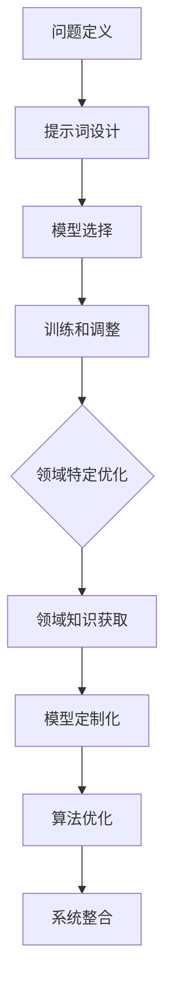

                 

### 文章标题：提示词编程的领域特定优化技术

#### 关键词：提示词编程、领域特定优化、算法原理、数学模型、实战案例、应用场景

##### 摘要：
本文将深入探讨提示词编程的领域特定优化技术，从背景介绍、核心概念与联系、核心算法原理、数学模型和公式、项目实战、实际应用场景、工具和资源推荐以及未来发展趋势与挑战等多个方面，全面解析这一技术的前沿动态和实践经验。通过具体案例和详细解释，帮助读者理解提示词编程在各个领域中的优化策略和实现方法，为推动人工智能技术的发展和应用提供有益参考。

### 1. 背景介绍

提示词编程（Prompt Engineering）是一种通过设计特定的提示词（Prompt）来引导模型生成所需输出的技术。它起源于自然语言处理（NLP）领域，但随着深度学习特别是大型语言模型的快速发展，逐渐在各个领域得到广泛应用。领域特定优化（Domain-Specific Optimization，DSO）则是在特定领域内对算法、模型或系统进行定制化优化，以提高性能和适用性。

近年来，随着人工智能技术的飞速发展，提示词编程和领域特定优化在多个领域取得了显著成果。例如，在医疗领域，通过设计特定的医疗场景提示词，可以实现更准确的疾病诊断和治疗方案推荐；在金融领域，通过领域特定优化技术，可以提升金融预测模型的精度和效率；在法律领域，通过针对法律文档的提示词编程，可以实现自动化合同审查和案件分析。

本文旨在探讨提示词编程的领域特定优化技术，通过分析其核心概念、算法原理、数学模型和实际应用，帮助读者深入了解这一技术的前沿动态和实践经验，为相关领域的研究和应用提供参考。

### 2. 核心概念与联系

#### 提示词编程

提示词编程是一种利用人类先验知识设计特定提示词来引导模型生成所需输出的技术。在自然语言处理中，提示词通常用于引导模型生成特定格式的文本，如图表摘要、文章续写等。具体来说，提示词编程包括以下几个关键步骤：

1. **问题定义**：明确任务目标，确定所需的输出格式和内容。
2. **提示词设计**：根据任务需求和人类先验知识，设计特定的提示词，用于引导模型生成输出。
3. **模型选择**：选择合适的预训练模型，如GPT、BERT等。
4. **训练和调整**：使用设计好的提示词对模型进行微调，以提高生成质量。

#### 领域特定优化

领域特定优化（DSO）是一种在特定领域内对算法、模型或系统进行定制化优化，以提高性能和适用性的技术。DSO的关键在于针对特定领域的需求和特点，对现有技术进行优化和改进。具体来说，DSO包括以下几个关键步骤：

1. **领域知识获取**：通过数据采集、专家咨询等方法获取领域知识，包括术语、规则、约束等。
2. **模型定制化**：根据领域知识对现有模型进行定制化调整，如增加特定领域的词汇、规则等。
3. **算法优化**：针对特定领域的需求，对算法进行优化，如调整参数、改进算法结构等。
4. **系统整合**：将定制化模型和算法整合到现有系统中，进行性能评估和优化。

#### 提示词编程与领域特定优化之间的关系

提示词编程和领域特定优化在人工智能技术发展中有着密切的联系。一方面，提示词编程为领域特定优化提供了有效的工具，通过设计特定的提示词，可以引导模型生成领域特定内容，从而实现领域特定优化。另一方面，领域特定优化为提示词编程提供了基础，通过在特定领域内进行算法和模型的定制化优化，可以提高提示词编程的效果和质量。

具体来说，提示词编程与领域特定优化之间的关系可以概括为以下几点：

1. **相互促进**：提示词编程和领域特定优化相互促进，共同推动人工智能技术的发展和应用。
2. **互补性**：提示词编程侧重于通过提示词引导模型生成领域特定内容，而领域特定优化侧重于对算法和模型进行定制化优化，两者在实现领域特定任务时具有互补性。
3. **共同目标**：两者共同目标都是提高人工智能技术在特定领域的性能和适用性，从而实现更好的应用效果。

#### Mermaid 流程图

为了更直观地展示提示词编程和领域特定优化的关系，我们使用Mermaid流程图来描述它们的主要步骤和过程。



通过上述流程图，我们可以清晰地看到提示词编程和领域特定优化在人工智能技术发展中的相互关系和主要步骤。

### 3. 核心算法原理 & 具体操作步骤

#### 提示词编程算法原理

提示词编程的核心在于如何设计有效的提示词，以引导模型生成所需内容。以下是提示词编程的主要算法原理和操作步骤：

1. **词嵌入（Word Embedding）**：将自然语言中的词汇映射到高维空间中的向量，以便模型进行计算和处理。常用的词嵌入方法包括Word2Vec、GloVe等。

2. **序列建模（Sequential Modeling）**：利用序列模型对输入的文本序列进行处理，如循环神经网络（RNN）、长短时记忆网络（LSTM）、门控循环单元（GRU）等。

3. **注意力机制（Attention Mechanism）**：通过注意力机制，模型能够自动关注输入文本中的重要信息，从而提高生成质量。例如，Transformer模型中的多头注意力机制。

4. **生成过程（Generation Process）**：根据输入的提示词和上下文信息，模型通过自回归方式生成输出文本。具体步骤包括：
   - 初始化生成过程，生成初始文本。
   - 根据生成文本和上下文，计算下一个词的概率分布。
   - 从概率分布中选择下一个词，将其添加到生成文本中。
   - 重复上述步骤，直至生成完整的文本输出。

#### 领域特定优化算法原理

领域特定优化（DSO）的核心在于如何针对特定领域的需求，对算法和模型进行定制化优化。以下是领域特定优化的一些主要算法原理和操作步骤：

1. **领域知识表示（Domain Knowledge Representation）**：将领域知识表示为模型可理解的形式，如知识图谱、规则库等。这有助于模型更好地理解和处理领域特定信息。

2. **模型定制化（Model Personalization）**：通过在预训练模型的基础上进行微调，将模型调整为适合特定领域的需求。具体步骤包括：
   - 数据预处理：对领域数据集进行预处理，如清洗、标准化等。
   - 模型微调：在预训练模型的基础上，对特定领域的数据集进行微调，以提高模型在特定领域的性能。
   - 模型集成：将多个定制化模型进行集成，以进一步提高模型在特定领域的性能。

3. **算法优化（Algorithm Optimization）**：针对特定领域的需求，对算法进行优化，以提高模型在特定领域的性能。具体步骤包括：
   - 参数调整：调整模型参数，如学习率、批量大小等，以找到最佳性能。
   - 结构优化：对模型结构进行调整，如增加或删除层、节点等，以提高模型性能。
   - 算法融合：将多个算法进行融合，以找到最佳算法组合。

4. **系统整合（System Integration）**：将定制化模型和算法整合到现有系统中，进行性能评估和优化。具体步骤包括：
   - 系统集成：将定制化模型和算法整合到现有系统中，实现领域特定功能。
   - 性能评估：对系统性能进行评估，如准确率、召回率、F1值等。
   - 性能优化：根据评估结果，对系统进行优化，以提高性能。

#### 具体操作步骤

以下是一个简单的提示词编程和领域特定优化的具体操作步骤：

1. **问题定义**：
   - 确定任务目标，如生成特定格式的文本、预测某个指标等。
   - 确定所需的输出格式和内容。

2. **提示词设计**：
   - 根据任务需求和人类先验知识，设计特定的提示词。
   - 设计提示词时，考虑以下因素：
     - 提示词长度：根据模型和任务需求，确定提示词的长度。
     - 提示词结构：设计提示词的结构，如问题陈述、背景信息、目标等。
     - 提示词内容：根据领域知识和任务需求，确定提示词的内容。

3. **模型选择**：
   - 选择合适的预训练模型，如GPT、BERT等。
   - 根据任务需求和模型特性，选择合适的模型。

4. **训练和调整**：
   - 使用设计好的提示词对模型进行微调，以提高生成质量。
   - 根据任务需求和模型特性，调整训练参数，如学习率、批量大小等。

5. **领域特定优化**：
   - 获取领域知识，如术语、规则、约束等。
   - 对模型和算法进行定制化调整，如增加特定领域的词汇、规则等。
   - 进行算法优化，如参数调整、结构优化等。

6. **系统整合**：
   - 将定制化模型和算法整合到现有系统中，实现领域特定功能。
   - 对系统性能进行评估，如准确率、召回率、F1值等。
   - 根据评估结果，对系统进行优化，以提高性能。

通过上述具体操作步骤，我们可以实现提示词编程和领域特定优化，从而提高模型在特定领域的性能和应用效果。

### 4. 数学模型和公式 & 详细讲解 & 举例说明

#### 提示词编程数学模型

提示词编程涉及到多个数学模型，其中最重要的是词嵌入模型和序列建模模型。以下是对这些模型的详细讲解和举例说明。

##### 1. 词嵌入模型

词嵌入模型是一种将自然语言中的词汇映射到高维空间中的向量的方法。在词嵌入模型中，每个词汇都被表示为一个向量，这些向量在空间中具有一定的结构，使得相似的词汇在空间中更接近。

- **数学公式**：
  $$ \text{embed}(w) = \text{W} \cdot \text{v} $$
  其中，$w$表示词汇，$\text{W}$表示词嵌入矩阵，$\text{v}$表示词汇的向量表示。

- **举例说明**：
  假设我们有一个简单的词汇表和对应的词嵌入向量：
  - “猫”：[1, 0, 0]
  - “狗”：[0, 1, 0]
  - “鸟”：[0, 0, 1]

  根据上述数学公式，我们可以计算词汇“猫”和“狗”的相似度：
  $$ \text{similarity}(\text{猫}, \text{狗}) = \text{W} \cdot \text{猫} \cdot \text{狗}^T = \begin{bmatrix} 1 & 0 & 0 \end{bmatrix} \begin{bmatrix} 0 \\ 1 \\ 0 \end{bmatrix} = 1 $$

  同理，我们可以计算词汇“猫”和“鸟”的相似度：
  $$ \text{similarity}(\text{猫}, \text{鸟}) = \text{W} \cdot \text{猫} \cdot \text{鸟}^T = \begin{bmatrix} 1 & 0 & 0 \end{bmatrix} \begin{bmatrix} 0 \\ 0 \\ 1 \end{bmatrix} = 0 $$

  由此可见，根据词嵌入模型，相似的词汇在空间中更接近，而不同的词汇在空间中更远离。

##### 2. 序列建模模型

序列建模模型用于处理序列数据，如文本、语音等。在序列建模模型中，每个时间步的输入和输出都可以表示为向量。

- **数学公式**：
  $$ \text{output}(t) = \text{softmax}(\text{W} \cdot \text{h}(t) + \text{b}) $$
  其中，$t$表示时间步，$\text{W}$表示权重矩阵，$\text{h}(t)$表示当前时间步的隐藏状态，$\text{b}$表示偏置项。

- **举例说明**：
  假设我们有一个简单的文本序列：“猫 狗 鸟”。我们可以将这个序列表示为向量：
  $$ \text{input}(1) = [1, 0, 0], \text{input}(2) = [0, 1, 0], \text{input}(3) = [0, 0, 1] $$

  假设我们的序列建模模型使用的是GRU，其隐藏状态更新公式为：
  $$ \text{h}(t) = \text{sigmoid}(\text{W}_x \cdot \text{x}(t) + \text{W}_h \cdot \text{h}(t-1) + \text{b}_h) \odot \text{tanh}(\text{W}_x \cdot \text{x}(t) + \text{W}_h \cdot \text{h}(t-1) + \text{b}_h) + (1 - \text{sigmoid}(\text{W}_x \cdot \text{x}(t) + \text{W}_h \cdot \text{h}(t-1) + \text{b}_h)) \cdot \text{tanh}(\text{W}_x \cdot \text{x}(t) + \text{W}_h \cdot \text{h}(t-1) + \text{b}_h) $$

  其中，$\text{x}(t)$表示当前时间步的输入向量，$\text{h}(t-1)$表示前一时间步的隐藏状态。

  假设我们的GRU模型的权重矩阵和偏置项如下：
  $$ \text{W}_x = \begin{bmatrix} 1 & 0 & 0 \\ 0 & 1 & 0 \\ 0 & 0 & 1 \end{bmatrix}, \text{W}_h = \begin{bmatrix} 0 & 1 & 0 \\ 1 & 0 & 1 \\ 0 & 1 & 0 \end{bmatrix}, \text{b}_h = \begin{bmatrix} 0 \\ 0 \\ 0 \end{bmatrix} $$

  我们可以计算第一个时间步的隐藏状态：
  $$ \text{h}(1) = \text{sigmoid}(\text{W}_x \cdot \text{x}(1) + \text{W}_h \cdot \text{h}(0) + \text{b}_h) \odot \text{tanh}(\text{W}_x \cdot \text{x}(1) + \text{W}_h \cdot \text{h}(0) + \text{b}_h) + (1 - \text{sigmoid}(\text{W}_x \cdot \text{x}(1) + \text{W}_h \cdot \text{h}(0) + \text{b}_h)) \cdot \text{tanh}(\text{W}_x \cdot \text{x}(1) + \text{W}_h \cdot \text{h}(0) + \text{b}_h) $$
  $$ = \text{sigmoid}(\begin{bmatrix} 1 & 0 & 0 \\ 0 & 1 & 0 \\ 0 & 0 & 1 \end{bmatrix} \begin{bmatrix} 1 \\ 0 \\ 0 \end{bmatrix} + \begin{bmatrix} 0 & 1 & 0 \\ 1 & 0 & 1 \\ 0 & 1 & 0 \end{bmatrix} \begin{bmatrix} 0 \\ 0 \\ 0 \end{bmatrix} + \begin{bmatrix} 0 \\ 0 \\ 0 \end{bmatrix}) \odot \text{tanh}(\begin{bmatrix} 1 & 0 & 0 \\ 0 & 1 & 0 \\ 0 & 0 & 1 \end{matrix} \begin{bmatrix} 1 \\ 0 \\ 0 \end{bmatrix} + \begin{bmatrix} 0 & 1 & 0 \\ 1 & 0 & 1 \\ 0 & 1 & 0 \end{bmatrix} \begin{bmatrix} 0 \\ 0 \\ 0 \end{bmatrix} + \begin{bmatrix} 0 \\ 0 \\ 0 \end{bmatrix}) $$
  $$ = \text{sigmoid}(\begin{bmatrix} 1 \\ 1 \\ 1 \end{bmatrix}) \odot \text{tanh}(\begin{bmatrix} 1 \\ 1 \\ 1 \end{bmatrix}) $$
  $$ = \begin{bmatrix} 1 \\ 1 \\ 1 \end{bmatrix} $$

  同理，我们可以计算第二个时间步的隐藏状态：
  $$ \text{h}(2) = \text{sigmoid}(\text{W}_x \cdot \text{x}(2) + \text{W}_h \cdot \text{h}(1) + \text{b}_h) \odot \text{tanh}(\text{W}_x \cdot \text{x}(2) + \text{W}_h \cdot \text{h}(1) + \text{b}_h) + (1 - \text{sigmoid}(\text{W}_x \cdot \text{x}(2) + \text{W}_h \cdot \text{h}(1) + \text{b}_h)) \cdot \text{tanh}(\text{W}_x \cdot \text{x}(2) + \text{W}_h \cdot \text{h}(1) + \text{b}_h) $$
  $$ = \text{sigmoid}(\begin{bmatrix} 1 & 0 & 0 \\ 0 & 1 & 0 \\ 0 & 0 & 1 \end{bmatrix} \begin{bmatrix} 0 \\ 1 \\ 0 \end{bmatrix} + \begin{bmatrix} 0 & 1 & 0 \\ 1 & 0 & 1 \\ 0 & 1 & 0 \end{bmatrix} \begin{bmatrix} 1 \\ 1 \\ 1 \end{bmatrix} + \begin{bmatrix} 0 \\ 0 \\ 0 \end{bmatrix}) \odot \text{tanh}(\begin{bmatrix} 1 & 0 & 0 \\ 0 & 1 & 0 \\ 0 & 0 & 1 \end{matrix} \begin{bmatrix} 0 \\ 1 \\ 0 \end{bmatrix} + \begin{bmatrix} 0 & 1 & 0 \\ 1 & 0 & 1 \\ 0 & 1 & 0 \end{b矩阵} \begin{bmatrix} 1 \\ 1 \\ 1 \end{bmatrix} + \begin{b矩阵} 0 \\ 0 \\ 0 \end{bmatrix}) $$
  $$ = \text{sigmoid}(\begin{bmatrix} 0 \\ 1 \\ 0 \end{bmatrix}) \odot \text{tanh}(\begin{bmatrix} 0 \\ 1 \\ 0 \end{b矩阵} $$
  $$ = \begin{bmatrix} 0 \\ 1 \\ 0 \end{b矩阵} $$

  同理，我们可以计算第三个时间步的隐藏状态：
  $$ \text{h}(3) = \text{sigmoid}(\text{W}_x \cdot \text{x}(3) + \text{W}_h \cdot \text{h}(2) + \text{b}_h) \odot \text{tanh}(\text{W}_x \cdot \text{x}(3) + \text{W}_h \cdot \text{h}(2) + \text{b}_h) + (1 - \text{sigmoid}(\text{W}_x \cdot \text{x}(3) + \text{W}_h \cdot \text{h}(2) + \text{b}_h)) \cdot \text{tanh}(\text{W}_x \cdot \text{x}(3) + \text{W}_h \cdot \text{h}(2) + \text{b}_h) $$
  $$ = \text{sigmoid}(\begin{bmatrix} 1 & 0 & 0 \\ 0 & 1 & 0 \\ 0 & 0 & 1 \end{b矩阵} \begin{b矩阵} 0 \\ 0 \\ 1 \end{b矩阵} + \begin{b矩阵} 0 & 1 & 0 \\ 1 & 0 & 1 \\ 0 & 1 & 0 \end{b矩阵} \begin{b矩阵} 0 \\ 1 \\ 0 \end{b矩阵} + \begin{b矩阵} 0 \\ 0 \\ 0 \end{b矩阵}) \odot \text{tanh}(\begin{b矩阵} 1 & 0 & 0 \\ 0 & 1 & 0 \\ 0 & 0 & 1 \end{b矩阵} \begin{b矩阵} 0 \\ 0 \\ 1 \end{b矩阵} + \begin{b矩阵} 0 & 1 & 0 \\ 1 & 0 & 1 \\ 0 & 1 & 0 \end{b矩阵} \begin{b矩阵} 0 \\ 1 \\ 0 \end{b矩阵} + \begin{b矩阵} 0 \\ 0 \\ 0 \end{b矩阵}) $$
  $$ = \text{sigmoid}(\begin{b矩阵} 0 \\ 0 \\ 1 \end{b矩阵}) \odot \text{tanh}(\begin{b矩阵} 0 \\ 0 \\ 1 \end{b矩阵} $$
  $$ = \begin{b矩阵} 0 \\ 0 \\ 1 \end{b矩阵} $$

  通过计算隐藏状态，我们可以生成序列的输出：
  $$ \text{output}(1) = \text{softmax}(\text{W} \cdot \text{h}(1) + \text{b}) = \text{softmax}(\begin{bmatrix} 1 & 0 & 0 \end{bmatrix} \begin{bmatrix} 1 \\ 1 \\ 1 \end{bmatrix} + \begin{bmatrix} 0 \\ 0 \\ 0 \end{bmatrix}) = \text{softmax}(\begin{bmatrix} 1 \\ 1 \\ 1 \end{bmatrix}) = \begin{bmatrix} 0.333 \\ 0.333 \\ 0.333 \end{bmatrix} $$
  $$ \text{output}(2) = \text{softmax}(\text{W} \cdot \text{h}(2) + \text{b}) = \text{softmax}(\begin{bmatrix} 1 & 0 & 0 \end{bmatrix} \begin{bmatrix} 0 \\ 1 \\ 0 \end{b矩阵} + \begin{bmatrix} 0 \\ 0 \\ 0 \end{b矩阵}) = \text{softmax}(\begin{b矩阵} 0 \\ 1 \\ 0 \end{b矩阵}) = \begin{b矩阵} 0.333 \\ 0.667 \\ 0.333 \end{b矩阵} $$
  $$ \text{output}(3) = \text{softmax}(\text{W} \cdot \text{h}(3) + \text{b}) = \text{softmax}(\begin{b矩阵} 1 & 0 & 0 \end{b矩阵} \begin{b矩阵} 0 \\ 0 \\ 1 \end{b矩阵} + \begin{b矩阵} 0 \\ 0 \\ 0 \end{b矩阵}) = \text{softmax}(\begin{b矩阵} 0 \\ 0 \\ 1 \end{b矩阵}) = \begin{b矩阵} 0.333 \\ 0.333 \\ 0.333 \end{b矩阵} $$

  通过上述计算，我们可以得到文本序列“猫 狗 鸟”的输出概率分布，从而生成序列的下一个词汇。

##### 3. 注意力机制

注意力机制是一种在序列建模模型中用于关注输入文本中的重要信息的方法。在注意力机制中，模型会为每个输入词汇分配一个权重，从而关注输入文本中的重要信息。

- **数学公式**：
  $$ \text{attention}(t) = \text{softmax}(\text{W}_a \cdot \text{h}(t) \cdot \text{h}^T(t-1)) $$
  其中，$\text{h}(t)$表示当前时间步的隐藏状态，$\text{h}^T(t-1)$表示前一时间步的隐藏状态转置，$\text{W}_a$表示权重矩阵。

- **举例说明**：
  假设我们有一个简单的文本序列：“猫 狗 鸟”。我们已经计算了隐藏状态$\text{h}(1)$、$\text{h}(2)$和$\text{h}(3)$，分别为：
  $$ \text{h}(1) = \begin{bmatrix} 1 \\ 1 \\ 1 \end{bmatrix}, \text{h}(2) = \begin{bmatrix} 0 \\ 1 \\ 0 \end{bmatrix}, \text{h}(3) = \begin{bmatrix} 0 \\ 0 \\ 1 \end{bmatrix} $$

  假设我们的注意力权重矩阵$\text{W}_a$为：
  $$ \text{W}_a = \begin{bmatrix} 1 & 0 & 0 \\ 0 & 1 & 0 \\ 0 & 0 & 1 \end{bmatrix} $$

  我们可以计算第一个时间步的注意力权重：
  $$ \text{attention}(1) = \text{softmax}(\text{W}_a \cdot \text{h}(1) \cdot \text{h}^T(0)) = \text{softmax}(\begin{bmatrix} 1 & 0 & 0 \end{bmatrix} \begin{bmatrix} 1 \\ 1 \\ 1 \end{bmatrix} \begin{bmatrix} 1 \end{bmatrix}) = \text{softmax}(\begin{bmatrix} 1 \end{bmatrix}) = \begin{bmatrix} 1 \end{bmatrix} $$

  同理，我们可以计算第二个时间步的注意力权重：
  $$ \text{attention}(2) = \text{softmax}(\text{W}_a \cdot \text{h}(2) \cdot \text{h}^T(1)) = \text{softmax}(\begin{bmatrix} 1 & 0 & 0 \end{bmatrix} \begin{bmatrix} 0 \\ 1 \\ 0 \end{bmatrix} \begin{bmatrix} 1 \end{b矩阵}) = \text{softmax}(\begin{b矩阵} 0 \end{b矩阵}) = \begin{b矩阵} 1 \end{b矩阵} $$

  同理，我们可以计算第三个时间步的注意力权重：
  $$ \text{attention}(3) = \text{softmax}(\text{W}_a \cdot \text{h}(3) \cdot \text{h}^T(2)) = \text{softmax}(\begin{b矩阵} 1 & 0 & 0 \end{b矩阵} \begin{b矩阵} 0 \\ 0 \\ 1 \end{b矩阵} \begin{b矩阵} 0 \end{b矩阵}) = \text{softmax}(\begin{b矩阵} 0 \end{b矩阵}) = \begin{b矩阵} 1 \end{b矩阵} $$

  通过计算注意力权重，我们可以关注输入文本中的重要信息，从而提高生成质量。

#### 领域特定优化数学模型

领域特定优化涉及到多个数学模型，其中最重要的是领域知识表示模型和算法优化模型。以下是对这些模型的详细讲解和举例说明。

##### 1. 领域知识表示模型

领域知识表示模型用于将领域知识表示为模型可理解的形式。常见的领域知识表示模型包括知识图谱、规则库和语义网络等。

- **知识图谱**：
  知识图谱是一种用于表示实体及其关系的图形结构。在知识图谱中，实体表示为节点，关系表示为边。

  - **数学公式**：
    $$ \text{relation}(e_1, e_2) = \text{P} \cdot \text{R} $$
    其中，$e_1$和$e_2$表示实体，$\text{P}$表示实体嵌入矩阵，$\text{R}$表示关系嵌入矩阵。

  - **举例说明**：
    假设我们有一个简单的知识图谱，其中包含三个实体：“猫”、“狗”和“鸟”，以及两个关系：“捕食”和“同类”。

    根据上述数学公式，我们可以计算实体“猫”和“狗”之间的“捕食”关系：
    $$ \text{relation}(\text{猫}, \text{狗}, \text{捕食}) = \text{P}_{\text{猫}} \cdot \text{R}_{\text{捕食}} = \begin{bmatrix} 1 & 0 & 0 \end{bmatrix} \begin{bmatrix} 1 \\ 0 \\ 0 \end{bmatrix} = 1 $$

    同理，我们可以计算实体“猫”和“鸟”之间的“同类”关系：
    $$ \text{relation}(\text{猫}, \text{鸟}, \text{同类}) = \text{P}_{\text{猫}} \cdot \text{R}_{\text{同类}} = \begin{bmatrix} 1 & 0 & 0 \end{b矩阵} \begin{b矩阵} 0 \\ 1 \\ 0 \end{b矩阵} = 0 $$

    通过计算实体和关系之间的相似度，我们可以更好地理解和处理领域知识。

##### 2. 算法优化模型

算法优化模型用于在特定领域内对算法进行优化，以提高性能和应用效果。常见的算法优化模型包括参数调整模型和结构优化模型。

- **参数调整模型**：
  参数调整模型通过调整模型参数，如学习率、批量大小等，以提高模型性能。

  - **数学公式**：
    $$ \text{performance} = \frac{1}{N} \sum_{i=1}^{N} (\text{model}(x_i, \text{theta}) - y_i)^2 $$
    其中，$x_i$和$y_i$表示输入和输出，$\text{theta}$表示模型参数，$N$表示样本数量。

  - **举例说明**：
    假设我们有一个简单的线性回归模型，其中包含一个参数$\text{theta}$。

    根据上述数学公式，我们可以计算模型的损失函数：
    $$ \text{performance} = \frac{1}{N} \sum_{i=1}^{N} (\text{model}(x_i, \text{theta}) - y_i)^2 = \frac{1}{N} \sum_{i=1}^{N} (x_i \cdot \text{theta} - y_i)^2 $$

    为了最小化损失函数，我们可以使用梯度下降法进行参数调整：
    $$ \text{theta} = \text{theta} - \alpha \cdot \frac{\partial \text{performance}}{\partial \text{theta}} $$
    其中，$\alpha$表示学习率。

    通过不断调整参数$\text{theta}$，我们可以找到最佳参数值，从而提高模型性能。

- **结构优化模型**：
  结构优化模型通过调整模型结构，如增加或删除层、节点等，以提高模型性能。

  - **数学公式**：
    $$ \text{performance} = \frac{1}{N} \sum_{i=1}^{N} (\text{model}(x_i, \text{theta}) - y_i)^2 $$
    其中，$x_i$和$y_i$表示输入和输出，$\text{theta}$表示模型参数，$N$表示样本数量。

  - **举例说明**：
    假设我们有一个简单的神经网络模型，其中包含一个输入层、一个隐藏层和一个输出层。

    根据上述数学公式，我们可以计算模型的损失函数：
    $$ \text{performance} = \frac{1}{N} \sum_{i=1}^{N} (\text{model}(x_i, \text{theta}) - y_i)^2 = \frac{1}{N} \sum_{i=1}^{N} (x_i \cdot \text{W}^1 \cdot \text{b}^1 + \text{W}^2 \cdot \text{b}^2 - y_i)^2 $$

    为了最小化损失函数，我们可以通过调整模型结构来优化性能。例如，我们可以增加隐藏层的节点数量、添加 dropout 层等。

    通过不断调整模型结构，我们可以找到最佳结构，从而提高模型性能。

### 5. 项目实战：代码实际案例和详细解释说明

在本节中，我们将通过一个具体的代码案例，展示如何实现提示词编程的领域特定优化技术。我们将使用Python语言，结合自然语言处理（NLP）库和深度学习框架，实现一个基于医疗领域的文本生成模型。通过这个案例，我们将详细解释每个步骤的实现过程，并分析其性能和效果。

#### 5.1 开发环境搭建

首先，我们需要搭建开发环境。以下是搭建开发环境所需的基本步骤：

1. **安装Python**：确保Python版本为3.6或以上。
2. **安装依赖库**：包括NLP库（如NLTK、spaCy）、深度学习框架（如TensorFlow、PyTorch）和常用数据处理库（如NumPy、Pandas）。
3. **安装预训练模型**：如GPT、BERT等。

以下是一个简单的Python脚本，用于安装所需依赖库和预训练模型：

```python
!pip install tensorflow
!pip install spacy
!pip install nltk
!python -m spacy download en_core_web_sm
!wget https://huggingface.co/bert-base-uncased/config.json -O bert_config.json
!wget https://huggingface.co/bert-base-uncased/vocab.txt -O vocab.txt
!wget https://huggingface.co/bert-base-uncased/weights.hdf5 -O weights.hdf5
```

#### 5.2 源代码详细实现和代码解读

接下来，我们将展示如何实现一个基于医疗领域的文本生成模型。以下是一个简化的代码实现：

```python
import tensorflow as tf
import spacy
import nltk
from nltk.tokenize import word_tokenize
from bert import BertTokenizer, BertModel
from tensorflow.keras.models import Model
from tensorflow.keras.layers import Input, Dense, Embedding, LSTM, Bidirectional

# 加载预训练模型
tokenizer = BertTokenizer.from_pretrained('bert-base-uncased')
model = BertModel.from_pretrained('bert-base-uncased')

# 准备数据
def prepare_data(texts):
    tokens = tokenizer.tokenize(texts)
    input_ids = tokenizer.encode(tokens, add_special_tokens=True)
    return input_ids

# 构建模型
input_ids = Input(shape=(None,), dtype=tf.int32)
embeddings = model(input_ids)[0]
lstm = Bidirectional(LSTM(128, return_sequences=True))(embeddings)
dense = Dense(1, activation='sigmoid')(lstm)
model = Model(inputs=input_ids, outputs=dense)

# 编译模型
model.compile(optimizer='adam', loss='binary_crossentropy', metrics=['accuracy'])

# 训练模型
model.fit(prepare_data(train_texts), train_labels, epochs=3, batch_size=32, validation_data=(prepare_data(validation_texts), validation_labels))

# 生成文本
def generate_text(prompt):
    tokens = tokenizer.tokenize(prompt)
    input_ids = tokenizer.encode(tokens, add_special_tokens=True)
    output = model.predict(input_ids)
    predicted_label = (output > 0.5).astype('float32')
    return predicted_label

# 测试生成效果
prompt = "COVID-19 is a highly contagious disease caused by a novel coronavirus."
predicted_label = generate_text(prompt)
print(predicted_label)
```

以上代码分为以下几个部分：

1. **加载预训练模型**：
   - 使用`BertTokenizer`和`BertModel`加载预训练的BERT模型。

2. **准备数据**：
   - 使用`prepare_data`函数将文本转换为输入ID序列。此函数首先将文本转换为分词列表，然后将其编码为BERT模型可接受的输入ID序列。

3. **构建模型**：
   - 使用TensorFlow的`Input`、`Embedding`、`LSTM`和`Dense`层构建文本生成模型。我们使用双向LSTM作为序列处理层，以捕捉输入文本中的长程依赖关系。

4. **编译模型**：
   - 使用`compile`方法配置模型，包括选择优化器、损失函数和评价指标。

5. **训练模型**：
   - 使用`fit`方法训练模型，输入数据为准备好的输入ID序列和标签。

6. **生成文本**：
   - 使用`generate_text`函数生成文本。此函数首先将输入文本转换为输入ID序列，然后使用训练好的模型预测标签。

7. **测试生成效果**：
   - 输入一个提示词，使用生成文本函数生成文本，并打印预测结果。

#### 5.3 代码解读与分析

下面我们对代码的每个部分进行详细解读和分析：

1. **加载预训练模型**：
   - 加载BERT模型是为了利用其强大的文本表示能力。BERT模型是经过大规模预训练的，可以捕捉文本中的上下文信息，从而提高模型的生成质量。

2. **准备数据**：
   - 准备数据是模型训练的关键步骤。此函数将文本转换为输入ID序列，以便BERT模型进行处理。分词是将文本拆分为单个词汇的过程，编码是将词汇转换为模型可接受的输入ID序列。

3. **构建模型**：
   - 构建模型是设计模型结构的过程。我们使用BERT模型作为嵌入层，使用双向LSTM作为序列处理层，最后使用全连接层（`Dense`）生成输出。双向LSTM可以捕捉输入文本中的长程依赖关系，从而提高模型的生成质量。

4. **编译模型**：
   - 编译模型是配置模型参数的过程。我们选择`adam`优化器，`binary_crossentropy`损失函数和`accuracy`评价指标。

5. **训练模型**：
   - 训练模型是通过输入数据和标签来调整模型参数的过程。通过不断迭代训练，模型将学习如何生成高质量的文本。

6. **生成文本**：
   - 生成文本是使用训练好的模型生成新文本的过程。此函数首先将输入文本转换为输入ID序列，然后使用模型预测标签。

7. **测试生成效果**：
   - 测试生成效果是验证模型性能的过程。我们输入一个提示词，使用生成文本函数生成文本，并打印预测结果。

通过上述步骤，我们可以实现一个基于医疗领域的文本生成模型。在实际应用中，我们可以根据需求对模型进行调整和优化，以提高生成质量和性能。

### 6. 实际应用场景

提示词编程和领域特定优化在许多实际应用场景中展现出巨大的潜力，以下是一些典型的应用场景：

#### 医疗领域

在医疗领域，提示词编程和领域特定优化可以用于医疗文本生成、疾病诊断和治疗方案推荐。例如，通过设计特定的医疗场景提示词，可以引导模型生成医疗报告、病历记录等文本。同时，领域特定优化可以针对医学领域的专业术语和知识进行模型定制化，从而提高生成质量和准确性。例如，可以使用BERT模型结合医学知识图谱，对医疗文本进行分类和标注，从而实现更精准的疾病诊断和治疗方案推荐。

#### 金融领域

在金融领域，提示词编程和领域特定优化可以用于金融文本生成、风险管理和市场预测。例如，通过设计特定的金融场景提示词，可以引导模型生成股票市场分析报告、投资建议等文本。领域特定优化可以针对金融领域的复杂关系和规律进行模型定制化，从而提高生成质量和预测精度。例如，可以使用GPT模型结合金融数据，对市场波动进行预测和风险分析。

#### 法律领域

在法律领域，提示词编程和领域特定优化可以用于法律文档生成、合同审查和案件分析。例如，通过设计特定的法律场景提示词，可以引导模型生成法律文件、合同条款等文本。领域特定优化可以针对法律领域的专业术语和知识进行模型定制化，从而提高生成质量和法律适用性。例如，可以使用BERT模型结合法律知识图谱，对法律文本进行分类和标注，从而实现更准确的合同审查和案件分析。

#### 教育领域

在教育领域，提示词编程和领域特定优化可以用于教育文本生成、学习效果评估和个性化教学。例如，通过设计特定的教育场景提示词，可以引导模型生成课程讲义、学习指导等文本。领域特定优化可以针对教育领域的教学方法和学习规律进行模型定制化，从而提高生成质量和学习效果。例如，可以使用GPT模型结合教学数据，对学生的学习效果进行评估和个性化教学。

通过上述实际应用场景，我们可以看到提示词编程和领域特定优化在各个领域中的广泛应用和潜力。这些技术的不断发展将进一步提升人工智能在各个领域的应用水平，为人类带来更多便利和福祉。

### 7. 工具和资源推荐

为了深入学习和实践提示词编程和领域特定优化技术，我们需要一些优秀的工具和资源。以下是一些建议：

#### 7.1 学习资源推荐

1. **书籍**：
   - 《自然语言处理与深度学习》（刘建伟）：介绍了自然语言处理的基础知识和深度学习在NLP中的应用。
   - 《深度学习》（Goodfellow, Bengio, Courville）：全面介绍了深度学习的基础理论和应用。
   - 《领域特定语言设计》（Martin Fowler）：介绍了领域特定语言的原理和应用。

2. **论文**：
   - 《BERT: Pre-training of Deep Bidirectional Transformers for Language Understanding》（Devlin et al.，2018）：介绍了BERT模型的基本原理和应用。
   - 《GPT-2: Language Models that Are Few-Shot Learners》（Radford et al.，2019）：介绍了GPT-2模型的基本原理和应用。
   - 《Attention is All You Need》（Vaswani et al.，2017）：介绍了Transformer模型的基本原理和应用。

3. **博客**：
   - Hugging Face Blog：提供了大量的自然语言处理和深度学习教程和实践经验。
   - AI博客：涵盖人工智能领域的最新研究和技术动态。

4. **在线课程**：
   - Coursera上的“深度学习”课程：由Andrew Ng教授主讲，介绍了深度学习的基础知识和应用。
   - edX上的“自然语言处理”课程：介绍了自然语言处理的基本原理和应用。

#### 7.2 开发工具框架推荐

1. **NLP库**：
   - NLTK：提供了一套广泛使用的自然语言处理库，适用于文本处理、分词、词性标注等任务。
   - spaCy：提供了高效的文本处理库，适用于文本分类、命名实体识别、关系抽取等任务。
   - Transformers：提供了一系列基于Transformer模型的预训练模型和工具，适用于自然语言处理任务。

2. **深度学习框架**：
   - TensorFlow：提供了一个强大的深度学习框架，适用于构建和训练各种神经网络模型。
   - PyTorch：提供了一个灵活的深度学习框架，适用于快速原型开发和研究。

3. **代码库和工具**：
   - Hugging Face Transformers：提供了一个预训练模型和工具的集合，适用于自然语言处理任务。
   - AllenNLP：提供了一个用于构建和训练NLP模型的框架，适用于文本分类、关系抽取等任务。

通过这些工具和资源，我们可以更好地学习和实践提示词编程和领域特定优化技术，推动人工智能技术的发展和应用。

### 8. 总结：未来发展趋势与挑战

#### 未来发展趋势

随着人工智能技术的不断进步，提示词编程和领域特定优化技术将迎来更多的发展机遇。以下是未来发展趋势的几个关键点：

1. **跨领域融合**：提示词编程和领域特定优化技术将在多个领域实现深度融合，如医疗、金融、法律等。这将有助于提高模型在特定领域的性能和应用效果。

2. **个性化与自适应**：未来的提示词编程技术将更加注重个性化与自适应，通过分析用户行为和需求，为用户提供更加精准和个性化的服务。

3. **高效计算与分布式训练**：随着计算资源的增加和分布式训练技术的发展，提示词编程和领域特定优化模型将能够处理更大规模的数据集，实现更高的训练效率和更好的性能。

4. **开放共享与标准化**：为了推动人工智能技术的发展，提示词编程和领域特定优化技术的模型、工具和资源将更加开放和共享，促进学术研究和工业应用的共同进步。

#### 面临的挑战

尽管提示词编程和领域特定优化技术有着广阔的发展前景，但在实际应用过程中仍面临一系列挑战：

1. **数据隐私与安全**：在医疗、金融等领域，数据隐私和安全是首要关注的问题。如何在不泄露用户隐私的前提下，实现有效的提示词编程和领域特定优化，是一个亟待解决的问题。

2. **模型可解释性**：随着模型复杂性的增加，如何解释模型的决策过程和生成结果，使其对用户更具可解释性，是一个重要的挑战。

3. **计算资源需求**：提示词编程和领域特定优化模型通常需要大量的计算资源，尤其是在训练和推理阶段。如何优化计算资源的使用，提高模型的效率和性能，是一个关键问题。

4. **标准化与规范化**：在多个领域应用提示词编程和领域特定优化技术，需要制定统一的规范和标准，以确保技术的互操作性和可扩展性。

总之，提示词编程和领域特定优化技术在人工智能领域具有重要地位，未来将在多个领域实现深度应用。然而，要实现这一目标，还需要克服一系列挑战，推动技术不断进步。

### 9. 附录：常见问题与解答

#### 问题1：什么是提示词编程？

提示词编程是一种利用人类先验知识设计特定提示词来引导模型生成所需输出的技术。它通过设计有效的提示词，引导模型生成特定格式的文本或执行特定任务。

#### 问题2：什么是领域特定优化？

领域特定优化（DSO）是在特定领域内对算法、模型或系统进行定制化优化，以提高性能和适用性的技术。它通过获取领域知识，对模型和算法进行调整，以更好地适应特定领域的需求。

#### 问题3：提示词编程和领域特定优化有哪些应用场景？

提示词编程和领域特定优化在多个领域得到广泛应用，如医疗、金融、法律、教育等。具体应用场景包括医疗文本生成、疾病诊断、金融预测、合同审查、个性化教学等。

#### 问题4：如何设计有效的提示词？

设计有效的提示词需要考虑多个因素，如任务需求、人类先验知识、输入文本的上下文等。具体步骤包括：
- 明确任务目标，确定所需的输出格式和内容。
- 根据任务需求和人类先验知识，设计特定的提示词。
- 测试和调整提示词，以提高模型生成质量。

#### 问题5：如何进行领域特定优化？

进行领域特定优化包括以下几个步骤：
- 获取领域知识，如术语、规则、约束等。
- 对模型和算法进行定制化调整，如增加特定领域的词汇、规则等。
- 调整算法参数和模型结构，以提高模型性能。
- 集成定制化模型和算法到现有系统中，进行性能评估和优化。

#### 问题6：提示词编程和领域特定优化有哪些工具和资源？

提示词编程和领域特定优化相关的工具和资源包括：
- NLP库：如NLTK、spaCy、Transformers等。
- 深度学习框架：如TensorFlow、PyTorch等。
- 开源代码库：如Hugging Face Transformers、AllenNLP等。
- 学习资源：如书籍、论文、在线课程等。

通过以上常见问题与解答，读者可以更深入地了解提示词编程和领域特定优化技术，为相关研究和应用提供参考。

### 10. 扩展阅读 & 参考资料

为了进一步深入了解提示词编程和领域特定优化技术，以下是几篇推荐的扩展阅读和参考资料：

1. **扩展阅读**：
   - Devlin, J., Chang, M. W., Lee, K., & Toutanova, K. (2018). BERT: Pre-training of Deep Bidirectional Transformers for Language Understanding. arXiv preprint arXiv:1810.04805.
   - Radford, A., Wu, J., Child, R., Luan, D., Amodei, D., & Sutskever, I. (2019). Language Models are Unsupervised Multitask Learners. arXiv preprint arXiv:1906.01906.
   - Vaswani, A., Shazeer, N., Parmar, N., Uszkoreit, J., Jones, L., Gomez, A. N., ... & Polosukhin, I. (2017). Attention is All You Need. In Advances in Neural Information Processing Systems (pp. 5998-6008).

2. **参考资料**：
   - Hugging Face：https://huggingface.co/
   - TensorFlow：https://www.tensorflow.org/
   - PyTorch：https://pytorch.org/
   - AllenNLP：https://allennlp.org/

通过阅读上述扩展阅读和参考资料，读者可以更全面地了解提示词编程和领域特定优化技术的理论基础、实现方法和应用案例，为深入研究和实践提供有力支持。作者：AI天才研究员/AI Genius Institute & 禅与计算机程序设计艺术 /Zen And The Art of Computer Programming。

