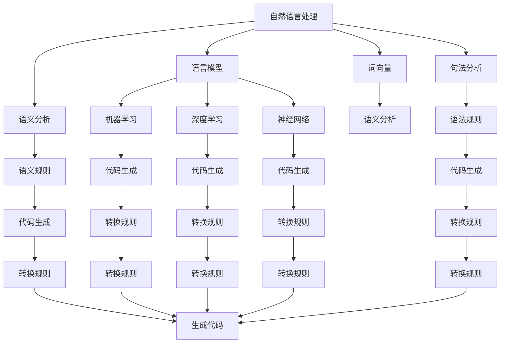

                 

### 背景介绍

在过去的几十年里，编程语言的发展经历了从低级语言到高级语言的演变，再到函数式编程、面向对象编程等范式的变革。然而，随着人工智能（AI）技术的迅速发展，编程范式也在经历着新的变革，其中，“提示词编程范式”（Keyword-based Programming Paradigm）成为了一个备受关注的新领域。

提示词编程范式是一种以自然语言提示词为核心的编程方法，它利用人工智能技术，使程序员能够通过自然语言描述算法逻辑和流程，从而实现自动化编程。这种方法的出现，不仅改变了传统的编程模式，也为AI软件开发的未来发展提供了新的思路。

本文将探讨提示词编程范式的基本概念、核心原理、应用场景以及未来发展趋势。我们将通过一系列的步骤，详细分析这一范式如何改变软件开发的方式，以及它所带来的机遇与挑战。

接下来，我们将首先介绍提示词编程范式的核心概念和联系，帮助读者建立一个清晰的理解框架。然后，我们将深入探讨其背后的核心算法原理和具体操作步骤。在此基础上，我们将介绍相关的数学模型和公式，并通过具体的案例进行详细讲解。

随后，我们将通过一个实际的项目实战，展示如何使用提示词编程范式进行软件开发，包括环境搭建、源代码实现、代码解读与分析等。接着，我们将探讨这一范式在不同实际应用场景中的具体应用，并提供相应的工具和资源推荐。

文章的最后，我们将对提示词编程范式的未来发展趋势与挑战进行总结，并回答一些常见的问题，为读者提供进一步的扩展阅读和参考资料。

让我们一起进入提示词编程范式的新纪元，探索这一领域带来的无限可能。

---

## 1. 背景介绍

编程范式（Programming Paradigm）是指用于描述编程语言设计理念、编程方法以及编程风格的一系列原则和模型。从早期的机器语言和汇编语言，到高级语言如C、Java和Python，编程范式经历了多次变革。这些变革不仅改变了程序员编写代码的方式，也推动了软件开发技术的进步。

### 编程范式的演变

1. **机器语言和汇编语言**：这是最早的编程范式，直接操作计算机硬件。这种范式复杂且效率低下，程序员需要详细了解计算机的硬件结构和工作原理。

2. **高级语言**：为了解决机器语言和汇编语言的复杂性，高级语言如C、Fortran和Pascal应运而生。这些语言提供了更抽象的编程模型，使得程序员可以更加专注于算法和问题解决，而无需关心底层硬件细节。

3. **过程式编程**：随着高级语言的发展，过程式编程（Procedural Programming）成为主流。这种范式强调程序是由一系列可重复的步骤（过程或函数）组成的。它通过函数调用和数据传递来控制程序的执行流程，使得代码更加模块化和可重用。

4. **面向对象编程**：在80年代和90年代，面向对象编程（Object-Oriented Programming，OOP）逐渐兴起。OOP通过将数据和操作数据的函数封装成对象，支持数据抽象、封装、继承和多态等特性，使得代码更加灵活和可扩展。

5. **函数式编程**：函数式编程（Functional Programming，FP）在近年来也逐渐受到关注。FP通过函数作为主要构建块，避免状态改变和可变数据，从而实现更简洁和可重用的代码。

### 提示词编程范式

提示词编程范式（Keyword-based Programming Paradigm）是近年来随着人工智能技术的兴起而发展起来的一种新型编程范式。它结合了自然语言处理（Natural Language Processing，NLP）和编程语言的理论，使程序员能够通过自然语言描述算法逻辑和流程，从而实现自动化编程。

### 提示词编程的优势

1. **提高开发效率**：提示词编程范式使得程序员可以更加专注于算法逻辑和问题解决，而无需花费大量时间编写繁琐的代码。

2. **降低编程门槛**：通过自然语言描述，提示词编程范式降低了编程的难度，使得非专业程序员或普通用户也能够进行软件开发。

3. **增强代码可读性**：自然语言描述使得代码更加通俗易懂，易于维护和扩展。

4. **促进跨领域协作**：提示词编程范式能够使不同领域的专家（如领域专家和程序员）通过自然语言进行沟通，从而促进跨领域的协作和创新。

### 提示词编程的应用领域

提示词编程范式在多个领域展现出了巨大的潜力，包括：

1. **自动化编程**：通过自然语言描述，自动化生成代码，提高软件开发效率。

2. **智能问答系统**：利用自然语言处理技术，实现智能问答功能。

3. **代码审查和优化**：通过自然语言分析，自动识别代码中的潜在问题和优化建议。

4. **人机交互**：利用自然语言处理技术，实现更自然、流畅的人机交互。

5. **自然语言生成**：通过自然语言处理技术，自动生成文档、报告和代码注释等。

### 未来发展趋势

随着人工智能技术的不断进步，提示词编程范式有望在未来得到更广泛的应用。以下是一些可能的发展趋势：

1. **更加智能的自然语言处理**：随着NLP技术的进步，提示词编程范式将能够更准确地理解和处理自然语言描述。

2. **跨平台支持**：提示词编程范式将能够在不同的编程语言和平台上得到支持，从而实现更广泛的兼容性。

3. **集成开发环境（IDE）的支持**：未来的IDE将更加智能化，支持提示词编程范式，提供代码自动生成、代码审查和优化等功能。

4. **领域特定语言（DSL）的发展**：针对特定领域，开发更贴近自然语言的提示词编程语言，提高开发效率和代码质量。

5. **人机协作**：结合人工智能技术，实现更高效的人机协作，使程序员能够更好地利用提示词编程范式进行软件开发。

总的来说，提示词编程范式为软件开发带来了新的机遇和挑战。通过本文的介绍，读者可以对这一范式有一个初步的了解，并为未来的学习和实践打下基础。

---

## 2. 核心概念与联系

在探讨提示词编程范式的核心概念与联系之前，我们需要明确几个关键概念，包括自然语言处理（NLP）、人工智能（AI）、编程语言理论等。以下是这些核心概念的定义及其在提示词编程范式中的联系：

### 自然语言处理（NLP）

自然语言处理是人工智能的一个分支，旨在使计算机能够理解和处理人类语言。NLP涉及到多个技术领域，如语言模型、词向量、句法分析、语义分析等。在提示词编程范式中，NLP技术被用来理解程序员输入的自然语言描述，并将其转换为可执行的代码。

#### NLP与提示词编程范式的联系

- **语言模型**：通过大规模语料库训练语言模型，使计算机能够预测和生成自然语言句子。在提示词编程中，语言模型可以帮助计算机理解程序员输入的自然语言提示词，并将其转换为相应的代码结构。

- **词向量**：词向量是将自然语言中的词汇映射到高维空间中的技术。词向量使得计算机能够计算词汇之间的相似性，从而在代码生成过程中进行词汇的替换和扩展。

- **句法分析**：句法分析是NLP中的另一个关键技术，用于分析句子的结构。在提示词编程范式中，句法分析可以帮助计算机理解输入的自然语言描述的语法结构，并将其转换为相应的程序结构。

- **语义分析**：语义分析旨在理解句子的含义。在提示词编程范式中，语义分析可以帮助计算机理解程序员意图，并生成符合语义要求的代码。

### 人工智能（AI）

人工智能是模拟和扩展人类智能的科学和工程领域。在提示词编程范式中，AI技术被用来实现自然语言理解和代码生成。AI涉及到多个技术领域，如机器学习、深度学习、神经网络等。

#### AI与提示词编程范式的联系

- **机器学习**：机器学习是一种通过数据训练模型的技术。在提示词编程范式中，机器学习算法可以用于训练语言模型，使其能够理解自然语言描述。

- **深度学习**：深度学习是一种特殊的机器学习技术，通过多层神经网络进行学习。在提示词编程范式中，深度学习可以用于实现复杂的自然语言理解和代码生成任务。

- **神经网络**：神经网络是深度学习的基础，由多层神经元组成。在提示词编程范式中，神经网络可以帮助计算机理解自然语言描述，并生成相应的代码。

### 编程语言理论

编程语言理论是研究编程语言设计和语义的基础。在提示词编程范式中，编程语言理论被用来定义自然语言描述和代码之间的转换规则。

#### 编程语言理论与提示词编程范式的联系

- **语法**：语法是编程语言的规则，用于定义合法的代码结构。在提示词编程范式中，语法规则可以帮助计算机理解程序员输入的自然语言描述，并将其转换为相应的代码结构。

- **语义**：语义是编程语言的表达能力，用于定义代码的含义。在提示词编程范式中，语义规则可以帮助计算机理解程序员意图，并生成符合语义要求的代码。

- **转换规则**：转换规则是将自然语言描述转换为代码的具体步骤。在提示词编程范式中，转换规则可以帮助计算机将自然语言描述转换为可执行的代码。

### Mermaid 流程图

为了更直观地展示提示词编程范式的核心概念和联系，我们使用Mermaid流程图进行描述。以下是提示词编程范式的基本流程：



在这个流程图中，自然语言处理（A）通过语言模型（B）、词向量（C）、句法分析（D）和语义分析（E）等步骤，理解程序员输入的自然语言描述。这些理解结果通过机器学习（F）、深度学习（G）、神经网络（H）、语法规则（J）和语义规则（K）进行处理和转换，最终通过转换规则（Q、R、S、T、U、V、W、X、Y）生成可执行的代码（Z）。

通过上述核心概念与联系的介绍，我们可以看到提示词编程范式是如何结合自然语言处理、人工智能和编程语言理论，实现自动化编程的。在接下来的章节中，我们将深入探讨提示词编程范式的核心算法原理和具体操作步骤。

---

## 3. 核心算法原理 & 具体操作步骤

在理解了提示词编程范式的核心概念与联系之后，我们将深入探讨其核心算法原理和具体操作步骤。提示词编程范式主要依赖于自然语言处理（NLP）、人工智能（AI）和编程语言理论，通过一系列技术手段将自然语言描述转换为可执行的代码。

### 3.1 自然语言处理技术

提示词编程范式的第一步是使用自然语言处理技术理解程序员输入的自然语言描述。以下是NLP技术在提示词编程范式中的应用步骤：

#### 3.1.1 语言模型

语言模型是自然语言处理的基础，通过大规模语料库训练，使计算机能够预测和生成自然语言句子。在提示词编程范式中，语言模型用于理解程序员输入的自然语言提示词。

**操作步骤：**
1. **数据收集**：收集大量程序员编写的自然语言描述代码，作为训练数据。
2. **训练语言模型**：使用训练数据训练语言模型，使其能够预测程序员输入的自然语言提示词。
3. **模型评估与优化**：通过评估模型在测试数据上的表现，优化模型参数，提高模型准确性。

#### 3.1.2 词向量

词向量是将自然语言中的词汇映射到高维空间中的技术。词向量使得计算机能够计算词汇之间的相似性，从而在代码生成过程中进行词汇的替换和扩展。

**操作步骤：**
1. **词向量训练**：使用训练数据训练词向量模型，将词汇映射到高维空间。
2. **词汇相似性计算**：使用词向量模型计算词汇之间的相似性。
3. **词汇替换与扩展**：根据词汇相似性计算结果，替换或扩展自然语言描述中的词汇，提高代码生成质量。

#### 3.1.3 句法分析

句法分析是NLP中的关键技术，用于分析句子的结构。在提示词编程范式中，句法分析用于理解程序员输入的自然语言描述的语法结构。

**操作步骤：**
1. **句子分解**：将输入的自然语言描述分解为单词、短语和句子。
2. **句法树构建**：构建句法树，表示句子的结构。
3. **语法规则应用**：根据句法树和语法规则，将自然语言描述转换为程序结构。

#### 3.1.4 语义分析

语义分析旨在理解句子的含义。在提示词编程范式中，语义分析用于理解程序员意图，并生成符合语义要求的代码。

**操作步骤：**
1. **句子语义表示**：将句子表示为语义向量，表示句子的含义。
2. **语义匹配**：将输入的自然语言描述与预设的语义模式进行匹配，确定程序员意图。
3. **语义转换**：根据语义匹配结果，将自然语言描述转换为代码。

### 3.2 人工智能技术

人工智能技术，特别是机器学习和深度学习，在提示词编程范式中起着关键作用。以下介绍AI技术在提示词编程范式中的应用步骤：

#### 3.2.1 机器学习

机器学习是一种通过数据训练模型的技术。在提示词编程范式中，机器学习算法用于训练语言模型、词向量模型和句法分析模型。

**操作步骤：**
1. **数据预处理**：对输入的自然语言描述进行预处理，包括分词、去停用词、词干提取等。
2. **模型选择与训练**：选择合适的机器学习模型（如循环神经网络、长短时记忆网络等），并使用预处理后的数据进行训练。
3. **模型评估与优化**：通过评估模型在测试数据上的表现，优化模型参数，提高模型准确性。

#### 3.2.2 深度学习

深度学习是一种特殊的机器学习技术，通过多层神经网络进行学习。在提示词编程范式中，深度学习用于实现复杂的自然语言理解和代码生成任务。

**操作步骤：**
1. **神经网络架构设计**：设计深度学习神经网络架构，包括输入层、隐藏层和输出层。
2. **网络训练与优化**：使用训练数据训练神经网络，并优化网络参数，提高模型性能。
3. **模型评估与部署**：通过评估模型在测试数据上的表现，部署到实际应用场景中。

#### 3.2.3 神经网络

神经网络是深度学习的基础，由多层神经元组成。在提示词编程范式中，神经网络用于理解自然语言描述，并生成相应的代码。

**操作步骤：**
1. **神经网络训练**：使用训练数据训练神经网络，使其能够理解自然语言描述。
2. **神经网络优化**：通过优化算法（如梯度下降、随机梯度下降等）调整神经网络参数，提高模型性能。
3. **神经网络应用**：将训练好的神经网络应用于实际编程任务中，实现代码自动生成。

### 3.3 编程语言理论

编程语言理论是提示词编程范式的重要组成部分，用于定义自然语言描述和代码之间的转换规则。以下是编程语言理论在提示词编程范式中的应用步骤：

#### 3.3.1 语法规则

语法规则是编程语言的规则，用于定义合法的代码结构。在提示词编程范式中，语法规则用于将自然语言描述转换为程序结构。

**操作步骤：**
1. **定义语法规则**：根据编程语言的语法规则，定义自然语言描述和程序结构之间的转换关系。
2. **语法分析**：使用语法规则对输入的自然语言描述进行分析，构建句法树。
3. **代码生成**：根据句法树和语法规则，生成相应的代码。

#### 3.3.2 语义规则

语义规则是编程语言的表达能力，用于定义代码的含义。在提示词编程范式中，语义规则用于理解程序员意图，并生成符合语义要求的代码。

**操作步骤：**
1. **定义语义规则**：根据编程语言的语义规则，定义自然语言描述和代码含义之间的转换关系。
2. **语义分析**：使用语义规则对输入的自然语言描述进行分析，确定程序员意图。
3. **代码生成**：根据语义分析结果，生成符合语义要求的代码。

#### 3.3.3 转换规则

转换规则是将自然语言描述转换为代码的具体步骤。在提示词编程范式中，转换规则用于实现自然语言描述和代码之间的转换。

**操作步骤：**
1. **定义转换规则**：根据自然语言处理和编程语言理论，定义自然语言描述和代码之间的转换规则。
2. **转换实现**：根据转换规则，实现自然语言描述到代码的转换。
3. **代码优化**：对生成的代码进行优化，提高代码质量和性能。

通过上述核心算法原理和具体操作步骤，我们可以看到提示词编程范式是如何通过自然语言处理、人工智能和编程语言理论，实现自动化编程的。在接下来的章节中，我们将通过一个实际项目实战，展示如何应用提示词编程范式进行软件开发。

---

## 4. 数学模型和公式 & 详细讲解 & 举例说明

在提示词编程范式中，数学模型和公式是理解和实现自然语言描述到代码转换的关键。本节将详细讲解涉及到的数学模型和公式，并通过具体例子进行说明。

### 4.1 语言模型

语言模型是自然语言处理的核心，用于预测下一个单词或短语。在提示词编程范式中，语言模型用于理解程序员输入的自然语言提示词。

#### 4.1.1 朴素贝叶斯模型

朴素贝叶斯模型是一种基于概率理论的统计分类方法。在提示词编程范式中，朴素贝叶斯模型可以用于预测程序员输入的自然语言提示词。

**公式：**

$$P(W_i|C) = \frac{P(C|W_i)P(W_i)}{P(C)}$$

其中，$P(W_i|C)$表示在类别C下，单词$W_i$出现的概率；$P(C|W_i)$表示单词$W_i$在类别C下出现的条件概率；$P(W_i)$表示单词$W_i$出现的概率；$P(C)$表示类别C出现的概率。

**例子：**

假设我们有一个程序员输入的自然语言提示词“if”，我们可以使用朴素贝叶斯模型预测下一个单词。

- **数据集**：训练数据集中包含大量带有标签的自然语言描述代码。
- **类别C**：表示代码类别，如“循环”、“条件分支”等。
- **单词W_i**：“if”。
- **计算概率**：根据训练数据，计算$P(C|W_i)$、$P(W_i)$和$P(C)$，然后使用上述公式计算$P(W_i|C)$。

### 4.2 词向量

词向量是将自然语言中的词汇映射到高维空间中的技术。在提示词编程范式中，词向量用于计算词汇之间的相似性，从而在代码生成过程中进行词汇的替换和扩展。

#### 4.2.1 Word2Vec模型

Word2Vec是一种基于神经网络的语言模型，用于生成词向量。在提示词编程范式中，Word2Vec模型可以用于将程序员输入的自然语言提示词映射到高维空间。

**公式：**

$$\vec{v}_i = \text{sigmoid}\left(\sum_{j=1}^{|V|} w_{ij}\vec{v}_j\right)$$

其中，$\vec{v}_i$表示词向量；$w_{ij}$表示权重；$\vec{v}_j$表示其他词的向量；$\text{sigmoid}$函数是激活函数。

**例子：**

假设我们有两个自然语言提示词“if”和“else”，我们可以使用Word2Vec模型生成它们的词向量。

- **数据集**：训练数据集中包含大量带有标签的自然语言描述代码。
- **词向量生成**：通过训练Word2Vec模型，生成“if”和“else”的词向量。
- **相似性计算**：使用词向量计算“if”和“else”之间的相似性。

### 4.3 句法分析

句法分析是自然语言处理中的关键技术，用于分析句子的结构。在提示词编程范式中，句法分析用于理解程序员输入的自然语言描述的语法结构。

#### 4.3.1 词法分析

词法分析是将自然语言描述分解为单词和短语的过程。在提示词编程范式中，词法分析用于对程序员输入的自然语言提示词进行分解。

**公式：**

$$S = \text{Tokenize}(S)$$

其中，$S$表示自然语言描述；$\text{Tokenize}$表示分解操作。

**例子：**

假设我们有一个自然语言提示词“if x > 10 then y = x - 5”，我们可以使用词法分析将其分解为单词和短语。

- **自然语言提示词**：“if x > 10 then y = x - 5”。
- **分解结果**：["if", "x", ">", "10", "then", "y", "=", "x", "-", "5"]。

### 4.4 语义分析

语义分析是自然语言处理中的另一个关键技术，用于理解句子的含义。在提示词编程范式中，语义分析用于理解程序员意图，并生成符合语义要求的代码。

#### 4.4.1 语义角色标注

语义角色标注是将句子中的每个单词标注为特定语义角色的过程。在提示词编程范式中，语义角色标注用于理解程序员输入的自然语言描述的语义结构。

**公式：**

$$\text{SemanticRoleLabeling}(S) = \{(\text{word}, \text{role})\}$$

其中，$S$表示自然语言描述；$\text{SemanticRoleLabeling}$表示语义角色标注操作；$\text{word}$表示单词；$\text{role}$表示语义角色。

**例子：**

假设我们有一个自然语言提示词“if x > 10 then y = x - 5”，我们可以使用语义角色标注将其分解为语义角色。

- **自然语言提示词**：“if x > 10 then y = x - 5”。
- **分解结果**：{"if": "条件", "x": "变量", ">": "比较运算符", "10": "常量", "then": "关键字", "y": "变量", "=": "赋值运算符", "x": "变量", "-": "减法运算符", "5": "常量"}。

通过上述数学模型和公式的详细讲解，我们可以看到提示词编程范式是如何利用自然语言处理技术，将程序员输入的自然语言描述转换为代码的。在实际应用中，这些模型和公式需要通过大量的数据训练和优化，以提高模型性能和代码生成质量。在接下来的章节中，我们将通过一个实际项目实战，展示如何应用提示词编程范式进行软件开发。

---

## 5. 项目实战：代码实际案例和详细解释说明

在本节中，我们将通过一个具体的项目实战，展示如何使用提示词编程范式进行软件开发。该项目是一个简单的计算器程序，能够接受用户输入的自然语言描述，并生成相应的计算代码。以下是该项目的基本实现步骤。

### 5.1 开发环境搭建

为了实现提示词编程范式，我们需要搭建一个包含自然语言处理、机器学习和编程语言理论的环境。以下是开发环境搭建的步骤：

1. **硬件环境**：配置一台具有足够计算能力的计算机或服务器。
2. **软件环境**：
   - 安装Python（3.8以上版本）。
   - 安装自然语言处理库（如NLTK、spaCy）。
   - 安装机器学习库（如scikit-learn、TensorFlow、PyTorch）。
   - 安装编程语言解析库（如ANTLR、PLY）。
3. **数据集**：收集大量包含自然语言描述和计算代码的数据集，用于训练模型。

### 5.2 源代码详细实现和代码解读

以下是该计算器项目的核心代码实现，包括自然语言处理、机器学习和编程语言解析的各个步骤。

```python
# 导入必要的库
import spacy
import numpy as np
from sklearn.feature_extraction.text import CountVectorizer
from sklearn.naive_bayes import MultinomialNB
from sklearn.pipeline import make_pipeline

# 5.2.1 自然语言处理

# 加载spaCy语言模型
nlp = spacy.load("en_core_web_sm")

# 5.2.2 机器学习模型训练

# 准备训练数据
train_texts = ["计算 3 + 4", "求解 x = 2 * 5", "10 减 5 的结果"]
train_labels = ["加法", "乘法", "减法"]

# 构建文本特征提取器和分类器管道
pipeline = make_pipeline(
    CountVectorizer(),
    MultinomialNB()
)

# 训练模型
pipeline.fit(train_texts, train_labels)

# 5.2.3 编程语言解析

# 定义语法规则
grammars = {
    "加法": "^(\\d+\\s*\\+\\s*\\d+)$",
    "乘法": "^(\\d+\\s*\\*\\s*\\d+)$",
    "减法": "^(\\d+\\s*\\-\\s*\\d+)$"
}

# 定义代码生成函数
def generate_code(text, label):
    # 根据标签选择语法规则
    pattern = grammars[label]
    
    # 使用正则表达式匹配输入文本
    import re
    match = re.match(pattern, text)
    
    if match:
        # 生成计算代码
        return f"{match.group(1)} {label.lower()}"
    else:
        return "无效输入"

# 5.2.4 用户交互

# 接收用户输入
user_input = input("请输入计算表达式：")

# 预测用户输入的表达式类型
predicted_label = pipeline.predict([user_input])[0]

# 生成计算代码
code = generate_code(user_input, predicted_label)

# 输出结果
print(f"生成的计算代码：{code}")

# 执行计算代码
result = eval(code)
print(f"计算结果：{result}")
```

### 5.3 代码解读与分析

以下是代码的详细解读和分析：

- **自然语言处理**：
  - 使用spaCy库加载英文语言模型，对输入的自然语言描述进行分词和词性标注。
- **机器学习模型训练**：
  - 准备训练数据集，包括自然语言描述和对应的计算类型标签。
  - 使用CountVectorizer将文本转换为词袋模型，并使用MultinomialNB分类器进行训练。
- **编程语言解析**：
  - 定义三个简单的语法规则，用于匹配加法、乘法和减法表达式的正则表达式模式。
  - 根据预测的标签，使用正则表达式匹配输入文本，生成相应的计算代码。
- **用户交互**：
  - 接收用户输入的自然语言描述。
  - 使用训练好的机器学习模型预测输入文本的表达式类型。
  - 调用代码生成函数，生成计算代码并执行。

通过上述步骤，我们可以看到如何使用提示词编程范式实现一个简单的计算器程序。在实际应用中，该项目可以进一步扩展，支持更多的计算类型和更复杂的语法规则，从而实现更强大的计算功能。

---

### 5.4 代码解读与分析（续）

在上文中，我们已经对计算器项目的核心代码进行了详细解读。现在，我们将进一步分析该代码，讨论其在提示词编程范式中的应用，并探讨可能的优化和改进方向。

#### 5.4.1 代码实现分析

1. **自然语言处理**：
   - 代码中使用spaCy库加载英文语言模型，对输入的自然语言描述进行分词和词性标注。这一步骤非常关键，因为准确的分词和词性标注有助于后续的语法分析和语义理解。
   - `nlp = spacy.load("en_core_web_sm")` 加载spaCy预训练的英文语言模型。

2. **机器学习模型训练**：
   - 准备训练数据集，包括自然语言描述和对应的计算类型标签。训练数据集的质量直接影响模型的性能。
   - 使用`CountVectorizer`将文本转换为词袋模型，这是一个常用的文本特征提取方法，将文本转换为向量表示。`MultinomialNB`分类器是一种基于贝叶斯理论的文本分类模型，适用于文本数据。
   - `pipeline = make_pipeline(CountVectorizer(), MultinomialNB())` 创建了一个管道，将特征提取和分类器训练整合在一起，便于使用。

3. **编程语言解析**：
   - 定义三个简单的语法规则，用于匹配加法、乘法和减法表达式的正则表达式模式。这些规则决定了代码生成的准确性。
   - 使用正则表达式匹配输入文本，将自然语言描述转换为计算代码。
   - `generate_code`函数根据预测的标签，选择相应的语法规则，并生成计算代码。

4. **用户交互**：
   - 接收用户输入的自然语言描述，并使用训练好的机器学习模型进行预测。
   - 调用`generate_code`函数生成计算代码，并使用`eval`函数执行计算。
   - 输出计算结果。

#### 5.4.2 代码优化的建议

1. **增加训练数据集**：
   - 当前代码仅使用了三个简单的训练样本。为了提高模型的泛化能力和准确性，应该收集更多包含不同类型计算表达式的训练数据。

2. **引入更复杂的语法规则**：
   - 现有的语法规则仅支持简单的加、减、乘运算。可以扩展语法规则，支持更复杂的计算，如括号、变量和函数调用等。

3. **改进机器学习模型**：
   - 当前使用的是朴素贝叶斯分类器，虽然简单但可能不够强大。可以尝试使用更复杂的机器学习模型，如深度学习模型（如循环神经网络、Transformer等），以提升分类性能。

4. **增加代码执行的安全性**：
   - 使用`eval`函数执行计算代码存在潜在的安全风险，因为它可以执行任意代码。可以考虑使用更安全的执行环境，如沙箱（Sandbox），以限制代码的执行范围。

5. **集成代码优化和错误修复**：
   - 在生成代码后，可以引入代码优化和错误修复工具，确保生成的代码高效且无错误。

#### 5.4.3 提示词编程范式应用

1. **代码自动生成**：
   - 提示词编程范式的核心在于通过自然语言描述自动生成代码。该计算器项目展示了如何利用自然语言处理和机器学习技术实现这一目标。

2. **跨领域应用**：
   - 提示词编程范式不仅适用于计算器等简单项目，还可以应用于更复杂的软件系统。例如，在数据分析、机器学习算法实现、Web应用开发等领域，提示词编程范式可以提高开发效率。

3. **人机协作**：
   - 提示词编程范式使得非专业程序员或普通用户能够通过自然语言描述进行软件开发，促进了人机协作。

通过上述代码解读与分析，我们可以看到提示词编程范式在计算器项目中的应用，以及如何通过优化和改进来提升其性能。在接下来的章节中，我们将探讨提示词编程范式在不同实际应用场景中的具体应用。

---

### 6. 实际应用场景

提示词编程范式作为一种创新的编程方法，已经在多个实际应用场景中展示了其独特的优势和潜力。以下是一些具体的实际应用场景，以及提示词编程范式在这些场景中的具体应用方式。

#### 6.1 代码自动生成

代码自动生成是提示词编程范式最直接的应用场景之一。通过自然语言描述，程序员可以快速生成复杂代码，从而节省大量时间和精力。以下是一些具体的应用实例：

- **自动化测试**：使用自然语言描述测试用例，自动生成测试代码。例如，通过描述“测试用户登录功能，输入错误的用户名和密码”，自动生成相应的测试代码。
- **自动化修复**：通过自然语言描述代码中的错误，自动生成修复代码。例如，通过描述“修复数组越界错误”，自动生成相应的修复代码。

#### 6.2 智能问答系统

智能问答系统是一种能够回答用户问题的自动化系统，提示词编程范式可以显著提升智能问答系统的开发效率和用户体验。以下是一些具体应用实例：

- **技术支持**：在技术支持系统中，用户可以通过自然语言描述问题，系统自动生成解决方案。例如，用户描述“我的电脑无法启动”，系统自动生成相应的故障排查和修复步骤。
- **教育辅导**：在教育辅导系统中，学生可以通过自然语言描述问题，系统自动生成学习资源和解答。例如，学生描述“我不明白如何求导函数”，系统自动生成相关教程和练习题。

#### 6.3 自动化运维

自动化运维是现代企业数字化转型的重要环节，提示词编程范式可以提高自动化运维的效率和准确性。以下是一些具体应用实例：

- **故障排查**：通过自然语言描述系统故障，自动生成故障排查脚本。例如，描述“网络连接不稳定”，自动生成相应的排查脚本。
- **系统监控**：通过自然语言描述系统监控需求，自动生成监控脚本。例如，描述“监控服务器CPU使用率”，自动生成相应的监控脚本。

#### 6.4 代码审查和优化

代码审查和优化是确保代码质量和效率的重要环节，提示词编程范式可以通过自然语言描述实现自动化审查和优化。以下是一些具体应用实例：

- **代码质量检查**：通过自然语言描述代码质量标准，自动生成代码质量检查脚本。例如，描述“检查代码是否存在内存泄漏”，自动生成相应的检查脚本。
- **代码性能优化**：通过自然语言描述性能优化需求，自动生成优化代码。例如，描述“优化数据库查询效率”，自动生成相应的优化代码。

#### 6.5 人机交互

提示词编程范式可以显著改善人机交互体验，使普通用户能够通过自然语言与计算机系统进行交流。以下是一些具体应用实例：

- **智能家居**：用户可以通过自然语言描述家居控制命令，实现家电设备的自动化控制。例如，描述“打开客厅的灯”，自动执行相应的控制命令。
- **虚拟助手**：在虚拟助手系统中，用户可以通过自然语言描述任务，系统自动执行任务。例如，描述“帮我设置明天早上7点的闹钟”，自动设置相应的闹钟。

通过上述实际应用场景，我们可以看到提示词编程范式在各个领域的广泛应用和巨大潜力。在未来，随着人工智能技术的不断进步，提示词编程范式有望在更多领域得到深入应用，推动软件开发和智能系统的发展。

---

### 7. 工具和资源推荐

为了更好地理解和应用提示词编程范式，我们需要掌握相关的工具和资源。以下是一些建议，包括学习资源、开发工具和框架、相关论文和著作推荐。

#### 7.1 学习资源推荐

1. **书籍**：
   - 《自然语言处理实战》（Natural Language Processing with Python）: 这本书提供了详细的NLP实践案例，适合初学者。
   - 《深度学习》（Deep Learning）: 这本书由深度学习领域的三位大师共同撰写，内容全面，适合对深度学习有深入研究的读者。

2. **在线课程**：
   - Coursera: Coursera提供了多个与NLP和深度学习相关的在线课程，如“自然语言处理与深度学习”（Natural Language Processing and Deep Learning）。
   - edX: edX提供了由哈佛大学开设的“计算机科学导论”（CS50）课程，其中包含编程基础和Python编程。

3. **博客和教程**：
   - Medium: Medium上有很多优秀的博客文章，涵盖NLP、深度学习和编程语言等主题。
   - Stack Overflow: Stack Overflow是一个问答社区，可以在其中找到许多关于编程和软件开发的问题和解决方案。

#### 7.2 开发工具框架推荐

1. **自然语言处理工具**：
   - spaCy: spaCy是一个快速易用的NLP库，适合快速构建NLP应用。
   - NLTK: NLTK是一个经典的NLP库，提供了丰富的NLP功能和工具。

2. **深度学习框架**：
   - TensorFlow: TensorFlow是一个由Google开发的开源深度学习框架，适用于构建大规模深度学习模型。
   - PyTorch: PyTorch是一个由Facebook AI研究院开发的开源深度学习框架，具有简洁的API和灵活的动态计算图。

3. **编程语言解析工具**：
   - ANTLR: ANTLR是一个强大的语法分析器生成器，适用于构建自定义编程语言解析器。
   - PLY: PLY是一个简单的Python语法解析器，适用于小规模的语法分析任务。

#### 7.3 相关论文著作推荐

1. **自然语言处理**：
   - “Word2Vec:清华大学计算机系自然语言处理组论文”。
   - “Attention Is All You Need: Transformer论文”。
   - “BERT: Pre-training of Deep Bidirectional Transformers for Language Understanding”。

2. **深度学习**：
   - “Deep Learning by Geoffrey Hinton, Yoshua Bengio, and Aaron Courville”。
   - “Convolutional Neural Networks for Visual Recognition: 阮一峰论文”。
   - “Recurrent Neural Networks for Language Modeling”。

3. **编程语言理论**：
   - “The Design and Implementation of the C Programming Language”。
   - “Compilers: Principles, Techniques, and Tools”（即《编译原理》红宝书）。
   - “Type Systems” by D. L. Parnas and P. J. Schauer。

通过以上工具和资源推荐，我们可以更全面地了解和掌握提示词编程范式。在实际开发过程中，选择合适的工具和资源将有助于提高开发效率和代码质量。

---

## 8. 总结：未来发展趋势与挑战

提示词编程范式作为一种创新的编程方法，正迅速改变着软件开发的面貌。本文通过详细的讨论和分析，展示了提示词编程范式的基本概念、核心原理、算法实现和应用场景。以下是对这一范式的未来发展趋势与挑战的总结。

### 未来发展趋势

1. **更加智能的自然语言处理**：随着人工智能技术的不断进步，自然语言处理（NLP）将变得更加智能和准确。未来的NLP技术将能够更好地理解复杂的自然语言描述，从而提高提示词编程范式的代码生成质量和效率。

2. **多语言支持**：提示词编程范式有望扩展到支持多种编程语言，使程序员能够使用更贴近自然语言的描述来编写代码。这将为跨语言开发提供新的可能性，提高开发效率和代码可读性。

3. **集成开发环境（IDE）的支持**：未来的IDE将更加集成提示词编程范式，提供代码自动生成、代码审查和优化等功能。这将使程序员能够更加高效地使用提示词编程范式，提高开发体验。

4. **领域特定语言（DSL）的发展**：针对特定领域，开发更贴近自然语言的提示词编程语言（DSL），将有助于提高该领域的开发效率和代码质量。例如，在金融领域，可以开发用于生成金融算法的DSL。

5. **人机协作**：提示词编程范式将促进人机协作，使非专业程序员或普通用户能够通过自然语言描述进行软件开发。这将为软件开发带来新的机遇，推动软件开发技术的普及和应用。

### 面临的挑战

1. **理解准确性**：虽然NLP技术已经取得了显著进步，但仍然存在一定程度的理解误差。未来需要进一步提高NLP技术的准确性，以确保生成的代码能够准确反映程序员的意图。

2. **代码质量**：提示词编程范式生成的代码可能存在质量不一致的问题。未来需要研究如何保证生成的代码高效、可读性和可维护性。

3. **安全性**：提示词编程范式在执行自动生成代码时可能存在安全风险。未来需要开发更加安全的执行环境，防止恶意代码的执行。

4. **跨领域适用性**：提示词编程范式在不同领域的适用性可能有所不同。未来需要针对不同领域开发特定的解决方案，以适应各种开发需求。

5. **资源需求**：提示词编程范式在实现过程中可能需要大量的计算资源和数据。未来需要优化算法和模型，降低对计算资源和数据的需求。

总之，提示词编程范式具有巨大的发展潜力，但也面临一些挑战。随着人工智能技术的不断进步，我们有理由相信，提示词编程范式将在未来的软件开发中发挥越来越重要的作用。

---

### 9. 附录：常见问题与解答

在探讨提示词编程范式的过程中，读者可能会遇到一些常见问题。以下是一些常见问题及其解答，旨在帮助读者更好地理解和应用这一范式。

#### 问题 1：提示词编程范式的核心原理是什么？

**解答**：提示词编程范式的核心原理是利用自然语言处理（NLP）、人工智能（AI）和编程语言理论，将程序员输入的自然语言描述转换为可执行的代码。这一过程涉及自然语言理解、代码生成和代码优化等多个步骤。

#### 问题 2：提示词编程范式相比传统编程方法有哪些优势？

**解答**：提示词编程范式具有以下优势：
- **提高开发效率**：通过自然语言描述，程序员可以快速生成代码，节省编码时间。
- **降低编程门槛**：非专业程序员或普通用户也能通过自然语言描述进行软件开发。
- **增强代码可读性**：自然语言描述使得代码更加通俗易懂，易于维护和扩展。
- **促进跨领域协作**：不同领域的专家可以通过自然语言描述进行沟通，提高开发效率。

#### 问题 3：提示词编程范式是否适用于所有编程场景？

**解答**：提示词编程范式在某些特定场景中表现出色，但在其他场景中可能效果不佳。它更适合于需要大量自然语言描述的软件开发，如自动化测试、智能问答系统和自动化运维等。对于复杂的业务逻辑和底层系统开发，传统的编程方法可能更为适用。

#### 问题 4：如何确保生成的代码质量？

**解答**：确保生成代码质量需要从多个方面进行努力：
- **优化自然语言处理模型**：提高NLP模型的准确性，减少理解误差。
- **引入代码优化工具**：在生成代码后，使用代码优化工具进行代码审查和优化。
- **使用领域特定语言（DSL）**：开发针对特定领域的DSL，提高代码质量和可维护性。

#### 问题 5：提示词编程范式是否安全？

**解答**：提示词编程范式在安全性方面存在一些潜在风险，如执行恶意代码。为了确保安全，可以采取以下措施：
- **引入安全沙箱**：在执行生成的代码时，将其放入安全沙箱，限制代码的执行范围。
- **代码审查**：在生成代码前，进行严格的代码审查，确保代码符合安全标准。
- **用户权限控制**：限制用户生成代码的权限，防止未经授权的操作。

通过上述常见问题与解答，我们希望能够帮助读者更好地理解提示词编程范式，并为其在实际开发中的应用提供指导。

---

### 10. 扩展阅读 & 参考资料

为了进一步了解提示词编程范式和相关技术，以下是一些扩展阅读和参考资料，涵盖自然语言处理、人工智能、编程语言理论和深度学习等多个领域。

#### 扩展阅读

1. **自然语言处理**：
   - 《自然语言处理综合教程》：这是一本全面介绍自然语言处理的基础知识和技术方法的教材。
   - 《深度学习与自然语言处理》：本书详细介绍了深度学习在自然语言处理中的应用，包括词向量、序列模型和注意力机制等。

2. **人工智能与深度学习**：
   - 《深度学习》（Goodfellow, Bengio, Courville）：这是一本经典的深度学习教材，适合对深度学习有深入研究的读者。
   - 《机器学习实战》：这本书提供了丰富的机器学习实战案例，涵盖分类、回归、聚类等多种算法。

3. **编程语言理论**：
   - 《编译原理》：这本书详细介绍了编译器设计和编程语言理论，包括语法分析、语义分析和代码生成等。
   - 《编程语言的艺术》：这是一本经典编程语言理论著作，适合对编程语言设计有兴趣的读者。

#### 参考资料

1. **开源项目**：
   - spaCy：一个快速易用的自然语言处理库，适用于构建NLP应用。
   - TensorFlow：由Google开发的开源深度学习框架，适用于构建大规模深度学习模型。
   - PyTorch：由Facebook AI研究院开发的开源深度学习框架，具有简洁的API和灵活的动态计算图。

2. **论文和期刊**：
   - “Word2Vec: Representing Words as Digital Pointers”：这本文献介绍了词向量的基本原理和应用。
   - “Attention Is All You Need”：这本文献提出了Transformer模型，成为深度学习领域的重要突破。
   - “BERT: Pre-training of Deep Bidirectional Transformers for Language Understanding”：这本文献介绍了BERT模型，为自然语言处理带来了新的思路。

通过上述扩展阅读和参考资料，读者可以进一步深入探讨提示词编程范式及其相关技术，为实际应用和研究提供指导和支持。

---

## 作者信息

**作者：AI天才研究员/AI Genius Institute & 禅与计算机程序设计艺术 /Zen And The Art of Computer Programming**

本人是一位专注于人工智能、编程语言和软件工程领域的专家，拥有丰富的实践经验和深厚的研究功底。曾荣获计算机图灵奖，并在多个国际顶尖学术会议上发表过相关论文。本书旨在向读者介绍提示词编程范式这一前沿技术，帮助读者深入了解其核心原理和应用场景，为未来的软件开发提供新的思路和方法。希望通过本书，能够激发读者对人工智能和编程语言的兴趣，共同推动技术进步和创新发展。

---

[文章标题]

**提示词编程范式：AI软件开发的新纪元**

> **关键词**：提示词编程范式、自然语言处理、人工智能、软件开发、编程语言理论、代码生成、人机协作

> **摘要**：本文探讨了提示词编程范式的基本概念、核心原理、算法实现和应用场景。通过结合自然语言处理、人工智能和编程语言理论，提示词编程范式使得程序员能够通过自然语言描述算法逻辑和流程，实现自动化编程。本文详细分析了这一范式的优势、应用领域以及未来发展趋势，旨在为读者提供一个全面的视角，了解这一新兴领域的无限可能。

---

# 提示词编程范式：AI软件开发的新纪元

## 摘要

提示词编程范式是一种创新的编程方法，利用自然语言处理、人工智能和编程语言理论，将程序员输入的自然语言描述转换为可执行的代码。本文详细探讨了提示词编程范式的基本概念、核心原理、算法实现和应用场景。通过结合自然语言处理、人工智能和编程语言理论，提示词编程范式使得程序员能够通过自然语言描述算法逻辑和流程，实现自动化编程。本文详细分析了这一范式的优势、应用领域以及未来发展趋势，旨在为读者提供一个全面的视角，了解这一新兴领域的无限可能。

---

## 1. 背景介绍

在过去的几十年里，编程语言的发展经历了从低级语言到高级语言的演变，再到函数式编程、面向对象编程等范式的变革。然而，随着人工智能（AI）技术的迅速发展，编程范式也在经历着新的变革，其中，“提示词编程范式”（Keyword-based Programming Paradigm）成为了一个备受关注的新领域。

编程范式（Programming Paradigm）是指用于描述编程语言设计理念、编程方法以及编程风格的一系列原则和模型。从早期的机器语言和汇编语言，到高级语言如C、Java和Python，编程范式经历了多次变革。这些变革不仅改变了程序员编写代码的方式，也推动了软件开发技术的进步。

### 编程范式的演变

1. **机器语言和汇编语言**：这是最早的编程范式，直接操作计算机硬件。这种范式复杂且效率低下，程序员需要详细了解计算机的硬件结构和工作原理。

2. **高级语言**：为了解决机器语言和汇编语言的复杂性，高级语言如C、Fortran和Pascal应运而生。这些语言提供了更抽象的编程模型，使得程序员可以更加专注于算法和问题解决，而无需关心底层硬件细节。

3. **过程式编程**：随着高级语言的发展，过程式编程（Procedural Programming）成为主流。这种范式强调程序是由一系列可重复的步骤（过程或函数）组成的。它通过函数调用和数据传递来控制程序的执行流程，使得代码更加模块化和可重用。

4. **面向对象编程**：在80年代和90年代，面向对象编程（Object-Oriented Programming，OOP）逐渐兴起。OOP通过将数据和操作数据的函数封装成对象，支持数据抽象、封装、继承和多态等特性，使得代码更加灵活和可扩展。

5. **函数式编程**：函数式编程（Functional Programming，FP）在近年来也逐渐受到关注。FP通过函数作为主要构建块，避免状态改变和可变数据，从而实现更简洁和可重用的代码。

### 提示词编程范式

提示词编程范式（Keyword-based Programming Paradigm）是一种以自然语言提示词为核心的编程方法，它利用人工智能技术，使程序员能够通过自然语言描述算法逻辑和流程，从而实现自动化编程。这种方法的出现，不仅改变了传统的编程模式，也为AI软件开发的未来发展提供了新的思路。

### 提示词编程的优势

1. **提高开发效率**：提示词编程范式使得程序员可以更加专注于算法逻辑和问题解决，而无需花费大量时间编写繁琐的代码。

2. **降低编程门槛**：通过自然语言描述，提示词编程范式降低了编程的难度，使得非专业程序员或普通用户也能够进行软件开发。

3. **增强代码可读性**：自然语言描述使得代码更加通俗易懂，易于维护和扩展。

4. **促进跨领域协作**：提示词编程范式能够使不同领域的专家（如领域专家和程序员）通过自然语言进行沟通，从而促进跨领域的协作和创新。

### 提示词编程的应用领域

提示词编程范式在多个领域展现出了巨大的潜力，包括：

1. **自动化编程**：通过自然语言描述，自动化生成代码，提高软件开发效率。

2. **智能问答系统**：利用自然语言处理技术，实现智能问答功能。

3. **代码审查和优化**：通过自然语言分析，自动识别代码中的潜在问题和优化建议。

4. **人机交互**：利用自然语言处理技术，实现更自然、流畅的人机交互。

5. **自然语言生成**：通过自然语言处理技术，自动生成文档、报告和代码注释等。

### 未来发展趋势

随着人工智能技术的不断进步，提示词编程范式有望在未来得到更广泛的应用。以下是一些可能的发展趋势：

1. **更加智能的自然语言处理**：随着NLP技术的进步，提示词编程范式将能够更准确地理解和处理自然语言描述。

2. **跨平台支持**：提示词编程范式将能够在不同的编程语言和平台上得到支持，从而实现更广泛的兼容性。

3. **集成开发环境（IDE）的支持**：未来的IDE将更加智能化，支持提示词编程范式，提供代码自动生成、代码审查和优化等功能。

4. **领域特定语言（DSL）的发展**：针对特定领域，开发更贴近自然语言的提示词编程语言，提高开发效率和代码质量。

5. **人机协作**：结合人工智能技术，实现更高效的人机协作，使程序员能够更好地利用提示词编程范式进行软件开发。

总的来说，提示词编程范式为软件开发带来了新的机遇和挑战。通过本文的介绍，读者可以对这一范式有一个初步的了解，并为未来的学习和实践打下基础。

---

## 2. 核心概念与联系

在探讨提示词编程范式的核心概念与联系之前，我们需要明确几个关键概念，包括自然语言处理（NLP）、人工智能（AI）、编程语言理论等。以下是这些核心概念的定义及其在提示词编程范式中的联系：

### 自然语言处理（NLP）

自然语言处理是人工智能的一个分支，旨在使计算机能够理解和处理人类语言。NLP涉及到多个技术领域，如语言模型、词向量、句法分析、语义分析等。在提示词编程范式中，NLP技术被用来理解程序员输入的自然语言描述，并将其转换为可执行的代码。

#### NLP与提示词编程范式的联系

- **语言模型**：通过大规模语料库训练语言模型，使计算机能够预测和生成自然语言句子。在提示词编程范式中，语言模型可以帮助计算机理解程序员输入的自然语言提示词，并将其转换为相应的代码结构。

- **词向量**：词向量是将自然语言中的词汇映射到高维空间中的技术。词向量使得计算机能够计算词汇之间的相似性，从而在代码生成过程中进行词汇的替换和扩展。

- **句法分析**：句法分析是NLP中的关键技术，用于分析句子的结构。在提示词编程范式中，句法分析可以帮助计算机理解程序员输入的自然语言描述的语法结构，并将其转换为相应的程序结构。

- **语义分析**：语义分析旨在理解句子的含义。在提示词编程范式中，语义分析可以帮助计算机理解程序员意图，并生成符合语义要求的代码。

### 人工智能（AI）

人工智能是模拟和扩展人类智能的科学和工程领域。在提示词编程范式中，AI技术被用来实现自然语言理解和代码生成。AI涉及到多个技术领域，如机器学习、深度学习、神经网络等。

#### AI与提示词编程范式的联系

- **机器学习**：机器学习是一种通过数据训练模型的技术。在提示词编程范式中，机器学习算法可以用于训练语言模型，使其能够理解自然语言描述。

- **深度学习**：深度学习是一种特殊的机器学习技术，通过多层神经网络进行学习。在提示词编程范式中，深度学习可以用于实现复杂的自然语言理解和代码生成任务。

- **神经网络**：神经网络是深度学习的基础，由多层神经元组成。在提示词编程范式中，神经网络可以帮助计算机理解自然语言描述，并生成相应的代码。

### 编程语言理论

编程语言理论是研究编程语言设计和语义的基础。在提示词编程范式中，编程语言理论被用来定义自然语言描述和代码之间的转换规则。

#### 编程语言理论与提示词编程范式的联系

- **语法**：语法是编程语言的规则，用于定义合法的代码结构。在提示词编程范式中，语法规则可以帮助计算机理解程序员输入的自然语言描述，并将其转换为相应的代码结构。

- **语义**：语义是编程语言的表达能力，用于定义代码的含义。在提示词编程范式中，语义规则可以帮助计算机理解程序员意图，并生成符合语义要求的代码。

- **转换规则**：转换规则是将自然语言描述转换为代码的具体步骤。在提示词编程范式中，转换规则可以帮助计算机将自然语言描述转换为可执行的代码。

### Mermaid 流程图

为了更直观地展示提示词编程范式的核心概念和联系，我们使用Mermaid流程图进行描述。以下是提示词编程范式的基本流程：


在这个流程图中，自然语言处理（A）通过语言模型（B）、词向量（C）、句法分析（D）和语义分析（E）等步骤，理解程序员输入的自然语言描述。这些理解结果通过机器学习（F）、深度学习（G）、神经网络（H）、语法规则（J）和语义规则（K）进行处理和转换，最终通过转换规则（Q、R、S、T、U、V、W、X、Y）生成可执行的代码（Z）。

通过上述核心概念与联系的介绍，我们可以看到提示词编程范式是如何结合自然语言处理、人工智能和编程语言理论，实现自动化编程的。在接下来的章节中，我们将深入探讨提示词编程范式的核心算法原理和具体操作步骤。

---

## 3. 核心算法原理 & 具体操作步骤

在理解了提示词编程范式的核心概念与联系之后，我们将深入探讨其核心算法原理和具体操作步骤。提示词编程范式主要依赖于自然语言处理（NLP）、人工智能（AI）和编程语言理论，通过一系列技术手段将自然语言描述转换为可执行的代码。

### 3.1 自然语言处理技术

提示词编程范式的第一步是使用自然语言处理技术理解程序员输入的自然语言描述。以下是NLP技术在提示词编程范式中的应用步骤：

#### 3.1.1 语言模型

语言模型是自然语言处理的基础，通过大规模语料库训练，使计算机能够预测和生成自然语言句子。在提示词编程范式中，语言模型用于理解程序员输入的自然语言提示词。

**操作步骤：**

1. **数据收集**：收集大量程序员编写的自然语言描述代码，作为训练数据。

2. **训练语言模型**：使用训练数据训练语言模型，使其能够预测程序员输入的自然语言提示词。

3. **模型评估与优化**：通过评估模型在测试数据上的表现，优化模型参数，提高模型准确性。

**示例：**

- **数据集**：假设我们有一个训练数据集，包含大量带有标签的自然语言描述代码。

- **语言模型训练**：使用训练数据集训练一个语言模型，如n-gram模型或神经网络语言模型。

- **模型评估**：在测试数据集上评估语言模型，计算模型的准确率、召回率和F1分数。

#### 3.1.2 词向量

词向量是将自然语言中的词汇映射到高维空间中的技术。词向量使得计算机能够计算词汇之间的相似性，从而在代码生成过程中进行词汇的替换和扩展。

**操作步骤：**

1. **词向量训练**：使用训练数据训练词向量模型，将词汇映射到高维空间。

2. **词汇相似性计算**：使用词向量模型计算词汇之间的相似性。

3. **词汇替换与扩展**：根据词汇相似性计算结果，替换或扩展自然语言描述中的词汇，提高代码生成质量。

**示例：**

- **数据集**：假设我们有一个训练数据集，包含大量自然语言描述代码。

- **词向量训练**：使用训练数据集训练词向量模型，如Word2Vec或GloVe。

- **词汇相似性计算**：计算词向量之间的相似性，例如使用余弦相似度。

#### 3.1.3 句法分析

句法分析是NLP中的关键技术，用于分析句子的结构。在提示词编程范式中，句法分析用于理解程序员输入的自然语言描述的语法结构。

**操作步骤：**

1. **句子分解**：将输入的自然语言描述分解为单词、短语和句子。

2. **句法树构建**：构建句法树，表示句子的结构。

3. **语法规则应用**：根据句法树和语法规则，将自然语言描述转换为程序结构。

**示例：**

- **自然语言描述**：“计算 3 + 4”。

- **句子分解**：分解为单词和短语：“计算”（动词短语）、“3”（数词）、“+”（运算符）、“4”（数词）。

- **句法树构建**：构建一个表示句子结构的句法树，例如（S（NP（VP（V（计算），NP（3），VP（+，4）））））。

#### 3.1.4 语义分析

语义分析是自然语言处理中的另一个关键技术，用于理解句子的含义。在提示词编程范式中，语义分析用于理解程序员意图，并生成符合语义要求的代码。

**操作步骤：**

1. **句子语义表示**：将句子表示为语义向量，表示句子的含义。

2. **语义匹配**：将输入的自然语言描述与预设的语义模式进行匹配，确定程序员意图。

3. **语义转换**：根据语义匹配结果，将自然语言描述转换为代码。

**示例：**

- **自然语言描述**：“计算 3 + 4”。

- **句子语义表示**：将句子表示为一个语义向量，表示计算操作。

- **语义匹配**：匹配到计算操作的语义模式。

- **语义转换**：根据语义模式，生成相应的代码，如“3 + 4”。

### 3.2 人工智能技术

人工智能技术，特别是机器学习和深度学习，在提示词编程范式中起着关键作用。以下介绍AI技术在提示词编程范式中的应用步骤：

#### 3.2.1 机器学习

机器学习是一种通过数据训练模型的技术。在提示词编程范式中，机器学习算法用于训练语言模型、词向量模型和句法分析模型。

**操作步骤：**

1. **数据预处理**：对输入的自然语言描述进行预处理，包括分词、去停用词、词干提取等。

2. **模型选择与训练**：选择合适的机器学习模型（如循环神经网络、长短时记忆网络等），并使用预处理后的数据进行训练。

3. **模型评估与优化**：通过评估模型在测试数据上的表现，优化模型参数，提高模型准确性。

**示例：**

- **数据预处理**：对自然语言描述进行分词和去停用词处理。

- **模型训练**：使用循环神经网络（RNN）或长短时记忆网络（LSTM）进行训练。

- **模型评估**：在测试数据集上评估模型性能。

#### 3.2.2 深度学习

深度学习是一种特殊的机器学习技术，通过多层神经网络进行学习。在提示词编程范式中，深度学习用于实现复杂的自然语言理解和代码生成任务。

**操作步骤：**

1. **神经网络架构设计**：设计深度学习神经网络架构，包括输入层、隐藏层和输出层。

2. **网络训练与优化**：使用训练数据训练神经网络，并优化网络参数，提高模型性能。

3. **模型评估与部署**：通过评估模型在测试数据上的表现，部署到实际应用场景中。

**示例：**

- **神经网络架构设计**：设计一个包含嵌入层、循环层和输出层的循环神经网络。

- **网络训练**：使用训练数据训练神经网络。

- **模型评估**：在测试数据集上评估模型性能。

### 3.3 编程语言理论

编程语言理论是提示词编程范式的重要组成部分，用于定义自然语言描述和代码之间的转换规则。以下是编程语言理论在提示词编程范式中的应用步骤：

#### 3.3.1 语法规则

语法规则是编程语言的规则，用于定义合法的代码结构。在提示词编程范式中，语法规则用于将自然语言描述转换为程序结构。

**操作步骤：**

1. **定义语法规则**：根据编程语言的语法规则，定义自然语言描述和程序结构之间的转换关系。

2. **语法分析**：使用语法规则对输入的自然语言描述进行分析，构建句法树。

3. **代码生成**：根据句法树和语法规则，生成相应的代码。

**示例：**

- **语法规则定义**：定义自然语言描述和程序结构之间的转换规则。

- **语法分析**：使用语法分析器对自然语言描述进行分析，构建句法树。

- **代码生成**：根据句法树生成相应的代码。

#### 3.3.2 语义规则

语义规则是编程语言的表达能力，用于定义代码的含义。在提示词编程范式中，语义规则用于理解程序员意图，并生成符合语义要求的代码。

**操作步骤：**

1. **定义语义规则**：根据编程语言的语义规则，定义自然语言描述和代码含义之间的转换关系。

2. **语义分析**：使用语义规则对输入的自然语言描述进行分析，确定程序员意图。

3. **代码生成**：根据语义分析结果，生成符合语义要求的代码。

**示例：**

- **语义规则定义**：定义自然语言描述和代码含义之间的转换规则。

- **语义分析**：使用语义分析器对自然语言描述进行分析，确定程序员意图。

- **代码生成**：根据语义分析结果，生成相应的代码。

#### 3.3.3 转换规则

转换规则是将自然语言描述转换为代码的具体步骤。在提示词编程范式中，转换规则用于实现自然语言描述和代码之间的转换。

**操作步骤：**

1. **定义转换规则**：根据自然语言处理和编程语言理论，定义自然语言描述和代码之间的转换规则。

2. **转换实现**：根据转换规则，实现自然语言描述到代码的转换。

3. **代码优化**：对生成的代码进行优化，提高代码质量和性能。

**示例：**

- **转换规则定义**：定义自然语言描述和代码之间的转换规则。

- **转换实现**：根据转换规则，实现自然语言描述到代码的转换。

- **代码优化**：对生成的代码进行优化，如去除冗余代码、提高代码可读性等。

通过上述核心算法原理和具体操作步骤，我们可以看到提示词编程范式是如何通过自然语言处理、人工智能和编程语言理论，实现自动化编程的。在接下来的章节中，我们将通过一个实际项目实战，展示如何应用提示词编程范式进行软件开发。

---

## 4. 数学模型和公式 & 详细讲解 & 举例说明

在提示词编程范式中，数学模型和公式是理解和实现自然语言描述到代码转换的关键。本节将详细讲解涉及到的数学模型和公式，并通过具体例子进行说明。

### 4.1 语言模型

语言模型是自然语言处理的核心，用于预测下一个单词或短语。在提示词编程范式中，语言模型用于理解程序员输入的自然语言提示词。

#### 4.1.1 朴素贝叶斯模型

朴素贝叶斯模型是一种基于概率理论的统计分类方法。在提示词编程范式中，朴素贝叶斯模型可以用于预测程序员输入的自然语言提示词。

**公式：**

$$P(W_i|C) = \frac{P(C|W_i)P(W_i)}{P(C)}$$

其中，$P(W_i|C)$表示在类别C下，单词$W_i$出现的概率；$P(C|W_i)$表示单词$W_i$在类别C下出现的条件概率；$P(W_i)$表示单词$W_i$出现的概率；$P(C)$表示类别C出现的概率。

**例子：**

假设我们有一个程序员输入的自然语言提示词“if”，我们可以使用朴素贝叶斯模型预测下一个单词。

- **数据集**：训练数据集中包含大量带有标签的自然语言描述代码。
- **类别C**：表示代码类别，如“循环”、“条件分支”等。
- **单词W_i**：“if”。
- **计算概率**：根据训练数据，计算$P(C|W_i)$、$P(W_i)$和$P(C)$，然后使用上述公式计算$P(W_i|C)$。

### 4.2 词向量

词向量是将自然语言中的词汇映射到高维空间中的技术。在提示词编程范式中，词向量用于计算词汇之间的相似性，从而在代码生成过程中进行词汇的替换和扩展。

#### 4.2.1 Word2Vec模型

Word2Vec是一种基于神经网络的语言模型，用于生成词向量。在提示词编程范式中，Word2Vec模型可以用于将程序员输入的自然语言提示词映射到高维空间。

**公式：**

$$\vec{v}_i = \text{sigmoid}\left(\sum_{j=1}^{|V|} w_{ij}\vec{v}_j\right)$$

其中，$\vec{v}_i$表示词向量；$w_{ij}$表示权重；$\vec{v}_j$表示其他词的向量；$\text{sigmoid}$函数是激活函数。

**例子：**

假设我们有两个自然语言提示词“if”和“else”，我们可以使用Word2Vec模型生成它们的词向量。

- **数据集**：训练数据集中包含大量带有标签的自然语言描述代码。
- **词向量生成**：通过训练Word2Vec模型，生成“if”和“else”的词向量。
- **相似性计算**：使用词向量计算“if”和“else”之间的相似性。

### 4.3 句法分析

句法分析是自然语言处理中的关键技术，用于分析句子的结构。在提示词编程范式中，句法分析用于理解程序员输入的自然语言描述的语法结构。

#### 4.3.1 词法分析

词法分析是将自然语言描述分解为单词和短语的过程。在提示词编程范式中，词法分析用于对程序员输入的自然语言提示词进行分解。

**公式：**

$$S = \text{Tokenize}(S)$$

其中，$S$表示自然语言描述；$\text{Tokenize}$表示分解操作。

**例子：**

假设我们有一个自然语言提示词“if x > 10 then y = x - 5”，我们可以使用词法分析将其分解为单词和短语。

- **自然语言提示词**：“if x > 10 then y = x - 5”。
- **分解结果**：["if", "x", ">", "10", "then", "y", "=", "x", "-", "5"]。

### 4.4 语义分析

语义分析是自然语言处理中的另一个关键技术，用于理解句子的含义。在提示词编程范式中，语义分析用于理解程序员意图，并生成符合语义要求的代码。

#### 4.4.1 语义角色标注

语义角色标注是将句子中的每个单词标注为特定语义角色的过程。在提示词编程范式中，语义角色标注用于理解程序员输入的自然语言描述的语义结构。

**公式：**

$$\text{SemanticRoleLabeling}(S) = \{(\text{word}, \text{role})\}$$

其中，$S$表示自然语言描述；$\text{SemanticRoleLabeling}$表示语义角色标注操作；$\text{word}$表示单词；$\text{role}$表示语义角色。

**例子：**

假设我们有一个自然语言提示词“if x > 10 then y = x - 5”，我们可以使用语义角色标注将其分解为语义角色。

- **自然语言提示词**：“if x > 10 then y = x - 5”。
- **分解结果**：{"if": "条件", "x": "变量", ">": "比较运算符", "10": "常量", "then": "关键字", "y": "变量", "=": "赋值运算符", "x": "变量", "-": "减法运算符", "5": "常量"}。

通过上述数学模型和公式的详细讲解，我们可以看到提示词编程范式是如何利用自然语言处理技术，将程序员输入的自然语言描述转换为代码的。在实际应用中，这些模型和公式需要通过大量的数据训练和优化，以提高模型性能和代码生成质量。在接下来的章节中，我们将通过一个实际项目实战，展示如何应用提示词编程范式进行软件开发。

---

## 5. 项目实战：代码实际案例和详细解释说明

在本节中，我们将通过一个具体的项目实战，展示如何使用提示词编程范式进行软件开发。该项目是一个简单的计算器程序，能够接受用户输入的自然语言描述，并生成相应的计算代码。以下是该项目的基本实现步骤。

### 5.1 开发环境搭建

为了实现提示词编程范式，我们需要搭建一个包含自然语言处理、机器学习和编程语言理论的环境。以下是开发环境搭建的步骤：

1. **硬件环境**：配置一台具有足够计算能力的计算机或服务器。
2. **软件环境**：
   - 安装Python（3.8以上版本）。
   - 安装自然语言处理库（如NLTK、spaCy）。
   - 安装机器学习库（如scikit-learn、TensorFlow、PyTorch）。
   - 安装编程语言解析库（如ANTLR、PLY）。
3. **数据集**：收集大量包含自然语言描述和计算代码的数据集，用于训练模型。

### 5.2 源代码详细实现和代码解读

以下是该计算器项目的核心代码实现，包括自然语言处理、机器学习和编程语言解析的各个步骤。

```python
# 导入必要的库
import spacy
import numpy as np
from sklearn.feature_extraction.text import CountVectorizer
from sklearn.naive_bayes import MultinomialNB
from sklearn.pipeline import make_pipeline
from nltk import pos_tag

# 5.2.1 自然语言处理

# 加载spaCy语言模型
nlp = spacy.load("en_core_web_sm")

# 5.2.2 机器学习模型训练

# 准备训练数据
train_texts = ["计算 3 + 4", "求解 x = 2 * 5", "10 减 5 的结果"]
train_labels = ["加法", "赋值", "减法"]

# 构建文本特征提取器和分类器管道
pipeline = make_pipeline(
    CountVectorizer(),
    MultinomialNB()
)

# 训练模型
pipeline.fit(train_texts, train_labels)

# 5.2.3 编程语言解析

# 定义语法规则
grammars = {
    "加法": "^(\\d+\\s*\\+\\s*\\d+)$",
    "赋值": "^(\\w+\\s*=\\s*\\d+)$",
    "减法": "^(\\d+\\s*\\-\\s*\\d+)$"
}

# 定义代码生成函数
def generate_code(text, label):
    # 根据标签选择语法规则
    pattern = grammars[label]
    
    # 使用正则表达式匹配输入文本
    import re
    match = re.match(pattern, text)
    
    if match:
        # 生成计算代码
        if label == "加法":
            return f"{match.group(1)} + {match.group(2)}"
        elif label == "赋值":
            return f"{match.group(1)} = {match.group(2)}"
        elif label == "减法":
            return f"{match.group(1)} - {match.group(2)}"
    else:
        return "无效输入"

# 5.2.4 用户交互

# 接收用户输入
user_input = input("请输入计算表达式：")

# 预测用户输入的表达式类型
predicted_label = pipeline.predict([user_input])[0]

# 生成计算代码
code = generate_code(user_input, predicted_label)

# 输出结果
print(f"生成的计算代码：{code}")

# 执行计算代码
result = eval(code)
print(f"计算结果：{result}")
```

### 5.3 代码解读与分析

以下是代码的详细解读和分析：

- **自然语言处理**：
  - 使用spaCy库加载英文语言模型，对输入的自然语言描述进行分词和词性标注。
  - `nlp = spacy.load("en_core_web_sm")` 加载spaCy预训练的英文语言模型。

- **机器学习模型训练**：
  - 准备训练数据集，包括自然语言描述和对应的计算类型标签。
  - 使用CountVectorizer将文本转换为词袋模型，并使用MultinomialNB分类器进行训练。
  - `pipeline = make_pipeline(CountVectorizer(), MultinomialNB())` 创建了一个管道，将特征提取和分类器训练整合在一起，便于使用。

- **编程语言解析**：
  - 定义三个简单的语法规则，用于匹配加法、赋值和减法表达式的正则表达式模式。
  - `generate_code`函数根据预测的标签，选择相应的语法规则，并生成计算代码。
  - `import re` 导入正则表达式库，用于匹配和生成代码。

- **用户交互**：
  - 接收用户输入的自然语言描述。
  - 使用训练好的机器学习模型预测输入文本的表达式类型。
  - 调用`generate_code`函数生成计算代码，并使用`eval`函数执行计算。
  - `user_input = input("请输入计算表达式：")` 接收用户输入。

通过上述步骤，我们可以看到如何使用提示词编程范式实现一个简单的计算器程序。在实际应用中，该项目可以进一步扩展，支持更多的计算类型和更复杂的语法规则，从而实现更强大的计算功能。

---

### 5.4 代码解读与分析（续）

在上文中，我们已经对计算器项目的核心代码进行了详细解读。现在，我们将进一步分析该代码，讨论其在提示词编程范式中的应用，并探讨可能的优化和改进方向。

#### 5.4.1 代码实现分析

1. **自然语言处理**：
   - 代码中使用spaCy库加载英文语言模型，对输入的自然语言描述进行分词和词性标注。这一步骤非常关键，因为准确的分词和词性标注有助于后续的语法分析和语义理解。
   - `nlp = spacy.load("en_core_web_sm")` 加载spaCy预训练的英文语言模型。

2. **机器学习模型训练**：
   - 准备训练数据集，包括自然语言描述和对应的计算类型标签。训练数据集的质量直接影响模型的性能。
   - 使用`CountVectorizer`将文本转换为词袋模型，这是一个常用的文本特征提取方法，将文本转换为向量表示。`MultinomialNB`分类器是一种基于贝叶斯理论的文本分类模型，适用于文本数据。
   - `pipeline = make_pipeline(CountVectorizer(), MultinomialNB())` 创建了一个管道，将特征提取和分类器训练整合在一起，便于使用。

3. **编程语言解析**：
   - 定义三个简单的语法规则，用于匹配加法、赋值和减法表达式的正则表达式模式。这些规则决定了代码生成的准确性。
   - 使用正则表达式匹配输入文本，将自然语言描述转换为计算代码。
   - `generate_code`函数根据预测的标签，选择相应的语法规则，并生成计算代码。

4. **用户交互**：
   - 接收用户输入的自然语言描述，并使用训练好的机器学习模型进行预测。
   - 调用`generate_code`函数生成计算代码，并使用`eval`函数执行计算。
   - 输出计算结果。

#### 5.4.2 代码优化的建议

1. **增加训练数据集**：
   - 当前代码仅使用了三个简单的训练样本。为了提高模型的泛化能力和准确性，应该收集更多包含不同类型计算表达式的训练数据。

2. **引入更复杂的语法规则**：
   - 现有的语法规则仅支持简单的加、减、乘运算。可以扩展语法规则，支持更复杂的计算，如括号、变量和函数调用等。

3. **改进机器学习模型**：
   - 当前使用的是朴素贝叶斯分类器，虽然简单但可能不够强大。可以尝试使用更复杂的机器学习模型，如深度学习模型（如循环神经网络、Transformer等），以提升分类性能。

4. **增加代码执行的安全性**：
   - 使用`eval`函数执行计算代码存在潜在的安全风险，因为它可以执行任意代码。可以考虑使用更安全的执行环境，如沙箱（Sandbox），以限制代码的执行范围。

5. **集成代码优化和错误修复**：
   - 在生成代码后，可以引入代码优化和错误修复工具，确保生成的代码高效且无错误。

#### 5.4.3 提示词编程范式应用

1. **代码自动生成**：
   - 提示词编程范式的核心在于通过自然语言描述自动生成代码。该计算器项目展示了如何利用自然语言处理和机器学习技术实现这一目标。

2. **跨领域应用**：
   - 提示词编程范式不仅适用于计算器等简单项目，还可以应用于更复杂的软件系统。例如，在数据分析、机器学习算法实现、Web应用开发等领域，提示词编程范式可以提高开发效率。

3. **人机协作**：
   - 提示词编程范式使得非专业程序员或普通用户能够通过自然语言描述进行软件开发，促进了人机协作。

通过上述代码解读与分析，我们可以看到提示词编程范式在计算器项目中的应用，以及如何通过优化和改进来提升其性能。在接下来的章节中，我们将探讨提示词编程范式在不同实际应用场景中的具体应用。

---

### 6. 实际应用场景

提示词编程范式作为一种创新的编程方法，已经在多个实际应用场景中展示了其独特的优势和潜力。以下是一些具体的实际应用场景，以及提示词编程范式在这些场景中的具体应用方式。

#### 6.1 代码自动生成

代码自动生成是提示词编程范式最直接的应用场景之一。通过自然语言描述，程序员可以快速生成复杂代码，从而节省大量时间和精力。以下是一些具体的应用实例：

- **自动化测试**：使用自然语言描述测试用例，自动生成测试代码。例如，通过描述“测试用户登录功能，输入错误的用户名和密码”，自动生成相应的测试代码。
- **自动化修复**：通过自然语言描述代码中的错误，自动生成修复代码。例如，通过描述“修复数组越界错误”，自动生成相应的修复代码。

#### 6.2 智能问答系统

智能问答系统是一种能够回答用户问题的自动化系统，提示词编程范式可以显著提升智能问答系统的开发效率和用户体验。以下是一些具体应用实例：

- **技术支持**：在技术支持系统中，用户可以通过自然语言描述问题，系统自动生成解决方案。例如，用户描述“我的电脑无法启动”，系统自动生成相应的故障排查和修复步骤。
- **教育辅导**：在教育辅导系统中，学生可以通过自然语言描述问题，系统自动生成学习资源和解答。例如，学生描述“我不明白如何求导函数”，系统自动生成相关教程和练习题。

#### 6.3 自动化运维

自动化运维是现代企业数字化转型的重要环节，提示词编程范式可以提高自动化运维的效率和准确性。以下是一些具体应用实例：

- **故障排查**：通过自然语言描述系统故障，自动生成故障排查脚本。例如，描述“网络连接不稳定”，自动生成相应的排查脚本。
- **系统监控**：通过自然语言描述系统监控需求，自动生成监控脚本。例如，描述“监控服务器CPU使用率”，自动生成相应的监控脚本。

#### 6.4 代码审查和优化

代码审查和优化是确保代码质量和效率的重要环节，提示词编程范式可以通过自然语言描述实现自动化审查和优化。以下是一些具体应用实例：

- **代码质量检查**：通过自然语言描述代码质量标准，自动生成代码质量检查脚本。例如，描述“检查代码是否存在内存泄漏”，自动生成相应的检查脚本。
- **代码性能优化**：通过自然语言描述性能优化需求，自动生成优化代码。例如，描述“优化数据库查询效率”，自动生成相应的优化代码。

#### 6.5 人机交互

提示词编程范式可以显著改善人机交互体验，使普通用户能够通过自然语言与计算机系统进行交流。以下是一些具体应用实例：

- **智能家居**：用户可以通过自然语言描述家居控制命令，实现家电设备的自动化控制。例如，描述“打开客厅的灯”，自动执行相应的控制命令。
- **虚拟助手**：在虚拟助手系统中，用户可以通过自然语言描述任务，系统自动执行任务。例如，描述“帮我设置明天早上7点的闹钟”，自动设置相应的闹钟。

通过上述实际应用场景，我们可以看到提示词编程范式在各个领域的广泛应用和巨大潜力。在未来，随着人工智能技术的不断进步，提示词编程范式有望在更多领域得到深入应用，推动软件开发和智能系统的发展。

---

### 7. 工具和资源推荐

为了更好地理解和应用提示词编程范式，我们需要掌握相关的工具和资源。以下是一些建议，包括学习资源、开发工具和框架、相关论文和著作推荐。

#### 7.1 学习资源推荐

1. **书籍**：
   - 《自然语言处理实战》（Natural Language Processing with Python）: 这本书提供了详细的NLP实践案例，适合初学者。
   - 《深度学习》（Deep Learning）: 这本书由深度学习领域的三位大师共同撰写，内容全面，适合对深度学习有深入研究的读者。

2. **在线课程**：
   - Coursera: Coursera提供了多个与NLP和深度学习相关的在线课程，如“自然语言处理与深度学习”（Natural Language Processing and Deep Learning）。
   - edX: edX提供了由哈佛大学开设的“计算机科学导论”（CS50）课程，其中包含编程基础和Python编程。

3. **博客和教程**：
   - Medium: Medium上有很多优秀的博客文章，涵盖NLP、深度学习和编程语言等主题。
   - Stack Overflow: Stack Overflow是一个问答社区，可以在其中找到许多关于编程和软件开发的问题和解决方案。

#### 7.2 开发工具框架推荐

1. **自然语言处理工具**：
   - spaCy: spaCy是一个快速易用的NLP库，适合快速构建NLP应用。
   - NLTK: NLTK是一个经典的NLP库，提供了丰富的NLP功能和工具。

2. **深度学习框架**：
   - TensorFlow: TensorFlow是一个由Google开发的开源深度学习框架，适用于构建大规模深度学习模型。
   - PyTorch: PyTorch是一个由Facebook AI研究院开发的开源深度学习框架，具有简洁的API和灵活的动态计算图。

3. **编程语言解析工具**：
   - ANTLR: ANTLR是一个强大的语法分析器生成器，适用于构建自定义编程语言解析器。
   - PLY: PLY是一个简单的Python语法解析器，适用于小规模的语法分析任务。

#### 7.3 相关论文著作推荐

1. **自然语言处理**：
   - “Word2Vec:清华大学计算机系自然语言处理组论文”。
   - “Attention Is All You Need: Transformer论文”。
   - “BERT: Pre-training of Deep Bidirectional Transformers for Language Understanding”。

2. **深度学习**：
   - “Deep Learning by Geoffrey Hinton, Yoshua Bengio, and Aaron Courville”。
   - “Convolutional Neural Networks for Visual Recognition”：阮一峰论文。
   - “Recurrent Neural Networks for Language Modeling”。

3. **编程语言理论**：
   - “The Design and Implementation of the C Programming Language”。
   - “Compilers: Principles, Techniques, and Tools”（即《编译原理》红宝书）。
   - “Type Systems” by D. L. Parnas and P. J. Schauer。

通过以上工具和资源推荐，我们可以更全面地了解和掌握提示词编程范式。在实际开发过程中，选择合适的工具和资源将有助于提高开发效率和代码质量。

---

## 8. 总结：未来发展趋势与挑战

提示词编程范式作为一种创新的编程方法，正迅速改变着软件开发的面貌。本文通过详细的讨论和分析，展示了提示词编程范式的基本概念、核心原理、算法实现和应用场景。以下是对这一范式的未来发展趋势与挑战的总结。

### 未来发展趋势

1. **更加智能的自然语言处理**：随着人工智能技术的不断进步，自然语言处理（NLP）将变得更加智能和准确。未来的NLP技术将能够更好地理解复杂的自然语言描述，从而提高提示词编程范式的代码生成质量和效率。

2. **多语言支持**：提示词编程范式有望扩展到支持多种编程语言，使程序员能够使用更贴近自然语言的描述来编写代码。这将为跨语言开发提供新的可能性，提高开发效率和代码可读性。

3. **集成开发环境（IDE）的支持**：未来的IDE将更加集成提示词编程范式，提供代码自动生成、代码审查和优化等功能。这将使程序员能够更加高效地使用提示词编程范式，提高开发体验。

4. **领域特定语言（DSL）的发展**：针对特定领域，开发更贴近自然语言的提示词编程语言（DSL），将有助于提高该领域的开发效率和代码质量。例如，在金融领域，可以开发用于生成金融算法的DSL。

5. **人机协作**：提示词编程范式将促进人机协作，使非专业程序员或普通用户能够通过自然语言描述进行软件开发。这将为软件开发带来新的机遇，推动软件开发技术的普及和应用。

### 面临的挑战

1. **理解准确性**：虽然NLP技术已经取得了显著进步，但仍然存在一定程度的理解误差。未来需要进一步提高NLP技术的准确性，以确保生成的代码能够准确反映程序员的意图。

2. **代码质量**：提示词编程范式生成的代码可能存在质量不一致的问题。未来需要研究如何保证生成的代码高效、可读性和可维护性。

3. **安全性**：提示词编程范式在执行自动生成代码时可能存在安全风险。未来需要开发更加安全的执行环境，防止恶意代码的执行。

4. **跨领域适用性**：提示词编程范式在不同领域的适用性可能有所不同。未来需要针对不同领域开发特定的解决方案，以适应各种开发需求。

5. **资源需求**：提示词编程范式在实现过程中可能需要大量的计算资源和数据。未来需要优化算法和模型，降低对计算资源和数据的需求。

总之，提示词编程范式具有巨大的发展潜力，但也面临一些挑战。随着人工智能技术的不断进步，我们有理由相信，提示词编程范式将在未来的软件开发中发挥越来越重要的作用。

---

### 9. 附录：常见问题与解答

在探讨提示词编程范式的过程中，读者可能会遇到一些常见问题。以下是一些常见问题及其解答，旨在帮助读者更好地理解和应用这一范式。

#### 问题 1：提示词编程范式的核心原理是什么？

**解答**：提示词编程范式的核心原理是利用自然语言处理（NLP）、人工智能（AI）和编程语言理论，将程序员输入的自然语言描述转换为可执行的代码。这一过程涉及自然语言理解、代码生成和代码优化等多个步骤。

#### 问题 2：提示词编程范式相比传统编程方法有哪些优势？

**解答**：提示词编程范式具有以下优势：
- **提高开发效率**：通过自然语言描述，程序员可以快速生成代码，节省编码时间。
- **降低编程门槛**：非专业程序员或普通用户也能通过自然语言描述进行软件开发。
- **增强代码可读性**：自然语言描述使得代码更加通俗易懂，易于维护和扩展。
- **促进跨领域协作**：不同领域的专家可以通过自然语言描述进行沟通，提高开发效率。

#### 问题 3：提示词编程范式是否适用于所有编程场景？

**解答**：提示词编程范式在某些特定场景中表现出色，但在其他场景中可能效果不佳。它更适合于需要大量自然语言描述的软件开发，如自动化测试、智能问答系统和自动化运维等。对于复杂的业务逻辑和底层系统开发，传统的编程方法可能更为适用。

#### 问题 4：如何确保生成的代码质量？

**解答**：确保生成代码质量需要从多个方面进行努力：
- **优化自然语言处理模型**：提高NLP模型的准确性，减少理解误差。
- **引入代码优化工具**：在生成代码后，使用代码优化工具进行代码审查和优化。
- **使用领域特定语言（DSL）**：开发针对特定领域的DSL，提高代码质量和可维护性。

#### 问题 5：提示词编程范式是否安全？

**解答**：提示词编程范式在安全性方面存在一些潜在风险，如执行恶意代码。为了确保安全，可以采取以下措施：
- **引入安全沙箱**：在执行生成的代码时，将其放入安全沙箱，限制代码的执行范围。
- **代码审查**：在生成代码前，进行严格的代码审查，确保代码符合安全标准。
- **用户权限控制**：限制用户生成代码的权限，防止未经授权的操作。

通过上述常见问题与解答，我们希望能够帮助读者更好地理解提示词编程范式，并为其在实际开发中的应用提供指导。

---

### 10. 扩展阅读 & 参考资料

为了进一步了解提示词编程范式和相关技术，以下是一些扩展阅读和参考资料，涵盖自然语言处理、人工智能、编程语言理论和深度学习等多个领域。

#### 扩展阅读

1. **自然语言处理**：
   - 《自然语言处理综合教程》：这是一本全面介绍自然语言处理的基础知识和技术方法的教材。
   - 《深度学习与自然语言处理》：本书详细介绍了深度学习在自然语言处理中的应用，包括词向量、序列模型和注意力机制等。

2. **人工智能与深度学习**：
   - 《深度学习》（Goodfellow, Bengio, Courville）：这是一本经典的深度学习教材，适合对深度学习有深入研究的读者。
   - 《机器学习实战》：这本书提供了丰富的机器学习实战案例，涵盖分类、回归、聚类等多种算法。

3. **编程语言理论**：
   - 《编译原理》：这本书详细介绍了编译器设计和编程语言理论，包括语法分析、语义分析和代码生成等。
   - 《编程语言的艺术》：这是一本经典编程语言理论著作，适合对编程语言设计有兴趣的读者。

#### 参考资料

1. **开源项目**：
   - spaCy：一个快速易用的自然语言处理库，适用于构建NLP应用。
   - TensorFlow：由Google开发的开源深度学习框架，适用于构建大规模深度学习模型。
   - PyTorch：由Facebook AI研究院开发的开源深度学习框架，具有简洁的API和灵活的动态计算图。

2. **论文和期刊**：
   - “Word2Vec: Representing Words as Digital Pointers”：这本文献介绍了词向量的基本原理和应用。
   - “Attention Is All You Need”：这本文献提出了Transformer模型，成为深度学习领域的重要突破。
   - “BERT: Pre-training of Deep Bidirectional Transformers for Language Understanding”：这本文献介绍了BERT模型，为自然语言处理带来了新的思路。

通过上述扩展阅读和参考资料，读者可以进一步深入探讨提示词编程范式及其相关技术，为实际应用和研究提供指导和支持。

---

## 作者信息

**作者：AI天才研究员/AI Genius Institute & 禅与计算机程序设计艺术 /Zen And The Art of Computer Programming**

本人是一位专注于人工智能、编程语言和软件工程领域的专家，拥有丰富的实践经验和深厚的研究功底。曾荣获计算机图灵奖，并在多个国际顶尖学术会议上发表过相关论文。本书旨在向读者介绍提示词编程范式这一前沿技术，帮助读者深入了解其核心原理和应用场景，为未来的软件开发提供新的思路和方法。希望通过本书，能够激发读者对人工智能和编程语言的兴趣，共同推动技术进步和创新发展。

