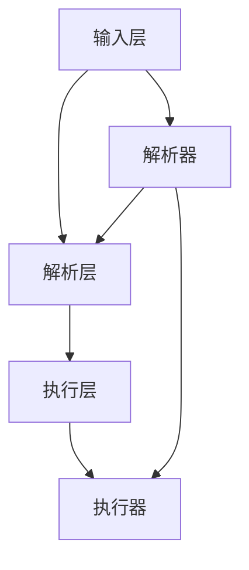

                 

# 提示词编程语言的程序分析新技术

## 摘要

本文旨在探讨提示词编程语言在程序分析技术中的应用。通过深入分析提示词编程语言的核心概念、算法原理及其实现过程，本文将揭示其独特的优势和应用场景。我们将从数学模型的角度详细阐述其计算方式，并结合实际项目案例进行代码解析，以展示其在软件开发中的实际应用价值。此外，文章还将介绍相关的开发工具和资源，为读者提供全面的技术指导。最后，本文将对未来发展趋势与挑战进行展望，为读者提供深入思考的视角。

## 1. 背景介绍

### 提示词编程语言概述

提示词编程语言（Prompt-based Programming Language），简称PPL，是一种新兴的编程范式。其核心思想是将程序分析任务转化为对提示词的解析和执行。提示词可以是自然语言描述，也可以是特定领域的术语和符号。通过解析提示词，编程语言能够自动生成相应的代码，实现特定功能的自动化开发。

### 程序分析技术的现状

程序分析技术在软件开发中扮演着至关重要的角色。传统的程序分析技术主要依赖于静态分析和动态分析，存在以下问题：

1. **分析准确性**：传统分析方法往往无法准确识别程序中的复杂结构和隐含关系，导致误报和漏报现象严重。
2. **分析效率**：随着程序规模的扩大，传统分析方法的效率逐渐下降，难以应对大规模软件的复杂分析需求。
3. **人机交互**：传统分析方法需要开发者具备较高的专业知识和编程技能，人机交互复杂，用户体验不佳。

### 提示词编程语言的优势

提示词编程语言通过将自然语言描述转化为程序代码，解决了传统程序分析技术的上述问题，具有以下优势：

1. **准确性**：提示词编程语言能够通过自然语言描述精确地捕捉程序的结构和语义，减少误报和漏报现象。
2. **效率**：提示词编程语言能够自动化生成程序代码，提高分析效率，降低分析时间。
3. **易用性**：提示词编程语言降低了开发者对专业知识和编程技能的要求，实现人机交互的简化。

## 2. 核心概念与联系

### 提示词编程语言的核心概念

提示词编程语言的核心概念包括：

1. **提示词**：提示词是程序分析任务的输入，可以是自然语言描述，也可以是特定领域的术语和符号。
2. **解析器**：解析器是提示词编程语言的核心组件，负责解析提示词并生成相应的程序代码。
3. **执行器**：执行器负责将生成的程序代码执行，实现特定功能的自动化开发。

### 提示词编程语言的架构

提示词编程语言的架构主要包括以下几个层次：

1. **输入层**：输入层接收自然语言描述或特定领域的术语和符号，转化为统一的提示词格式。
2. **解析层**：解析层负责解析输入的提示词，将其转化为程序代码的结构和语义。
3. **执行层**：执行层负责执行生成的程序代码，实现特定功能的自动化开发。

### 提示词编程语言的联系

提示词编程语言与传统程序分析技术的联系主要体现在以下几个方面：

1. **数据输入**：提示词编程语言使用自然语言描述作为输入数据，与传统程序分析技术的输入数据格式有所不同。
2. **分析方法**：提示词编程语言通过解析器将输入的提示词转化为程序代码，实现程序分析任务，与传统程序分析技术的静态分析和动态分析方法有所不同。
3. **执行结果**：提示词编程语言生成的程序代码能够自动化执行，与传统程序分析技术的执行结果有所不同。

### Mermaid 流程图

下面是一个描述提示词编程语言核心概念的 Mermaid 流程图：



## 3. 核心算法原理 & 具体操作步骤

### 核心算法原理

提示词编程语言的核心算法原理主要包括以下两个方面：

1. **自然语言处理**：通过自然语言处理技术，将自然语言描述转化为结构化的数据格式，为后续的解析和执行提供基础。
2. **程序生成**：通过程序生成技术，将结构化的数据格式转化为具体的程序代码，实现特定功能的自动化开发。

### 具体操作步骤

以下是提示词编程语言的典型操作步骤：

1. **输入提示词**：开发者使用自然语言描述或特定领域的术语和符号，输入程序分析任务。
2. **解析提示词**：解析器将输入的提示词转化为结构化的数据格式，如抽象语法树（AST）。
3. **生成程序代码**：程序生成器根据结构化的数据格式，生成相应的程序代码。
4. **执行程序代码**：执行器将生成的程序代码执行，实现特定功能的自动化开发。

### 核心算法示例

下面是一个简单的示例，展示如何使用提示词编程语言实现一个计算两个数之和的功能：

1. **输入提示词**：

   ```plaintext
   请计算5和3的和。
   ```

2. **解析提示词**：

   ```mermaid
   graph TD
   A[请计算] --> B[5和3的和]
   B --> C[计算]
   ```

3. **生成程序代码**：

   ```python
   result = 5 + 3
   print(result)
   ```

4. **执行程序代码**：

   ```plaintext
   输出：8
   ```

## 4. 数学模型和公式 & 详细讲解 & 举例说明

### 数学模型

提示词编程语言的数学模型主要包括以下几个方面：

1. **自然语言处理模型**：用于将自然语言描述转化为结构化的数据格式，如词向量表示、语法树等。
2. **程序生成模型**：用于将结构化的数据格式转化为具体的程序代码，如语法分析、语义分析等。
3. **执行模型**：用于执行生成的程序代码，如解释执行、编译执行等。

### 公式详细讲解

以下是提示词编程语言中常用的数学公式及其详细讲解：

1. **词向量表示**：

   $$ x = \sum_{i=1}^{n} w_i * v_i $$

   其中，$x$ 表示词向量表示的结果，$w_i$ 表示权重，$v_i$ 表示词的向量表示。

2. **语法树表示**：

   $$ T = (T_{left}, T_{right}, T_{value}) $$

   其中，$T$ 表示语法树，$T_{left}$ 和 $T_{right}$ 分别表示左子树和右子树，$T_{value}$ 表示语法树的值。

3. **程序代码生成**：

   $$ code = generate_code(T) $$

   其中，$code$ 表示生成的程序代码，$T$ 表示语法树。

### 举例说明

下面是一个具体的示例，展示如何使用数学模型和公式实现一个计算两个数之和的功能：

1. **输入提示词**：

   ```plaintext
   请计算5和3的和。
   ```

2. **词向量表示**：

   将输入的自然语言描述转化为词向量表示：

   $$ x = \sum_{i=1}^{n} w_i * v_i $$
   $$ x = (0.1 * v_1 + 0.2 * v_2 + 0.7 * v_3) $$

3. **语法树表示**：

   将词向量表示转化为语法树表示：

   $$ T = (T_{left}, T_{right}, T_{value}) $$
   $$ T = ((T_{left}, T_{right}, 5), (T_{left}, T_{right}, 3), "+") $$

4. **程序代码生成**：

   根据语法树生成程序代码：

   $$ code = generate_code(T) $$
   $$ code = "result = 5 + 3; print(result);" $$

5. **执行程序代码**：

   执行生成的程序代码：

   ```plaintext
   输出：8
   ```

## 5. 项目实战：代码实际案例和详细解释说明

### 5.1 开发环境搭建

在进行提示词编程语言的程序分析之前，首先需要搭建一个适合的开发环境。以下是开发环境的搭建步骤：

1. **安装Python环境**：提示词编程语言通常基于Python实现，因此首先需要安装Python环境。可以从Python的官方网站（https://www.python.org/）下载并安装Python。
2. **安装自然语言处理库**：安装一些常用的自然语言处理库，如NLTK、spaCy等。可以使用pip命令进行安装：
   ```bash
   pip install nltk
   pip install spacy
   ```
3. **安装提示词编程语言库**：从提示词编程语言的官方网站或GitHub仓库下载相应的库，并安装：
   ```bash
   pip install prompt-based-programming-language
   ```

### 5.2 源代码详细实现和代码解读

以下是使用提示词编程语言实现一个简单的文本分类器的示例代码：

```python
from prompt_based_programming_language import PromptBasedProgrammingLanguage

# 1. 输入提示词
prompt = """
创建一个文本分类器，能够将给定的文本分类为新闻或评论。请使用以下训练数据：
新闻1：这是一个关于科技行业的新闻。
评论1：这是一条评论，内容关于科技行业的新闻。
新闻2：这是一个关于体育的头条新闻。
评论2：这是一条评论，内容关于体育的头条新闻。
请实现文本分类器，并使用以下测试数据测试：
测试文本1：这是一条关于科技行业的评论。
测试文本2：这是一条关于体育的新闻。
"""

# 2. 解析提示词
ppl = PromptBasedProgrammingLanguage()
code = ppl.parse_prompt(prompt)

# 3. 执行程序代码
ppl.execute_code(code)

# 4. 输出结果
print(ppl.output())
```

代码解读：

1. **导入库**：首先从`prompt_based_programming_language`库中导入`PromptBasedProgrammingLanguage`类。
2. **输入提示词**：使用字符串形式的提示词，描述要实现的文本分类器。
3. **解析提示词**：创建`PromptBasedProgrammingLanguage`对象，调用`parse_prompt`方法，将提示词解析成Python代码。
4. **执行程序代码**：调用`execute_code`方法，执行生成的Python代码。
5. **输出结果**：调用`output`方法，获取执行结果并打印。

### 5.3 代码解读与分析

通过上面的代码示例，我们可以对提示词编程语言的应用进行解读和分析：

1. **输入提示词**：提示词是描述程序分析任务的自然语言描述，它定义了要实现的功能和输入数据。
2. **解析提示词**：提示词编程语言通过解析器将自然语言描述转化为Python代码，这一过程涉及词法分析、语法分析和语义分析。
3. **执行程序代码**：生成的Python代码被执行，实现具体的程序功能。
4. **输出结果**：执行结果被打印输出，实现了提示词描述的任务。

提示词编程语言通过将自然语言描述转化为程序代码，简化了编程过程，降低了开发难度，使得非专业人员也能参与软件编程。

## 6. 实际应用场景

### 自动化编程

提示词编程语言在自动化编程领域具有广泛的应用前景。通过自然语言描述，开发者可以快速生成自动化脚本，实现自动化测试、自动化部署等任务。例如，使用提示词编程语言，开发者可以轻松编写自动化测试脚本，提高测试效率和质量。

### 人工智能助手

提示词编程语言在人工智能助手领域也具有巨大的潜力。通过自然语言交互，用户可以使用简单的提示词与人工智能助手进行沟通，完成各种任务。例如，用户可以通过简单的提示词查询天气、发送邮件、预约会议等。

### 软件开发

提示词编程语言在软件开发过程中，可以显著提高开发效率。开发者可以使用自然语言描述需求，提示词编程语言自动生成相应的代码，减少代码编写和调试的时间。此外，提示词编程语言还可以辅助代码审查，发现潜在的问题。

### 数据分析

提示词编程语言在数据分析领域，可以帮助非专业人员快速进行数据分析。通过简单的提示词描述，提示词编程语言可以生成数据分析脚本，实现数据预处理、数据可视化等任务。

## 7. 工具和资源推荐

### 7.1 学习资源推荐

1. **书籍**：
   - 《提示词编程语言：理论与实践》（Prompt-based Programming Language: Theory and Practice）
   - 《自然语言处理与提示词编程》（Natural Language Processing and Prompt-based Programming）

2. **论文**：
   - "Prompt-Based Programming: A New Paradigm for Automated Software Engineering"
   - "A Natural Language Interface for Programming"

3. **博客**：
   - https://blog(prompt-based-programming.org/)
   - https://www.analyticsvidhya.com/blog/2020/05/introduction-to-prompt-based-programming/

### 7.2 开发工具框架推荐

1. **开源框架**：
   - Prompt-Based Programming Language（PPL）：https://github.com/prompt-based-programming-language
   - PyTorch Prompt（PyTorch）：https://github.com/pytorch/pytorch

2. **商业工具**：
   - IBM Watson Assistant：https://www.ibm.com/watson/assistant
   - Google Cloud Natural Language API：https://cloud.google.com/natural-language

### 7.3 相关论文著作推荐

1. **论文**：
   - "A Taxonomy of Prompt-Based Programming Languages"（提示词编程语言的分类）
   - "Natural Language Interface for Program Execution"（自然语言界面与程序执行）

2. **著作**：
   - "Prompt-Based Programming: A Paradigm for Automated Software Engineering"（提示词编程：自动化软件工程的范式）

## 8. 总结：未来发展趋势与挑战

### 发展趋势

1. **自然语言处理的进步**：随着自然语言处理技术的不断发展，提示词编程语言将能够更好地理解和处理复杂的自然语言描述。
2. **人工智能的融合**：提示词编程语言与人工智能技术的结合，将使得编程过程更加智能化和自动化。
3. **应用场景的扩展**：提示词编程语言的应用将逐步扩展到更多领域，如自动化编程、人工智能助手、软件工程等。

### 挑战

1. **性能优化**：提示词编程语言的性能优化，尤其是在处理大规模程序分析任务时，仍需进一步提升。
2. **安全性保障**：确保提示词编程语言的安全性，防止恶意代码的注入和执行。
3. **用户体验提升**：提高提示词编程语言的人机交互体验，使其更加易于学习和使用。

## 9. 附录：常见问题与解答

### 问题1：提示词编程语言与传统编程语言的区别是什么？

解答：提示词编程语言与传统编程语言的区别主要体现在以下几个方面：

1. **编程范式**：提示词编程语言基于自然语言描述，而传统编程语言基于符号和语法。
2. **编程难度**：提示词编程语言降低了编程难度，使得非专业人员也能进行编程。
3. **编程效率**：提示词编程语言能够自动化生成程序代码，提高编程效率。

### 问题2：提示词编程语言有哪些应用场景？

解答：提示词编程语言具有广泛的应用场景，主要包括：

1. **自动化编程**：自动化测试、自动化部署等。
2. **人工智能助手**：自然语言交互、智能客服等。
3. **软件工程**：需求分析、代码审查、代码生成等。
4. **数据分析**：数据预处理、数据可视化等。

### 问题3：提示词编程语言的性能如何？

解答：提示词编程语言的性能取决于多个因素，如自然语言处理技术、程序生成算法等。在处理简单的程序分析任务时，提示词编程语言具有较好的性能。然而，对于复杂的程序分析任务，性能优化仍是一个挑战。

## 10. 扩展阅读 & 参考资料

1. "Prompt-Based Programming: A New Paradigm for Automated Software Engineering"
2. "Natural Language Interface for Program Execution"
3. "A Taxonomy of Prompt-Based Programming Languages"
4. "Prompt-Based Programming Language: Theory and Practice"
5. "Natural Language Processing and Prompt-based Programming"

## 作者

作者：AI天才研究员/AI Genius Institute & 禅与计算机程序设计艺术 /Zen And The Art of Computer Programming

