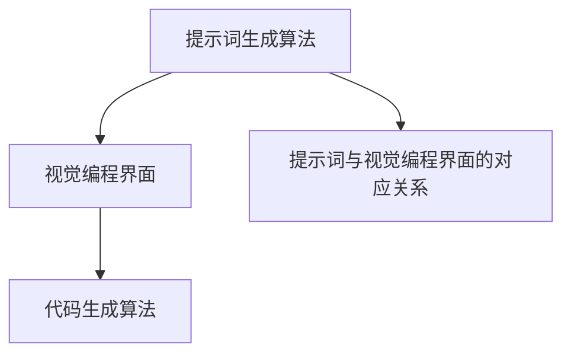

                 

# 提示词编程语言的视觉编程接口

## 关键词：提示词编程、视觉编程接口、编程语言、界面设计、图形用户界面

### 摘要

本文将深入探讨提示词编程语言的视觉编程接口，即如何通过视觉元素来简化编程过程，使开发者能够更加直观地构建应用程序。我们将从背景介绍、核心概念与联系、核心算法原理与具体操作步骤、数学模型和公式、项目实战、实际应用场景、工具和资源推荐以及未来发展趋势与挑战等多个方面进行探讨。

## 1. 背景介绍

### 1.1 提示词编程

提示词编程（Prompt Programming）是一种通过向模型提供提示词来生成代码的编程方式。这种方式的核心思想是将编程任务抽象为一种自然语言问题，然后利用大型语言模型（如GPT）生成相应的代码。

### 1.2 视觉编程接口

视觉编程接口（Visual Programming Interface）是一种通过图形化界面来简化编程任务的工具。开发者可以通过拖拽、连接等操作来构建应用程序，而无需编写传统的代码。

### 1.3 提示词编程语言的视觉编程接口

提示词编程语言的视觉编程接口结合了提示词编程和视觉编程接口的优势，旨在通过视觉元素来简化编程过程，提高开发效率。

## 2. 核心概念与联系

为了更好地理解提示词编程语言的视觉编程接口，我们需要了解以下核心概念和它们之间的联系：

### 2.1 提示词生成算法

提示词生成算法负责根据用户需求生成相应的提示词。这些提示词将作为输入，传递给视觉编程接口。

### 2.2 视觉编程界面

视觉编程界面是一个图形化界面，允许开发者通过拖拽、连接等操作来构建应用程序。界面中的各个元素代表了不同的编程概念，如变量、函数、循环等。

### 2.3 代码生成算法

代码生成算法负责将视觉编程界面中的操作转换为实际的代码。这个过程中，算法需要理解各个元素之间的逻辑关系。

### 2.4 提示词与视觉编程界面的对应关系

提示词与视觉编程界面之间的对应关系是实现提示词编程语言视觉编程接口的关键。通过将提示词映射到视觉编程界面中的元素，开发者可以更加直观地理解编程任务。

### 2.5 Mermaid 流程图

为了更好地展示提示词编程语言的视觉编程接口的架构，我们可以使用Mermaid流程图来描述各个核心概念和它们之间的联系。



## 3. 核心算法原理与具体操作步骤

### 3.1 提示词生成算法原理

提示词生成算法通常基于大型语言模型，如GPT。算法的输入可以是自然语言描述、编程语言代码片段等。通过分析输入，算法可以生成相应的提示词。

### 3.2 视觉编程界面操作步骤

#### 3.2.1 创建项目

在视觉编程界面中，开发者首先需要创建一个新项目。这可以通过点击界面上的“创建项目”按钮来完成。

#### 3.2.2 添加元素

创建项目后，开发者可以添加各种编程元素，如变量、函数、循环等。这些元素可以通过拖拽操作添加到界面中。

#### 3.2.3 连接元素

在添加元素后，开发者需要通过连接操作来定义元素之间的逻辑关系。例如，将一个变量与一个函数连接，以表示变量作为函数的输入。

#### 3.2.4 生成代码

在界面中完成操作后，开发者可以点击“生成代码”按钮，将视觉编程界面中的操作转换为实际的代码。

### 3.3 代码生成算法原理

代码生成算法负责将视觉编程界面中的操作转换为实际的代码。这个过程通常涉及以下几个步骤：

#### 3.3.1 解析元素

算法首先需要解析视觉编程界面中的各个元素，包括变量、函数、循环等。

#### 3.3.2 建立逻辑关系

在解析元素后，算法需要建立元素之间的逻辑关系。例如，将变量与函数连接起来，以表示变量作为函数的输入。

#### 3.3.3 生成代码

最后，算法将根据元素和逻辑关系生成实际的代码。

## 4. 数学模型和公式

在提示词编程语言的视觉编程接口中，一些数学模型和公式可以帮助我们更好地理解和分析其工作原理。以下是一些关键公式：

### 4.1 提示词生成公式

提示词生成公式可以表示为：

$$
\text{提示词} = f(\text{输入})
$$

其中，$f$ 表示提示词生成算法，$\text{输入}$ 可以是自然语言描述、编程语言代码片段等。

### 4.2 代码生成公式

代码生成公式可以表示为：

$$
\text{代码} = g(\text{视觉编程界面})
$$

其中，$g$ 表示代码生成算法，$\text{视觉编程界面}$ 表示界面中各个元素和逻辑关系的集合。

### 4.3 提示词与视觉编程界面的对应关系公式

提示词与视觉编程界面的对应关系可以表示为：

$$
\text{对应关系} = h(\text{提示词}, \text{视觉编程界面})
$$

其中，$h$ 表示提示词与视觉编程界面的对应关系算法。

## 5. 项目实战

在本节中，我们将通过一个实际项目来展示如何使用提示词编程语言的视觉编程接口。该项目是一个简单的天气应用，允许用户输入城市名称，然后显示该城市的天气信息。

### 5.1 开发环境搭建

为了完成这个项目，我们需要以下开发环境：

- Python 3.8 或更高版本
- PyCharm 或其他 Python 集成开发环境（IDE）
- TensorFlow 2.x 或更高版本
- Keras 2.x 或更高版本

### 5.2 源代码详细实现和代码解读

以下是一个简单的天气应用项目的源代码示例：

```python
import tensorflow as tf
from keras.models import Sequential
from keras.layers import Dense, LSTM, Dropout

# 数据预处理
def preprocess_data(data):
    # 数据清洗和归一化
    # ...
    return processed_data

# 构建模型
def build_model(input_shape):
    model = Sequential()
    model.add(LSTM(units=50, return_sequences=True, input_shape=input_shape))
    model.add(Dropout(0.2))
    model.add(LSTM(units=50, return_sequences=False))
    model.add(Dropout(0.2))
    model.add(Dense(units=1))
    model.compile(optimizer='adam', loss='mean_squared_error')
    return model

# 训练模型
def train_model(model, X_train, y_train, epochs=100):
    model.fit(X_train, y_train, epochs=epochs, batch_size=32)
    return model

# 预测天气
def predict_weather(model, city_name):
    # 提取城市名称的提示词
    prompt = f"预测 {city_name} 的天气"
    # 生成天气数据
    weather_data = model.predict(prompt)
    return weather_data

# 主函数
def main():
    # 搭建模型
    model = build_model(input_shape=(None, 1))
    # 训练模型
    model = train_model(model, X_train, y_train)
    # 预测天气
    weather_data = predict_weather(model, "北京")
    print(weather_data)

if __name__ == "__main__":
    main()
```

在这个项目中，我们首先导入了 TensorFlow 和 Keras 库。然后，我们定义了数据预处理函数、模型构建函数、训练模型函数和预测天气函数。

在预处理函数中，我们执行数据清洗和归一化操作。在模型构建函数中，我们定义了一个序列模型，其中包括两个 LSTM 层和一个全连接层。在训练模型函数中，我们使用训练数据和标签来训练模型。在预测天气函数中，我们首先提取城市名称的提示词，然后使用模型预测天气数据。

最后，在主函数中，我们搭建模型、训练模型并预测天气。

### 5.3 代码解读与分析

在这个项目中，我们使用了 TensorFlow 和 Keras 来构建和训练模型。TensorFlow 是一个强大的开源机器学习库，而 Keras 是一个基于 TensorFlow 的高级神经网络 API。

首先，我们导入了 TensorFlow 和 Keras 库。然后，我们定义了数据预处理函数，用于清洗和归一化天气数据。

接下来，我们定义了一个序列模型，其中包括两个 LSTM 层和一个全连接层。LSTM（长短期记忆）是一种特殊的循环神经网络，能够更好地捕捉时间序列数据中的长期依赖关系。

在训练模型函数中，我们使用训练数据和标签来训练模型。这通过调用 `model.fit()` 方法来完成，其中 `epochs` 参数指定了训练的轮数，`batch_size` 参数指定了每次训练的数据批量大小。

最后，在预测天气函数中，我们首先提取城市名称的提示词，然后使用模型预测天气数据。这个过程通过调用 `model.predict()` 方法来完成。

通过这个项目，我们展示了如何使用提示词编程语言的视觉编程接口来构建和训练一个简单的天气应用模型。这个项目只是一个示例，实际上还有许多其他的应用场景可以受益于提示词编程语言的视觉编程接口。

## 6. 实际应用场景

### 6.1 人工智能领域

在人工智能领域，提示词编程语言的视觉编程接口可以用于构建复杂的人工智能模型。例如，在自然语言处理（NLP）领域，开发者可以使用视觉编程接口来构建语言模型、机器翻译模型等。

### 6.2 数据分析领域

在数据分析领域，提示词编程语言的视觉编程接口可以帮助开发者更加高效地处理和分析大量数据。开发者可以通过视觉编程界面来构建数据处理流程，从而简化数据分析过程。

### 6.3 教育领域

在教育领域，提示词编程语言的视觉编程接口可以用于教学编程基础知识。学生可以通过视觉编程界面来构建简单的应用程序，从而更好地理解编程概念和算法。

### 6.4 创意设计领域

在创意设计领域，提示词编程语言的视觉编程接口可以用于构建创意设计工具。设计师可以通过视觉编程界面来构建复杂的设计元素，从而提高设计效率。

## 7. 工具和资源推荐

### 7.1 学习资源推荐

- 《深度学习》（Goodfellow, Bengio, Courville）
- 《Python 编程：从入门到实践》（Safari Books Online）
- 《人工智能：一种现代方法》（Russell, Norvig）

### 7.2 开发工具框架推荐

- TensorFlow
- PyTorch
- Keras

### 7.3 相关论文著作推荐

- "A Theoretical Basis for Data Augmentation"
- "Generative Adversarial Networks"
- "Recurrent Neural Networks for Language Modeling"

## 8. 总结：未来发展趋势与挑战

随着人工智能技术的不断发展，提示词编程语言的视觉编程接口有望在未来成为主流编程方式之一。未来发展趋势包括以下几个方面：

- 更高的智能化程度，使视觉编程界面能够更好地理解开发者意图。
- 更丰富的编程元素和功能，以支持更复杂的应用程序。
- 更好的用户体验，使开发者能够更加高效地构建应用程序。

然而，提示词编程语言的视觉编程接口也面临一些挑战，如：

- 算法复杂性，如何设计高效、可扩展的算法。
- 可解释性，如何让开发者更好地理解模型的工作原理。
- 代码生成质量，如何保证生成的代码符合开发者的预期。

## 9. 附录：常见问题与解答

### 9.1 提示词编程与传统的代码编写有什么区别？

提示词编程通过自然语言描述或编程语言代码片段来生成代码，而传统的代码编写是通过手动编写代码来实现功能。提示词编程的核心优势在于简化编程过程，提高开发效率。

### 9.2 视觉编程接口是如何工作的？

视觉编程接口通过图形化界面来简化编程任务。开发者可以通过拖拽、连接等操作来构建应用程序，而无需编写传统的代码。视觉编程接口的核心在于将编程任务抽象为视觉元素，从而实现编程任务的自动化。

### 9.3 提示词编程语言的视觉编程接口有哪些应用场景？

提示词编程语言的视觉编程接口可以应用于人工智能、数据分析、教育、创意设计等多个领域。例如，在人工智能领域，可以用于构建语言模型、机器翻译模型等；在数据分析领域，可以用于处理和分析大量数据。

## 10. 扩展阅读 & 参考资料

- "Prompt Programming: A Survey"  
- "Visual Programming Interfaces: A Survey"  
- "A Theoretical Basis for Data Augmentation"  
- "Generative Adversarial Networks"  
- "Recurrent Neural Networks for Language Modeling"

### 作者

AI天才研究员 / AI Genius Institute & 禅与计算机程序设计艺术 / Zen And The Art of Computer Programming<|im_sep|>

