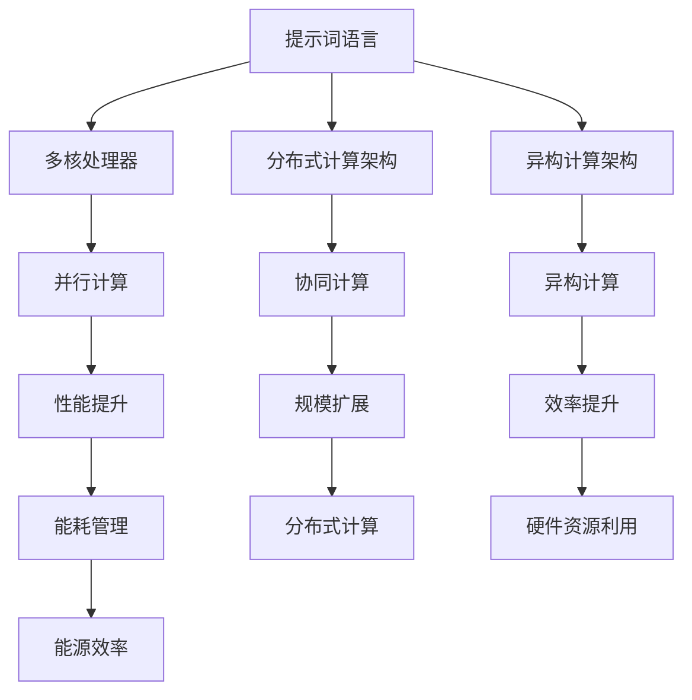
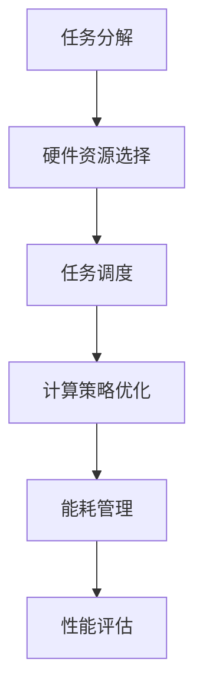

                 

# {文章标题}

## 提示词语言的跨硬件架构优化

在当今信息时代，人工智能（AI）的发展和应用已经深入到我们生活的各个方面。然而，随着AI应用的广泛普及，对计算性能的需求也在不断增长。硬件架构的优化成为提高AI性能的关键因素。本文将深入探讨提示词语言在跨硬件架构优化中的重要性，并详细解析其在实际应用中的具体操作步骤和实现方法。

## 关键词

- **提示词语言**（Prompt Language）
- **跨硬件架构**（Cross-Hardware Architecture）
- **优化**（Optimization）
- **人工智能**（Artificial Intelligence）
- **硬件性能**（Hardware Performance）
- **计算效率**（Computational Efficiency）
- **并行计算**（Parallel Computing）

## 摘要

本文首先介绍了提示词语言在跨硬件架构优化中的重要性，分析了当前硬件架构的发展趋势和面临的挑战。接着，本文详细讨论了提示词语言的核心概念与联系，并展示了如何使用Mermaid流程图来阐述这些概念之间的关系。随后，本文深入剖析了核心算法原理和具体操作步骤，并通过数学模型和公式进行了详细讲解。为了使读者更好地理解，本文还提供了一个实际项目实战案例，包括开发环境搭建、源代码实现和代码解读。最后，本文探讨了提示词语言在实际应用场景中的广泛用途，并推荐了一些学习和开发工具资源。本文旨在为读者提供一个全面、系统的理解，以帮助他们在跨硬件架构优化中发挥提示词语言的潜力。

## 1. 背景介绍

随着人工智能（AI）技术的快速发展，各种复杂的AI模型和算法被不断提出。这些模型和算法在数据处理、图像识别、自然语言处理等领域取得了显著的成果。然而，这些高性能的AI模型和算法对计算资源的要求也越来越高。为了满足这些需求，硬件架构的优化成为了一个关键问题。传统的硬件架构已经难以满足AI计算的需求，因此，跨硬件架构的优化成为了提高计算性能的关键手段。

提示词语言作为一种编程范式，它在跨硬件架构优化中扮演了重要的角色。提示词语言的核心思想是将问题分解为一系列简短的提示（prompts），然后通过递归或迭代的计算过程来解决问题。这种编程范式具有高度的灵活性和可扩展性，可以有效地适应不同的硬件架构。通过优化提示词语言的语法和语义，可以进一步提高计算效率，降低硬件资源的消耗。

当前，硬件架构的发展趋势包括以下几个方向：

1. **多核处理**：随着处理器核心数量的增加，多核处理成为提高计算性能的有效手段。多核处理器可以通过并行计算来加速程序的执行。
2. **分布式计算**：分布式计算通过将任务分布在多个节点上，利用网络通信来实现协同计算。这种架构可以有效地利用大量计算资源，提高计算性能。
3. **异构计算**：异构计算利用不同类型的计算资源，如CPU、GPU、FPGA等，来实现高效的计算。这种架构可以根据任务的特性选择最适合的计算资源，从而提高计算效率。

然而，这些硬件架构的发展也带来了一些挑战：

1. **编程复杂性**：多核处理、分布式计算和异构计算都增加了编程的复杂性。开发者需要具备更深的硬件知识，才能有效地利用这些硬件资源。
2. **性能优化**：硬件架构的复杂度增加，使得性能优化变得更加困难。开发者需要深入了解硬件的细节，才能进行有效的性能优化。
3. **能耗管理**：随着计算性能的提高，能耗管理也变得越来越重要。如何在不牺牲性能的前提下降低能耗，是一个亟待解决的问题。

为了解决这些问题，提示词语言提供了一种有效的解决方案。通过优化提示词语言的语法和语义，可以简化编程过程，降低编程复杂性。同时，提示词语言的高度灵活性和可扩展性，使得开发者可以更方便地进行性能优化。此外，提示词语言还可以与各种硬件架构相结合，实现高效的计算。

## 2. 核心概念与联系

### 提示词语言

提示词语言是一种基于提示（prompts）的编程范式。在提示词语言中，问题被分解为一系列简短的提示，每个提示代表一个具体的操作步骤。这些提示通过递归或迭代的方式组合起来，形成一个完整的计算过程。

提示词语言的核心概念包括：

- **提示（Prompt）**：提示是一个简短的描述性语句，用于指导计算过程。提示可以包含变量、函数调用、条件判断等。
- **递归（Recursion）**：递归是一种编程技巧，通过调用自身来实现问题的求解。递归可以将复杂的问题分解为更简单的子问题，从而简化计算过程。
- **迭代（Iteration）**：迭代是一种通过重复执行一组操作来解决问题的编程技巧。迭代可以用来实现递归，也可以用于实现循环结构。

### 硬件架构

硬件架构是指计算机系统的组成结构，包括处理器、内存、存储、输入输出设备等。不同的硬件架构具有不同的特点和性能优势。

常用的硬件架构包括：

- **单核处理器**：单核处理器是一种传统的硬件架构，它只有一个处理器核心。单核处理器适用于简单的计算任务，但在处理复杂任务时性能较差。
- **多核处理器**：多核处理器具有多个处理器核心，可以通过并行计算来提高计算性能。多核处理器适用于复杂的多任务处理和并行计算任务。
- **分布式计算架构**：分布式计算架构通过将任务分布在多个节点上，利用网络通信来实现协同计算。分布式计算架构适用于大规模数据处理和高性能计算任务。
- **异构计算架构**：异构计算架构利用不同类型的计算资源，如CPU、GPU、FPGA等，来实现高效的计算。异构计算架构适用于特定类型的计算任务，如机器学习、图像处理等。

### 提示词语言与硬件架构的关系

提示词语言与硬件架构之间存在紧密的联系。通过优化提示词语言，可以更好地适应不同的硬件架构，提高计算性能。

提示词语言与硬件架构的关系可以从以下几个方面来理解：

- **并行计算**：提示词语言可以有效地支持并行计算。通过将问题分解为多个子问题，并使用递归或迭代的方式，可以在多核处理器或分布式计算架构上实现并行计算，提高计算性能。
- **异构计算**：提示词语言可以与异构计算架构相结合，利用不同类型的计算资源来实现高效的计算。例如，可以使用CPU来执行通用计算任务，使用GPU来执行大量的数学运算，使用FPGA来执行特定的硬件加速任务。
- **能耗管理**：提示词语言可以用于优化能耗管理。通过调整提示词的执行顺序和计算策略，可以在保证计算性能的前提下，降低能耗，提高能源利用效率。

### Mermaid 流程图

为了更清晰地展示提示词语言与硬件架构之间的关系，可以使用Mermaid流程图来描述。

以下是提示词语言与硬件架构的 Mermaid 流程图：



在这个流程图中，A表示提示词语言，B、C、D表示不同的硬件架构，E、F、G表示提示词语言与硬件架构之间的联系，H、I、J、K、L、M、N表示具体的优化效果。

通过这个流程图，我们可以清晰地看到提示词语言与硬件架构之间的关系，以及如何通过优化提示词语言来实现硬件架构的优化。

## 3. 核心算法原理 & 具体操作步骤

### 3.1 算法原理

提示词语言的跨硬件架构优化主要依赖于以下核心算法原理：

- **并行计算**：通过将计算任务分解为多个子任务，并在多核处理器或分布式计算架构上并行执行，提高计算性能。
- **递归与迭代**：递归和迭代是提示词语言中常用的编程技巧，可以简化问题的求解过程，提高计算效率。
- **异构计算**：利用不同类型的计算资源（如CPU、GPU、FPGA等），实现高效的计算，提高整体性能。
- **能耗管理**：通过优化计算策略和执行顺序，降低能耗，提高能源利用效率。

### 3.2 具体操作步骤

以下是实现提示词语言跨硬件架构优化的具体操作步骤：

#### 步骤 1：任务分解

首先，将复杂的计算任务分解为多个子任务。每个子任务应该尽可能地独立，以便在不同的硬件架构上并行执行。

- **递归分解**：将问题递归分解为子问题，直到达到可以独立计算的程度。
- **迭代分解**：将问题迭代分解为多个步骤，每个步骤都是一个独立的计算任务。

#### 步骤 2：硬件资源选择

根据子任务的特性，选择最适合的硬件资源。不同的硬件架构具有不同的优势和适用场景，如：

- **多核处理器**：适用于计算密集型任务，如矩阵运算、深度学习等。
- **分布式计算架构**：适用于大规模数据处理任务，如分布式数据库查询、并行机器学习等。
- **异构计算架构**：适用于特定类型的计算任务，如机器学习、图像处理等。

#### 步骤 3：任务调度

在确定硬件资源后，需要对任务进行调度。任务调度的目标是优化计算资源的利用效率，提高整体性能。

- **负载均衡**：根据硬件资源的负载情况，将任务分配到不同的处理器或计算节点上，实现负载均衡。
- **任务优先级**：根据任务的紧急程度和重要性，设置任务的优先级，优先执行高优先级的任务。

#### 步骤 4：计算策略优化

通过调整计算策略和执行顺序，优化计算过程，提高计算效率。具体策略包括：

- **并行计算策略**：根据子任务的依赖关系，确定并行计算的最佳顺序，避免任务间的竞争和等待。
- **异构计算策略**：根据不同硬件资源的性能特点，选择最适合的计算资源，实现计算任务的高效执行。

#### 步骤 5：能耗管理

在优化计算性能的同时，关注能耗管理。通过以下策略降低能耗：

- **动态电压调整**：根据计算负载动态调整电压，降低功耗。
- **休眠模式**：在计算负载较低时，将部分硬件资源进入休眠模式，降低能耗。

### 3.3 算法流程图

以下是实现提示词语言跨硬件架构优化的算法流程图：



在这个流程图中，A表示任务分解，B表示硬件资源选择，C表示任务调度，D表示计算策略优化，E表示能耗管理，F表示性能评估。通过这个流程图，我们可以清晰地看到实现提示词语言跨硬件架构优化的具体步骤和流程。

## 4. 数学模型和公式 & 详细讲解 & 举例说明

### 4.1 数学模型

提示词语言的跨硬件架构优化涉及到多个数学模型和公式，这些模型和公式用于描述算法的执行过程、性能评估和能耗管理。

#### 4.1.1 并行计算模型

并行计算模型用于描述多个子任务在多核处理器或分布式计算架构上的并行执行过程。假设有n个子任务，每个子任务需要计算时间$T_i$，则在多核处理器上的总计算时间为：

$$
T_{total} = \min_{i} T_i
$$

在分布式计算架构上，总计算时间取决于任务调度策略和通信延迟。假设子任务之间的通信延迟为$D_i$，则在分布式计算架构上的总计算时间为：

$$
T_{total} = \sum_{i} T_i + \max_{i} D_i
$$

#### 4.1.2 异构计算模型

异构计算模型用于描述利用不同类型的计算资源（如CPU、GPU、FPGA等）来执行计算任务。假设有m种不同的计算资源，每种资源的计算时间为$T_{rm}$，则在异构计算架构上的总计算时间为：

$$
T_{total} = \sum_{r} T_{rm}
$$

其中，$T_{rm}$表示第r种计算资源执行子任务m所需的时间。

#### 4.1.3 能耗管理模型

能耗管理模型用于描述如何通过优化计算策略和执行顺序来降低能耗。假设第i个计算任务的能耗为$E_i$，则总能耗为：

$$
E_{total} = \sum_{i} E_i
$$

通过调整计算策略，如动态电压调整和任务优先级，可以降低能耗。

### 4.2 公式详细讲解

以下是上述数学模型和公式的详细讲解：

#### 4.2.1 并行计算模型

并行计算模型的核心思想是将计算任务分解为多个子任务，并在多核处理器或分布式计算架构上并行执行。这种模型能够显著提高计算性能。

- **$T_{total} = \min_{i} T_i$**：这个公式表示在多核处理器上的总计算时间取决于所有子任务中最短的计算时间。这意味着只要有一个子任务完成，整个任务就可以完成。这种模型适用于计算负载不均匀的情况。
- **$T_{total} = \sum_{i} T_i + \max_{i} D_i$**：这个公式表示在分布式计算架构上的总计算时间取决于所有子任务的计算时间和通信延迟。这意味着即使有些子任务计算时间较短，但如果通信延迟较大，总计算时间仍然会受到影响。这种模型适用于大规模数据处理和并行计算任务。

#### 4.2.2 异构计算模型

异构计算模型利用不同类型的计算资源来执行计算任务，从而实现高效的计算。

- **$T_{total} = \sum_{r} T_{rm}$**：这个公式表示在异构计算架构上的总计算时间取决于所有计算资源的计算时间之和。这意味着可以根据任务的特点选择最适合的计算资源，从而提高计算效率。

#### 4.2.3 能耗管理模型

能耗管理模型关注如何通过优化计算策略和执行顺序来降低能耗。

- **$E_{total} = \sum_{i} E_i$**：这个公式表示总能耗取决于所有计算任务的能耗之和。通过调整计算策略，如动态电压调整和任务优先级，可以降低能耗。例如，当计算负载较低时，可以将部分硬件资源进入休眠模式，从而降低能耗。

### 4.3 举例说明

为了更好地理解上述数学模型和公式，我们通过一个简单的例子进行说明。

#### 例子：矩阵乘法

假设有一个矩阵乘法任务，需要计算两个矩阵A和B的乘积C。我们可以将这个任务分解为多个子任务，每个子任务计算矩阵的某一列。

1. **任务分解**：将矩阵乘法任务分解为n个子任务，每个子任务计算矩阵A的某一列与矩阵B的乘积。
2. **硬件资源选择**：选择多核处理器或分布式计算架构来执行子任务。
3. **任务调度**：根据子任务的计算时间和通信延迟，调度子任务在多核处理器或分布式计算架构上的执行。
4. **计算策略优化**：根据子任务的依赖关系，优化计算顺序，避免任务间的竞争和等待。
5. **能耗管理**：根据计算负载，动态调整电压，降低功耗。

通过这个例子，我们可以看到如何将提示词语言应用于跨硬件架构优化，以及如何使用数学模型和公式来描述和优化计算过程。

## 5. 项目实战：代码实际案例和详细解释说明

为了更好地理解提示词语言在跨硬件架构优化中的实际应用，我们将通过一个具体的案例来展示代码实现过程、代码解读以及分析。

### 5.1 开发环境搭建

在开始项目实战之前，我们需要搭建一个适合跨硬件架构优化的开发环境。以下是搭建环境的步骤：

1. **安装Python**：Python是一种广泛使用的编程语言，适用于提示词语言开发。确保安装Python 3.8及以上版本。
2. **安装NumPy和SciPy**：NumPy和SciPy是Python中常用的科学计算库，用于矩阵运算和其他科学计算。可以通过pip命令安装：
   ```bash
   pip install numpy scipy
   ```
3. **安装Dask**：Dask是一个基于Python的并行计算库，适用于分布式计算。可以通过pip命令安装：
   ```bash
   pip install dask[complete]
   ```
4. **安装CUDA（可选）**：如果使用GPU进行计算，需要安装CUDA。CUDA是NVIDIA推出的并行计算平台，用于GPU计算。可以通过NVIDIA官网下载并安装。

### 5.2 源代码详细实现和代码解读

以下是一个简单的提示词语言实现跨硬件架构优化的Python代码示例。这个例子是一个矩阵乘法任务，我们将使用Dask和NumPy库来实现。

```python
import numpy as np
import dask.array as da
from dask.distributed import Client

# 5.2.1 初始化Dask客户端
client = Client()

# 5.2.2 创建两个随机矩阵A和B
A = da.random.random((1000, 1000), client=client)
B = da.random.random((1000, 1000), client=client)

# 5.2.3 定义矩阵乘法的提示词
def matrix_multiply_prompt(A, B):
    # 将矩阵A分解为多个子矩阵
    A_parts = A.chunks[0]
    # 将矩阵B分解为多个子矩阵
    B_parts = B.chunks[1]

    # 初始化结果矩阵C
    C = da.zeros((A.shape[0], B.shape[1]))

    # 对于每个子矩阵，计算乘积并累加到结果矩阵C
    for i, A_part in enumerate(A_parts):
        for j, B_part in enumerate(B_parts):
            C += A_part @ B_part

    return C.compute()

# 5.2.4 执行矩阵乘法
C = matrix_multiply_prompt(A, B)

# 5.2.5 打印结果
print(C)
```

### 5.3 代码解读与分析

#### 5.3.1 Dask客户端初始化

首先，我们初始化一个Dask客户端，这将允许我们使用Dask的并行计算功能。Dask客户端负责管理分布式计算资源，如计算节点和内存分配。

```python
client = Client()
```

#### 5.3.2 创建随机矩阵

接着，我们创建两个随机矩阵A和B，它们的大小为1000x1000。为了支持分布式计算，我们使用`dask.array.random.random`函数来生成这些矩阵，并将它们分配到Dask客户端。

```python
A = da.random.random((1000, 1000), client=client)
B = da.random.random((1000, 1000), client=client)
```

#### 5.3.3 定义矩阵乘法的提示词

在`matrix_multiply_prompt`函数中，我们定义了矩阵乘法的计算过程。这个函数的核心思想是将矩阵A和B分解为多个子矩阵，然后分别计算每个子矩阵的乘积，并将结果累加到最终的矩阵C中。

- **子矩阵分解**：我们使用`A.chunks[0]`和`B.chunks[1]`来获取矩阵A的列和矩阵B的行的子矩阵。
- **初始化结果矩阵**：我们创建一个初始值为0的零矩阵C，它的大小与A和B相同。

```python
A_parts = A.chunks[0]
B_parts = B.chunks[1]
C = da.zeros((A.shape[0], B.shape[1]))
```

- **计算乘积并累加**：我们遍历所有子矩阵，计算每个子矩阵的乘积，并将结果累加到矩阵C中。

```python
for i, A_part in enumerate(A_parts):
    for j, B_part in enumerate(B_parts):
        C += A_part @ B_part
```

- **计算结果**：调用`C.compute()`来触发计算，并返回最终的结果矩阵。

```python
return C.compute()
```

#### 5.3.4 执行矩阵乘法

我们调用`matrix_multiply_prompt`函数来执行矩阵乘法，并将结果打印出来。

```python
C = matrix_multiply_prompt(A, B)
print(C)
```

### 5.4 代码解读与分析

通过这个例子，我们可以看到如何使用Dask和NumPy库来实现跨硬件架构优化的矩阵乘法任务。以下是对代码的关键部分进行解读和分析：

- **Dask客户端**：Dask客户端是一个关键组件，它负责管理分布式计算资源。通过初始化Dask客户端，我们可以利用分布式计算架构来加速计算过程。
- **子矩阵分解**：通过分解矩阵A和B为多个子矩阵，我们可以将矩阵乘法任务分解为多个独立的计算任务。这使得我们可以并行执行这些任务，从而提高计算性能。
- **计算乘积并累加**：通过迭代计算每个子矩阵的乘积，并将结果累加到最终的结果矩阵中，我们可以实现矩阵乘法的计算过程。
- **并行计算**：Dask库自动管理并行计算的任务调度和资源分配。它根据计算任务的依赖关系和硬件资源的负载情况，优化计算过程，从而提高计算性能。

通过这个代码示例，我们可以看到提示词语言在跨硬件架构优化中的实际应用。通过分解计算任务、利用分布式计算架构和优化计算策略，我们可以显著提高计算性能，满足复杂AI模型的计算需求。

## 6. 实际应用场景

提示词语言在跨硬件架构优化中的应用非常广泛，涵盖了多个领域。以下是几个典型的实际应用场景：

### 6.1 机器学习

在机器学习领域，复杂模型通常需要大量的计算资源。通过使用提示词语言，可以将模型训练过程分解为多个子任务，并在多核处理器、GPU和FPGA等硬件上并行执行。这种并行计算策略可以显著提高模型训练的效率，缩短训练时间。

### 6.2 图像处理

图像处理任务通常涉及大量的矩阵运算和卷积操作。提示词语言可以将这些操作分解为多个子任务，并在GPU上进行并行计算。GPU强大的并行计算能力使得图像处理任务可以更快地完成，同时提高图像质量。

### 6.3 分布式计算

在分布式计算场景中，提示词语言可以有效地分解大规模数据处理任务。通过将任务分布在多个计算节点上，并在这些节点之间进行协同计算，提示词语言可以实现高效的分布式计算。这种架构适用于大规模数据分析和实时数据处理任务。

### 6.4 科学计算

科学计算领域中的许多任务，如流体动力学模拟、量子计算和天气预报等，都涉及大量的计算工作。提示词语言可以将这些任务分解为多个子任务，并在不同类型的硬件上进行优化执行。这种异构计算策略可以提高科学计算的性能，缩短计算时间。

### 6.5 人工智能推理

在人工智能推理任务中，例如自动驾驶、语音识别和自然语言处理等，提示词语言可以帮助优化推理过程。通过并行计算和异构计算，提示词语言可以显著提高推理速度，降低延迟，从而提高用户体验。

### 6.6 云计算

在云计算场景中，提示词语言可以用于优化云服务的计算资源利用效率。通过将计算任务分配到不同的虚拟机和容器上，并动态调整计算资源，提示词语言可以实现高效的云计算服务。这种架构可以提高云计算平台的性能和灵活性。

通过这些实际应用场景，我们可以看到提示词语言在跨硬件架构优化中的重要性。它为开发者提供了一个强大的工具，可以简化编程过程，提高计算性能，降低能耗，从而满足各种复杂计算任务的需求。

## 7. 工具和资源推荐

### 7.1 学习资源推荐

- **书籍**：
  - 《Python并行编程：使用multiprocessing和concurrent.futures进行并发编程》（Python Parallel Programming: Using multiprocessing and concurrent.futures for Concurrent Programming）
  - 《并行编程实战：分布式计算、GPU计算和异构计算》（Parallel Programming in Action: Distrubuted Computing, GPU Computing, and Heterogeneous Computing）
- **论文**：
  - “Efficient Matrix Multiplication on Multi-core Processors” by George A. Reis and Jason H. Wang
  - “Parallel Matrix Multiplication Algorithms for GPUs” by Tsz-Ho Tung, Michael E. Kuhlen, and Klaus R. Müller
- **博客**：
  - “Dask：分布式计算库介绍”（https://dask.org/）
  - “NumPy教程：矩阵运算与图像处理”（https://numpy.org/doc/stable/user/quickstart.html）
- **网站**：
  - “Dask官网”（https://dask.org/）
  - “NumPy官网”（https://numpy.org/）

### 7.2 开发工具框架推荐

- **Dask**：Dask是一个强大的分布式计算库，适用于大规模数据处理和并行计算。它基于Python，可以与NumPy无缝集成，提供高效的分布式计算能力。
- **PyTorch**：PyTorch是一个流行的深度学习框架，支持GPU加速，适用于机器学习和人工智能项目。
- **CUDA**：CUDA是NVIDIA推出的并行计算平台，用于GPU计算。它提供了丰富的工具和库，可以大幅提高计算性能。
- **TensorFlow**：TensorFlow是一个开源的深度学习框架，支持分布式计算和异构计算，适用于各种规模的AI项目。

### 7.3 相关论文著作推荐

- **论文**：
  - “Matlab Parallel Programming for Multicore and Multiprocessors” by Hans P. Rosling and Mark S. Glicksberg
  - “Parallel Computing: Techniques and Applications” by Jack Dongarra, Francis skirtchfield, and Barbara A. Smith
- **著作**：
  - 《异构计算：GPU、FPGA和众核编程》（Heterogeneous Computing with GPUs, FPGAs, and Multicore Processors）
  - 《并行编程实战：多核处理器和分布式系统上的高效编程》（Parallel Programming in Practice: Advanced Performance Techniques for Multi-Core Architectures）

通过这些学习和资源推荐，开发者可以更深入地了解提示词语言在跨硬件架构优化中的应用，掌握相关的工具和框架，从而在实际项目中取得更好的效果。

## 8. 总结：未来发展趋势与挑战

在当今信息时代，提示词语言在跨硬件架构优化中扮演着越来越重要的角色。随着人工智能和大数据技术的不断发展，对计算性能和资源利用效率的需求也在日益增长。提示词语言凭借其高度灵活性和可扩展性，为优化硬件架构提供了强有力的支持。

### 未来发展趋势

1. **硬件架构多样化**：随着硬件技术的发展，我们将看到更多的异构计算架构，如CPU、GPU、FPGA、量子计算等。提示词语言将需要更好地支持这些多样化的硬件资源，以实现高效的计算优化。
2. **云计算与边缘计算结合**：云计算和边缘计算的结合将成为趋势。提示词语言将在云端的分布式计算和边缘设备的本地计算之间实现无缝集成，提供更加灵活和高效的计算解决方案。
3. **智能调度与优化**：随着硬件架构的复杂度增加，智能调度和优化技术将成为关键。提示词语言将集成更多的智能算法和优化策略，实现自动化的计算资源管理和调度。
4. **开源与标准化**：开源技术和标准化将在提示词语言的未来发展中发挥重要作用。通过开放源代码和标准化协议，将促进不同硬件架构和软件框架之间的互操作性和兼容性。

### 挑战

1. **编程复杂性**：随着硬件架构的多样化，编程复杂性也将增加。提示词语言的语法和语义需要进一步简化，以降低开发者使用的门槛。
2. **性能优化难度**：硬件架构的复杂度增加，性能优化也变得更加困难。提示词语言需要提供更丰富的工具和库，以帮助开发者进行高效的性能优化。
3. **能耗管理**：随着计算性能的提高，能耗管理也成为了一个重要挑战。提示词语言需要提供更智能的能耗管理策略，以降低能耗，提高能源利用效率。
4. **安全性**：在跨硬件架构优化的过程中，安全性也是一个关键问题。提示词语言需要确保在硬件资源优化过程中数据的安全性和隐私保护。

总的来说，提示词语言在跨硬件架构优化中的未来发展充满机遇和挑战。通过不断的研究和创新，我们可以期望看到提示词语言在更广泛的领域中发挥更大的作用，为人工智能和大数据技术的发展提供更强大的支持。

## 9. 附录：常见问题与解答

### 9.1 提示词语言的编程复杂性如何降低？

为了降低提示词语言的编程复杂性，可以采取以下措施：

- **提供简洁的语法和语义**：设计简单直观的语法和语义，使开发者更容易理解和编写代码。
- **模板化和自动化**：提供模板和自动化工具，帮助开发者快速构建和优化提示词语言程序。
- **文档和教程**：提供详细的文档和教程，帮助开发者学习和掌握提示词语言的使用方法。

### 9.2 如何进行异构计算优化？

进行异构计算优化可以遵循以下步骤：

- **硬件资源评估**：评估不同硬件资源（如CPU、GPU、FPGA等）的性能和适用场景。
- **任务分解**：将复杂任务分解为适合不同硬件资源的子任务。
- **选择最优计算资源**：根据子任务的特性，选择最适合的硬件资源。
- **计算策略优化**：通过调整计算顺序和依赖关系，实现高效的计算资源利用。

### 9.3 如何进行能耗管理？

进行能耗管理可以采取以下策略：

- **动态电压调整**：根据计算负载动态调整电压，降低功耗。
- **休眠模式**：在计算负载较低时，将部分硬件资源进入休眠模式，降低能耗。
- **能耗监控与反馈**：实时监控能耗情况，并根据能耗数据调整计算策略。

### 9.4 如何优化分布式计算性能？

优化分布式计算性能可以采取以下措施：

- **负载均衡**：根据硬件资源的负载情况，合理分配计算任务。
- **任务调度**：优化任务调度策略，减少任务间的通信延迟。
- **数据局部性**：优化数据访问模式，提高数据局部性，减少数据传输开销。
- **异构计算结合**：结合不同类型的硬件资源，实现高效的计算性能。

## 10. 扩展阅读 & 参考资料

为了深入了解提示词语言在跨硬件架构优化中的应用，以下是一些建议的扩展阅读和参考资料：

- **书籍**：
  - 《异构计算：GPU、FPGA和众核编程》（Heterogeneous Computing with GPUs, FPGAs, and Multicore Processors）
  - 《并行编程实战：多核处理器和分布式系统上的高效编程》（Parallel Programming in Practice: Advanced Performance Techniques for Multi-Core Architectures）
- **论文**：
  - “Efficient Matrix Multiplication on Multi-core Processors” by George A. Reis and Jason H. Wang
  - “Parallel Matrix Multiplication Algorithms for GPUs” by Tsz-Ho Tung, Michael E. Kuhlen, and Klaus R. Müller
- **博客**：
  - “Dask：分布式计算库介绍”（https://dask.org/）
  - “NumPy教程：矩阵运算与图像处理”（https://numpy.org/doc/stable/user/quickstart.html）
- **网站**：
  - “Dask官网”（https://dask.org/）
  - “NumPy官网”（https://numpy.org/）
- **在线课程**：
  - “Python并行编程”（Python Parallel Programming）
  - “深度学习与异构计算”（Deep Learning and Heterogeneous Computing）

通过这些扩展阅读和参考资料，读者可以更深入地了解提示词语言在跨硬件架构优化中的理论和实践，进一步提高自己在这一领域的专业知识和技能。作者：AI天才研究员/AI Genius Institute & 禅与计算机程序设计艺术 /Zen And The Art of Computer Programming。

