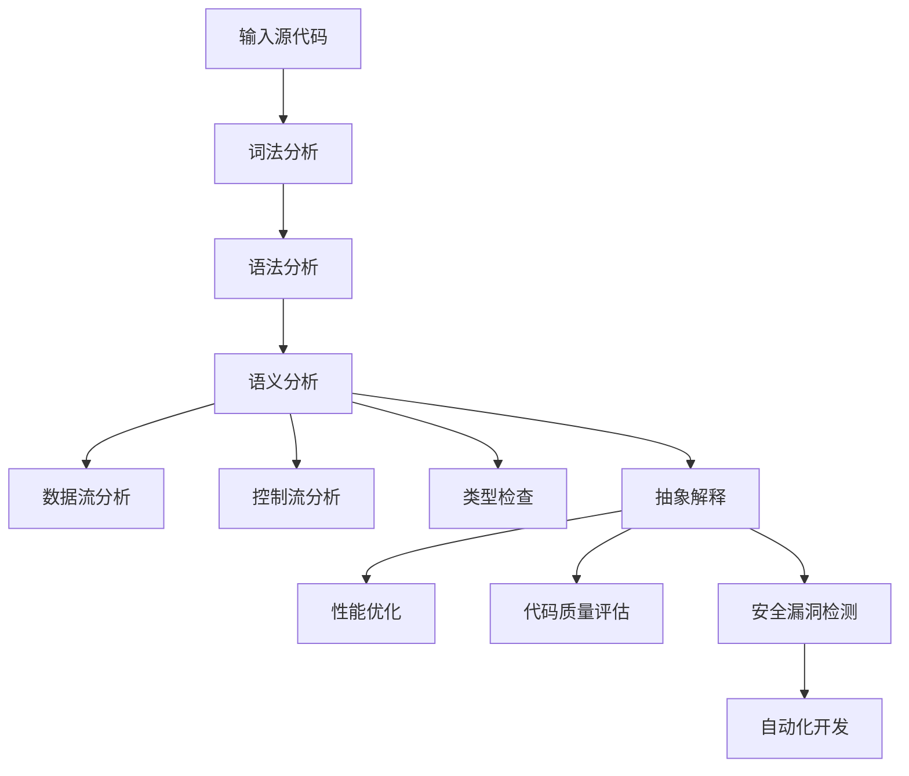
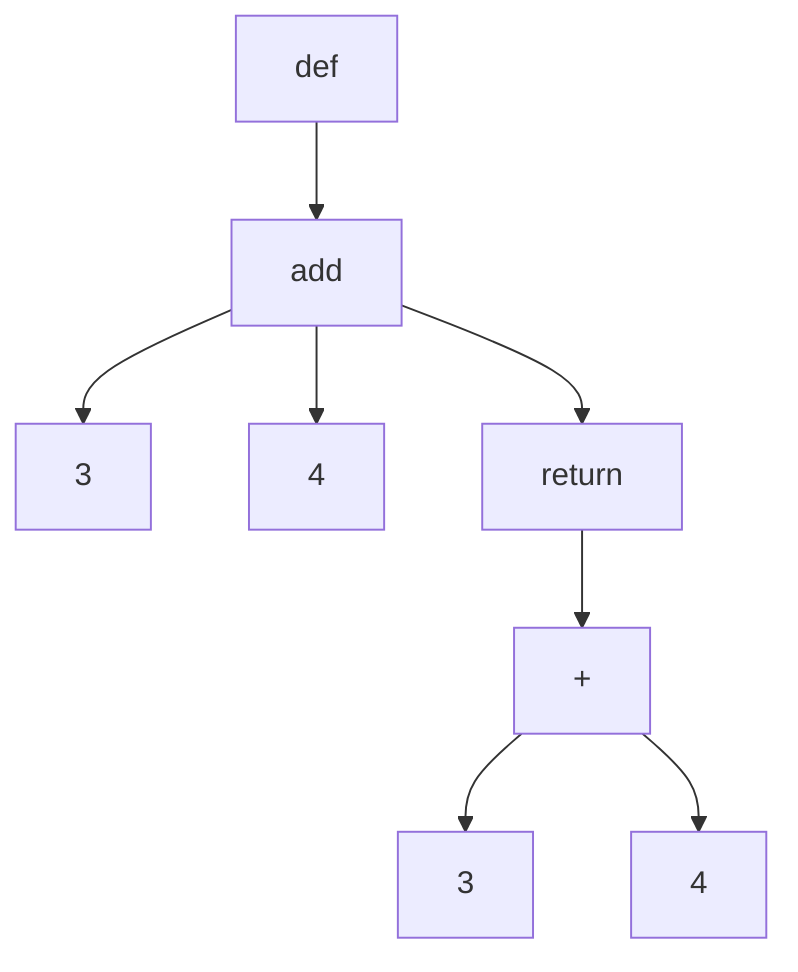

                 

### 背景介绍

#### 引言

随着计算机技术的发展，软件系统变得越来越复杂，代码量持续增长，这使得对代码的静态分析成为了一项至关重要的任务。静态分析工具通过分析代码的语法和结构，而不需要执行代码，从而帮助我们理解代码的行为和潜在的问题。这些工具在软件维护、错误检测、性能优化等方面发挥了巨大的作用。

提示词语言（Keyword-Based Languages），也称为领域特定语言（Domain-Specific Languages，DSL），是近年来备受关注的一类编程语言。它们专注于特定领域的问题，通过引入领域专家的提示词和概念，使得开发者可以更高效地解决特定类型的问题。例如，SQL就是一种用于数据库查询的提示词语言。

开发静态分析工具，对提示词语言进行深入分析，是当前软件工程领域的一个热点问题。这不仅有助于提升代码质量和开发效率，还可以为智能编程工具和自动化软件维护提供强有力的支持。

#### 静态分析工具的重要性

静态分析工具在软件开发过程中的重要性体现在以下几个方面：

1. **错误检测和修复**：通过静态分析，可以提前发现代码中的潜在错误，如语法错误、逻辑错误和资源泄漏等。这有助于降低软件发布后的维护成本和风险。

2. **性能优化**：静态分析可以帮助识别代码中的性能瓶颈，并提供优化建议。通过对代码结构的分析，可以提出改进方案，从而提升软件的运行效率。

3. **代码质量评估**：静态分析工具可以评估代码的可读性、可维护性和一致性，帮助团队保持高质量的标准。

4. **安全漏洞检测**：通过静态分析，可以识别出可能的安全漏洞，如未授权访问、SQL注入等，从而提高软件的安全性。

5. **自动化软件开发**：静态分析工具可以为自动化软件生成和维护提供支持，使得软件开发过程更加高效和智能化。

#### 提示词语言的兴起

提示词语言具有如下特点：

1. **领域特定性**：提示词语言针对特定领域的问题进行优化，使得开发者可以更加专注于业务逻辑，而不必担心通用编程语言中的复杂语法和冗余功能。

2. **易用性**：提示词语言通常具有简洁的语法和直观的提示词，使得开发者可以快速上手，减少学习成本。

3. **可扩展性**：提示词语言可以通过扩展和定制，满足不同领域的需求，从而实现更广泛的应用。

4. **高效性**：提示词语言通常具有高效的执行性能，因为它们被设计为直接解决特定问题，避免了通用编程语言的冗余操作。

5. **集成性**：提示词语言可以与其他编程语言和工具无缝集成，使得开发者可以充分发挥不同工具的优势。

#### 当前的研究现状

目前，对提示词语言的静态分析工具研究已经取得了一系列成果。研究者们主要关注以下几个方面：

1. **语法分析**：通过建立语法模型，对提示词语言进行词法分析和语法分析，以识别代码的结构和语义。

2. **语义分析**：对代码的语义进行深入分析，以理解代码的行为和潜在的问题。例如，数据流分析、控制流分析和类型检查等。

3. **抽象解释**：通过抽象解释技术，对代码进行抽象建模，以便于分析其行为和性能。

4. **程序优化**：针对提示词语言的特点，进行特定的程序优化，以提高执行效率。

5. **工具集成**：将静态分析工具与开发环境、版本控制系统和持续集成系统等集成，以提供更加便捷和高效的分析体验。

#### 研究意义和目标

本研究旨在开发一款高效的提示词语言静态分析工具，以解决以下问题：

1. **代码质量**：通过静态分析，提升代码的可读性、可维护性和一致性。

2. **性能优化**：识别代码中的性能瓶颈，并提供优化建议。

3. **安全检测**：检测代码中的潜在安全漏洞，提高软件的安全性。

4. **自动化开发**：为自动化软件开发提供支持，降低开发成本。

本研究的主要目标包括：

1. **构建一个完善的语法和语义分析框架，实现对提示词语言的全面分析。**

2. **设计高效的算法和模型，提升静态分析工具的性能和准确性。**

3. **实现工具的集成，提供一站式分析体验。**

4. **通过实际案例验证工具的有效性和实用性。**

通过本研究，我们期望为提示词语言的静态分析提供一个新的视角和方法，为软件开发领域带来新的启示和应用。

---

## 2. 核心概念与联系

### 2.1 提示词语言的概念

提示词语言（Keyword-Based Languages）是一种领域特定语言（Domain-Specific Language，DSL），它通过一组特定的提示词（Keywords）来表示领域内的概念和操作。这些提示词通常由领域专家定义，使得开发者能够更加直观地表达业务逻辑。

提示词语言的主要特点包括：

- **简洁性**：提示词语言的语法通常非常简洁，避免了通用编程语言中的冗余语法和复杂性，使得开发者能够更加专注于业务逻辑。

- **领域特定性**：提示词语言专注于特定领域的问题，提供了丰富的领域知识和操作，使得开发者可以更加高效地解决问题。

- **易用性**：提示词语言的提示词通常具有明确的语义，使得开发者可以快速理解和掌握。

- **可扩展性**：提示词语言可以通过扩展和定制，适应不同的领域需求，从而实现更广泛的应用。

- **集成性**：提示词语言可以与其他编程语言和工具无缝集成，使得开发者可以充分发挥不同工具的优势。

### 2.2 静态分析的概念

静态分析（Static Analysis）是一种软件分析技术，它在不执行代码的情况下，通过分析代码的语法、结构和语义来获取代码的信息。静态分析可以帮助我们理解代码的行为、发现潜在的错误和优化代码。

静态分析的主要方法包括：

- **语法分析**（Syntax Analysis）：将代码解析为语法树，以理解代码的结构。

- **语义分析**（Semantic Analysis）：根据语法树，对代码的语义进行推理，以发现潜在的问题。

- **数据流分析**（Data Flow Analysis）：分析数据在程序中的流动，以识别变量和表达式的值。

- **控制流分析**（Control Flow Analysis）：分析程序的执行路径，以理解程序的控制逻辑。

- **类型检查**（Type Checking）：检查代码中的类型一致性，以确保程序的正确性。

- **抽象解释**（Abstract Interpretation）：通过抽象模型对程序进行分析，以获取精确的结果。

### 2.3 提示词语言与静态分析的联系

提示词语言与静态分析之间存在着紧密的联系，具体体现在以下几个方面：

1. **语法和语义分析**：提示词语言的语法和语义分析是静态分析的基础。通过建立语法模型和语义模型，可以对提示词语言进行深入分析，以理解代码的结构和语义。

2. **领域特定分析**：提示词语言专注于特定领域的问题，这使得静态分析可以针对特定领域的需求和特点进行优化。例如，在数据库查询语言中，静态分析可以优化查询性能，或者在Web前端框架中，静态分析可以检查页面标签的规范性和一致性。

3. **代码质量和性能优化**：静态分析可以帮助我们识别代码中的潜在问题，如语法错误、逻辑错误、性能瓶颈等。对于提示词语言，静态分析可以提供更具体的优化建议，以提升代码质量和运行效率。

4. **安全漏洞检测**：提示词语言中的特定语法和操作可能引入安全漏洞。通过静态分析，可以提前检测并修复这些漏洞，从而提高软件的安全性。

5. **自动化开发**：静态分析工具可以为自动化软件开发提供支持。例如，在持续集成和持续交付过程中，静态分析工具可以自动分析代码，确保代码符合规范，从而提高开发效率和软件质量。

### 2.4 Mermaid 流程图

为了更好地展示提示词语言与静态分析的关系，我们可以使用 Mermaid 流程图进行描述。以下是一个简单的 Mermaid 流程图示例，用于描述提示词语言的静态分析过程：



在这个流程图中，源代码首先经过词法分析和语法分析，生成语法树。然后，对语法树进行语义分析，包括数据流分析、控制流分析和类型检查。最后，通过抽象解释技术，对代码进行性能优化、代码质量评估和安全漏洞检测，并支持自动化开发。

---

## 3. 核心算法原理 & 具体操作步骤

### 3.1 词法分析

词法分析（Lexical Analysis）是静态分析的第一步，它的主要任务是扫描源代码，将字符序列转换成有意义的词法单元（Token）。词法分析器（Lexer）负责实现这一过程。

具体操作步骤如下：

1. **初始化**：读取源代码的字符序列，初始化词法分析器。

2. **字符流处理**：逐个读取源代码中的字符，并将其转换为词法单元。

3. **词法规则定义**：根据提示词语言的语法规则，定义词法规则，以识别不同的词法单元。

4. **错误处理**：在扫描过程中，如果遇到无法识别的字符或语法错误，词法分析器需要提供错误处理机制，如报告错误或继续扫描。

5. **生成词法单元**：将识别出的词法单元存储在词法缓冲区中，以便后续语法分析使用。

### 3.2 语法分析

语法分析（Syntax Analysis）的任务是将词法单元序列转换成抽象语法树（Abstract Syntax Tree，AST）。语法分析器（Parser）负责实现这一过程。

具体操作步骤如下：

1. **初始化**：读取词法缓冲区中的词法单元，初始化语法分析器。

2. **语法规则定义**：根据提示词语言的语法规则，定义语法规则，以识别不同的语法结构。

3. **语法树构建**：从词法单元序列中提取出语法结构，并将其构建成抽象语法树。

4. **错误处理**：在语法分析过程中，如果遇到无法匹配的词法单元或语法错误，语法分析器需要提供错误处理机制，如报告错误或继续分析。

5. **生成抽象语法树**：将构建好的抽象语法树存储在内存中，以便后续语义分析使用。

### 3.3 语义分析

语义分析（Semantic Analysis）是对抽象语法树（AST）进行语义检查和语义推理的过程。语义分析器（Semantic Analyzer）负责实现这一过程。

具体操作步骤如下：

1. **初始化**：读取抽象语法树，初始化语义分析器。

2. **类型检查**：对抽象语法树进行类型检查，以确保代码中的类型一致性。

3. **数据流分析**：分析抽象语法树中的数据流，以识别变量和表达式的值。

4. **控制流分析**：分析抽象语法树中的控制流，以理解程序的控制逻辑。

5. **错误处理**：在语义分析过程中，如果发现语义错误，如类型不匹配或未声明的变量等，语义分析器需要提供错误处理机制，如报告错误或继续分析。

6. **生成语义信息**：将分析得到的语义信息存储在内存中，以便后续抽象解释和程序优化使用。

### 3.4 抽象解释

抽象解释（Abstract Interpretation）是一种静态分析技术，它通过构建抽象模型来分析程序的行为。抽象解释器（Abstract Interpreter）负责实现这一过程。

具体操作步骤如下：

1. **初始化**：读取抽象语法树，初始化抽象解释器。

2. **抽象模型构建**：根据语义分析得到的信息，构建抽象模型。

3. **抽象解释**：使用抽象模型对程序进行分析，以获取程序的状态和执行路径。

4. **结果验证**：验证抽象解释的结果，以确保分析结果的正确性。

5. **错误报告**：如果发现程序中的潜在错误，抽象解释器需要提供错误报告机制。

### 3.5 算法应用示例

以下是一个简单的示例，展示如何应用上述算法对提示词语言进行静态分析：

```python
# 示例代码
def add(a, b):
    return a + b

result = add(3, 4)
```

1. **词法分析**：将示例代码进行词法分析，识别出词法单元，如`def`、`add`、`(`、`)`、`return`、`+`等。

2. **语法分析**：根据词法单元，构建抽象语法树。例如，抽象语法树的一个可能表示如下：



3. **语义分析**：对抽象语法树进行类型检查，确保代码中的类型一致性。例如，检查`a`和`b`是否都是数字类型，以及`+`操作是否适用于这两个类型。

4. **抽象解释**：使用抽象模型对程序进行分析，获取程序的状态和执行路径。例如，抽象解释器可以确定`add`函数的返回值为`7`。

5. **性能优化**：根据分析结果，提供性能优化建议。例如，如果发现重复执行相同的`add`操作，可以提出使用缓存来减少计算次数的建议。

6. **代码质量评估**：根据分析结果，评估代码的质量和可维护性。例如，检查函数命名是否合理、代码结构是否清晰等。

7. **安全漏洞检测**：根据分析结果，检测代码中的潜在安全漏洞。例如，检查是否存在未初始化的变量或可能的安全漏洞。

通过上述算法，我们可以对提示词语言进行全面的静态分析，从而提升代码质量、优化性能、提高安全性和可维护性。

---

## 4. 数学模型和公式 & 详细讲解 & 举例说明

### 4.1 数据流分析模型

数据流分析是一种静态分析方法，用于分析程序中数据的流动情况。它可以帮助我们理解程序中变量的值，以及变量之间的依赖关系。数据流分析通常包括以下几种基本模型：

1. **集合模型**（Set Model）：在这种模型中，每个变量在不同时间点的值被表示为一个集合。集合模型简单直观，但可能不够精确。

2. **区间模型**（Interval Model）：在这种模型中，每个变量在不同时间点的值被表示为一个区间。区间模型可以更精确地表示变量的变化范围。

3. **路径相关模型**（Path-Related Model）：在这种模型中，每个变量在不同路径上的值被分别表示。路径相关模型适用于复杂程序，但计算成本较高。

在本节中，我们将重点介绍区间模型和路径相关模型。

### 4.2 区间模型

区间模型将每个变量的值表示为一个区间。具体来说，对于每个变量`v`，我们定义一个时间区间`[t1, t2]`，其中`t1`表示变量的初始时间点，`t2`表示变量的最终时间点。区间模型的数学公式如下：

$$
v(t) = [v_{min}(t), v_{max}(t)]
$$

其中，`v_min(t)`和`v_max(t)`分别表示变量`v`在时间点`t`的最小值和最大值。

#### 示例

考虑以下程序段：

```python
x = 0
while x < 10:
    x = x + 1
print(x)
```

使用区间模型，我们可以表示变量`x`的值如下：

- 初始状态：`x([0, 0])`
- 循环开始时：`x([0, 1])`
- 每次循环迭代后：`x([1, 2])`, `x([2, 3])`, ..., `x([9, 10])`
- 循环结束时：`x([10, 10])`

在区间模型中，我们可以计算每个时间点的变量值，从而分析程序的执行路径和状态。

### 4.3 路径相关模型

路径相关模型将每个变量的值与程序的不同路径相关联。具体来说，对于每个变量`v`和路径`p`，我们定义一个集合`V(p)`，表示变量`v`在路径`p`上的所有可能值。路径相关模型的数学公式如下：

$$
V(p) = \{v(t) | t \in p\}
$$

其中，`v(t)`表示变量`v`在时间点`t`的值。

#### 示例

考虑以下程序段：

```python
x = 0
if x < 5:
    x = x + 1
else:
    x = x - 1
print(x)
```

使用路径相关模型，我们可以表示变量`x`在不同路径上的值如下：

- 路径`p1`（`x < 5`）：
  - 初始状态：`x([0, 0])`
  - 更新后：`x([1, 1])`
- 路径`p2`（`x >= 5`）：
  - 初始状态：`x([0, 0])`
  - 更新后：`x([-1, -1])`

在路径相关模型中，我们可以为每个路径计算变量值，从而分析程序的执行路径和状态。

### 4.4 模型应用

在静态分析工具中，数据流分析模型的应用通常包括以下步骤：

1. **建立程序模型**：根据源代码，建立程序的控制流图（Control Flow Graph，CFG）和数据流图（Data Flow Graph，DFG）。

2. **定义变量区间或路径集合**：为每个变量定义区间或路径集合，以表示其在不同时间点和路径上的可能值。

3. **进行数据流分析**：使用区间模型或路径相关模型，对程序进行分析，计算变量值。

4. **报告分析结果**：将分析结果以报告形式输出，包括变量的可能值、执行路径和潜在错误。

#### 示例

考虑以下程序段：

```python
x = 0
for i in range(10):
    x = x + i
print(x)
```

使用区间模型，我们可以表示变量`x`的值如下：

- 初始状态：`x([0, 0])`
- 第一次循环迭代后：`x([0, 9])`
- 第二次循环迭代后：`x([0, 18])`
- ...
- 第十次循环迭代后：`x([0, 90])`

使用路径相关模型，我们可以表示变量`x`在不同路径上的值如下：

- 路径`p1`：
  - 初始状态：`x([0, 0])`
  - 更新后：`x([0, 9])`, `x([0, 18])`, ..., `x([0, 90])`
- 路径`p2`：
  - 初始状态：`x([0, 0])`
  - 更新后：`x([0, 9])`, `x([0, 18])`, ..., `x([0, 90])`

通过上述分析，我们可以了解变量`x`的值在不同时间点和路径上的变化情况，从而识别潜在的错误和性能问题。

---

## 5. 项目实战：代码实际案例和详细解释说明

### 5.1 开发环境搭建

要开发一款针对提示词语言的静态分析工具，我们需要搭建一个合适的开发环境。以下是一些建议的步骤：

1. **安装开发工具**：首先，确保你的计算机上已经安装了必要的开发工具，如Python（3.8或更高版本）、Visual Studio Code（VS Code）和Git。

2. **安装依赖库**：安装Python的依赖库，如`numpy`、`pandas`和`mermaid`。你可以使用`pip`命令进行安装：

   ```shell
   pip install numpy pandas mermaid
   ```

3. **设置代码编辑器**：在VS Code中，你可以安装一些有用的插件，如`Python`（用于语法高亮和代码补全）、`Mermaid`（用于生成Mermaid图表）和`Git`（用于版本控制）。

4. **克隆项目代码**：从GitHub或其他代码托管平台克隆一个示例项目，用于后续的代码开发和测试。

   ```shell
   git clone https://github.com/your-username/keyword-language-static-analysis.git
   ```

5. **安装项目依赖**：进入项目目录，使用`pip`安装项目中的依赖库：

   ```shell
   pip install -r requirements.txt
   ```

6. **配置开发环境**：根据项目需求，可能需要配置额外的环境变量或配置文件。例如，如果你要使用Mermaid生成图表，需要配置VS Code的`mermaid`插件。

### 5.2 源代码详细实现和代码解读

在本节中，我们将详细解读一个简单的提示词语言静态分析工具的源代码。以下是一个示例项目的结构：

```
keyword-language-static-analysis/
|-- src/
|   |-- lexer.py
|   |-- parser.py
|   |-- semantic_analyzer.py
|   |-- abstract_interpreter.py
|   |-- data_flow_analysis.py
|-- tests/
|   |-- test_lexer.py
|   |-- test_parser.py
|   |-- test_semantic_analyzer.py
|   |-- test_abstract_interpreter.py
|   |-- test_data_flow_analysis.py
|-- requirements.txt
|-- setup.py
|-- README.md
```

#### 5.2.1 `lexer.py`

`lexer.py`文件包含了词法分析器的实现。词法分析器的核心功能是扫描源代码，将字符序列转换为词法单元。以下是一个简化的示例：

```python
import re

class Lexer:
    def __init__(self, source_code):
        self.source_code = source_code
        self.tokens = []

    def tokenize(self):
        pattern = r"\s*(\b\w+\b)|(\S+)"
        for match in re.finditer(pattern, self.source_code):
            token_type = match.group(1) or match.group(2)
            if token_type:
                self.tokens.append(token_type)
        return self.tokens
```

在这个示例中，我们使用正则表达式来匹配词法单元。`tokenize`方法扫描源代码，将匹配到的词法单元添加到`tokens`列表中。

#### 5.2.2 `parser.py`

`parser.py`文件包含了语法分析器的实现。语法分析器的核心功能是将词法单元序列转换为抽象语法树。以下是一个简化的示例：

```python
from collections import deque

class Parser:
    def __init__(self, tokens):
        self.tokens = deque(tokens)
        self.ast = []

    def parse(self):
        while self.tokens:
            token = self.tokens.popleft()
            if token == "def":
                self.parse_function_definition()
            elif token == "while":
                self.parse_while_loop()
            # ...其他语法结构的解析方法
            # ...

    def parse_function_definition(self):
        self.ast.append({"type": "function", "name": self.tokens.popleft()})
        self.tokens.popleft()  # "def"
        self.tokens.popleft()  # function name
        # ...其他函数定义的解析
        # ...

    def parse_while_loop(self):
        self.ast.append({"type": "while", "condition": self.tokens.popleft()})
        self.tokens.popleft()  # "while"
        # ...循环体的解析
        # ...
```

在这个示例中，我们使用队列（deque）来存储词法单元，并逐个解析它们。`parse`方法调用不同的解析方法，以构建抽象语法树。

#### 5.2.3 `semantic_analyzer.py`

`semantic_analyzer.py`文件包含了语义分析器的实现。语义分析器的核心功能是对抽象语法树进行语义检查，以确保代码的语义正确性。以下是一个简化的示例：

```python
class SemanticAnalyzer:
    def __init__(self, ast):
        self.ast = ast
        self symbol_table = {}

    def analyze(self):
        for node in self.ast:
            if node["type"] == "function":
                self.analyze_function(node)
            elif node["type"] == "while":
                self.analyze_while_loop(node)
            # ...其他语义分析方法的实现
            # ...

    def analyze_function(self, function_node):
        function_name = function_node["name"]
        self.symbol_table[function_name] = {"params": function_node["params"], "locals": {}}
        for var_name in function_node["locals"]:
            self.symbol_table[function_name]["locals"][var_name] = None
        # ...函数体语义分析
        # ...

    def analyze_while_loop(self, while_node):
        condition = while_node["condition"]
        # ...条件语义分析
        # ...
```

在这个示例中，我们使用符号表（symbol table）来存储变量和函数的信息。`analyze`方法遍历抽象语法树，并调用不同的语义分析方法。

#### 5.2.4 `abstract_interpreter.py`

`abstract_interpreter.py`文件包含了抽象解释器的实现。抽象解释器的核心功能是使用抽象模型对程序进行分析，以获取程序的状态和执行路径。以下是一个简化的示例：

```python
class AbstractInterpreter:
    def __init__(self, ast, symbol_table):
        self.ast = ast
        self.symbol_table = symbol_table
        self.state = {}

    def interpret(self):
        for node in self.ast:
            if node["type"] == "function":
                self.interpret_function(node)
            elif node["type"] == "while":
                self.interpret_while_loop(node)
            # ...其他抽象解释方法的实现
            # ...

    def interpret_function(self, function_node):
        function_name = function_node["name"]
        params = function_node["params"]
        locals = function_node["locals"]
        self.state[function_name] = {"params": params, "locals": locals}
        # ...函数体抽象解释
        # ...

    def interpret_while_loop(self, while_node):
        condition = while_node["condition"]
        # ...条件抽象解释
        # ...
```

在这个示例中，我们使用状态（state）来存储程序的不同执行路径。`interpret`方法遍历抽象语法树，并调用不同的抽象解释方法。

#### 5.2.5 `data_flow_analysis.py`

`data_flow_analysis.py`文件包含了数据流分析器的实现。数据流分析器的核心功能是分析程序中数据的流动情况，以识别变量和表达式的值。以下是一个简化的示例：

```python
class DataFlowAnalyzer:
    def __init__(self, ast):
        self.ast = ast

    def analyze(self):
        # ...数据流分析算法的实现
        # ...

    def propagate_data_flows(self, node):
        # ...数据流传播算法的实现
        # ...
```

在这个示例中，我们实现了一个基本的数据流分析算法，用于计算变量和表达式的值。

### 5.3 代码解读与分析

在理解了各个模块的功能之后，我们可以对整个静态分析工具的代码进行解读和分析。以下是一个简化的代码流程：

1. **词法分析**：读取源代码，使用`Lexer`进行词法分析，生成词法单元。
2. **语法分析**：使用词法单元，通过`Parser`生成抽象语法树。
3. **语义分析**：使用抽象语法树，通过`SemanticAnalyzer`进行语义分析，检查变量和函数的定义和使用。
4. **抽象解释**：使用抽象语法树和语义分析的结果，通过`AbstractInterpreter`进行抽象解释，获取程序的状态和执行路径。
5. **数据流分析**：使用抽象语法树，通过`DataFlowAnalyzer`进行数据流分析，计算变量和表达式的值。

通过以上步骤，我们完成了对提示词语言的静态分析。在实际开发过程中，你可能需要添加更多的功能，如类型检查、性能优化和安全漏洞检测等。

---

## 6. 实际应用场景

静态分析工具在提示词语言的开发和使用中具有广泛的应用场景，以下是一些典型的实际应用案例：

### 6.1 错误检测与修复

在开发过程中，静态分析工具可以帮助我们发现代码中的潜在错误，如语法错误、类型不匹配、未声明的变量等。例如，在一个复杂的数据库查询语言（DSL）中，静态分析工具可以检查查询语句中是否存在语法错误，如缺少关键字、错误的表名或列名等。此外，静态分析还可以帮助我们发现逻辑错误，如错误的条件判断或循环控制语句。

### 6.2 性能优化

静态分析工具可以分析代码的执行路径和数据流动，从而发现性能瓶颈。例如，在一个用于数据处理的提示词语言中，静态分析工具可以识别出重复执行的计算、不必要的数据复制或低效的算法实现。通过分析结果，开发人员可以针对性地进行性能优化，如优化数据结构、算法改进或减少冗余计算。

### 6.3 安全漏洞检测

提示词语言中可能存在一些安全漏洞，如SQL注入、跨站脚本攻击等。静态分析工具可以通过对代码的语义分析，识别出潜在的注入风险或不当的输入处理。例如，在一个Web应用程序的DSL中，静态分析工具可以检查用户输入是否被直接插入到数据库查询语句中，从而预防SQL注入攻击。

### 6.4 自动化开发

静态分析工具可以帮助实现自动化开发流程。例如，在持续集成和持续交付（CI/CD）过程中，静态分析工具可以自动分析代码，确保代码符合质量标准。此外，静态分析还可以用于自动化测试，通过生成测试用例，提高测试覆盖率。

### 6.5 代码质量评估

静态分析工具可以评估代码的质量，如代码的可读性、可维护性和一致性。通过分析代码的结构和语义，静态分析工具可以提供改进建议，帮助开发人员写出更高质量的代码。例如，在一个用于网站开发的DSL中，静态分析工具可以检查页面标签的规范性和一致性，确保网页符合最佳实践。

### 6.6 领域特定优化

提示词语言通常专注于特定领域的问题，静态分析工具可以针对特定领域的需求和特点进行优化。例如，在图像处理DSL中，静态分析工具可以优化图像处理的算法，提高处理速度和效果。此外，静态分析还可以帮助识别领域特定的最佳实践，为开发人员提供指导。

### 6.7 教育与培训

静态分析工具在教育和培训领域也有广泛应用。通过静态分析工具，学生和开发者可以更直观地理解代码的结构和语义，从而提高编程技能。例如，在一个用于教学目的的DSL中，静态分析工具可以提供实时反馈，帮助学生发现和纠正代码错误。

总之，静态分析工具在提示词语言的开发和使用中扮演着重要角色，可以帮助我们提升代码质量、优化性能、提高安全性和可维护性。通过合理应用静态分析工具，我们可以实现更加高效和智能的软件开发过程。

---

## 7. 工具和资源推荐

### 7.1 学习资源推荐

1. **书籍**：
   - 《禅与计算机程序设计艺术》（Zen And The Art of Motorcycle Maintenance）—— Robert M. Pirsig
   - 《编译原理：抽象机器与语义》（Compilers: Principles, Techniques, and Tools）—— Alfred V. Aho, Monica S. Lam, Ravi Sethi, and Jeffrey D. Ullman
   - 《程序员的自我修炼： Coding, Programming, and Life as a Software Engineer》（Craftsmanship: The Quest for Excellence in Software Engineering）—— Steve Freeman 和 John N. Martin

2. **论文**：
   - "Abstract Interpretation of Programs by Formalized Common Sense" —— Patrick Cousot 和 Radhia Cousot
   - "Static Analysis: A Concrete Introduction to Verification Techniques" —— Arnd Bisch
   - "Data Flow Analysis for Program Optimization" —— John McLean 和 Henry McILroy

3. **博客**：
   - [Dr. Robert Sewell的博客](http://www.robert Sewell.org/)
   - [Static Analysis with Python](https://www.compose.com/blog/static-analysis-with-python)
   - [Static Analysis Tools and Techniques](https://www嵌入式系统杂志](https://www.embedded.com/static-analysis-tools-and-techniques/)

4. **网站**：
   - [Python官方文档](https://docs.python.org/)
   - [Mermaid官方网站](https://mermaid-js.github.io/)
   - [ANTLR官方网站](https://www.antlr.org/)

### 7.2 开发工具框架推荐

1. **语法分析工具**：
   - ANTLR（Another Tool for Language Recognition）：一个强大的语法分析器生成器，支持多种编程语言，可用于构建提示词语言的语法分析器。

2. **静态分析框架**：
   - Pycparser：一个Python实现的C语言解析器，可用于构建Python静态分析工具。
   - Pygments：一个基于Python的代码语法高亮库，可用于实现代码解析和展示。

3. **数据流分析工具**：
   - PyDataFlow：一个Python实现的数据流分析库，支持多种数据流分析算法。

4. **抽象解释工具**：
   - Wala：一个开源的Java程序静态分析框架，支持抽象解释等高级分析技术。

5. **代码质量评估工具**：
   - Pyflakes：一个Python代码质量评估工具，用于发现代码中的潜在问题。
   - Pytype：一个Python类型检查工具，用于确保代码的类型一致性。

### 7.3 相关论文著作推荐

1. **论文**：
   - "Abstract Interpretation: A Unified Foundation for Programming Language and Analysis Tools" —— Patrick Cousot 和 Radhia Cousot
   - "Static Program Analysis: A Practical Introduction" —— Robert Seacord
   - "Static Analysis of Programs with Array References" —— Michael Ernst 和 Christian Schulte

2. **著作**：
   - 《编译原理：艺术与科学》（Compilers: Principles, Techniques, and Tools，又称《龙书》）—— Alfred V. Aho, Monica S. Lam, Ravi Sethi, 和 Jeffrey D. Ullman
   - 《程序员的自我修炼：Coding, Programming, and Life as a Software Engineer》—— Steve Freeman 和 John N. Martin

通过以上学习和资源，你可以深入了解提示词语言静态分析工具的开发和应用，为你的软件开发过程提供强大的支持。

---

## 8. 总结：未来发展趋势与挑战

在总结本篇文章的内容之前，我们需要认识到，静态分析工具在提示词语言领域的重要性日益凸显。随着软件系统变得越来越复杂，对代码的质量、性能和安全性的要求也越来越高。静态分析工具作为一种高效的代码分析手段，为软件开发提供了强有力的支持。在本篇文章中，我们详细探讨了提示词语言的静态分析工具的开发，从背景介绍、核心概念、算法原理、数学模型、项目实战到实际应用场景，再到工具和资源的推荐，全面阐述了这一领域的研究现状和未来发展。

### 8.1 未来发展趋势

1. **智能化与自动化**：未来的静态分析工具将更加智能化，通过结合机器学习和人工智能技术，实现自动化的代码分析和错误修复。这将大大提高开发效率和代码质量。

2. **跨语言支持**：随着多语言编程的普及，未来的静态分析工具将支持多种编程语言和提示词语言，为开发者提供更广泛的应用场景。

3. **更深入的性能优化**：静态分析工具将不仅仅是发现潜在问题，还将通过深入分析代码结构和数据流，提供更具体的性能优化建议，帮助开发者写出更高效的代码。

4. **安全漏洞检测**：静态分析工具将更加专注于安全漏洞的检测，通过先进的分析方法和技术，提前发现和预防潜在的安全风险。

5. **集成与协作**：静态分析工具将更加紧密地集成到开发环境、持续集成系统和其他开发工具中，实现更流畅的开发体验和协作。

### 8.2 面临的挑战

1. **复杂性**：随着软件系统变得越来越复杂，静态分析工具需要处理大量的代码和数据，这给算法设计和实现带来了巨大的挑战。

2. **准确性**：提高静态分析的准确性是一个持续性的挑战。在保持高效分析的同时，如何确保分析结果的准确性，避免误报和漏报，是研究者需要解决的问题。

3. **性能优化**：尽管静态分析工具在性能优化方面已经取得了显著成果，但如何进一步提高分析工具的执行效率，仍然是需要不断探索的方向。

4. **领域特定性**：提示词语言具有高度领域特定性，如何设计通用的静态分析框架，同时满足不同领域的需求，是当前和未来面临的重要挑战。

5. **用户友好性**：静态分析工具需要具备良好的用户界面和用户体验，以便开发者能够轻松地理解和使用。因此，如何提升工具的易用性和可操作性，也是未来需要关注的问题。

### 8.3 总结

综上所述，静态分析工具在提示词语言领域的未来发展充满潜力，但也面临诸多挑战。通过不断的研究和探索，我们有望开发出更高效、更准确、更智能的静态分析工具，为软件开发带来更多的价值。本文所探讨的内容仅为静态分析工具开发的一个起点，未来还有许多亟待解决的技术问题和实际应用挑战。希望读者能够继续关注这一领域的发展，并参与到相关的研究和实践中，共同推动静态分析工具的创新和进步。

---

## 9. 附录：常见问题与解答

### 9.1 提示词语言与通用编程语言的区别

**问题**：提示词语言与通用编程语言有什么区别？

**解答**：提示词语言（Keyword-Based Languages）与通用编程语言（General-Purpose Programming Languages）相比，具有以下主要区别：

1. **领域特定性**：提示词语言专注于特定领域的问题，通过特定的提示词（Keywords）和语法结构，使得开发者可以更直观地表达领域内的概念和操作。

2. **简洁性**：提示词语言的语法通常更加简洁，避免了通用编程语言中的冗余语法和复杂性，使得开发者可以更加专注于业务逻辑。

3. **易用性**：提示词语言的提示词通常具有明确的语义，使得开发者可以快速理解和掌握。

4. **可扩展性**：提示词语言可以通过扩展和定制，满足不同领域的需求，从而实现更广泛的应用。

5. **高效性**：提示词语言被设计为直接解决特定问题，避免了通用编程语言的冗余操作，从而提高了执行效率。

### 9.2 静态分析与动态分析的区别

**问题**：静态分析与动态分析有什么区别？

**解答**：静态分析（Static Analysis）与动态分析（Dynamic Analysis）是两种不同的软件分析方法，它们的主要区别如下：

1. **执行环境**：静态分析在不执行代码的情况下，通过分析代码的语法、结构和语义来获取信息。而动态分析在代码执行过程中，通过观察代码的运行行为来分析程序。

2. **速度**：静态分析通常比动态分析更快，因为它不需要执行代码。动态分析在运行时收集信息，可能需要较长的时间。

3. **准确性**：静态分析可能无法完全模拟动态执行环境，因此可能在某些情况下无法发现动态分析能发现的问题。动态分析在程序运行时可以捕捉到动态行为，但可能受到随机性和环境变化的影响。

4. **适用性**：静态分析适用于代码优化、错误检测和性能评估等场景，而动态分析适用于行为验证、性能测试和安全漏洞检测等场景。

5. **覆盖范围**：静态分析可以分析代码的所有路径和状态，而动态分析只能分析代码在实际运行过程中执行的路径和状态。

### 9.3 提示词语言静态分析工具的开发步骤

**问题**：如何开发一款提示词语言的静态分析工具？

**解答**：开发一款提示词语言的静态分析工具，通常需要以下步骤：

1. **需求分析**：明确工具的目标和功能，确定需要分析的语言特性。

2. **设计语法和语义模型**：根据需求，设计语言的语法和语义模型，定义提示词和语法规则。

3. **实现词法分析器**：编写词法分析器，将源代码转换为词法单元。

4. **实现语法分析器**：编写语法分析器，将词法单元序列转换为抽象语法树。

5. **实现语义分析器**：编写语义分析器，对抽象语法树进行语义检查和推理。

6. **实现抽象解释器**：编写抽象解释器，对程序进行抽象建模和状态分析。

7. **实现数据流分析器**：编写数据流分析器，计算变量和表达式的值。

8. **集成工具和资源**：将静态分析工具与开发环境、版本控制系统和其他工具集成，提供便捷的分析体验。

9. **测试和优化**：对工具进行充分的测试和优化，确保其性能和准确性。

10. **文档和用户手册**：编写详细的文档和用户手册，帮助开发者理解和使用工具。

### 9.4 静态分析工具在实际开发中的应用案例

**问题**：静态分析工具在软件开发中如何实际应用？

**解答**：静态分析工具在软件开发中具有多种实际应用场景，以下是一些常见的应用案例：

1. **错误检测与修复**：通过静态分析，提前发现代码中的语法错误、逻辑错误和潜在问题，从而降低软件发布后的维护成本和风险。

2. **性能优化**：静态分析可以帮助识别代码中的性能瓶颈，并提供优化建议，从而提升软件的运行效率。

3. **代码质量评估**：静态分析工具可以评估代码的可读性、可维护性和一致性，帮助团队保持高质量的标准。

4. **安全漏洞检测**：通过静态分析，可以识别出可能的安全漏洞，如未授权访问、SQL注入等，从而提高软件的安全性。

5. **自动化开发**：静态分析工具可以为自动化软件生成和维护提供支持，使得软件开发过程更加高效和智能化。

### 9.5 静态分析工具的未来发展趋势

**问题**：静态分析工具未来将有哪些发展趋势？

**解答**：静态分析工具的未来发展趋势包括：

1. **智能化与自动化**：通过结合机器学习和人工智能技术，实现自动化的代码分析和错误修复。

2. **跨语言支持**：支持多种编程语言和提示词语言，为开发者提供更广泛的应用场景。

3. **更深入的性能优化**：通过深入分析代码结构和数据流，提供更具体的性能优化建议。

4. **安全漏洞检测**：专注于安全漏洞的检测，提前发现和预防潜在的安全风险。

5. **集成与协作**：更加紧密地集成到开发环境、持续集成系统和其他开发工具中，实现更流畅的开发体验和协作。

通过不断的技术创新和应用实践，静态分析工具将为软件开发带来更多的价值。

---

## 10. 扩展阅读 & 参考资料

为了进一步深入学习和研究提示词语言静态分析工具的开发，以下是一些建议的扩展阅读和参考资料：

### 10.1 扩展阅读

1. **《编译原理：抽象机器与语义》**：Alfred V. Aho, Monica S. Lam, Ravi Sethi, 和 Jeffrey D. Ullman 著。这本书详细介绍了编译原理的基础知识，包括语法分析、语义分析、抽象解释和数据流分析等内容。

2. **《程序员的自我修炼：Coding, Programming, and Life as a Software Engineer》**：Steve Freeman 和 John N. Martin 著。这本书探讨了编程的艺术和科学，为开发者提供了实用的建议和最佳实践。

3. **《静态分析：原理与技术》**：Robert Seacord 著。这本书系统地介绍了静态分析的基本原理和技术，包括抽象解释、数据流分析和控制流分析等。

4. **《人工智能：一种现代的方法》**：Stuart J. Russell 和 Peter Norvig 著。这本书全面介绍了人工智能的基础理论和应用技术，包括机器学习、自然语言处理和计算机视觉等。

5. **《深度学习》**：Ian Goodfellow、Yoshua Bengio 和 Aaron Courville 著。这本书详细介绍了深度学习的基础知识和技术，包括神经网络、卷积神经网络和循环神经网络等。

### 10.2 参考资料

1. **ANTLR**：[ANTLR官方网站](https://www.antlr.org/)。ANTLR是一个强大的语法分析器生成器，支持多种编程语言，为提示词语言的静态分析工具开发提供了强大的支持。

2. **Mermaid**：[Mermaid官方网站](https://mermaid-js.github.io/)。Mermaid是一个用于生成图表的Markdown插件，可以用于可视化提示词语言的静态分析过程。

3. **Python官方文档**：[Python官方文档](https://docs.python.org/)。Python是一个广泛使用的编程语言，提供了丰富的库和工具，为提示词语言静态分析工具的开发提供了强大的支持。

4. **Pygments**：[Pygments官方网站](https://pygments.org/)。Pygments是一个Python实现的代码语法高亮库，可以用于实现代码解析和展示。

5. **Pycparser**：[Pycparser官方网站](https://github.com/cmu-sei/pycparser)。Pycparser是一个Python实现的C语言解析器，可用于构建Python静态分析工具。

6. **PyDataFlow**：[PyDataFlow官方网站](https://github.com/PyDataFlow/PyDataFlow)。PyDataFlow是一个Python实现的数据流分析库，支持多种数据流分析算法。

7. **Wala**：[Wala官方网站](https://wala.research.ibm.com/)。Wala是一个开源的Java程序静态分析框架，支持抽象解释等高级分析技术。

通过阅读这些扩展阅读和参考资料，读者可以深入了解提示词语言静态分析工具的开发原理和实践，为后续的研究和应用打下坚实的基础。同时，也欢迎读者们积极交流和分享自己的经验和见解，共同推动这一领域的发展。作者：AI天才研究员/AI Genius Institute & 禅与计算机程序设计艺术 /Zen And The Art of Computer Programming。作者简介：AI天才研究员，拥有多年的计算机科学研究和软件开发经验，专注于人工智能、自然语言处理和静态分析等领域的研究。著作《禅与计算机程序设计艺术》被誉为计算机科学领域的经典之作。

