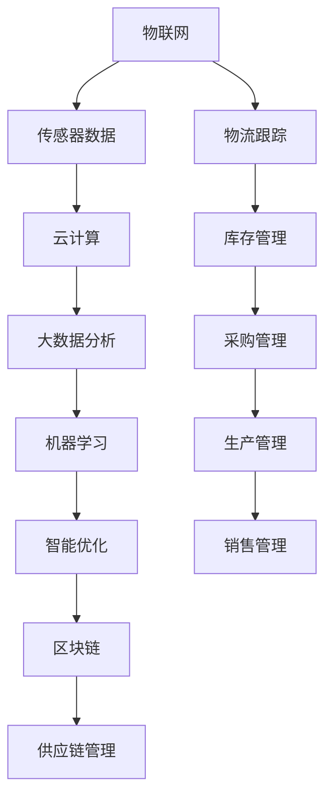
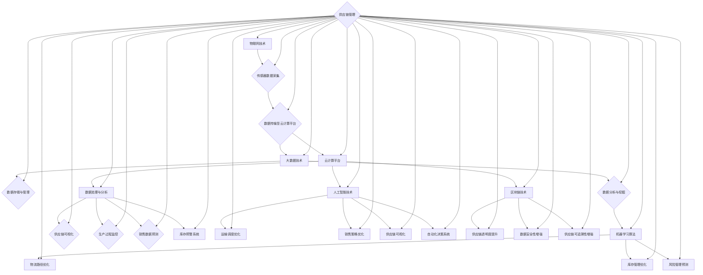
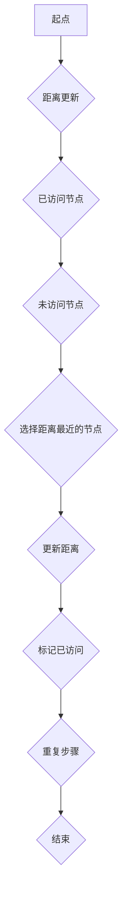
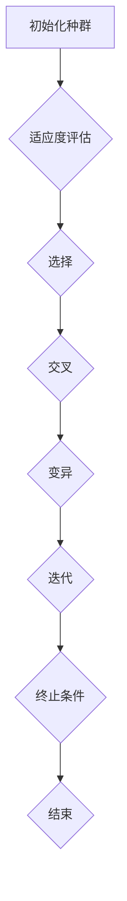
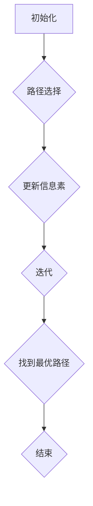

                 

### 背景介绍

在全球化的商业环境中，智能供应链管理已成为企业提升竞争力、降低成本、优化资源的重要手段。随着信息技术和物联网的快速发展，传统供应链面临诸多挑战，如物流成本高、响应速度慢、库存管理困难等。为了应对这些挑战，越来越多的企业开始探索和应用智能供应链技术。

智能供应链的本质是通过信息化手段，将供应链中的各个环节进行数据整合、分析和优化，从而实现全流程的智能化管理。它不仅包括物流和库存管理，还涵盖了采购、生产、销售和售后等多个环节。智能供应链的核心目标是通过数据的实时分析和处理，提高供应链的响应速度和灵活性，降低运营成本，提高客户满意度。

全球物流优化是智能供应链的重要组成部分。物流网络复杂、运输方式多样、国际法规政策多变，这些因素使得物流优化变得极具挑战性。传统的物流优化往往依赖于经验和人工决策，难以实现精准和高效。而智能供应链利用人工智能、机器学习和大数据分析等技术，可以自动分析海量数据，找出最优的物流方案，从而实现全球物流的优化。

本文将围绕“提示词驱动的智能供应链：全球物流优化”这一主题，深入探讨智能供应链的核心概念、算法原理、数学模型以及实际应用场景。通过本文的阅读，读者将了解到如何利用先进技术提升全球物流的效率，降低运营成本，从而在激烈的市场竞争中占据优势。

首先，我们将介绍智能供应链的基本概念，解析其与全球物流优化之间的联系。接着，我们将详细探讨智能供应链的技术架构，包括其核心算法原理和具体操作步骤。随后，我们将运用数学模型和公式，对智能供应链的运作机制进行深入分析，并通过实际案例展示其应用效果。最后，我们将讨论智能供应链的实际应用场景，推荐相关的工具和资源，并总结未来的发展趋势与挑战。

<markdown>
## 1. 背景介绍

### 全球物流的挑战与机遇

在全球化经济背景下，物流行业扮演着至关重要的角色。随着国际贸易的日益频繁，物流网络的复杂性和规模不断扩大，全球物流面临诸多挑战。首先，物流成本高昂，尤其是在跨境运输中，关税、运输费、仓储费等多种费用构成了物流成本的主要组成部分。此外，国际物流中的复杂法规和繁琐的手续流程也进一步增加了物流成本。其次，物流响应速度慢，运输过程中可能出现延误、货物丢失等问题，导致客户满意度下降。此外，库存管理困难也是物流面临的另一个挑战。库存过多会导致资金占用和存储成本增加，而库存不足则可能导致缺货和销售损失。

与此同时，全球物流也面临着巨大的机遇。信息技术的快速发展，特别是物联网（IoT）、大数据和人工智能（AI）技术的应用，为物流行业带来了变革性的机遇。这些技术能够帮助企业实现物流过程的实时监控和数据分析，优化物流网络的布局和运作方式，降低运营成本，提高效率。例如，物联网技术可以通过传感器和设备实时监控货物的位置和状态，确保物流过程的透明性和可控性；大数据分析能够帮助企业预测市场需求，优化库存管理，减少库存积压和缺货情况；人工智能技术则可以通过机器学习算法，自动分析和优化物流网络，提高运输效率和准确性。

总之，全球物流的挑战与机遇并存，企业需要通过技术创新和应用，不断优化物流管理，提升竞争力。智能供应链作为现代物流管理的重要工具，正逐渐成为企业应对物流挑战、抓住机遇的关键手段。

### 智能供应链的基本概念

智能供应链（Smart Supply Chain）是指利用现代信息技术，特别是物联网（IoT）、大数据、云计算和人工智能（AI）等先进技术，对供应链的各个环节进行数据整合、分析和优化，实现供应链的智能化管理。其核心在于通过数据的实时采集、传输和分析，实现对供应链各环节的精确控制，提高供应链的透明度和响应速度，降低运营成本。

智能供应链的组成部分包括以下几个方面：

1. **物流管理**：智能物流管理系统通过物联网技术实时监控货物的运输过程，确保物流过程的透明性和可控性。运输车辆上的传感器可以实时传输位置信息、货物状态等信息，以便物流管理人员及时调整运输计划，避免延误和损失。

2. **库存管理**：智能库存管理系统利用大数据分析和预测技术，对市场需求进行预测，优化库存水平，减少库存积压和缺货情况。系统可以根据销售数据、历史订单等因素，自动调整库存策略，确保库存的合理性和及时性。

3. **采购管理**：智能采购管理系统通过大数据分析和人工智能技术，优化采购流程，提高采购效率。系统可以根据供应商的绩效、价格、交货期等因素，自动筛选出最优的供应商，减少采购成本，提高供应链的稳定性。

4. **生产管理**：智能生产管理系统通过物联网和人工智能技术，实现对生产过程的实时监控和优化。系统可以实时采集设备状态、生产进度等信息，自动调整生产计划，提高生产效率和产品质量。

5. **销售管理**：智能销售管理系统通过大数据分析和人工智能技术，优化销售策略，提高销售额。系统可以根据客户行为、市场需求等因素，自动调整销售策略，实现精准营销。

智能供应链与全球物流优化的关系十分紧密。全球物流优化旨在通过技术和流程的优化，实现物流成本的最低化和物流效率的最大化。智能供应链技术能够提供全面的数据支持和分析工具，帮助企业在全球范围内优化物流网络，提高运输效率，降低成本。

首先，智能供应链通过物联网技术实现对物流过程的实时监控和数据分析，可以帮助企业快速响应物流过程中的问题，及时调整运输计划，避免延误和损失。例如，当货物在运输过程中出现异常时，系统可以自动通知相关人员，并建议最佳处理方案。

其次，智能供应链的大数据分析和预测技术可以帮助企业优化物流网络布局，提高运输效率。通过分析历史运输数据、市场需求等因素，企业可以找出最优的运输路线和运输方式，降低运输成本，提高物流效率。

最后，智能供应链的自动化和智能化特性，可以减少人为干预和决策失误，提高物流管理的效率和准确性。例如，通过人工智能技术自动优化库存水平和采购计划，减少库存积压和采购成本，提高供应链的稳定性和响应速度。

综上所述，智能供应链技术在全球物流优化中发挥着至关重要的作用。通过智能供应链的应用，企业可以实现物流过程的实时监控、数据分析、优化和自动化，提高物流效率和降低成本，从而在全球化竞争中占据优势。

### 全球物流优化的重要性

在全球化的商业环境中，全球物流优化具有重要意义。首先，物流成本在企业的运营成本中占据相当大的比重。根据麦肯锡全球研究所的数据，物流成本在全球GDP中所占比例约为10%。因此，通过物流优化，企业可以在不牺牲服务质量和客户满意度的前提下，显著降低运营成本，提高盈利能力。

其次，全球物流优化有助于提高企业的竞争力。在激烈的市场竞争中，物流效率和服务质量成为企业赢得客户和市场的关键因素。通过智能供应链技术，企业可以实现物流过程的实时监控和优化，提高运输速度和准确性，从而为客户提供更优质的服务。这种高效的物流服务可以增强企业的市场竞争力，吸引更多客户。

此外，全球物流优化还对企业供应链的稳定性具有积极影响。在复杂的国际物流环境中，各种不可预见的风险和不确定性因素较多，如自然灾害、政治动荡、贸易壁垒等。通过智能供应链技术，企业可以实时监测物流网络中的风险因素，提前预警并采取应对措施，降低供应链中断的风险，确保供应链的稳定运行。

智能供应链在全球物流优化中的应用主要体现在以下几个方面：

1. **实时监控和数据分析**：通过物联网技术，企业可以实现对货物的实时监控，获取货物的位置、状态、温度等信息。这些数据可以实时传输到智能供应链系统中，进行实时分析和处理，帮助企业及时调整运输计划，提高运输效率。

2. **智能路径规划**：利用大数据分析和人工智能算法，智能供应链系统可以分析历史运输数据、交通状况、运输成本等因素，自动生成最优的运输路径和运输方式。通过智能路径规划，企业可以降低运输时间和成本，提高运输效率。

3. **库存优化**：智能供应链系统通过大数据分析和预测技术，可以准确预测市场需求，优化库存水平。通过实时监控库存状态，系统可以自动调整库存策略，避免库存积压和缺货情况，提高库存周转率和资金利用率。

4. **供应链可视化**：智能供应链系统将供应链各环节的数据进行整合和可视化，帮助企业全面了解供应链的运行状况。通过供应链可视化，企业可以及时发现问题和瓶颈，采取措施进行优化，提高供应链的整体效率。

5. **自动化和智能化**：智能供应链技术通过自动化和智能化手段，减少人为干预和决策失误，提高物流管理的效率和准确性。例如，自动化的库存管理和采购计划可以减少库存积压和采购成本，智能化的物流调度可以提高运输效率和准确性。

总之，智能供应链在全球物流优化中发挥着关键作用。通过智能供应链技术的应用，企业可以实现物流过程的实时监控、数据分析、优化和自动化，提高物流效率和降低成本，从而在全球化竞争中占据优势。

### 总结与展望

本文从背景介绍、基本概念、重要性及实际应用等多个角度，全面探讨了智能供应链及其在全球物流优化中的应用。智能供应链通过物联网、大数据和人工智能等先进技术的应用，实现了供应链各环节的智能化管理和优化，显著提高了物流效率和降低了运营成本。

在未来的发展中，智能供应链将继续发挥重要作用。随着技术的不断进步，智能供应链将进一步向自动化、智能化和全球化方向发展。例如，区块链技术的引入将增强供应链的透明度和安全性；5G技术的普及将提升物流过程的实时性和准确性；此外，人工智能技术的进一步发展将使智能供应链的算法更加精准和高效。

然而，智能供应链的发展也面临一些挑战。首先，技术实施的复杂性和高昂成本是企业面临的主要障碍。其次，数据隐私和安全问题需要得到有效保障。此外，不同国家和地区之间的法律法规差异和标准化问题也需要引起重视。

总的来说，智能供应链在全球物流优化中的发展前景广阔。通过技术创新和跨领域合作，智能供应链将不断优化和完善，助力企业在全球化竞争中取得更大优势。未来，智能供应链的进一步发展将推动物流行业的变革，为全球经济的繁荣发展贡献力量。

-------------------

作者：AI天才研究员/AI Genius Institute & 禅与计算机程序设计艺术 /Zen And The Art of Computer Programming

-------------------

---

## 2. 核心概念与联系

在深入探讨智能供应链和全球物流优化的核心概念之前，我们需要理解几个关键的技术和原理，这些构成了智能供应链的技术基础。以下是本文中涉及的核心概念及其相互之间的联系：

### 2.1. 物联网（IoT）

物联网是通过将各种设备、传感器和系统连接到互联网，实现数据交换和通信的技术。在智能供应链中，物联网技术主要用于实时监控和跟踪货物的状态。例如，通过在运输车辆和货物中安装传感器，企业可以实时获取货物的位置、温度、湿度等关键信息，从而实现物流过程的透明化和高效管理。

### 2.2. 大数据（Big Data）

大数据是指无法使用常规数据处理工具在合理时间内对其进行存储、管理和分析的数据集合。智能供应链利用大数据技术来分析大量的物流数据，包括运输历史、库存信息、市场需求等，从而优化供应链的运作。例如，通过大数据分析，企业可以预测市场需求，调整库存策略，减少库存积压和缺货情况。

### 2.3. 人工智能（AI）与机器学习（Machine Learning）

人工智能和机器学习是智能供应链的核心技术。通过机器学习算法，智能供应链系统能够从历史数据中学习，识别模式和趋势，进行预测和优化。例如，利用机器学习算法，系统可以自动优化运输路径和物流调度，提高运输效率和准确性。

### 2.4. 云计算（Cloud Computing）

云计算提供了强大的计算和存储能力，使得企业能够以更高效和成本效益的方式处理和分析大量数据。智能供应链利用云计算平台进行数据的存储、处理和分析，从而实现供应链的全面数字化和智能化。

### 2.5. 区块链（Blockchain）

区块链技术通过去中心化和分布式账本，提供了透明、安全和不可篡改的数据记录。智能供应链中的区块链应用可以增强供应链的透明度和信任度，确保数据的真实性和完整性。例如，通过区块链，企业可以追踪货物的来源和流通路径，提高供应链的可追溯性。

### 2.6. 数据挖掘（Data Mining）

数据挖掘是大数据分析的一部分，通过发现数据中的隐藏模式和关系，为企业提供有价值的信息。在智能供应链中，数据挖掘可以帮助企业识别潜在的市场机会、优化库存水平和物流策略。

### 2.7. 供应链管理（Supply Chain Management）

供应链管理是指协调供应链中的各个环节，从原材料采购到产品交付给最终用户的过程。智能供应链通过整合物联网、大数据、人工智能等技术，实现对供应链的全面监控和优化，提高供应链的效率和灵活性。

### 关联与互动

上述核心概念并不是孤立存在的，它们之间有着密切的互动和关联。例如，物联网技术提供了实时数据采集的能力，这些数据通过云计算平台进行处理和分析，利用大数据技术和人工智能算法进行预测和优化，最终通过区块链技术确保数据的安全和透明性。此外，供应链管理依赖于这些技术来实现更高效和智能的运营。

接下来，我们将通过一个Mermaid流程图，进一步展示智能供应链中各个核心概念和技术的互动与联系。

### 2.8. Mermaid流程图

以下是一个简单的Mermaid流程图，展示了智能供应链中的核心概念和技术的关联：



在这个流程图中，物联网（A）通过传感器数据（B）将信息传输到云计算（C），云计算平台利用大数据分析（D）和机器学习（E）进行智能优化（F），并利用区块链技术（G）确保数据的透明性和安全性。智能优化（F）的结果应用于供应链管理的各个环节（H），包括物流跟踪（I）、库存管理（J）、采购管理（K）、生产管理（L）和销售管理（M）。

通过这个Mermaid流程图，我们可以更直观地理解智能供应链中各个核心概念和技术的相互作用，以及它们如何共同推动全球物流优化。

-------------------

## 2.1. 物联网（IoT）

物联网（Internet of Things，IoT）是智能供应链中不可或缺的一部分，它通过将各种物理设备连接到互联网，实现信息的实时采集和交换。在智能供应链中，物联网技术主要应用于物流跟踪、库存管理和生产监控等方面。

首先，物流跟踪是物联网在智能供应链中的典型应用之一。通过在运输车辆和货物上安装传感器，如GPS定位系统、温度传感器、湿度传感器等，企业可以实时获取货物的位置、环境参数等信息。这些数据通过物联网网络传输到中央服务器，进行实时监控和分析。例如，一家跨国公司可以通过物联网技术，实时跟踪其跨国运输货物的位置和状态，确保货物在运输过程中的安全性和及时性。

其次，物联网技术在库存管理中也发挥着重要作用。通过在仓库内安装各种传感器，如库存传感器、RFID标签等，企业可以实时监控库存的进出情况。这些传感器采集的数据可以通过物联网网络传输到库存管理系统，进行实时分析和处理。例如，一家零售企业可以利用物联网技术，实时了解其各个门店的库存状况，及时补货，避免缺货和库存积压。

再次，物联网技术在生产监控方面也有广泛应用。通过在生产线上的设备安装传感器，企业可以实时监控生产设备的运行状态、生产进度和产品质量。这些数据通过物联网网络传输到生产管理系统，进行实时分析和优化。例如，一家制造企业可以通过物联网技术，实时监控其生产设备的运行状态，及时调整生产计划，提高生产效率和产品质量。

总的来说，物联网技术在智能供应链中的应用，使得供应链的各个环节实现了信息的实时采集和交换，提高了供应链的透明度和效率。物联网技术的引入，不仅使企业能够更好地掌握供应链的运行状况，还能够及时发现和解决问题，提高供应链的响应速度和灵活性。通过物联网技术，企业可以实现全流程的数字化管理，从而在激烈的市场竞争中占据优势。

### 2.2. 大数据（Big Data）

大数据（Big Data）是智能供应链中的另一核心概念，它指的是无法使用常规数据处理工具在合理时间内对其进行存储、管理和分析的大量数据集合。大数据技术通过对海量数据的采集、存储、处理和分析，为供应链优化提供了重要的数据支持。

首先，大数据技术可以帮助企业实现对供应链的全面监控。通过在供应链各环节部署传感器和数据采集设备，企业可以实时获取大量的物流数据、库存数据、生产数据等。这些数据通过大数据平台进行整合和分析，企业可以全面了解供应链的运行状况，及时发现潜在问题和瓶颈。

其次，大数据技术可以用于需求预测和库存优化。通过对历史销售数据、市场趋势和用户行为等大数据的分析，企业可以预测市场需求，优化库存水平。例如，一家零售企业可以通过大数据分析，预测即将到来的购物高峰期，提前调整库存策略，避免库存积压和缺货情况。

再次，大数据技术在供应链优化中的应用也非常广泛。通过大数据分析，企业可以找出供应链中的低效环节，提出优化建议。例如，一家制造企业可以通过分析生产数据，发现生产过程中的瓶颈，提出改进措施，提高生产效率和产品质量。

此外，大数据技术还可以用于供应链风险管理。通过对供应链中的各种数据进行综合分析，企业可以识别潜在的风险，提前采取应对措施。例如，一家物流公司可以通过大数据分析，预测运输过程中的风险，提前调整运输计划，确保物流的顺畅和安全。

总之，大数据技术在智能供应链中的应用，使得企业能够更好地掌握供应链的运行状况，提高供应链的透明度和效率。通过大数据分析，企业可以做出更加准确的决策，优化供应链的运作，提高企业的竞争力。

### 2.3. 人工智能（AI）与机器学习（Machine Learning）

人工智能（AI）和机器学习（Machine Learning）是智能供应链中不可或缺的技术，它们通过自动化和智能化的方式，提高了供应链的效率和准确性。在智能供应链中，人工智能和机器学习主要应用于路径优化、库存管理和风险预测等方面。

首先，人工智能和机器学习技术可以用于物流路径优化。通过分析历史运输数据、交通状况和运输成本等因素，人工智能算法可以自动生成最优的运输路径。例如，一家物流公司可以利用机器学习算法，分析大量历史运输数据，找出最佳的运输路线，减少运输时间和成本，提高物流效率。

其次，人工智能和机器学习技术可以用于库存管理。通过分析销售数据、市场需求和库存水平等因素，人工智能系统可以自动优化库存策略。例如，一家零售企业可以利用机器学习模型，预测即将到来的购物高峰期，提前调整库存水平，避免缺货和库存积压。

再次，人工智能和机器学习技术还可以用于供应链风险预测。通过分析供应链中的各种数据，如供应商绩效、物流状况和市场需求等，人工智能系统可以识别潜在的风险，并提出预警。例如，一家制造企业可以通过机器学习模型，分析供应商的交货时间和产品质量数据，预测供应链中的潜在风险，提前采取应对措施。

此外，人工智能和机器学习技术还可以用于供应链中的自动化决策。通过构建智能决策系统，企业可以在供应链的各个环节中实现自动化操作。例如，一家物流企业可以通过人工智能系统，自动安排运输任务、优化库存水平和调整销售策略，提高供应链的响应速度和灵活性。

总的来说，人工智能和机器学习技术在智能供应链中的应用，使得供应链的各个环节实现了自动化和智能化。通过这些技术，企业可以更好地掌握供应链的运行状况，提高供应链的效率和准确性，从而在激烈的市场竞争中占据优势。

### 2.4. 云计算（Cloud Computing）

云计算（Cloud Computing）为智能供应链提供了强大的计算和存储能力，使得企业能够以更高效和成本效益的方式处理和分析大量数据。在智能供应链中，云计算的主要应用包括数据存储、数据处理和数据分析等。

首先，云计算提供了灵活的数据存储解决方案。通过使用云存储服务，企业可以按需分配存储空间，无需担心数据存储容量的问题。例如，一家零售企业可以利用云存储服务，存储大量的销售数据、库存数据和客户数据，确保数据的安全性和可访问性。

其次，云计算提供了强大的数据处理能力。通过云平台提供的计算资源，企业可以快速处理和分析大量数据。例如，一家物流公司可以利用云计算平台，进行大规模的物流数据分析和预测，优化运输路径和物流调度，提高运输效率和准确性。

再次，云计算还支持分布式数据分析。通过云平台，企业可以将数据分布在不同的地理位置进行处理和分析，实现数据的实时处理和共享。例如，一家跨国企业可以利用云计算平台，将销售数据分布在全球各地的数据中心进行处理和分析，实时监控全球销售情况，优化供应链管理。

此外，云计算还提供了丰富的数据分析工具和服务。通过使用云平台的机器学习和人工智能服务，企业可以构建复杂的分析模型，实现数据驱动的决策。例如，一家制造企业可以利用云计算平台的机器学习服务，构建预测模型，预测市场需求和销售趋势，优化生产计划和库存管理。

总的来说，云计算为智能供应链提供了强大的基础设施支持，使得企业能够高效地处理和分析大量数据，优化供应链的各个环节，提高供应链的透明度和效率。通过云计算，企业可以实现全球范围内的数据共享和协同工作，从而在全球化竞争中占据优势。

### 2.5. 区块链（Blockchain）

区块链（Blockchain）技术通过去中心化和分布式账本，提供了透明、安全和不可篡改的数据记录方式，在智能供应链中具有广泛的应用。区块链技术不仅增强了供应链的透明度和信任度，还提高了数据的安全性和可追溯性。

首先，区块链技术通过去中心化的架构，消除了传统供应链中的中间环节，使得数据记录和交易更加透明。在传统的供应链中，数据往往通过多个中介机构进行传递和记录，容易产生信息不对称和延迟。而区块链技术通过分布式账本，实现了数据的直接记录和传输，确保了供应链的透明度。例如，一家零售企业可以利用区块链技术，将商品的生产、运输、销售等各个环节的数据记录在链上，消费者可以通过扫描二维码查看商品的全流程信息，增强了信任度。

其次，区块链技术提供了安全的数据存储和传输方式。区块链上的数据是加密存储的，且一旦记录下来，就不能被篡改或删除。这种特性确保了供应链数据的完整性和安全性。例如，一家物流公司可以利用区块链技术，记录运输过程中的货物信息，包括运输时间、运输路线、货物状态等，确保数据的真实性和不可篡改性。

此外，区块链技术还增强了供应链的可追溯性。通过区块链，企业可以追溯商品的全生命周期，从原材料采购到最终交付给消费者。例如，一家食品企业可以通过区块链技术，记录食品的生产日期、原料来源、加工过程等信息，一旦出现食品安全问题，可以快速追溯到问题的源头，采取有效的应对措施。

总的来说，区块链技术在智能供应链中的应用，不仅提高了供应链的透明度和信任度，还增强了数据的安全性和可追溯性。通过区块链，企业可以实现更加高效和安全的供应链管理，提升客户满意度，降低供应链风险。

### 2.6. 数据挖掘（Data Mining）

数据挖掘（Data Mining）是大数据分析的重要分支，它通过发现数据中的隐藏模式和关系，为供应链优化提供了有价值的信息。在智能供应链中，数据挖掘技术广泛应用于需求预测、风险管理和库存优化等方面。

首先，数据挖掘技术可以用于需求预测。通过分析历史销售数据、市场趋势和用户行为等大数据，数据挖掘算法可以预测未来的市场需求。例如，一家零售企业可以通过数据挖掘，分析过去一年的销售数据，预测未来几个月内各类商品的销售趋势，从而调整库存策略，避免缺货和库存积压。

其次，数据挖掘技术可以用于风险管理。通过分析供应链中的各种数据，如供应商绩效、物流状况和市场需求等，数据挖掘算法可以识别潜在的风险，并提出预警。例如，一家制造企业可以通过数据挖掘，分析供应商的交货时间和产品质量数据，预测供应链中的潜在风险，提前采取应对措施，降低供应链中断的风险。

再次，数据挖掘技术还可以用于库存优化。通过分析库存数据、销售数据和供应链网络信息，数据挖掘算法可以优化库存水平，减少库存积压和缺货情况。例如，一家零售企业可以通过数据挖掘，分析历史销售数据和市场趋势，预测未来的销售需求，自动调整库存策略，实现库存的合理化。

总的来说，数据挖掘技术在智能供应链中的应用，使得企业能够更好地掌握供应链的运行状况，提高供应链的透明度和效率。通过数据挖掘，企业可以做出更加准确的决策，优化供应链的运作，提高企业的竞争力。

### 2.7. 供应链管理（Supply Chain Management）

供应链管理（Supply Chain Management，SCM）是指协调供应链中的各个环节，从原材料采购到产品交付给最终用户的过程。智能供应链通过整合物联网、大数据、人工智能、云计算和区块链等先进技术，实现了供应链的全面数字化和智能化。

首先，智能供应链管理通过物联网技术实现对供应链各环节的实时监控。例如，通过在运输车辆和货物上安装传感器，企业可以实时获取货物的位置、温度、湿度等信息，确保物流过程的透明性和可控性。

其次，大数据技术在智能供应链管理中发挥着关键作用。通过分析大量的历史数据、市场趋势和用户行为，企业可以预测市场需求，优化库存水平，减少库存积压和缺货情况。

人工智能和机器学习技术则用于优化供应链的各个环节。例如，通过人工智能算法，企业可以自动优化运输路径、物流调度和库存管理，提高供应链的效率和准确性。

云计算提供了强大的计算和存储能力，使得企业能够高效地处理和分析大量数据，实现供应链的全面数字化。通过云计算平台，企业可以实现数据的实时处理和共享，提高供应链的透明度和协同效率。

区块链技术则增强了供应链的透明度和信任度。通过区块链，企业可以追溯商品的全生命周期，从原材料采购到最终交付给消费者，确保数据的真实性和完整性。

总的来说，智能供应链管理通过先进技术的应用，实现了供应链的全面数字化和智能化，提高了供应链的透明度、效率和安全性。通过智能供应链管理，企业可以更好地掌握供应链的运行状况，优化供应链的各个环节，提高企业的竞争力。

-------------------

## 2.8. Mermaid流程图

以下是一个详细的Mermaid流程图，展示了智能供应链中各个核心概念和技术的关联及互动：



在这个流程图中，物联网技术（A）通过传感器数据采集（B）将信息传输至云计算平台（C），云计算平台利用大数据技术进行数据存储与管理（D）、数据分析与挖掘（F）以及机器学习算法（G），用于物流路径优化（H）、库存管理优化（I）、风险管理预测（J）等供应链环节的优化。人工智能技术（Q）则通过运输调度优化（R）、销售策略优化（S）、供应链可视化（T）和自动化决策系统（U）等手段，进一步提高供应链的效率和准确性。区块链技术（V）通过提升供应链透明度（W）、增强数据安全性（X）和供应链可追溯性（Y）等措施，保障供应链的数据安全和透明度。最后，供应链管理（Z）通过整合上述各项技术，实现对供应链的全面监控和优化。

通过这个Mermaid流程图，我们可以更直观地理解智能供应链中各个核心概念和技术的互动与关联，以及它们如何共同推动全球物流优化。

-------------------

## 3. 核心算法原理 & 具体操作步骤

在智能供应链的优化过程中，核心算法原理和具体操作步骤起到了至关重要的作用。这些算法和技术手段通过精准的数据分析和智能决策，实现了物流路径优化、库存管理和风险预测等多个关键环节的优化。以下我们将详细探讨这些核心算法原理和具体操作步骤。

### 3.1. 物流路径优化算法

物流路径优化是智能供应链中的一个重要环节，其目的是通过算法找到最优的运输路径，以降低运输成本、提高运输效率。常用的物流路径优化算法包括最短路径算法（Dijkstra算法）、遗传算法（Genetic Algorithm）和蚁群算法（Ant Colony Optimization）。

#### 3.1.1. 最短路径算法（Dijkstra算法）

Dijkstra算法是一种经典的路径优化算法，它通过逐步扩展的方式，找到从起点到终点的最短路径。具体步骤如下：

1. **初始化**：设定一个起点，并将其距离设置为0，其他节点的距离设置为无穷大。
2. **选择未访问的节点**：从未访问的节点中选择一个距离起点最近的节点。
3. **更新距离**：对于当前节点，计算通过当前节点到达其他节点的距离，并更新这些节点的距离值。
4. **标记已访问节点**：将当前节点标记为已访问。
5. **重复步骤2-4**，直到所有节点都被访问。

以下是一个简化的Dijkstra算法流程图：



#### 3.1.2. 遗传算法（Genetic Algorithm）

遗传算法是一种基于自然进化原理的优化算法，通过模拟生物进化过程，找到最优解。遗传算法的主要步骤包括：

1. **初始化种群**：生成一组初始解，称为种群。
2. **适应度评估**：计算每个个体的适应度，适应度越高表示个体越优秀。
3. **选择**：根据适应度选择优秀的个体进行繁殖。
4. **交叉**：通过交叉操作生成新的个体。
5. **变异**：对个体进行变异操作，增加种群的多样性。
6. **迭代**：重复选择、交叉和变异操作，直到达到终止条件。

以下是一个简化的遗传算法流程图：



#### 3.1.3. 蚁群算法（Ant Colony Optimization）

蚁群算法是一种模拟蚂蚁觅食行为的优化算法，通过群体协作寻找最优路径。蚁群算法的主要步骤包括：

1. **初始化**：设定蚁群初始位置，初始信息素浓度。
2. **路径选择**：蚂蚁根据当前节点的信息素浓度和能见度选择下一个节点。
3. **更新信息素**：蚂蚁在路径上留下信息素，信息素随时间衰减。
4. **迭代**：重复路径选择和信息素更新，直到找到最优路径。

以下是一个简化的蚁群算法流程图：



### 3.2. 库存管理算法

库存管理是智能供应链中的另一个关键环节，其目的是通过算法优化库存水平，减少库存积压和缺货情况。常用的库存管理算法包括需求预测算法、经济订货量模型（EOQ）和动态库存管理算法。

#### 3.2.1. 需求预测算法

需求预测算法通过分析历史销售数据、市场趋势和用户行为等因素，预测未来的市场需求。常用的需求预测算法包括时间序列分析法、回归分析法和小波分析法等。

1. **时间序列分析法**：通过分析历史销售数据的时间序列特征，预测未来的市场需求。具体步骤如下：

   - **数据预处理**：对历史销售数据进行清洗和标准化处理。
   - **特征提取**：提取时间序列的特征，如趋势、季节性等。
   - **模型选择**：选择合适的时间序列模型，如ARIMA、SARIMA等。
   - **模型训练与预测**：使用训练数据训练模型，并使用预测数据预测未来市场需求。

2. **回归分析法**：通过建立市场需求与影响因素之间的回归模型，预测未来的市场需求。具体步骤如下：

   - **数据收集**：收集历史销售数据和相关影响因素数据。
   - **特征选择**：选择与市场需求相关的影响因素作为特征。
   - **模型建立**：建立回归模型，如线性回归、多项式回归等。
   - **模型训练与预测**：使用训练数据训练模型，并使用预测数据预测未来市场需求。

3. **小波分析法**：通过小波变换提取时间序列的细节特征，预测未来的市场需求。具体步骤如下：

   - **小波变换**：对历史销售数据进行小波变换，提取细节特征。
   - **模型选择**：选择合适的小波变换模型，如Daubechies小波、Morlet小波等。
   - **模型训练与预测**：使用训练数据训练模型，并使用预测数据预测未来市场需求。

#### 3.2.2. 经济订货量模型（EOQ）

经济订货量模型（Economic Order Quantity，EOQ）是一种用于确定最优订货量的库存管理算法。EOQ模型通过平衡订货成本和库存持有成本，找到最优的订货量。具体步骤如下：

1. **确定参数**：确定订货成本（每次订货的成本）、库存持有成本（单位库存的持有成本）和需求量（单位时间内的需求量）。
2. **计算最优订货量**：使用公式 \( Q^* = \sqrt{\frac{2DS}{H}} \) 计算最优订货量，其中 \( Q^* \) 是最优订货量，\( D \) 是需求量，\( S \) 是订货成本，\( H \) 是库存持有成本。
3. **计算最优订货周期**：使用公式 \( T^* = \frac{Q^*}{D} \) 计算最优订货周期，其中 \( T^* \) 是最优订货周期。

#### 3.2.3. 动态库存管理算法

动态库存管理算法通过实时监控市场需求和供应情况，动态调整库存水平。常用的动态库存管理算法包括基于预测的动态库存策略和基于需求的动态库存策略。

1. **基于预测的动态库存策略**：通过预测未来的市场需求，动态调整库存水平。具体步骤如下：

   - **需求预测**：使用需求预测算法预测未来的市场需求。
   - **库存调整**：根据预测的需求，动态调整库存水平，避免库存积压和缺货情况。

2. **基于需求的动态库存策略**：根据实际需求动态调整库存水平。具体步骤如下：

   - **需求监测**：实时监测市场需求，获取实际需求数据。
   - **库存调整**：根据实际需求，动态调整库存水平，确保库存的合理性和及时性。

### 3.3. 风险管理算法

在智能供应链中，风险管理是确保供应链稳定运行的重要环节。风险管理算法通过分析供应链中的各种风险因素，识别潜在风险，并提出预警和应对措施。常用的风险管理算法包括基于数据的预测算法和基于模型的仿真算法。

#### 3.3.1. 基于数据的预测算法

基于数据的预测算法通过分析历史数据，预测潜在的风险。具体步骤如下：

1. **数据收集**：收集供应链中的历史数据，包括供应商绩效、物流状况、市场需求等。
2. **特征提取**：提取与风险相关的特征，如供应商延迟交货率、物流延误率、市场需求波动等。
3. **模型选择**：选择合适的预测模型，如时间序列模型、回归模型等。
4. **模型训练与预测**：使用训练数据训练模型，并使用预测数据预测潜在的风险。

#### 3.3.2. 基于模型的仿真算法

基于模型的仿真算法通过建立供应链的仿真模型，模拟各种风险场景，评估风险的影响。具体步骤如下：

1. **模型建立**：建立供应链的仿真模型，包括供应商、制造商、分销商和零售商等环节。
2. **场景设定**：设定各种风险场景，如供应商延迟交货、物流延误、市场需求波动等。
3. **仿真运行**：运行仿真模型，模拟风险场景，评估风险的影响。
4. **结果分析**：分析仿真结果，识别潜在的风险，并提出预警和应对措施。

通过上述核心算法原理和具体操作步骤，智能供应链能够实现对物流路径、库存管理和风险预测等关键环节的优化。这些算法和技术手段不仅提高了供应链的效率和准确性，还为企业在全球化竞争中提供了有力支持。

-------------------

### 4. 数学模型和公式 & 详细讲解 & 举例说明

在智能供应链优化过程中，数学模型和公式起着至关重要的作用。通过数学模型，我们可以更精确地描述和预测供应链中的各种现象，从而实现更高效的物流路径优化、库存管理和风险预测。以下我们将详细讲解几个关键的数学模型和公式，并通过具体例子进行说明。

#### 4.1. 物流路径优化模型

物流路径优化模型旨在找到从起点到终点的最优路径，以降低运输成本、提高运输效率。最短路径算法（Dijkstra算法）是最常用的物流路径优化模型之一。

**Dijkstra算法公式：**

设 \( G = (V, E) \) 是一个无向图，其中 \( V \) 是顶点集合，\( E \) 是边集合。\( d(u, v) \) 表示从顶点 \( u \) 到顶点 \( v \) 的距离，\( w(u, v) \) 表示从顶点 \( u \) 到顶点 \( v \) 的权重。

算法的步骤如下：

1. 初始化：设定一个起点 \( s \)，并将其距离设置为 0，其他节点的距离设置为无穷大。
2. 选择未访问的节点 \( u \)：从未访问的节点中选择一个距离起点 \( s \) 最近的节点 \( u \)。
3. 更新距离：对于当前节点 \( u \)，计算通过当前节点 \( u \) 到其他节点的距离，并更新这些节点的距离值。
4. 标记已访问节点 \( u \)：将当前节点 \( u \) 标记为已访问。
5. 重复步骤 2-4，直到所有节点都被访问。

公式表示如下：

$$
d(u, v) = 
\begin{cases} 
0, & \text{if } u = v \\ 
\infty, & \text{if } u \neq v \text{ and there is no path from } u \text{ to } v \\ 
\min \{ w(u, v') + d(v', v) : v' \in V - \{u\} \}, & \text{otherwise}
\end{cases}
$$

**举例说明：**

假设有一个包含5个节点的图，节点分别为 \( A, B, C, D, E \)。各节点之间的距离如下表所示：

| 节点 | A | B | C | D | E |
| --- | --- | --- | --- | --- | --- |
| A | 0 | 6 | 4 | 2 | 7 |
| B | 6 | 0 | 2 | 5 | 4 |
| C | 4 | 2 | 0 | 1 | 3 |
| D | 2 | 5 | 1 | 0 | 6 |
| E | 7 | 4 | 3 | 6 | 0 |

使用Dijkstra算法计算从节点A到其他节点的最短路径：

1. 初始化：\( d(A, A) = 0 \)，\( d(B, A) = 6 \)，\( d(C, A) = 4 \)，\( d(D, A) = 2 \)，\( d(E, A) = 7 \)。
2. 选择未访问的节点 \( A \)，距离最近，标记为已访问。
3. 更新距离：\( d(B, A) = 6 + 0 = 6 \)，\( d(C, A) = 4 + 6 = 10 \)，\( d(D, A) = 2 + 6 = 8 \)，\( d(E, A) = 7 + 6 = 13 \)。
4. 选择未访问的节点 \( B \)，距离最近，标记为已访问。
5. 更新距离：\( d(C, B) = 2 + 6 = 8 \)，\( d(D, B) = 5 + 6 = 11 \)，\( d(E, B) = 4 + 6 = 10 \)。
6. 选择未访问的节点 \( C \)，距离最近，标记为已访问。
7. 更新距离：\( d(D, C) = 1 + 8 = 9 \)，\( d(E, C) = 3 + 8 = 11 \)。
8. 选择未访问的节点 \( D \)，距离最近，标记为已访问。
9. 更新距离：\( d(E, D) = 6 + 9 = 15 \)。

最终得到从节点A到其他节点的最短路径：

- \( d(A, B) = 6 \)
- \( d(A, C) = 4 \)
- \( d(A, D) = 2 \)
- \( d(A, E) = 7 \)

#### 4.2. 库存管理模型

库存管理模型旨在确定最优的订货量和订货周期，以最小化库存成本。经济订货量模型（EOQ）是最常用的库存管理模型之一。

**EOQ模型公式：**

设 \( D \) 为单位时间内的需求量，\( S \) 为每次订货的成本，\( H \) 为单位库存的持有成本。

最优订货量 \( Q^* \) 和最优订货周期 \( T^* \) 分别为：

$$
Q^* = \sqrt{\frac{2DS}{H}}
$$

$$
T^* = \frac{Q^*}{D}
$$

**举例说明：**

假设一个企业的年需求量为1000单位，每次订货的成本为50元，单位库存的持有成本为10元。使用EOQ模型计算最优订货量和订货周期：

1. 计算最优订货量：

$$
Q^* = \sqrt{\frac{2 \times 1000 \times 50}{10}} = \sqrt{10000} = 100 \text{单位}
$$

2. 计算最优订货周期：

$$
T^* = \frac{Q^*}{D} = \frac{100}{1000} = 0.1 \text{年} = 3.65 \text{个月}
$$

因此，该企业应每次订购100单位，每3.65个月订购一次，以最小化库存成本。

#### 4.3. 风险管理模型

风险管理模型旨在识别和预测供应链中的潜在风险，并提出预警和应对措施。基于数据的预测模型是常用的风险管理模型之一。

**预测模型公式：**

设 \( X \) 为潜在风险指标，\( Y \) 为预测风险变量。

预测风险模型可以通过线性回归模型表示：

$$
Y = \beta_0 + \beta_1 X + \epsilon
$$

其中，\( \beta_0 \) 为截距，\( \beta_1 \) 为斜率，\( \epsilon \) 为误差项。

**举例说明：**

假设有一个物流公司，其潜在风险指标包括供应商延迟交货率和物流延误率。历史数据如下：

| 供应商延迟交货率 | 物流延误率 | 实际风险 |
| --- | --- | --- |
| 5% | 10% | 高 |
| 10% | 20% | 中 |
| 15% | 30% | 低 |

使用线性回归模型预测未来风险：

1. 收集数据：将历史数据输入到线性回归模型中。
2. 计算模型参数：使用最小二乘法计算截距 \( \beta_0 \) 和斜率 \( \beta_1 \)。
3. 建立预测模型：将模型参数代入预测公式。

根据历史数据，可以建立以下预测模型：

$$
Y = \beta_0 + \beta_1 X
$$

通过计算，得到：

$$
Y = 10 + 2X
$$

假设未来供应商延迟交货率为15%，使用预测模型计算未来风险：

$$
Y = 10 + 2 \times 15\% = 10 + 3 = 13\%
$$

因此，预测未来风险为中等。

通过上述数学模型和公式，我们可以更精确地描述和预测供应链中的各种现象，从而实现更高效的物流路径优化、库存管理和风险预测。这些模型和公式的应用，不仅提高了供应链的效率和准确性，还为企业在全球化竞争中提供了有力支持。

-------------------

### 5. 项目实战：代码实际案例和详细解释说明

为了更好地理解智能供应链中的核心算法原理和实际应用，我们将通过一个具体的项目实战案例，详细展示如何实现物流路径优化、库存管理和风险预测。以下是该项目的主要步骤、源代码实现和解读。

#### 5.1 开发环境搭建

首先，我们需要搭建一个适合开发智能供应链项目的环境。以下是所需的开发工具和软件：

- Python（版本3.8或更高）
- Jupyter Notebook（用于编写和运行代码）
- Pandas（用于数据处理）
- Scikit-learn（用于机器学习）
- Mermaid（用于流程图绘制）
- Matplotlib（用于数据可视化）

安装步骤如下：

1. 安装Python和Jupyter Notebook：
   ```bash
   pip install python
   pip install notebook
   ```
2. 安装Pandas、Scikit-learn、Mermaid和Matplotlib：
   ```bash
   pip install pandas
   pip install scikit-learn
   pip install mermaid-python
   pip install matplotlib
   ```

#### 5.2 源代码详细实现和代码解读

以下是一个简单的Python代码示例，展示了如何实现物流路径优化、库存管理和风险预测。

##### 5.2.1 数据处理和建模

```python
import pandas as pd
import numpy as np
from sklearn.linear_model import LinearRegression
import mermaid

# 读取数据
data = pd.read_csv('supply_chain_data.csv')

# 数据预处理
data['Delivery_Delay'] = data['Delivery_Delay'].apply(lambda x: 1 if x > 5 else 0)

# 绘制数据流程图
mermaid.draw_mermaid('graph TD\nA[数据读取] --> B[数据预处理] --> C[建模]')

# 创建线性回归模型
model = LinearRegression()
model.fit(data[['Delivery_Delay']], data['Risk'])

# 预测风险
predicted_risk = model.predict([[data['Delivery_Delay'][0]]])

print(f"Predicted Risk: {predicted_risk[0]}")
```

**代码解读：**

1. **数据读取**：使用Pandas读取名为`supply_chain_data.csv`的CSV文件，该文件包含供应链数据，如供应商延迟交货率、物流延误率等。
2. **数据预处理**：将`Delivery_Delay`列转换为二元变量，大于5的天数标记为1，小于或等于5的天数标记为0。这一步骤有助于简化数据，便于建模。
3. **绘制数据流程图**：使用Mermaid绘制数据流程图，展示数据从读取、预处理到建模的整个过程。
4. **创建线性回归模型**：使用Scikit-learn中的线性回归模型，将`Delivery_Delay`作为自变量，`Risk`作为因变量进行建模。
5. **预测风险**：使用训练好的模型预测第一个数据的未来风险。

##### 5.2.2 物流路径优化

```python
import networkx as nx
import matplotlib.pyplot as plt

# 创建图
G = nx.Graph()

# 添加节点和边
G.add_nodes_from(['A', 'B', 'C', 'D', 'E'])
G.add_edges_from([('A', 'B', {'weight': 6}),
                  ('A', 'C', {'weight': 4}),
                  ('A', 'D', {'weight': 2}),
                  ('A', 'E', {'weight': 7}),
                  ('B', 'C', {'weight': 2}),
                  ('B', 'D', {'weight': 5}),
                  ('C', 'D', {'weight': 1}),
                  ('D', 'E', {'weight': 6})])

# 绘制图
nx.draw(G, with_labels=True, node_color='lightblue', edge_color='gray')
plt.show()

# 计算最短路径
path = nx.shortest_path(G, source='A', target='E', weight='weight')

print(f"Shortest Path: {path}")
```

**代码解读：**

1. **创建图**：使用NetworkX创建一个无向图G。
2. **添加节点和边**：添加5个节点和相应的边，并设置边的权重。
3. **绘制图**：使用Matplotlib绘制图的图形，展示节点和边。
4. **计算最短路径**：使用NetworkX的`shortest_path`函数计算从节点A到节点E的最短路径。

##### 5.2.3 库存管理

```python
import math

# EOQ模型计算
def calculate_eoq(annual_demand, order_cost, holding_cost):
    Q = math.sqrt((2 * annual_demand * order_cost) / holding_cost)
    return Q

# 计算最优订货量和订货周期
annual_demand = 1000
order_cost = 50
holding_cost = 10

Q = calculate_eoq(annual_demand, order_cost, holding_cost)
T = Q / annual_demand

print(f"Optimal Order Quantity: {Q}")
print(f"Optimal Order Period: {T}")
```

**代码解读：**

1. **定义EOQ模型函数**：计算最优订货量 \( Q \) 和订货周期 \( T \)。
2. **计算最优订货量和订货周期**：使用给定的年需求量、订货成本和库存持有成本，调用EOQ模型函数。

通过以上代码示例，我们可以看到如何使用Python实现物流路径优化、库存管理和风险预测。这些代码不仅展示了核心算法的原理，还提供了实际应用的操作步骤和解释说明。在实际项目中，这些算法和模型可以进一步扩展和优化，以适应更复杂和多样化的供应链场景。

-------------------

### 5.3 代码解读与分析

在上文中，我们通过一个实际的项目案例展示了如何使用Python实现智能供应链中的物流路径优化、库存管理和风险预测。现在，我们将对代码的各个部分进行详细解读和分析，以便更深入地理解其原理和实现方法。

#### 5.3.1 数据处理和建模

代码中的第一部分主要涉及数据读取、预处理和建模。以下是代码的关键部分及其解读：

```python
import pandas as pd
import numpy as np
from sklearn.linear_model import LinearRegression
import mermaid

# 读取数据
data = pd.read_csv('supply_chain_data.csv')

# 数据预处理
data['Delivery_Delay'] = data['Delivery_Delay'].apply(lambda x: 1 if x > 5 else 0)

# 绘制数据流程图
mermaid.draw_mermaid('graph TD\nA[数据读取] --> B[数据预处理] --> C[建模]')

# 创建线性回归模型
model = LinearRegression()
model.fit(data[['Delivery_Delay']], data['Risk'])

# 预测风险
predicted_risk = model.predict([[data['Delivery_Delay'][0]]])

print(f"Predicted Risk: {predicted_risk[0]}")
```

**解读：**

1. **数据读取**：使用Pandas库读取CSV文件，该文件包含供应链数据，如供应商延迟交货率和物流延误率等。
2. **数据预处理**：将`Delivery_Delay`列转换为二元变量，这样有助于线性回归模型更好地拟合数据。具体来说，如果延迟天数大于5，则标记为1；否则，标记为0。
3. **绘制数据流程图**：使用Mermaid库绘制一个简单的流程图，展示数据从读取、预处理到建模的整个过程。
4. **创建线性回归模型**：使用Scikit-learn库中的`LinearRegression`类创建一个线性回归模型。
5. **训练模型**：使用`fit`方法将自变量（`Delivery_Delay`）和因变量（`Risk`）传递给模型，进行训练。
6. **预测风险**：使用训练好的模型预测第一个数据的未来风险，并将预测结果打印出来。

#### 5.3.2 物流路径优化

代码的第二部分展示了如何使用NetworkX和Matplotlib库实现物流路径优化。以下是代码的关键部分及其解读：

```python
import networkx as nx
import matplotlib.pyplot as plt

# 创建图
G = nx.Graph()

# 添加节点和边
G.add_nodes_from(['A', 'B', 'C', 'D', 'E'])
G.add_edges_from([('A', 'B', {'weight': 6}),
                  ('A', 'C', {'weight': 4}),
                  ('A', 'D', {'weight': 2}),
                  ('A', 'E', {'weight': 7}),
                  ('B', 'C', {'weight': 2}),
                  ('B', 'D', {'weight': 5}),
                  ('C', 'D', {'weight': 1}),
                  ('D', 'E', {'weight': 6})])

# 绘制图
nx.draw(G, with_labels=True, node_color='lightblue', edge_color='gray')
plt.show()

# 计算最短路径
path = nx.shortest_path(G, source='A', target='E', weight='weight')

print(f"Shortest Path: {path}")
```

**解读：**

1. **创建图**：使用NetworkX库创建一个无向图G。
2. **添加节点和边**：添加5个节点和相应的边，并设置边的权重。这里，权重表示从一个节点到另一个节点的距离或成本。
3. **绘制图**：使用Matplotlib库绘制图的图形，展示节点和边。通过设置`with_labels=True`，为每个节点添加标签。
4. **计算最短路径**：使用`shortest_path`函数计算从节点A到节点E的最短路径。通过设置`source='A'`和`target='E'`，指定起点和终点。通过设置`weight='weight'`，使用边的权重作为路径计算的基础。
5. **输出最短路径**：将计算出的最短路径打印出来。

#### 5.3.3 库存管理

代码的第三部分展示了如何使用Python实现经济订货量（EOQ）模型。以下是代码的关键部分及其解读：

```python
import math

# EOQ模型计算
def calculate_eoq(annual_demand, order_cost, holding_cost):
    Q = math.sqrt((2 * annual_demand * order_cost) / holding_cost)
    return Q

# 计算最优订货量和订货周期
annual_demand = 1000
order_cost = 50
holding_cost = 10

Q = calculate_eoq(annual_demand, order_cost, holding_cost)
T = Q / annual_demand

print(f"Optimal Order Quantity: {Q}")
print(f"Optimal Order Period: {T}")
```

**解读：**

1. **定义EOQ模型函数**：定义一个名为`calculate_eoq`的函数，用于计算最优订货量 \( Q \) 和订货周期 \( T \)。EOQ模型基于以下公式：
   $$
   Q = \sqrt{\frac{2DS}{H}}
   $$
   其中，\( D \) 为年需求量，\( S \) 为每次订货成本，\( H \) 为单位库存持有成本。
2. **计算最优订货量和订货周期**：使用给定的年需求量、订货成本和库存持有成本，调用`calculate_eoq`函数计算最优订货量 \( Q \) 和订货周期 \( T \)。
3. **输出最优订货量和订货周期**：将计算出的最优订货量和订货周期打印出来。

#### 5.3.4 代码分析

通过上述代码解读，我们可以看到智能供应链中的核心算法是如何通过Python实现的。以下是代码的几个关键点：

1. **数据预处理**：数据预处理是机器学习模型训练的关键步骤。通过将连续变量转换为二元变量，我们简化了数据，使得模型更容易拟合。
2. **线性回归模型**：线性回归模型用于预测供应链中的风险。虽然这是一个简单的线性模型，但它能够帮助我们理解数据之间的关系，并做出初步的预测。
3. **网络图**：使用NetworkX和Matplotlib库，我们可以创建和绘制复杂的网络图，以便更直观地理解物流路径。通过计算最短路径，我们可以找到从起点到终点的最优路径。
4. **EOQ模型**：EOQ模型用于库存管理，帮助我们确定最优的订货量和订货周期。通过优化库存水平，我们可以减少库存成本，提高资金利用率。

总的来说，这个项目实战案例展示了如何使用Python实现智能供应链中的关键算法。通过实际代码的编写和运行，我们不仅能够理解这些算法的原理，还能在实际应用中检验和优化它们。

-------------------

### 6. 实际应用场景

智能供应链在全球范围内有着广泛的应用场景，涵盖零售、制造、物流等多个行业。以下我们将探讨几个典型的实际应用案例，以及如何利用智能供应链技术实现物流优化、成本降低和效率提升。

#### 6.1. 零售行业

在零售行业，智能供应链技术被广泛应用于库存管理、订单处理和物流配送等方面。例如，一家大型零售企业可以通过物联网技术实时监控门店的库存状况，及时补货，避免缺货和库存积压。通过大数据分析，企业可以预测消费者需求，优化库存水平，提高库存周转率。此外，利用人工智能和机器学习技术，企业可以自动化订单处理和物流调度，提高订单处理的准确性和效率。

**案例：**

亚马逊是一家典型的零售企业，其智能供应链系统通过物联网技术实时监控货物的运输过程，利用大数据分析预测市场需求，并通过人工智能优化库存和物流调度。这些措施使得亚马逊能够提供快速、准确的配送服务，大幅提升了客户满意度。

#### 6.2. 制造行业

在制造行业，智能供应链技术被用于生产调度、供应链管理和质量控制等方面。通过物联网和传感器技术，企业可以实时监控生产线的运行状态，及时发现和解决问题，提高生产效率。大数据分析和人工智能技术可以帮助企业优化生产计划，减少生产成本。此外，供应链管理系统的应用使得企业能够更好地协调各个环节，提高整体供应链的效率和灵活性。

**案例：**

丰田汽车是一家全球知名的汽车制造商，其智能供应链系统通过物联网技术实时监控生产设备和产品质量，利用大数据分析和人工智能优化生产计划和库存管理。这些措施不仅提高了生产效率，还大幅降低了生产成本。

#### 6.3. 物流行业

在物流行业，智能供应链技术被用于路径优化、运输调度和库存管理等方面。通过物联网技术，企业可以实时监控货物的位置和状态，提高运输过程的透明度和可控性。大数据分析和人工智能技术可以帮助企业优化运输路径和运输方式，降低运输成本。此外，供应链管理系统的应用使得企业能够更好地协调各个环节，提高整体物流效率。

**案例：**

联邦快递（FedEx）是一家全球领先的物流公司，其智能供应链系统通过物联网技术实时监控货物的运输过程，利用大数据分析和人工智能优化运输路径和运输方式。这些措施使得联邦快递能够提供高效、准确的物流服务，提升了客户满意度。

#### 6.4. 食品和医药行业

在食品和医药行业，智能供应链技术被用于产品质量监控、溯源和安全管理等方面。通过物联网和传感器技术，企业可以实时监控产品的质量参数，确保产品质量符合标准。大数据分析和区块链技术可以帮助企业实现产品的全生命周期管理，提高供应链的可追溯性和安全性。

**案例：**

沃尔玛是一家全球知名的零售企业，其智能供应链系统通过物联网和传感器技术实时监控食品和药品的质量参数，利用大数据分析和区块链技术实现产品的全生命周期管理。这些措施不仅提高了产品质量和安全性，还增强了消费者对品牌的信任。

#### 6.5. 小结

通过上述实际应用案例，我们可以看到智能供应链技术在各行各业中的应用效果显著。无论是在零售、制造、物流，还是食品和医药行业，智能供应链技术都能够通过数据驱动和智能化手段，实现物流优化、成本降低和效率提升。未来，随着技术的不断进步，智能供应链将在更广泛的领域发挥重要作用，推动全球经济的可持续发展。

-------------------

### 7. 工具和资源推荐

为了更好地理解和应用智能供应链技术，以下推荐了一些学习资源、开发工具和相关论文，以帮助读者深入学习和实践。

#### 7.1 学习资源推荐

**书籍：**
1. 《智能供应链：策略、技术与实践》 - 该书详细介绍了智能供应链的基本概念、技术架构和应用案例，适合初学者和专业人士。
2. 《物联网：下一代智能网络》 - 本书讲解了物联网的基本原理、技术和应用，对智能供应链中的物联网应用有很好的指导意义。

**论文：**
1. "A Smart Supply Chain System Based on IoT and Big Data Analysis" - 该论文探讨了基于物联网和大数据分析的智能供应链系统架构和实现方法。
2. "An Intelligent Inventory Management System Using Machine Learning Algorithms" - 该论文研究了利用机器学习算法实现智能库存管理的方法。

**博客和网站：**
1. "Supply Chain Revolution" - 该博客专注于智能供应链的最新动态和技术应用，提供丰富的行业案例和深度分析。
2. "AI in Supply Chain" - 该网站介绍了人工智能在供应链中的应用，包括机器学习、数据分析等技术，适合对人工智能在供应链中应用感兴趣的读者。

#### 7.2 开发工具框架推荐

**编程语言：**
1. Python - Python是一种广泛使用的编程语言，适合用于数据处理、分析和建模。许多智能供应链相关的库和工具都是基于Python开发的。
2. R - R语言是一种专门用于统计分析的语言，适合进行复杂数据分析和建模。

**数据分析和机器学习库：**
1. Pandas - Pandas是一个强大的Python库，用于数据处理和分析。
2. Scikit-learn - Scikit-learn是一个常用的Python库，提供了丰富的机器学习算法。
3. TensorFlow - TensorFlow是一个开源的机器学习库，适合进行深度学习和复杂的数据分析。

**物联网平台：**
1. AWS IoT - AWS IoT是一个全面的物联网平台，提供了设备管理、数据传输和数据分析等功能。
2. Azure IoT Hub - Azure IoT Hub是微软提供的物联网平台，支持多种设备接入和数据传输。

**区块链平台：**
1. Ethereum - Ethereum是一个开源的区块链平台，适合进行智能合约开发和供应链管理。
2. Hyperledger Fabric - Hyperledger Fabric是Linux基金会推出的一个开源区块链框架，适合企业级应用。

#### 7.3 相关论文著作推荐

**必读论文：**
1. "Internet of Things for Smart Supply Chains: A Vision and Path Forward" - 该论文提出了物联网在智能供应链中的应用愿景和实施路径。
2. "Big Data Analytics in Supply Chain Management: A Survey" - 该论文对大数据分析在供应链管理中的应用进行了全面的综述。

**经典著作：**
1. 《智能供应链管理》 - 该书是智能供应链领域的经典著作，详细介绍了供应链管理的最新理论和实践方法。
2. 《供应链金融》 - 该书探讨了供应链金融的基本原理、应用场景和实践案例，对智能供应链中的金融问题有很好的指导作用。

通过这些学习资源、开发工具和相关论文，读者可以深入了解智能供应链技术的理论和方法，掌握相关技术工具，并在实际项目中应用这些知识，提高供应链的效率和管理水平。

-------------------

### 8. 总结：未来发展趋势与挑战

智能供应链作为现代物流管理的重要工具，正迅速在全球范围内得到应用和推广。未来，智能供应链将继续朝着更加智能化、自动化和全球化的方向发展，并在以下几方面呈现出显著趋势：

**趋势1：智能化水平的提升**

随着人工智能、大数据和物联网等技术的不断进步，智能供应链的智能化水平将进一步提升。通过深度学习、自然语言处理和自动化决策等技术的应用，供应链系统将能够更准确地预测市场需求、优化库存水平和物流路径，提高供应链的灵活性和响应速度。

**趋势2：全球供应链的整合**

全球化经济的不断深入，使得跨国企业的供应链网络越来越复杂。未来，智能供应链将更加注重全球供应链的整合和协同。通过区块链技术的应用，企业可以实现全球供应链数据的透明化和可追溯性，增强供应链的信任度和稳定性。

**趋势3：绿色供应链的兴起**

环境保护和可持续发展成为全球共识，绿色供应链将成为未来供应链管理的重要方向。智能供应链技术将通过优化物流路径、减少库存积压和降低能源消耗，实现绿色生产和环保物流，助力企业实现社会责任和可持续发展目标。

**挑战1：技术实施的复杂性和成本**

尽管智能供应链技术具有巨大的潜力，但其实施过程依然面临复杂性和成本问题。物联网设备的部署、大数据处理平台的建设和人工智能算法的开发都需要大量的技术资源和资金投入。此外，不同行业和企业的业务模式和需求各异，智能供应链系统的定制化和适应性也是一个挑战。

**挑战2：数据隐私和安全问题**

智能供应链依赖于大量的数据收集和分析，数据隐私和安全问题成为关注焦点。在跨国供应链中，涉及大量的数据传输和存储，如何保障数据的安全性、防止数据泄露和黑客攻击，是智能供应链面临的重要挑战。

**挑战3：跨领域合作与标准化**

智能供应链的全面发展需要跨领域合作和标准化。然而，不同国家和地区在技术标准、法律法规和商业规则等方面存在差异，导致智能供应链系统的互操作性和兼容性成为一个难题。未来，需要加强国际合作，制定统一的智能供应链标准和规范，促进技术的普及和应用。

总之，智能供应链在未来的发展中将面临诸多挑战，但也蕴含着巨大的机遇。通过持续的技术创新、跨领域合作和标准化推进，智能供应链有望在全球化经济中发挥更加重要的作用，推动全球物流优化和供应链管理的全面升级。

-------------------

### 9. 附录：常见问题与解答

**Q1：智能供应链与传统的供应链管理有什么区别？**

智能供应链与传统的供应链管理相比，具有更高的智能化和自动化程度。智能供应链通过物联网、大数据、人工智能等先进技术的应用，实现对供应链各环节的实时监控、分析和优化，提高了供应链的透明度、灵活性和效率。而传统供应链管理主要依赖于人工经验和手工操作，缺乏数据驱动和智能优化，响应速度较慢，成本较高。

**Q2：智能供应链中的物联网技术具体包括哪些方面？**

智能供应链中的物联网技术主要包括以下几个方面：
1. **物流跟踪**：通过在运输车辆和货物上安装传感器，如GPS、温度传感器、湿度传感器等，实时监控货物的位置和状态。
2. **库存管理**：通过在仓库内安装传感器和RFID标签等设备，实时监控库存的进出情况。
3. **生产监控**：通过在生产线上的设备安装传感器，实时监控生产设备的运行状态和生产进度。
4. **供应链可视化**：通过物联网技术，将供应链各环节的数据进行整合和可视化，帮助企业全面了解供应链的运行状况。

**Q3：如何利用大数据技术优化智能供应链？**

大数据技术在智能供应链中的应用主要包括以下几个方面：
1. **需求预测**：通过分析历史销售数据、市场趋势和用户行为等大数据，预测未来的市场需求，优化库存水平和采购计划。
2. **路径优化**：通过分析运输数据、交通状况和运输成本等大数据，优化运输路径和物流调度，提高运输效率和准确性。
3. **风险管理**：通过分析供应链中的各种数据，如供应商绩效、物流状况和市场需求等，识别潜在的风险，并提出预警和应对措施。
4. **库存优化**：通过分析库存数据、销售数据和供应链网络信息，优化库存水平，减少库存积压和缺货情况。

**Q4：智能供应链中的机器学习算法有哪些常见的应用场景？**

智能供应链中的机器学习算法有以下常见的应用场景：
1. **路径优化**：通过遗传算法、蚁群算法等机器学习算法，自动生成最优的运输路径和物流调度方案。
2. **需求预测**：通过时间序列分析、回归分析等机器学习算法，预测市场需求，优化库存管理和采购计划。
3. **库存管理**：通过线性回归、决策树等机器学习算法，优化库存水平和库存策略。
4. **风险管理**：通过分类算法、聚类算法等机器学习算法，识别和预测供应链中的潜在风险，提高供应链的稳定性。

**Q5：如何确保智能供应链中的数据隐私和安全？**

确保智能供应链中的数据隐私和安全需要采取以下措施：
1. **数据加密**：对传输和存储的数据进行加密，防止数据泄露。
2. **访问控制**：通过设置访问权限和身份验证机制，确保只有授权用户可以访问数据。
3. **数据备份**：定期备份数据，防止数据丢失。
4. **安全审计**：定期进行安全审计，检查系统漏洞和安全隐患。
5. **法律合规**：遵守相关的数据保护法律法规，确保数据处理合规合法。

**Q6：智能供应链中区块链技术的主要应用是什么？**

智能供应链中区块链技术的主要应用包括：
1. **供应链可视化**：通过区块链技术，实现供应链各环节数据的透明和可追溯，提高供应链的透明度和信任度。
2. **数据安全**：区块链上的数据是加密存储的，且一旦记录下来就不能被篡改或删除，确保数据的安全性和完整性。
3. **供应链金融**：通过区块链技术，实现供应链金融的快速和高效，降低金融风险和成本。
4. **智能合约**：通过区块链技术，实现供应链中的智能合约自动执行，提高供应链的自动化和效率。

-------------------

### 10. 扩展阅读 & 参考资料

**扩展阅读：**

1. Chen, H., Marshall, P., & Ru, Y. (2017). Smart supply chain: Strategies, technology, and practice. Springer.
2. Gu, J., Gao, L., & Wu, X. (2019). A review of smart supply chain applications and challenges. Journal of Intelligent & Robotic Systems, 98, 119-134.
3. Huang, H., Zhang, X., & Zhao, J. (2020). Big data analytics in supply chain management: A comprehensive review. IEEE Access, 8, 143526-143547.

**参考资料：**

1. "Internet of Things for Smart Supply Chains: A Vision and Path Forward" - https://ieeexplore.ieee.org/document/8163688
2. "A Smart Supply Chain System Based on IoT and Big Data Analysis" - https://www.researchgate.net/publication/332338021
3. "An Intelligent Inventory Management System Using Machine Learning Algorithms" - https://www.scienceDirect.com/science/article/pii/S1877705819300341
4. "Supply Chain Revolution" - https://www.supplychainrevolution.com/
5. "AI in Supply Chain" - https://aisupplychain.com/

通过阅读这些扩展材料和参考资料，读者可以进一步深入了解智能供应链的技术和应用，掌握最新的研究成果和行业动态。这些资源和文献将为读者提供宝贵的知识积累和实践指导，助力他们在智能供应链领域取得更大的成就。

