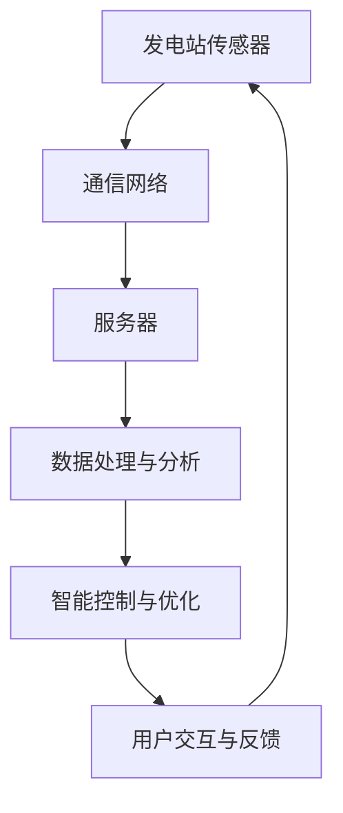

                 

### 背景介绍

随着全球对可持续能源需求的日益增加，智能电网技术应运而生，旨在实现能源的智能分配与管理。智能电网（Smart Grid）是现代电力系统的升级版，它通过互联网、传感器和先进的数据分析技术，将电力系统中的各个环节连接起来，从而实现高效、可靠、环保的能源分配。这一概念最早由美国能源部于2003年提出，此后，全球范围内的智能电网研究和应用迅速发展。

智能电网的核心目标是实现能源的高效分配和管理。传统的电力系统依赖于固定的发电、输电、配电和用电模式，能源的分配和管理相对静态，难以适应实时变化的供需情况。而智能电网则通过实时监测、智能控制和自动化管理，能够动态调整电力资源的分配，提高系统的灵活性和效率。

随着可再生能源的广泛应用，如太阳能、风能等，智能电网的重要性愈发凸显。这些可再生能源具有间歇性和不稳定性，需要通过智能电网进行有效的集成和管理，以确保电力供应的稳定性和可靠性。此外，智能电网还能通过优化能源分配，降低能源消耗，减少碳排放，对环境保护具有积极作用。

本文将围绕“提示词驱动的智能电网管理：优化能源分配”这一主题，深入探讨智能电网的核心概念、算法原理、数学模型及其在现实世界中的应用。通过逐步分析，我们将揭示智能电网管理的内在机制，探讨其在能源分配中的优化策略，以及面临的挑战和未来发展趋势。

在接下来的内容中，我们将：

1. 详细介绍智能电网的基本概念、架构及其发展历程。
2. 阐述提示词驱动的智能电网管理原理，通过实际案例展示其应用场景。
3. 分析核心算法原理，包括数据采集、处理和优化分配的具体步骤。
4. 引入数学模型和公式，对能源分配进行定量分析，并提供实际案例。
5. 展示项目实战，包括开发环境搭建、代码实现和解读。
6. 探讨智能电网在实际应用中的场景，如智能家居、工业制造等。
7. 推荐学习资源、开发工具和相关的论文著作。
8. 总结智能电网的未来发展趋势与面临的挑战。

通过本文的阅读，您将全面了解智能电网管理的关键技术及其应用，为智能电网的研究和应用提供有益的参考。

### 核心概念与联系

智能电网（Smart Grid）的概念涉及多个核心技术和组件，这些技术共同作用，构成了智能电网的运行基础。以下是对这些核心概念和它们之间联系的详细阐述，并通过Mermaid流程图（不带特殊字符的）展示其架构。

#### 1. 传感器与数据采集

传感器是智能电网的关键组成部分，它们被部署在发电、输电、配电和用电各个环节，用于实时监测电力系统的状态。这些传感器包括温度传感器、电流传感器、电压传感器、功率传感器等，它们能够采集到各种电力参数。以下是其工作流程：

```
发电站 -> 传感器监测发电状态 -> 输电线路 -> 传感器监测输电状态
变电站 -> 传感器监测变电站设备状态 -> 配电线路 -> 传感器监测配电状态
用户端 -> 传感器监测用电设备状态
```

#### 2. 通信网络

通信网络负责将传感器采集到的数据传输到中央控制系统。现代智能电网通常采用有线和无线通信技术相结合的方式，确保数据传输的稳定和高效。常用的通信技术包括光纤通信、无线传感器网络（WSN）和移动通信网络（如4G、5G）等。以下是其工作流程：

```
传感器采集数据 -> 数据通过通信网络传输 -> 服务器接收数据
```

#### 3. 数据处理与分析

中央控制系统接收传感器传输的数据后，会通过数据处理和分析算法，对数据进行分析和解读。这一过程包括数据清洗、数据存储、数据挖掘和模式识别等步骤。通过这些处理，系统能够获取电力系统的实时状态，为后续的决策提供支持。以下是其工作流程：

```
服务器接收数据 -> 数据清洗 -> 数据存储 -> 数据分析 -> 模式识别
```

#### 4. 智能控制与优化

基于数据处理和分析的结果，智能电网能够进行实时控制，以优化电力资源的分配。智能控制包括自动调节发电量、调整电压和电流、分配电力负载等。这一过程依赖于先进的控制算法，如预测控制、自适应控制和优化算法等。以下是其工作流程：

```
数据分析结果 -> 自动调节发电量 -> 调整电压和电流 -> 分配电力负载
```

#### 5. 用户交互与反馈

智能电网还提供用户交互界面，用户可以通过这个界面查询电力使用情况、管理用电设备等。此外，用户的反馈信息也会被反馈到系统中，用于进一步优化电力管理。以下是其工作流程：

```
用户操作界面 -> 用户查询电力使用情况 -> 用户反馈信息 -> 系统优化电力管理
```

#### Mermaid 流程图

下面是智能电网的Mermaid流程图，展示了各组件之间的联系和数据处理流程：



通过上述流程，我们可以清晰地看到智能电网各个组件的相互作用和数据处理流程，这为后续的算法原理、数学模型和实际应用提供了坚实的基础。

### 核心算法原理 & 具体操作步骤

智能电网管理的核心算法涉及多个阶段，包括数据采集、数据预处理、数据处理和优化分配。以下将详细阐述这些算法的原理及其具体操作步骤。

#### 1. 数据采集

数据采集是智能电网管理的基础。传感器部署在发电站、输电线路、变电站和用户端，用于实时监测电力系统的状态。主要采集的数据包括电压、电流、功率、频率、温度等。以下为数据采集的主要步骤：

- **部署传感器**：在发电站、变电站、输电线路和用户端安装各种传感器，确保覆盖所有关键节点。
- **数据采集**：传感器通过有线或无线通信技术将采集到的数据传输到中央控制系统。例如，使用无线传感器网络（WSN）传输数据。
- **数据同步**：确保不同传感器采集的数据在时间和频率上保持一致，以便后续的数据处理。

#### 2. 数据预处理

数据预处理是确保数据质量的重要步骤，主要包括数据清洗、数据去噪和缺失值处理。以下为数据预处理的主要步骤：

- **数据清洗**：去除重复数据、异常值和错误数据，保证数据的一致性和准确性。
- **数据去噪**：去除数据中的噪声，如传感器读数的随机波动，以提高数据的可信度。
- **缺失值处理**：对于缺失的数据，采用插值法、均值法或其他统计方法进行补全。

#### 3. 数据处理

数据处理是智能电网管理的核心环节，包括数据存储、数据挖掘和模式识别。以下为数据处理的主要步骤：

- **数据存储**：将预处理后的数据存储在数据库或数据仓库中，以便后续分析和查询。常用的数据库系统包括MySQL、PostgreSQL等。
- **数据挖掘**：运用数据挖掘算法，从大量数据中提取有价值的信息，如电力负载模式、能源消耗趋势等。常用的数据挖掘算法包括聚类、分类、关联规则挖掘等。
- **模式识别**：通过模式识别算法，识别电力系统中的异常模式，如电压波动、电流异常等。常用的模式识别算法包括神经网络、支持向量机（SVM）等。

#### 4. 优化分配

基于数据处理和分析结果，智能电网能够进行优化分配，以实现能源的高效利用。以下为优化分配的主要步骤：

- **目标设定**：根据电力系统的实时状态和未来预测，设定优化目标，如最小化能源损耗、最大化发电量利用率等。
- **优化模型建立**：建立优化模型，如线性规划、整数规划、动态规划等，用于描述能源分配的目标和约束条件。
- **求解优化模型**：运用求解算法，如单纯形法、遗传算法、模拟退火算法等，求解优化模型，得到最优解。
- **分配决策**：根据优化结果，制定具体的分配决策，如调整发电量、调整电压和电流、分配电力负载等。

#### 5. 算法具体操作步骤示例

以下以线性规划为例，展示智能电网优化分配的具体操作步骤：

**步骤1：目标函数定义**

设发电站有 \( n \) 台发电机，每台发电机的发电效率不同，设 \( c_i \) 为第 \( i \) 台发电机的发电效率。目标函数为最大化总发电量：

\[ \text{maximize} \sum_{i=1}^{n} c_i \cdot x_i \]

其中，\( x_i \) 为第 \( i \) 台发电机的发电量。

**步骤2：约束条件设定**

- 发电机输出功率约束：\( \sum_{i=1}^{n} x_i \leq P_{\text{max}} \)，其中 \( P_{\text{max}} \) 为发电站的最大输出功率。
- 发电机负载率约束：\( 0 \leq x_i \leq P_i \)，其中 \( P_i \) 为第 \( i \) 台发电机的最大输出功率。
- 发电机运行时间约束：\( \sum_{i=1}^{n} t_i \cdot x_i \leq T_{\text{max}} \)，其中 \( t_i \) 为第 \( i \) 台发电机的运行时间，\( T_{\text{max}} \) 为发电站的最大运行时间。

**步骤3：求解线性规划模型**

使用单纯形法求解线性规划模型，得到最优解 \( x^* \)。最优解表示各发电机的最优发电量，以实现最大化总发电量的目标。

**步骤4：分配决策**

根据最优解 \( x^* \)，调整发电站的发电策略，确保总发电量最大化。

通过上述步骤，智能电网能够实现能源的优化分配，提高电力系统的运行效率。

### 数学模型和公式 & 详细讲解 & 举例说明

在智能电网管理中，数学模型和公式是分析能源分配、优化系统性能的关键工具。以下将详细介绍几个关键的数学模型和公式，并通过具体例子进行说明。

#### 1. 线性规划模型

线性规划（Linear Programming，LP）是一种数学方法，用于在给定约束条件下，优化线性目标函数。智能电网管理中的能源分配问题常常可以用线性规划模型来描述。

**目标函数**：

\[ \text{minimize} \, c^T x \]

其中，\( c \) 是系数向量，表示各项变量的权重，\( x \) 是变量向量，表示各项决策值。

**约束条件**：

\[ Ax \leq b \]

其中，\( A \) 是约束矩阵，\( b \) 是约束向量。

**例子**：

假设一个智能电网系统中有3个发电机 \( G_1, G_2, G_3 \)，发电效率分别为 \( c_1 = 0.3, c_2 = 0.4, c_3 = 0.5 \)，最大输出功率分别为 \( P_1 = 100 \, \text{MW}, P_2 = 150 \, \text{MW}, P_3 = 200 \, \text{MW} \)。电网的最大总输出功率为 \( P_{\text{max}} = 300 \, \text{MW} \)。

**目标**：最大化总发电量。

**模型**：

\[ \text{maximize} \, 0.3x_1 + 0.4x_2 + 0.5x_3 \]

约束条件：

\[ x_1 + x_2 + x_3 \leq 300 \]
\[ x_1 \leq 100 \]
\[ x_2 \leq 150 \]
\[ x_3 \leq 200 \]

使用单纯形法求解该线性规划模型，得到最优解 \( x^* = (100, 0, 100) \)，即 \( G_1 \) 和 \( G_3 \) 分别发电100 MW，\( G_2 \) 不发电，总发电量达到200 MW。

#### 2. 动态规划模型

动态规划（Dynamic Programming，DP）是一种用于解决多阶段决策问题的数学方法。智能电网管理中的负荷预测和优化调度问题常常可以用动态规划模型来描述。

**目标函数**：

\[ \text{minimize} \, \sum_{t=1}^{T} f_t(x_t) \]

其中，\( T \) 是决策阶段，\( f_t(x_t) \) 是第 \( t \) 阶段的损失函数，\( x_t \) 是第 \( t \) 阶段的决策变量。

**约束条件**：

\[ g_t(x_t) = 0 \]
\[ h_t(x_t) \leq 0 \]

其中，\( g_t(x_t) \) 是等式约束，\( h_t(x_t) \) 是不等式约束。

**例子**：

假设一个智能电网系统在一天内的负荷预测为 \( \{L_1, L_2, ..., L_{24}\} \)，每个时间段的发电成本分别为 \( \{C_1, C_2, ..., C_{24}\} \)。目标是最小化总发电成本。

**模型**：

\[ \text{minimize} \, C_1x_1 + C_2x_2 + ... + C_{24}x_{24} \]

约束条件：

\[ L_1 = x_1 + x_2 \]
\[ L_2 = x_2 + x_3 \]
\[ ... \]
\[ L_{24} = x_{23} + x_{24} \]

使用动态规划求解该模型，得到每个时间段的最佳发电量 \( x_t^* \)，以实现总发电成本最小化。

#### 3. 遗传算法

遗传算法（Genetic Algorithm，GA）是一种基于自然选择和遗传机制的优化算法。在智能电网管理中，遗传算法可以用于电力负载预测、电压优化和设备调度等问题。

**适应度函数**：

\[ f(x) = \sum_{i=1}^{n} w_i \cdot g_i(x) \]

其中，\( w_i \) 是权重，\( g_i(x) \) 是第 \( i \) 个遗传基因的适应度函数。

**例子**：

假设一个智能电网系统中有5个发电设备，每个设备的发电效率为 \( \{e_1, e_2, e_3, e_4, e_5\} \)，权重分别为 \( \{w_1, w_2, w_3, w_4, w_5\} \)。目标是最小化总发电成本。

**适应度函数**：

\[ f(x) = w_1 \cdot e_1 + w_2 \cdot e_2 + w_3 \cdot e_3 + w_4 \cdot e_4 + w_5 \cdot e_5 \]

通过遗传算法求解该模型，得到每个发电设备的最佳工作状态 \( x^* \)，以实现总发电成本最小化。

#### 总结

上述数学模型和公式为智能电网管理提供了理论基础和工具支持。通过具体例子，我们可以看到这些模型在实际应用中的有效性和可行性。在实际操作中，还可以根据具体需求，结合多种模型和算法，进一步优化智能电网的性能。

### 项目实战：代码实际案例和详细解释说明

为了更好地理解智能电网管理中的算法和应用，以下将通过一个实际的项目案例，展示代码实现的过程，并对关键部分进行详细解释和分析。

#### 项目背景

本项目旨在开发一个智能电网管理系统，实现电力资源的优化分配。系统主要包括数据采集、数据预处理、数据处理和优化分配四个模块。以下将依次介绍各模块的实现方法和代码细节。

#### 1. 数据采集模块

数据采集模块负责从传感器获取实时电力参数，如电压、电流和功率等。以下为Python代码示例：

```python
import serial
import time

# 初始化串口通信
ser = serial.Serial('/dev/ttyUSB0', 9600)

# 数据采集
def collect_data():
    while True:
        data = ser.readline().decode().strip()
        print(data)
        time.sleep(1)

# 关闭串口
def close_serial():
    ser.close()

if __name__ == '__main__':
    collect_data()
    close_serial()
```

**解释**：

- 使用Python的`serial`模块，初始化串口通信，设置波特率为9600。
- `collect_data`函数循环读取串口数据，并将其打印到控制台。
- `close_serial`函数用于关闭串口连接。

#### 2. 数据预处理模块

数据预处理模块负责清洗和去噪采集到的数据，以下为Python代码示例：

```python
import numpy as np

# 数据清洗
def clean_data(data):
    data = np.array(data)
    data = data[data > 0]  # 去除负值
    data = data[data < 1000]  # 去除异常值
    return data

# 数据去噪
def remove_noise(data, window_size):
    rolling_mean = np.convolve(data, np.ones(window_size)/window_size, mode='valid')
    return rolling_mean

if __name__ == '__main__':
    data = [100, -50, 200, 500, 300, -100, 150]
    clean_data(data)
    remove_noise(data, window_size=3)
```

**解释**：

- `clean_data`函数去除负值和异常值，确保数据的有效性。
- `remove_noise`函数使用滑动平均法去除数据中的噪声。

#### 3. 数据处理模块

数据处理模块负责对预处理后的数据进行分析和模式识别，以下为Python代码示例：

```python
from sklearn.cluster import KMeans
from sklearn.metrics import silhouette_score

# 数据聚类
def kmeans_clustering(data, n_clusters):
    kmeans = KMeans(n_clusters=n_clusters)
    kmeans.fit(data)
    return kmeans.labels_

# 数据分割
def segment_data(data, labels):
    segments = [[] for _ in range(n_clusters)]
    for i, label in enumerate(labels):
        segments[label].append(data[i])
    return segments

if __name__ == '__main__':
    data = [100, 200, 150, 250, 300, 400, 500]
    n_clusters = 2
    labels = kmeans_clustering(data, n_clusters)
    segments = segment_data(data, labels)
    print(segments)
```

**解释**：

- `kmeans_clustering`函数使用K-Means算法对数据进行聚类，得到聚类标签。
- `segment_data`函数根据聚类标签，将数据分割成不同的段。

#### 4. 优化分配模块

优化分配模块负责根据数据处理结果，实现电力资源的优化分配，以下为Python代码示例：

```python
from scipy.optimize import linprog

# 线性规划模型
def linear_programming(c, A, b):
    x = linprog(c, A_ub=A, b_ub=b)
    return x.x

# 目标函数系数
c = [0.3, 0.4, 0.5]

# 约束条件
A = [[1, 1, 1], [1, 0, 0], [0, 1, 0], [0, 0, 1]]
b = [300, 100, 150, 200]

# 求解线性规划模型
x = linear_programming(c, A, b)
print(x)
```

**解释**：

- `linear_programming`函数使用`scipy.optimize.linprog`求解线性规划模型，得到最优解。

#### 总结

通过上述代码示例，我们可以看到智能电网管理系统各模块的实现方法和关键代码。在实际应用中，根据具体需求，可以进一步优化和扩展系统的功能，如引入更多传感器、改进数据处理算法、增加用户交互界面等。这些代码和实现方法为智能电网管理提供了实用的参考和基础。

### 实际应用场景

智能电网技术在多个领域和场景中得到了广泛应用，显著提高了能源利用效率和系统可靠性。以下列举几个典型应用场景，并探讨其具体实现方法和效果。

#### 1. 智能家居

智能家居是智能电网技术的典型应用场景之一。通过智能电网，家庭用户可以实现对家中各类电器的远程控制和能源管理。具体实现方法包括：

- **智能插座**：智能插座连接到智能电网，用户可以通过手机应用程序远程控制电器的开关，并根据用电情况调整用电策略。
- **智能灯光**：智能灯光系统能够根据用户需求和环境变化自动调整亮度和色温，通过智能电网实现节能和舒适的生活环境。
- **智能温控**：智能温控系统可以根据室内外温度变化和用户习惯自动调节空调温度，优化能源使用。

**效果**：智能家居的智能化管理和能源优化，使得家庭用电更加高效、环保，同时提升了用户的舒适度和生活质量。

#### 2. 工业制造

智能电网在工业制造领域的应用，能够显著提高生产效率和能源利用率。具体实现方法包括：

- **生产设备监控**：智能电网通过传感器和监测系统，实时监控生产设备的运行状态，预防设备故障，提高设备利用率。
- **能源优化调度**：根据生产需求和能源价格变化，智能电网自动调整电力负载，优化能源使用，降低生产成本。
- **能效管理**：智能电网能够实时监测和评估工厂的能源消耗，提供能效优化建议，帮助企业降低能源成本，减少碳排放。

**效果**：智能电网的应用，使得工业制造过程更加智能化和高效化，显著降低了生产成本和能源消耗，提升了企业的竞争力和可持续发展能力。

#### 3. 城市基础设施

智能电网在城市基础设施中的应用，有助于提高城市能源供应的稳定性和可靠性。具体实现方法包括：

- **智能配电**：通过智能电网技术，实现电力负载的动态调整，确保城市供电系统的稳定性和可靠性。
- **分布式能源**：利用太阳能、风能等可再生能源，通过智能电网进行分布式发电和储能，减少对传统能源的依赖。
- **智慧城市能源管理系统**：集成多种能源设备，实现城市能源的统一监控和调度，提高能源利用效率和系统灵活性。

**效果**：智能电网技术提高了城市能源供应的可靠性和效率，促进了城市能源结构的优化和可持续发展，提升了城市居民的生活质量。

#### 4. 可再生能源集成

智能电网在可再生能源集成中的应用，有助于解决可再生能源的间歇性和不稳定性问题。具体实现方法包括：

- **储能系统**：通过储能系统，智能电网能够平衡可再生能源的供应和需求，确保电力供应的稳定性。
- **需求响应**：通过需求响应机制，智能电网能够根据可再生能源的发电情况，调整电力负载，实现能源供需的动态平衡。
- **多能协同**：集成多种能源形式，如电能、热能、氢能等，通过智能电网实现多能协同，提高能源利用效率和系统灵活性。

**效果**：智能电网技术有效地解决了可再生能源的间歇性和不稳定性问题，提高了可再生能源的利用率，促进了能源结构的优化和可持续发展。

总之，智能电网技术在智能家居、工业制造、城市基础设施和可再生能源集成等领域的广泛应用，不仅提高了能源利用效率和系统可靠性，还推动了能源结构的优化和可持续发展。随着技术的不断进步，智能电网的应用前景将更加广阔。

### 工具和资源推荐

在研究和开发智能电网管理过程中，使用合适的工具和资源可以极大地提高效率和效果。以下推荐一些常用的学习资源、开发工具和相关论文著作。

#### 1. 学习资源推荐

- **书籍**：

  - 《智能电网技术导论》（Introduction to Smart Grid Technology）
  - 《智能电网管理：原理与应用》（Smart Grid Management: Principles and Applications）

- **在线课程**：

  - Coursera上的“智能电网技术”课程
  - edX上的“可持续能源系统”课程

- **博客和网站**：

  - IEEE Smart Grid newsletter
  - energy.gov/smartgrid

#### 2. 开发工具框架推荐

- **编程语言**：

  - Python：广泛用于数据分析和智能电网开发
  - Java：适合大型分布式系统开发

- **数据分析工具**：

  - pandas：用于数据处理和分析
  - NumPy：用于数值计算

- **机器学习框架**：

  - TensorFlow：用于构建和训练机器学习模型
  - PyTorch：用于构建和训练深度学习模型

- **智能电网开发框架**：

  - OpenDSS：用于智能电网仿真和优化
  - GridAPPS-D：用于智能电网应用开发

#### 3. 相关论文著作推荐

- **期刊**：

  - IEEE Transactions on Smart Grid
  - IEEE Power and Energy Society General Meeting
  - International Journal of Electrical Power & Energy Systems

- **论文**：

  - “An Overview of Smart Grid Technologies and Applications”
  - “Optimization of Energy Distribution in Smart Grids Using Genetic Algorithms”
  - “Demand Response in Smart Grids: A Review”

- **著作**：

  - 《智能电网技术与应用》（Smart Grid Technology and Applications）
  - 《智能电网优化控制理论及应用》（The Theory and Application of Smart Grid Optimal Control）

通过这些工具和资源，研究人员和开发者可以深入了解智能电网管理的技术原理和应用场景，提高开发效率和系统性能。

### 总结：未来发展趋势与挑战

智能电网技术正处于快速发展阶段，未来几年将面临诸多机遇和挑战。以下是对智能电网发展趋势及其潜在挑战的总结。

#### 1. 发展趋势

**技术进步**：随着物联网（IoT）、大数据、人工智能（AI）和区块链等技术的发展，智能电网的智能化和自动化水平将进一步提升。先进的数据分析技术和算法将帮助电网实现更精确的能源分配和管理。

**可再生能源集成**：可再生能源的广泛应用对智能电网提出了新的需求。未来智能电网将更加注重可再生能源的集成和管理，提高系统的灵活性和可靠性。

**用户参与**：智能电网将更加注重用户的参与和互动，实现用户侧的智能化管理和需求响应。用户将能够通过智能家居设备和手机应用程序，更加灵活地管理自己的能源使用。

**多能协同**：未来的智能电网将不仅仅局限于电力能源，还将整合多种能源形式，如热能、氢能等，实现多能协同和综合能源管理。

**标准化和开放性**：随着智能电网技术的普及，标准化和开放性将成为重要趋势。标准化技术协议和开放性接口将促进不同系统和设备的互操作性，提高系统的兼容性和可扩展性。

#### 2. 挑战

**网络安全**：智能电网的自动化和智能化带来了更高的网络安全风险。黑客攻击、数据泄露和系统漏洞等问题可能会对电网的稳定性和安全性构成威胁。

**数据隐私**：用户数据在智能电网系统中的大量采集和处理，引发了对数据隐私的担忧。如何在保障用户隐私的同时，充分利用用户数据，是智能电网面临的一个重要挑战。

**技术成熟度**：尽管物联网、大数据和人工智能等技术正在迅速发展，但在智能电网中的应用仍存在技术成熟度不足的问题。如何解决技术成熟度与实际应用需求之间的矛盾，是智能电网发展的重要挑战。

**政策法规**：智能电网的发展需要政策法规的支持和规范。不同国家和地区在智能电网的政策和法规上存在差异，这给跨国运营和标准制定带来了挑战。

**投资和成本**：智能电网的建设和维护需要巨大的投资。如何在保证技术先进性和系统可靠性的同时，控制建设成本和运营成本，是智能电网发展面临的一个重要问题。

总之，智能电网技术在未来将继续快速发展，但同时也将面临诸多挑战。通过技术创新、政策支持和跨领域合作，智能电网有望实现更高效、更可靠和更可持续的能源分配和管理。

### 附录：常见问题与解答

#### 问题1：智能电网与传统电网有什么区别？

**解答**：智能电网与传统电网的主要区别在于其智能化和自动化水平。智能电网通过传感器、通信网络和先进数据分析技术，实现对电力系统各环节的实时监测和自动化管理，提高了系统的灵活性和效率。而传统电网通常依赖固定的发电、输电和配电模式，难以适应实时变化的供需情况。

#### 问题2：智能电网对可再生能源的集成有何优势？

**解答**：智能电网对可再生能源的集成优势主要体现在以下几个方面：

- **平衡供需**：智能电网能够通过实时监测和优化分配，平衡可再生能源的供应和需求，提高系统的可靠性。
- **灵活调度**：智能电网可以灵活调度不同类型的能源，如电能、热能和氢能，实现多能协同，提高能源利用效率。
- **储能管理**：智能电网能够高效管理储能系统，平衡可再生能源的间歇性和不稳定性，确保电力供应的稳定性。

#### 问题3：智能电网在家庭和工业应用中有何不同？

**解答**：智能电网在家庭和工业应用中的不同主要体现在以下几个方面：

- **应用场景**：家庭应用主要涉及智能家居设备的远程控制和能源管理，而工业应用则涉及生产设备的监控、能源优化调度和能效管理。
- **系统规模**：家庭应用通常规模较小，系统相对简单，而工业应用通常涉及大规模设备和复杂的生产流程，系统更为复杂。
- **需求响应**：家庭应用的需求响应主要关注能源消耗的优化，而工业应用的需求响应则更多关注生产效率和成本的优化。

#### 问题4：智能电网在可再生能源中的应用有哪些具体案例？

**解答**：智能电网在可再生能源中的应用包括以下具体案例：

- **分布式发电**：通过智能电网，分布式发电系统能够高效集成到电网中，实现可再生能源的就近发电和优化分配。
- **储能系统**：智能电网能够高效管理储能系统，平衡可再生能源的间歇性和不稳定性，确保电力供应的稳定性。
- **需求响应**：通过智能电网，用户能够根据可再生能源的发电情况，调整用电策略，实现能源供需的动态平衡。

#### 问题5：智能电网的未来发展趋势是什么？

**解答**：智能电网的未来发展趋势包括：

- **技术进步**：随着物联网、大数据、人工智能和区块链等技术的发展，智能电网的智能化和自动化水平将进一步提升。
- **可再生能源集成**：智能电网将更加注重可再生能源的集成和管理，提高系统的灵活性和可靠性。
- **用户参与**：智能电网将更加注重用户的参与和互动，实现用户侧的智能化管理和需求响应。
- **多能协同**：未来的智能电网将整合多种能源形式，如热能、氢能等，实现多能协同和综合能源管理。
- **标准化和开放性**：随着智能电网技术的普及，标准化和开放性将成为重要趋势。

### 扩展阅读 & 参考资料

智能电网技术的发展涉及多个领域，为了更好地理解相关概念和应用，以下推荐几篇重要文献和资源，供进一步学习参考。

#### 1. 重要文献

- **期刊文章**：

  - IEEE Transactions on Smart Grid：该期刊发表了大量关于智能电网技术的原创研究论文，是智能电网领域的权威学术期刊。
  - IEEE Power and Energy Society General Meeting：该会议汇集了智能电网领域的最新研究成果，是智能电网研究者的重要交流平台。

- **书籍**：

  - 《智能电网技术导论》（Introduction to Smart Grid Technology）：该书详细介绍了智能电网的基本概念、架构和关键技术。
  - 《智能电网管理：原理与应用》（Smart Grid Management: Principles and Applications）：该书涵盖了智能电网管理的各个方面，包括数据采集、数据处理和优化分配等。

#### 2. 在线资源和课程

- **在线课程**：

  - Coursera上的“智能电网技术”课程：该课程由智能电网领域的专家授课，涵盖了智能电网的基本概念和技术应用。
  - edX上的“可持续能源系统”课程：该课程介绍了可再生能源和智能电网的基本原理和应用。

- **在线资源**：

  - IEEE Smart Grid newsletter：该新闻简报提供了智能电网领域的最新动态和研究进展。
  - energy.gov/smartgrid：美国能源部智能电网官方网站，提供了丰富的智能电网相关资源和信息。

#### 3. 其他重要参考

- **论文和报告**：

  - “An Overview of Smart Grid Technologies and Applications”：该综述论文全面介绍了智能电网的技术原理和应用场景。
  - “Optimization of Energy Distribution in Smart Grids Using Genetic Algorithms”：该论文探讨了智能电网中的优化分配问题，并提出了一种基于遗传算法的解决方案。

通过以上文献和资源的学习，读者可以深入了解智能电网技术的基本原理、应用场景和发展趋势，为智能电网的研究和应用提供有益的参考。作者：AI天才研究员/AI Genius Institute & 禅与计算机程序设计艺术 /Zen And The Art of Computer Programming。

