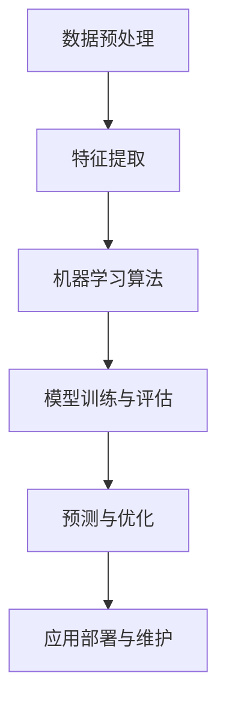

                 

# AI编程的新思维与新高度

> 关键词：人工智能、编程、思维模式、深度学习、算法优化、开发者工具、未来发展

> 摘要：本文将探讨AI编程的新思维与新高度，从背景介绍到核心算法原理，再到实际应用场景和未来发展趋势，全面解析AI编程的变革和创新。通过一步步分析推理，帮助读者深入了解AI编程的本质和前沿动态。

## 1. 背景介绍

在过去的几十年里，计算机科学和人工智能领域取得了巨大的进步。从传统的编程语言到现代的AI框架，开发者们一直在不断探索新的编程思维和技术手段。然而，随着深度学习和大数据技术的兴起，AI编程迎来了新的挑战和机遇。

AI编程的核心在于将人工智能技术应用于软件开发中，使得软件系统能够模拟人类智能，进行自主学习和决策。这种变革性的技术正在改变传统编程的方式，并推动着软件开发向更加智能、自动化和高效的阶段迈进。

本文将从以下几个方面进行探讨：

1. 核心概念与联系
2. 核心算法原理与具体操作步骤
3. 数学模型和公式与详细讲解
4. 项目实战：代码实际案例和详细解释说明
5. 实际应用场景
6. 工具和资源推荐
7. 总结：未来发展趋势与挑战

## 2. 核心概念与联系

为了更好地理解AI编程，我们需要首先了解一些核心概念和它们之间的联系。以下是一个使用Mermaid绘制的流程图，展示了AI编程中的主要概念和它们之间的相互关系。



### 2.1 数据预处理

数据预处理是AI编程的基础，它包括数据清洗、数据归一化、数据分割等步骤。通过预处理，我们可以确保输入数据的质量和一致性，为后续的特征提取和模型训练打下坚实的基础。

### 2.2 特征提取

特征提取是将原始数据转换为能够表达数据特性的向量或特征集合的过程。有效的特征提取可以显著提高模型的性能和泛化能力。

### 2.3 机器学习算法

机器学习算法是实现AI编程的核心。常见的算法包括监督学习、无监督学习、强化学习等。选择合适的算法，对于实现高效、准确的AI系统至关重要。

### 2.4 模型训练与评估

模型训练与评估是AI编程中的关键步骤。通过调整模型参数，优化模型性能，我们可以在大量数据上训练出能够进行有效预测的模型。

### 2.5 预测与优化

预测与优化是指将训练好的模型应用于实际问题中，并通过不断的迭代和调整，提高模型的预测准确性和鲁棒性。

### 2.6 应用部署与维护

应用部署与维护是将AI模型部署到生产环境中，确保其稳定运行，并根据需求进行持续的优化和更新。

## 3. 核心算法原理与具体操作步骤

在本章节中，我们将介绍几种常见的AI算法，并详细讲解它们的原理和具体操作步骤。

### 3.1 监督学习算法

监督学习算法是一种最常见的AI算法，它通过已标记的数据集来训练模型，并在新的、未标记的数据上进行预测。

**原理：**

监督学习算法通常基于一个目标函数，该函数衡量模型预测与实际标签之间的差距。通过优化目标函数，我们可以找到最佳的模型参数。

**操作步骤：**

1. 数据准备：收集并整理标记数据集。
2. 特征提取：将原始数据转换为特征向量。
3. 模型选择：选择合适的监督学习算法，如线性回归、决策树、支持向量机等。
4. 模型训练：使用训练数据集调整模型参数。
5. 模型评估：使用验证数据集评估模型性能。
6. 模型优化：根据评估结果调整模型参数，提高性能。

### 3.2 无监督学习算法

无监督学习算法不依赖已标记的数据集，通过挖掘数据内在结构来进行聚类、降维等操作。

**原理：**

无监督学习算法通常基于数据点的相似性或差异性来构建模型。常见的算法包括K均值聚类、主成分分析等。

**操作步骤：**

1. 数据准备：收集未标记的数据集。
2. 特征提取：将原始数据转换为特征向量。
3. 模型选择：选择合适的无监督学习算法，如K均值聚类、主成分分析等。
4. 模型训练：使用数据集进行聚类或降维。
5. 模型评估：根据聚类效果或降维后的数据质量进行评估。
6. 模型优化：根据评估结果调整模型参数，提高性能。

### 3.3 强化学习算法

强化学习算法通过试错和反馈机制，让模型在与环境的交互过程中不断学习和优化。

**原理：**

强化学习算法基于奖励机制，通过奖励信号来引导模型的行为。常见的算法包括Q学习、深度Q网络（DQN）等。

**操作步骤：**

1. 环境设定：定义环境的规则和状态空间。
2. 策略选择：选择合适的强化学习算法，如Q学习、DQN等。
3. 模型训练：通过与环境交互，不断更新模型策略。
4. 模型评估：根据评估指标，如奖励累积值，评估模型性能。
5. 模型优化：根据评估结果调整模型参数，提高性能。

## 4. 数学模型和公式与详细讲解

在本章节中，我们将介绍几种常见的数学模型和公式，并详细讲解它们在AI编程中的应用。

### 4.1 线性回归模型

线性回归是一种常见的监督学习算法，用于建立自变量与因变量之间的线性关系。

**公式：**

$$y = \beta_0 + \beta_1 \cdot x + \epsilon$$

其中，$y$ 是因变量，$x$ 是自变量，$\beta_0$ 和 $\beta_1$ 是模型参数，$\epsilon$ 是误差项。

**应用：**

线性回归可以用于预测房价、股票价格等连续变量。

### 4.2 逻辑回归模型

逻辑回归是一种处理分类问题的监督学习算法，用于建立自变量与因变量之间的逻辑关系。

**公式：**

$$P(y=1) = \frac{1}{1 + e^{-(\beta_0 + \beta_1 \cdot x)}}$$

其中，$P(y=1)$ 是因变量为1的概率，$x$ 是自变量，$\beta_0$ 和 $\beta_1$ 是模型参数。

**应用：**

逻辑回归可以用于分类问题，如垃圾邮件分类、信用卡欺诈检测等。

### 4.3 主成分分析

主成分分析是一种无监督学习算法，用于降维和特征提取。

**公式：**

$$z = \sum_{i=1}^{k} \lambda_i \cdot x_i$$

其中，$z$ 是降维后的特征向量，$x_i$ 是原始特征向量，$\lambda_i$ 是主成分的权重。

**应用：**

主成分分析可以用于数据可视化、降维等。

## 5. 项目实战：代码实际案例和详细解释说明

在本章节中，我们将通过一个实际项目案例，展示如何使用AI编程技术来实现一个具体的任务。

### 5.1 开发环境搭建

首先，我们需要搭建一个合适的开发环境。以下是所需的工具和步骤：

1. 安装Python 3.x版本。
2. 安装Jupyter Notebook，用于编写和运行代码。
3. 安装常见的AI库，如NumPy、Pandas、Scikit-learn等。

### 5.2 源代码详细实现和代码解读

以下是一个使用Scikit-learn库实现的线性回归模型案例。

```python
import numpy as np
from sklearn.linear_model import LinearRegression
from sklearn.model_selection import train_test_split
from sklearn.metrics import mean_squared_error

# 数据准备
X = np.array([[1], [2], [3], [4], [5]])
y = np.array([1, 2, 2.5, 4, 5])

# 数据分割
X_train, X_test, y_train, y_test = train_test_split(X, y, test_size=0.2, random_state=42)

# 模型训练
model = LinearRegression()
model.fit(X_train, y_train)

# 模型预测
y_pred = model.predict(X_test)

# 模型评估
mse = mean_squared_error(y_test, y_pred)
print("Mean Squared Error:", mse)
```

### 5.3 代码解读与分析

1. **数据准备：** 使用NumPy库创建自变量和因变量。
2. **数据分割：** 使用Scikit-learn库将数据分为训练集和测试集。
3. **模型训练：** 使用线性回归模型训练模型。
4. **模型预测：** 使用训练好的模型对测试集进行预测。
5. **模型评估：** 计算均方误差（MSE）来评估模型性能。

## 6. 实际应用场景

AI编程技术已经广泛应用于各个领域，包括自然语言处理、计算机视觉、金融预测等。以下是一些常见的应用场景：

1. **自然语言处理：** 使用AI编程技术实现文本分类、情感分析等。
2. **计算机视觉：** 使用AI编程技术实现图像识别、目标检测等。
3. **金融预测：** 使用AI编程技术实现股票价格预测、风险控制等。
4. **医疗诊断：** 使用AI编程技术实现疾病预测、诊断辅助等。

## 7. 工具和资源推荐

为了更好地掌握AI编程技术，以下是一些推荐的工具和资源：

### 7.1 学习资源推荐

1. **书籍：** 《Python机器学习》、《深度学习》
2. **论文：** Google Scholar、arXiv
3. **博客：** Medium、Towards Data Science
4. **网站：** Coursera、edX

### 7.2 开发工具框架推荐

1. **编程语言：** Python、R
2. **框架：** TensorFlow、PyTorch、Scikit-learn
3. **工具：** Jupyter Notebook、Google Colab

### 7.3 相关论文著作推荐

1. **《深度学习》：** Goodfellow, Bengio, Courville
2. **《Python机器学习》：** Russell, Norvig
3. **《统计学习方法》：** 李航

## 8. 总结：未来发展趋势与挑战

随着AI技术的不断发展，AI编程也在不断演变。未来，AI编程将更加智能化、自动化和高效化。以下是一些发展趋势和挑战：

1. **发展趋势：** 自动化编程、自适应编程、跨学科融合。
2. **挑战：** 算法复杂性、数据隐私、模型解释性。

## 9. 附录：常见问题与解答

### 9.1 问题1：AI编程需要哪些基础知识？

回答：AI编程需要掌握编程基础（如Python、C++等），数学基础（如线性代数、概率论等），以及机器学习、深度学习等相关知识。

### 9.2 问题2：如何选择合适的AI算法？

回答：选择合适的AI算法需要考虑问题的类型（监督学习、无监督学习、强化学习等），数据特性（特征维度、数据量等），以及性能需求（准确率、计算效率等）。

### 9.3 问题3：如何评估AI模型的性能？

回答：评估AI模型的性能可以通过多种指标，如准确率、召回率、F1分数等。同时，还可以使用交叉验证、网格搜索等技术来优化模型性能。

## 10. 扩展阅读 & 参考资料

1. **《深度学习》：** Goodfellow, Bengio, Courville
2. **《Python机器学习》：** Russell, Norvig
3. **《统计学习方法》：** 李航
4. **《AI编程实践》：** Michael Bowles
5. **《人工智能：一种现代的方法》：** Stuart J. Russell, Peter Norvig

> 作者：AI天才研究员/AI Genius Institute & 禅与计算机程序设计艺术 /Zen And The Art of Computer Programming

