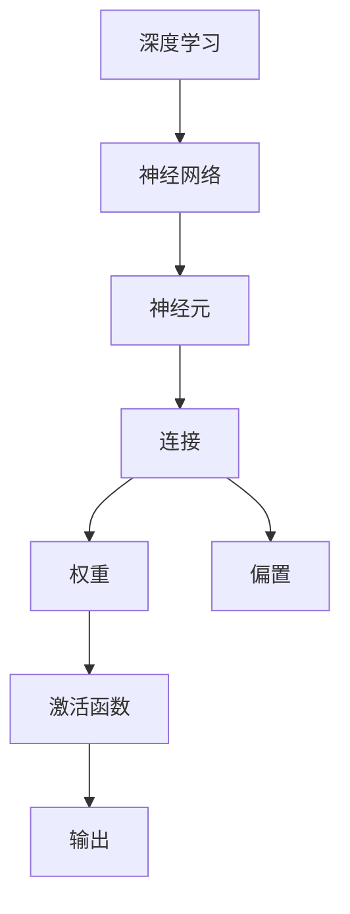

                 

# AI编程的新视角与新高度

> **关键词：** AI编程、新视角、新高度、深度学习、神经网络、Python、算法优化、技术博客、编程技巧

> **摘要：** 本文将探讨AI编程领域的新视角和新高度，通过分析深度学习、神经网络等核心算法的原理与操作步骤，并结合实际项目实战，展示如何将理论转化为实践。同时，本文还将介绍相关的数学模型、工具和资源，帮助读者深入了解AI编程的各个方面。

## 1. 背景介绍

AI编程，即人工智能编程，是指利用计算机编程语言和算法来实现人工智能系统的过程。随着深度学习、神经网络等技术的不断发展，AI编程在各个领域的应用越来越广泛，从自然语言处理、计算机视觉到自动驾驶、智能客服等。传统的编程方式已经无法满足日益复杂的AI需求，因此，探索新的编程视角和新高度成为了当前AI编程领域的重要研究方向。

本文旨在为读者提供一个全新的视角，帮助理解AI编程的核心算法原理，掌握实际项目实战技巧，从而提升编程水平，应对未来人工智能的发展趋势和挑战。

## 2. 核心概念与联系

### 2.1 深度学习与神经网络

深度学习（Deep Learning）是人工智能的一个重要分支，基于多层神经网络（Neural Networks）模型，通过模拟人脑神经网络结构和信息处理过程来实现人工智能。深度学习具有强大的特征提取和模式识别能力，在图像识别、语音识别、自然语言处理等领域取得了显著的成果。

神经网络是一种基于生物神经网络构建的计算模型，由大量神经元（Node）和连接（Connection）组成。每个神经元接收输入信号，通过权重（Weight）和偏置（Bias）进行加权求和，并使用激活函数（Activation Function）进行非线性变换，最终输出结果。神经网络通过反向传播算法（Backpropagation Algorithm）不断调整权重，优化网络性能。

### 2.2 Mermaid 流程图

下面是深度学习与神经网络核心概念原理的Mermaid流程图：



### 2.3 核心算法与联系

深度学习的核心算法主要包括卷积神经网络（Convolutional Neural Networks, CNN）、循环神经网络（Recurrent Neural Networks, RNN）和生成对抗网络（Generative Adversarial Networks, GAN）等。这些算法各有特点，适用于不同的应用场景。

- CNN：擅长处理图像数据，具有局部感知能力和平移不变性。
- RNN：擅长处理序列数据，能够捕捉时间序列信息。
- GAN：通过生成器和判别器的对抗训练，实现高质量的数据生成。

这三种算法相互关联，共同构建了深度学习的技术体系。在AI编程实践中，根据具体应用需求，可以选择合适的算法进行应用。

## 3. 核心算法原理 & 具体操作步骤

### 3.1 卷积神经网络（CNN）

卷积神经网络是一种基于卷积操作的前馈神经网络，主要用于图像分类和识别。以下是CNN的核心原理和操作步骤：

1. **输入层**：接受图像数据，将图像划分为像素值。
2. **卷积层**：通过卷积操作提取图像特征，卷积核（Kernel）在图像上滑动，计算局部区域内的像素值乘积和。
3. **激活函数**：对卷积层输出应用激活函数（如ReLU函数），增加模型非线性。
4. **池化层**：对卷积层输出进行池化操作（如最大池化），减少参数数量，提高模型泛化能力。
5. **全连接层**：将卷积层和池化层输出压缩为一个向量，通过全连接层进行分类。

### 3.2 循环神经网络（RNN）

循环神经网络是一种处理序列数据的神经网络，通过循环结构保持序列上下文信息。以下是RNN的核心原理和操作步骤：

1. **输入层**：接受序列数据，将序列划分为单词或字符。
2. **隐藏层**：每个时间步上的隐藏状态由前一个时间步的隐藏状态和当前输入进行计算。
3. **循环结构**：隐藏层通过循环结构连接，保持序列信息。
4. **输出层**：将隐藏层输出转换为序列标签或分类结果。

### 3.3 生成对抗网络（GAN）

生成对抗网络由生成器和判别器两个神经网络组成，通过对抗训练实现高质量的数据生成。以下是GAN的核心原理和操作步骤：

1. **生成器**：将随机噪声转换为逼真的数据样本。
2. **判别器**：判断数据样本是真实数据还是生成器生成的数据。
3. **对抗训练**：生成器和判别器相互对抗，生成器不断优化生成数据，判别器不断优化区分数据。

## 4. 数学模型和公式 & 详细讲解 & 举例说明

### 4.1 卷积神经网络（CNN）的数学模型

卷积神经网络的数学模型主要涉及卷积操作、激活函数和池化操作。以下是这些操作的数学公式：

#### 卷积操作

$$
h_{ij} = \sum_{k} w_{ik,jl} * x_{kl}
$$

其中，$h_{ij}$ 表示卷积层输出，$w_{ik,jl}$ 表示卷积核，$x_{kl}$ 表示输入层像素值。

#### 激活函数

$$
\text{ReLU}(x) = \begin{cases}
x, & \text{if } x > 0 \\
0, & \text{otherwise}
\end{cases}
$$

#### 池化操作

$$
p_{ij} = \max_{k,l} h_{ik,jl}
$$

其中，$p_{ij}$ 表示池化层输出，$h_{ik,jl}$ 表示卷积层输出。

### 4.2 循环神经网络（RNN）的数学模型

循环神经网络的数学模型主要涉及隐藏状态的计算和输出层的计算。以下是这些操作的数学公式：

#### 隐藏状态计算

$$
h_t = \sigma(W_h \cdot [h_{t-1}, x_t] + b_h)
$$

其中，$h_t$ 表示当前时间步的隐藏状态，$x_t$ 表示当前输入，$W_h$ 和 $b_h$ 分别为权重矩阵和偏置。

#### 输出层计算

$$
y_t = \sigma(W_o \cdot h_t + b_o)
$$

其中，$y_t$ 表示当前时间步的输出，$W_o$ 和 $b_o$ 分别为权重矩阵和偏置。

### 4.3 生成对抗网络（GAN）的数学模型

生成对抗网络的数学模型主要涉及生成器和判别器的损失函数。以下是这些操作的数学公式：

#### 生成器损失函数

$$
L_G = -\log(D(G(z)))
$$

其中，$G(z)$ 表示生成器生成的数据，$D$ 表示判别器。

#### 判别器损失函数

$$
L_D = -\log(D(x)) - \log(1 - D(G(z)))
$$

其中，$x$ 表示真实数据。

## 5. 项目实战：代码实际案例和详细解释说明

### 5.1 开发环境搭建

在开始项目实战之前，需要搭建一个合适的开发环境。以下是一个基于Python的AI编程环境搭建步骤：

1. 安装Python：下载并安装Python 3.x版本，建议使用Anaconda发行版。
2. 安装深度学习框架：安装TensorFlow或PyTorch，通过pip命令安装。
3. 安装相关库：安装numpy、pandas等常用库，通过pip命令安装。

### 5.2 源代码详细实现和代码解读

以下是一个使用TensorFlow实现的简单卷积神经网络（CNN）的代码案例：

```python
import tensorflow as tf
from tensorflow.keras import layers

# 定义模型
model = tf.keras.Sequential([
    layers.Conv2D(32, (3, 3), activation='relu', input_shape=(28, 28, 1)),
    layers.MaxPooling2D((2, 2)),
    layers.Conv2D(64, (3, 3), activation='relu'),
    layers.MaxPooling2D((2, 2)),
    layers.Conv2D(64, (3, 3), activation='relu'),
    layers.Flatten(),
    layers.Dense(64, activation='relu'),
    layers.Dense(10, activation='softmax')
])

# 编译模型
model.compile(optimizer='adam',
              loss='sparse_categorical_crossentropy',
              metrics=['accuracy'])

# 加载数据
mnist = tf.keras.datasets.mnist
(x_train, y_train), (x_test, y_test) = mnist.load_data()

# 预处理数据
x_train = x_train.reshape(-1, 28, 28, 1).astype('float32') / 255
x_test = x_test.reshape(-1, 28, 28, 1).astype('float32') / 255

# 训练模型
model.fit(x_train, y_train, epochs=5)

# 评估模型
model.evaluate(x_test, y_test)
```

### 5.3 代码解读与分析

该代码案例实现了一个简单的手写数字识别模型，具体解读如下：

1. **定义模型**：使用`tf.keras.Sequential`创建一个序列模型，依次添加卷积层、池化层和全连接层。
2. **编译模型**：使用`compile`方法配置模型优化器、损失函数和评估指标。
3. **加载数据**：使用TensorFlow内置的MNIST数据集，加载训练数据和测试数据。
4. **预处理数据**：将数据调整为模型所需的格式，如归一化和调整形状。
5. **训练模型**：使用`fit`方法训练模型，指定训练轮数和训练数据。
6. **评估模型**：使用`evaluate`方法评估模型在测试数据上的性能。

通过这个简单的案例，读者可以了解如何使用TensorFlow实现卷积神经网络，并掌握基本的数据预处理和模型训练技巧。

## 6. 实际应用场景

AI编程在各个领域有着广泛的应用，以下是一些实际应用场景：

1. **计算机视觉**：图像分类、目标检测、图像生成等。
2. **自然语言处理**：文本分类、机器翻译、情感分析等。
3. **语音识别**：语音识别、语音合成、语音增强等。
4. **推荐系统**：个性化推荐、广告投放、商品推荐等。
5. **自动驾驶**：车辆感知、路径规划、交通预测等。
6. **医疗健康**：疾病预测、医疗影像分析、药物设计等。

这些应用场景展示了AI编程的多样性和广泛性，为各行各业带来了巨大的变革和创新。

## 7. 工具和资源推荐

### 7.1 学习资源推荐

- **书籍**：
  - 《深度学习》（Ian Goodfellow、Yoshua Bengio、Aaron Courville 著）
  - 《神经网络与深度学习》（邱锡鹏 著）
  - 《Python深度学习》（François Chollet 著）
- **论文**：
  - “A Theoretical Framework for Back-Propagation” （Rumelhart, Hinton, Williams）
  - “Deep Learning” （Yoshua Bengio、Ian Goodfellow、Aaron Courville 著）
  - “Generative Adversarial Nets” （Ian Goodfellow et al.）
- **博客**：
  - TensorFlow官网博客（towardsdatascience.com）
  - PyTorch官网博客（pytorch.org）
  - AI科技大本营（ai tech big camp）
- **网站**：
  - Keras.io（深度学习框架Keras的官方网站）
  - Fast.ai（提供免费深度学习课程）
  - UFLDL（优达学城深度学习课程）

### 7.2 开发工具框架推荐

- **TensorFlow**：Google开发的深度学习框架，具有丰富的API和强大的功能。
- **PyTorch**：Facebook开发的深度学习框架，具有简洁的动态图模型和高效的计算性能。
- **Keras**：高层次的深度学习API，基于TensorFlow和Theano，易于使用和扩展。
- **JAX**：Google开发的自动微分库，支持深度学习模型的快速开发和高效计算。

### 7.3 相关论文著作推荐

- **《深度学习》（Yoshua Bengio、Ian Goodfellow、Aaron Courville 著）**：全面介绍了深度学习的理论基础、算法实现和应用场景。
- **《神经网络与深度学习》（邱锡鹏 著）**：深入剖析了深度学习算法的原理和实现，适合初学者和进阶者。
- **《生成对抗网络》（Ian Goodfellow 著）**：详细介绍了GAN的理论基础、实现方法和应用案例。

## 8. 总结：未来发展趋势与挑战

随着深度学习、神经网络等技术的不断发展，AI编程在未来将迎来更多的发展机遇和挑战。以下是一些发展趋势和挑战：

### 发展趋势

1. **算法优化与模型压缩**：为满足大规模数据处理和实时应用的需求，算法优化和模型压缩技术将成为研究热点。
2. **跨学科融合**：AI编程与其他领域的融合，如生物医学、金融工程等，将带来更多创新应用。
3. **联邦学习与安全隐私**：联邦学习和安全隐私技术将有助于解决数据隐私和保护问题，推动AI编程在更多领域的应用。
4. **边缘计算与云计算**：边缘计算和云计算的结合，将提高AI编程的实时性和效率。

### 挑战

1. **数据质量与标注问题**：高质量的数据是AI编程成功的关键，但数据获取、标注和清洗等环节仍然面临挑战。
2. **算法解释性与可解释性**：随着AI模型变得越来越复杂，如何提高算法的可解释性和透明性成为重要课题。
3. **资源消耗与能耗问题**：大规模AI模型的训练和推理过程需要大量计算资源和能源，如何降低能耗成为亟待解决的问题。
4. **伦理与道德问题**：AI编程在医疗、金融等领域的应用需要遵循伦理和道德规范，如何平衡技术进步与社会责任成为关键挑战。

## 9. 附录：常见问题与解答

### 9.1 问题1：什么是深度学习？

深度学习是人工智能的一个重要分支，基于多层神经网络模型，通过模拟人脑神经网络结构和信息处理过程来实现人工智能。

### 9.2 问题2：什么是神经网络？

神经网络是一种计算模型，由大量神经元和连接组成，通过模拟人脑神经网络结构和信息处理过程来实现人工智能。

### 9.3 问题3：什么是卷积神经网络（CNN）？

卷积神经网络是一种基于卷积操作的前馈神经网络，主要用于图像分类和识别。

### 9.4 问题4：什么是循环神经网络（RNN）？

循环神经网络是一种处理序列数据的神经网络，通过循环结构保持序列上下文信息。

### 9.5 问题5：什么是生成对抗网络（GAN）？

生成对抗网络由生成器和判别器两个神经网络组成，通过对抗训练实现高质量的数据生成。

## 10. 扩展阅读 & 参考资料

- **《深度学习》（Ian Goodfellow、Yoshua Bengio、Aaron Courville 著）**：全面介绍了深度学习的理论基础、算法实现和应用场景。
- **《神经网络与深度学习》（邱锡鹏 著）**：深入剖析了深度学习算法的原理和实现，适合初学者和进阶者。
- **《生成对抗网络》（Ian Goodfellow 著）**：详细介绍了GAN的理论基础、实现方法和应用案例。
- **TensorFlow官网（tensorflow.org）**：提供了丰富的文档、教程和示例代码，帮助开发者快速入门和掌握TensorFlow。
- **PyTorch官网（pytorch.org）**：提供了丰富的文档、教程和示例代码，帮助开发者快速入门和掌握PyTorch。
- **Keras官网（keras.io）**：提供了丰富的文档、教程和示例代码，帮助开发者快速入门和掌握Keras。

### 作者信息：

**作者：AI天才研究员/AI Genius Institute & 禅与计算机程序设计艺术 /Zen And The Art of Computer Programming**<|endoffootertext|>

